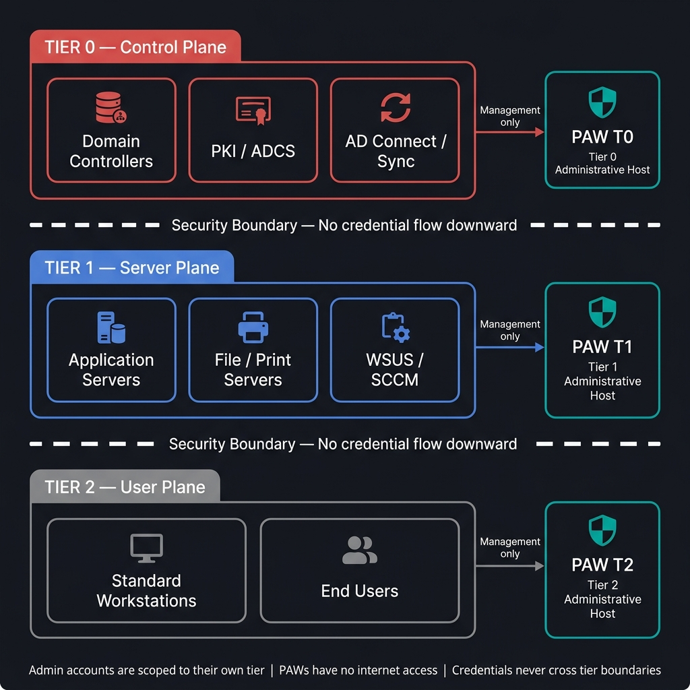
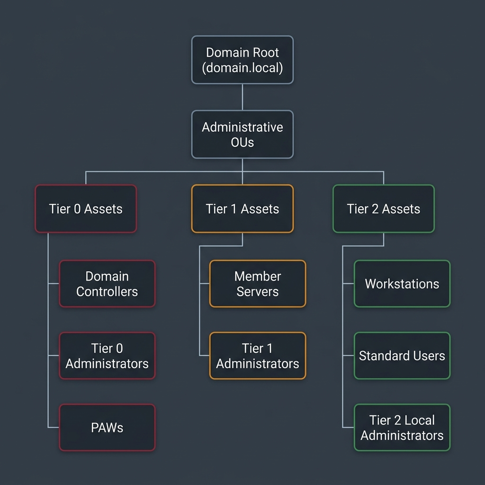

# Module 1: Architecture and Administrative Tiering

This document details the design principles, theoretical concepts, threat vectors, and management rules governing the Active Directory Administrative Tiering Model in secure, air-gapped environments.

---

## 1. Rationale Behind the Tiering Model

Active Directory directory services run as a shared security database where trust is transitive across the entire domain. By default, any account with local administrator rights on a domain-joined machine can access memory components containing active authentication tokens.

If an enterprise administrator uses the same administrative credential (e.g., Domain Admin) to manage a Domain Controller (Tier 0) and log on to a standard workstation or application server (Tier 1/2), those high-privilege credentials remain stored in the Local Security Authority Subsystem Service (LSASS) process memory of the lower-tier system. 

If an attacker compromises that lower-tier server or workstation, they can dump LSASS memory or the cache, steal the Domain Admin credentials, and achieve immediate, full control of the Active Directory database (Tier 0).

The administrative tiering model prevents this escalation pathway by establishing rigid identity boundaries. It restricts privileged accounts to logging on only to systems within their own security tier or higher, ensuring that Tier 0 credentials never reside on less-secure Tier 1 or Tier 2 machines.

---

## 2. Threat Model and Mitigated Attack Vectors

Implementing administrative tiering directly mitigates the most common and critical Active Directory exploit techniques:

### Credential Harvesting from LSASS (Memory Dumping)
* **Threat**: When a user logs on to a Windows machine, the LSASS process caches credentials (hashes, Kerberos tickets, or cleartext passwords depending on OS configuration) to support single sign-on. Tools like Mimikatz allow attackers with local administrator rights on that host to read LSASS memory and extract these secrets.
* **Mitigation**: Under the tiering model, Tier 0 administrators are restricted from logging on to Tier 1 and Tier 2 machines. If an attacker dumps LSASS on a Tier 2 endpoint, they will only find Tier 2 user credentials, preventing them from escalating to domain administrator levels.

### Pass-the-Hash (PtH) and Overpass-the-Hash
* **Threat**: Windows uses NTLM hashes for local and network authentication. Attackers do not need to decrypt NTLM hashes to authenticate; they can present the captured hash directly to target systems to log on as that user.
* **Mitigation**: Enforcing explicit boundaries prevents Tier 0 and Tier 1 hashes from being cached on Tier 2 endpoints, meaning there are no high-tier hashes on standard machines for attackers to pass or relay.

---

## 3. Theoretical Implementation

Enforcing administrative tiering requires structural separation in Active Directory at the Organizational Unit (OU) level, Group Policy level, and account naming level.

### Organizational Unit (OU) Structure
Active Directory OUs must be organized to group assets logically by security level:

### Group Policy Object (GPO) Separation
Separate, distinct GPOs must be created and linked to each tier's OU. Cross-linking GPOs is prohibited:
* **GPO_Hardening_Tier0**: Linked only to the Tier 0 OU. Defines strict Logon Rights, audits NTDS access, and enforces LSA/Credential Guard policies.
* **GPO_Hardening_Tier1**: Linked only to the Tier 1 OU. Configures server security baselines, restricts incoming RDP, and disables legacy protocols.
* **GPO_Hardening_Tier2**: Linked only to the Tier 2 OU. Enforces Workstation Isolation, blocks incoming RPC/SMB from peer workstations, and configures local UAC restrictions.

### Administrative Account Design and Naming Prefixes
Administrators must use distinct accounts depending on the tier they are managing. Standardizing account prefixes facilitates GPO targeting and automated auditing:
* **Tier 0 Accounts (Prefix: `a0-`)**: Members of `Domain Admins`, `Enterprise Admins`, or custom groups delegated to modify Active Directory objects. E.g., `a0-florian`.
* **Tier 1 Accounts (Prefix: `a1-`)**: Used for managing member servers, IIS instances, SQL databases, and enterprise applications. E.g., `a1-florian`.
* **Tier 2 Accounts (Prefix: `a2-`)**: Used for desktop support, local administration on standard workstations, or active helpdesk work. E.g., `a2-florian`.

---

## 4. Operational Management and Administrative Routing

Managing a tiered environment requires strict adherence to operational routing paths.

### Credentials Lifecycle & Hygiene
1. **Interactive Logons**: Tier 0 administrator credentials (`a0-` prefix) must only be entered interactively on PAWs, Tier 0 Jump Hosts, and Domain Controllers. They must never be used in `RunAs` contexts on Tier 1 or Tier 2 machines.
2. **Service Accounts**: Service accounts must be assigned to a specific tier. A service account running an application on a Tier 1 server must never have administrative rights in Active Directory (Tier 0).
3. **Emergency Access Accounts (Break-Glass)**: Enforce highly complex passwords for emergency accounts. Store these passwords in a physical vault (such as a safe) with dual-authorization access requirements, avoiding digital password managers running on standard network subnets.

---

## 5. Technical Hardening Controls

To enforce this theoretical architecture on Domain Controllers and client computers, you must configure the following technical controls:

1. **[REQ-ARCH-001 - Implement Active Directory Administrative Tiering Model](implement-administrative-tiering-model.md)**
   Enforces User Rights Assignment GPOs to implement the Active Directory administrative tiering model by denying Tier 0 administrative accounts from logging on to Tier 1 and Tier 2 machines, and Tier 1 administrative accounts from logging on to Tier 2 machines.

2. **[REQ-ARCH-002 - Restrict Administrative Management Protocols](restrict-mgmt-protocols.md)**
   Enforces network-level restriction of RDP (TCP 3389) and WinRM (TCP 5985/5986) management traffic to specific administrative IP ranges and Jump Host IP addresses.

3. **[REQ-ARCH-003 - Audit Privileged Groups](audit-privileged-groups.md)**
   Enforces regular automated checks on domain administrative groups to ensure no nested memberships or unapproved accounts are assigned Tier 0 rights.
