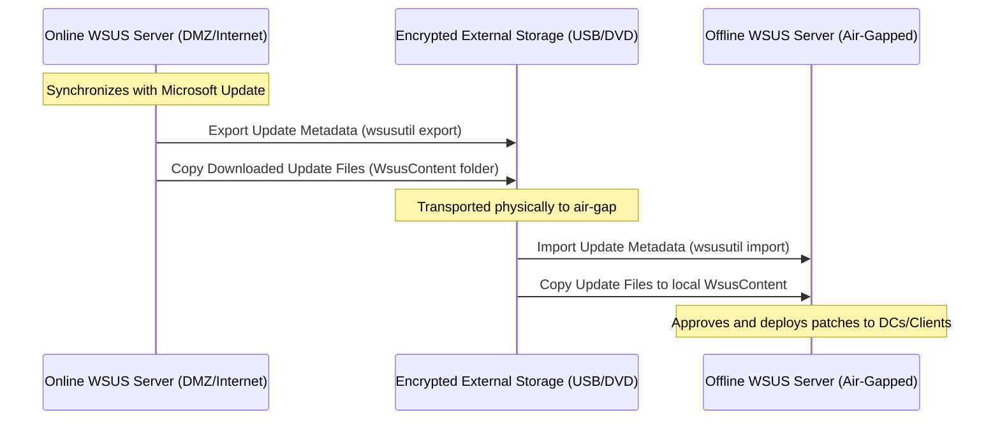

# Module 6: Secure Operations & Maintenance

This module defines the processes and tools required to securely operate, maintain, and assess an isolated Active Directory environment over time. In air-gapped networks, tasks like patching and security assessments must be performed entirely offline.

---

## 1. Backup & Disaster Recovery (ANSSI R54)

Disaster Recovery is a core pillar of Active Directory security. If Domain Controllers are corrupted or compromised, administrators must recover from trusted, clean states.

### System State Backups
* **Frequency**: Create **System State Backups** daily on at least two Domain Controllers.
* **Content**: The System State contains the Active Directory database (`ntds.dit`), the SYSVOL share, registry settings, certificates, and DNS records.
* **Storage Isolation (Offline/Immutable)**: Backups must be stored on separate physical/virtual storage. In high-security systems, enforce write-once-read-many (WORM) storage or store backups in an offline, physically secured media rotation to prevent modifications by compromised accounts.
* **Validation**: Run recovery exercises quarterly in an isolated network sandbox to verify that restored DCs are functional and free of replication loops.

---

## 2. Offline Patch Management (WSUS Offline)

Keeping Domain Controllers and clients patched is critical to resolve OS and RPC vulnerabilities. In air-gapped systems, this requires a sneakernet approach utilizing **Windows Server Update Services (WSUS) import/export**.

### WSUS Import/Export Protocol



### wsusutil Commands
1. **On the Internet-connected WSUS Server**:
   * Export the metadata file:
     ```cmd
     wsusutil.exe export C:\export\metadata.xml.gz C:\export\export.log
     ```
   * Copy `metadata.xml.gz` and the entire `WSUSContent` directory containing patch binaries onto an encrypted storage medium.
2. **On the Air-Gapped WSUS Server**:
   * Place the files locally and import metadata:
     ```cmd
     wsusutil.exe import C:\import\metadata.xml.gz C:\import\import.log
     ```
   * Copy the update binaries into the offline WSUS server's content folder.

---

## 3. Continuous Security Assessments (ANSSI R57)

Administrators must actively search for misconfigurations, weak permissions, and signs of compromise in Active Directory.

### Recommended Offline Assessment Tools
1. **PingCastle**: A highly regarded French utility that evaluates the security level of an Active Directory domain. It runs entirely offline, queries AD via LDAP, and outputs a comprehensive HTML report with a security score and detailed recommendations aligned with ANSSI guidelines.
2. **ADRecon**: A PowerShell tool that extracts Active Directory configuration details and formats them into an Excel workbook. It allows admins to examine user permissions, GPO settings, trusts, and computers.

---

## PowerShell Implementation Guide

### 1. Auditing System State Backup Status (Audit)

Run this script locally on a Domain Controller to query the status and location of recent System State backups using the Windows Server Backup module.

```powershell
# Audit-ADBackupStatus.ps1
# Audits the status of local system state backups.

Import-Module WindowsServerBackup -ErrorAction SilentlyContinue

Write-Host "--- Auditing System State Backup Status ---" -ForegroundColor Cyan

# Check if Windows Server Backup feature is installed
$feature = Get-WindowsFeature -Name Windows-Server-Backup -ErrorAction SilentlyContinue
if ($feature -and $feature.Installed -eq $false) {
    Write-Warning "Windows Server Backup feature is NOT installed on this machine."
    exit 1
}

# Retrieve history of local backups
try {
    $backups = Get-WBBackupSet -ErrorAction Stop
    Write-Host "`n[+] Found $($backups.Count) recorded backup sets." -ForegroundColor Yellow
    
    # Sort and output the most recent backups
    $sortedBackups = $backups | Sort-Object -Property BackupTime -Descending
    foreach ($bk in $sortedBackups | Select-Object -First 5) {
        $containsSystemState = $bk.CatalogFlags -match "SystemState"
        $statusColor = if ($containsSystemState) { "Green" } else { "Yellow" }
        Write-Host "    - Backup Time: $($bk.BackupTime) | Location: $($bk.VolumePath) | Contains SystemState: $containsSystemState" -ForegroundColor $statusColor
    }
} catch {
    Write-Host "[-] No backup records found on the system. System state backups may not be configured." -ForegroundColor Red
}
```

### 2. Creating an Automated System State Backup (Remediation)

Execute the following PowerShell script to install the Windows Server Backup feature, configure a System State backup policy, and execute an immediate System State backup to a designated disk volume (e.g. `E:`).

```powershell
# Set-ADSystemStateBackup.ps1
# Installs Windows Server Backup and executes a System State backup.

Write-Host "--- Initializing System State Backup ---" -ForegroundColor Cyan

# 1. Install Windows Server Backup feature if missing
$feature = Get-WindowsFeature -Name Windows-Server-Backup
if ($feature.Installed -eq $false) {
    Write-Host "[+] Installing Windows Server Backup feature..." -ForegroundColor Gray
    Install-WindowsFeature -Name Windows-Server-Backup -IncludeAllSubFeature | Out-Null
    Write-Host "    Feature installed successfully." -ForegroundColor Green
} else {
    Write-Host "[+] Windows Server Backup feature is already installed." -ForegroundColor Green
}

# Import WSB module
Import-Module WindowsServerBackup

# 2. Define Backup Volume Target
$BackupVolumePath = "E:\" # Replace with your designated offline backup storage disk
if (-not (Test-Path $BackupVolumePath)) {
    Write-Error "Backup target volume '$BackupVolumePath' does not exist. Please specify a valid volume."
    exit 1
}

# 3. Create Backup Policy
Write-Host "[+] Configuring System State Backup Policy..." -ForegroundColor Gray
$policy = New-WBPolicy
Add-WBSystemState -Policy $policy | Out-Null

$backupTarget = New-WBBackupTarget -VolumePath $BackupVolumePath
Add-WBBackupTarget -Policy $policy -Target $backupTarget | Out-Null

Write-Host "    Backup Policy created (Target: $BackupVolumePath, Subject: SystemState)." -ForegroundColor Green

# 4. Execute Backup Job
Write-Host "[+] Starting System State Backup. This process can take several minutes..." -ForegroundColor Yellow
$backupJob = Start-WBBackup -Policy $policy -Async

# Monitor backup job status
while ($backupJob.State -eq "Running" -or $backupJob.State -eq "Verifying") {
    Write-Host "    - Backup Progress: $($backupJob.PercentComplete)% complete..." -ForegroundColor Gray
    Start-Sleep -Seconds 10
    # Refresh backup job status
    $backupJob = Get-WBJob
}

# Final output
$finalJob = Get-WBJob -Previous 1
if ($finalJob.JobState -eq "Completed") {
    Write-Host "`nSystem State Backup Completed successfully!" -ForegroundColor Green
} else {
    Write-Error "`nBackup failed with status: $($finalJob.JobState). Error: $($finalJob.ErrorDescription)"
}
```
