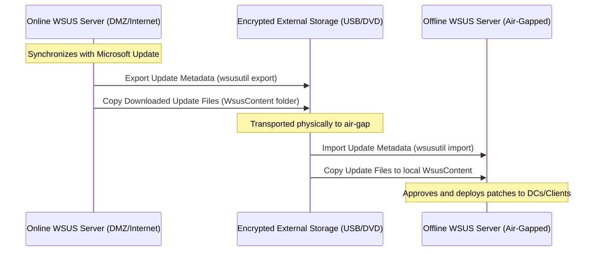

---
launch_options:
  args:
    - --no-sandbox
    - --disable-setuid-sandbox
    - --disable-gpu
pdf_options:
  format: A4
  margin:
    top: 25mm
    bottom: 25mm
    left: 20mm
    right: 20mm
  displayHeaderFooter: true
  headerTemplate: |
    <div style="font-size: 8px; font-family: 'Inter', sans-serif; width: 100%; text-align: right; padding-right: 20mm; color: #9ca3af;">
      Active Directory Hardening Guidebook
    </div>
  footerTemplate: |
    <div style="font-size: 8px; font-family: 'Inter', sans-serif; width: 100%; padding-left: 20mm; padding-right: 20mm; display: flex; justify-content: space-between; color: #9ca3af; border-top: 1px solid #e5e7eb; padding-top: 4px;">
      <span>Commit: b339833 | Generated: June 14, 2026</span>
      <span>Page <span class="pageNumber"></span> of <span class="totalPages"></span></span>
    </div>
---

<div class="cover-page">
  <h1>Active Directory Hardening Guidebook</h1>
  <h2>Production-Grade Hardening Requirements & Guidelines for Air-Gapped Environments</h2>
  <hr>
  <p><strong>Standards Alignment:</strong></p>
  <ul>
    <li>ANSSI (French National Agency for the Security of Information Systems)</li>
    <li>CIS Benchmarks (Center for Internet Security)</li>
    <li>Microsoft Security Baselines</li>
  </ul>
  <p><strong>Target Operating Systems:</strong></p>
  <ul>
    <li>Domain Controllers: Windows Server 2016 and above</li>
    <li>Tier 2 Client Workstations: Windows 10 and above</li>
  </ul>
  <hr>
  <p><em>Generated dynamically on: June 14, 2026</em></p>
</div>

<div id="README-md"></div>

<div id="README-md-active-directory-hardening-guidebook"></div>
# Active Directory Hardening Guidebook

Welcome to the **Active Directory Hardening Guidebook**. This repository contains a structured, production-grade set of hardening requirements and guidelines specifically designed for securing **modern Active Directory (AD) environments** in **air-gapped (offline)** settings. 

The guide is tailored for:
* **Domain Controllers**: Windows Server 2016 (and above).
* **Clients**: Windows 10 (and above) enterprise workstations.
* **Environment**: High-security, isolated (air-gapped) environments with no direct internet connection, no Azure/Entra ID integrations, and no external cloud services.

All security recommendations contained herein are aligned with the following cybersecurity standards:
* **ANSSI** (French National Agency for the Security of Information Systems) - *Hardening an Active Directory Directory Service*
* **CIS Benchmarks** (Center for Internet Security) - *Windows Server 2016 & Windows 10*
* **Microsoft Security Baselines**

---

<div id="README-md-table-of-contents"></div>
### Table of Contents

The guidebook is organized into eight functional modules:

1. **[Module 1: Architecture & Administrative Tiering](#01-architecture-README-md)**
   * Entry point index and technical treatise on Active Directory tiering and administrative boundaries.
   * Hardening controls:
     * [REQ-ARCH-001 - Restrict Tier Logons](#01-architecture-restrict-tier-logons-md)
     * [REQ-ARCH-002 - Restrict Administrative Management Protocols](#01-architecture-restrict-mgmt-protocols-md)
     * [REQ-ARCH-003 - Audit Privileged Groups](#01-architecture-audit-privileged-groups-md)
     * [REQ-ARCH-004 - Keep Domain and Forest Functional Levels Up-To-Date](#01-architecture-keep-functional-levels-up-to-date-md)
     * [REQ-ARCH-005 - Default Domain and Domain Controllers Policies Management](#01-architecture-default-policies-recommendations-md)
     * [REQ-ARCH-006 - Harden Active Directory Domain Trusts](#01-architecture-harden-domain-trusts-md)
2. **[Module 2: Domain Controller Hardening](#02-domain-controllers-README-md)**
   * Operating system-level DC security configuration.
   * Hardening controls:
     * [REQ-DC-001 - Disable SMBv1](#02-domain-controllers-disable-smbv1-md)
     * [REQ-DC-002 - Disable Multicast Name Resolution](#02-domain-controllers-disable-multicast-name-resolution-md)
     * [REQ-DC-003 - Disable NTLMv1](#02-domain-controllers-disable-ntlmv1-md)
     * [REQ-DC-004 - Enforce LDAP Server Signing](#02-domain-controllers-enforce-ldap-signing-md)
     * [REQ-DC-005 - Enforce LDAP Channel Binding](#02-domain-controllers-enforce-ldap-channel-binding-md)
     * [REQ-DC-006 - Enable LSA Protection](#02-domain-controllers-enable-lsa-protection-md)
     * [REQ-DC-007 - Enable Credential Guard](#02-domain-controllers-enable-credential-guard-md)
     * [REQ-DC-008 - Disable Print Spooler Service](#02-domain-controllers-disable-print-spooler-md)
     * [REQ-DC-009 - Enforce SMB Message Signing](#02-domain-controllers-enforce-smb-signing-md)
     * [REQ-DC-010 - Restrict Kerberos Encryption Types](#02-domain-controllers-restrict-kerberos-encryption-md)
     * [REQ-DC-011 - Restrict Remote SAM API Access](#02-domain-controllers-restrict-ntds-sam-api-md)
     * [REQ-DC-012 - Disable Unnecessary Services on Domain Controllers](#02-domain-controllers-disable-unnecessary-services-md)
     * [REQ-DC-013 - Enable Kerberos Armoring](#02-domain-controllers-enable-kerberos-armoring-md)
     * [REQ-DC-014 - Restrict NTLM](#02-domain-controllers-restrict-ntlm-md)
     * [REQ-DC-015 - Migrate SYSVOL Replication to DFSR](#02-domain-controllers-migrate-sysvol-replication-dfsr-md)
     * [REQ-DC-016 - Harden adminSDHolder Permissions](#02-domain-controllers-harden-adminsdholder-permissions-md)
     * [REQ-DC-017 - Harden Microsoft DNS AD Container Permissions](#02-domain-controllers-harden-dns-container-permissions-md)
     * [REQ-DC-018 - Harden Virtualization Hosts for Domain Controllers](#02-domain-controllers-harden-dc-virtualization-hosts-md)
     * [REQ-DC-019 - Enforce RDP Restricted Admin Mode](#02-domain-controllers-enforce-rdp-restricted-admin-md)
     * [REQ-DC-020 - Windows Defender Antivirus Domain Controller Baseline and Exploit Guard](#02-domain-controllers-defender-antivirus-md)
     * [REQ-DC-021 - Configure AppLocker Policies on Domain Controllers](#02-domain-controllers-configure-applocker-policies-md)
3. **[Module 3: Identities & Services Hardening](#03-identities-services-README-md)**
   * Administrative identity protection, credential hygiene, and service account hardening.
   * Hardening controls:
     * [REQ-ID-001 - Enforce Fine-Grained Password Policies](#03-identities-services-enforce-fgpp-md)
     * [REQ-ID-002 - Enable Local Administrator Password Solution (LAPS)](#03-identities-services-enable-laps-md)
     * [REQ-ID-003 - Implement Group Managed Service Accounts (gMSA)](#03-identities-services-harden-service-accounts-md)
     * [REQ-ID-004 - Restrict Kerberos Delegation](#03-identities-services-restrict-kerberos-delegation-md)
     * [REQ-ID-005 - Configure and Populate Protected Users Group](#03-identities-services-configure-protected-users-group-md)
     * [REQ-ID-006 - Rename and Disable Default Administrator and Guest Accounts](#03-identities-services-harden-default-accounts-md)
     * [REQ-ID-007 - Restrict Interactive Logons for Service Accounts](#03-identities-services-restrict-service-account-logons-md)
     * [REQ-ID-008 - Enforce User and Service Account Kerberos Encryption (AES-Only)](#03-identities-services-enforce-user-aes-encryption-md)
     * [REQ-ID-009 - Enforce Kerberos Pre-Authentication](#03-identities-services-enforce-kerberos-preauthentication-md)
     * [REQ-ID-010 - Restrict Schema Administrators Group Membership](#03-identities-services-restrict-schema-admins-md)
     * [REQ-ID-011 - Enforce Accidental Deletion Protection on Organizational Units](#03-identities-services-prevent-accidental-deletion-ous-md)
     * [REQ-ID-012 - Configure Active Directory Authentication Silos and Policies](#03-identities-services-configure-authentication-silos-md)
     * [REQ-ID-013 - Clean Up adminCount Attribute Orphans](#03-identities-services-cleanup-admincount-orphans-md)
     * [REQ-ID-014 - Renew KDS Root Keys and gMSA Secrets](#03-identities-services-renew-kds-keys-gmsa-secrets-md)
     * [REQ-ID-015 - Harden Active Directory Certificate Services (ADCS) and PKI](#03-identities-services-harden-adcs-pki-md)
     * [REQ-ID-016 - Configure Point and Print, ELAM, Logon Screen, and Credentials Delegation](#03-identities-services-configure-point-and-print-md)
     * [REQ-ID-017 - Disable Machine Account Quota](#03-identities-services-disable-machine-account-quota-md)
     * [REQ-ID-018 - Restrict Pre-Windows 2000 Compatible Access Group](#03-identities-services-restrict-pre-windows-2000-compatible-access-group-md)
4. **[Module 4: Network Configuration & Firewalling](#04-network-firewall-README-md)**
   * Active Directory network boundaries, port configurations, and encryption/authentication configurations.
   * Hardening controls:
     * [REQ-NET-001 - Configure Active Directory Port Matrix](#04-network-firewall-configure-ad-port-matrix-md)
     * [REQ-NET-002 - Restrict RPC Dynamic Ports](#04-network-firewall-restrict-rpc-dynamic-ports-md)
     * [REQ-NET-003 - Configure Workstation and Server Isolation](#04-network-firewall-configure-workstation-isolation-md)
     * [REQ-NET-004 - Configure IPsec Domain Isolation](#04-network-firewall-configure-ipsec-domain-isolation-md)
     * [REQ-NET-005 - Harden IPsec Cryptographic Configurations](#04-network-firewall-harden-ipsec-cryptography-md)
     * [REQ-NET-006 - Harden TLS Protocols, Cipher Suites, and Elliptic Curves](#04-network-firewall-harden-tls-configuration-md)
     * [REQ-NET-007 - Enforce SMBv3 Security and Digitally Sign/Encrypt Communications](#04-network-firewall-enforce-smbv3-security-md)
     * [REQ-NET-008 - Configure Firewall Logging and Operational Settings](#04-network-firewall-configure-firewall-logging-md)
     * [REQ-NET-009 - Configure Hardened UNC Paths and LDAP Client Signing](#04-network-firewall-configure-hardened-unc-paths-md)
     * [REQ-NET-010 - Harden WinRM Service and Restrict Remote RPC Clients](#04-network-firewall-harden-winrm-service-md)
5. **[Module 5: Logging, Monitoring & SIEM](#05-logging-monitoring-README-md)**
   * Entry point index for security log auditing, host monitoring, and centralized SIEM ingestion.
   * Hardening controls:
     * [REQ-LOG-001 - Configure Advanced Security Audit Policies](#05-logging-monitoring-configure-advanced-audit-policies-md)
     * [REQ-LOG-002 - Configure PowerShell and Command-Line Auditing](#05-logging-monitoring-configure-powershell-and-command-line-auditing-md)
     * [REQ-LOG-003 - Deploy and Harden Microsoft Sysmon](#05-logging-monitoring-deploy-and-harden-sysmon-md)
     * [REQ-LOG-004 - Configure Secure SIEM Log Shipping](#05-logging-monitoring-configure-siem-log-shipping-md)
6. **[Module 6: Secure Operations & Maintenance](#06-operations-maintenance-README-md)**
   * AD System State backup, restore, and offline immutable storage.
   * Hardening controls:
     * [Secure Operations and Maintenance Baseline](#06-operations-maintenance-ops-and-maintenance-md)
     * [REQ-OPS-001 - Enforce KRBTGT Password Rotation](#06-operations-maintenance-enforce-krbtgt-password-rotation-md)
     * [REQ-OPS-002 - Enable and Configure the Active Directory Recycle Bin](#06-operations-maintenance-enable-recycle-bin-md)
     * [REQ-OPS-003 - Establish and Maintain Group Policy ADMX Central Store](#06-operations-maintenance-maintain-gpo-templates-md)
     * [REQ-OPS-004 - Implement Third-Party and Custom GPO Templates for COTS Hardening](#06-operations-maintenance-use-third-party-templates-md)
     * [REQ-OPS-005 - Configure Dedicated WSUS for Tier 0](#06-operations-maintenance-configure-dedicated-tier0-wsus-md)
7. **[Module 7: Privileged Access Workstations (PAWs) Hardening](#07-paws-README-md)**
   * Physical and operating system isolation rules for administration devices.
   * Hardening controls:
     * [REQ-PAW-001 - Configure AppLocker Policies for PAWs](#07-paws-configure-applocker-policies-md)
     * [REQ-PAW-002 - Enable LSA Protection for PAWs](#07-paws-enable-lsa-protection-md)
     * [REQ-PAW-003 - Restrict Local Administrators Group for PAWs](#07-paws-restrict-local-administrators-md)
     * [REQ-PAW-004 - Enforce BitLocker with TPM and Startup PIN for PAWs](#07-paws-enable-bitlocker-md)
     * [REQ-PAW-005 - UEFI Firmware Security Hardening](#07-paws-configure-uefi-security-md)
     * [REQ-PAW-006 - Enable Hardware Virtualization and DMA Protection](#07-paws-enable-hardware-virtualization-and-dma-protection-md)
     * [REQ-PAW-007 - Disable Windows Platform Binary Table (WPBT)](#07-paws-disable-wpbt-md)
     * [REQ-PAW-008 - Windows Defender Antivirus PAW Baseline and Exploit Guard](#07-paws-defender-antivirus-md)
     * [REQ-PAW-009 - Configure User Rights Assignments for PAWs](#07-paws-configure-user-rights-assignments-md)
     * [REQ-PAW-010 - Enable VBS and Credential Guard for PAWs](#07-paws-enable-vbs-credential-guard-md)
     * [REQ-PAW-011 - Harden DMA and Physical Security for PAWs](#07-paws-harden-dma-and-physical-security-md)
8. **[Module 8: Endpoint Hardening](#08-endpoints-README-md)**
   * Entry point index for Tier 2 workstation security.
   * Hardening controls:
     * [REQ-END-001 - Harden Network Parameters and Disable Legacy Name Resolution](#08-endpoints-harden-network-and-name-resolution-md)
     * [REQ-END-002 - Configure User Account Control Policies](#08-endpoints-configure-uac-policies-md)
     * [REQ-END-003 - Disable AutoPlay and AutoRun](#08-endpoints-disable-autoplay-autorun-md)
     * [REQ-END-004 - Block Removable Storage](#08-endpoints-block-removable-storage-md)
     * [REQ-END-005 - Restrict Remote Desktop Access](#08-endpoints-restrict-rdp-access-md)
     * [REQ-END-006 - Restrict Local Administrators Group](#08-endpoints-restrict-local-admins-md)
     * [REQ-END-007 - Windows Defender Antivirus Baseline and Exploit Guard](#08-endpoints-defender-antivirus-md)
     * [REQ-END-008 - WSUS Client Configuration](#08-endpoints-wsus-client-config-md)
     * [REQ-END-009 - Enable Secure Boot](#08-endpoints-enable-secure-boot-md)
     * [REQ-END-010 - Enable VBS and Credential Guard](#08-endpoints-enable-vbs-credential-guard-md)
     * [REQ-END-011 - Configure Windows Defender Application Control](#08-endpoints-configure-wdac-md)
     * [REQ-END-012 - Enable BitLocker and Network Unlock](#08-endpoints-enable-bitlocker-md)
     * [REQ-END-013 - UEFI Firmware Security Hardening](#08-endpoints-configure-uefi-security-md)
     * [REQ-END-014 - Enable Hardware Virtualization and DMA Protection](#08-endpoints-enable-hardware-virtualization-and-dma-protection-md)
     * [REQ-END-015 - Disable Windows Platform Binary Table (WPBT)](#08-endpoints-disable-wpbt-md)
     * [REQ-END-016 - Configure User Rights Assignments](#08-endpoints-configure-user-rights-assignments-md)
     * [REQ-END-017 - Harden DMA and Physical Security](#08-endpoints-harden-dma-and-physical-security-md)
     * [REQ-END-018 - Configure Account and Password Policies](#08-endpoints-configure-account-policies-md)
     * [REQ-END-019 - Configure User Profile Restrictions](#08-endpoints-configure-user-profile-restrictions-md)
     * [REQ-END-022 - Block Outbound Traffic for Known LOLBins](#08-endpoints-block-lolbins-outbound-traffic-md)

---

<div id="README-md-compliance-mapping-matrices"></div>
## Compliance Mapping Matrices

To ensure full transparency and compliance alignment, the unified compliance matrix has been split into three distinct, dedicated mapping matrices:

*   **[ANSSI Compliance Matrix](#compliance-anssi-md)**: Detailed mapping to the recommendations of the ANSSI Active Directory Hardening Guide.
*   **[CIS Benchmarks Compliance Matrix](#compliance-cis-md)**: Detailed mapping to the Center for Internet Security (CIS) Windows Server and Windows Client Benchmarks.
*   **[Microsoft Security Baselines Compliance Matrix](#compliance-microsoft-md)**: Detailed mapping to Microsoft Security Baselines focus areas.

These detailed matrices extract each control from the respective guidelines and declare its compliance coverage status (**Covered** or **Not Covered**) alongside links to the corresponding technical controls in this guidebook.


---

<div id="README-md-script-verification"></div>
## Script Verification

To ensure that the markdown files contain valid links and that all embedded PowerShell code snippets are syntactically correct, you can run the verification script located in the root of this workspace.

<div id="README-md-running-the-verification-script"></div>
### Running the Verification Script

Open a PowerShell console and run:

```powershell
.\Verify-ADHardeningDocs.ps1
```

The script parses all markdown documents, verifies internal relative links, and runs a syntax parser on all `powershell` code blocks without executing them.


<div style="page-break-before: always;"></div>

<div id="01-architecture-README-md"></div>

<div id="01-architecture-README-md-module-1-architecture-administrative-tiering"></div>
# Module 1: Architecture & Administrative Tiering

This directory contains the Active Directory Administrative Tiering Model definitions, theoretical designs, and technical enforcement controls for secure, air-gapped environments.

<div id="01-architecture-README-md-architecture-treatise-guidelines"></div>
## Architecture Treatise & Guidelines

* **[Tiering and Architecture Overview](#01-architecture-tiering-and-architecture-md)**
  Detailed design treatise covering administrative boundaries (Tier 0, Tier 1, Tier 2), Organizational Unit layout structures, custom naming conventions, credentials hygiene, and management routing from PAWs to DCs via secure jump hosts.

<div id="01-architecture-README-md-technical-hardening-controls"></div>
## Technical Hardening Controls

1. **[REQ-ARCH-001 - Restrict Tier Logons](#01-architecture-restrict-tier-logons-md)**
   Enforces User Rights Assignment GPOs to block high-privilege administrators (Tier 0/1) from authenticating interactively or via network logon on lower-tier computers (Tier 1/2), preventing credential exposure in LSASS memory.

2. **[REQ-ARCH-002 - Restrict Administrative Management Protocols](#01-architecture-restrict-mgmt-protocols-md)**
   Restricts inbound Remote Desktop (RDP) and Windows Remote Management (WinRM) administrative protocols to dedicated, secure administrative subnets and jump hosts.

3. **[REQ-ARCH-003 - Audit Privileged Groups](#01-architecture-audit-privileged-groups-md)**
   Implements automated auditing of Tier 0 administrative Active Directory groups to detect nested memberships and unauthorized additions.

4. **[REQ-ARCH-004 - Keep Domain and Forest Functional Levels Up-To-Date](#01-architecture-keep-functional-levels-up-to-date-md)**
   Recommends migrating Domain and Forest Functional Levels to Windows Server 2016 or higher to unlock critical security features like the Protected Users group, gMSAs, and Kerberos Armoring.

5. **[REQ-ARCH-005 - Default Domain and Domain Controllers Policies Management](#01-architecture-default-policies-recommendations-md)**
   Provides structural guidelines to separate custom hardening policies into dedicated, modular GPOs rather than directly editing Default Domain/DC policies, protecting the forest baseline.

6. **[REQ-ARCH-006 - Harden Active Directory Domain Trusts](#01-architecture-harden-domain-trusts-md)**
   Hardens trust relationships across forest and external boundaries by disabling SID History, enabling Quarantine (SID filtering), enforcing Selective Authentication, and blocking Kerberos TGT Delegation.


<div style="page-break-before: always;"></div>

<div id="01-architecture-tiering-and-architecture-md"></div>

<div id="01-architecture-tiering-and-architecture-md-module-1-architecture-and-administrative-tiering"></div>
# Module 1: Architecture and Administrative Tiering

This document details the design principles, theoretical concepts, threat vectors, and management rules governing the Active Directory Administrative Tiering Model in secure, air-gapped environments.

---

<div id="01-architecture-tiering-and-architecture-md-1-rationale-behind-the-tiering-model"></div>
## 1. Rationale Behind the Tiering Model

Active Directory directory services run as a shared security database where trust is transitive across the entire domain. By default, any account with local administrator rights on a domain-joined machine can access memory components containing active authentication tokens.

If an enterprise administrator uses the same administrative credential (e.g., Domain Admin) to manage a Domain Controller (Tier 0) and log on to a standard workstation or application server (Tier 1/2), those high-privilege credentials remain stored in the Local Security Authority Subsystem Service (LSASS) process memory of the lower-tier system. 

If an attacker compromises that lower-tier server or workstation (via email phishing or local web browser exploit), they can dump LSASS memory, steal the Domain Admin credentials, and achieve immediate, full control of the Active Directory database (Tier 0). 

The administrative tiering model prevents this escalation pathway by establishing rigid identity boundaries. It restricts privileged accounts to logging on only to systems within their own security tier or higher, ensuring that Tier 0 credentials never reside on less-secure Tier 1 or Tier 2 machines.

---

<div id="01-architecture-tiering-and-architecture-md-2-threat-model-and-mitigated-attack-vectors"></div>
## 2. Threat Model and Mitigated Attack Vectors

Implementing administrative tiering directly mitigates the most common and critical Active Directory exploit techniques:

<div id="01-architecture-tiering-and-architecture-md-credential-harvesting-from-lsass-memory-dumping"></div>
### Credential Harvesting from LSASS (Memory Dumping)
* **Threat**: When a user logs on to a Windows machine, the LSASS process caches credentials (hashes, Kerberos tickets, or cleartext passwords depending on OS configuration) to support single sign-on. Tools like Mimikatz allow attackers with local administrator rights on that host to read LSASS memory and extract these secrets.
* **Mitigation**: Under the tiering model, Tier 0 administrators are restricted from logging on to Tier 1 and Tier 2 machines. If an attacker dumps LSASS on a Tier 2 endpoint, they will only find Tier 2 user credentials, preventing them from escalating to domain administrator levels.

<div id="01-architecture-tiering-and-architecture-md-pass-the-hash-pth-and-overpass-the-hash"></div>
### Pass-the-Hash (PtH) and Overpass-the-Hash
* **Threat**: Windows uses NTLM hashes for local and network authentication. Attackers do not need to decrypt NTLM hashes to authenticate; they can present the captured hash directly to target systems to log on as that user.
* **Mitigation**: Enforcing explicit boundaries prevents Tier 0 and Tier 1 hashes from being cached on Tier 2 endpoints, meaning there are no high-tier hashes on standard machines for attackers to pass or relay.

<div id="01-architecture-tiering-and-architecture-md-coercion-and-relay-attacks-eg-petitpotam-printer-bug"></div>
### Coercion and Relay Attacks (e.g., PetitPotam, Printer Bug)
* **Threat**: Attackers coercion tools force a machine account (such as a Domain Controller) to initiate an authentication request to an attacker-controlled listener. The attacker then relays this machine credential to other services (like Active Directory Certificate Services) to generate domain administrator certificates.
* **Mitigation**: Active Directory tiering, coupled with workstation isolation and network boundaries, blocks cross-tier network protocols (such as SMB/RPC) between workstations and Domain Controllers, preventing the relay path.

---

<div id="01-architecture-tiering-and-architecture-md-3-theoretical-implementation"></div>
## 3. Theoretical Implementation

Enforcing administrative tiering requires structural separation in Active Directory at the Organizational Unit (OU) level, Group Policy level, and account naming level.

<div id="01-architecture-tiering-and-architecture-md-organizational-unit-ou-structure"></div>
### Organizational Unit (OU) Structure
Active Directory OUs must be organized to group assets logically by security level:

```text
Domain Root (domain.local)
+- Administrative OUs
|  +- Tier 0 Assets
|  |  +- Domain Controllers
|  |  +- Tier 0 Administrators
|  |  +- PAWs
|  +- Tier 1 Assets
|  |  +- Member Servers
|  |  +- Tier 1 Administrators
|  +- Tier 2 Assets
|  |  +- Workstations
|  |  +- Standard Users
|  |  +- Tier 2 Local Administrators
```

<div id="01-architecture-tiering-and-architecture-md-group-policy-object-gpo-separation"></div>
### Group Policy Object (GPO) Separation
Separate, distinct GPOs must be created and linked to each tier's OU. Cross-linking GPOs is prohibited:
* **GPO_Hardening_Tier0**: Linked only to the Tier 0 OU. Defines strict Logon Rights, audits NTDS access, and enforces LSA/Credential Guard policies.
* **GPO_Hardening_Tier1**: Linked only to the Tier 1 OU. Configures server security baselines, restricts incoming RDP, and disables legacy protocols.
* **GPO_Hardening_Tier2**: Linked only to the Tier 2 OU. Enforces Workstation Isolation, blocks incoming RPC/SMB from peer workstations, and configures local UAC restrictions.

<div id="01-architecture-tiering-and-architecture-md-administrative-account-design-and-naming-prefixes"></div>
### Administrative Account Design and Naming Prefixes
Administrators must use distinct accounts depending on the tier they are managing. Standardizing account prefixes facilitates GPO targeting and automated auditing:
* **Tier 0 Accounts (Prefix: `a0-`)**: Members of `Domain Admins`, `Enterprise Admins`, or custom groups delegated to modify Active Directory objects. E.g., `a0-florian`.
* **Tier 1 Accounts (Prefix: `a1-`)**: Used for managing member servers, IIS instances, SQL databases, and enterprise applications. E.g., `a1-florian`.
* **Tier 2 Accounts (Prefix: `a2-`)**: Used for desktop support, local administration on standard workstations, or active helpdesk work. E.g., `a2-florian`.

---

<div id="01-architecture-tiering-and-architecture-md-4-operational-management-and-administrative-routing"></div>
## 4. Operational Management and Administrative Routing

Managing a tiered environment requires strict adherence to operational routing paths.

<div id="01-architecture-tiering-and-architecture-md-management-routing-paw-to-jump-host-to-dc"></div>
### Management Routing: PAW to Jump Host to DC
Administrators must never connect directly to Domain Controllers from standard workstations. All administrative access must follow this path:

```text
[Daily Workstation] -> Email, web browsing, documentation (No admin tasks allowed)
       |
[Physical PAW] -> Tier 0 management host (No internet access, strict AppLocker)
       |  (RDP / WinRM over secure subnet)
       v
[Tier 0 Jump Host] -> Isolated server used as a proxy console
       |  (Restricted RDP / RSAT tools)
       v
[Domain Controller] -> Tier 0 database server
```

<div id="01-architecture-tiering-and-architecture-md-credentials-lifecycle-hygiene"></div>
### Credentials Lifecycle & Hygiene
1. **Interactive Logons**: Tier 0 administrator credentials (`a0-` prefix) must only be entered interactively on PAWs, Tier 0 Jump Hosts, and Domain Controllers. They must never be used in `RunAs` contexts on Tier 1 or Tier 2 machines.
2. **Service Accounts**: Service accounts must be assigned to a specific tier. A service account running an application on a Tier 1 server must never have administrative rights in Active Directory (Tier 0).
3. **Emergency Access Accounts (Break-Glass)**: Enforce highly complex passwords for emergency accounts. Store these passwords in a physical vault (such as a safe) with dual-authorization access requirements, avoiding digital password managers running on standard network subnets.

---

<div id="01-architecture-tiering-and-architecture-md-5-technical-hardening-controls"></div>
## 5. Technical Hardening Controls

To enforce this theoretical architecture on Domain Controllers and client computers, you must configure the following technical controls:

1. **[REQ-ARCH-001 - Restrict Tier Logons](#01-architecture-restrict-tier-logons-md)**
   Enforces User Rights Assignment GPOs to deny Tier 0 administrative accounts from logging on to Tier 1 and Tier 2 machines, and Tier 1 administrative accounts from logging on to Tier 2 machines.

2. **[REQ-ARCH-002 - Restrict Administrative Management Protocols](#01-architecture-restrict-mgmt-protocols-md)**
   Enforces network-level restriction of RDP (TCP 3389) and WinRM (TCP 5985/5986) management traffic to specific administrative IP ranges and Jump Host IP addresses.

3. **[REQ-ARCH-003 - Audit Privileged Groups](#01-architecture-audit-privileged-groups-md)**
   Enforces regular automated checks on domain administrative groups to ensure no nested memberships or unapproved accounts are assigned Tier 0 rights.


<div style="page-break-before: always;"></div>

<div id="01-architecture-restrict-tier-logons-md"></div>

<div id="01-architecture-restrict-tier-logons-md-req-arch-001-restrict-tier-logons"></div>
# [REQ-ARCH-001] Restrict Tier Logons

<div id="01-architecture-restrict-tier-logons-md-target-scope"></div>
## Target Scope
* **Applicable Systems**: Tier 1 member servers and Tier 2 client workstations.
* **Operating Systems**: Windows Server 2016 (and above), Windows 10 (and above) Enterprise/Professional.

---

<div id="01-architecture-restrict-tier-logons-md-implementation-details"></div>
## Implementation Details
* **Priority**: High
* **GPO Path / Registry Location**:
  * Computer Configuration\Policies\Windows Settings\Security Settings\Local Policies\User Rights Assignment

---

<div id="01-architecture-restrict-tier-logons-md-rationale"></div>
## Rationale
To successfully enforce the administrative tiering model, the boundaries must be programmatically restricted. Active Directory administrative groups (such as `Domain Admins`, `Enterprise Admins`, and `Schema Admins`) must be explicitly blocked from authenticating to lower-tier systems. 

If these permissions are not restricted, a Tier 0 administrator might use their account to troubleshoot a Tier 1 server or Tier 2 workstation. This action caches their administrative password hash or Kerberos Ticket Granting Ticket (TGT) in the local memory of the target machine. If that machine has been compromised, an attacker can extract those credentials and compromise the entire Active Directory domain.

By configuring Group Policy objects to explicitly deny logon rights (interactive, network, and Remote Desktop) for high-tier administrative accounts on lower-tier systems, you prevent accidental or unauthorized exposure of high-privilege credentials.

---

<div id="01-architecture-restrict-tier-logons-md-legacy-impact-compatibility"></div>
## Legacy Impact & Compatibility
* **Administration Access**: Technicians cannot log on to workstations or member servers using Domain Admin accounts. They must use dedicated administrative credentials assigned to that specific tier (e.g., `a2-florian` for workstation support) or use local administrator accounts managed by LAPS.
* **Remote Support Tools**: Automated support tools or scripts that authenticate using Domain Admin accounts to query local client registry hives or modify system files will be blocked. These tools must be reconfigured to authenticate using dedicated service accounts or Tier 1/2 administrative accounts.

---

<div id="01-architecture-restrict-tier-logons-md-implementation-steps"></div>
## Implementation Steps

<div id="01-architecture-restrict-tier-logons-md-option-a-group-policy-object-gpo-configuration-preferred"></div>
### Option A: Group Policy Object (GPO) Configuration (Preferred)

To prevent Tier 0 credentials from being exposed on Tier 1 and Tier 2 systems, configure the logon restrictions using GPOs linked to the Tier 1 (Member Servers) and Tier 2 (Workstations) OUs.

<div id="01-architecture-restrict-tier-logons-md-1-configure-tier-1-logon-restrictions-gpo"></div>
#### 1. Configure Tier 1 Logon Restrictions GPO
1. Open the **Group Policy Management Console** (`gpmc.msc`).
2. Create a GPO linked to the **Tier 1 Member Servers** OU (e.g., `GPO_Restrictions_Tier1`).
3. Navigate to:
   `Computer Configuration\Policies\Windows Settings\Security Settings\Local Policies\User Rights Assignment`
4. Define and configure the following policies:
   * **Deny access to this computer from the network**: Add `Domain Admins`, `Enterprise Admins`, `Schema Admins`.
   * **Deny log on as a batch job**: Add `Domain Admins`, `Enterprise Admins`, `Schema Admins`.
   * **Deny log on as a service**: Add `Domain Admins`, `Enterprise Admins`, `Schema Admins`.
   * **Deny log on locally**: Add `Domain Admins`, `Enterprise Admins`, `Schema Admins`.
   * **Deny log on through Remote Desktop Services**: Add `Domain Admins`, `Enterprise Admins`, `Schema Admins`.

<div id="01-architecture-restrict-tier-logons-md-2-configure-tier-2-logon-restrictions-gpo"></div>
#### 2. Configure Tier 2 Logon Restrictions GPO
1. Create a GPO linked to the **Tier 2 Workstations** OU (e.g., `GPO_Restrictions_Tier2`).
2. Navigate to the same path:
   `Computer Configuration\Policies\Windows Settings\Security Settings\Local Policies\User Rights Assignment`
3. Configure the policies to deny access for **both** Tier 0 and Tier 1 administrative groups:
   * **Deny access to this computer from the network**: Add Tier 0 groups (`Domain Admins`, `Enterprise Admins`, `Schema Admins`) and Tier 1 administrative groups.
   * **Deny log on as a batch job**: Add Tier 0 and Tier 1 administrative groups.
   * **Deny log on as a service**: Add Tier 0 and Tier 1 administrative groups.
   * **Deny log on locally**: Add Tier 0 and Tier 1 administrative groups.
   * **Deny log on through Remote Desktop Services**: Add Tier 0 and Tier 1 administrative groups.

---

<div id="01-architecture-restrict-tier-logons-md-option-b-powershell-registry-configuration-remediation-non-gpo"></div>
### Option B: PowerShell & Registry Configuration (Remediation / Non-GPO)

Use this script to configure local security database files via `secedit` to deny specified administrative groups from logging on locally, over the network, or via Remote Desktop.

[Download Script: Set-LocalLogonRestrictions.ps1](implementation_scripts/Set-LocalLogonRestrictions.ps1)

```powershell
# Set-LocalLogonRestrictions.ps1
# Configures secedit User Rights Assignment to block domain administrative groups.

# 1. Define groups to block (Tier 0 admin groups)
$DenyGroups = @("Domain Admins", "Enterprise Admins", "Schema Admins")

# 2. Translate group names to SID strings
$SIDs = foreach ($group in $DenyGroups) {
    try {
        $sid = (New-Object System.Security.Principal.NTAccount($group)).Translate([System.Security.Principal.SecurityIdentifier]).Value
        "*$sid"
    } catch {
        Write-Warning "Could not resolve SID for group: $group. Skipping."
    }
}

if ($SIDs.Count -eq 0) {
    Write-Error "No valid group SIDs resolved. Exiting."
    exit 1
}

# 3. Define the temporary paths for secedit config
$tempDir = [System.IO.Path]::GetTempPath()
$secConfigPath = Join-Path $tempDir "sec_config.inf"
$secDbPath = Join-Path $tempDir "sec_db.sdb"

# 4. Export current local security policy
secedit /export /cfg $secConfigPath /areas USER_RIGHTS /quiet

# 5. Modify exported config to inject our deny rules
$configContent = Get-Content -Path $secConfigPath
$NewContent = [System.Collections.Generic.List[string]]::new()
$InUserRights = $false

$PolicyEntries = @(
    "SeDenyInteractiveLogonRight",
    "SeDenyNetworkLogonRight",
    "SeDenyRemoteInteractiveLogonRight"
)

foreach ($line in $configContent) {
    if ($line -match '^\[Privilege Rights\]') {
        $InUserRights = $true
        $NewContent.Add($line)
        continue
    }
    if ($InUserRights -and $line -match '^\[') {
        $InUserRights = $false
    }
    
    # Filter out existing lines for the policies we configure
    $matched = $false
    foreach ($entry in $PolicyEntries) {
        if ($line -match "^$entry\s*=") {
            $matched = $true
            break
        }
    }
    
    if (-not $matched) {
        $NewContent.Add($line)
    }
}

# Insert new rules into [Privilege Rights] section
$InsertIndex = $NewContent.FindIndex({ $args[0] -match '^\[Privilege Rights\]' })
if ($InsertIndex -ge 0) {
    $Offset = 1
    $FormattedSIDs = $SIDs -join ","
    foreach ($policy in $PolicyEntries) {
        $NewContent.Insert($InsertIndex + $Offset, "$policy = $FormattedSIDs")
        $Offset++
    }
}

# Save new configuration
$NewContent | Out-File -FilePath $secConfigPath -Encoding utf16

# 6. Apply configuration using secedit
Write-Host "Applying User Rights Assignment restrictions via secedit..." -ForegroundColor Cyan
$process = Start-Process secedit -ArgumentList "/configure /db $secDbPath /cfg $secConfigPath /areas USER_RIGHTS /quiet" -Wait -NoNewWindow -PassThru

# Cleanup temporary database files
if (Test-Path $secConfigPath) { Remove-Item $secConfigPath -Force }
if (Test-Path $secDbPath) { Remove-Item $secDbPath -Force }

if ($process.ExitCode -eq 0) {
    Write-Host "Logon restrictions applied successfully." -ForegroundColor Green
} else {
    Write-Error "Failed to apply logon restrictions. Exit code: $($process.ExitCode)"
}
```

*To audit active logon restriction settings locally:*
[Download Script: Test-LocalLogonRestrictions.ps1](audit_scripts/Test-LocalLogonRestrictions.ps1)

```powershell
# Test-LocalLogonRestrictions.ps1
# Audits local security policies to check if SeDeny rights are populated.

Write-Host "--- Auditing Local User Rights Assignments ---" -ForegroundColor Cyan

$tempDir = [System.IO.Path]::GetTempPath()
$secConfigPath = Join-Path $tempDir "sec_audit.inf"

# Export current configuration
secedit /export /cfg $secConfigPath /areas USER_RIGHTS /quiet

$configContent = Get-Content -Path $secConfigPath
$PoliciesToTest = @(
    "SeDenyInteractiveLogonRight",
    "SeDenyNetworkLogonRight",
    "SeDenyRemoteInteractiveLogonRight"
)

foreach ($policy in $PoliciesToTest) {
    $match = $configContent | Where-Object { $_ -match "^$policy\s*=" }
    if ($match) {
        # Check if it contains domain admin or other groups
        Write-Host "    - Policy '$policy' is configured: $match" -ForegroundColor Green
    } else {
        Write-Host "    - VULNERABLE: Policy '$policy' is not defined (No accounts denied)." -ForegroundColor Red
    }
}

if (Test-Path $secConfigPath) { Remove-Item $secConfigPath -Force }
```

---

<div id="01-architecture-restrict-tier-logons-md-sources-compliance-references"></div>
## 🔗 Sources & Compliance References
* **ANSSI AD Hardening Guide**: Recommendations R1, R2, and R3 (Administrative isolation and account restriction rules)
* **CIS Microsoft Windows Server 2016 Benchmark**: Section 18.2 (User Rights Assignment)


<div style="page-break-before: always;"></div>

<div id="01-architecture-restrict-mgmt-protocols-md"></div>

<div id="01-architecture-restrict-mgmt-protocols-md-req-arch-002-restrict-administrative-management-protocols"></div>
# [REQ-ARCH-002] Restrict Administrative Management Protocols

<div id="01-architecture-restrict-mgmt-protocols-md-target-scope"></div>
## Target Scope
* **Applicable Systems**: Tier 0 assets (Domain Controllers, Jump Hosts) and Tier 1 member servers.
* **Operating Systems**: Windows Server 2016 (and above), Windows 10 (and above) Enterprise/Professional.

---

<div id="01-architecture-restrict-mgmt-protocols-md-implementation-details"></div>
## Implementation Details
* **Priority**: High
* **GPO Path / Registry Location**:
  * Computer Configuration\Policies\Windows Settings\Security Settings\Windows Defender Firewall with Advanced Security\Windows Defender Firewall with Advanced Security

---

<div id="01-architecture-restrict-mgmt-protocols-md-rationale"></div>
## Rationale
Remote management protocols like Remote Desktop Protocol (RDP) and Windows Remote Management (WinRM) are critical interfaces for directory administration. However, if these protocols are accessible from any host in the network, they become high-value targets for attackers.

If an attacker compromises a standard user workstation (Tier 2), they can run network scanners to identify all machines listening on port 3389 (RDP) or 5985/5986 (WinRM). They can then attempt password spraying or locate open administrative sessions. 

Restricting administrative protocols at the network and local firewall levels to allow inbound connections *only* from designated administrative jump hosts or PAW IP ranges stops lateral movement and brute-force attempts from standard user networks.

---

<div id="01-architecture-restrict-mgmt-protocols-md-legacy-impact-compatibility"></div>
## Legacy Impact & Compatibility
* **Administration Location**: Administrators cannot manage Domain Controllers or member servers from standard client subnets. They must be physically connected to the dedicated administrative subnet or log on from a designated PAW.
* **Network Planning**: Any changes to administrative IP address ranges require updating GPO firewall rules. If IP assignments are incorrect, administrators can be locked out of remote management interfaces.

---

<div id="01-architecture-restrict-mgmt-protocols-md-implementation-steps"></div>
## Implementation Steps

<div id="01-architecture-restrict-mgmt-protocols-md-option-a-group-policy-object-gpo-configuration-preferred"></div>
### Option A: Group Policy Object (GPO) Configuration (Preferred)

1. Open the **Group Policy Management Console** (`gpmc.msc`).
2. Create or edit the GPO linked to the **Domain Controllers** OU (e.g., `GPO_Hardening_DomainControllers`).
3. Navigate to:
   `Computer Configuration\Policies\Windows Settings\Security Settings\Windows Defender Firewall with Advanced Security\Windows Defender Firewall with Advanced Security`
4. Expand **Inbound Rules**.
5. Locate the rule **Remote Desktop - User Mode (TCP-In)** (or create a custom inbound port rule for TCP port 3389).
6. Double-click the rule, navigate to the **Scope** tab, and configure:
   * **Remote IP address**: Click **These IP addresses** and enter the specific IP range of the Tier 0 Jump Hosts and PAWs (e.g., `10.10.0.0/24`). Do not allow "Any IP address".
7. Locate the rule **Windows Remote Management (HTTP-In)** (TCP port 5985/5986).
8. Double-click the rule, navigate to the **Scope** tab, and enter the same administrative IP range under **Remote IP address**.
9. Enforce blocking of any other inbound connections by ensuring the default firewall action for the profile is set to block inbound connections that do not match an allow rule.

---

<div id="01-architecture-restrict-mgmt-protocols-md-option-b-powershell-registry-configuration-remediation-non-gpo"></div>
### Option B: PowerShell & Registry Configuration (Remediation / Non-GPO)

Run the following scripts locally on a Domain Controller or member server to create Windows Defender Firewall rules restricting WinRM and RDP to authorized subnets.

[Download Script: Set-AdminProtocolRestrictions.ps1](implementation_scripts/Set-AdminProtocolRestrictions.ps1)

```powershell
# Set-AdminProtocolRestrictions.ps1
# Creates inbound firewall rules to restrict RDP and WinRM to designated management subnets.

Write-Host "--- Restricting Administrative Protocols Inbound ---" -ForegroundColor Cyan

# Define the authorized administrative network subnet
$AdminSubnet = "10.10.0.0/24" # Replace with your PAW / Jump Host subnet

# 1. Restrict RDP (TCP port 3389) Inbound
$RdpRule = Get-NetFirewallRule -DisplayName "Remote Desktop - User Mode (TCP-In)" -ErrorAction SilentlyContinue
if ($RdpRule) {
    Write-Host "[+] Restricting existing RDP firewall rule to admin subnet..." -ForegroundColor Gray
    Set-NetFirewallRule -DisplayName "Remote Desktop - User Mode (TCP-In)" -RemoteAddress $AdminSubnet
    Write-Host "    RDP rule restricted." -ForegroundColor Green
} else {
    Write-Host "[+] Creating new restricted RDP inbound rule..." -ForegroundColor Gray
    New-NetFirewallRule -DisplayName "Hardening: Restricted RDP Inbound" `
        -Direction Inbound `
        -Action Allow `
        -Protocol TCP `
        -LocalPort 3389 `
        -RemoteAddress $AdminSubnet `
        -Enabled True | Out-Null
    Write-Host "    Restricted RDP rule created." -ForegroundColor Green
}

# 2. Restrict WinRM HTTPS (TCP port 5986) Inbound
$WinRMRule = Get-NetFirewallRule -DisplayName "Windows Remote Management (HTTPS-In)" -ErrorAction SilentlyContinue
if ($WinRMRule) {
    Write-Host "[+] Restricting existing WinRM HTTPS rule to admin subnet..." -ForegroundColor Gray
    Set-NetFirewallRule -DisplayName "Windows Remote Management (HTTPS-In)" -RemoteAddress $AdminSubnet
    Write-Host "    WinRM rule restricted." -ForegroundColor Green
} else {
    Write-Host "[+] Creating new restricted WinRM HTTPS inbound rule..." -ForegroundColor Gray
    New-NetFirewallRule -DisplayName "Hardening: Restricted WinRM HTTPS Inbound" `
        -Direction Inbound `
        -Action Allow `
        -Protocol TCP `
        -LocalPort 5986 `
        -RemoteAddress $AdminSubnet `
        -Enabled True | Out-Null
    Write-Host "    Restricted WinRM rule created." -ForegroundColor Green
}
```

*To audit the firewall restrictions:*
[Download Script: Test-AdminProtocolRestrictions.ps1](audit_scripts/Test-AdminProtocolRestrictions.ps1)

```powershell
# Test-AdminProtocolRestrictions.ps1
# Audits local firewall rules for RDP and WinRM to check remote address restrictions.

Write-Host "--- Auditing Administrative Port Firewall Rules ---" -ForegroundColor Cyan

$Rules = @(
    "Remote Desktop - User Mode (TCP-In)",
    "Windows Remote Management (HTTPS-In)",
    "Hardening: Restricted RDP Inbound",
    "Hardening: Restricted WinRM HTTPS Inbound"
)

foreach ($RuleName in $Rules) {
    $Rule = Get-NetFirewallRule -DisplayName $RuleName -ErrorAction SilentlyContinue
    if ($Rule) {
        $Address = Get-NetFirewallAddressFilter -AssociatedNetFirewallRule $Rule
        $color = if ($Address.RemoteAddress -ne "Any" -and $Address.RemoteAddress -ne "") { "Green" } else { "Red" }
        Write-Host "    - Firewall Rule: $($Rule.DisplayName) | Enabled: $($Rule.Enabled) | RemoteAddress Restriction: $($Address.RemoteAddress)" -ForegroundColor $color
    }
}
```

---

<div id="01-architecture-restrict-mgmt-protocols-md-sources-compliance-references"></div>
## 🔗 Sources & Compliance References
* **ANSSI AD Hardening Guide**: Recommendation R8 (Dedicated management subnets and jump hosts)
* **CIS Microsoft Windows Server 2016 Benchmark**: Section 19 (Windows Defender Firewall)


<div style="page-break-before: always;"></div>

<div id="01-architecture-audit-privileged-groups-md"></div>

<div id="01-architecture-audit-privileged-groups-md-req-arch-003-audit-privileged-groups"></div>
# [REQ-ARCH-003] Audit Privileged Groups

<div id="01-architecture-audit-privileged-groups-md-target-scope"></div>
## Target Scope
* **Applicable Systems**: Active Directory Domain.
* **Operating Systems**: Windows Server 2016 (and above) Domain Controllers.

---

<div id="01-architecture-audit-privileged-groups-md-implementation-details"></div>
## Implementation Details
* **Priority**: High
* **GPO Path / Registry Location**:
  * Active Directory Directory Service Changes Auditing (GPO: Computer Configuration\Policies\Windows Settings\Security Settings\Advanced Audit Policy Configuration\Audit Policies\DS Access)

---

<div id="01-architecture-audit-privileged-groups-md-rationale"></div>
## Rationale
Attackers who gain initial access to an Active Directory domain attempt to elevate their privileges to Tier 0. A primary method for establishing domain persistence is adding compromised domain accounts to highly privileged administrative groups, such as `Domain Admins`, `Enterprise Admins`, `Schema Admins`, or `Builtin\Administrators`.

If these groups are not audited continuously:
1. **Backdoor Persistence**: Attackers can add temporary users to administrative groups and remove them later, leaving backdoor accounts with administrative authority that go unnoticed.
2. **Privilege Creep**: Unmanaged administrative accounts accumulate over time, violating the principle of least privilege.
3. **Delegation Risks**: Administrative accounts can inherit unintended administrative rights if nested within other groups.

Enforcing advanced auditing on directory object changes, combined with a daily script to monitor privileged group members, ensures immediate visibility into unauthorized modifications.

---

<div id="01-architecture-audit-privileged-groups-md-legacy-impact-compatibility"></div>
## Legacy Impact & Compatibility
* **Auditing Load**: Directory Service changes logging (Event ID 5136) can generate a high volume of events on Domain Controllers in large environments. Ensure event logs have appropriate size allocations and logs are shipped to a local SIEM.
* **Operational Workflows**: Administrators must use standard change management procedures when adding or removing accounts from administrative groups to avoid generating false-positive security alerts.

---

<div id="01-architecture-audit-privileged-groups-md-implementation-steps"></div>
## Implementation Steps

<div id="01-architecture-audit-privileged-groups-md-option-a-group-policy-object-gpo-configuration-preferred"></div>
### Option A: Group Policy Object (GPO) Configuration (Preferred)

To generate events when administrative group membership is altered:
1. Open the **Group Policy Management Console** (`gpmc.msc`).
2. Create or edit the GPO linked to the **Domain Controllers** OU (e.g., `GPO_Hardening_DomainControllers`).
3. Navigate to:
   `Computer Configuration\Policies\Windows Settings\Security Settings\Advanced Audit Policy Configuration\Audit Policies\DS Access`
4. Configure the setting:
   * **Policy**: `Audit Directory Service Changes`
   * **Setting**: `Enabled` (Select `Success` and `Failure`)

This ensures that Event ID **5136** is logged in the Security log of the Domain Controller whenever an Active Directory object attribute (such as a group's `member` attribute) is changed.

---

<div id="01-architecture-audit-privileged-groups-md-option-b-powershell-registry-configuration-remediation-non-gpo"></div>
### Option B: PowerShell & Registry Configuration (Remediation / Non-GPO)

Run this script from a secure administrative workstation to audit nested and direct memberships in critical Tier 0 groups, highlighting any unexpected accounts.

[Download Script: Audit-ADAdminGroups.ps1](audit_scripts/Audit-ADAdminGroups.ps1)

```powershell
# Audit-ADAdminGroups.ps1
# Queries memberships of privileged Tier 0 AD groups recursively.

Import-Module ActiveDirectory

$Tier0Groups = @(
    "Domain Admins",
    "Enterprise Admins",
    "Schema Admins",
    "Administrators",
    "Account Operators",
    "Server Operators",
    "Backup Operators"
)

Write-Host "--- Auditing Privileged AD Groups ---" -ForegroundColor Cyan

# Define the list of explicitly authorized accounts (e.g. emergency break-glass account)
$AuthorizedUsers = @("Administrator", "a0-breakglass")

foreach ($GroupName in $Tier0Groups) {
    try {
        $Group = Get-ADGroup -Identity $GroupName -ErrorAction Stop
        $Members = Get-ADGroupMember -Identity $GroupName -Recursive
        
        Write-Host "`n[+] Group: $($Group.Name)" -ForegroundColor Yellow
        if ($Members.Count -eq 0) {
            Write-Host "    No members found." -ForegroundColor Gray
        } else {
            foreach ($Member in $Members) {
                # Highlight unauthorized accounts in red
                if ($AuthorizedUsers -notcontains $Member.SamAccountName -and $Member.SamAccountName -notlike "a0-*") {
                    Write-Host "    - VULNERABLE: Unauthorized user '$($Member.SamAccountName)' in admin group!" -ForegroundColor Red
                } else {
                    Write-Host "    - Member: $($Member.SamAccountName) | Class: $($Member.objectClass)" -ForegroundColor Green
                }
            }
        }
    } catch {
        Write-Warning "Could not query group '$GroupName'. Ensure appropriate permissions."
    }
}
```

*To verify that directory auditing is active on the local DC:*
[Download Script: Test-ADChangesAuditing.ps1](audit_scripts/Test-ADChangesAuditing.ps1)

```powershell
# Test-ADChangesAuditing.ps1
# Audits local DC auditpol settings to verify Directory Service auditing is enabled.

Write-Host "--- Auditing Directory Service Audit Policy ---" -ForegroundColor Cyan

$rawOutput = auditpol.exe /get /subcategory:"Directory Service Changes" /r
# Parse CSV output: Machine,Subcategory,GUID,PolicyVal
if ($rawOutput -match "^.+,Directory Service Changes,.+,(.+)$") {
    $policyVal = $Matches[1]
    $color = if ($policyVal -match "Success") { "Green" } else { "Red" }
    Write-Host "    - Directory Service Changes Audit: $policyVal (Required = Success and Failure)" -ForegroundColor $color
} else {
    Write-Warning "    - Status: Could not parse DS auditpol status."
}
```

---

<div id="01-architecture-audit-privileged-groups-md-sources-compliance-references"></div>
## 🔗 Sources & Compliance References
* **ANSSI AD Hardening Guide**: Recommendation R57 (Vulnerability assessment of directory services), Section on administrative groups.
* **CIS Microsoft Windows Server 2016 Benchmark**: Section 9.2.1 (Audit Directory Service Access)
* **Microsoft Security Baselines**: Domain Controller baseline settings.


<div style="page-break-before: always;"></div>

<div id="01-architecture-keep-functional-levels-up-to-date-md"></div>

<div id="01-architecture-keep-functional-levels-up-to-date-md-req-arch-004-keep-domain-and-forest-functional-levels-up-to-date"></div>
# [REQ-ARCH-004] Keep Domain and Forest Functional Levels Up-To-Date

<div id="01-architecture-keep-functional-levels-up-to-date-md-target-scope"></div>
## Target Scope
* **Applicable Systems**: Domain Controllers (Forest-wide configuration)
* **Operating Systems**: Windows Server 2016 and above

---

<div id="01-architecture-keep-functional-levels-up-to-date-md-implementation-details"></div>
## Implementation Details
* **Priority**: Medium
* **GPO Path / Registry Location**: Active Directory Domains and Trusts (AD Schema modification)

---

<div id="01-architecture-keep-functional-levels-up-to-date-md-rationale"></div>
## Rationale
The Domain Functional Level (DFL) and Forest Functional Level (FFL) dictate the capabilities of the Active Directory (AD) infrastructure. While upgrading the Operating System of Domain Controllers (DCs) improves the underlying OS security, the AD logic remains constrained by the functional level. Maintaining an obsolete DFL forces Domain Controllers to emulate legacy behaviors and protocols to ensure backward compatibility with non-existent older DCs. This emulation effectively creates a ceiling for your security posture, preventing the activation of modern identity protection mechanisms.

Raising the functional level is critical for hardening because it unlocks architectural security changes that mitigate credential theft and lateral movement. Specifically, higher functional levels are prerequisites for:
1. **Protected Users Group**: Mandates restrictions that prevent caching of NTLM credentials, disable Kerberos DES/RC4 keys, and prevent caching of plaintext passwords.
2. **Group Managed Service Accounts (gMSAs)**: Eliminates static service account passwords by automating 120-character key rotation.
3. **Kerberos Armoring (FAST)**: Protects Kerberos tickets and exchanges against offline dictionary attacks and ticket manipulation.
4. **Deprecating Legacy Replication**: Disables insecure File Replication Service (FRS) in favor of DFS Replication (DFSR).

---

<div id="01-architecture-keep-functional-levels-up-to-date-md-legacy-impact-compatibility"></div>
## Legacy Impact & Compatibility
* **Irreversibility**: Raising the domain and forest functional levels is generally irreversible. Once raised to Windows Server 2016, you cannot demote the functional levels back to any previous Server version.
* **Domain Controller Compatibility**: Any older Domain Controller running Windows Server 2012 R2 or earlier will fail to replicate and will be blocked from functioning. All Domain Controllers must run an OS version equal to or higher than the target functional level before it is raised.
* **Testing Phase**: Prior to raising the functional level, administrators must inventory all Domain Controllers and decommission any legacy systems.

---

<div id="01-architecture-keep-functional-levels-up-to-date-md-implementation-steps"></div>
## Implementation Steps

<div id="01-architecture-keep-functional-levels-up-to-date-md-option-a-active-directory-domains-and-trusts-preferred"></div>
### Option A: Active Directory Domains and Trusts (Preferred)

1. Log on to a Domain Controller or a management workstation with **Enterprise Admins** credentials.
2. Open the **Active Directory Domains and Trusts** console (`domain.msc`).
3. To raise the Domain Functional Level:
   * In the console tree, right-click the domain for which you want to raise the functional level, and then click **Raise Domain Functional Level**.
   * Select **Windows Server 2016** (or higher depending on your environment) from the list of available levels, and then click **Raise**.
   * Read the warning dialog and click **OK** to confirm.
4. To raise the Forest Functional Level:
   * In the console tree, right-click **Active Directory Domains and Trusts**, and then click **Raise Forest Functional Level**.
   * Select **Windows Server 2016** (or higher depending on your environment) from the list of available levels, and then click **Raise**.
   * Read the warning dialog and click **OK** to confirm.

---

<div id="01-architecture-keep-functional-levels-up-to-date-md-option-b-powershell-registry-configuration-remediation-non-gpo"></div>
### Option B: PowerShell & Registry Configuration (Remediation / Non-GPO)

Run the following scripts to audit and raise the functional levels.

<div id="01-architecture-keep-functional-levels-up-to-date-md-1-local-audit-audit-adfunctionallevelsps1"></div>
#### 1. Local Audit (Audit-ADFunctionalLevels.ps1)

[Download Script: Audit-ADFunctionalLevels.ps1](audit_scripts/Audit-ADFunctionalLevels.ps1)

```powershell
# Audit-ADFunctionalLevels.ps1
# Description: Audits the current domain and forest functional levels.

Import-Module ActiveDirectory

Write-Host "--- Auditing Active Directory Functional Levels ---" -ForegroundColor Cyan

$Domain = Get-ADDomain -ErrorAction SilentlyContinue
$Forest = Get-ADForest -ErrorAction SilentlyContinue

if ($Domain -and $Forest) {
    $DomainMode = $Domain.DomainMode
    $ForestMode = $Forest.ForestMode
    
    $MinDomainMode = [Microsoft.ActiveDirectory.Management.ADDomainMode]::Windows2016Domain
    $MinForestMode = [Microsoft.ActiveDirectory.Management.ADForestMode]::Windows2016Forest
    
    $DomainCompliant = [int]$DomainMode -ge [int]$MinDomainMode
    $ForestCompliant = [int]$ForestMode -ge [int]$MinForestMode
    
    if ($DomainCompliant) {
        Write-Host "Status: Domain Functional Level is compliant ($DomainMode)." -ForegroundColor Green
    } else {
        Write-Host "VULNERABLE: Domain Functional Level ($DomainMode) is below Windows Server 2016." -ForegroundColor Red
    }
    
    if ($ForestCompliant) {
        Write-Host "Status: Forest Functional Level is compliant ($ForestMode)." -ForegroundColor Green
    } else {
        Write-Host "VULNERABLE: Forest Functional Level ($ForestMode) is below Windows Server 2016." -ForegroundColor Red
    }
} else {
    Write-Host "VULNERABLE: Could not retrieve Active Directory settings. Run on a domain-joined machine with AD module installed." -ForegroundColor Red
}
```

<div id="01-architecture-keep-functional-levels-up-to-date-md-2-local-remediation-set-adfunctionallevelsps1"></div>
#### 2. Local Remediation (Set-ADFunctionalLevels.ps1)

[Download Script: Set-ADFunctionalLevels.ps1](implementation_scripts/Set-ADFunctionalLevels.ps1)

```powershell
# Set-ADFunctionalLevels.ps1
# Description: Raises Domain and Forest Functional Levels to Windows Server 2016.

Import-Module ActiveDirectory

Write-Host "Applying hardening requirement: Raise Functional Levels to Windows Server 2016..." -ForegroundColor Cyan

$Domain = Get-ADDomain -ErrorAction SilentlyContinue
$Forest = Get-ADForest -ErrorAction SilentlyContinue

if (-not $Domain -or -not $Forest) {
    Write-Error "Could not retrieve Active Directory settings. Run on a Domain Controller with administrative privileges."
    exit 1
}

# Raise Domain Functional Level
if ($Domain.DomainMode -lt [Microsoft.ActiveDirectory.Management.ADDomainMode]::Windows2016Domain) {
    try {
        Set-ADDomainMode -Identity $Domain.DNSRoot -DomainMode Windows2016Domain -Confirm:$false -ErrorAction Stop
        Write-Host "Domain Functional Level successfully raised to Windows Server 2016." -ForegroundColor Green
    } catch {
        Write-Error "Failed to raise Domain Functional Level. Error: $($_.Exception.Message)"
    }
} else {
    Write-Host "Domain Functional Level is already Windows Server 2016 or higher." -ForegroundColor Green
}

# Raise Forest Functional Level
if ($Forest.ForestMode -lt [Microsoft.ActiveDirectory.Management.ADForestMode]::Windows2016Forest) {
    try {
        Set-ADForestMode -Identity $Forest.Name -ForestMode Windows2016Forest -Confirm:$false -ErrorAction Stop
        Write-Host "Forest Functional Level successfully raised to Windows Server 2016." -ForegroundColor Green
    } catch {
        Write-Error "Failed to raise Forest Functional Level. Error: $($_.Exception.Message)"
    }
} else {
    Write-Host "Forest Functional Level is already Windows Server 2016 or higher." -ForegroundColor Green
}
```

---

<div id="01-architecture-keep-functional-levels-up-to-date-md-sources-compliance-references"></div>
## Sources & Compliance References
* **ANSSI AD Hardening Guide**: Section on raising Forest and Domain functional levels.
* **Microsoft Security Guidance**: Active Directory Forest and Domain Functional Levels Overview.


<div style="page-break-before: always;"></div>

<div id="01-architecture-default-policies-recommendations-md"></div>

<div id="01-architecture-default-policies-recommendations-md-req-arch-005-default-domain-and-domain-controllers-policies-management"></div>
# [REQ-ARCH-005] Default Domain and Domain Controllers Policies Management

<div id="01-architecture-default-policies-recommendations-md-target-scope"></div>
## Target Scope
* **Applicable Systems**: Domain Controllers and Domain Members (Forest-wide)
* **Operating Systems**: Windows Server 2016 and above

---

<div id="01-architecture-default-policies-recommendations-md-implementation-details"></div>
## Implementation Details
* **Priority**: High
* **GPO Path / Registry Location**:
  * **GPO Paths**:
    * `Default Domain Policy` (GUID: `{31B2F340-016D-11D2-945F-00C04FB984F9}`)
    * `Default Domain Controllers Policy` (GUID: `{6AC1786C-016F-11D2-945F-00C04fB984F9}`)
    * **EFS path**: `Computer Configuration\Policies\Windows Settings\Security Settings\Public Key Policies\Encrypting File System`
    * **Background Refresh path**: `Computer Configuration\Policies\Administrative Templates\System\Group Policy`
  * **Registry Locations**:
    * **EFS**: `HKLM\SOFTWARE\Policies\Microsoft\Windows NT\CurrentVersion\EFS`
      * `EfsConfiguration` = `1` (REG_DWORD, 1 = Disabled)
    * **Background Refresh**: `HKLM\SOFTWARE\Policies\Microsoft\Windows\System`
      * `DisableBkGndGroupPolicy` = `0` (REG_DWORD, 0 = Active/Enabled)

---

<div id="01-architecture-default-policies-recommendations-md-rationale"></div>
## Rationale
Modifying the Default Domain Policy (DDP) and Default Domain Controllers Policy (DDCP) introduces significant operational risks. These default policies define the core directory baseline configurations required for Active Directory to initialize, replicate, and authenticate.

However, a critical exception to modular Group Policy design applies to **Account Policies** (Password, Account Lockout, and Kerberos settings) and **Encrypting File System (EFS)** policies. Windows operating systems only process domain-wide Account Policies from the GPO linked directly to the domain root (by default, the Default Domain Policy). Custom GPOs linked at lower levels containing these settings will be ignored for domain accounts. Therefore, these specific baselines must be configured directly within the Default Domain Policy itself.

All other custom hardening settings (such as local User Rights Assignments, Audit Policies, and registry parameters) should be managed via dedicated modular GPOs (e.g., `SEC_DomainControllers_Hardening`) linked at higher precedence.

Integrating the following controls inside the DDP/DDCP and custom GPOs completes the Active Directory management baseline:
1. **Disabling Encrypting File System (EFS)**: EFS allows users to encrypt files on local drives. This makes files difficult to recover or back up securely. Enterprise environments should enforce full-disk encryption (BitLocker) rather than user-managed file-level encryption. Disabling EFS prevents unauthorized user-level encryption.
2. **Enforcing Group Policy Background Refresh**: Ensuring that Group Policy background refresh is active prevents unauthorized local overrides from persisting. Setting the policy `Turn off background refresh of Group Policy` to **Disabled** ensures that GPOs are reapplied every 90 minutes.
3. **Mandating GPO Comments**: Documenting the purpose, author, and revision history in the GPO comments field ensures accountability and prevents configuration drift.
4. **Restricting gpupdate /force Overuse**: Running `gpupdate /force` causes endpoints and servers to re-download all applied GPOs from Domain Controllers. In large environments, this can trigger severe network congestion and CPU spikes on DCs. Administrators should use standard `gpupdate` without the `/force` switch unless a full re-application of unchanged policies is required.

---

<div id="01-architecture-default-policies-recommendations-md-legacy-impact-compatibility"></div>
## Legacy Impact & Compatibility
* **EFS Disabling**: Prior to disabling EFS, administrators must scan domain-joined machines for active EFS-encrypted files and decrypt them. If EFS is disabled while encrypted files exist, users will lose access to those files.
* **GPO Precedence**: The modular hardening GPOs must be linked at the root/OU with a lower link order number (higher precedence) than the default policies to ensure custom settings override defaults cleanly.

---

<div id="01-architecture-default-policies-recommendations-md-implementation-steps"></div>
## Implementation Steps

<div id="01-architecture-default-policies-recommendations-md-option-a-group-policy-management-console-gpmc-preferred"></div>
### Option A: Group Policy Management Console (GPMC) (Preferred)

<div id="01-architecture-default-policies-recommendations-md-step-1-configure-default-domain-policy-for-account-and-efs-policies"></div>
#### Step 1: Configure Default Domain Policy for Account and EFS Policies
1. Log on to a management workstation or Domain Controller with **Domain Admins** credentials.
2. Open the **Group Policy Management Console** (`gpmc.msc`).
3. Right-click the **Default Domain Policy** and select **Edit**.
4. Navigate to:
   `Computer Configuration\Policies\Windows Settings\Security Settings\Public Key Policies`
5. Right-click **Encrypting File System** and select **Properties**.
6. In the **General** tab, under **File encryption using Encrypting File System (EFS)**, select **Disabled** and click **OK**.
7. Navigate to the Account Policies node to configure domain-wide Password and Lockout parameters as detailed in [configure-account-policies.md](#08-endpoints-configure-account-policies-md).

<div id="01-architecture-default-policies-recommendations-md-step-2-establish-modular-gpos-for-non-account-policies"></div>
#### Step 2: Establish Modular GPOs for Non-Account Policies
1. In the `gpmc.msc` console tree, right-click **Group Policy Objects** and select **New**.
2. Name the GPO `SEC_DomainControllers_Hardening` (and `SEC_Domain_Hardening` for domain members) and click **OK**.
3. Right-click the **Domain Controllers** OU (or root domain) and select **Link an Existing GPO**.
4. Select `SEC_DomainControllers_Hardening` and click **OK**.
5. Select the **Domain Controllers** OU in the left pane, navigate to the **Linked Group Policy Objects** tab, select the custom hardening GPO, and use the green up arrow to set its **Link Order** to **1** (highest precedence).

<div id="01-architecture-default-policies-recommendations-md-step-3-configure-group-policy-background-refresh"></div>
#### Step 3: Configure Group Policy Background Refresh
1. Edit your modular hardening GPO (e.g., `SEC_DomainControllers_Hardening` or `SEC_Domain_Hardening`).
2. Navigate to:
   `Computer Configuration\Policies\Administrative Templates\System\Group Policy`
3. Double-click the policy **Turn off background refresh of Group Policy** and set it to **Disabled**.

<div id="01-architecture-default-policies-recommendations-md-step-4-mandate-gpo-comments-for-accountability"></div>
#### Step 4: Mandate GPO Comments for Accountability
1. In GPMC, right-click your GPO, select **Properties**, and navigate to the **Comment** tab.
2. Enter a structured comment containing:
   * **Purpose**: [Brief explanation of GPO controls]
   * **Author**: [Administrator Name or Security Team]
   * **Date**: [Creation/Modification Date]
   * **Reference Requirement**: [e.g., REQ-ARCH-005]

---

<div id="01-architecture-default-policies-recommendations-md-option-b-powershell-registry-configuration-remediation-non-gpo"></div>
### Option B: PowerShell & Registry Configuration (Remediation / Non-GPO)

Run the following scripts to audit and set up the GPO structure, EFS, and background refresh locally.

<div id="01-architecture-default-policies-recommendations-md-1-local-audit-audit-gpoprecedenceps1"></div>
#### 1. Local Audit (Audit-GPOPrecedence.ps1)

[Download Script: Audit-GPOPrecedence.ps1](audit_scripts/Audit-GPOPrecedence.ps1)

```powershell
# Audit-GPOPrecedence.ps1
# Description: Verifies GPO precedence on DC OU, and checks local EFS and background refresh registry configuration.

Import-Module ActiveDirectory
Import-Module GroupPolicy

Write-Host "--- Auditing Default Policies and Precedence ---" -ForegroundColor Cyan

# 1. Audit GPO Precedence on Domain Controllers OU
$DomainInfo = Get-ADDomain
$DCOUDN = "OU=Domain Controllers,$($DomainInfo.DistinguishedName)"

try {
    $OUInfo = Get-GPInheritance -Target $DCOUDN -ErrorAction Stop
    
    Write-Host "`nLinked GPOs on Domain Controllers OU:" -ForegroundColor Yellow
    $HardeningGPOFound = $false
    $HardeningOrder = 999
    $DefaultDCOrder = 999
    
    foreach ($link in $OUInfo.GpoLinks) {
        $status = if ($link.Enabled) { "Enabled" } else { "Disabled" }
        Write-Host "    - Link Order: $($link.Order) | GPO Name: $($link.DisplayName) | Status: $status" -ForegroundColor White
        
        if ($link.DisplayName -like "*Hardening*" -and $link.Enabled) {
            $HardeningGPOFound = $true
            $HardeningOrder = $link.Order
        }
        if ($link.DisplayName -eq "Default Domain Controllers Policy") {
            $DefaultDCOrder = $link.Order
        }
    }
    
    if ($HardeningGPOFound -and $HardeningOrder -lt $DefaultDCOrder) {
        Write-Host "`n[+] GPO Precedence: Compliant. Custom hardening GPO has higher precedence (Order $HardeningOrder) than Default DC Policy (Order $DefaultDCOrder)." -ForegroundColor Green
    } else {
        Write-Host "`n[!] VULNERABLE: No active dedicated hardening GPO found with higher precedence than Default DC Policy." -ForegroundColor Red
    }
} catch {
    Write-Host "[!] Could not retrieve GPO information for DC OU. Error: $($_.Exception.Message)" -ForegroundColor Red
}

# 2. Audit EFS Registry status
$EfsPath = "HKLM:\SOFTWARE\Policies\Microsoft\Windows NT\CurrentVersion\EFS"
$EfsVal = Get-ItemProperty -Path $EfsPath -Name "EfsConfiguration" -ErrorAction SilentlyContinue
if ($EfsVal -and $EfsVal.EfsConfiguration -eq 1) {
    Write-Host "[+] EFS Configuration: Secure (Disabled)." -ForegroundColor Green
} else {
    Write-Host "[!] VULNERABLE: EFS is not disabled in registry policies." -ForegroundColor Red
}

# 3. Audit Background Refresh status
$SysPath = "HKLM:\SOFTWARE\Policies\Microsoft\Windows\System"
$BkgVal = Get-ItemProperty -Path $SysPath -Name "DisableBkGndGroupPolicy" -ErrorAction SilentlyContinue
if ($BkgVal -and $BkgVal.DisableBkGndGroupPolicy -eq 0) {
    Write-Host "[+] Group Policy Background Refresh: Secure (Active)." -ForegroundColor Green
} else {
    Write-Host "[!] VULNERABLE: Group Policy background refresh is turned off in registry." -ForegroundColor Red
}
```

<div id="01-architecture-default-policies-recommendations-md-2-local-remediation-set-admodulargpops1"></div>
#### 2. Local Remediation (Set-ADModularGPO.ps1)

[Download Script: Set-ADModularGPO.ps1](implementation_scripts/Set-ADModularGPO.ps1)

```powershell
# Set-ADModularGPO.ps1
# Description: Creates DC hardening GPO with top precedence, disables EFS, and enables background refresh locally.

Import-Module ActiveDirectory
Import-Module GroupPolicy

Write-Host "Applying Default Policies hardening baseline..." -ForegroundColor Cyan

# 1. Create and Link DC Hardening GPO
$DomainInfo = Get-ADDomain
$DCOUDN = "OU=Domain Controllers,$($DomainInfo.DistinguishedName)"
$GPOName = "SEC_DomainControllers_Hardening"

try {
    $GPO = Get-GPO -Name $GPOName -ErrorAction SilentlyContinue
    if (-not $GPO) {
        $GPO = New-GPO -Name $GPOName -Comment "Dedicated GPO for Domain Controllers hardening. Requirements: REQ-ARCH-005." -ErrorAction Stop
        Write-Host "[+] GPO '$GPOName' created successfully." -ForegroundColor Green
    } else {
        Write-Host "[+] GPO '$GPOName' already exists." -ForegroundColor Yellow
    }
    
    $Links = (Get-GPInheritance -Target $DCOUDN).GpoLinks
    $IsLinked = $false
    foreach ($link in $Links) {
        if ($link.DisplayName -eq $GPOName) {
            $IsLinked = $true
            break
        }
    }
    
    if (-not $IsLinked) {
        New-GPLink -Name $GPOName -Target $DCOUDN -LinkEnabled Yes -ErrorAction Stop | Out-Null
        Write-Host "[+] GPO '$GPOName' linked to Domain Controllers OU." -ForegroundColor Green
    } else {
        Write-Host "[+] GPO '$GPOName' is already linked to Domain Controllers OU." -ForegroundColor Yellow
    }
    
    Set-GPLink -Name $GPOName -Target $DCOUDN -Order 1 -ErrorAction Stop | Out-Null
    Write-Host "[+] GPO '$GPOName' set to link order 1 (highest precedence)." -ForegroundColor Green
} catch {
    Write-Host "[!] Failed to configure GPO structure. Error: $($_.Exception.Message)" -ForegroundColor Red
}

# 2. Configure Local Registry for EFS (Disable)
$EfsPath = "HKLM:\SOFTWARE\Policies\Microsoft\Windows NT\CurrentVersion\EFS"
if (-not (Test-Path $EfsPath)) {
    New-Item -Path $EfsPath -Force | Out-Null
}
Set-ItemProperty -Path $EfsPath -Name "EfsConfiguration" -Value 1 -Type DWord -Force
Write-Host "[+] EFS registry policy configured to Disabled." -ForegroundColor Green

# 3. Configure Local Registry for GP Background Refresh (Active)
$SysPath = "HKLM:\SOFTWARE\Policies\Microsoft\Windows\System"
if (-not (Test-Path $SysPath)) {
    New-Item -Path $SysPath -Force | Out-Null
}
Set-ItemProperty -Path $SysPath -Name "DisableBkGndGroupPolicy" -Value 0 -Type DWord -Force
Write-Host "[+] Group Policy background refresh registry policy enabled." -ForegroundColor Green
```

---

<div id="01-architecture-default-policies-recommendations-md-sources-compliance-references"></div>
## Sources & Compliance References
* **CIS Active Directory and Group Policy Management Best Practices**: Section "Default Domain Policy and Default Domain Controller Policy" (Pages 18, 22-24, 37-38)
* **ANSSI AD Hardening Guide**: Recommendations on directory service configuration management.


<div style="page-break-before: always;"></div>

<div id="01-architecture-harden-domain-trusts-md"></div>

<div id="01-architecture-harden-domain-trusts-md-req-arch-006-harden-active-directory-domain-trusts"></div>
# [REQ-ARCH-006] Harden Active Directory Domain Trusts

<div id="01-architecture-harden-domain-trusts-md-target-scope"></div>
## Target Scope
* **Applicable Systems**: Domain Controllers
* **Operating Systems**: Windows Server 2016, Windows Server 2019, Windows Server 2022

---

<div id="01-architecture-harden-domain-trusts-md-implementation-details"></div>
## Implementation Details
* **Priority**: High
* **GPO Path / Registry Location**: Active Directory trust object attributes (`msDS-TrustSettings` / `trustAttributes` on trusted domain objects)

---

<div id="01-architecture-harden-domain-trusts-md-rationale"></div>
## Rationale
Active Directory trust relationships permit authentication and resource access across domain or forest boundaries. However, weak trust configurations can serve as transit routes for attackers to compromise trusting domains.

Specifically:
1. **SID History**: Enabling SID History allows users from a trusted forest to present security identifiers (SIDs) from other domains, bypass SID filtering, and potentially impersonate high-privilege administrators in the trusting forest. Disabling SID History on external/forest trusts prevents this path of escalation.
2. **SID Filtering / Quarantine**: Enabling Quarantine (SID Filtering) on external trusts ensures that the trusting domain filters out unauthorized SIDs presented in authorization packets, restricting access only to SIDs originating from the trusted domain itself.
3. **Kerberos TGT Delegation**: If TGT delegation is allowed on inbound trusts, a user authenticating from the trusted forest to a service in the trusting domain can have their Kerberos Ticket Granting Ticket (TGT) delegated to that service. If that service or host is compromised, the attacker can harvest the user's TGT and impersonate them. Blocking TGT delegation is critical to prevent credential exposure.
4. **Selective Authentication**: Enforcing selective authentication restricts cross-forest access, allowing administrators to explicitly define which users/groups from the trusted forest can authenticate to specific resources in the trusting forest.

---

<div id="01-architecture-harden-domain-trusts-md-legacy-impact-compatibility"></div>
## Legacy Impact & Compatibility
* **Operational Disruption**: Disabling SID History may disrupt access for users who migrated from old domains but still rely on legacy SIDs for resource permissions. Ensure that all migrated resources have updated Access Control Lists (ACLs) before disabling SID History.
* **Authentication Failure**: Enforcing selective authentication will block all cross-forest access by default until explicit "Allowed to Authenticate" permissions are configured on computer objects for target external security groups.

---

<div id="01-architecture-harden-domain-trusts-md-implementation-steps"></div>
## Implementation Steps

<div id="01-architecture-harden-domain-trusts-md-option-a-active-directory-domains-and-trusts-gui-configuration"></div>
### Option A: Active Directory Domains and Trusts GUI Configuration

1. Open **Active Directory Domains and Trusts** (`domain.msc`) on a Domain Controller.
2. Right-click the trusting domain and select **Properties**.
3. Select the **Trusts** tab.
4. Under either **Domains that trust this domain (Inbound)** or **Domains trusted by this domain (Outbound)**, select the target trust and click **Properties**.
5. Configure selective authentication:
   * Select the **Authentication** tab.
   * Change the option from **Forest-wide authentication** to **Selective authentication**.
6. Enforce SID filtering and quarantine rules (usually performed automatically when establishing external trusts).

---

<div id="01-architecture-harden-domain-trusts-md-option-b-powershell-netdom-configuration-remediation-non-gpo"></div>
### Option B: PowerShell & netdom Configuration (Remediation / Non-GPO)

Run the following script block to audit and harden trust relationships. The `netdom` utility is used to query and apply the trust settings.

[Download Script: Set-ADTrustHardening.ps1](implementation_scripts/Set-ADTrustHardening.ps1)

```powershell
# Set-ADTrustHardening.ps1
# Description: Hardens trust relationships by disabling SID History and TGT Delegation, and enabling Quarantine.

Write-Host "Applying hardening requirement: Harden Active Directory Domain Trusts..." -ForegroundColor Cyan

# Set target trust variables (replace with your domain names)
$TrustingDomain = "corp.local"
$TrustedDomain = "partner.local"

# 1. Disable SID History on Forest/External Trust
Write-Host "Disabling SID History on trust from $($TrustingDomain) to $($TrustedDomain)..." -ForegroundColor White
netdom trust $TrustingDomain /domain:$TrustedDomain /EnableSIDHistory:no

# 2. Enable Quarantine (SID Filtering) on External Domain Trust
Write-Host "Enabling Quarantine on trust from $($TrustingDomain) to $($TrustedDomain)..." -ForegroundColor White
netdom trust $TrustingDomain /domain:$TrustedDomain /Quarantine:yes

# 3. Disable TGT Delegation over Inbound Trust
Write-Host "Disabling Kerberos TGT Delegation on trust from $($TrustingDomain) to $($TrustedDomain)..." -ForegroundColor White
netdom trust $TrustingDomain /domain:$TrustedDomain /EnableTGTDelegation:no

Write-Host "Trust hardening commands executed." -ForegroundColor Green
```

*To verify the trust configuration state:*
[Download Script: Get-ADTrustStatus.ps1](audit_scripts/Get-ADTrustStatus.ps1)

```powershell
# Get-ADTrustStatus.ps1
# Description: Audits trust attributes and configuration settings.

Import-Module ActiveDirectory

Write-Host "--- Auditing Trust Relationships ---" -ForegroundColor Cyan

$Trusts = Get-ADTrust -Filter * -Properties *

if ($Trusts) {
    foreach ($Trust in $Trusts) {
        Write-Host "[+] Trust Name: $($Trust.Name)" -ForegroundColor Green
        Write-Host "    - Trust Type: $($Trust.TrustType)" -ForegroundColor White
        Write-Host "    - Direction: $($Trust.TrustDirection)" -ForegroundColor White
        Write-Host "    - Selective Authentication: $($Trust.SelectiveAuthentication)" -ForegroundColor White
        Write-Host "    - Disallow Transitivity: $($Trust.DisallowTransitivity)" -ForegroundColor White
        
        # Verify specific settings using netdom query
        Write-Host "    - netdom Configuration Details:" -ForegroundColor White
        netdom trust $Trust.Source /domain:$Trust.Target /Query
    }
} else {
    Write-Host "[-] No trust relationships found in the domain." -ForegroundColor Yellow
}
```

---

<div id="01-architecture-harden-domain-trusts-md-sources-compliance-references"></div>
## Sources & Compliance References
* **ANSSI AD Hardening Guide**: Recommendations R24, R25+, R26 (Section 3.2.3)
* **ANSSI Remediation of Active Directory Tier 0 Guide**: Section 8 (Page 34), Section 4.e (Page 27)
* **Microsoft Security Guidance**: Security Considerations for Trusts


<div style="page-break-before: always;"></div>

<div id="02-domain-controllers-README-md"></div>

<div id="02-domain-controllers-README-md-module-2-domain-controller-hardening"></div>
# Module 2: Domain Controller Hardening

This directory contains security baselines for Domain Controllers running Windows Server 2016 and above in high-security, air-gapped Active Directory environments.

<div id="02-domain-controllers-README-md-technical-hardening-controls"></div>
## Technical Hardening Controls

* **[REQ-DC-001 - Disable SMBv1](#02-domain-controllers-disable-smbv1-md)**
  Requirement to disable the legacy SMBv1 protocol and its associated client-side driver to prevent remote code execution and spoofing vulnerabilities.
* **[REQ-DC-002 - Disable Multicast Name Resolution](#02-domain-controllers-disable-multicast-name-resolution-md)**
  Requirement to disable LLMNR, NetBIOS (NBT-NS), and mDNS to prevent local name resolution spoofing and credential harvesting.
* **[REQ-DC-003 - Disable NTLMv1](#02-domain-controllers-disable-ntlmv1-md)**
  Requirement to restrict NTLM authentication to NTLMv2 or Kerberos to protect credentials from offline brute-force cracking.
* **[REQ-DC-004 - Enforce LDAP Server Signing](#02-domain-controllers-enforce-ldap-signing-md)**
  Requirement to enforce packet signing on LDAP cleartext traffic to protect directory transactions from man-in-the-middle attacks.
* **[REQ-DC-005 - Enforce LDAP Channel Binding](#02-domain-controllers-enforce-ldap-channel-binding-md)**
  Requirement to enforce LDAP Channel Binding Tokens (CBT) over secure LDAPS connections to prevent authentication relay attacks.
* **[REQ-DC-006 - Enable LSA Protection](#02-domain-controllers-enable-lsa-protection-md)**
  Requirement to configure the Local Security Authority (LSA) process to run as a Protected Process Light (PPL) to protect credential secrets from LSASS memory dumps.
* **[REQ-DC-007 - Enable Credential Guard](#02-domain-controllers-enable-credential-guard-md)**
  Requirement to enable Windows Defender Credential Guard using Virtualization-Based Security (VBS) to hardware-isolate credential secrets.
* **[REQ-DC-008 - Disable Print Spooler Service](#02-domain-controllers-disable-print-spooler-md)**
  Requirement to stop and disable the Print Spooler service on Domain Controllers to prevent remote execution and coercive authentication attacks.
* **[REQ-DC-009 - Enforce SMB Message Signing](#02-domain-controllers-enforce-smb-signing-md)**
  Requirement to enforce SMB client and server signing to protect file transfer data and block SMB relay attacks.
* **[REQ-DC-010 - Restrict Kerberos Encryption Types](#02-domain-controllers-restrict-kerberos-encryption-md)**
  Requirement to configure allowed Kerberos encryption types, restricting to AES128/AES256 and disabling legacy DES and RC4 to prevent Kerberoasting.
* **[REQ-DC-011 - Restrict Remote SAM API Access](#02-domain-controllers-restrict-ntds-sam-api-md)**
  Requirement to restrict remote RPC access to the SAM database to local Administrators, preventing remote recon and user enumeration.
* **[REQ-DC-012 - Disable Unnecessary Services on Domain Controllers](#02-domain-controllers-disable-unnecessary-services-md)**
  Requirement to disable unnecessary system services (such as Xbox services and other non-essential services) on Domain Controllers to minimize the attack surface.
* **[REQ-DC-013 - Enable Kerberos Armoring](#02-domain-controllers-enable-kerberos-armoring-md)**
  Requirement to enable Kerberos Armoring (FAST) on Domain Controllers and client endpoints to encrypt pre-authentication exchanges and protect credentials from offline brute-force attacks.
* **[REQ-DC-014 - Restrict NTLM](#02-domain-controllers-restrict-ntlm-md)**
  Requirement to audit and restrict NTLMv2 and domain-wide NTLM authentication to prevent credential relaying and force the transition to Kerberos.
* **[REQ-DC-015 - Migrate SYSVOL Replication to DFSR](#02-domain-controllers-migrate-sysvol-replication-dfsr-md)**
  Requirement to migrate SYSVOL folder replication from legacy FRS to secure DFSR to ensure replication integrity and disable deprecated services.
* **[REQ-DC-016 - Harden adminSDHolder Permissions](#02-domain-controllers-harden-adminsdholder-permissions-md)**
  Requirement to secure the adminSDHolder object's Access Control List to prevent privilege escalation backdoors on protected accounts.
* **[REQ-DC-017 - Harden Microsoft DNS AD Container Permissions](#02-domain-controllers-harden-dns-container-permissions-md)**
  Requirement to secure CN=MicrosoftDNS,CN=System container permissions and block DNS service DLL hijacking (ServerLevelPluginDll).
* **[REQ-DC-018 - Harden Virtualization Hosts for Domain Controllers](#02-domain-controllers-harden-dc-virtualization-hosts-md)**
  Requirement to treat virtualization hypervisors hosting Domain Controllers as Tier 0 systems, separating host hardware and enforcing VM encryption.
* **[REQ-DC-019 - Enforce RDP Restricted Admin Mode](#02-domain-controllers-enforce-rdp-restricted-admin-md)**
  Requirement to configure and require RDP Restricted Admin Mode on administrative clients and servers to protect credentials in host memory.
* **[REQ-DC-020 - Windows Defender Antivirus Domain Controller Baseline and Exploit Guard](#02-domain-controllers-defender-antivirus-md)**
  Requirement to configure and harden Windows Defender Antivirus on Domain Controllers, enabling real-time scanning, preventing local exclusion modifications, enforcing server-compatible ASR rules (including LSASS protection), activating Tamper Protection, and sandboxing execution.
* **[REQ-DC-021 - Configure AppLocker Policies on Domain Controllers](#02-domain-controllers-configure-applocker-policies-md)**
  Requirement to configure strict AppLocker rules on Domain Controllers to prevent administrative users from executing unapproved binaries, scripts, installers, or web browsers on Tier 0 systems.
* **[REQ-DC-022 - Enable WDAC Driver Blocklist](#02-domain-controllers-enable-wdac-driver-blocklist-md)**
  Requirement to configure the Windows Defender Application Control (WDAC) driver blocklist to protect kernel memory from Bring Your Own Vulnerable Driver (BYOVD) attacks.
* **[REQ-DC-023 - Configure User Rights Assignments for Domain Controllers](#02-domain-controllers-configure-user-rights-assignments-md)**
  Requirement to restrict local user rights assignments on Domain Controllers to prevent default operator groups (Print Operators, Server Operators, Backup Operators) from logging on locally, backing up/restoring files, or shutting down Domain Controllers.


<div style="page-break-before: always;"></div>

<div id="02-domain-controllers-disable-smbv1-md"></div>

<div id="02-domain-controllers-disable-smbv1-md-req-dc-001-disable-smbv1"></div>
# [REQ-DC-001] Disable SMBv1

<div id="02-domain-controllers-disable-smbv1-md-target-scope"></div>
## Target Scope
* **Applicable Systems**: Domain Controllers, Member Servers, Tier 2 Clients
* **Operating Systems**: Windows Server 2016, Windows Server 2019, Windows Server 2022, Windows 10, Windows 11

---

<div id="02-domain-controllers-disable-smbv1-md-implementation-details"></div>
## Implementation Details
* **Priority**: High
* **GPO Path / Registry Location**:
  * **Disable SMBv1 Server**:
    * Path: `Computer Configuration\Preferences\Windows Settings\Registry`
    * Key Path: `SYSTEM\CurrentControlSet\Services\LanmanServer\Parameters`
    * Value Name: `SMB1`
    * Value Type: `REG_DWORD`
    * Value Data: `0`
  * **Disable SMBv1 Client**:
    * Path: `Computer Configuration\Preferences\Windows Settings\Registry`
    * Key Path: `SYSTEM\CurrentControlSet\Services\mrxsmb10`
    * Value Name: `Start`
    * Value Type: `REG_DWORD`
    * Value Data: `4`

---

<div id="02-domain-controllers-disable-smbv1-md-rationale"></div>
## Rationale
SMBv1 (Server Message Block version 1) is a legacy networking protocol designed over 30 years ago. It lacks modern security features such as packet encryption, cryptographic signing enforcement, and robust integrity verification. 

SMBv1 contains severe remote code execution (RCE) vulnerabilities (e.g., the EternalBlue vulnerability mitigated in MS17-010). Attackers can exploit SMBv1 to execute commands remotely, capture credentials, or perform lateral movement across the domain network. Domain Controllers (Tier 0) are highly sensitive targets, and keeping SMBv1 enabled presents an unacceptable risk. Disabling both the server protocol and the client driver eliminates this entire attack surface.

---

<div id="02-domain-controllers-disable-smbv1-md-legacy-impact-compatibility"></div>
## Legacy Impact & Compatibility
* **Authentication Failures**: Disabling SMBv1 breaks network sharing and file transfer with outdated systems, including Windows XP, Windows Server 2003, early Linux distributions using old Samba versions, older network-attached storage (NAS) appliances, and legacy printers or scanners.
* **Pre-requisite Audit**: In legacy environments, network administrators should audit SMBv1 usage using Windows Event Logs (Microsoft-Windows-SMBServer/Analytic log) before disabling the protocol. If legacy clients exist, they must be upgraded or isolated.

---

<div id="02-domain-controllers-disable-smbv1-md-implementation-steps"></div>
## Implementation Steps

<div id="02-domain-controllers-disable-smbv1-md-option-a-group-policy-object-gpo-configuration-preferred"></div>
### Option A: Group Policy Object (GPO) Configuration (Preferred)

Configure Group Policy Preferences to enforce the registry settings:

1. Open the **Group Policy Management Console** (`gpmc.msc`) on a management host.
2. Edit the appropriate hardening GPO (e.g., `GPO_Hardening_DomainControllers`).
3. Navigate to:
   `Computer Configuration\Preferences\Windows Settings\Registry`
4. Create a new Registry Preference to disable the SMBv1 Server (Right-click **Registry -> New -> Registry Item**):
   * **Action**: `Update`
   * **Hive**: `HKEY_LOCAL_MACHINE`
   * **Key Path**: `SYSTEM\CurrentControlSet\Services\LanmanServer\Parameters`
   * **Value name**: `SMB1`
   * **Value type**: `REG_DWORD`
   * **Value data**: `0`
5. Create a second Registry Preference to disable the SMBv1 Client Driver (Right-click **Registry -> New -> Registry Item**):
   * **Action**: `Update`
   * **Hive**: `HKEY_LOCAL_MACHINE`
   * **Key Path**: `SYSTEM\CurrentControlSet\Services\mrxsmb10`
   * **Value name**: `Start`
   * **Value type**: `REG_DWORD`
   * **Value data**: `4`
6. Link the GPO to the appropriate Organizational Unit (OU) containing the target assets.

---

<div id="02-domain-controllers-disable-smbv1-md-option-b-powershell-registry-configuration-remediation-non-gpo"></div>
### Option B: PowerShell & Registry Configuration (Remediation / Non-GPO)

Use this method to apply the setting locally or if the control is not manageable via standard GPO GUI interfaces.

[Download Script: Configure-DisableSMBv1.ps1](implementation_scripts/Configure-DisableSMBv1.ps1)

```powershell
# Configure-DisableSMBv1.ps1
# Description: Disables SMBv1 server protocol and mrxsmb10 client driver.

Write-Host "Applying hardening requirement: Disable SMBv1..." -ForegroundColor Cyan

# 1. Disable SMBv1 Server
$srvRegPath = "HKLM:\SYSTEM\CurrentControlSet\Services\LanmanServer\Parameters"
if (-not (Test-Path $srvRegPath)) {
    New-Item -Path $srvRegPath -Force | Out-Null
}
Set-ItemProperty -Path $srvRegPath -Name "SMB1" -Value 0 -Type DWord
Write-Host "SMBv1 Server registry configuration applied." -ForegroundColor Green

# Use standard cmdlet if available
if (Get-Command -Name Set-SmbServerConfiguration -ErrorAction SilentlyContinue) {
    Set-SmbServerConfiguration -EnableSMB1Protocol $false -Force
    Write-Host "SMBv1 Server protocol disabled via cmdlet." -ForegroundColor Green
}

# 2. Disable SMBv1 Client Driver
$clientRegPath = "HKLM:\SYSTEM\CurrentControlSet\Services\mrxsmb10"
if (Test-Path $clientRegPath) {
    Set-ItemProperty -Path $clientRegPath -Name "Start" -Value 4 -Type DWord
    Write-Host "SMBv1 Client mrxsmb10 driver disabled." -ForegroundColor Green
} else {
    Write-Host "mrxsmb10 driver registry key not found (may already be removed)." -ForegroundColor Yellow
}

Write-Host "Hardening applied successfully. A system reboot is required." -ForegroundColor Green
```

*To verify the setting has been applied:*
[Download Script: Get-SMBv1Status.ps1](audit_scripts/Get-SMBv1Status.ps1)

```powershell
# Get-SMBv1Status.ps1
# Description: Audits the registry configuration of SMBv1 server and client components.

Write-Host "--- Auditing SMBv1 Configuration ---" -ForegroundColor Cyan
$vulnerable = $false

# Check Server configuration
if (Get-Command -Name Get-SmbServerConfiguration -ErrorAction SilentlyContinue) {
    $smbConfig = Get-SmbServerConfiguration
    if ($smbConfig.EnableSMB1Protocol -eq $true) {
        Write-Host "[!] VULNERABLE: SMBv1 Server protocol is enabled via configuration." -ForegroundColor Red
        $vulnerable = $true
    } else {
        Write-Host "[+] SMBv1 Server protocol is disabled." -ForegroundColor Green
    }
} else {
    $srvReg = Get-ItemProperty -Path "HKLM:\SYSTEM\CurrentControlSet\Services\LanmanServer\Parameters" -Name "SMB1" -ErrorAction SilentlyContinue
    if ($srvReg -and $srvReg.SMB1 -eq 1) {
        Write-Host "[!] VULNERABLE: SMB1 registry parameter is set to 1 (Enabled)." -ForegroundColor Red
        $vulnerable = $true
    } else {
        Write-Host "[+] SMB1 registry parameter is disabled or not present." -ForegroundColor Green
    }
}

# Check Client configuration
$driverReg = Get-ItemProperty -Path "HKLM:\SYSTEM\CurrentControlSet\Services\mrxsmb10" -Name "Start" -ErrorAction SilentlyContinue
if ($driverReg -and $driverReg.Start -ne 4) {
    Write-Host "[!] VULNERABLE: mrxsmb10 client driver is not disabled (Start value: $($driverReg.Start))." -ForegroundColor Red
    $vulnerable = $true
} else {
    Write-Host "[+] mrxsmb10 client driver is disabled." -ForegroundColor Green
}

if ($vulnerable) {
    Write-Host "Audit result: VULNERABLE" -ForegroundColor Red
} else {
    Write-Host "Audit result: SECURE" -ForegroundColor Green
}
```

---

<div id="02-domain-controllers-disable-smbv1-md-sources-compliance-references"></div>
## Sources & Compliance References
* **ANSSI AD Hardening Guide**: Recommendation R13 (Disabling obsolete and insecure protocols)
* **CIS Benchmark**: CIS Microsoft Windows Server Benchmark - Section 18.9.72 (Ensure 'Configure SMBv1 client driver' is set to 'Enabled: Disable driver')
* **Microsoft Security Baseline**: Domain Controller / Member Server Baseline configurations


<div style="page-break-before: always;"></div>

<div id="02-domain-controllers-disable-multicast-name-resolution-md"></div>

<div id="02-domain-controllers-disable-multicast-name-resolution-md-req-dc-002-disable-multicast-name-resolution"></div>
# [REQ-DC-002] Disable Multicast Name Resolution

<div id="02-domain-controllers-disable-multicast-name-resolution-md-target-scope"></div>
## Target Scope
* **Applicable Systems**: Domain Controllers, Member Servers, Tier 2 Clients
* **Operating Systems**: Windows Server 2016, Windows Server 2019, Windows Server 2022, Windows 10, Windows 11

---

<div id="02-domain-controllers-disable-multicast-name-resolution-md-implementation-details"></div>
## Implementation Details
* **Priority**: High
* **GPO Path / Registry Location**:
  * **Disable LLMNR**:
    * Path: `Computer Configuration\Policies\Administrative Templates\Network\DNS Client`
    * Policy: `Turn off multicast name resolution`
    * Setting: `Enabled`
    * Registry: `HKLM\SOFTWARE\Policies\Microsoft\Windows NT\DNSClient` -> `EnableMulticast` = `0` (REG_DWORD)
  * **Disable mDNS**:
    * Path: `Computer Configuration\Preferences\Windows Settings\Registry`
    * Key Path: `SYSTEM\CurrentControlSet\Services\Dnscache\Parameters`
    * Value Name: `EnableMDNS`
    * Value Type: `REG_DWORD`
    * Value Data: `0`
  * **Disable NetBIOS (NBT-NS)**:
    * Path: `Computer Configuration\Preferences\Windows Settings\Registry`
    * Key Path: `SYSTEM\CurrentControlSet\Services\NetBT\Parameters\Interfaces\<InterfaceKey>`
    * Value Name: `NetbiosOptions`
    * Value Type: `REG_DWORD`
    * Value Data: `2` (Disables NetBIOS over TCP/IP)

---

<div id="02-domain-controllers-disable-multicast-name-resolution-md-rationale"></div>
## Rationale
Link-Local Multicast Name Resolution (LLMNR), NetBIOS Name Service (NBT-NS), and multicast DNS (mDNS) are fallback name resolution protocols. When a Windows host is unable to resolve a name via standard DNS, it broadcasts the query to the local subnet using these protocols.

Adversaries on the same subnet can easily sniff these broadcast/multicast queries and respond with their own IP address (using tools such as Responder). When the requesting client attempts to authenticate to the fake host, its NTLM credentials (specifically NTLMv2 hashes) are captured by the attacker. These hashes can then be cracked offline or relayed to other hosts on the network (e.g., Active Directory Certificate Services or SMB servers) to achieve unauthorized administrative access. Disabling these legacy fallback protocols eliminates these name resolution spoofing attack vectors.

---

<div id="02-domain-controllers-disable-multicast-name-resolution-md-legacy-impact-compatibility"></div>
## Legacy Impact & Compatibility
* **DNS Dependency**: Once these protocols are disabled, hosts rely entirely on DNS. If DNS registration, DNS suffixes, or DNS servers are misconfigured, systems may fail to resolve names of adjacent local network resources.
* **Legacy System Impact**: Legacy applications or operating systems that do not use DNS for local hostname resolution will lose the ability to locate resources. A robust DNS infrastructure with dynamic registration enabled is a pre-requisite.

---

<div id="02-domain-controllers-disable-multicast-name-resolution-md-implementation-steps"></div>
## Implementation Steps

<div id="02-domain-controllers-disable-multicast-name-resolution-md-option-a-group-policy-object-gpo-configuration-preferred"></div>
### Option A: Group Policy Object (GPO) Configuration (Preferred)

Configure Group Policy to disable LLMNR, and Group Policy Preferences to disable NetBIOS and mDNS:

1. Open the **Group Policy Management Console** (`gpmc.msc`) on a management host.
2. Edit the appropriate hardening GPO (e.g., `GPO_Hardening_DomainControllers`).
3. Navigate to:
   `Computer Configuration\Policies\Administrative Templates\Network\DNS Client`
4. Set the following policy:
   * **Policy**: `Turn off multicast name resolution`
   * **Setting**: `Enabled`
5. Navigate to:
   `Computer Configuration\Preferences\Windows Settings\Registry`
6. Create a Registry Preference to disable mDNS (Right-click **Registry -> New -> Registry Item**):
   * **Action**: `Update`
   * **Hive**: `HKEY_LOCAL_MACHINE`
   * **Key Path**: `SYSTEM\CurrentControlSet\Services\Dnscache\Parameters`
   * **Value name**: `EnableMDNS`
   * **Value type**: `REG_DWORD`
   * **Value data**: `0`
7. For NetBIOS, because adapter GUIDs vary, Group Policy Preferences can be configured with target registry keys, but NetBIOS disabling is often handled dynamically via DHCP scope options (Option 046 or by setting NetBIOS options via DHCP) or locally via scripting on server endpoints. Alternatively, create Registry Preferences for common interfaces or apply Option B locally.
8. Link the GPO to the appropriate Organizational Unit (OU) containing the target assets.

---

<div id="02-domain-controllers-disable-multicast-name-resolution-md-option-b-powershell-registry-configuration-remediation-non-gpo"></div>
### Option B: PowerShell & Registry Configuration (Remediation / Non-GPO)

Use this method to apply the settings locally.

[Download Script: Configure-DisableMulticastNameResolution.ps1](implementation_scripts/Configure-DisableMulticastNameResolution.ps1)

```powershell
# Configure-DisableMulticastNameResolution.ps1
# Description: Disables LLMNR, NetBIOS over TCP/IP, and mDNS on all interfaces.

Write-Host "Applying hardening requirement: Disable Multicast Name Resolution..." -ForegroundColor Cyan

# 1. Disable LLMNR
$llmnrPath = "HKLM:\SOFTWARE\Policies\Microsoft\Windows NT\DNSClient"
if (-not (Test-Path $llmnrPath)) {
    New-Item -Path $llmnrPath -Force | Out-Null
}
Set-ItemProperty -Path $llmnrPath -Name "EnableMulticast" -Value 0 -Type DWord
Write-Host "LLMNR disabled via registry policy." -ForegroundColor Green

# 2. Disable mDNS
$mdnsPath = "HKLM:\SYSTEM\CurrentControlSet\Services\Dnscache\Parameters"
if (-not (Test-Path $mdnsPath)) {
    New-Item -Path $mdnsPath -Force | Out-Null
}
Set-ItemProperty -Path $mdnsPath -Name "EnableMDNS" -Value 0 -Type DWord
Write-Host "mDNS disabled via registry." -ForegroundColor Green

# 3. Disable NetBIOS over TCP/IP on all Network Adapters
$interfacesPath = "HKLM:\SYSTEM\CurrentControlSet\Services\NetBT\Parameters\Interfaces"
if (Test-Path $interfacesPath) {
    $interfaces = Get-ChildItem -Path $interfacesPath
    foreach ($interface in $interfaces) {
        $intName = $interface.PSChildName
        $intPath = "$($interfacesPath)\$($intName)"
        Set-ItemProperty -Path $intPath -Name "NetbiosOptions" -Value 2 -Type DWord
        Write-Host "  NetBIOS disabled on interface: $($intName)" -ForegroundColor Gray
    }
    Write-Host "NetBIOS over TCP/IP disabled on all active interfaces." -ForegroundColor Green
} else {
    Write-Host "NetBIOS interfaces registry path not found." -ForegroundColor Yellow
}

Write-Host "Hardening applied successfully." -ForegroundColor Green
```

*To verify the setting has been applied:*
[Download Script: Get-MulticastNameResolutionStatus.ps1](audit_scripts/Get-MulticastNameResolutionStatus.ps1)

```powershell
# Get-MulticastNameResolutionStatus.ps1
# Description: Audits LLMNR, NetBIOS, and mDNS registry settings.

Write-Host "--- Auditing Multicast Name Resolution ---" -ForegroundColor Cyan
$vulnerable = $false

# 1. Audit LLMNR
$llmnrReg = Get-ItemProperty -Path "HKLM:\SOFTWARE\Policies\Microsoft\Windows NT\DNSClient" -Name "EnableMulticast" -ErrorAction SilentlyContinue
if ($llmnrReg) {
    if ($llmnrReg.EnableMulticast -eq 1) {
        Write-Host "[!] VULNERABLE: LLMNR is explicitly enabled." -ForegroundColor Red
        $vulnerable = $true
    } else {
        Write-Host "[+] LLMNR is disabled." -ForegroundColor Green
    }
} else {
    Write-Host "[!] VULNERABLE: LLMNR policy key 'EnableMulticast' does not exist (default is enabled)." -ForegroundColor Red
    $vulnerable = $true
}

# 2. Audit mDNS
$mdnsReg = Get-ItemProperty -Path "HKLM:\SYSTEM\CurrentControlSet\Services\Dnscache\Parameters" -Name "EnableMDNS" -ErrorAction SilentlyContinue
if ($mdnsReg) {
    if ($mdnsReg.EnableMDNS -ne 0) {
        Write-Host "[!] VULNERABLE: mDNS is enabled." -ForegroundColor Red
        $vulnerable = $true
    } else {
        Write-Host "[+] mDNS is disabled." -ForegroundColor Green
    }
} else {
    # Default is enabled on Windows Server 2022 / Windows 11
    Write-Host "[!] VULNERABLE: mDNS key 'EnableMDNS' is missing (default is enabled)." -ForegroundColor Red
    $vulnerable = $true
}

# 3. Audit NetBIOS over TCP/IP
$interfacesPath = "HKLM:\SYSTEM\CurrentControlSet\Services\NetBT\Parameters\Interfaces"
if (Test-Path $interfacesPath) {
    $interfaces = Get-ChildItem -Path $interfacesPath
    $netbiosEnabledCount = 0
    foreach ($interface in $interfaces) {
        $intName = $interface.PSChildName
        $intPath = "$($interfacesPath)\$($intName)"
        $optVal = Get-ItemProperty -Path $intPath -Name "NetbiosOptions" -ErrorAction SilentlyContinue
        if ($optVal) {
            if ($optVal.NetbiosOptions -ne 2) {
                Write-Host "[!] VULNERABLE: NetBIOS is enabled/default on interface: $($intName) (NetbiosOptions = $($optVal.NetbiosOptions))" -ForegroundColor Red
                $netbiosEnabledCount = $netbiosEnabledCount + 1
            }
        } else {
            Write-Host "[!] VULNERABLE: NetbiosOptions value missing (default enabled) on interface: $($intName)" -ForegroundColor Red
            $netbiosEnabledCount = $netbiosEnabledCount + 1
        }
    }
    
    if ($netbiosEnabledCount -gt 0) {
        Write-Host "[!] VULNERABLE: NetBIOS over TCP/IP is active on $($netbiosEnabledCount) interface(s)." -ForegroundColor Red
        $vulnerable = $true
    } else {
        Write-Host "[+] NetBIOS over TCP/IP is disabled on all interfaces." -ForegroundColor Green
    }
}

if ($vulnerable) {
    Write-Host "Audit result: VULNERABLE" -ForegroundColor Red
} else {
    Write-Host "Audit result: SECURE" -ForegroundColor Green
}
```

---

<div id="02-domain-controllers-disable-multicast-name-resolution-md-sources-compliance-references"></div>
## Sources & Compliance References
* **ANSSI AD Hardening Guide**: Recommendation R13 (Disabling obsolete and insecure protocols)
* **CIS Benchmark**: CIS Microsoft Windows Server Benchmark - Section 18.8.19.1.1 (Ensure 'Turn off multicast name resolution' is set to 'Enabled')
* **Microsoft Security Guidance**: Recommendations for disabling NetBIOS on network adapters


<div style="page-break-before: always;"></div>

<div id="02-domain-controllers-disable-ntlmv1-md"></div>

<div id="02-domain-controllers-disable-ntlmv1-md-req-dc-003-disable-ntlmv1"></div>
# [REQ-DC-003] Disable NTLMv1

<div id="02-domain-controllers-disable-ntlmv1-md-target-scope"></div>
## Target Scope
* **Applicable Systems**: Domain Controllers, Member Servers, Tier 2 Clients
* **Operating Systems**: Windows Server 2016, Windows Server 2019, Windows Server 2022, Windows 10, Windows 11

---

<div id="02-domain-controllers-disable-ntlmv1-md-implementation-details"></div>
## Implementation Details
* **Priority**: High
* **GPO Path / Registry Location**:
  * **GPO Path**: `Computer Configuration\Policies\Windows Settings\Security Settings\Local Policies\Security Options`
  * **Policy**: `Network security: LAN Manager authentication level`
  * **Setting**: `Send NTLMv2 response only. Refuse LM & NTLM`
  * **Registry Location**: `HKLM\SYSTEM\CurrentControlSet\Control\Lsa` -> `LmCompatibilityLevel` = `5` (REG_DWORD)

---

<div id="02-domain-controllers-disable-ntlmv1-md-rationale"></div>
## Rationale
NTLMv1 (NT LAN Manager version 1) is a legacy authentication protocol that relies on weak cryptographic primitives (specifically MD4 and DES). Because of these mathematical weaknesses, an attacker who intercepts NTLMv1 network authentication traffic can decrypt the responses offline in a matter of minutes, recovering the user's plaintext password or NT hash.

By configuring the system to send only NTLMv2 responses and refuse both LM and NTLMv1 negotiations (corresponding to LAN Manager Compatibility Level 5), the system enforces the use of NTLMv2, which implements HMAC-MD5 and provides significantly stronger protection against offline cryptographic analysis. It also ensures that the directory environment moves closer to Kerberos-exclusive authentication.

---

<div id="02-domain-controllers-disable-ntlmv1-md-legacy-impact-compatibility"></div>
## Legacy Impact & Compatibility
* **Legacy Clients**: Operating systems older than Windows 7 / Windows Server 2008 R2, along with outdated non-Windows systems (such as older Samba integrations, legacy network scanners, or ancient printers), might not support NTLMv2. Disabling NTLMv1 will block these systems from authenticating.
* **Pre-remediation Audit**: Before applying this control, administrators should monitor NTLMv1 authentications by checking the Windows Security Log (Event ID 4624, checking the authentication package details) or enabling NTLM auditing via GPO (`Network security: Restrict NTLM: Audit NTLM authentication in this domain`).

---

<div id="02-domain-controllers-disable-ntlmv1-md-implementation-steps"></div>
## Implementation Steps

<div id="02-domain-controllers-disable-ntlmv1-md-option-a-group-policy-object-gpo-configuration-preferred"></div>
### Option A: Group Policy Object (GPO) Configuration (Preferred)

1. Open the **Group Policy Management Console** (`gpmc.msc`) on a management host.
2. Edit the appropriate hardening GPO (e.g., `GPO_Hardening_DomainControllers`).
3. Navigate to:
   `Computer Configuration\Policies\Windows Settings\Security Settings\Local Policies\Security Options`
4. Configure the following setting:
   * **Policy**: `Network security: LAN Manager authentication level`
   * **Setting**: `Send NTLMv2 response only. Refuse LM & NTLM`
5. Link the GPO to the appropriate Organizational Unit (OU) containing the target assets.

---

<div id="02-domain-controllers-disable-ntlmv1-md-option-b-powershell-registry-configuration-remediation-non-gpo"></div>
### Option B: PowerShell & Registry Configuration (Remediation / Non-GPO)

Use this method to apply the setting locally.

[Download Script: Configure-DisableNTLMv1.ps1](implementation_scripts/Configure-DisableNTLMv1.ps1)

```powershell
# Configure-DisableNTLMv1.ps1
# Description: Restricts NTLM authentication to NTLMv2 and refuses NTLMv1 / LM.

Write-Host "Applying hardening requirement: Disable NTLMv1..." -ForegroundColor Cyan

$regPath = "HKLM:\SYSTEM\CurrentControlSet\Control\Lsa"
if (-not (Test-Path $regPath)) {
    New-Item -Path $regPath -Force | Out-Null
}

Set-ItemProperty -Path $regPath -Name "LmCompatibilityLevel" -Value 5 -Type DWord
Write-Host "LM Compatibility Level set to 5 (Send NTLMv2 response only. Refuse LM & NTLM)." -ForegroundColor Green
```

*To verify the setting has been applied:*
[Download Script: Get-NTLMv1Status.ps1](audit_scripts/Get-NTLMv1Status.ps1)

```powershell
# Get-NTLMv1Status.ps1
# Description: Audits the LM Compatibility Level setting in the registry.

Write-Host "--- Auditing NTLMv1 Restriction ---" -ForegroundColor Cyan

$regPath = "HKLM:\SYSTEM\CurrentControlSet\Control\Lsa"
$lsaReg = Get-ItemProperty -Path $regPath -Name "LmCompatibilityLevel" -ErrorAction SilentlyContinue

if ($lsaReg) {
    $lmVal = $lsaReg.LmCompatibilityLevel
    if ($lmVal -eq 5) {
        Write-Host "[+] NTLMv1 is disabled. LM Compatibility Level is set to $($lmVal) (Secure)." -ForegroundColor Green
    } else {
        Write-Host "[!] VULNERABLE: LM Compatibility Level is set to $($lmVal) (Required: 5)." -ForegroundColor Red
    }
} else {
    Write-Host "[!] VULNERABLE: LmCompatibilityLevel key is missing. System is using the default value (allows NTLMv1)." -ForegroundColor Red
}
```

---

<div id="02-domain-controllers-disable-ntlmv1-md-sources-compliance-references"></div>
## Sources & Compliance References
* **ANSSI AD Hardening Guide**: Recommendation R13 (Disabling obsolete and insecure protocols)
* **CIS Benchmark**: CIS Microsoft Windows Server Benchmark - Section 2.3.7.4 (Ensure 'Network security: LAN Manager authentication level' is set to 'Send NTLMv2 response only. Refuse LM & NTLM')
* **Microsoft Security Guidance**: LAN Manager Authentication Level configurations


<div style="page-break-before: always;"></div>

<div id="02-domain-controllers-enforce-ldap-signing-md"></div>

<div id="02-domain-controllers-enforce-ldap-signing-md-req-dc-004-enforce-ldap-server-signing"></div>
# [REQ-DC-004] Enforce LDAP Server Signing

<div id="02-domain-controllers-enforce-ldap-signing-md-target-scope"></div>
## Target Scope
* **Applicable Systems**: Domain Controllers
* **Operating Systems**: Windows Server 2016, Windows Server 2019, Windows Server 2022

---

<div id="02-domain-controllers-enforce-ldap-signing-md-implementation-details"></div>
## Implementation Details
* **Priority**: High
* **GPO Path / Registry Location**:
  * **GPO Path**: `Computer Configuration\Policies\Windows Settings\Security Settings\Local Policies\Security Options`
  * **Policy**: `Domain controller: LDAP server signing requirements`
  * **Setting**: `Require signing`
  * **Registry Location**: `HKLM\System\CurrentControlSet\Services\NTDS\Parameters` -> `LDAPServerIntegrity` = `2` (REG_DWORD)

---

<div id="02-domain-controllers-enforce-ldap-signing-md-rationale"></div>
## Rationale
Lightweight Directory Access Protocol (LDAP) traffic transmitted over cleartext (TCP port 389) without signing is vulnerable to eavesdropping and man-in-the-middle (MitM) attacks. An adversary in a position to intercept network traffic can inject malicious payload packets, modify directory responses, or perform session hijacking.

Enforcing LDAP signing ensures that the LDAP server (Domain Controller) rejects simple binds that are not encrypted or signed. It mandates data integrity verification via cryptographically secure signatures on the network packets. This directly mitigates the threat of LDAP relay and injection attacks, securing the communication path between directory clients and Domain Controllers.

---

<div id="02-domain-controllers-enforce-ldap-signing-md-legacy-impact-compatibility"></div>
## Legacy Impact & Compatibility
* **Client Compatibility**: Enforcing LDAP signing on Domain Controllers requires that all clients connecting via cleartext LDAP support and negotiate signing (e.g., SASL GSS-API). Simple LDAP binds that pass passwords in cleartext without SSL/TLS or signing will fail.
* **Non-Windows Systems**: Many third-party integrations, older Linux/Unix servers (running older SSSD or PAM LDAP modules), network appliances (e.g., printers, scanners, firewalls), and custom legacy applications do not support LDAP signing. These devices must be updated to support signing or reconfigured to use secure LDAP (LDAPS) over port 636.
* **Audit Phase**: Prior to enforcement, check directory service event logs (Event ID 2887 is logged every 24 hours indicating how many unsigned and cleartext LDAP binds occurred; Event ID 2889 can be enabled to identify the specific IP addresses and account names of clients performing unsigned binds).

---

<div id="02-domain-controllers-enforce-ldap-signing-md-implementation-steps"></div>
## Implementation Steps

<div id="02-domain-controllers-enforce-ldap-signing-md-option-a-group-policy-object-gpo-configuration-preferred"></div>
### Option A: Group Policy Object (GPO) Configuration (Preferred)

1. Open the **Group Policy Management Console** (`gpmc.msc`) on a management host.
2. Edit the GPO linked to the Domain Controllers Organizational Unit (e.g., `GPO_Hardening_DomainControllers`).
3. Navigate to:
   `Computer Configuration\Policies\Windows Settings\Security Settings\Local Policies\Security Options`
4. Configure the following setting:
   * **Policy**: `Domain controller: LDAP server signing requirements`
   * **Setting**: `Require signing`
5. Link the GPO to the Domain Controllers OU.

---

<div id="02-domain-controllers-enforce-ldap-signing-md-option-b-powershell-registry-configuration-remediation-non-gpo"></div>
### Option B: PowerShell & Registry Configuration (Remediation / Non-GPO)

Use this method to apply the setting locally.

[Download Script: Configure-LDAPSigning.ps1](implementation_scripts/Configure-LDAPSigning.ps1)

```powershell
# Configure-LDAPSigning.ps1
# Description: Configures the LDAP server signing requirement to Require Signing.

Write-Host "Applying hardening requirement: Enforce LDAP Server Signing..." -ForegroundColor Cyan

$regPath = "HKLM:\System\CurrentControlSet\Services\NTDS\Parameters"
if (-not (Test-Path $regPath)) {
    New-Item -Path $regPath -Force | Out-Null
}

Set-ItemProperty -Path $regPath -Name "LDAPServerIntegrity" -Value 2 -Type DWord
Write-Host "LDAP Server Integrity set to 2 (Require Signing)." -ForegroundColor Green
```

*To verify the setting has been applied:*
[Download Script: Get-LDAPSigningStatus.ps1](audit_scripts/Get-LDAPSigningStatus.ps1)

```powershell
# Get-LDAPSigningStatus.ps1
# Description: Audits the LDAP server signing configuration in the registry.

Write-Host "--- Auditing LDAP Server Signing ---" -ForegroundColor Cyan

$regPath = "HKLM:\System\CurrentControlSet\Services\NTDS\Parameters"
$ntdsReg = Get-ItemProperty -Path $regPath -Name "LDAPServerIntegrity" -ErrorAction SilentlyContinue

if ($ntdsReg) {
    $integrityVal = $ntdsReg.LDAPServerIntegrity
    if ($integrityVal -eq 2) {
        Write-Host "[+] LDAP Server Signing is secure. LDAPServerIntegrity is set to $($integrityVal) (Require Signing)." -ForegroundColor Green
    } else {
        Write-Host "[!] VULNERABLE: LDAPServerIntegrity is set to $($integrityVal) (Required: 2)." -ForegroundColor Red
    }
} else {
    Write-Host "[!] VULNERABLE: LDAPServerIntegrity registry value is missing. The system uses default negotiation (allows unsigned connections)." -ForegroundColor Red
}
```

---

<div id="02-domain-controllers-enforce-ldap-signing-md-sources-compliance-references"></div>
## Sources & Compliance References
* **ANSSI AD Hardening Guide**: Recommendation R19 (LDAP Signing)
* **CIS Benchmark**: CIS Microsoft Windows Server Benchmark - Section 2.3.3.1 (Ensure 'Domain controller: LDAP server signing requirements' is set to 'Require signing')
* **Microsoft Security Guidance**: Active Directory LDAP signing requirements


<div style="page-break-before: always;"></div>

<div id="02-domain-controllers-enforce-ldap-channel-binding-md"></div>

<div id="02-domain-controllers-enforce-ldap-channel-binding-md-req-dc-005-enforce-ldap-channel-binding"></div>
# [REQ-DC-005] Enforce LDAP Channel Binding

<div id="02-domain-controllers-enforce-ldap-channel-binding-md-target-scope"></div>
## Target Scope
* **Applicable Systems**: Domain Controllers
* **Operating Systems**: Windows Server 2016, Windows Server 2019, Windows Server 2022

---

<div id="02-domain-controllers-enforce-ldap-channel-binding-md-implementation-details"></div>
## Implementation Details
* **Priority**: High
* **GPO Path / Registry Location**:
  * **GPO Path**: `Computer Configuration\Policies\Windows Settings\Security Settings\Local Policies\Security Options`
  * **Policy**: `Domain controller: LDAP server channel binding token requirements`
  * **Setting**: `Always`
  * **Registry Location**: `HKLM\System\CurrentControlSet\Services\NTDS\Parameters` -> `LdapEnforceChannelBinding` = `2` (REG_DWORD)

---

<div id="02-domain-controllers-enforce-ldap-channel-binding-md-rationale"></div>
## Rationale
Adversaries use credential relay attacks (such as NTLM relaying) to intercept authentication challenges and replay them to other network services. In a coercion attack (e.g., the PetitPotam technique), an attacker forces a Domain Controller to authenticate to a malicious listener using NTLM. The attacker then relays these credentials to Active Directory Certificate Services (ADCS) or an LDAPS server to issue administrative certificates or modify directory databases.

LDAP Channel Binding Tokens (CBT) mitigate these relay attacks. CBT establishes a cryptographic link between the transport-level security channel (TLS/SSL) and the application-level authentication protocol (SASL/NTLM/Kerberos). By requiring CBT verification on the LDAP server, the Domain Controller verifies that the authentication request originated from within the specific TLS channel used to send it. If an attacker attempts to relay credentials from a different session, the channel parameters will not match, and the Domain Controller will reject the authentication request.

---

<div id="02-domain-controllers-enforce-ldap-channel-binding-md-legacy-impact-compatibility"></div>
## Legacy Impact & Compatibility
* **Client and Software Compatibility**: Enforcing Channel Binding requirements to `Always` (level 2) means that any LDAP client connecting over SSL/TLS (LDAPS on port 636 or LDAP startTLS on port 389) must support and submit CBT. Older Windows clients without security patches, third-party LDAP integration clients, Java-based applications, or Linux/Unix systems using outdated LDAP packages may fail to bind if they do not support channel binding.
* **Pre-requisite Patching**: Ensure that all clients and Domain Controllers have the latest security updates installed.
* **Audit and Phased Deployment**: Administrators can configure `LdapEnforceChannelBinding` to `1` (When Supported) during a testing phase. Event logs should be reviewed (specifically Directory Service Event ID 3039, which indicates client compatibility failures) before enforcing the setting to `2` (Always).

---

<div id="02-domain-controllers-enforce-ldap-channel-binding-md-implementation-steps"></div>
## Implementation Steps

<div id="02-domain-controllers-enforce-ldap-channel-binding-md-option-a-group-policy-object-gpo-configuration-preferred"></div>
### Option A: Group Policy Object (GPO) Configuration (Preferred)

1. Open the **Group Policy Management Console** (`gpmc.msc`) on a management host.
2. Edit the GPO linked to the Domain Controllers Organizational Unit (e.g., `GPO_Hardening_DomainControllers`).
3. Navigate to:
   `Computer Configuration\Policies\Windows Settings\Security Settings\Local Policies\Security Options`
4. Configure the following setting:
   * **Policy**: `Domain controller: LDAP server channel binding token requirements`
   * **Setting**: `Always`
5. Link the GPO to the Domain Controllers OU.

---

<div id="02-domain-controllers-enforce-ldap-channel-binding-md-option-b-powershell-registry-configuration-remediation-non-gpo"></div>
### Option B: PowerShell & Registry Configuration (Remediation / Non-GPO)

Use this method to apply the setting locally.

[Download Script: Configure-LDAPChannelBinding.ps1](implementation_scripts/Configure-LDAPChannelBinding.ps1)

```powershell
# Configure-LDAPChannelBinding.ps1
# Description: Enforces LDAP Channel Binding Token requirements to Always.

Write-Host "Applying hardening requirement: Enforce LDAP Channel Binding..." -ForegroundColor Cyan

$regPath = "HKLM:\System\CurrentControlSet\Services\NTDS\Parameters"
if (-not (Test-Path $regPath)) {
    New-Item -Path $regPath -Force | Out-Null
}

Set-ItemProperty -Path $regPath -Name "LdapEnforceChannelBinding" -Value 2 -Type DWord
Write-Host "LDAP Channel Binding requirements set to 2 (Always)." -ForegroundColor Green
```

*To verify the setting has been applied:*
[Download Script: Get-LDAPChannelBindingStatus.ps1](audit_scripts/Get-LDAPChannelBindingStatus.ps1)

```powershell
# Get-LDAPChannelBindingStatus.ps1
# Description: Audits the LDAP Channel Binding Token configuration in the registry.

Write-Host "--- Auditing LDAP Channel Binding ---" -ForegroundColor Cyan

$regPath = "HKLM:\System\CurrentControlSet\Services\NTDS\Parameters"
$ntdsReg = Get-ItemProperty -Path $regPath -Name "LdapEnforceChannelBinding" -ErrorAction SilentlyContinue

if ($ntdsReg) {
    $cbtVal = $ntdsReg.LdapEnforceChannelBinding
    if ($cbtVal -eq 2) {
        Write-Host "[+] LDAP Channel Binding is secure. LdapEnforceChannelBinding is set to $($cbtVal) (Always)." -ForegroundColor Green
    } else {
        Write-Host "[!] VULNERABLE: LdapEnforceChannelBinding is set to $($cbtVal) (Required: 2)." -ForegroundColor Red
    }
} else {
    Write-Host "[!] VULNERABLE: LdapEnforceChannelBinding registry value is missing. The system uses default settings (does not enforce CBT)." -ForegroundColor Red
}
```

---

<div id="02-domain-controllers-enforce-ldap-channel-binding-md-sources-compliance-references"></div>
## Sources & Compliance References
* **ANSSI AD Hardening Guide**: Recommendation R20 (LDAP Channel Binding)
* **CIS Benchmark**: CIS Microsoft Windows Server Benchmark - Section 2.3.3.2 (Ensure 'Domain controller: LDAP server channel binding token requirements' is set to 'Always')
* **Microsoft Security Advisory**: CVE-2017-8563 (LDAP Channel Binding security update details)


<div style="page-break-before: always;"></div>

<div id="02-domain-controllers-enable-lsa-protection-md"></div>

<div id="02-domain-controllers-enable-lsa-protection-md-req-dc-006-enable-lsa-protection"></div>
# [REQ-DC-006] Enable LSA Protection

<div id="02-domain-controllers-enable-lsa-protection-md-target-scope"></div>
## Target Scope
* **Applicable Systems**: Domain Controllers, Member Servers, Tier 2 Clients
* **Operating Systems**: Windows Server 2016, Windows Server 2019, Windows Server 2022, Windows 10, Windows 11

---

<div id="02-domain-controllers-enable-lsa-protection-md-implementation-details"></div>
## Implementation Details
* **Priority**: High
* **GPO Path / Registry Location**:
  * **GPO Path**: `Computer Configuration\Policies\Administrative Templates\System\Local Security Authority`
  * **Policy**: `Configure LSA to run as a protected process`
  * **Setting**: `Enabled` (Value: `Enabled with LSA Protection` or `1`)
  * **Registry Location**: `HKLM\SYSTEM\CurrentControlSet\Control\Lsa` -> `RunAsPPL` = `1` (REG_DWORD)

---

<div id="02-domain-controllers-enable-lsa-protection-md-rationale"></div>
## Rationale
The Local Security Authority Subsystem Service (LSASS) process (`lsass.exe`) is responsible for enforcing security policies, handling user authentication, and storing sensitive credential secrets (such as Kerberos tickets, NT hashes, and cached credentials) in memory. Adversaries who gain local administrative rights frequently target LSASS using memory-dumping tools (e.g., Mimikatz, Procdump) to extract these credentials, leading to domain-wide compromise and lateral movement.

Enabling LSA Protection configures LSASS to run as a Protected Process Light (PPL). When running as a PPL, the operating system uses security boundaries to prevent non-protected processes (even those running with local administrator or SYSTEM privileges) from accessing LSASS memory space via debugging APIs (`OpenProcess` with read/write permissions) or injecting DLLs. This significantly increases the difficulty of offline credential harvesting.

---

<div id="02-domain-controllers-enable-lsa-protection-md-legacy-impact-compatibility"></div>
## Legacy Impact & Compatibility
* **Third-Party Plug-ins**: Any third-party authentication plug-in, custom credential provider, smart card reader driver, or security agent (such as older antivirus or host-intrusion prevention systems) that interacts directly with LSASS must be digitally signed with a Microsoft signature. Unsigned binaries will fail to load into LSASS, potentially breaking multi-factor authentication or smart card logon.
* **Audit Mode**: Administrators should audit the system for unsigned LSA plug-ins before enforcing LSA Protection. Event ID 3065 and 3066 in the `Microsoft-Windows-CodeIntegrity/Operational` log will list any unsigned drivers or DLLs that would have been blocked from loading into LSASS.
* **Reboot Requirement**: Applying this setting requires a system reboot to take effect.

---

<div id="02-domain-controllers-enable-lsa-protection-md-implementation-steps"></div>
## Implementation Steps

<div id="02-domain-controllers-enable-lsa-protection-md-option-a-group-policy-object-gpo-configuration-preferred"></div>
### Option A: Group Policy Object (GPO) Configuration (Preferred)

1. Open the **Group Policy Management Console** (`gpmc.msc`) on a management host.
2. Edit the appropriate hardening GPO (e.g., `GPO_Hardening_DomainControllers`).
3. Navigate to:
   `Computer Configuration\Policies\Administrative Templates\System\Local Security Authority`
4. Set the following policy:
   * **Policy**: `Configure LSA to run as a protected process`
   * **Setting**: `Enabled`
   * **Choose one of the following options**: `Enabled with LSA Protection`
5. Link the GPO to the appropriate Organizational Unit (OU) containing the target assets.

---

<div id="02-domain-controllers-enable-lsa-protection-md-option-b-powershell-registry-configuration-remediation-non-gpo"></div>
### Option B: PowerShell & Registry Configuration (Remediation / Non-GPO)

Use this method to apply the setting locally.

[Download Script: Configure-LSAProtection.ps1](implementation_scripts/Configure-LSAProtection.ps1)

```powershell
# Configure-LSAProtection.ps1
# Description: Enables LSA Protection (RunAsPPL) in the registry.

Write-Host "Applying hardening requirement: Enable LSA Protection..." -ForegroundColor Cyan

$regPath = "HKLM:\SYSTEM\CurrentControlSet\Control\Lsa"
if (-not (Test-Path $regPath)) {
    New-Item -Path $regPath -Force | Out-Null
}

Set-ItemProperty -Path $regPath -Name "RunAsPPL" -Value 1 -Type DWord
Write-Host "LSA Protection registry configuration applied. A reboot is required to activate." -ForegroundColor Green
```

*To verify the setting has been applied:*
[Download Script: Get-LSAProtectionStatus.ps1](audit_scripts/Get-LSAProtectionStatus.ps1)

```powershell
# Get-LSAProtectionStatus.ps1
# Description: Audits LSA Protection (RunAsPPL) in the registry.

Write-Host "--- Auditing LSA Protection ---" -ForegroundColor Cyan

$regPath = "HKLM:\SYSTEM\CurrentControlSet\Control\Lsa"
$lsaReg = Get-ItemProperty -Path $regPath -Name "RunAsPPL" -ErrorAction SilentlyContinue

if ($lsaReg) {
    $pplVal = $lsaReg.RunAsPPL
    if ($pplVal -eq 1) {
        Write-Host "[+] LSA Protection is enabled. RunAsPPL is set to $($pplVal) (Secure)." -ForegroundColor Green
    } else {
        Write-Host "[!] VULNERABLE: RunAsPPL is set to $($pplVal) (Required: 1)." -ForegroundColor Red
    }
} else {
    Write-Host "[!] VULNERABLE: RunAsPPL registry value is missing. LSA is not running as a protected process." -ForegroundColor Red
}
```

---

<div id="02-domain-controllers-enable-lsa-protection-md-sources-compliance-references"></div>
## Sources & Compliance References
* **ANSSI AD Hardening Guide**: Recommendation R14 (LSA Protection)
* **CIS Benchmark**: CIS Microsoft Windows Server Benchmark - Section 18.9.50.1 (Ensure 'Configure LSA to run as a protected process' is set to 'Enabled: Enabled with LSA Protection')
* **Microsoft Security Guidance**: Configuring Additional LSA Protection


<div style="page-break-before: always;"></div>

<div id="02-domain-controllers-enable-credential-guard-md"></div>

<div id="02-domain-controllers-enable-credential-guard-md-req-dc-007-enable-credential-guard"></div>
# [REQ-DC-007] Enable Credential Guard

<div id="02-domain-controllers-enable-credential-guard-md-target-scope"></div>
## Target Scope
* **Applicable Systems**: Domain Controllers, Member Servers, Tier 2 Clients
* **Operating Systems**: Windows Server 2016, Windows Server 2019, Windows Server 2022, Windows 10, Windows 11 (Enterprise and Datacenter editions)

---

<div id="02-domain-controllers-enable-credential-guard-md-implementation-details"></div>
## Implementation Details
* **Priority**: High
* **GPO Path / Registry Location**:
  * **GPO Path**: `Computer Configuration\Policies\Administrative Templates\System\Device Guard`
  * **Policy**: `Turn On Virtualization-Based Security`
  * **Setting**: `Enabled`
    * **Virtualization Based Protection of Code Integrity**: `Enabled with UEFI lock`
    * **Credential Guard Configuration**: `Enabled with UEFI lock`
    * **Require UEFI Memory Attributes Table**: `Enabled`
    * **Secure Launch Configuration**: `Enabled`
    * **Select Platform Security Level**: `Secure Boot`
  * **Registry Location (VBS)**: `HKLM\SYSTEM\CurrentControlSet\Control\DeviceGuard` for:
    * `EnableVirtualizationBasedSecurity` = `1` (REG_DWORD)
    * `HVCIMATRequired` = `1` (REG_DWORD)
    * `ConfigureSystemGuardLaunch` = `1` (REG_DWORD)
    * `RequirePlatformSecurityFeatures` = `1` (REG_DWORD)
    * `HypervisorEnforcedCodeIntegrity` = `1` (REG_DWORD)
  * **Registry Location (Credential Guard)**: `HKLM\SYSTEM\CurrentControlSet\Control\Lsa` -> `LsaCfgFlags` = `1` (REG_DWORD, Enabled with UEFI lock) or `2` (REG_DWORD, Enabled without UEFI lock)

---

<div id="02-domain-controllers-enable-credential-guard-md-rationale"></div>
## Rationale
Windows Defender Credential Guard uses virtualization-based security (VBS) to isolate secrets (such as NTLM password hashes and Kerberos Ticket Granting Tickets) in a secure, hypervisor-protected environment running parallel to the standard Windows kernel. 

By running LSA in a secure container separate from the main LSASS process, Credential Guard ensures that even if the host's operating system kernel is fully compromised by an administrative attacker (e.g., via kernel exploitation or driver execution), the attacker cannot retrieve plaintext secrets or NTLM password hashes from memory. This completely blocks common credential extraction techniques and tools.

---

<div id="02-domain-controllers-enable-credential-guard-md-legacy-impact-compatibility"></div>
## Legacy Impact & Compatibility
* **Hardware Requirements**: Enabling UEFI Secure Boot and CPU virtualization features is a strict pre-requisite for Credential Guard. For physical systems, refer to [REQ-PAW-005 - UEFI Firmware Security Hardening](#07-paws-configure-uefi-security-md) and [REQ-PAW-006 - Enable Hardware Virtualization and DMA Protection](#07-paws-enable-hardware-virtualization-and-dma-protection-md) to secure these configurations.
* **Virtualization Support**: If the target server is a virtual machine, the hypervisor must support nested virtualization, and the virtual machine configuration must have VBS features enabled.
* **Authentication Protocol Impact**: Enabling Credential Guard disables NTLMv1, MS-CHAPv2, CredSSP single sign-on, and unconstrained Kerberos delegation. Applications that rely on these insecure delegation or authentication methods will fail.
* **Smart Card Requirement**: Kerberos authentication using smart cards is fully supported, but the smart card drivers must be compatible with VBS environment constraints.

---

<div id="02-domain-controllers-enable-credential-guard-md-implementation-steps"></div>
## Implementation Steps

<div id="02-domain-controllers-enable-credential-guard-md-option-a-group-policy-object-gpo-configuration-preferred"></div>
### Option A: Group Policy Object (GPO) Configuration (Preferred)

1. Open the **Group Policy Management Console** (`gpmc.msc`) on a management host.
2. Edit the appropriate hardening GPO (e.g., `GPO_Hardening_DomainControllers`).
3. Navigate to:
   `Computer Configuration\Policies\Administrative Templates\System\Device Guard`
4. Set the following policy:
   * **Policy**: `Turn On Virtualization-Based Security`
   * **Setting**: `Enabled`
   * **Virtualization Based Protection of Code Integrity**: `Enabled with UEFI lock`
   * **Credential Guard Configuration**: `Enabled with UEFI lock` (Note: UEFI lock prevents remote registry modification of these settings; use `Enabled without UEFI lock` if you require remote management capabilities to disable the control if needed).
5. Link the GPO to the appropriate Organizational Unit (OU) containing the target assets.

---

<div id="02-domain-controllers-enable-credential-guard-md-option-b-powershell-registry-configuration-remediation-non-gpo"></div>
### Option B: PowerShell & Registry Configuration (Remediation / Non-GPO)

Use this method to apply the settings locally.

[Download Script: Configure-CredentialGuard.ps1](implementation_scripts/Configure-CredentialGuard.ps1)

```powershell
# Configure-CredentialGuard.ps1
# Description: Enables Virtualization-Based Security (VBS) and Credential Guard in the registry.

Write-Host "Applying hardening requirement: Enable Credential Guard and VBS Baseline..." -ForegroundColor Cyan

# 1. Enable Virtualization-Based Security and related hypervisor options
$vbsPath = "HKLM:\SYSTEM\CurrentControlSet\Control\DeviceGuard"
if (-not (Test-Path $vbsPath)) {
    New-Item -Path $vbsPath -Force | Out-Null
}

$vbsSettings = @{
    "EnableVirtualizationBasedSecurity" = 1
    "HVCIMATRequired"                   = 1
    "ConfigureSystemGuardLaunch"        = 1
    "RequirePlatformSecurityFeatures"   = 1
    "HypervisorEnforcedCodeIntegrity"   = 1
}

foreach ($Setting in $vbsSettings.Keys) {
    Set-ItemProperty -Path $vbsPath -Name $Setting -Value $vbsSettings[$Setting] -Type DWord -ErrorAction Stop
}
Write-Host "Virtualization-Based Security parameters enabled in registry." -ForegroundColor Green

# 2. Configure Credential Guard (LsaCfgFlags: 1 = UEFI Lock, 2 = No UEFI Lock)
$lsaPath = "HKLM:\SYSTEM\CurrentControlSet\Control\Lsa"
if (-not (Test-Path $lsaPath)) {
    New-Item -Path $lsaPath -Force | Out-Null
}
Set-ItemProperty -Path $lsaPath -Name "LsaCfgFlags" -Value 1 -Type DWord
Write-Host "Credential Guard configured with UEFI lock in registry." -ForegroundColor Green

Write-Host "Hardening applied successfully. A system reboot is required." -ForegroundColor Green
```

*To verify the setting has been applied:*
[Download Script: Get-CredentialGuardStatus.ps1](audit_scripts/Get-CredentialGuardStatus.ps1)

```powershell
# Get-CredentialGuardStatus.ps1
# Description: Audits the configuration and operational status of Credential Guard.

Write-Host "--- Auditing Credential Guard ---" -ForegroundColor Cyan
$vulnerable = $false

# 1. Audit Registry Settings
$vbsRegPath = "HKLM:\SYSTEM\CurrentControlSet\Control\DeviceGuard"
$lsaReg = Get-ItemProperty -Path "HKLM:\SYSTEM\CurrentControlSet\Control\Lsa" -Name "LsaCfgFlags" -ErrorAction SilentlyContinue

$ExpectedVbsSettings = @{
    "EnableVirtualizationBasedSecurity" = 1
    "HVCIMATRequired"                   = 1
    "ConfigureSystemGuardLaunch"        = 1
    "RequirePlatformSecurityFeatures"   = 1
    "HypervisorEnforcedCodeIntegrity"   = 1
}

if (Test-Path $vbsRegPath) {
    $vbsValues = Get-ItemProperty -Path $vbsRegPath -ErrorAction SilentlyContinue
    foreach ($Setting in $ExpectedVbsSettings.Keys) {
        $Val = $vbsValues.$Setting
        $Expected = $ExpectedVbsSettings[$Setting]
        if ($Val -eq $Expected) {
            Write-Host "[+] VBS setting '$Setting' is correctly configured ($Val)." -ForegroundColor Green
        } else {
            Write-Host "[!] VULNERABLE: VBS setting '$Setting' is missing or incorrect ($Val)." -ForegroundColor Red
            $vulnerable = $true
        }
    }
} else {
    Write-Host "[!] VULNERABLE: Virtualization-Based Security registry path does not exist." -ForegroundColor Red
    $vulnerable = $true
}

if ($lsaReg -and ($lsaReg.LsaCfgFlags -eq 1 -or $lsaReg.LsaCfgFlags -eq 2)) {
    Write-Host "[+] Credential Guard registry key is configured (LsaCfgFlags = $($lsaReg.LsaCfgFlags))." -ForegroundColor Green
} else {
    Write-Host "[!] VULNERABLE: Credential Guard registry key 'LsaCfgFlags' is missing or set to 0." -ForegroundColor Red
    $vulnerable = $true
}

# 2. Audit WMI Operational State (if running)
$deviceGuard = Get-CimInstance -Namespace "root\cimv2" -ClassName "Win32_DeviceGuard" -ErrorAction SilentlyContinue
if ($deviceGuard) {
    # SecurityServicesConfigured: 1 = Credential Guard
    $servicesConfigured = $deviceGuard.SecurityServicesConfigured
    # SecurityServicesRunning: 1 = Credential Guard
    $servicesRunning = $deviceGuard.SecurityServicesRunning
    
    $cgConfigured = $false
    $cgRunning = $false
    
    foreach ($service in $servicesConfigured) {
        if ($service -eq 1) { $cgConfigured = $true }
    }
    foreach ($service in $servicesRunning) {
        if ($service -eq 1) { $cgRunning = $true }
    }
    
    if ($cgConfigured) {
        Write-Host "[+] Credential Guard is configured operationally." -ForegroundColor Green
    } else {
        Write-Host "[-] Credential Guard is not configured in WMI (requires reboot/hardware compatibility)." -ForegroundColor Yellow
    }
    
    if ($cgRunning) {
        Write-Host "[+] Credential Guard is running." -ForegroundColor Green
    } else {
        Write-Host "[-] Credential Guard is not running in WMI (requires reboot/hardware compatibility)." -ForegroundColor Yellow
    }
} else {
    Write-Host "[-] WMI class Win32_DeviceGuard is not available (common on older OS or without Hyper-V features installed)." -ForegroundColor Yellow
}

if ($vulnerable) {
    Write-Host "Audit result: VULNERABLE (Registry configurations missing)" -ForegroundColor Red
} else {
    Write-Host "Audit result: SECURE (Registry configurations applied)" -ForegroundColor Green
}
```

---

<div id="02-domain-controllers-enable-credential-guard-md-sources-compliance-references"></div>
## Sources & Compliance References
* **ANSSI AD Hardening Guide**: Recommendation R14 (LSA Protection and credential isolation defenses)
* **CIS Benchmark**: CIS Microsoft Windows Server Benchmark - Section 18.9.31.2 (Ensure 'Turn On Virtualization-Based Security: Select Credential Guard Configuration' is set to 'Enabled with UEFI lock')
* **Microsoft Security Guidance**: Windows Defender Credential Guard requirements and deployment


<div style="page-break-before: always;"></div>

<div id="02-domain-controllers-disable-print-spooler-md"></div>

<div id="02-domain-controllers-disable-print-spooler-md-req-dc-008-disable-print-spooler-service"></div>
# [REQ-DC-008] Disable Print Spooler Service

<div id="02-domain-controllers-disable-print-spooler-md-target-scope"></div>
## Target Scope
* **Applicable Systems**: Domain Controllers
* **Operating Systems**: Windows Server 2016, Windows Server 2019, Windows Server 2022

---

<div id="02-domain-controllers-disable-print-spooler-md-implementation-details"></div>
## Implementation Details
* **Priority**: High
* **GPO Path / Registry Location**:
  * **GPO Path**: `Computer Configuration\Policies\Windows Settings\Security Settings\System Services`
  * **Service**: `Print Spooler`
  * **Setting**: `Define this policy setting: Disabled`
  * **Registry Location**: `HKLM\SYSTEM\CurrentControlSet\Services\Spooler` -> `Start` = `4` (REG_DWORD)

---

<div id="02-domain-controllers-disable-print-spooler-md-rationale"></div>
## Rationale
The Windows Print Spooler service (`Spooler`) is enabled and running by default on Windows Server installations, including Domain Controllers. However, Domain Controllers do not print and should never act as print servers.

The Print Spooler service has a history of high-severity vulnerabilities, including remote code execution exploits (e.g., the PrintNightmare vulnerability family - CVE-2021-1675 / CVE-2021-34527). Additionally, the service is exploited in coercion attacks such as the PetitPotam technique or printer-based authentication coercion. An attacker with low-privilege network access can send an RPC request to the DC's Print Spooler service (specifically utilizing APIs such as `RpcRemoteFindFirstPrinterChangeNotificationEx`), forcing the Domain Controller to authenticate to a malicious listener over NTLM. The attacker can then relay this authentication to take over the Active Directory domain. Disabling the service completely closes these high-risk vectors.

---

<div id="02-domain-controllers-disable-print-spooler-md-legacy-impact-compatibility"></div>
## Legacy Impact & Compatibility
* **No Functional Impact**: Disabling the Print Spooler service on a Domain Controller has no negative impact on Active Directory replication, client logins, DNS, or directory services.
* **Pruning Shared Printers**: If the Domain Controller was historically used to host shared printers (which violates security best practices), those print queues will become unavailable and must be migrated to dedicated Member Servers.

---

<div id="02-domain-controllers-disable-print-spooler-md-implementation-steps"></div>
## Implementation Steps

<div id="02-domain-controllers-disable-print-spooler-md-option-a-group-policy-object-gpo-configuration-preferred"></div>
### Option A: Group Policy Object (GPO) Configuration (Preferred)

1. Open the **Group Policy Management Console** (`gpmc.msc`) on a management host.
2. Edit the GPO linked to the Domain Controllers Organizational Unit (e.g., `GPO_Hardening_DomainControllers`).
3. Navigate to:
   `Computer Configuration\Policies\Windows Settings\Security Settings\System Services`
4. Find the **Print Spooler** service in the list and double-click it.
5. Check **Define this policy setting** and select **Disabled**.
6. Link the GPO to the Domain Controllers OU.

---

<div id="02-domain-controllers-disable-print-spooler-md-option-b-powershell-registry-configuration-remediation-non-gpo"></div>
### Option B: PowerShell & Registry Configuration (Remediation / Non-GPO)

Use this method to apply the setting locally.

[Download Script: Configure-DisablePrintSpooler.ps1](implementation_scripts/Configure-DisablePrintSpooler.ps1)

```powershell
# Configure-DisablePrintSpooler.ps1
# Description: Stops and disables the Print Spooler service.

Write-Host "Applying hardening requirement: Disable Print Spooler..." -ForegroundColor Cyan

$serviceName = "Spooler"
$service = Get-Service -Name $serviceName -ErrorAction SilentlyContinue

if ($service) {
    if ($service.Status -eq "Running") {
        Write-Host "Stopping service $($serviceName)..." -ForegroundColor Gray
        Stop-Service -Name $serviceName -Force -ErrorAction SilentlyContinue
    }
    
    # Configure startup type to disabled
    Set-Service -Name $serviceName -StartupType Disabled
    Write-Host "Service $($serviceName) has been stopped and disabled." -ForegroundColor Green
} else {
    Write-Host "Service $($serviceName) not found." -ForegroundColor Yellow
}
```

*To verify the setting has been applied:*
[Download Script: Get-PrintSpoolerStatus.ps1](audit_scripts/Get-PrintSpoolerStatus.ps1)

```powershell
# Get-PrintSpoolerStatus.ps1
# Description: Audits the operational status and startup type of the Print Spooler service.

Write-Host "--- Auditing Print Spooler Service ---" -ForegroundColor Cyan

$serviceName = "Spooler"
$service = Get-Service -Name $serviceName -ErrorAction SilentlyContinue

if ($service) {
    $status = $service.Status
    $startType = $service.StartType
    
    if ($status -eq "Stopped" -and $startType -eq "Disabled") {
        Write-Host "[+] Print Spooler is secure (Stopped and Disabled)." -ForegroundColor Green
    } else {
        Write-Host "[!] VULNERABLE: Print Spooler service status is $($status) and StartType is $($startType) (Required: Stopped & Disabled)." -ForegroundColor Red
    }
} else {
    Write-Host "[+] Print Spooler service is not installed on this system (Secure)." -ForegroundColor Green
}
```

---

<div id="02-domain-controllers-disable-print-spooler-md-sources-compliance-references"></div>
## Sources & Compliance References
* **ANSSI AD Hardening Guide**: Recommendation R4 (Minimization of service execution and software installation)
* **CIS Benchmark**: CIS Microsoft Windows Server Benchmark - Section 2.2.33 (Ensure 'Print Spooler' is set to 'Disabled')
* **Microsoft Security Guidance**: Recommendations for disabling Print Spooler on Domain Controllers
* **Other Reference**: CVE-2021-1675 / CVE-2021-34527 (PrintNightmare mitigation guidance)


<div style="page-break-before: always;"></div>

<div id="02-domain-controllers-enforce-smb-signing-md"></div>

<div id="02-domain-controllers-enforce-smb-signing-md-req-dc-009-enforce-smb-message-signing"></div>
# [REQ-DC-009] Enforce SMB Message Signing

<div id="02-domain-controllers-enforce-smb-signing-md-target-scope"></div>
## Target Scope
* **Applicable Systems**: Domain Controllers, Member Servers, Tier 2 Clients
* **Operating Systems**: Windows Server 2016, Windows Server 2019, Windows Server 2022, Windows 10, Windows 11

---

<div id="02-domain-controllers-enforce-smb-signing-md-implementation-details"></div>
## Implementation Details
* **Priority**: High
* **GPO Path / Registry Location**:
  * **Microsoft network server: Digitally sign communications (always)**:
    * Path: `Computer Configuration\Policies\Windows Settings\Security Settings\Local Policies\Security Options`
    * Policy: `Microsoft network server: Digitally sign communications (always)`
    * Setting: `Enabled`
    * Registry: `HKLM\System\CurrentControlSet\Services\LanmanServer\Parameters` -> `RequireSecuritySignature` = `1` (REG_DWORD)
  * **Microsoft network client: Digitally sign communications (always)**:
    * Path: `Computer Configuration\Policies\Windows Settings\Security Settings\Local Policies\Security Options`
    * Policy: `Microsoft network client: Digitally sign communications (always)`
    * Setting: `Enabled`
    * Registry: `HKLM\System\CurrentControlSet\Services\LanmanWorkstation\Parameters` -> `RequireSecuritySignature` = `1` (REG_DWORD)

---

<div id="02-domain-controllers-enforce-smb-signing-md-rationale"></div>
## Rationale
Server Message Block (SMB) authentication is vulnerable to man-in-the-middle (MitM) and relay attacks. If SMB signing is not enforced, an attacker positioned on the local network can intercept SMB authentication sessions from client systems and relay them to another host (e.g., a Domain Controller or high-value member server). If the relayed user credential possesses administrative rights on the target host, the attacker can execute commands remotely (e.g., via PsExec/WMI) and compromise the system without knowing the password.

Enforcing SMB signing ensures that all SMB packets are digitally signed using session keys. This guarantees the authenticity of both the sender and the receiver and ensures packet integrity. If an attacker attempts to relay or modify the packets, the cryptographic signature check fails, and the session is terminated. Enforcing this on both server and client roles is a fundamental defense against lateral movement and domain takeover.

---

<div id="02-domain-controllers-enforce-smb-signing-md-legacy-impact-compatibility"></div>
## Legacy Impact & Compatibility
* **Performance Overhead**: Enforcing SMB signing introduces a slight CPU processing overhead for signing and verifying packets. On modern hardware supporting instruction sets such as AES-NI, this performance impact is negligible.
* **Legacy Compatibility**: Legacy operating systems (e.g., Windows 98/NT4) or outdated third-party SMB client implementations that do not support SMB signing will be blocked from accessing SYSVOL, NETLOGON, or other file shares on Domain Controllers. Ensure all network systems support SMBv2 or higher with signing capabilities.

---

<div id="02-domain-controllers-enforce-smb-signing-md-implementation-steps"></div>
## Implementation Steps

<div id="02-domain-controllers-enforce-smb-signing-md-option-a-group-policy-object-gpo-configuration-preferred"></div>
### Option A: Group Policy Object (GPO) Configuration (Preferred)

1. Open the **Group Policy Management Console** (`gpmc.msc`) on a management host.
2. Edit the appropriate hardening GPO (e.g., `GPO_Hardening_DomainControllers`).
3. Navigate to:
   `Computer Configuration\Policies\Windows Settings\Security Settings\Local Policies\Security Options`
4. Configure the following policies:
   * **Policy**: `Microsoft network server: Digitally sign communications (always)`
     * **Setting**: `Enabled`
   * **Policy**: `Microsoft network client: Digitally sign communications (always)`
     * **Setting**: `Enabled`
5. Link the GPO to the appropriate Organizational Unit (OU) containing the target assets.

---

<div id="02-domain-controllers-enforce-smb-signing-md-option-b-powershell-registry-configuration-remediation-non-gpo"></div>
### Option B: PowerShell & Registry Configuration (Remediation / Non-GPO)

Use this method to apply the settings locally.

[Download Script: Configure-SMBSigning.ps1](implementation_scripts/Configure-SMBSigning.ps1)

```powershell
# Configure-SMBSigning.ps1
# Description: Enforces SMB signing for both SMB server and client.

Write-Host "Applying hardening requirement: Enforce SMB Message Signing..." -ForegroundColor Cyan

# 1. Enforce Server SMB Signing
$srvRegPath = "HKLM:\System\CurrentControlSet\Services\LanmanServer\Parameters"
if (-not (Test-Path $srvRegPath)) {
    New-Item -Path $srvRegPath -Force | Out-Null
}
Set-ItemProperty -Path $srvRegPath -Name "RequireSecuritySignature" -Value 1 -Type DWord
Write-Host "SMB Server signing (always) enabled." -ForegroundColor Green

# 2. Enforce Client SMB Signing
$cliRegPath = "HKLM:\System\CurrentControlSet\Services\LanmanWorkstation\Parameters"
if (-not (Test-Path $cliRegPath)) {
    New-Item -Path $cliRegPath -Force | Out-Null
}
Set-ItemProperty -Path $cliRegPath -Name "RequireSecuritySignature" -Value 1 -Type DWord
Write-Host "SMB Client signing (always) enabled." -ForegroundColor Green
```

*To verify the setting has been applied:*
[Download Script: Get-SMBSigningStatus.ps1](audit_scripts/Get-SMBSigningStatus.ps1)

```powershell
# Get-SMBSigningStatus.ps1
# Description: Audits the registry settings for SMB server and client signing.

Write-Host "--- Auditing SMB Message Signing ---" -ForegroundColor Cyan
$vulnerable = $false

# 1. Audit Server-side SMB Signing
$srvReg = Get-ItemProperty -Path "HKLM:\System\CurrentControlSet\Services\LanmanServer\Parameters" -Name "RequireSecuritySignature" -ErrorAction SilentlyContinue
if ($srvReg -and $srvReg.RequireSecuritySignature -eq 1) {
    Write-Host "[+] SMB Server signing is enforced (RequireSecuritySignature = 1)." -ForegroundColor Green
} else {
    Write-Host "[!] VULNERABLE: SMB Server signing is NOT enforced." -ForegroundColor Red
    $vulnerable = $true
}

# 2. Audit Client-side SMB Signing
$cliReg = Get-ItemProperty -Path "HKLM:\System\CurrentControlSet\Services\LanmanWorkstation\Parameters" -Name "RequireSecuritySignature" -ErrorAction SilentlyContinue
if ($cliReg -and $cliReg.RequireSecuritySignature -eq 1) {
    Write-Host "[+] SMB Client signing is enforced (RequireSecuritySignature = 1)." -ForegroundColor Green
} else {
    Write-Host "[!] VULNERABLE: SMB Client signing is NOT enforced." -ForegroundColor Red
    $vulnerable = $true
}

if ($vulnerable) {
    Write-Host "Audit result: VULNERABLE" -ForegroundColor Red
} else {
    Write-Host "Audit result: SECURE" -ForegroundColor Green
}
```

---

<div id="02-domain-controllers-enforce-smb-signing-md-sources-compliance-references"></div>
## Sources & Compliance References
* **ANSSI AD Hardening Guide**: Recommendation R13 (Disabling obsolete and insecure protocols and configuring transport security)
* **CIS Benchmark**: CIS Microsoft Windows Server Benchmark - Sections 2.3.9.2 and 2.3.9.5 (Ensure 'Microsoft network server/client: Digitally sign communications (always)' is set to 'Enabled')
* **Microsoft Security Guidance**: SMB Signing configurations and security implications


<div style="page-break-before: always;"></div>

<div id="02-domain-controllers-restrict-kerberos-encryption-md"></div>

<div id="02-domain-controllers-restrict-kerberos-encryption-md-req-dc-010-restrict-kerberos-encryption-types"></div>
# [REQ-DC-010] Restrict Kerberos Encryption Types

<div id="02-domain-controllers-restrict-kerberos-encryption-md-target-scope"></div>
## Target Scope
* **Applicable Systems**: Domain Controllers, Member Servers, Tier 2 Clients
* **Operating Systems**: Windows Server 2016, Windows Server 2019, Windows Server 2022, Windows 10, Windows 11

---

<div id="02-domain-controllers-restrict-kerberos-encryption-md-implementation-details"></div>
## Implementation Details
* **Priority**: High
* **GPO Path / Registry Location**:
  * **GPO Path**: `Computer Configuration\Policies\Windows Settings\Security Settings\Local Policies\Security Options`
  * **Policy**: `Network security: Configure encryption types allowed for Kerberos`
  * **Setting**: `AES128_HMAC_SHA1, AES256_HMAC_SHA1, Future encryption types` (Make sure DES and RC4 are unchecked)
  * **Registry Location**: `HKLM\Software\Microsoft\Windows\CurrentVersion\Policies\System\Kerberos\Parameters` -> `SupportedEncryptionTypes` = `2147483640` (REG_DWORD, decimal representation of `0x7FFFFFF8` or `0x7FFFFFC0` which restricts to AES and future types)

---

<div id="02-domain-controllers-restrict-kerberos-encryption-md-rationale"></div>
## Rationale
Active Directory uses Kerberos as its primary authentication protocol. By default, older cryptographic algorithms such as Data Encryption Standard (DES) and Rivest Cipher 4 (RC4) are supported for compatibility reasons.

RC4-HMAC uses MD4 and MD5 hashing, which are cryptographically broken. When RC4 is enabled, adversaries can perform Kerberoasting attacks (requesting Service Principal Name - SPN - tickets from the domain) and easily crack the resulting tickets offline using GPU arrays. Similarly, DES is vulnerable to brute-force cracking.

Restricting allowed Kerberos encryption types to Advanced Encryption Standard (AES-128 and AES-256) forces the Kerberos Key Distribution Center (KDC) on Domain Controllers and the local systems to negotiate only AES encryption. This significantly increases the cryptographic strength of Kerberos tickets, making offline password extraction (Kerberoasting) or golden ticket forgery highly difficult.

---

<div id="02-domain-controllers-restrict-kerberos-encryption-md-legacy-impact-compatibility"></div>
## Legacy Impact & Compatibility
* **Account Compatibility**: User and computer accounts in Active Directory must support AES encryption. If a legacy service account does not have "This account supports Kerberos AES 128 bit/256 bit encryption" checked in its account options in Active Directory, authentication will fail once RC4 is disabled.
* **Domain Trust Impact**: If the domain is joined in a trust relationship with an external domain (e.g., legacy MIT Kerberos realms or older Windows forests) that does not support AES, trust authentication will fail.
* **Pre-remediation Audit**: Administrators should query the active directory environment for accounts that do not support AES using PowerShell:
  `Get-ADUser -Filter * -Properties msDS-SupportedEncryptionTypes | Where-Object { -not $_."msDS-SupportedEncryptionTypes" }`
  Ensure these accounts are updated to support AES before enforcing this control.

---

<div id="02-domain-controllers-restrict-kerberos-encryption-md-implementation-steps"></div>
## Implementation Steps

<div id="02-domain-controllers-restrict-kerberos-encryption-md-option-a-group-policy-object-gpo-configuration-preferred"></div>
### Option A: Group Policy Object (GPO) Configuration (Preferred)

1. Open the **Group Policy Management Console** (`gpmc.msc`) on a management host.
2. Edit the appropriate hardening GPO (e.g., `GPO_Hardening_DomainControllers`).
3. Navigate to:
   `Computer Configuration\Policies\Windows Settings\Security Settings\Local Policies\Security Options`
4. Configure the following setting:
   * **Policy**: `Network security: Configure encryption types allowed for Kerberos`
   * **Setting**: Check only the following boxes:
     * `AES128_HMAC_SHA1`
     * `AES256_HMAC_SHA1`
     * `Future encryption types`
5. Link the GPO to the appropriate Organizational Unit (OU) containing the target assets.

---

<div id="02-domain-controllers-restrict-kerberos-encryption-md-option-b-powershell-registry-configuration-remediation-non-gpo"></div>
### Option B: PowerShell & Registry Configuration (Remediation / Non-GPO)

Use this method to apply the setting locally.

[Download Script: Configure-KerberosEncryptionTypes.ps1](implementation_scripts/Configure-KerberosEncryptionTypes.ps1)

```powershell
# Configure-KerberosEncryptionTypes.ps1
# Description: Restricts Kerberos encryption types to AES128, AES256, and Future types.

Write-Host "Applying hardening requirement: Restrict Kerberos Encryption Types..." -ForegroundColor Cyan

$regPath = "HKLM:\Software\Microsoft\Windows\CurrentVersion\Policies\System\Kerberos\Parameters"
if (-not (Test-Path $regPath)) {
    New-Item -Path $regPath -Force | Out-Null
}

# 2147483640 (0x7FFFFFF8) enables AES128, AES256, and Future encryption types
Set-ItemProperty -Path $regPath -Name "SupportedEncryptionTypes" -Value 2147483640 -Type DWord
Write-Host "Kerberos encryption types restricted to AES and future types." -ForegroundColor Green
```

*To verify the setting has been applied:*
[Download Script: Get-KerberosEncryptionStatus.ps1](audit_scripts/Get-KerberosEncryptionStatus.ps1)

```powershell
# Get-KerberosEncryptionStatus.ps1
# Description: Audits the allowed Kerberos encryption types in the registry.

Write-Host "--- Auditing Kerberos Encryption Types ---" -ForegroundColor Cyan

$regPath = "HKLM:\Software\Microsoft\Windows\CurrentVersion\Policies\System\Kerberos\Parameters"
$regVal = Get-ItemProperty -Path $regPath -Name "SupportedEncryptionTypes" -ErrorAction SilentlyContinue

if ($regVal) {
    $encTypes = $regVal.SupportedEncryptionTypes
    
    # Check if weak algorithms are enabled (DES = 0x1, 0x2; RC4 = 0x4)
    $hasDES = ($encTypes -band 0x1) -or ($encTypes -band 0x2)
    $hasRC4 = ($encTypes -band 0x4)
    $hasAES128 = ($encTypes -band 0x8)
    $hasAES256 = ($encTypes -band 0x10)
    
    if ($hasDES -or $hasRC4) {
        Write-Host "[!] VULNERABLE: Weak Kerberos encryption algorithms are allowed (DES: $($hasDES), RC4: $($hasRC4)). SupportedEncryptionTypes raw value: $($encTypes)." -ForegroundColor Red
    } else {
        if ($hasAES128 -and $hasAES256) {
            Write-Host "[+] Kerberos encryption is secure. Restricting to AES128/AES256 (SupportedEncryptionTypes: $($encTypes))." -ForegroundColor Green
        } else {
            Write-Host "[-] Kerberos encryption configuration is custom. AES128: $($hasAES128), AES256: $($hasAES256) (SupportedEncryptionTypes: $($encTypes))." -ForegroundColor Yellow
        }
    }
} else {
    Write-Host "[!] VULNERABLE: SupportedEncryptionTypes registry value is missing. Default behavior allows insecure RC4." -ForegroundColor Red
}
```

---

<div id="02-domain-controllers-restrict-kerberos-encryption-md-sources-compliance-references"></div>
## Sources & Compliance References
* **ANSSI AD Hardening Guide**: Recommendation R13 (Disabling obsolete and insecure protocols)
* **CIS Benchmark**: CIS Microsoft Windows Server Benchmark - Section 2.3.7.5 (Ensure 'Network security: Configure encryption types allowed for Kerberos' is configured)
* **Microsoft Security Guidance**: Decrypting the Selection of Supported Kerberos Encryption Types


<div style="page-break-before: always;"></div>

<div id="02-domain-controllers-restrict-ntds-sam-api-md"></div>

<div id="02-domain-controllers-restrict-ntds-sam-api-md-req-dc-011-restrict-remote-sam-api-access"></div>
# [REQ-DC-011] Restrict Remote SAM API Access

<div id="02-domain-controllers-restrict-ntds-sam-api-md-target-scope"></div>
## Target Scope
* **Applicable Systems**: Domain Controllers, Member Servers
* **Operating Systems**: Windows Server 2016, Windows Server 2019, Windows Server 2022, Windows 10 (1607+), Windows 11

---

<div id="02-domain-controllers-restrict-ntds-sam-api-md-implementation-details"></div>
## Implementation Details
* **Priority**: High
* **GPO Path / Registry Location**:
  * **GPO Path**: `Computer Configuration\Policies\Windows Settings\Security Settings\Local Policies\Security Options`
  * **Policy**: `Network access: Restrict clients allowed to make remote calls to SAM`
  * **Setting**: `O:BAG:BAD:(A;;RC;;;BA)` (Security Descriptor definition in SDDL format, which grants Remote Access/Read Control only to the built-in Administrators group - BA)
  * **Registry Location**: `HKLM\System\CurrentControlSet\Control\Lsa` -> `RestrictRemoteSAM` = `O:BAG:BAD:(A;;RC;;;BA)` (REG_SZ)

---

<div id="02-domain-controllers-restrict-ntds-sam-api-md-rationale"></div>
## Rationale
By default, the Security Account Manager (SAM) and NT Directory Services (NTDS) allow remote RPC connections from non-privileged accounts. Using these connections, an attacker who has established a foothold in the network (even with a basic, non-administrative domain user account) can query the Domain Controller or member servers to enumerate local users, group memberships, and security policies.

Tools like BloodHound/SharpHound, or simple commands like `net user /domain`, rely on these remote SAM RPC interfaces to extract information for network profiling and lateral movement mapping. Restricting remote client access to the SAM API (utilizing `RestrictRemoteSAM`) ensures that only members of the built-in Administrators group can make remote RPC queries. This significantly reduces the recon capabilities of an internal attacker.

---

<div id="02-domain-controllers-restrict-ntds-sam-api-md-legacy-impact-compatibility"></div>
## Legacy Impact & Compatibility
* **Monitoring Tool Impact**: Monitoring, configuration management, vulnerability scanning, or security audit systems that run under non-administrative accounts and remotely query local user or group lists on servers will fail. These tools must be updated to run under administrative credentials, or their service accounts must be explicitly granted access in the custom SDDL security descriptor.
* **Compatibility Testing**: Prior to wide-scale enforcement, check the `System` event log on Domain Controllers for event sources relating to SAM RPC blocks (Event ID 16962 and 16969, which log blocked remote calls to SAM with details on the calling user account and IP).

---

<div id="02-domain-controllers-restrict-ntds-sam-api-md-implementation-steps"></div>
## Implementation Steps

<div id="02-domain-controllers-restrict-ntds-sam-api-md-option-a-group-policy-object-gpo-configuration-preferred"></div>
### Option A: Group Policy Object (GPO) Configuration (Preferred)

1. Open the **Group Policy Management Console** (`gpmc.msc`) on a management host.
2. Edit the appropriate hardening GPO (e.g., `GPO_Hardening_DomainControllers`).
3. Navigate to:
   `Computer Configuration\Policies\Windows Settings\Security Settings\Local Policies\Security Options`
4. Configure the following setting:
   * **Policy**: `Network access: Restrict clients allowed to make remote calls to SAM`
   * **Setting**: Click **Edit Security** and configure the permissions. By default, only local Administrators are granted access. Ensure the SDDL translates to `O:BAG:BAD:(A;;RC;;;BA)`.
5. Link the GPO to the appropriate Organizational Unit (OU) containing the target assets.

---

<div id="02-domain-controllers-restrict-ntds-sam-api-md-option-b-powershell-registry-configuration-remediation-non-gpo"></div>
### Option B: PowerShell & Registry Configuration (Remediation / Non-GPO)

Use this method to apply the setting locally.

[Download Script: Configure-RestrictRemoteSAM.ps1](implementation_scripts/Configure-RestrictRemoteSAM.ps1)

```powershell
# Configure-RestrictRemoteSAM.ps1
# Description: Restricts remote RPC access to the SAM database to local Administrators.

Write-Host "Applying hardening requirement: Restrict Remote SAM API Access..." -ForegroundColor Cyan

$regPath = "HKLM:\System\CurrentControlSet\Control\Lsa"
if (-not (Test-Path $regPath)) {
    New-Item -Path $regPath -Force | Out-Null
}

$sddl = "O:BAG:BAD:(A;;RC;;;BA)"
Set-ItemProperty -Path $regPath -Name "RestrictRemoteSAM" -Value $sddl -Type String
Write-Host "SAM remote API access restricted to Administrators (SDDL applied)." -ForegroundColor Green
```

*To verify the setting has been applied:*
[Download Script: Get-RestrictRemoteSAMStatus.ps1](audit_scripts/Get-RestrictRemoteSAMStatus.ps1)

```powershell
# Get-RestrictRemoteSAMStatus.ps1
# Description: Audits the RestrictRemoteSAM registry value.

Write-Host "--- Auditing RestrictRemoteSAM ---" -ForegroundColor Cyan

$regPath = "HKLM:\System\CurrentControlSet\Control\Lsa"
$lsaReg = Get-ItemProperty -Path $regPath -Name "RestrictRemoteSAM" -ErrorAction SilentlyContinue

if ($lsaReg) {
    $sddlVal = $lsaReg.RestrictRemoteSAM
    if ($sddlVal -eq "O:BAG:BAD:(A;;RC;;;BA)") {
        Write-Host "[+] Remote SAM access is secure. RestrictRemoteSAM matches expected SDDL: $($sddlVal)." -ForegroundColor Green
    } else {
        Write-Host "[!] VULNERABLE: RestrictRemoteSAM is configured but has a different SDDL: $($sddlVal) (Expected: O:BAG:BAD:(A;;RC;;;BA))." -ForegroundColor Red
    }
} else {
    Write-Host "[!] VULNERABLE: RestrictRemoteSAM registry key is missing. System allows remote SAM enumeration by standard users." -ForegroundColor Red
}
```

---

<div id="02-domain-controllers-restrict-ntds-sam-api-md-sources-compliance-references"></div>
## Sources & Compliance References
* **ANSSI AD Hardening Guide**: Recommendation R4 (Minimization of service execution and interface exposures)
* **CIS Benchmark**: CIS Microsoft Windows Server Benchmark - Section 2.3.10.10 (Ensure 'Network access: Restrict clients allowed to make remote calls to SAM' is set to 'Administrators: Remote Access: Allowed')
* **Microsoft Security Guidance**: Network access: Restrict clients allowed to make remote calls to SAM configuration


<div style="page-break-before: always;"></div>

<div id="02-domain-controllers-disable-unnecessary-services-md"></div>

<div id="02-domain-controllers-disable-unnecessary-services-md-req-dc-012-disable-unnecessary-services-on-domain-controllers"></div>
# [REQ-DC-012] Disable Unnecessary Services on Domain Controllers

<div id="02-domain-controllers-disable-unnecessary-services-md-target-scope"></div>
## Target Scope
* **Applicable Systems**: Domain Controllers (DCs) running Windows Server.
* **Operating Systems**: Windows Server 2016, Windows Server 2019, Windows Server 2022.

---

<div id="02-domain-controllers-disable-unnecessary-services-md-implementation-details"></div>
## Implementation Details
* **Priority**: Medium
* **GPO Path / Registry Location**:
  * Computer Configuration\Preferences\Windows Settings\Registry
  * HKLM\SYSTEM\CurrentControlSet\Services\<ServiceName>\Start

---

<div id="02-domain-controllers-disable-unnecessary-services-md-rationale"></div>
## Rationale
Domain Controllers are the core authority within an Active Directory forest (Tier 0). Minimizing the running services on these critical systems reduces the overall attack surface and limits potential targets for local privilege escalation, remote exploit execution, or credential extraction.

Disabling non-essential services aligns with the principle of least functionality. In accordance with the Microsoft security guidelines for system services, services can be categorized by whether they should be disabled, are OK to disable if unused, or are already disabled by default.

---

<div id="02-domain-controllers-disable-unnecessary-services-md-technical-services-baselines"></div>
## Technical Services Baselines

The following tables list default services in Windows Server and their hardening recommendations.

<div id="02-domain-controllers-disable-unnecessary-services-md-services-that-should-be-disabled"></div>
### Services That Should Be Disabled
These services present an unnecessary security risk and should be disabled on all Domain Controllers.

| Service Name | Display Name | Purpose & Security Implications |
| :--- | :--- | :--- |
| `XblAuthManager` | Xbox Live Auth Manager | Provides gaming authentication functions; irrelevant to server infrastructure. |
| `XblGameSave` | Xbox Live Game Save | Provides gaming save functions; irrelevant to server infrastructure. |

<div id="02-domain-controllers-disable-unnecessary-services-md-additional-services-that-can-be-disabled-ok-to-disable"></div>
### Additional Services That Can Be Disabled (OK to Disable)
These services are installed by default but are not required for Domain Controller functionality. They should be disabled to minimize the attack surface.

| Service Name | Display Name | Purpose & Security Implications |
| :--- | :--- | :--- |
| `AxInstSV` | ActiveX Installer (AxInstSV) | Validates ActiveX controls. Domain Controllers should never run ActiveX controls. |
| `bthserv` | Bluetooth Support Service | Supports Bluetooth devices; unnecessary on server systems. |
| `CDPUserSvc` | CDPUserSvc | Connected Devices Platform User Service; syncs user activity data across devices. |
| `PimIndexMaintenanceSvc` | Contact Data | Manages contact data indexing; unnecessary on directory servers. |
| `dmwappushservice` | dmwappushsvc | WAP Push Message Routing Service; used for diagnostics and telemetry. |
| `MapsBroker` | Downloaded Maps Manager | Enables access to downloaded maps; irrelevant to server roles. |
| `lfsvc` | Geolocation Service | Monitors system location; represents a privacy and security risk. |
| `SharedAccess` | Internet Connection Sharing (ICS) | Provides network address translation; represents a networking security risk. |
| `lltdsvc` | Link-Layer Topology Discovery Mapper | Discovers network topology; unnecessary exposure of server network location. |
| `wlidsvc` | Microsoft Account Sign-in Assistant | Enables user signing with Microsoft Accounts; unnecessary on directory servers. |
| `NgcSvc` | Microsoft Passport | Part of Windows Hello for Business; not needed if Windows Hello is not deployed. |
| `NgcCtnrSvc` | Microsoft Passport Container | Part of Windows Hello for Business container management. |
| `NcbService` | Network Connection Broker | Broker for background network connections for modern apps. |
| `PhoneSvc` | Phone Service | Manages telephony state; irrelevant to server infrastructure. |
| `PrintNotify` | Printer Extensions and Notifications | Handles printer notification dialogs; unnecessary on servers. |
| `PcaSvc` | Program Compatibility Assistant Service | Detects application compatibility issues; unnecessary on highly controlled DCs. |
| `QWAVE` | Quality Windows Audio Video Experience | Multimedia streaming quality service; irrelevant to server systems. |
| `RmSvc` | Radio Management Service | Controls radio transmitters (cellular, Wi-Fi); irrelevant to servers. |
| `SensorDataService` | Sensor Data Service | Handles data from system sensors; irrelevant to servers. |
| `SensrSvc` | Sensor Monitoring Service | Monitors system sensors; irrelevant to servers. |
| `SensorService` | Sensor Service | Core sensor service; irrelevant to servers. |
| `ShellHWDetection` | Shell Hardware Detection | Provides notifications for AutoPlay hardware events; can be disabled. |
| `ScDeviceEnum` | Smart Card Device Enumeration Service | Detects smart cards; can be disabled if smart cards are not used for authentication. |
| `SSDPSRV` | SSDP Discovery | Discovers UPnP devices; introduces broadcast name discovery vulnerabilities. |
| `WiaRpc` | Still Image Acquisition Events | Still image capturing events; irrelevant to servers. |
| `OneSyncSvc` | Sync Host | Synchronizes mail, contacts, calendar; irrelevant to servers. |
| `upnphost` | UPnP Device Host | Allows hosting of UPnP devices; represents unnecessary network exposure. |
| `UserDataSvc` | User Data Access | Manages user structured data; irrelevant to servers. |
| `UnistoreSvc` | User Data Storage | Stores user data; irrelevant to servers. |
| `WalletService` | WalletService | Used by Wallet application; irrelevant to servers. |
| `Audiosrv` | Windows Audio | Manages system audio; servers do not require audio capabilities. |
| `AudioEndpointBuilder` | Windows Audio Endpoint Builder | Manages audio endpoints; servers do not require audio capabilities. |
| `FrameServer` | Windows Camera Frame Server | Enables access to system camera feeds; irrelevant to servers. |
| `stisvc` | Windows Image Acquisition (WIA) | Image acquisition from scanners/cameras; irrelevant to servers. |
| `wisvc` | Windows Insider Service | Handles Windows Insider settings; unnecessary on production servers. |
| `icssvc` | Windows Mobile Hotspot Service | Shares internet connection as hotspot; introduces wireless routing security risk. |
| `WpnService` | Windows Push Notifications System Service | System service for push notifications; irrelevant to servers. |
| `WpnUserService` | Windows Push Notifications User Service | User service for push notifications; irrelevant to servers. |

*Note: The Print Spooler (`Spooler`) service is also listed as OK to disable on non-print servers, but it is managed separately as a High-priority control for Domain Controllers.*

<div id="02-domain-controllers-disable-unnecessary-services-md-default-services-already-disabled-in-windows-server-2016"></div>
### Default Services Already Disabled in Windows Server 2016+
These services are disabled by default. Administrators must ensure they are not manually re-enabled without verification.

| Service Name | Display Name | Purpose & Security Implications |
| :--- | :--- | :--- |
| `tzautoupdate` | Auto Time Zone Updater | Automatically sets the system time zone. |
| `Browser` | Computer Browser | Maintains network host list; legacy and insecure. |
| `AppVClient` | Microsoft App-V Client | Virtualizes applications; disabled by default unless deployed. |
| `NetTcpPortSharing` | Net.Tcp Port Sharing Service | Shares net.tcp ports; disabled by default. |
| `CscService` | Offline Files | Synchronizes offline files cache; disabled by default. |
| `RemoteAccess` | Routing and Remote Access | Provides routing and VPN services; disabled by default. |
| `SCardSvr` | Smart Card | Manages smart cards; disabled by default (must be enabled if smart cards are used). |
| `UevAgentService` | User Experience Virtualization Service | Synchronizes application settings; disabled by default. |
| `WSearch` | Windows Search | Indexes search queries; disabled by default on Windows Server. |

<div id="02-domain-controllers-disable-unnecessary-services-md-critical-services-that-must-not-be-disabled-do-not-disable"></div>
### Critical Services That Must Not Be Disabled (Do Not Disable)
The following services are essential for system stability, network roles, administration, or virtualization integration, and must not be disabled.

> **WARNING:**
> Disabling any of the services listed below will severely degrade or completely break core system functionality, remote management access, or hypervisor integrations. Under no circumstances should these services be disabled.

| Service Name | Display Name | Purpose & Impact of Disabling (Microsoft Rationale) |
| :--- | :--- | :--- |
| `AppReadiness` | App Readiness | Gets apps ready for use the first time a user signs in. Essential for proper initialization of Desktop Experience. |
| `HvHost` | HV Host Service | Performance enhancers for guest VMs. Not used today except for explicitly populated VMs, but Application Guard can also use it. |
| `vmickvpexchange` | Hyper-V Data Exchange Service | Hyper-V integration driver. Performance enhancers for guest VMs. |
| `vmicguestinterface` | Hyper-V Guest Service Interface | Hyper-V integration driver. Performance enhancers for guest VMs. |
| `vmicshutdown` | Hyper-V Guest Shutdown Service | Hyper-V integration driver. Performance enhancers for guest VMs. |
| `vmicheartbeat` | Hyper-V Heartbeat Service | Hyper-V integration driver. Performance enhancers for guest VMs. |
| `vmicvmsession` | Hyper-V PowerShell Direct Service | Hyper-V integration driver. Performance enhancers for guest VMs. |
| `vmicrdv` | Hyper-V Remote Desktop Virtualization Service | Hyper-V integration driver. Performance enhancers for guest VMs. |
| `vmictimesync` | Hyper-V Time Synchronization Service | Hyper-V integration driver. Performance enhancers for guest VMs. |
| `vmicvss` | Hyper-V Volume Shadow Copy Requestor | Hyper-V integration driver. Performance enhancers for guest VMs. |
| `MSiSCSI` | Microsoft iSCSI Initiator Service | Microsoft diagnostic data indicates the system uses this service on both client and server, so there is no benefit to disabling it. |
| `smphost` | Microsoft Storage Spaces SMP | Storage management service. Disabling impacts storage provisioning and storage spaces configuration. |
| `SessionEnv` | Remote Desktop Configuration | Coordinates configuration and properties of RDP sessions; required for Remote Desktop Services. |
| `TermService` | Remote Desktop Services | Required for remote management and administrative access via RDP. |
| `UmRdpService` | Remote Desktop Services UserMode Port Redirector | Supports redirections (such as printers and drives) on the server side of the connection. |
| `RemoteRegistry` | Remote Registry | Essential for remote server management, remote configuration auditing, and vulnerability scanning tools. |
| `SstpSvc` | Secure Socket Tunneling Protocol Service | Disabling this service breaks Routing and Remote Access Service (RRAS). |
| `SamSs` | Security Accounts Manager | Core security authority that manages local security account info; required for system startup and security enforcement. |
| `LanmanServer` | Server | Needed for remote management, IPC$, and SMB file sharing (which is required for SYSVOL and GPO replication). |
| `SystemEventsBroker` | System Events Broker | Despite this service's description implying it is only for WinRT apps, it is also needed for Task Scheduler, Broker Infrastructure Service, and other internal components. |
| `TapiSrv` | Telephony | Disabling this service breaks Routing and Remote Access Service (RRAS). |
| `Themes` | Themes | Cannot set accessibility themes when this service is disabled. |
| `tiledatamodelsvc` | Tile Data model server | The Start menu breaks if you disable this service. |
| `TimeBrokerSvc` | Time Broker | Despite this service's name implying it is only for WinRT apps, it is needed for Task Scheduler, Broker Infrastructure Service, and other internal components. |
| `TabletInputService` | Touch Keyboard and Handwriting Panel Service | Do not disable if Desktop Experience is installed. |
| `UsoSvc` | Update Orchestrator Service for Windows Update | Windows Update, including Windows Server Update Services (WSUS), depends on this service. |
| `WerSvc` | Windows Error Reporting Service | Collects and sends data when a program crashes or stops responding, which both Microsoft and third-party Software Vendors use to diagnose crash-inducing bugs and security bugs. Also needed for Corporate Error Reporting. |
| `Wecsvc` | Windows Event Collector | Collects ETW events, including security events, for manageability and diagnostics. A lot of features and third-party tools rely on it, including security audit tools. |
| `WinRM` | Windows Remote Management (WS-Management) | Needed for remote management and administration via PowerShell Direct and Windows Admin Center. |
| `WinHttpAutoProxySvc` | WinHTTP Web Proxy Auto-Discovery Service | Anything that uses the network stack can have a functional dependency on this service. Many organizations rely on this to configure their internal networks' HTTP proxy routing. Without it, internally-originating HTTP connections to the Internet will all fail. |

---

<div id="02-domain-controllers-disable-unnecessary-services-md-legacy-impact-compatibility"></div>
## Legacy Impact & Compatibility
* **No Functional Impact**: Disabling the specified services has no operational impact on Active Directory Domain Services, replication, group policy processing, client authentication, or administrative management tools.
* **Smart Cards**: If your domain relies on Smart Card authentication, the Smart Card Device Enumeration Service (`ScDeviceEnum`) and Smart Card (`SCardSvr`) services must remain enabled.
* **Desktop Experience Feature Scope**: The specified services are primarily present on Windows Server installations with Desktop Experience. On Windows Server Core installations, most of these services are not installed by default, and attempts to stop or disable them will simply be skipped.

---

<div id="02-domain-controllers-disable-unnecessary-services-md-implementation-steps"></div>
## Implementation Steps

<div id="02-domain-controllers-disable-unnecessary-services-md-option-a-group-policy-object-gpo-configuration-preferred"></div>
### Option A: Group Policy Object (GPO) Configuration (Preferred)

Because many of these services are not managed through standard GPO Administrative Templates (ADMX), they should be disabled by configuring Group Policy Preferences (GPP) for the registry:

1. Open the **Group Policy Management Console** (`gpmc.msc`) on a domain management host.
2. Edit the GPO linked to your Domain Controllers Organizational Unit (e.g., `GPO_Hardening_DomainControllers`).
3. Navigate to:
   `Computer Configuration\Preferences\Windows Settings\Registry`
4. For each service listed below, create a new Registry Preference (Right-click **Registry -> New -> Registry Item**):
   * **Action**: `Update`
   * **Hive**: `HKEY_LOCAL_MACHINE`
   * **Key Path**: `SYSTEM\CurrentControlSet\Services\<ServiceName>` (e.g., `SYSTEM\CurrentControlSet\Services\XblAuthManager`)
   * **Value name**: `Start`
   * **Value type**: `REG_DWORD`
   * **Value data**: `4`

Apply this registry change for the service names listed in the tables above.

---

<div id="02-domain-controllers-disable-unnecessary-services-md-option-b-powershell-registry-configuration-remediation-non-gpo"></div>
### Option B: PowerShell & Registry Configuration (Remediation / Non-GPO)

Run the following script to configure the registry settings and stop the services locally:

[Download Script: Configure-DisableUnnecessaryServices.ps1](implementation_scripts/Configure-DisableUnnecessaryServices.ps1)

```powershell
# Configure-DisableUnnecessaryServices.ps1
# Description: Stops and disables unnecessary services on Domain Controllers.

Write-Host "Applying hardening requirement: Disable Unnecessary Services on Domain Controllers..." -ForegroundColor Cyan

$services = @(
    "XblAuthManager",
    "XblGameSave",
    "AxInstSV",
    "bthserv",
    "CDPUserSvc",
    "PimIndexMaintenanceSvc",
    "dmwappushservice",
    "MapsBroker",
    "lfsvc",
    "SharedAccess",
    "lltdsvc",
    "wlidsvc",
    "NgcSvc",
    "NgcCtnrSvc",
    "NcbService",
    "PhoneSvc",
    "PrintNotify",
    "PcaSvc",
    "QWAVE",
    "RmSvc",
    "SensorDataService",
    "SensrSvc",
    "SensorService",
    "ShellHWDetection",
    "ScDeviceEnum",
    "SSDPSRV",
    "WiaRpc",
    "OneSyncSvc",
    "upnphost",
    "UserDataSvc",
    "UnistoreSvc",
    "WalletService",
    "Audiosrv",
    "AudioEndpointBuilder",
    "FrameServer",
    "stisvc",
    "wisvc",
    "icssvc",
    "WpnService",
    "WpnUserService"
)

foreach ($serviceName in $services) {
    Write-Host "Processing service $($serviceName)..." -ForegroundColor Gray
    
    # Stop the service if it is running
    $service = Get-Service -Name $serviceName -ErrorAction SilentlyContinue
    if ($service) {
        if ($service.Status -eq "Running") {
            Stop-Service -Name $serviceName -Force -ErrorAction SilentlyContinue
            Write-Host "  Service $($serviceName) stopped." -ForegroundColor Gray
        }
    }

    # Disable the service startup in registry
    $regPath = "HKLM:\SYSTEM\CurrentControlSet\Services\$serviceName"
    if (Test-Path $regPath) {
        Set-ItemProperty -Path $regPath -Name "Start" -Value 4 -Type DWord
        Write-Host "  Service $($serviceName) startup disabled in registry." -ForegroundColor Green
    } else {
        Write-Host "  Service $($serviceName) is not installed." -ForegroundColor Gray
    }
}

Write-Host "Remediation completed successfully." -ForegroundColor Cyan
```

*To verify that the services have been disabled:*

[Download Script: Get-UnnecessaryServicesStatus.ps1](audit_scripts/Get-UnnecessaryServicesStatus.ps1)

```powershell
# Get-UnnecessaryServicesStatus.ps1
# Description: Audits the registry startup state of unnecessary system services.

Write-Host "--- Auditing Unnecessary Services on Domain Controllers ---" -ForegroundColor Cyan

$services = @(
    "XblAuthManager",
    "XblGameSave",
    "AxInstSV",
    "bthserv",
    "CDPUserSvc",
    "PimIndexMaintenanceSvc",
    "dmwappushservice",
    "MapsBroker",
    "lfsvc",
    "SharedAccess",
    "lltdsvc",
    "wlidsvc",
    "NgcSvc",
    "NgcCtnrSvc",
    "NcbService",
    "PhoneSvc",
    "PrintNotify",
    "PcaSvc",
    "QWAVE",
    "RmSvc",
    "SensorDataService",
    "SensrSvc",
    "SensorService",
    "ShellHWDetection",
    "ScDeviceEnum",
    "SSDPSRV",
    "WiaRpc",
    "OneSyncSvc",
    "upnphost",
    "UserDataSvc",
    "UnistoreSvc",
    "WalletService",
    "Audiosrv",
    "AudioEndpointBuilder",
    "FrameServer",
    "stisvc",
    "wisvc",
    "icssvc",
    "WpnService",
    "WpnUserService"
)

$vulnerableCount = 0

foreach ($serviceName in $services) {
    $regPath = "HKLM:\SYSTEM\CurrentControlSet\Services\$serviceName"
    if (Test-Path $regPath) {
        $startVal = Get-ItemProperty -Path $regPath -Name "Start" -ErrorAction SilentlyContinue
        if ($startVal) {
            $start = $startVal.Start
            if ($start -eq 4) {
                Write-Host "[+] Service $($serviceName) is secure (Disabled)." -ForegroundColor Green
            } else {
                Write-Host "[!] VULNERABLE: Service $($serviceName) startup type is not Disabled (Start value is $($start))." -ForegroundColor Red
                $vulnerableCount = $vulnerableCount + 1
            }
        } else {
            Write-Host "[!] VULNERABLE: Service $($serviceName) exists but Start registry value is missing." -ForegroundColor Red
            $vulnerableCount = $vulnerableCount + 1
        }
    } else {
        Write-Host "[+] Service $($serviceName) is not installed (Secure)." -ForegroundColor Green
    }
}

if ($vulnerableCount -gt 0) {
    Write-Host "Audit failed: $($vulnerableCount) service(s) are not disabled." -ForegroundColor Red
} else {
    Write-Host "Audit passed: All non-essential services are disabled or not installed." -ForegroundColor Green
}
```

---

<div id="02-domain-controllers-disable-unnecessary-services-md-sources-compliance-references"></div>
## Sources & Compliance References
* **Microsoft Windows Server Security Guidance**: [Security guidelines for disabling system services in Windows Server](https://learn.microsoft.com/en-us/windows-server/security/windows-services/security-guidelines-for-disabling-system-services-in-windows-server)
* **ANSSI AD Hardening Guide**: Recommendation R4 (Minimization of service execution and software installation)
* **CIS Microsoft Windows Server Benchmark**: Section 2.2 (User Rights Assignment) and general service minimization baselines


<div style="page-break-before: always;"></div>

<div id="02-domain-controllers-enable-kerberos-armoring-md"></div>

<div id="02-domain-controllers-enable-kerberos-armoring-md-req-dc-013-enable-kerberos-armoring"></div>
# [REQ-DC-013] Enable Kerberos Armoring

<div id="02-domain-controllers-enable-kerberos-armoring-md-target-scope"></div>
## Target Scope
* **Applicable Systems**: Domain Controllers, Member Servers, Tier 2 Clients
* **Operating Systems**: Windows Server 2016, Windows Server 2019, Windows Server 2022, Windows 10, Windows 11

---

<div id="02-domain-controllers-enable-kerberos-armoring-md-implementation-details"></div>
## Implementation Details
* **Priority**: Medium
* **GPO Path / Registry Location**:
  * **KDC Settings (Domain Controllers)**:
    * **GPO Path**: `Computer Configuration\Policies\Administrative Templates\System\KDC`
    * **Policy**: `KDC support for claims, compound authentication and Kerberos armoring`
    * **Setting**: `Supported` (or `Fail unarmored authentication requests` for strict enforcement)
    * **Registry Location**: `HKLM\Software\Microsoft\Windows\CurrentVersion\Policies\System\KDC\Parameters` -> `EnableCbacAndArmor` = `1` (Supported) or `3` (Fail unarmored) (REG_DWORD)
  * **Client Settings (Workstations & Member Servers)**:
    * **GPO Path**: `Computer Configuration\Policies\Administrative Templates\System\Kerberos`
    * **Policy**: `Kerberos client support for claims, compound authentication and Kerberos armoring`
    * **Setting**: `Enabled`
    * **Registry Location**: `HKLM\Software\Microsoft\Windows\CurrentVersion\Policies\System\Kerberos\Parameters` -> `EnableCbacAndArmor` = `1` (REG_DWORD)

---

<div id="02-domain-controllers-enable-kerberos-armoring-md-rationale"></div>
## Rationale
Active Directory environments relying on standard Kerberos authentication are susceptible to offline brute-force, dictionary attacks, and credential harvesting. During the initial Kerberos pre-authentication phase, the client requests a Ticket Granting Ticket (TGT) in clear text by sending an AS-REQ containing encrypted timestamps. Attackers monitoring network traffic can intercept these exchanges, or perform AS-REP roasting against accounts that do not require pre-authentication, conducting offline password cracking to compromise credentials.

Kerberos Armoring, also known as Flexible Authentication Secure Tunneling (FAST), mitigates this vulnerability by establishing an encrypted channel (a secure tunnel) between the Kerberos client and the Key Distribution Center (KDC) on the Domain Controller. This tunnel is encrypted using the computer account's credential (or the local system's credential), protecting the pre-authentication messages (AS-REQ and AS-REP) from eavesdropping and tampering.

Additionally, Kerberos Armoring is a strict prerequisite for Dynamic Access Control (DAC) and Compound Authentication (which validates both the user's and the device's identities before granting access). Implementing Kerberos Armoring significantly enhances the directory service's resistance to credential relaying, user enumeration, and offline brute-force cracking.

---

<div id="02-domain-controllers-enable-kerberos-armoring-md-legacy-impact-compatibility"></div>
## Legacy Impact & Compatibility
* **Operating System Requirements**: Kerberos Armoring requires at least a Windows Server 2012 domain functional level. Target clients and servers must run Windows 8 / Windows Server 2012 or newer.
* **Enforcement Risk**: Setting KDC support to "Fail unarmored authentication requests" (Value 3) too early will prevent systems that are not configured for FAST, legacy operating systems (e.g., Windows 7, Windows Server 2008 R2), and non-domain-joined devices from authenticating, resulting in complete denial of service.
* **Staged Deployment**: A phased rollout is highly recommended. Administrators must first configure all client systems to support claims and armoring. Once client compliance is verified, KDC support should be set to "Supported" (Value 1) to allow armored connections without failing unarmored ones. After validating the environment and verifying that no authentication errors occur, KDC support can be transitioned to "Fail unarmored authentication requests" (Value 3) for maximum security.

---

<div id="02-domain-controllers-enable-kerberos-armoring-md-implementation-steps"></div>
## Implementation Steps

<div id="02-domain-controllers-enable-kerberos-armoring-md-option-a-group-policy-object-gpo-configuration-preferred"></div>
### Option A: Group Policy Object (GPO) Configuration (Preferred)

<div id="02-domain-controllers-enable-kerberos-armoring-md-configure-domain-controller-kdc-policy"></div>
#### Configure Domain Controller KDC Policy
1. Open the **Group Policy Management Console** (`gpmc.msc`) on a management host.
2. Edit the appropriate Domain Controllers hardening GPO (e.g., `GPO_Hardening_DomainControllers`).
3. Navigate to:
   `Computer Configuration\Policies\Administrative Templates\System\KDC`
4. Configure the following setting:
   * **Policy**: `KDC support for claims, compound authentication and Kerberos armoring`
   * **Setting**: `Enabled`
   * **Options**: Select `Supported` from the dropdown list (upgrade to `Fail unarmored authentication requests` only after full client rollout and validation).
5. Link the GPO to the Domain Controllers Organizational Unit (OU).

<div id="02-domain-controllers-enable-kerberos-armoring-md-configure-client-member-server-policy"></div>
#### Configure Client & Member Server Policy
1. In the **Group Policy Management Console**, edit the GPO applied to clients and member servers (e.g., `GPO_Hardening_Clients`).
2. Navigate to:
   `Computer Configuration\Policies\Administrative Templates\System\Kerberos`
3. Configure the following setting:
   * **Policy**: `Kerberos client support for claims, compound authentication and Kerberos armoring`
   * **Setting**: `Enabled`
4. Link the GPO to the appropriate OUs containing workstations and member servers.

---

<div id="02-domain-controllers-enable-kerberos-armoring-md-option-b-powershell-registry-configuration-remediation-non-gpo"></div>
### Option B: PowerShell & Registry Configuration (Remediation / Non-GPO)

Use this method to apply the setting locally (for testing or standalone systems) or if the control is not manageable via standard GPO GUI interfaces.

[Download Script: Configure-KerberosArmoring.ps1](implementation_scripts/Configure-KerberosArmoring.ps1)

```powershell
# Configure-KerberosArmoring.ps1
# Description: Configures Kerberos Armoring (FAST) registry settings on Domain Controllers and clients.

Write-Host "Applying hardening requirement: Enable Kerberos Armoring (FAST)..." -ForegroundColor Cyan

$ClientRegPath = "HKLM:\Software\Microsoft\Windows\CurrentVersion\Policies\System\Kerberos\Parameters"
$KdcRegPath = "HKLM:\Software\Microsoft\Windows\CurrentVersion\Policies\System\KDC\Parameters"

# Configure client-side setting (applicable to all systems, including DCs)
if (-not (Test-Path $ClientRegPath)) {
    New-Item -Path $ClientRegPath -Force | Out-Null
}
Set-ItemProperty -Path $ClientRegPath -Name "EnableCbacAndArmor" -Value 1 -Type DWord
Write-Host "Client-side Kerberos Armoring enabled successfully." -ForegroundColor Green

# Determine if the host is a Domain Controller
$DomainRole = (Get-CimInstance -ClassName Win32_ComputerSystem).DomainRole
$IsDC = ($DomainRole -eq 4) -or ($DomainRole -eq 5)

if ($IsDC) {
    Write-Host "Domain Controller detected. Enabling KDC support for Kerberos Armoring..." -ForegroundColor Cyan
    if (-not (Test-Path $KdcRegPath)) {
        New-Item -Path $KdcRegPath -Force | Out-Null
    }
    
    # Value 1 = Supported (Safe deployment baseline)
    # Value 3 = Fail unarmored authentication requests (Strict/Enforced state)
    Set-ItemProperty -Path $KdcRegPath -Name "EnableCbacAndArmor" -Value 1 -Type DWord
    Write-Host "KDC support for claims and armoring set to Supported." -ForegroundColor Green
}
```

*To verify the setting has been applied:*
[Download Script: Get-KerberosArmoringStatus.ps1](audit_scripts/Get-KerberosArmoringStatus.ps1)

```powershell
# Get-KerberosArmoringStatus.ps1
# Description: Audits the Kerberos Armoring (FAST) configuration on DCs and clients.

Write-Host "--- Auditing Kerberos Armoring (FAST) Configuration ---" -ForegroundColor Cyan

$DomainRole = (Get-CimInstance -ClassName Win32_ComputerSystem).DomainRole
$IsDC = ($DomainRole -eq 4) -or ($DomainRole -eq 5)
$ClientRegPath = "HKLM:\Software\Microsoft\Windows\CurrentVersion\Policies\System\Kerberos\Parameters"
$KdcRegPath = "HKLM:\Software\Microsoft\Windows\CurrentVersion\Policies\System\KDC\Parameters"

# 1. Audit Client-side support
$ClientValue = Get-ItemProperty -Path $ClientRegPath -Name "EnableCbacAndArmor" -ErrorAction SilentlyContinue

if ($null -ne $ClientValue) {
    $ClientState = $ClientValue.EnableCbacAndArmor
    if ($ClientState -eq 1) {
        Write-Host "[+] Client-side Kerberos Armoring is ENABLED (EnableCbacAndArmor = 1)." -ForegroundColor Green
    } else {
        Write-Host "[!] Client-side Kerberos Armoring is DISABLED (EnableCbacAndArmor = $($ClientState))." -ForegroundColor Red
    }
} else {
    Write-Host "[!] Client-side Kerberos Armoring configuration is MISSING (Disabled by default)." -ForegroundColor Red
}

# 2. Audit KDC support if Domain Controller
if ($IsDC) {
    Write-Host "Domain Controller detected. Auditing KDC support..." -ForegroundColor Cyan
    $KdcValue = Get-ItemProperty -Path $KdcRegPath -Name "EnableCbacAndArmor" -ErrorAction SilentlyContinue
    if ($null -ne $KdcValue) {
        $KdcState = $KdcValue.EnableCbacAndArmor
        if ($KdcState -eq 1) {
            Write-Host "[+] KDC support for claims and armoring is ENABLED (Supported: 1)." -ForegroundColor Green
        } elseif ($KdcState -eq 2) {
            Write-Host "[+] KDC support for claims and armoring is ENABLED (Always provide claims: 2)." -ForegroundColor Green
        } elseif ($KdcState -eq 3) {
            Write-Host "[+] KDC support for claims and armoring is ENABLED and ENFORCED (Fail unarmored: 3)." -ForegroundColor Green
        } else {
            Write-Host "[!] KDC support for claims and armoring is configured with unrecognized value: $($KdcState)." -ForegroundColor Red
        }
    } else {
        Write-Host "[!] KDC support for claims and armoring configuration is MISSING (Disabled by default)." -ForegroundColor Red
    }
}
```

---

<div id="02-domain-controllers-enable-kerberos-armoring-md-sources-compliance-references"></div>
## Sources & Compliance References
* **ANSSI AD Hardening Guide**: Recommendation R20 (Claims, compound authentication, and Kerberos armoring)
* **CIS Benchmark**: CIS Microsoft Windows Server 2016 Benchmark - Section 18.9.4.1 (Ensure 'KDC support for claims, compound authentication and Kerberos armoring' is configured) & Section 18.9.11.1 (Ensure 'Kerberos client support for claims, compound authentication and Kerberos armoring' is configured)
* **Microsoft Security Baseline Focus**: KDC and Kerberos Administrative Templates


<div style="page-break-before: always;"></div>

<div id="02-domain-controllers-restrict-ntlm-md"></div>

<div id="02-domain-controllers-restrict-ntlm-md-req-dc-014-restrict-ntlm"></div>
# [REQ-DC-014] Restrict NTLM

<div id="02-domain-controllers-restrict-ntlm-md-target-scope"></div>
## Target Scope
* **Applicable Systems**: Domain Controllers, Member Servers, Tier 2 Clients
* **Operating Systems**: Windows Server 2016, Windows Server 2019, Windows Server 2022, Windows 10, Windows 11

---

<div id="02-domain-controllers-restrict-ntlm-md-implementation-details"></div>
## Implementation Details
* **Priority**: High
* **GPO Path / Registry Location**:
  * **GPO Path**: `Computer Configuration\Policies\Windows Settings\Security Settings\Local Policies\Security Options`
  * **Policies**:
    * `Network security: Restrict NTLM: Audit NTLM authentication in this domain`
    * `Network security: Restrict NTLM: NTLM authentication in this domain`
    * `Network security: Restrict NTLM: Audit Incoming NTLM Traffic`
    * `Network security: Restrict NTLM: Incoming NTLM Traffic`
    * `Network security: Restrict NTLM: Outgoing NTLM traffic to remote servers`
    * `Network security: Restrict NTLM: Add remote server exceptions for NTLM authentication`
  * **Registry Location**:
    * `HKLM\SYSTEM\CurrentControlSet\Services\Netlogon\Parameters` -> `AuditNTLMInDomain` = `7` (REG_DWORD)
    * `HKLM\SYSTEM\CurrentControlSet\Services\Netlogon\Parameters` -> `RestrictNTLMInDomain` = `3` (REG_DWORD)
    * `HKLM\SYSTEM\CurrentControlSet\Control\Lsa\MSV1_0` -> `AuditReceivingNTLMTraffic` = `2` (REG_DWORD)
    * `HKLM\SYSTEM\CurrentControlSet\Control\Lsa\MSV1_0` -> `RestrictReceivingNTLMTraffic` = `2` (REG_DWORD)
    * `HKLM\SYSTEM\CurrentControlSet\Control\Lsa\MSV1_0` -> `RestrictSendingNTLMTraffic` = `2` (REG_DWORD)

---

<div id="02-domain-controllers-restrict-ntlm-md-rationale"></div>
## Rationale
The NT LAN Manager (NTLM) authentication protocol is legacy, cryptographically weak, and lacks support for modern security primitives such as mutual authentication. Adversaries exploit NTLM through credential relaying attacks (e.g., replaying captured authentication responses to other network services) and coercion techniques (e.g., PetitPotam or printer spooler RPC abuse).

By auditing and subsequently restricting NTLM authentication incoming to, outgoing from, and within the Active Directory domain, organizations significantly mitigate the risks of credential relaying, offline password cracking, and unauthorized lateral movement. Restricting NTLM pushes client machines and application servers to utilize Kerberos, which provides robust mutual authentication and support for advanced cryptographic algorithms. Microsoft has also announced the eventual deprecation of NTLM, making active restriction an essential step in future-proofing active directory directory services.

---

<div id="02-domain-controllers-restrict-ntlm-md-legacy-impact-compatibility"></div>
## Legacy Impact & Compatibility
* **Auditing Requirement**: Administrators must enable auditing policies prior to enforcing restriction policies. Review the operational logs at `Applications and Services Logs > Microsoft > Windows > NTLM > Operational` for Event ID `8004` (Domain Controller NTLM validation), `8001` (incoming NTLM block auditing), and `8003` (outgoing NTLM block auditing) to identify legitimate business applications requiring NTLM.
* **Authentication Failures**: Hard enforcement of NTLM restrictions will block applications that use hardcoded IP addresses (preventing Kerberos SPN mapping), non-domain joined assets, and legacy appliances.
* **Exceptions**: Remote servers that cannot be transitioned to Kerberos must be explicitly added to the GPO exception list (`Network security: Restrict NTLM: Add remote server exceptions for NTLM authentication`) to prevent application outages.

---

<div id="02-domain-controllers-restrict-ntlm-md-implementation-steps"></div>
## Implementation Steps

<div id="02-domain-controllers-restrict-ntlm-md-option-a-group-policy-object-gpo-configuration-preferred"></div>
### Option A: Group Policy Object (GPO) Configuration (Preferred)

<div id="02-domain-controllers-restrict-ntlm-md-phase-1-enable-auditing-apply-to-domain-controllers-servers-and-clients"></div>
#### Phase 1: Enable Auditing (Apply to Domain Controllers, Servers, and Clients)
1. Open the **Group Policy Management Console** (`gpmc.msc`) on a management host.
2. Edit the appropriate hardening GPO (e.g., `GPO_Hardening_DomainControllers`).
3. Navigate to:
   `Computer Configuration\Policies\Windows Settings\Security Settings\Local Policies\Security Options`
4. Configure the following audit policies:
   * **Policy**: `Network security: Restrict NTLM: Audit NTLM authentication in this domain`
     * **Setting**: `Enable all` (Apply to Domain Controllers)
   * **Policy**: `Network security: Restrict NTLM: Audit Incoming NTLM Traffic`
     * **Setting**: `Enable auditing for all accounts` (Apply to DCs, member servers, and clients)
   * **Policy**: `Network security: Restrict NTLM: Outgoing NTLM traffic to remote servers`
     * **Setting**: `Audit all` (Apply to DCs, member servers, and clients)

<div id="02-domain-controllers-restrict-ntlm-md-phase-2-enforce-restrictions-apply-after-logs-have-been-verified-and-exception-lists-populated"></div>
#### Phase 2: Enforce Restrictions (Apply after logs have been verified and exception lists populated)
1. Navigate to:
   `Computer Configuration\Policies\Windows Settings\Security Settings\Local Policies\Security Options`
2. Configure the following restriction policies:
   * **Policy**: `Network security: Restrict NTLM: NTLM authentication in this domain`
     * **Setting**: `Deny for domain accounts` (Apply to Domain Controllers)
   * **Policy**: `Network security: Restrict NTLM: Incoming NTLM Traffic`
     * **Setting**: `Deny all accounts` (Apply to member servers and clients)
   * **Policy**: `Network security: Restrict NTLM: Outgoing NTLM traffic to remote servers`
     * **Setting**: `Deny all` (Apply to member servers and clients)
   * **Policy**: `Network security: Restrict NTLM: Add remote server exceptions for NTLM authentication`
     * **Setting**: Configure the server hostnames or FQDNs that require exemption.

---

<div id="02-domain-controllers-restrict-ntlm-md-option-b-powershell-registry-configuration-remediation-non-gpo"></div>
### Option B: PowerShell & Registry Configuration (Remediation / Non-GPO)

Use this method to apply the setting locally (for testing or standalone systems) or if the control is not manageable via standard GPO GUI interfaces.

[Download Script: Configure-RestrictNTLM.ps1](implementation_scripts/Configure-RestrictNTLM.ps1)

```powershell
# Configure-RestrictNTLM.ps1
# Description: Configures local registry values to enforce NTLM restrictions and auditing.

Write-Host "Applying hardening requirement: Restrict NTLM..." -ForegroundColor Cyan

$LsaPath = "HKLM:\SYSTEM\CurrentControlSet\Control\Lsa\MSV1_0"
$NetlogonPath = "HKLM:\SYSTEM\CurrentControlSet\Services\Netlogon\Parameters"

# Ensure LSA MSV1_0 path exists and apply settings
if (-not (Test-Path $LsaPath)) {
    New-Item -Path $LsaPath -Force | Out-Null
}

Set-ItemProperty -Path $LsaPath -Name "AuditReceivingNTLMTraffic" -Value 2 -Type DWord
Set-ItemProperty -Path $LsaPath -Name "RestrictReceivingNTLMTraffic" -Value 2 -Type DWord
Set-ItemProperty -Path $LsaPath -Name "RestrictSendingNTLMTraffic" -Value 2 -Type DWord

# Ensure Netlogon Parameters path exists and apply settings
if (-not (Test-Path $NetlogonPath)) {
    New-Item -Path $NetlogonPath -Force | Out-Null
}

Set-ItemProperty -Path $NetlogonPath -Name "AuditNTLMInDomain" -Value 7 -Type DWord
Set-ItemProperty -Path $NetlogonPath -Name "RestrictNTLMInDomain" -Value 3 -Type DWord

Write-Host "NTLM restriction registry configurations applied successfully." -ForegroundColor Green
```

*To verify the setting has been applied:*
[Download Script: Get-RestrictNTLMStatus.ps1](audit_scripts/Get-RestrictNTLMStatus.ps1)

```powershell
# Get-RestrictNTLMStatus.ps1
# Description: Audits the registry configuration for NTLM auditing and restrictions.

Write-Host "--- Auditing NTLM Restrictions ---" -ForegroundColor Cyan

$LsaPath = "HKLM:\SYSTEM\CurrentControlSet\Control\Lsa\MSV1_0"
$NetlogonPath = "HKLM:\SYSTEM\CurrentControlSet\Services\Netlogon\Parameters"

if (Test-Path $LsaPath) {
    $AuditRecv = Get-ItemProperty -Path $LsaPath -Name "AuditReceivingNTLMTraffic" -ErrorAction SilentlyContinue
    if ($AuditRecv) {
        Write-Host "[+] AuditReceivingNTLMTraffic is set to $($AuditRecv.AuditReceivingNTLMTraffic) (Secure)." -ForegroundColor Green
    } else {
        Write-Host "[!] VULNERABLE: AuditReceivingNTLMTraffic is not configured." -ForegroundColor Red
    }

    $RestrictRecv = Get-ItemProperty -Path $LsaPath -Name "RestrictReceivingNTLMTraffic" -ErrorAction SilentlyContinue
    if ($RestrictRecv) {
        Write-Host "[+] RestrictReceivingNTLMTraffic is set to $($RestrictRecv.RestrictReceivingNTLMTraffic) (Secure)." -ForegroundColor Green
    } else {
        Write-Host "[!] VULNERABLE: RestrictReceivingNTLMTraffic is not configured." -ForegroundColor Red
    }

    $RestrictSend = Get-ItemProperty -Path $LsaPath -Name "RestrictSendingNTLMTraffic" -ErrorAction SilentlyContinue
    if ($RestrictSend) {
        Write-Host "[+] RestrictSendingNTLMTraffic is set to $($RestrictSend.RestrictSendingNTLMTraffic) (Secure)." -ForegroundColor Green
    } else {
        Write-Host "[!] VULNERABLE: RestrictSendingNTLMTraffic is not configured." -ForegroundColor Red
    }
} else {
    Write-Host "[!] LSA MSV1_0 path does not exist." -ForegroundColor Red
}

if (Test-Path $NetlogonPath) {
    $AuditDomain = Get-ItemProperty -Path $NetlogonPath -Name "AuditNTLMInDomain" -ErrorAction SilentlyContinue
    if ($AuditDomain) {
        Write-Host "[+] AuditNTLMInDomain is set to $($AuditDomain.AuditNTLMInDomain) (Secure)." -ForegroundColor Green
    } else {
        Write-Host "[!] VULNERABLE: AuditNTLMInDomain is not configured." -ForegroundColor Red
    }

    $RestrictDomain = Get-ItemProperty -Path $NetlogonPath -Name "RestrictNTLMInDomain" -ErrorAction SilentlyContinue
    if ($RestrictDomain) {
        Write-Host "[+] RestrictNTLMInDomain is set to $($RestrictDomain.RestrictNTLMInDomain) (Secure)." -ForegroundColor Green
    } else {
        Write-Host "[!] VULNERABLE: RestrictNTLMInDomain is not configured." -ForegroundColor Red
    }
} else {
    Write-Host "[!] Netlogon Parameters path does not exist." -ForegroundColor Red
}
```

---

<div id="02-domain-controllers-restrict-ntlm-md-sources-compliance-references"></div>
## Sources & Compliance References
* **ANSSI AD Hardening Guide**: Recommendation R13 (Disabling obsolete and insecure protocols)
* **CIS Benchmark**: CIS Microsoft Windows Server Benchmark - Section 2.3.7.5 to 2.3.7.9 (Restrict NTLM policies)
* **Microsoft Security Guidance**: Restrict NTLM Audit and Restrict Policies


<div style="page-break-before: always;"></div>

<div id="02-domain-controllers-migrate-sysvol-replication-dfsr-md"></div>

<div id="02-domain-controllers-migrate-sysvol-replication-dfsr-md-req-dc-015-migrate-sysvol-replication-to-dfsr"></div>
# [REQ-DC-015] Migrate SYSVOL Replication to DFSR

<div id="02-domain-controllers-migrate-sysvol-replication-dfsr-md-target-scope"></div>
## Target Scope
* **Applicable Systems**: Domain Controllers
* **Operating Systems**: Windows Server 2016, Windows Server 2019, Windows Server 2022

---

<div id="02-domain-controllers-migrate-sysvol-replication-dfsr-md-implementation-details"></div>
## Implementation Details
* **Priority**: High
* **GPO Path / Registry Location**: Domain Controller replication system attributes (managed via `dfsrmig.exe` tool and the DFSR service)

---

<div id="02-domain-controllers-migrate-sysvol-replication-dfsr-md-rationale"></div>
## Rationale
Active Directory domain environments rely on replication to synchronize GPO templates and scripts stored in the `SYSVOL` share across all Domain Controllers. Historically, this replication was managed by the File Replication Service (FRS). 

However, FRS is obsolete, does not support modern transport-layer security features, and is prone to replication database corruption. 

Migrating to Distributed File System Replication (DFSR):
1. **Ensures Replication Integrity**: DFSR uses remote differential compression algorithms and hash validation to verify that files are replicated securely and without corruption.
2. **Minimizes Attack Surface**: Transitioning to DFSR allows security administrators to completely disable and deprecate the legacy, insecure FRS service and its associated RPC endpoints.
3. **Improves Diagnostics**: DFSR provides comprehensive logging, system health auditing, and diagnostic reports, allowing quick identification of synchronization failures.

---

<div id="02-domain-controllers-migrate-sysvol-replication-dfsr-md-legacy-impact-compatibility"></div>
## Legacy Impact & Compatibility
* **Replication Health Requirement**: Prior to migration, Active Directory and file replication must be fully synchronized and healthy. Any existing replication errors will prevent successful migration and can lead to domain-wide split-brain scenarios.
* **One-Way Committal**: The final stage of the migration (State 3: Eliminated) is permanent. FRS databases are deleted, and it is impossible to roll back to FRS without restoring Domain Controllers from backups.
* **System Requirements**: All Domain Controllers in the domain must run Windows Server 2008 or later, and the Domain Functional Level (DFL) must be raised to at least Windows Server 2008.

---

<div id="02-domain-controllers-migrate-sysvol-replication-dfsr-md-implementation-steps"></div>
## Implementation Steps

<div id="02-domain-controllers-migrate-sysvol-replication-dfsr-md-option-a-manual-step-by-step-migration-command-line"></div>
### Option A: Manual Step-by-Step Migration Command Line

The migration process consists of transitioning the domain through four replication states (from State 0 to State 3) using the `dfsrmig` command line tool on a writable Domain Controller (typically the PDC Emulator).

1. **Verify Current State**:
   Open an elevated command prompt on the DC and run:
   `dfsrmig /getglobalstate`
   *Expected starting output*: `Current DFSR global state: 'Start'` (State 0).

2. **Transition to Prepared State (State 1)**:
   This state creates a clone of the `SYSVOL` folder named `SYSVOL_DFSR` and begins DFSR replication in the background while keeping the original `SYSVOL` folder active via FRS.
   `dfsrmig /setglobalstate 1`

3. **Verify State 1 Reachability**:
   Query all Domain Controllers to ensure they have successfully transitioned to the Prepared state:
   `dfsrmig /getmigrationstate`
   *Do not proceed to the next step until the output confirms*: `All Domain Controllers have migrated successfully to the Global state ('Prepared')`.

4. **Transition to Redirected State (State 2)**:
   This state redirects the active `SYSVOL` network share mapping to point to the new `SYSVOL_DFSR` folder replicated by DFSR. FRS continues replication in the background for backward compatibility/rollback capability.
   `dfsrmig /setglobalstate 2`

5. **Verify State 2 Reachability**:
   Query the status to confirm all DCs have successfully redirected:
   `dfsrmig /getmigrationstate`
   *Do not proceed until the output confirms*: `All Domain Controllers have migrated successfully to the Global state ('Redirected')`.

6. **Transition to Eliminated State (State 3)**:
   This final stage commits the migration. It deletes the original `SYSVOL` directory, stops and disables the FRS service, and deletes the FRS replication configuration from Active Directory.
   `dfsrmig /setglobalstate 3`

7. **Verify State 3 Committal**:
   Confirm the migration is complete:
   `dfsrmig /getmigrationstate`
   *Expected Output*: `All Domain Controllers have migrated successfully to the Global state ('Eliminated')`.

---

<div id="02-domain-controllers-migrate-sysvol-replication-dfsr-md-option-b-powershell-migration-status-auditing"></div>
### Option B: PowerShell Migration Status Auditing

Use this PowerShell script to monitor the progress of the DFSR migration across all Domain Controllers in the forest.

[Download Script: Get-SYSVOLDfsrMigrationStatus.ps1](audit_scripts/Get-SYSVOLDfsrMigrationStatus.ps1)

```powershell
# Get-SYSVOLDfsrMigrationStatus.ps1
# Description: Checks the current SYSVOL replication migration state.

Import-Module ActiveDirectory

Write-Host "--- Auditing SYSVOL DFSR Migration Status ---" -ForegroundColor Cyan

# Check if the FRS service is still running on this DC
$FrsService = Get-Service -Name "NtFrs" -ErrorAction SilentlyContinue

if ($null -ne $FrsService) {
    Write-Host "[*] FRS Service State: $($FrsService.Status)" -ForegroundColor White
} else {
    Write-Host "[+] FRS Service is not installed (expected in modern server configurations)." -ForegroundColor Green
}

# Run dfsrmig validation checks
$DfsMigOutput = & dfsrmig.exe /getglobalstate 2>&1

if ($DfsMigOutput -like "*Eliminated*") {
    Write-Host "[+] SYSVOL migration to DFSR is complete and finalized (State 3: Eliminated)." -ForegroundColor Green
} else {
    Write-Host "[-] WARNING: SYSVOL replication is not fully migrated to DFSR." -ForegroundColor Red
    Write-Host "    Current Status: $DfsMigOutput" -ForegroundColor Yellow
}
```

*To verify active DFSR health on the server:*
[Download Script: Get-DfsrHealthStatus.ps1](audit_scripts/Get-DfsrHealthStatus.ps1)

```powershell
# Get-DfsrHealthStatus.ps1
# Description: Checks the event logs for DFSR replication errors.

Write-Host "Checking DFSR replication event logs..." -ForegroundColor Cyan

$DfsrEvents = Get-WinEvent -LogName "DFS Replication" -MaxEvents 10 -ErrorAction SilentlyContinue

if ($DfsrEvents) {
    foreach ($DfsrEvent in $DfsrEvents) {
        $EventColor = if ($DfsrEvent.LevelDisplayName -eq "Error") { "Red" } else { "White" }
        Write-Host "[$($DfsrEvent.TimeCreated)] [$($DfsrEvent.LevelDisplayName)] ID: $($DfsrEvent.Id) - $($DfsrEvent.Message)" -ForegroundColor $EventColor
    }
} else {
    Write-Host "[+] No recent DFSR events or errors detected." -ForegroundColor Green
}
```

---

<div id="02-domain-controllers-migrate-sysvol-replication-dfsr-md-sources-compliance-references"></div>
## Sources & Compliance References
* **ANSSI Remediation of Active Directory Tier 0 Guide**: Section 5.e (Page 31)
* **ANSSI AD Hardening Guide**: Section 3.1.1 (Niveaux fonctionnels)
* **Microsoft Security Guidance**: Migrate SYSVOL Replication to DFS Replication (DFSR) Guide


<div style="page-break-before: always;"></div>

<div id="02-domain-controllers-harden-adminsdholder-permissions-md"></div>

<div id="02-domain-controllers-harden-adminsdholder-permissions-md-req-dc-016-harden-adminsdholder-permissions"></div>
# [REQ-DC-016] Harden adminSDHolder Permissions

<div id="02-domain-controllers-harden-adminsdholder-permissions-md-target-scope"></div>
## Target Scope
* **Applicable Systems**: Domain Controllers
* **Operating Systems**: Windows Server 2016, Windows Server 2019, Windows Server 2022

---

<div id="02-domain-controllers-harden-adminsdholder-permissions-md-implementation-details"></div>
## Implementation Details
* **Priority**: High
* **GPO Path / Registry Location**: Active Directory Object Path: `CN=adminSDHolder,CN=System,DC=[Domain]`

---

<div id="02-domain-controllers-harden-adminsdholder-permissions-md-rationale"></div>
## Rationale
In Active Directory, the `adminSDHolder` object acts as a security template for administrative accounts and groups (known as protected objects). Every hour, a background system thread called SDPROP (Security Descriptor Propagator) compares the ACLs of all protected objects against the ACL of the `adminSDHolder` object. If they differ, the ACL on the protected object is overwritten by the ACL on `adminSDHolder`, and security inheritance is disabled.

If an attacker gains temporary write permissions on the `adminSDHolder` object, they can inject a backdoor Access Control Entry (ACE) granting their account write permissions. Within an hour, SDPROP will apply this backdoor ACE to all protected groups (e.g., Domain Admins, Schema Admins, Enterprise Admins). Even if the administrator cleans up permissions on a Domain Admin account directly, SDPROP will restore the backdoor ACE on its next run.

Therefore:
1. **Prevents Privilege Escalation Backdoors**: Auditing and hardening the `adminSDHolder` ACL ensures that unauthorized accounts cannot establish persistent, self-healing backdoors.
2. **Maintains Tier 0 Isolation**: Restricting write access on `adminSDHolder` strictly to Tier 0 accounts keeps the tiered boundary intact.

---

<div id="02-domain-controllers-harden-adminsdholder-permissions-md-legacy-impact-compatibility"></div>
## Legacy Impact & Compatibility
* **Administrative Operations**: If custom scripts or third-party provisioning systems rely on writing directly to protected accounts without belonging to the built-in protected groups, modifying the `adminSDHolder` ACL may disrupt their operations. Ensure all automated directory tools are audited before removing custom ACL entries.
* **Pre-Remediation Check**: Ensure that only trusted, built-in system groups (such as Domain Admins, Enterprise Admins, and SYSTEM) have Write and Modify permissions on the `adminSDHolder` object.

---

<div id="02-domain-controllers-harden-adminsdholder-permissions-md-implementation-steps"></div>
## Implementation Steps

<div id="02-domain-controllers-harden-adminsdholder-permissions-md-option-a-active-directory-users-and-computers-aduc-console-configuration"></div>
### Option A: Active Directory Users and Computers (ADUC) Console Configuration

1. Open **Active Directory Users and Computers** (`dsa.msc`) on a Domain Controller.
2. Select **View** and click **Advanced Features** (if not already enabled).
3. Navigate to:
   `System\adminSDHolder`
4. Right-click **adminSDHolder** and select **Properties**.
5. Select the **Security** tab.
6. Click **Advanced**.
7. Review the permission entries:
   * Ensure only highly privileged built-in groups (e.g., `Domain Admins`, `Enterprise Admins`, `SYSTEM`) have Write, Modify, or Full Control permissions.
   * Remove any entries granting permissions to non-Tier 0 accounts, such as delegated helpdesk groups, `Account Operators`, `Print Operators`, or custom service accounts.
8. Click **OK** to save changes.

---

<div id="02-domain-controllers-harden-adminsdholder-permissions-md-option-b-powershell-configuration-remediation-non-gpo"></div>
### Option B: PowerShell Configuration (Remediation / Non-GPO)

Run the following script to audit and remediate unauthorized permissions on the `adminSDHolder` object.

[Download Script: Harden-AdminSDHolder.ps1](implementation_scripts/Harden-AdminSDHolder.ps1)

```powershell
# Harden-AdminSDHolder.ps1
# Description: Hardens the adminSDHolder ACL by auditing permissions and removing delegated helpdesk groups.

Import-Module ActiveDirectory

Write-Host "Applying hardening requirement: Harden adminSDHolder Permissions..." -ForegroundColor Cyan

# Set target DN
$DomainDN = (Get-ADRootDSE).defaultNamingContext
$AdminSDPath = "AD:\CN=adminSDHolder,CN=System,$($DomainDN)"

# Define allowed high-privilege built-in identities (SIDs or names)
$AllowedTrustees = @(
    "SYSTEM",
    "Domain Admins",
    "Enterprise Admins",
    "Administrators"
)

# Fetch ACL
$Acl = Get-Acl -Path $AdminSDPath
$AclModified = $false

foreach ($Rule in $Acl.Access) {
    $Identity = $Rule.IdentityReference.Value
    
    # Check if trustee is allowed to write
    if ($Rule.ActiveDirectoryRights -match "WriteProperty|WriteDacl|WriteOwner|GenericAll|GenericWrite") {
        $IsAllowed = $false
        foreach ($Allowed in $AllowedTrustees) {
            if ($Identity -match $Allowed) {
                $IsAllowed = $true
                break
            }
        }
        
        if (-not $IsAllowed) {
            Write-Host "[-] Unauthorized write permission found: Account '$($Identity)' has rights: $($Rule.ActiveDirectoryRights)" -ForegroundColor Yellow
            
            # Remove rule
            $Acl.RemoveAccessRule($Rule) | Out-Null
            $AclModified = $true
        }
    }
}

if ($AclModified) {
    Set-Acl -Path $AdminSDPath -AclObject $Acl -ErrorAction Stop
    Write-Host "[+] adminSDHolder ACL hardened successfully." -ForegroundColor Green
} else {
    Write-Host "[+] adminSDHolder ACL is already clean." -ForegroundColor Green
}
```

*To verify current adminSDHolder permissions:*
[Download Script: Get-AdminSDHolderAudit.ps1](audit_scripts/Get-AdminSDHolderAudit.ps1)

```powershell
# Get-AdminSDHolderAudit.ps1
# Description: Audits and prints all active permission entries on adminSDHolder.

Import-Module ActiveDirectory

Write-Host "--- Auditing adminSDHolder Permissions ---" -ForegroundColor Cyan

$DomainDN = (Get-ADRootDSE).defaultNamingContext
$AdminSDPath = "AD:\CN=adminSDHolder,CN=System,$($DomainDN)"
$Acl = Get-Acl -Path $AdminSDPath

foreach ($Rule in $Acl.Access) {
    $Identity = $Rule.IdentityReference.Value
    $Rights = $Rule.ActiveDirectoryRights
    $Inheritance = $Rule.InheritanceType
    
    $Color = if ($Rights -match "WriteProperty|WriteDacl|WriteOwner|GenericAll") { "Yellow" } else { "Gray" }
    
    Write-Host "[*] Trustee: $($Identity)" -ForegroundColor White
    Write-Host "    - Rights: $($Rights)" -ForegroundColor $Color
    Write-Host "    - Inheritance: $($Inheritance)" -ForegroundColor Gray
}
```

---

<div id="02-domain-controllers-harden-adminsdholder-permissions-md-sources-compliance-references"></div>
## Sources & Compliance References
* **ANSSI Remediation of Active Directory Tier 0 Guide**: Section 5.d (Page 31)
* **ANSSI AD Hardening Guide**: Recommendation R23
* **Microsoft Security Guidance**: Protected Accounts and Groups in Active Directory
* **CIS Benchmark**: Section 2.2 (Active Directory Object Access Permissions)


<div style="page-break-before: always;"></div>

<div id="02-domain-controllers-harden-dns-container-permissions-md"></div>

<div id="02-domain-controllers-harden-dns-container-permissions-md-req-dc-017-harden-microsoft-dns-ad-container-permissions"></div>
# [REQ-DC-017] Harden Microsoft DNS AD Container Permissions

<div id="02-domain-controllers-harden-dns-container-permissions-md-target-scope"></div>
## Target Scope
* **Applicable Systems**: Domain Controllers
* **Operating Systems**: Windows Server 2016, Windows Server 2019, Windows Server 2022

---

<div id="02-domain-controllers-harden-dns-container-permissions-md-implementation-details"></div>
## Implementation Details
* **Priority**: High
* **GPO Path / Registry Location**: Active Directory path: `CN=MicrosoftDNS,CN=System,DC=[Domain]` and Registry Path: `HKLM:\System\CurrentControlSet\Services\DNS\Parameters`

---

<div id="02-domain-controllers-harden-dns-container-permissions-md-rationale"></div>
## Rationale
In Active Directory-integrated DNS zones, DNS server configurations and zone data are stored inside the directory. By default, members of the built-in `DnsAdmins` group have write permissions over the properties of the `CN=MicrosoftDNS,CN=System` container.

This default configuration presents a critical privilege escalation vector:
1. **DLL Hijacking via DNS Service**: An account with write permissions on the DNS container can specify a path to a malicious DLL in the `ServerLevelPluginDll` parameter. The DNS server service (which runs as `SYSTEM` on Domain Controllers) will load this DLL upon restart, executing arbitrary code with system privileges and leading to full Domain Controller takeover.
2. **Restricts DNS Management Boundary**: Restricting write access on the container properties and auditing the membership of the `DnsAdmins` group prevents lower-tier administrators (such as Tier 1 network administrators) from escalating their privileges to Tier 0.

---

<div id="02-domain-controllers-harden-dns-container-permissions-md-legacy-impact-compatibility"></div>
## Legacy Impact & Compatibility
* **DNS Administrative Workloads**: Delegated network administrators who are not members of Tier 0 but manage DNS records may fail to perform some zone maintenance if they rely on membership in the default `DnsAdmins` group. They should instead be granted delegated rights over specific DNS zones rather than write access on the main DNS system container.
* **Vulnerability Mitigation**: Ensure that Microsoft security update CVE-2021-40469 is installed on all Domain Controllers to harden the DNS plugin loading behavior.

---

<div id="02-domain-controllers-harden-dns-container-permissions-md-implementation-steps"></div>
## Implementation Steps

<div id="02-domain-controllers-harden-dns-container-permissions-md-option-a-active-directory-users-and-computers-aduc-console-configuration"></div>
### Option A: Active Directory Users and Computers (ADUC) Console Configuration

1. Open **Active Directory Users and Computers** (`dsa.msc`) on a Domain Controller.
2. Ensure **View** -> **Advanced Features** is checked.
3. Navigate to:
   `System\MicrosoftDNS`
4. Right-click **MicrosoftDNS** and select **Properties**.
5. Select the **Security** tab.
6. Select the **DnsAdmins** group or any non-Tier 0 administrative user/group.
7. Click **Advanced**.
8. Ensure they do not possess **Write all properties** or **Full Control** over the container.
9. Click **OK** to apply.
10. Open **Active Directory Users and Computers** and navigate to the `Builtin` or `Users` container.
11. Double-click the **DnsAdmins** group and ensure only Tier 0 accounts are members. Remove any non-Tier 0 identities.

---

<div id="02-domain-controllers-harden-dns-container-permissions-md-option-b-powershell-registry-configuration-remediation-non-gpo"></div>
### Option B: PowerShell & Registry Configuration (Remediation / Non-GPO)

Run the following script block to audit and remove the `ServerLevelPluginDll` registry backdoor on Domain Controllers, and verify DNSAdmins membership.

[Download Script: Harden-DnsServerConfiguration.ps1](implementation_scripts/Harden-DnsServerConfiguration.ps1)

```powershell
# Harden-DnsServerConfiguration.ps1
# Description: Deletes any ServerLevelPluginDll entry to block DNS DLL hijacking, and checks DnsAdmins group.

Import-Module ActiveDirectory

Write-Host "Applying hardening requirement: Harden Microsoft DNS AD Container..." -ForegroundColor Cyan

# 1. Clean up ServerLevelPluginDll Registry Key
$RegPath = "HKLM:\System\CurrentControlSet\Services\DNS\Parameters"
$ValueName = "ServerLevelPluginDll"

if (Test-Path $RegPath) {
    $PluginDll = Get-ItemProperty -Path $RegPath -Name $ValueName -ErrorAction SilentlyContinue
    if ($null -ne $PluginDll) {
        Write-Host "[-] WARNING: Potentially unauthorized DNS plugin detected: $($PluginDll.ServerLevelPluginDll)" -ForegroundColor Yellow
        Remove-ItemProperty -Path $RegPath -Name $ValueName -Force -ErrorAction Stop
        Write-Host "[+] ServerLevelPluginDll registry parameter removed successfully." -ForegroundColor Green
    } else {
        Write-Host "[+] No ServerLevelPluginDll registry parameter found (clean configuration)." -ForegroundColor Green
    }
}

# 2. Audit DnsAdmins Membership
$DnsAdminsGroup = Get-ADGroup -Filter "Name -eq 'DnsAdmins'" -ErrorAction SilentlyContinue

if ($null -ne $DnsAdminsGroup) {
    $Members = Get-ADGroupMember -Identity $DnsAdminsGroup
    if ($Members.Count -gt 0) {
        Write-Host "[-] WARNING: The DnsAdmins group contains active members. Please verify that all members are Tier 0 identities." -ForegroundColor Yellow
        foreach ($Member in $Members) {
            Write-Host "    - Member: $($Member.SamAccountName) ($($Member.objectClass))" -ForegroundColor White
        }
    } else {
        Write-Host "[+] The DnsAdmins group is empty (recommended)." -ForegroundColor Green
    }
}
```

*To verify active DNS parameters and container permissions:*
[Download Script: Get-DnsAuditStatus.ps1](audit_scripts/Get-DnsAuditStatus.ps1)

```powershell
# Get-DnsAuditStatus.ps1
# Description: Queries the DNS registry parameter settings and AD container ACLs.

Import-Module ActiveDirectory

Write-Host "--- Auditing DNS Security Parameters ---" -ForegroundColor Cyan

# Check Registry
$RegPath = "HKLM:\System\CurrentControlSet\Services\DNS\Parameters"
$ValueName = "ServerLevelPluginDll"

if (Test-Path $RegPath) {
    $Val = Get-ItemProperty -Path $RegPath -Name $ValueName -ErrorAction SilentlyContinue
    if ($null -ne $Val) {
        Write-Host "[!] Danger: ServerLevelPluginDll is configured: $($Val.ServerLevelPluginDll)" -ForegroundColor Red
    } else {
        Write-Host "[+] ServerLevelPluginDll: Not configured (Secure)." -ForegroundColor Green
    }
}

# Check AD Container Write ACLs
$DomainDN = (Get-ADRootDSE).defaultNamingContext
$DnsPath = "AD:\CN=MicrosoftDNS,CN=System,$($DomainDN)"
$Acl = Get-Acl -Path $DnsPath

Write-Host "Reviewing MicrosoftDNS AD container access permissions..." -ForegroundColor White
foreach ($Rule in $Acl.Access) {
    if ($Rule.ActiveDirectoryRights -match "WriteProperty|GenericAll|GenericWrite") {
        Write-Host "    - Trustee: $($Rule.IdentityReference.Value) | Rights: $($Rule.ActiveDirectoryRights)" -ForegroundColor Yellow
    }
}
```

---

<div id="02-domain-controllers-harden-dns-container-permissions-md-sources-compliance-references"></div>
## Sources & Compliance References
* **ANSSI Remediation of Active Directory Tier 0 Guide**: Section 3.e (Page 23)
* **ANSSI AD Hardening Guide**: Section 3.2.1, Section 3.6, Section 9
* **Microsoft Security Response Center**: CVE-2021-40469 Mitigation
* **Other Reference**: CVE-2021-40469 (Windows DNS Server Remote Code Execution Vulnerability)


<div style="page-break-before: always;"></div>

<div id="02-domain-controllers-harden-dc-virtualization-hosts-md"></div>

<div id="02-domain-controllers-harden-dc-virtualization-hosts-md-req-dc-018-harden-virtualization-hosts-for-domain-controllers"></div>
# [REQ-DC-018] Harden Virtualization Hosts for Domain Controllers

<div id="02-domain-controllers-harden-dc-virtualization-hosts-md-target-scope"></div>
## Target Scope
* **Applicable Systems**: Virtualization Hosts (Hyper-V / VMware ESXi hosting Domain Controllers)
* **Operating Systems**: Windows Server 2016, Windows Server 2019, Windows Server 2022, VMware vSphere ESXi 6.7+

---

<div id="02-domain-controllers-harden-dc-virtualization-hosts-md-implementation-details"></div>
## Implementation Details
* **Priority**: High
* **GPO Path / Registry Location**: Hypervisor Host Group Policies, Local Host Firewall Configuration, and Virtualization Management boundaries

---

<div id="02-domain-controllers-harden-dc-virtualization-hosts-md-rationale"></div>
## Rationale
In modern IT environments, Domain Controllers (DCs) are frequently virtualized. However, a virtualized DC is only as secure as the physical host and hypervisor running it. 

If a hypervisor hosting a DC is compromised, an attacker can:
1. **Harvest NTDS.dit Offline**: Copy the virtual hard disk file (VHDX/VMDK) of the running DC and extract all domain password hashes offline.
2. **Manipulate Memory**: Dump the guest DC's LSASS memory directly from the hypervisor console, exposing active Tier 0 administrator credentials.
3. **Inject Arbitrary Commands**: Use integration tools (like Hyper-V Integration Services or VMware Tools) to run code within the guest OS without authenticating.

To mitigate these risks:
* **Host Segregation**: Hypervisors hosting Tier 0 Domain Controllers must be dedicated exclusively to Tier 0 workloads. Lower-tier virtual machines (Tier 1/2) must never run on the same physical host clusters.
* **Administrative Isolation**: The virtualization hosts and management consoles (e.g., vCenter, Hyper-V Manager) must be managed exclusively by Tier 0 administrative accounts.
* **Virtual Machine Security**: Enable shielded VMs or VM encryption options to cryptographically lock the guest OS resources and protect virtual disks from unauthorized access.

---

<div id="02-domain-controllers-harden-dc-virtualization-hosts-md-legacy-impact-compatibility"></div>
## Legacy Impact & Compatibility
* **Infrastructure Cost**: Dedicating specific physical hardware hosts solely for Domain Controllers and other Tier 0 VMs reduces server hardware resource utilization, potentially increasing cost.
* **Management Disruption**: Standard virtualization administrators will lose the ability to manage the hosts running Domain Controllers, requiring a separate, dedicated administrative pool.

---

<div id="02-domain-controllers-harden-dc-virtualization-hosts-md-implementation-steps"></div>
## Implementation Steps

<div id="02-domain-controllers-harden-dc-virtualization-hosts-md-option-a-manual-virtualization-host-isolation-preferred"></div>
### Option A: Manual Virtualization Host Isolation (Preferred)

1. Identify all physical hosts running virtualized Domain Controllers.
2. Move all non-Tier 0 virtual machines off these hosts using live migration (vMotion/Live Migration).
3. Place these hosts into a dedicated, isolated hypervisor cluster (e.g., `Cluster-Tier0`).
4. Reconfigure management permissions on the virtualization console:
   * Remove standard admin permissions from the cluster.
   * Restrict access rights exclusively to a dedicated Tier 0 virtualization administrator group.
5. Disable unnecessary virtual integration services in the VM settings:
   * In Hyper-V Manager, open DC VM Properties -> **Integration Services** -> Uncheck **Guest services** and **Time synchronization** (if relying on NTP domain hierarchy).

---

<div id="02-domain-controllers-harden-dc-virtualization-hosts-md-option-b-powershell-host-configuration-auditing"></div>
### Option B: PowerShell Host Configuration Auditing

Run the following script block on a Domain Controller to determine if it is virtualized, identify the hypervisor type, and audit key integration parameters.

[Download Script: Get-DcVirtualizationStatus.ps1](audit_scripts/Get-DcVirtualizationStatus.ps1)

```powershell
# Get-DcVirtualizationStatus.ps1
# Description: Audits the virtualization environment of the Domain Controller.

Write-Host "--- Auditing DC Virtualization Status ---" -ForegroundColor Cyan

# 1. Determine if running on physical or virtual hardware
$ComputerSystem = Get-CimInstance -ClassName Win32_ComputerSystem -ErrorAction Stop
$Model = $ComputerSystem.Model
$Manufacturer = $ComputerSystem.Manufacturer

Write-Host "[*] Host Manufacturer: $($Manufacturer)" -ForegroundColor White
Write-Host "[*] System Model:       $($Model)" -ForegroundColor White

$IsVirtual = $false
$HypervisorType = "Unknown"

if ($Model -match "Virtual Machine|VMware|VirtualBox|Xen") {
    $IsVirtual = $true
    if ($Manufacturer -match "Microsoft") { $HypervisorType = "Hyper-V" }
    elseif ($Manufacturer -match "VMware") { $HypervisorType = "VMware ESXi" }
}

if ($IsVirtual) {
    Write-Host "[-] WARNING: Domain Controller is virtualized on $($HypervisorType)." -ForegroundColor Yellow
    Write-Host "    Ensure the underlying host is secured as a Tier 0 asset." -ForegroundColor Yellow
    
    # 2. Check VM integration service settings if Hyper-V guest
    if ($HypervisorType -eq "Hyper-V") {
        $IntegrationServices = Get-Service -Name "vm*" -ErrorAction SilentlyContinue
        if ($IntegrationServices) {
            Write-Host "    Integration Services detected:" -ForegroundColor White
            foreach ($Svc in $IntegrationServices) {
                Write-Host "    - $($Svc.Name): $($Svc.Status)" -ForegroundColor White
            }
        }
    }
} else {
    Write-Host "[+] Domain Controller is running on physical hardware (secure boundary)." -ForegroundColor Green
}
```

---

<div id="02-domain-controllers-harden-dc-virtualization-hosts-md-sources-compliance-references"></div>
## Sources & Compliance References
* **ANSSI AD Hardening Guide**: Recommendation R47 (Risques relatifs aux infrastructures de virtualisation)
* **ANSSI Remediation of Active Directory Tier 0 Guide**: Section 3.d (Page 23), Section 4.d (Page 27)
* **Microsoft Security Guidance**: Securing Domain Controllers Against Virtualization Attacks
* **CIS Benchmark**: Section 2.3.1.2 (Harden Hypervisor Access Control)


<div style="page-break-before: always;"></div>

<div id="02-domain-controllers-enforce-rdp-restricted-admin-md"></div>

<div id="02-domain-controllers-enforce-rdp-restricted-admin-md-req-dc-019-enforce-rdp-restricted-admin-mode"></div>
# [REQ-DC-019] Enforce RDP Restricted Admin Mode

<div id="02-domain-controllers-enforce-rdp-restricted-admin-md-target-scope"></div>
## Target Scope
* **Applicable Systems**: Domain Controllers, Member Servers, Tier 2 Clients, PAWs
* **Operating Systems**: Windows Server 2016, Windows Server 2019, Windows Server 2022, Windows 10/11 Enterprise

---

<div id="02-domain-controllers-enforce-rdp-restricted-admin-md-implementation-details"></div>
## Implementation Details
* **Priority**: High
* **GPO Path / Registry Location**: 
  * **Client Configuration (GPO)**: `Computer Configuration\Policies\Administrative Templates\System\Credentials Delegation\Restrict delegation of credentials to remote servers` -> Enabled (Require Restricted Admin)
  * **RDP Session Security GPO**:
    * `Computer Configuration\Administrative Templates\Windows Components\Remote Desktop Services\Remote Desktop Connection Client\Do not allow passwords to be saved` -> Enabled
    * `Computer Configuration\Administrative Templates\Windows Components\Remote Desktop Services\Remote Desktop Session Host\Device and Resource Redirection\Do not allow drive redirection` -> Enabled
    * `Computer Configuration\Administrative Templates\Windows Components\Remote Desktop Services\Remote Desktop Session Host\Security\Always prompt for password upon connection` -> Enabled
    * `Computer Configuration\Administrative Templates\Windows Components\Remote Desktop Services\Remote Desktop Session Host\Security\Require secure RPC communication` -> Enabled
    * `Computer Configuration\Administrative Templates\Windows Components\Remote Desktop Services\Remote Desktop Session Host\Security\Set client connection encryption level` -> Enabled (Encryption Level: High Level)
  * **Server Configuration (Registry)**:
    * `HKLM\System\CurrentControlSet\Control\Lsa\DisableRestrictedAdmin` -> `0` (DWORD)
    * `HKLM\SOFTWARE\Policies\Microsoft\Windows NT\Terminal Services` -> `DisablePasswordSaving` = `1` (DWORD)
    * `HKLM\SOFTWARE\Policies\Microsoft\Windows NT\Terminal Services` -> `fDisableCdm` = `1` (DWORD)
    * `HKLM\SOFTWARE\Policies\Microsoft\Windows NT\Terminal Services` -> `fPromptForPassword` = `1` (DWORD)
    * `HKLM\SOFTWARE\Policies\Microsoft\Windows NT\Terminal Services` -> `fEncryptRPCTraffic` = `1` (DWORD)
    * `HKLM\SOFTWARE\Policies\Microsoft\Windows NT\Terminal Services` -> `MinEncryptionLevel` = `3` (DWORD)

---

<div id="02-domain-controllers-enforce-rdp-restricted-admin-md-rationale"></div>
## Rationale
Remote Desktop Protocol (RDP) is a standard tool for administrative sessions. However, by default, RDP authenticates users by placing their credentials (NTLM hashes or Kerberos tickets) directly in the Local Security Authority Subsystem Service (LSASS) memory of the destination host. 

If an administrator connects to a compromised host (such as a Tier 1 server or Tier 2 workstation) from their workstation using standard RDP, an attacker with local administrator privileges on that target system can dump LSASS and harvest the administrator's credentials. This allows the attacker to compromise the administrator's account and move laterally or escalate privileges.

Enforcing RDP Restricted Admin Mode (RDP RA) prevents credential harvesting:
1. **Blocks Credential Transmission**: Under Restricted Admin mode, the client does not send the user's plaintext password, NTLM hash, or Kerberos TGT to the remote host. The host validates the connection without caching reusable credentials in its LSASS database.
2. **Limits Remote Session Privilege**: In network access attempts initiated from within the RDP session, the remote session runs in the security context of the destination machine's computer account (`$MachineName$`) rather than the administrator's user account.

---

<div id="02-domain-controllers-enforce-rdp-restricted-admin-md-legacy-impact-compatibility"></div>
## Legacy Impact & Compatibility
* **No Network SSO**: Because the remote session lacks the user's credentials, the administrator cannot access other network shares or Active Directory resources (such as mapped drives or remote management tools) from *within* the RDP session. Any cross-machine administrative tasks must be executed from the administrator's local management host using tools like RSAT or PowerShell Remoting rather than nested RDP.
* **Server Compatibility**: Target servers must support Restricted Admin Mode (supported natively on Windows Server 2012 R2 and later).

---

<div id="02-domain-controllers-enforce-rdp-restricted-admin-md-implementation-steps"></div>
## Implementation Steps

<div id="02-domain-controllers-enforce-rdp-restricted-admin-md-option-a-group-policy-object-gpo-configuration"></div>
### Option A: Group Policy Object (GPO) Configuration

<div id="02-domain-controllers-enforce-rdp-restricted-admin-md-1-enforce-client-side-connection-restriction-paws-workstations"></div>
#### 1. Enforce Client-Side Connection Restriction (PAWs & Workstations)
To force administrative workstations to use Restricted Admin mode for all remote RDP sessions:

1. Open the **Group Policy Management Console** (`gpmc.msc`).
2. Create or edit a GPO targeting administrative hosts (e.g., `GPO_Workstation_Hardening`).
3. Navigate to:
   `Computer Configuration\Policies\Administrative Templates\System\Credentials Delegation`
4. Double-click the **Restrict delegation of credentials to remote servers** policy.
5. Set it to **Enabled**.
6. In the options dropdown, select **Require Restricted Admin**.
7. Click **OK** and link the GPO to your PAW / Workstation OUs.

<div id="02-domain-controllers-enforce-rdp-restricted-admin-md-2-configure-server-side-support-domain-controllers-member-servers"></div>
#### 2. Configure Server-Side Support (Domain Controllers & Member Servers)
Ensure that all target hosts are configured to permit Restricted Admin connections:

1. Open the **Group Policy Management Console** (`gpmc.msc`).
2. Create or edit a GPO targeting servers (e.g., `GPO_Server_Hardening`).
3. Navigate to:
   `Computer Configuration\Policies\Administrative Templates\System\Credentials Delegation`
4. Double-click **Restrict delegation of credentials to remote servers**.
5. Set it to **Enabled**.
6. Select **Require Remote Credential Guard or Restricted Admin** (or **Require Restricted Admin**).
7. Navigate to:
   `Computer Configuration\Administrative Templates\Windows Components\Remote Desktop Services\Remote Desktop Connection Client`
8. Configure the setting:
   * **Policy**: `Do not allow passwords to be saved`
   * **Setting**: `Enabled`
9. Navigate to:
   `Computer Configuration\Administrative Templates\Windows Components\Remote Desktop Services\Remote Desktop Session Host\Device and Resource Redirection`
10. Configure the setting:
    * **Policy**: `Do not allow drive redirection`
    * **Setting**: `Enabled`
11. Navigate to:
    `Computer Configuration\Administrative Templates\Windows Components\Remote Desktop Services\Remote Desktop Session Host\Security`
12. Configure the following settings:
    * **Policy**: `Always prompt for password upon connection`
    * **Setting**: `Enabled`
    * **Policy**: `Require secure RPC communication`
    * **Setting**: `Enabled`
    * **Policy**: `Set client connection encryption level`
    * **Setting**: `Enabled` (Select `High Level` in the options dropdown)
13. Click **OK** and link the GPO to your Domain Controllers and Member Servers OUs.

---

<div id="02-domain-controllers-enforce-rdp-restricted-admin-md-option-b-powershell-registry-configuration-remediation-non-gpo"></div>
### Option B: PowerShell & Registry Configuration (Remediation / Non-GPO)

Run the following script to configure the local host registry to allow and enforce Restricted Admin mode.

[Download Script: Set-RdpRestrictedAdmin.ps1](implementation_scripts/Set-RdpRestrictedAdmin.ps1)

```powershell
# Set-RdpRestrictedAdmin.ps1
# Description: Enables RDP Restricted Admin mode support and hardens RDP session options.

Write-Host "Applying hardening requirement: Enforce RDP Restricted Admin Mode and Session Controls..." -ForegroundColor Cyan

# 1. Enable Restricted Admin support
$LsaPath = "HKLM:\System\CurrentControlSet\Control\Lsa"
$ValueName = "DisableRestrictedAdmin"
$ValueData = 0

if (Test-Path $LsaPath) {
    Set-ItemProperty -Path $LsaPath -Name $ValueName -Value $ValueData -Type DWord -ErrorAction Stop
    Write-Host "[+] Local system configured to accept RDP Restricted Admin connections." -ForegroundColor Green
} else {
    Write-Warning "LSA Registry path not found."
}

# 2. Harden RDP Session options in registry
$RdpPolicyPath = "HKLM:\SOFTWARE\Policies\Microsoft\Windows NT\Terminal Services"
if (-not (Test-Path $RdpPolicyPath)) {
    New-Item -Path $RdpPolicyPath -Force | Out-Null
}

$RdpSettings = @{
    "DisablePasswordSaving" = 1
    "fDisableCdm"           = 1
    "fPromptForPassword"    = 1
    "fEncryptRPCTraffic"    = 1
    "MinEncryptionLevel"    = 3
}

foreach ($Setting in $RdpSettings.Keys) {
    Set-ItemProperty -Path $RdpPolicyPath -Name $Setting -Value $RdpSettings[$Setting] -Type DWord -ErrorAction Stop
}
Write-Host "[+] RDP session security controls applied to registry." -ForegroundColor Green
```

*To verify the local RDP configuration status:*
[Download Script: Get-RdpRestrictedAdminStatus.ps1](audit_scripts/Get-RdpRestrictedAdminStatus.ps1)

```powershell
# Get-RdpRestrictedAdminStatus.ps1
# Description: Checks the configuration state of RDP Restricted Admin and session security settings.

$LsaPath = "HKLM:\System\CurrentControlSet\Control\Lsa"
$ValueName = "DisableRestrictedAdmin"

Write-Host "Checking local LSA registry settings..." -ForegroundColor Cyan

if (Test-Path $LsaPath) {
    $Value = Get-ItemProperty -Path $LsaPath -Name $ValueName -ErrorAction SilentlyContinue
    if ($null -ne $Value) {
        if ($Value.DisableRestrictedAdmin -eq 0) {
            Write-Host "[+] RDP Restricted Admin Mode: Enabled (Value = 0)." -ForegroundColor Green
        } else {
            Write-Host "[-] RDP Restricted Admin Mode: Disabled (Value = $($Value.DisableRestrictedAdmin))." -ForegroundColor Red
        }
    } else {
        Write-Host "[+] RDP Restricted Admin Mode: Enabled (Default state: No registry restriction)." -ForegroundColor Green
    }
}

Write-Host "Checking RDP Session Security registry settings..." -ForegroundColor Cyan
$RdpPolicyPath = "HKLM:\SOFTWARE\Policies\Microsoft\Windows NT\Terminal Services"

$ExpectedRdpSettings = @{
    "DisablePasswordSaving" = 1
    "fDisableCdm"           = 1
    "fPromptForPassword"    = 1
    "fEncryptRPCTraffic"    = 1
    "MinEncryptionLevel"    = 3
}

if (Test-Path $RdpPolicyPath) {
    $PolicyValues = Get-ItemProperty -Path $RdpPolicyPath -ErrorAction SilentlyContinue
    foreach ($Setting in $ExpectedRdpSettings.Keys) {
        $Val = $PolicyValues.$Setting
        $Expected = $ExpectedRdpSettings[$Setting]
        $Color = if ($Val -eq $Expected) { "Green" } else { "Red" }
        Write-Host "    - $($Setting): $Val (Expected: $Expected)" -ForegroundColor $Color
    }
} else {
    Write-Host "[-] RDP Session Policies path not found." -ForegroundColor Red
}
```

*To establish a remote connection with Restricted Admin manually from the command line:*
```cmd
mstsc.exe /RestrictedAdmin
```

---

<div id="02-domain-controllers-enforce-rdp-restricted-admin-md-sources-compliance-references"></div>
## Sources & Compliance References
* **ANSSI AD Hardening Guide**: Section 4.7, Section 4.9 (Connexions distantes), Annexe E
* **ANSSI Remediation of Active Directory Tier 0 Guide**: Section 10.g (Page 40), Section 5.1 (Page 104)
* **Microsoft Security Guidance**: Mitigating Pass-the-Hash Attacks - Section 4.3 (Restricted Admin RDP)
* **CIS Benchmark**: Section 18.4 (Credentials Delegation Configuration)


<div style="page-break-before: always;"></div>

<div id="02-domain-controllers-defender-antivirus-md"></div>

<div id="02-domain-controllers-defender-antivirus-md-req-dc-020-windows-defender-antivirus-domain-controller-baseline-and-exploit-guard"></div>
# [REQ-DC-020] Windows Defender Antivirus Domain Controller Baseline and Exploit Guard

<div id="02-domain-controllers-defender-antivirus-md-target-scope"></div>
## Target Scope
* **Applicable Systems**: Domain Controllers.
* **Operating Systems**: Windows Server 2016 (and above).

---

<div id="02-domain-controllers-defender-antivirus-md-implementation-details"></div>
## Implementation Details
* **Priority**: High
* **GPO Path / Registry Location**:
  * Computer Configuration\Administrative Templates\Windows Components\Windows Defender Antivirus
  * Computer Configuration\Administrative Templates\Windows Components\Windows Defender Antivirus\Windows Defender Exploit Guard\Attack Surface Reduction
  * Computer Configuration\Administrative Templates\Windows Components\Windows Security\Tamper Protection
  * Computer Configuration\Preferences\Windows Settings\Environment
  * HKLM\SOFTWARE\Policies\Microsoft\Windows Defender
  * HKLM\SOFTWARE\Policies\Microsoft\Windows Defender\Windows Defender Exploit Guard\ASR
  * HKLM\SOFTWARE\Microsoft\Windows Defender\Features
  * HKLM\SYSTEM\CurrentControlSet\Control\Session Manager\Environment

---

<div id="02-domain-controllers-defender-antivirus-md-rationale"></div>
## Rationale
Domain Controllers are the most critical assets in an Active Directory environment, containing the Active Directory database (NTDS.dit) and credential material for the entire enterprise. Because Domain Controllers are Tier 0 assets, protective security agents running on them must be hardened to prevent credential access, lateral movement, and tampering.

This control establishes a server-optimized defense posture:
1. **Attack Surface Reduction (ASR) Rules**: Enforces key security boundaries on the OS. Specifically, blocking credential harvesting from LSASS (`9e6c4e1f-7d60-472f-ba1a-a39ef669e4b2`) is paramount on Domain Controllers to prevent offline hash-cracking and token manipulation. In addition, blocking the abuse of exploited vulnerable signed drivers (`56a863a9-875e-4185-98a7-b882c64b5ce5`) blocks kernel-mode exploits, while blocking persistence through WMI event subscriptions (`e6db77e5-3df2-4cf1-b95a-636979351e5b`) mitigates common server stealth mechanisms.
2. **Tamper Protection**: Ensures that attackers cannot use compromised local SYSTEM/admin contexts (such as those obtained via exploit) to disable real-time protection or add exclusions to bypass Defender scanning.
3. **Sandbox Execution (AppContainer)**: Sandboxes the core scanning service (`MsMpEng.exe`). If an attacker attempts to exploit a parsing vulnerability in the antimalware engine (e.g., using a malformed certificate file or replication data), the exploit is restricted to the AppContainer sandbox, mitigating privilege escalation to local system privileges.

---

<div id="02-domain-controllers-defender-antivirus-md-legacy-impact-compatibility"></div>
## Legacy Impact & Compatibility
* **ASR PSExec and WMI Rule**: Enforcing "Block process creations originating from PSExec and WMI commands" (`d1e49aac-8f56-4280-b9ba-993a6d77406c`) can disrupt enterprise remote administration, monitoring agents, and backup orchestrators. In environments utilizing such orchestrators, this rule should be set to **Audit** mode or configured with explicit process exclusions rather than hard Block mode.
* **Office Application Rules**: Rules targeting Microsoft Office or Adobe applications are documented but will not affect Domain Controllers, as these applications must never be installed on Tier 0 systems.
* **Reboot Requirement**: Activating Sandbox Execution via `MP_FORCE_USE_SANDBOX` requires a reboot of the Domain Controllers to take effect. This should be scheduled during standard maintenance windows.

---

<div id="02-domain-controllers-defender-antivirus-md-implementation-steps"></div>
## Implementation Steps

<div id="02-domain-controllers-defender-antivirus-md-option-a-group-policy-object-gpo-configuration-preferred"></div>
### Option A: Group Policy Object (GPO) Configuration (Preferred)

1. Open the **Group Policy Management Console** (`gpmc.msc`).
2. Create or edit the GPO linked to the Domain Controllers OU (e.g., `GPO_Hardening_DomainControllers`).
3. Navigate to:
   `Computer Configuration\Administrative Templates\Windows Components\Windows Defender Antivirus`
4. Configure the following settings:
   * **Policy**: `Turn off Windows Defender Antivirus`
   * **Setting**: `Disabled` (ensures Defender is active)
   * **Policy**: `Configure detection for potentially unwanted applications`
   * **Setting**: `Enabled` (Select **Block** in options)
   * **Policy**: `Configure local administrator merge behavior for lists`
   * **Setting**: `Disabled` (prevents local list merging)
   * **Policy**: `Randomize scheduled task times`
   * **Setting**: `Enabled`
5. Navigate to:
   `Computer Configuration\Administrative Templates\Windows Components\Windows Defender Antivirus\Real-time Protection`
6. Configure the following settings:
   * **Policy**: `Turn off real-time protection`
   * **Setting**: `Disabled`
   * **Policy**: `Turn on behavior monitoring`
   * **Setting**: `Enabled`
   * **Policy**: `Scan all downloaded files and attachments`
   * **Setting**: `Enabled`
   * **Policy**: `Turn on script scanning`
   * **Setting**: `Enabled`
   * **Policy**: `Configure real-time protection and Security Intelligence Updates during OOBE`
   * **Setting**: `Enabled`
7. Navigate to:
   `Computer Configuration\Administrative Templates\Windows Components\Windows Defender Antivirus\Exclusions`
8. Configure the following settings:
   * **Policy**: `Prevent users from configuring exclusions`
   * **Setting**: `Enabled`
   * **Policy**: `Control whether or not exclusions are visible to Local Admins`
   * **Setting**: `Enabled`
   * **Policy**: `Turn off Auto Exclusions`
   * **Setting**: `Disabled` (ensures automatic Server role exclusions remain active)
9. Navigate to:
   `Computer Configuration\Administrative Templates\Windows Components\Windows Defender Antivirus\MAPS`
10. Configure the following settings:
    * **Policy**: `Join Microsoft MAPS`
    * **Setting**: `Enabled` (Select `Advanced MAPS` in options)
    * **Policy**: `Send file samples when further analysis is required`
    * **Setting**: `Enabled` (Select `Send safe samples` in options)
11. Navigate to:
    `Computer Configuration\Administrative Templates\Windows Components\Windows Defender Antivirus\MpEngine`
12. Configure the following settings:
    * **Policy**: `Select cloud protection level`
    * **Setting**: `Enabled` (Select `High blocking level` in options)
    * **Policy**: `Configure extended cloud check`
    * **Setting**: `Enabled` (Select `50` seconds in options)
    * **Policy**: `Enable file hash computation feature`
    * **Setting**: `Enabled`
13. Navigate to:
    `Computer Configuration\Administrative Templates\Windows Components\Windows Defender Antivirus\Scan`
14. Configure the following settings:
    * **Policy**: `Scan removable drives`
    * **Setting**: `Enabled`
    * **Policy**: `Scan excluded files and directories during quick scans`
    * **Setting**: `Enabled`
    * **Policy**: `Turn off scanning of packed executables`
    * **Setting**: `Disabled` (ensures packed files are scanned)
    * **Policy**: `Specify the day of the week to run a scheduled scan`
    * **Setting**: `Enabled` (Select `Every day` or `0` in options)
    * **Policy**: `Turn on e-mail scanning`
    * **Setting**: `Enabled`
    * **Policy**: `Turn on heuristics`
    * **Setting**: `Enabled`
15. Navigate to:
    `Computer Configuration\Administrative Templates\Windows Components\Windows Defender Antivirus\Windows Defender Exploit Guard\Network Protection`
16. Configure the following settings:
    * **Policy**: `Prevent users and apps from accessing dangerous websites`
    * **Setting**: `Enabled` (Select `Block` in options)
    * **Policy**: `This setting controls whether Network Protection is allowed to be configured into block or audit mode on Windows Server`
    * **Setting**: `Enabled`
17. Navigate to:
    `Computer Configuration\Administrative Templates\Windows Components\Windows Defender Antivirus\Windows Defender Exploit Guard\Attack Surface Reduction`
18. Configure the setting:
    * **Policy**: `Configure Attack Surface Reduction rules`
    * **Setting**: `Enabled`
    * Click **Show...** and enter the following GUIDs as Value Names, with Value set to `1` (Block) or `2` (Audit) as detailed:
      * `56a863a9-875e-4185-98a7-b882c64b5ce5` (Block abuse of exploited vulnerable signed drivers) -> `1` (Block)
      * `9e6c4e1f-7d60-472f-ba1a-a39ef669e4b2` (Block credential stealing from the Windows Local Security Authority subsystem) -> `1` (Block)
      * `5beb7efe-fd9a-4556-801d-275e5ffc04cc` (Block execution of potentially obfuscated scripts) -> `1` (Block)
      * `e6db77e5-3df2-4cf1-b95a-636979351e5b` (Block persistence through WMI event subscription) -> `1` (Block)
      * `d1e49aac-8f56-4280-b9ba-993a6d77406c` (Block process creations originating from PSExec and WMI commands) -> `2` (Audit) (Recommended for DCs to prevent remote management disruptions; configure to `1` only if orchestration is fully migrated to WinRM)
      * `c1db55ab-c21a-4637-bb3f-a12568109d35` (Use advanced protection against ransomware) -> `1` (Block)
19. Navigate to:
    `Computer Configuration\Administrative Templates\Windows Components\Windows Defender Antivirus\Network Inspection System`
20. Configure the following settings:
    * **Policy**: `Convert warn verdict to block`
    * **Setting**: `Enabled`
    * **Policy**: `Turn on asynchronous inspection`
    * **Setting**: `Enabled`
21. Navigate to:
    `Computer Configuration\Administrative Templates\Windows Components\Windows Defender Antivirus\Reporting`
22. Configure the setting:
    * **Policy**: `Configure whether to report Dynamic Signature dropped events`
    * **Setting**: `Enabled`
23. Navigate to:
    `Computer Configuration\Administrative Templates\Windows Components\Windows Defender Antivirus\Security Intelligence Updates`
24. Configure the following settings:
    * **Policy**: `Define the number of days before spyware security intelligence is considered out of date`
    * **Setting**: `Enabled` (Select `7` days in options)
    * **Policy**: `Define the number of days before virus security intelligence is considered out of date`
    * **Setting**: `Enabled` (Select `7` days in options)
    * **Policy**: `Specify the day of the week to check for security intelligence updates`
    * **Setting**: `Enabled` (Select `Every day` or `0` in options)
25. Navigate to:
    `Computer Configuration\Administrative Templates\Windows Components\Windows Defender Antivirus\Threats`
26. Configure the settings:
    * **Policy**: `Specify threat alert levels at which default action should not be taken when detected`
    * **Setting**: `Enabled`
    * Click **Show...** and enter the following threat levels as Value Names, with Value set to `2` (Quarantine):
      * `1` (Low severity) -> `2`
      * `2` (Medium severity) -> `2`
      * `4` (High severity) -> `2`
      * `5` (Severe severity) -> `2`
27. Navigate to:
    `Computer Configuration\Administrative Templates\Windows Components\Windows Security\Family options`
28. Configure the setting:
    * **Policy**: `Hide the Family options area`
    * **Setting**: `Enabled`
29. Navigate to:
    `Computer Configuration\Administrative Templates\Windows Components\Windows Security\Tamper Protection`
30. Configure the setting:
    * **Policy**: `Protect Windows Security settings from tampering`
    * **Setting**: `Enabled` (Select **Block** or **On** depending on ADMX version)
31. Navigate to:
    `Computer Configuration\Preferences\Windows Settings\Environment`
32. Right-click **Environment**, select **New -> Environment Variable**.
33. Configure the following properties:
    * **Action**: `Update`
    * **Type**: `System`
    * **Name**: `MP_FORCE_USE_SANDBOX`
    * **Value**: `1`

---

<div id="02-domain-controllers-defender-antivirus-md-option-b-powershell-registry-configuration-remediation-non-gpo"></div>
### Option B: PowerShell & Registry Configuration (Remediation / Non-GPO)

Run the following scripts locally on the Domain Controller to configure Windows Defender baseline, ASR rules, Tamper Protection, and Sandbox execution.

[Download Script: Set-DefenderDCBaseline.ps1](implementation_scripts/Set-DefenderDCBaseline.ps1)

```powershell
# Set-DefenderDCBaseline.ps1
# Description: Configures Windows Defender Antivirus options, ASR rules, Tamper Protection, and Sandbox execution on DCs.

Write-Host "Applying Windows Defender Domain Controller Baseline..." -ForegroundColor Cyan

# 1. Core Defender settings
if (Get-Command Set-MpPreference -ErrorAction SilentlyContinue) {
    Write-Host "Configuring baseline Defender parameters..." -ForegroundColor Gray
    Set-MpPreference -DisableRealtimeMonitoring $false
    Set-MpPreference -DisableBehaviorMonitoring $false
    Set-MpPreference -DisableIOAVProtection $false
    Set-MpPreference -DisableBlockAtFirstSeen $false
    Set-MpPreference -MAPSReporting 2
    Set-MpPreference -SubmitSamplesConsent 1
    Set-MpPreference -MpCloudBlockLevel 2
    Set-MpPreference -DisableScriptScanning $false
    Set-MpPreference -DisableRemovableDriveScanning $false
    Set-MpPreference -EnableNetworkProtection 1
    Set-MpPreference -DisableExclusionRestriction $false
    Set-MpPreference -PUAProtection 1
    Set-MpPreference -DisableLocalAdminMerge $true
    Set-MpPreference -MpBafsExtendedTimeout 50
    Set-MpPreference -EnableFileHashComputation $true
    Set-MpPreference -DisablePackedExeScanning $false
    Set-MpPreference -DisableEmailScanning $false
    Set-MpPreference -DisableHeuristics $false
} else {
    Write-Warning "Set-MpPreference cmdlet is not available."
}

# 2. Configure Exclusion restrictions and Local Merges in Registry
$DefenderPath = "HKLM:\SOFTWARE\Policies\Microsoft\Windows Defender"
if (-not (Test-Path $DefenderPath)) {
    New-Item -Path $DefenderPath -Force | Out-Null
}
Set-ItemProperty -Path $DefenderPath -Name "DisableAntiSpyware" -Value 0 -Type DWord
Set-ItemProperty -Path $DefenderPath -Name "PUAProtection" -Value 1 -Type DWord
Set-ItemProperty -Path $DefenderPath -Name "DisableLocalAdminMerge" -Value 1 -Type DWord
Set-ItemProperty -Path $DefenderPath -Name "HideExclusionsFromLocalAdmins" -Value 1 -Type DWord
Set-ItemProperty -Path $DefenderPath -Name "RandomizeScheduleTaskTimes" -Value 1 -Type DWord

$ExclPath = "HKLM:\SOFTWARE\Policies\Microsoft\Windows Defender\Exclusions"
if (-not (Test-Path $ExclPath)) {
    New-Item -Path $ExclPath -Force | Out-Null
}
Set-ItemProperty -Path $ExclPath -Name "DisableLocalAdminConfiguration" -Value 1 -Type DWord
Set-ItemProperty -Path $ExclPath -Name "DisableAutoExclusions" -Value 0 -Type DWord

# 3. Configure NIS, Reporting, Engine, and Scan Settings in Registry
$FeaturesPath = "HKLM:\SOFTWARE\Policies\Microsoft\Windows Defender\Features"
if (-not (Test-Path $FeaturesPath)) {
    New-Item -Path $FeaturesPath -Force | Out-Null
}
Set-ItemProperty -Path $FeaturesPath -Name "PassiveRemediation" -Value 1 -Type DWord

$NetProtPath = "HKLM:\SOFTWARE\Policies\Microsoft\Windows Defender\Windows Defender Exploit Guard\Network Protection"
if (-not (Test-Path $NetProtPath)) {
    New-Item -Path $NetProtPath -Force | Out-Null
}
Set-ItemProperty -Path $NetProtPath -Name "AllowNetworkProtectionOnWinServer" -Value 1 -Type DWord

$MpEnginePath = "HKLM:\SOFTWARE\Policies\Microsoft\Windows Defender\MpEngine"
if (-not (Test-Path $MpEnginePath)) {
    New-Item -Path $MpEnginePath -Force | Out-Null
}
Set-ItemProperty -Path $MpEnginePath -Name "MpBafsExtendedTimeout" -Value 50 -Type DWord
Set-ItemProperty -Path $MpEnginePath -Name "EnableFileHashComputation" -Value 1 -Type DWord

$NisPath = "HKLM:\SOFTWARE\Policies\Microsoft\Windows Defender\NIS"
if (-not (Test-Path $NisPath)) {
    New-Item -Path $NisPath -Force | Out-Null
}
Set-ItemProperty -Path $NisPath -Name "EnableConvertWarnToBlock" -Value 1 -Type DWord
Set-ItemProperty -Path $NisPath -Name "AllowSwitchToAsyncInspection" -Value 1 -Type DWord

$RtpPath = "HKLM:\SOFTWARE\Policies\Microsoft\Windows Defender\Real-Time Protection"
if (-not (Test-Path $RtpPath)) {
    New-Item -Path $RtpPath -Force | Out-Null
}
Set-ItemProperty -Path $RtpPath -Name "OobeEnableRtpAndSigUpdate" -Value 1 -Type DWord

$RepPath = "HKLM:\SOFTWARE\Policies\Microsoft\Windows Defender\Reporting"
if (-not (Test-Path $RepPath)) {
    New-Item -Path $RepPath -Force | Out-Null
}
Set-ItemProperty -Path $RepPath -Name "EnableDynamicSignatureDroppedEventReporting" -Value 1 -Type DWord

$ScanPath = "HKLM:\SOFTWARE\Policies\Microsoft\Windows Defender\Scan"
if (-not (Test-Path $ScanPath)) {
    New-Item -Path $ScanPath -Force | Out-Null
}
Set-ItemProperty -Path $ScanPath -Name "QuickScanIncludeExclusions" -Value 1 -Type DWord
Set-ItemProperty -Path $ScanPath -Name "DisablePackedExeScanning" -Value 0 -Type DWord
Set-ItemProperty -Path $ScanPath -Name "ScheduleDay" -Value 0 -Type DWord
Set-ItemProperty -Path $ScanPath -Name "DisableEmailScanning" -Value 0 -Type DWord
Set-ItemProperty -Path $ScanPath -Name "DisableHeuristics" -Value 0 -Type DWord

$SigPath = "HKLM:\SOFTWARE\Policies\Microsoft\Windows Defender\Signature Updates"
if (-not (Test-Path $SigPath)) {
    New-Item -Path $SigPath -Force | Out-Null
}
Set-ItemProperty -Path $SigPath -Name "ASSignatureDue" -Value 7 -Type DWord
Set-ItemProperty -Path $SigPath -Name "AVSignatureDue" -Value 7 -Type DWord
Set-ItemProperty -Path $SigPath -Name "ScheduleDay" -Value 0 -Type DWord

# 4. Configure Server-Compatible ASR Rules in Registry
$AsrRulesPath = "HKLM:\SOFTWARE\Policies\Microsoft\Windows Defender\Windows Defender Exploit Guard\ASR\Rules"
if (-not (Test-Path $AsrRulesPath)) {
    New-Item -Path $AsrRulesPath -Force | Out-Null
}

$AsrRules = @{
    "56a863a9-875e-4185-98a7-b882c64b5ce5" = "1" # Block vulnerable signed drivers
    "9e6c4e1f-7d60-472f-ba1a-a39ef669e4b2" = "1" # Block LSASS credential theft
    "5beb7efe-fd9a-4556-801d-275e5ffc04cc" = "1" # Block obfuscated scripts
    "e6db77e5-3df2-4cf1-b95a-636979351e5b" = "1" # Block WMI persistence
    "d1e49aac-8f56-4280-b9ba-993a6d77406c" = "2" # Audit PSExec and WMI process creation (Audit to prevent DC admin tool disruption)
    "c1db55ab-c21a-4637-bb3f-a12568109d35" = "1" # Use advanced protection against ransomware
}

foreach ($RuleId in $AsrRules.Keys) {
    $ActionValue = $AsrRules[$RuleId]
    Set-ItemProperty -Path $AsrRulesPath -Name $RuleId -Value $ActionValue -Type String
}
Write-Host "ASR rules configured in registry." -ForegroundColor Green

# 5. Configure Threat severity default quarantine actions
$ThreatsPath = "HKLM:\SOFTWARE\Policies\Microsoft\Windows Defender\Threats"
if (-not (Test-Path $ThreatsPath)) {
    New-Item -Path $ThreatsPath -Force | Out-Null
}
Set-ItemProperty -Path $ThreatsPath -Name "Threats_ThreatSeverityDefaultAction" -Value 1 -Type DWord

$ThreatsSevPath = "HKLM:\SOFTWARE\Policies\Microsoft\Windows Defender\Threats\ThreatSeverityDefaultAction"
if (-not (Test-Path $ThreatsSevPath)) {
    New-Item -Path $ThreatsSevPath -Force | Out-Null
}
Set-ItemProperty -Path $ThreatsSevPath -Name "1" -Value 2 -Type DWord
Set-ItemProperty -Path $ThreatsSevPath -Name "2" -Value 2 -Type DWord
Set-ItemProperty -Path $ThreatsSevPath -Name "4" -Value 2 -Type DWord
Set-ItemProperty -Path $ThreatsSevPath -Name "5" -Value 2 -Type DWord

$FamilyPath = "HKLM:\SOFTWARE\Policies\Microsoft\Windows Defender Security Center\Family options"
if (-not (Test-Path $FamilyPath)) {
    New-Item -Path $FamilyPath -Force | Out-Null
}
Set-ItemProperty -Path $FamilyPath -Name "UILockdown" -Value 1 -Type DWord

# 6. Configure Tamper Protection in Registry
$FeaturesPath = "HKLM:\SOFTWARE\Microsoft\Windows Defender\Features"
if (-not (Test-Path $FeaturesPath)) {
    New-Item -Path $FeaturesPath -Force | Out-Null
}
try {
    Set-ItemProperty -Path $FeaturesPath -Name "TamperProtection" -Value 5 -Type DWord -ErrorAction Stop
    Write-Host "Tamper Protection enabled in registry." -ForegroundColor Green
} catch {
    Write-Warning "Failed to set Tamper Protection in registry. Access is typically restricted to TrustedInstaller. Use GPO or Defender portal management."
}

# 7. Configure Sandbox Execution Environment Variable
$EnvPath = "HKLM:\SYSTEM\CurrentControlSet\Control\Session Manager\Environment"
if (-not (Test-Path $EnvPath)) {
    New-Item -Path $EnvPath -Force | Out-Null
}
Set-ItemProperty -Path $EnvPath -Name "MP_FORCE_USE_SANDBOX" -Value "1" -Type String
Write-Host "Sandbox Execution environment variable configured." -ForegroundColor Green

Write-Host "Defender Domain Controller baseline configuration completed. A reboot is required to initialize Sandbox Execution." -ForegroundColor Cyan
```

*To audit the local Domain Controller Windows Defender security status:*
[Download Script: Get-DefenderDCStatus.ps1](audit_scripts/Get-DefenderDCStatus.ps1)

```powershell
# Get-DefenderDCStatus.ps1
# Description: Audits the registry and preferences for ASR, Tamper Protection, and Sandbox status on Domain Controllers.

Write-Host "--- Auditing Domain Controller Windows Defender Hardening Status ---" -ForegroundColor Cyan

# 1. Audit core preferences
if (Get-Command Get-MpPreference -ErrorAction SilentlyContinue) {
    $Pref = Get-MpPreference
    
    $RealtimeColor = if ($Pref.DisableRealtimeMonitoring -eq $false) { "Green" } else { "Red" }
    $BehaviorColor = if ($Pref.DisableBehaviorMonitoring -eq $false) { "Green" } else { "Red" }
    $ExclColor = if ($Pref.DisableLocalAdminConfiguration -eq 1 -or $Pref.DisableLocalAdminConfiguration -eq $true) { "Green" } else { "Red" }
    $MapsColor = if ($Pref.MAPSReporting -eq 2) { "Green" } else { "Red" }
    $SamplesColor = if ($Pref.SubmitSamplesConsent -eq 1) { "Green" } else { "Red" }
    $CloudColor = if ($Pref.MpCloudBlockLevel -eq 2) { "Green" } else { "Red" }
    $ScriptColor = if ($Pref.DisableScriptScanning -eq $false) { "Green" } else { "Red" }
    $RemovableColor = if ($Pref.DisableRemovableDriveScanning -eq $false) { "Green" } else { "Red" }
    $NetProtColor = if ($Pref.EnableNetworkProtection -eq 1) { "Green" } else { "Red" }
    $PuaColor = if ($Pref.PUAProtection -eq 1) { "Green" } else { "Red" }
    
    Write-Host "    - Real-Time Monitoring Active: $(!$Pref.DisableRealtimeMonitoring) (Required: True)" -ForegroundColor $RealtimeColor
    Write-Host "    - Behavior Monitoring Active: $(!$Pref.DisableBehaviorMonitoring) (Required: True)" -ForegroundColor $BehaviorColor
    Write-Host "    - Exclusions Blocked: $($Pref.DisableLocalAdminConfiguration) (Required: True)" -ForegroundColor $ExclColor
    Write-Host "    - MAPS Reporting (Advanced): $($Pref.MAPSReporting) (Required: 2)" -ForegroundColor $MapsColor
    Write-Host "    - Submit Samples (Safe): $($Pref.SubmitSamplesConsent) (Required: 1)" -ForegroundColor $SamplesColor
    Write-Host "    - Cloud Protection Level: $($Pref.MpCloudBlockLevel) (Required: 2)" -ForegroundColor $CloudColor
    Write-Host "    - Script Scanning: $(!$Pref.DisableScriptScanning) (Required: True)" -ForegroundColor $ScriptColor
    Write-Host "    - Removable Drive Scanning: $(!$Pref.DisableRemovableDriveScanning) (Required: True)" -ForegroundColor $RemovableColor
    Write-Host "    - Network Protection: $($Pref.EnableNetworkProtection) (Required: 1)" -ForegroundColor $NetProtColor
    Write-Host "    - PUA Protection: $($Pref.PUAProtection) (Required: 1)" -ForegroundColor $PuaColor
} else {
    Write-Warning "Get-MpPreference is not available."
}

# 2. Audit Sandbox variable
$EnvPath = "HKLM:\SYSTEM\CurrentControlSet\Control\Session Manager\Environment"
$SandboxVar = Get-ItemProperty -Path $EnvPath -Name "MP_FORCE_USE_SANDBOX" -ErrorAction SilentlyContinue
if ($SandboxVar -and $SandboxVar.MP_FORCE_USE_SANDBOX -eq "1") {
    Write-Host "    - Sandbox Execution: Enabled (MP_FORCE_USE_SANDBOX = 1)" -ForegroundColor Green
} else {
    Write-Host "    - Sandbox Execution: NOT ENABLED (Required: 1)" -ForegroundColor Red
}

# 3. Audit Tamper Protection registry
$FeaturesPath = "HKLM:\SOFTWARE\Microsoft\Windows Defender\Features"
$TamperVal = Get-ItemProperty -Path $FeaturesPath -Name "TamperProtection" -ErrorAction SilentlyContinue
if ($TamperVal -and $TamperVal.TamperProtection -eq 5) {
    Write-Host "    - Tamper Protection: Enabled (TamperProtection = 5)" -ForegroundColor Green
} else {
    Write-Host "    - Tamper Protection: NOT ENABLED or Not Managed via Registry (Value: $($TamperVal.TamperProtection))" -ForegroundColor Yellow
}

# 4. Audit ASR Rules
$AsrRulesPath = "HKLM:\SOFTWARE\Policies\Microsoft\Windows Defender\Windows Defender Exploit Guard\ASR\Rules"
$ServerRules = @(
    "56a863a9-875e-4185-98a7-b882c64b5ce5" # Vulnerable drivers
    "9e6c4e1f-7d60-472f-ba1a-a39ef669e4b2" # LSASS
    "5beb7efe-fd9a-4556-801d-275e5ffc04cc" # Obfuscated scripts
    "e6db77e5-3df2-4cf1-b95a-636979351e5b" # WMI persistence
    "d1e49aac-8f56-4280-b9ba-993a6d77406c" # PSExec/WMI
    "c1db55ab-c21a-4637-bb3f-a12568109d35" # Ransomware
)

$EnforcedCount = 0
$AuditCount = 0

if (Test-Path $AsrRulesPath) {
    $Rules = Get-Item -Path $AsrRulesPath
    foreach ($RuleId in $ServerRules) {
        $ValData = $Rules.GetValue($RuleId)
        if ($ValData -eq "1" -or $ValData -eq 1) {
            $EnforcedCount++
        } elseif ($ValData -eq "2" -or $ValData -eq 2) {
            $AuditCount++
        }
    }
}

$AsrColor = if ($EnforcedCount -eq 5 -and $AuditCount -eq 1) { "Green" } else { "Yellow" }
Write-Host "    - Attack Surface Reduction: $EnforcedCount Block rules / $AuditCount Audit rules enforced (Required: 5 Block / 1 Audit)" -ForegroundColor $AsrColor

# 5. Audit Registry-based STIG configurations
Write-Host "    - Registry configuration checks:" -ForegroundColor Gray
$DefenderPoliciesPath = "HKLM:\SOFTWARE\Policies\Microsoft\Windows Defender"

$CheckKeys = @{
    "DisableLocalAdminMerge" = @{ Path = $DefenderPoliciesPath; Expected = 1 }
    "HideExclusionsFromLocalAdmins" = @{ Path = $DefenderPoliciesPath; Expected = 1 }
    "RandomizeScheduleTaskTimes" = @{ Path = $DefenderPoliciesPath; Expected = 1 }
    "DisableAutoExclusions" = @{ Path = "$DefenderPoliciesPath\Exclusions"; Expected = 0 }
    "PassiveRemediation" = @{ Path = "$DefenderPoliciesPath\Features"; Expected = 1 }
    "AllowNetworkProtectionOnWinServer" = @{ Path = "$DefenderPoliciesPath\Windows Defender Exploit Guard\Network Protection"; Expected = 1 }
    "MpBafsExtendedTimeout" = @{ Path = "$DefenderPoliciesPath\MpEngine"; Expected = 50 }
    "EnableFileHashComputation" = @{ Path = "$DefenderPoliciesPath\MpEngine"; Expected = 1 }
    "EnableConvertWarnToBlock" = @{ Path = "$DefenderPoliciesPath\NIS"; Expected = 1 }
    "AllowSwitchToAsyncInspection" = @{ Path = "$DefenderPoliciesPath\NIS"; Expected = 1 }
    "OobeEnableRtpAndSigUpdate" = @{ Path = "$DefenderPoliciesPath\Real-Time Protection"; Expected = 1 }
    "EnableDynamicSignatureDroppedEventReporting" = @{ Path = "$DefenderPoliciesPath\Reporting"; Expected = 1 }
    "QuickScanIncludeExclusions" = @{ Path = "$DefenderPoliciesPath\Scan"; Expected = 1 }
    "DisablePackedExeScanning" = @{ Path = "$DefenderPoliciesPath\Scan"; Expected = 0 }
    "ScheduleDay" = @{ Path = "$DefenderPoliciesPath\Scan"; Expected = 0 }
    "DisableEmailScanning" = @{ Path = "$DefenderPoliciesPath\Scan"; Expected = 0 }
    "DisableHeuristics" = @{ Path = "$DefenderPoliciesPath\Scan"; Expected = 0 }
    "ASSignatureDue" = @{ Path = "$DefenderPoliciesPath\Signature Updates"; Expected = 7 }
    "AVSignatureDue" = @{ Path = "$DefenderPoliciesPath\Signature Updates"; Expected = 7 }
    "Threats_ThreatSeverityDefaultAction" = @{ Path = "$DefenderPoliciesPath\Threats"; Expected = 1 }
    "UILockdown" = @{ Path = "$DefenderPoliciesPath\Windows Defender Security Center\Family options"; Expected = 1 }
}

foreach ($KeyName in $CheckKeys.Keys) {
    $Target = $CheckKeys[$KeyName]
    $Val = Get-ItemProperty -Path $Target.Path -Name $KeyName -ErrorAction SilentlyContinue
    if ($Val -and $Val.$KeyName -eq $Target.Expected) {
        # Validated
    } else {
        $Actual = if ($Val) { $Val.$KeyName } else { "Not Configured" }
        Write-Host "      * Missing/Misconfigured: $KeyName (Expected: $($Target.Expected), Got: $Actual)" -ForegroundColor Yellow
    }
}
```

---

<div id="02-domain-controllers-defender-antivirus-md-sources-compliance-references"></div>
## Sources & Compliance References
* **CIS Microsoft Windows Server Benchmark**: Section 18.9.47 (Exclusions restrictions), Section 18.9.30 (ASR Rules), Section 18.9.47.11 (Real-time protection)
* **ANSSI Active Directory Hardening Guide**: Recommendations regarding protective controls on Domain Controllers
* **DoD Microsoft Defender Antivirus STIG**: Baseline requirements for server and workstation operating systems


<div style="page-break-before: always;"></div>

<div id="02-domain-controllers-configure-applocker-policies-md"></div>

<div id="02-domain-controllers-configure-applocker-policies-md-req-dc-021-configure-applocker-policies-on-domain-controllers"></div>
# [REQ-DC-021] Configure AppLocker Policies on Domain Controllers

<div id="02-domain-controllers-configure-applocker-policies-md-target-scope"></div>
## Target Scope
* **Applicable Systems**: Domain Controllers.
* **Operating Systems**: Windows Server 2016 (and above).

---

<div id="02-domain-controllers-configure-applocker-policies-md-implementation-details"></div>
## Implementation Details
* **Priority**: High
* **GPO Path / Registry Location**:
  * **Service Configuration (GPO)**: `Computer Configuration\Policies\Windows Settings\Security Settings\System Services\Application Identity` -> Automatic
  * **AppLocker Path (GPO)**: `Computer Configuration\Policies\Windows Settings\Security Settings\Application Control Policies\AppLocker`
  * **Registry Location (Service)**: `HKLM\SYSTEM\CurrentControlSet\Services\AppIDSvc` -> `Start` = `2` (REG_DWORD)
  * **Registry Location (Enforcement)**: `HKLM\Software\Policies\Microsoft\Windows\SrpV2`

---

<div id="02-domain-controllers-configure-applocker-policies-md-rationale"></div>
## Rationale
Domain Controllers are Tier 0 administrative assets and must never be used for general-purpose tasks like web browsing, document viewing, or running unapproved utilities. Attackers who compromise a Domain Controller or obtain administrative access often attempt to execute custom binaries, remote access tools (RATs), or script-based tools to pivot, establish persistence, or extract the Active Directory database (NTDS.dit).

Enforcing AppLocker policies on Domain Controllers provides the following defense-in-depth security benefits:
1. **Restricts Execution to Authorized Software**: Prevents execution of unapproved software, preventing standard user directories (such as `C:\Users\` or `C:\Windows\Temp\`) from being used to launch malicious binaries or scripts.
2. **Blocks Browser Execution**: Prevents administrative users from launching web browsers (Chrome, Edge, Firefox, Internet Explorer) directly on Domain Controllers, shutting down web-based drive-by downloads and browser-based credential leakage.
3. **Restricts Windows Installer and Script Execution**: Prevents unauthorized `.msi` installations and unauthorized PowerShell or VBScript scripts from running, reducing the likelihood of successful exploitation via living-off-the-land techniques.
4. **Defends Against AppLocker Bypasses**: Abusing trusted, signed Microsoft binaries (such as `msbuild.exe`, `installutil.exe`, `regasm.exe`, `regsvcs.exe`, `mshta.exe`, `regsvr32.exe`, `rundll32.exe`) allows attackers to execute arbitrary code bypassing default AppLocker rules. This control blocks these "Living off the Land" binaries (LOLBins) and prevents execution from user-writeable paths under `%WINDIR%` (such as `Tasks`, `Temp`, `tracing`, `spool\drivers\color`, etc.).

---

<div id="02-domain-controllers-configure-applocker-policies-md-legacy-impact-compatibility"></div>
## Legacy Impact & Compatibility
* **Third-Party Administrative Tools**: Monitoring agents, backup orchestrators, and system management tools that run from custom directories (outside `%ProgramFiles%` or `%WinDir%`) will be blocked unless explicit path, publisher, or hash rules are created to whitelist them.
* **Audit Mode Verification**: It is highly recommended to deploy AppLocker in **Audit Only** mode for a baseline period (e.g., 30 days) to identify all legitimate software and administrative scripts. Analyze the event log (`Applications and Services Logs\Microsoft\Windows\AppLocker`) to create the necessary whitelist rules before switching to **Enforce rules** mode.
* **AppIDSvc Service**: AppLocker relies on the **Application Identity** service (`AppIDSvc`) to evaluate rule enforcement. If the service is not running, rules will not be enforced.

---

<div id="02-domain-controllers-configure-applocker-policies-md-implementation-steps"></div>
## Implementation Steps

<div id="02-domain-controllers-configure-applocker-policies-md-option-a-group-policy-object-gpo-configuration-preferred"></div>
### Option A: Group Policy Object (GPO) Configuration (Preferred)

<div id="02-domain-controllers-configure-applocker-policies-md-1-enable-application-identity-service"></div>
#### 1. Enable Application Identity Service
1. Open the **Group Policy Management Console** (`gpmc.msc`).
2. Create or edit a GPO targeting Domain Controllers (e.g., `GPO_Hardening_DomainControllers`).
3. Navigate to:
   `Computer Configuration\Policies\Windows Settings\Security Settings\System Services`
4. Double-click **Application Identity**.
5. Select **Define this policy setting** and configure the startup mode to **Automatic**.

<div id="02-domain-controllers-configure-applocker-policies-md-2-configure-applocker-enforcement"></div>
#### 2. Configure AppLocker Enforcement
1. Navigate to:
   `Computer Configuration\Policies\Windows Settings\Security Settings\Application Control Policies\AppLocker`
2. Right-click **AppLocker** and select **Properties**.
3. Under the **Enforcement** tab, check **Configured** for the following rule collections:
   * **Executable rules** -> Select **Enforce rules** (or **Audit only** for baseline testing)
   * **Windows Installer rules** -> Select **Enforce rules** (or **Audit only**)
   * **Script rules** -> Select **Enforce rules** (or **Audit only**)
   * **Packaged app rules** -> Select **Enforce rules** (or **Audit only**)
4. Click **OK**.

<div id="02-domain-controllers-configure-applocker-policies-md-3-create-default-and-block-rules"></div>
#### 3. Create Default and Block Rules
1. Expand **AppLocker** and select **Executable Rules**.
2. Right-click **Executable Rules** and select **Create Default Rules** (allows all files in Windows and Program Files directories, and allows local Administrators to run all files).
3. To block LOLBins and writeable directories, create explicit **Deny** rules for **Everyone**:
   * **Writeable Directories (Path Rules)**:
     * Deny `%WINDIR%\Tasks\*`
     * Deny `%WINDIR%\Temp\*`
     * Deny `%WINDIR%\tracing\*`
     * Deny `%WINDIR%\System32\spool\drivers\color\*`
     * Deny `%WINDIR%\System32\Tasks\Microsoft\Windows\SyncCenter\*`
     * Deny `%WINDIR%\SysWOW64\Tasks\Microsoft\Windows\SyncCenter\*`
   * **Bypass Binaries (Publisher or Path Rules)**:
     * Deny `*\msbuild.exe`
     * Deny `*\installutil.exe`
     * Deny `*\mshta.exe`
     * Deny `*\regasm.exe`
     * Deny `*\regsvcs.exe`
     * Deny `*\regsvr32.exe`
     * Deny `*\rundll32.exe`
     * Deny `*\bginfo.exe`
     * Deny `*\cdb.exe`
     * Deny `*\cmstp.exe`
     * Deny `*\control.exe`
     * Deny `*\csi.exe`
     * Deny `*\dfsvc.exe`
     * Deny `*\dnx.exe`
     * Deny `*\fsi.exe`
     * Deny `*\ie4unit.exe`
     * Deny `*\ieexec.exe`
     * Deny `*\infdefaultinstall.exe`
     * Deny `*\mavinject.exe`
     * Deny `*\msdeploy.exe`
     * Deny `*\msdt.exe`
     * Deny `*\msxsl.exe`
     * Deny `*\odbcconf.exe`
     * Deny `*\presentationhost.exe`
     * Deny `*\rcsi.exe`
     * Deny `*\rsi.exe`
     * Deny `*\runscripthelper.exe`
     * Deny `*\te.exe`
     * Deny `*\tracker.exe`
     * Deny `*\xwizard.exe`
4. Repeat the process for **Script Rules** by creating default rules and adding Deny rules for script execution from the same user-writeable paths (such as `%WINDIR%\Temp\*` and `%WINDIR%\Tasks\*`).
5. Disable NTVDM (16-bit application support) to prevent AppLocker bypasses via 16-bit binaries:
   * Navigate to: `Computer Configuration\Administrative Templates\System\16-bit Application Compatibility`
   * Configure **Prevent access to 16-bit applications** to **Enabled**.

---

<div id="02-domain-controllers-configure-applocker-policies-md-option-b-powershell-registry-configuration-remediation-non-gpo"></div>
### Option B: PowerShell & Registry Configuration (Remediation / Non-GPO)

Run the following scripts locally to configure the Application Identity service and import a robust local AppLocker policy.

[Download Script: Set-AppLockerDCPolicy.ps1](implementation_scripts/Set-AppLockerDCPolicy.ps1)

```powershell
# Set-AppLockerDCPolicy.ps1
# Description: Configures the Application Identity service and imports a robust local AppLocker XML policy.

Write-Host "Applying hardening requirement: Configure AppLocker on Domain Controllers..." -ForegroundColor Cyan

# 1. Enable Application Identity service (AppIDSvc)
$Service = Get-Service -Name AppIDSvc -ErrorAction SilentlyContinue
if ($Service) {
    Set-Service -Name AppIDSvc -StartupType Automatic
    if ($Service.Status -ne "Running") {
        Start-Service -Name AppIDSvc
    }
    Write-Host "[+] Application Identity service configured to start automatically and is running." -ForegroundColor Green
} else {
    Write-Error "Application Identity service (AppIDSvc) is not present on this system."
}

# 2. Configure local AppLocker policy XML content
$AppLockerXml = @"
<AppLockerPolicy Version="1">
  <RuleCollection Type="Exe" EnforcementMode="Enabled">
    <FilePathRule Id="921cc481-6e1e-453f-b3a5-bc4f4a38674d" Name="(Default Rule) All files located in the Program Files folder" Description="Allows members of the Everyone group to run applications that are located in the Program Files folder." UserOrGroupSid="S-1-1-0" Action="Allow">
      <Conditions>
        <FilePathCondition Path="%PROGRAMFILES%\*" />
      </Conditions>
    </FilePathRule>
    <FilePathRule Id="a61c8b2c-6d8f-4ad9-acbc-467b78a7f7b4" Name="(Default Rule) All files located in the Windows folder" Description="Allows members of the Everyone group to run applications that are located in the Windows folder." UserOrGroupSid="S-1-1-0" Action="Allow">
      <Conditions>
        <FilePathCondition Path="%WINDIR%\*" />
      </Conditions>
    </FilePathRule>
    <FilePathRule Id="fd686d83-a829-4351-8ff4-27c1de5732e9" Name="(Default Rule) All files" Description="Allows members of the local Administrators group to run all applications." UserOrGroupSid="S-1-5-32-544" Action="Allow">
      <Conditions>
        <FilePathCondition Path="*" />
      </Conditions>
    </FilePathRule>
    <FilePathRule Id="1e8fa8b3-3a5e-4c7a-9cb8-b223ff9db261" Name="Block User Writeable Temp" Description="Block execution from Temp folder to prevent bypasses." UserOrGroupSid="S-1-1-0" Action="Deny">
      <Conditions>
        <FilePathCondition Path="%WINDIR%\Temp\*" />
      </Conditions>
    </FilePathRule>
    <FilePathRule Id="2e8fa8b3-3a5e-4c7a-9cb8-b223ff9db262" Name="Block User Writeable Tasks" Description="Block execution from Tasks folder to prevent bypasses." UserOrGroupSid="S-1-1-0" Action="Deny">
      <Conditions>
        <FilePathCondition Path="%WINDIR%\Tasks\*" />
      </Conditions>
    </FilePathRule>
    <FilePathRule Id="3e8fa8b3-3a5e-4c7a-9cb8-b223ff9db263" Name="Block User Writeable spool color" Description="Block execution from spool color folder." UserOrGroupSid="S-1-1-0" Action="Deny">
      <Conditions>
        <FilePathCondition Path="%WINDIR%\System32\spool\drivers\color\*" />
      </Conditions>
    </FilePathRule>
    <FilePathRule Id="4e8fa8b3-3a5e-4c7a-9cb8-b223ff9db264" Name="Block Msbuild" Description="Block msbuild.exe to prevent bypass." UserOrGroupSid="S-1-1-0" Action="Deny">
      <Conditions>
        <FilePathCondition Path="*\msbuild.exe" />
      </Conditions>
    </FilePathRule>
    <FilePathRule Id="5e8fa8b3-3a5e-4c7a-9cb8-b223ff9db265" Name="Block Installutil" Description="Block installutil.exe to prevent bypass." UserOrGroupSid="S-1-1-0" Action="Deny">
      <Conditions>
        <FilePathCondition Path="*\installutil.exe" />
      </Conditions>
    </FilePathRule>
    <FilePathRule Id="6e8fa8b3-3a5e-4c7a-9cb8-b223ff9db266" Name="Block Mshta" Description="Block mshta.exe to prevent bypass." UserOrGroupSid="S-1-1-0" Action="Deny">
      <Conditions>
        <FilePathCondition Path="*\mshta.exe" />
      </Conditions>
    </FilePathRule>
    <FilePathRule Id="7e8fa8b3-3a5e-4c7a-9cb8-b223ff9db267" Name="Block Regasm" Description="Block regasm.exe to prevent bypass." UserOrGroupSid="S-1-1-0" Action="Deny">
      <Conditions>
        <FilePathCondition Path="*\regasm.exe" />
      </Conditions>
    </FilePathRule>
    <FilePathRule Id="8e8fa8b3-3a5e-4c7a-9cb8-b223ff9db268" Name="Block Regsvcs" Description="Block regsvcs.exe to prevent bypass." UserOrGroupSid="S-1-1-0" Action="Deny">
      <Conditions>
        <FilePathCondition Path="*\regsvcs.exe" />
      </Conditions>
    </FilePathRule>
    <FilePathRule Id="ae8fa8b3-3a5e-4c7a-9cb8-b223ff9db269" Name="Block Regsvr32" Description="Block regsvr32.exe to prevent bypass." UserOrGroupSid="S-1-1-0" Action="Deny">
      <Conditions>
        <FilePathCondition Path="*\regsvr32.exe" />
      </Conditions>
    </FilePathRule>
    <FilePathRule Id="be8fa8b3-3a5e-4c7a-9cb8-b223ff9db270" Name="Block Rundll32" Description="Block rundll32.exe to prevent bypass." UserOrGroupSid="S-1-1-0" Action="Deny">
      <Conditions>
        <FilePathCondition Path="*\rundll32.exe" />
      </Conditions>
    </FilePathRule>
  </RuleCollection>
  <RuleCollection Type="Msi" EnforcementMode="Enabled">
    <FilePathRule Id="5b8fa8b3-3a5e-4c7a-9cb8-b223ff9db271" Name="(Default Rule) All Windows Installer files in Program Files" Description="Allows everyone to run Windows Installer files in Program Files." UserOrGroupSid="S-1-1-0" Action="Allow">
      <Conditions>
        <FilePathCondition Path="%PROGRAMFILES%\*" />
      </Conditions>
    </FilePathRule>
    <FilePathRule Id="6b8fa8b3-3a5e-4c7a-9cb8-b223ff9db272" Name="(Default Rule) All Windows Installer files in Windows" Description="Allows everyone to run Windows Installer files in Windows." UserOrGroupSid="S-1-1-0" Action="Allow">
      <Conditions>
        <FilePathCondition Path="%WINDIR%\*" />
      </Conditions>
    </FilePathRule>
    <FilePathRule Id="7b8fa8b3-3a5e-4c7a-9cb8-b223ff9db273" Name="(Default Rule) All Windows Installer files" Description="Allows administrators to run all Windows Installer files." UserOrGroupSid="S-1-5-32-544" Action="Allow">
      <Conditions>
        <FilePathCondition Path="*" />
      </Conditions>
    </FilePathRule>
  </RuleCollection>
  <RuleCollection Type="Script" EnforcementMode="Enabled">
    <FilePathRule Id="1c8fa8b3-3a5e-4c7a-9cb8-b223ff9db274" Name="(Default Rule) All scripts located in the Program Files folder" Description="Allows everyone to run scripts in Program Files." UserOrGroupSid="S-1-1-0" Action="Allow">
      <Conditions>
        <FilePathCondition Path="%PROGRAMFILES%\*" />
      </Conditions>
    </FilePathRule>
    <FilePathRule Id="2c8fa8b3-3a5e-4c7a-9cb8-b223ff9db275" Name="(Default Rule) All scripts located in the Windows folder" Description="Allows everyone to run scripts in Windows." UserOrGroupSid="S-1-1-0" Action="Allow">
      <Conditions>
        <FilePathCondition Path="%WINDIR%\*" />
      </Conditions>
    </FilePathRule>
    <FilePathRule Id="3c8fa8b3-3a5e-4c7a-9cb8-b223ff9db276" Name="(Default Rule) All scripts" Description="Allows administrators to run all scripts." UserOrGroupSid="S-1-5-32-544" Action="Allow">
      <Conditions>
        <FilePathCondition Path="*" />
      </Conditions>
    </FilePathRule>
    <FilePathRule Id="4c8fa8b3-3a5e-4c7a-9cb8-b223ff9db277" Name="Block scripts in Temp" Description="Block script execution from Temp." UserOrGroupSid="S-1-1-0" Action="Deny">
      <Conditions>
        <FilePathCondition Path="%WINDIR%\Temp\*" />
      </Conditions>
    </FilePathRule>
    <FilePathRule Id="5c8fa8b3-3a5e-4c7a-9cb8-b223ff9db278" Name="Block scripts in Tasks" Description="Block script execution from Tasks." UserOrGroupSid="S-1-1-0" Action="Deny">
      <Conditions>
        <FilePathCondition Path="%WINDIR%\Tasks\*" />
      </Conditions>
    </FilePathRule>
  </RuleCollection>
  <RuleCollection Type="Appx" EnforcementMode="Enabled">
    <FilePublisherRule Id="1d8fa8b3-3a5e-4c7a-9cb8-b223ff9db279" Name="(Default Rule) All signed packaged apps" Description="Allows everyone to run signed packaged apps." UserOrGroupSid="S-1-1-0" Action="Allow">
      <Conditions>
        <FilePublisherCondition PublisherName="*" ProductName="*" BinaryName="*">
          <BinaryVersionRange LowSection="0.0.0.0" HighSection="*" />
        </FilePublisherCondition>
      </Conditions>
    </FilePublisherRule>
  </RuleCollection>
</AppLockerPolicy>
"@

# Write the temporary XML and import it
$TempPath = Join-Path -Path $env:TEMP -ChildPath "AppLockerDCPolicy.xml"
$AppLockerXml | Out-File -FilePath $TempPath -Encoding UTF8 -Force

try {
    Import-Module AppLocker -ErrorAction Stop
    Set-AppLockerPolicy -XmlPolicy $TempPath -ErrorAction Stop
    Write-Host "[+] Local AppLocker policy imported and enforced successfully." -ForegroundColor Green
} catch {
    Write-Error "Failed to import AppLocker policy: $($_.Exception.Message)"
} finally {
    if (Test-Path $TempPath) {
        Remove-Item -Path $TempPath -Force
    }
}

# 3. Disable NTVDM (16-bit compatibility) via Registry
$NtvdmPath = "HKLM:\SOFTWARE\Policies\Microsoft\Windows\AppCompat"
if (-not (Test-Path $NtvdmPath)) {
    New-Item -Path $NtvdmPath -Force | Out-Null
}
Set-ItemProperty -Path $NtvdmPath -Name "Prevent16BitApp" -Value 1 -Type DWord
Write-Host "[+] 16-bit NTVDM compatibility disabled in registry." -ForegroundColor Green
```

*To audit the Application Identity service and AppLocker registry configuration:*
[Download Script: Get-AppLockerDCStatus.ps1](audit_scripts/Get-AppLockerDCStatus.ps1)

```powershell
# Get-AppLockerDCStatus.ps1
# Description: Checks the configuration state of the AppIDSvc service and AppLocker registry paths.

Write-Host "--- Auditing AppLocker Configuration ---" -ForegroundColor Cyan

# 1. Audit service state
$AppIDSvc = Get-Service -Name AppIDSvc -ErrorAction SilentlyContinue
if ($AppIDSvc) {
    $SvcColor = if ($AppIDSvc.Status -eq "Running" -and $AppIDSvc.StartType -eq "Automatic") { "Green" } else { "Yellow" }
    Write-Host "    - Application Identity Service: $($AppIDSvc.Status) | Startup: $($AppIDSvc.StartType) (Expected: Running | Automatic)" -ForegroundColor $SvcColor
} else {
    Write-Host "    - Application Identity Service: NOT INSTALLED" -ForegroundColor Red
}

# 2. Audit enforcement registry settings
$SrpPath = "HKLM:\Software\Policies\Microsoft\Windows\SrpV2"
$Collections = @("Exe", "Msi", "Script", "Appx")

if (Test-Path $SrpPath) {
    foreach ($Col in $Collections) {
        $ColPath = "$SrpPath\$Col"
        if (Test-Path $ColPath) {
            $Val = Get-ItemProperty -Path $ColPath -Name "EnforcementMode" -ErrorAction SilentlyContinue
            if ($null -ne $Val) {
                $Mode = if ($Val.EnforcementMode -eq 1) { "Enforced" } else { "Audit Only" }
                $Color = if ($Val.EnforcementMode -eq 1) { "Green" } else { "Yellow" }
                Write-Host "    - Collection $Col Enforcement: $Mode (Value: $($Val.EnforcementMode))" -ForegroundColor $Color
            } else {
                Write-Host "    - Collection $Col Enforcement: NOT CONFIGURED" -ForegroundColor Red
            }
        } else {
            Write-Host "    - Collection $Col Path: NOT FOUND" -ForegroundColor Red
        }
    }
} else {
    Write-Host "[-] AppLocker registry base path (SrpV2) not found. Policy is not deployed." -ForegroundColor Red
}

# 3. Audit NTVDM Disable Status
$NtvdmPath = "HKLM:\SOFTWARE\Policies\Microsoft\Windows\AppCompat"
if (Test-Path $NtvdmPath) {
    $AppCompatVal = Get-ItemProperty -Path $NtvdmPath -Name "Prevent16BitApp" -ErrorAction SilentlyContinue
    if ($null -ne $AppCompatVal -and $AppCompatVal.Prevent16BitApp -eq 1) {
        Write-Host "    - NTVDM (16-bit AppCompat): Disabled (Secure)" -ForegroundColor Green
    } else {
        Write-Host "    - NTVDM (16-bit AppCompat): Enabled or Not Configured (Expected: Disabled)" -ForegroundColor Yellow
    }
} else {
    Write-Host "    - NTVDM (16-bit AppCompat): Not Configured (Expected: Disabled)" -ForegroundColor Yellow
}
```

---

<div id="02-domain-controllers-configure-applocker-policies-md-sources-compliance-references"></div>
## Sources & Compliance References
* **ANSSI AD Hardening Guide**: Recommendations Section 3.1.2 (System hardening and configuration baseline controls), DAT-NT-13 Note Technique (R8, R10, R15, R16, R20)
* **CIS Benchmark**: CIS Microsoft Windows Server Benchmark - Section 18.9 (Application Control Policies / AppLocker)
* **Microsoft Security Baseline Focus**: Domain Controller Security baseline - AppLocker configurations
* **Ultimate AppLocker Bypass List**: Generic & Verified AppLocker Bypasses


<div style="page-break-before: always;"></div>

<div id="02-domain-controllers-enable-wdac-driver-blocklist-md"></div>

<div id="02-domain-controllers-enable-wdac-driver-blocklist-md-req-dc-022-enable-wdac-driver-blocklist"></div>
# [REQ-DC-022] Enable WDAC Driver Blocklist

<div id="02-domain-controllers-enable-wdac-driver-blocklist-md-target-scope"></div>
## Target Scope
* **Applicable Systems**: Domain Controllers
* **Operating Systems**: Windows Server 2016, Windows Server 2019, Windows Server 2022, Windows Server 2025

---

<div id="02-domain-controllers-enable-wdac-driver-blocklist-md-implementation-details"></div>
## Implementation Details
* **Priority**: High
* **GPO Path / Registry Location**:
  * **GPO Path**: Computer Configuration\Administrative Templates\System\Device Guard\Deploy Windows Defender Application Control
  * **Registry Location**: `HKLM\SYSTEM\CurrentControlSet\Control\CI\Config` -> `VulnerableDriverBlocklistEnable` = `1` (REG_DWORD)

---

<div id="02-domain-controllers-enable-wdac-driver-blocklist-md-rationale"></div>
## Rationale
Attackers frequently employ "Bring Your Own Vulnerable Driver" (BYOVD) attacks to bypass Windows kernel protections. In a BYOVD attack, an adversary with administrative privileges installs a legitimate, cryptographically signed third-party driver that contains a known, exploitable vulnerability. The attacker then exploits this vulnerability to execute arbitrary code with kernel privileges, allowing them to disable security agents, dump LSASS memory, or tamper with system integrity.

Enforcing the **Microsoft Vulnerable Driver Blocklist** via Windows Defender Application Control (WDAC) prevents known vulnerable or malicious drivers from loading in kernel space. By restricting the WDAC policy to **Kernel Mode Code Integrity (KMCI) only** (omitting user-mode enforcement), the control shields the system kernel from driver-based exploits without introducing administrative overhead or blocking standard user-mode server applications and utilities.

---

<div id="02-domain-controllers-enable-wdac-driver-blocklist-md-legacy-impact-compatibility"></div>
## Legacy Impact & Compatibility
* **Pre-requisite (Memory Integrity/HVCI)**: The vulnerable driver blocklist requires Hypervisor-Protected Code Integrity (HVCI) for secure, hypervisor-enforced validation. Refer to [REQ-DC-007 - Enable Credential Guard](#02-domain-controllers-enable-credential-guard-md) to ensure Virtualization-Based Security (VBS) and Memory Integrity (HVCI) are fully enabled. Enabling Secure Boot and CPU virtualization features is a strict pre-requisite; refer to [REQ-PAW-005 - UEFI Firmware Security Hardening](#07-paws-configure-uefi-security-md) and [REQ-PAW-006 - Enable Hardware Virtualization and DMA Protection](#07-paws-enable-hardware-virtualization-and-dma-protection-md) for firmware settings.
* **Compatibility with Legacy Drivers**: Third-party backup, monitoring, or hardware administration software running deprecated, vulnerable drivers may fail to load. All such software must be updated to use secure, modern drivers.
* **Deployment Testing**: To prevent system instability, the WDAC blocklist policy should be deployed in **Audit Mode** initially to verify that no critical operational drivers are blocked in production before shifting to enforcement mode.

---

<div id="02-domain-controllers-enable-wdac-driver-blocklist-md-implementation-steps"></div>
## Implementation Steps

<div id="02-domain-controllers-enable-wdac-driver-blocklist-md-option-a-group-policy-object-gpo-configuration-preferred"></div>
### Option A: Group Policy Object (GPO) Configuration (Preferred)

To enforce the driver blocklist across all Domain Controllers, you can deploy the Microsoft recommended block rules as a custom WDAC policy.

1. Download the Microsoft recommended driver block rules XML from the official Microsoft documentation.
2. Edit the XML to ensure it operates in **Audit Mode** first, then convert the XML configuration into a binary format:
```powershell
ConvertFrom-CIPolicy -XmlFilePath "C:\WDAC\DriverBlocklist.xml" -BinaryFilePath "C:\WDAC\SIPolicy.p7b"
```
3. Copy the compiled `SIPolicy.p7b` file to a secure local path on all target Domain Controllers (e.g., `C:\Windows\System32\CodeIntegrity\SIPolicy.p7b`) or a share.
4. Open the **Group Policy Management Console** (`gpmc.msc`) on a domain management host.
5. Create or edit a GPO linked to the Domain Controllers OU (e.g., `GPO_Hardening_DomainControllers`).
6. Navigate to:
   `Computer Configuration\Administrative Templates\System\Device Guard`
7. Configure the following setting:
   * **Policy**: `Deploy Windows Defender Application Control`
   * **Setting**: `Enabled`
   * **Code Integrity Policy File Path**: Enter the local or network path to the policy file (e.g., `C:\Windows\System32\CodeIntegrity\SIPolicy.p7b`).
8. To ensure the built-in system driver blocklist is active on modern builds, configure the following registry setting via Group Policy Preferences:
   * **Path**: `Computer Configuration\Preferences\Windows Settings\Registry`
   * **Hive**: `HKEY_LOCAL_MACHINE`
   * **Key Path**: `SYSTEM\CurrentControlSet\Control\CI\Config`
   * **Value Name**: `VulnerableDriverBlocklistEnable`
   * **Value Type**: `REG_DWORD`
   * **Value Data**: `1`

---

<div id="02-domain-controllers-enable-wdac-driver-blocklist-md-option-b-powershell-registry-configuration-remediation-non-gpo"></div>
### Option B: PowerShell & Registry Configuration (Remediation / Non-GPO)

Run the following scripts locally to enable the Vulnerable Driver Blocklist registry key and ensure proper configuration.

[Download Script: Configure-DriverBlocklist.ps1](implementation_scripts/Configure-DriverBlocklist.ps1)

```powershell
# Configure-DriverBlocklist.ps1
# Description: Enables the Microsoft Vulnerable Driver Blocklist in the registry and validates VBS/HVCI settings.

Write-Host "Applying hardening requirement: Enable WDAC Driver Blocklist..." -ForegroundColor Cyan

# 1. Configure the registry settings to enable the blocklist
$RegPath = "HKLM:\SYSTEM\CurrentControlSet\Control\CI\Config"
$ValueName = "VulnerableDriverBlocklistEnable"

if (-not (Test-Path $RegPath)) {
    Write-Host "[+] Creating registry path: $RegPath" -ForegroundColor Gray
    New-Item -Path $RegPath -Force | Out-Null
}

Write-Host "[+] Setting registry value: $ValueName = 1" -ForegroundColor Gray
Set-ItemProperty -Path $RegPath -Name $ValueName -Value 1 -Type DWord -ErrorAction Stop

# 2. Validate VBS / HVCI Configuration
$ScenariosPath = "HKLM:\SYSTEM\CurrentControlSet\Control\DeviceGuard\Scenarios\HypervisorEnforcedCodeIntegrity"
if (Test-Path $ScenariosPath) {
    $HvciStatus = Get-ItemProperty -Path $ScenariosPath -Name "Enabled" -ErrorAction SilentlyContinue
    if ($null -ne $HvciStatus -and $HvciStatus.Enabled -eq 1) {
        Write-Host "[+] Pre-requisite Check: Memory Integrity (HVCI) is enabled." -ForegroundColor Green
    } else {
        Write-Host "[!] Warning: Memory Integrity (HVCI) is disabled. The blocklist requires HVCI for hypervisor enforcement." -ForegroundColor Yellow
    }
} else {
    Write-Host "[!] Warning: Memory Integrity scenario configuration not found. Check VBS settings." -ForegroundColor Yellow
}

Write-Host "[+] Configuration applied successfully. A reboot is required to activate the blocklist." -ForegroundColor Green
```

*To verify the setting has been applied:*

[Download Script: Get-DriverBlocklistStatus.ps1](audit_scripts/Get-DriverBlocklistStatus.ps1)

```powershell
# Get-DriverBlocklistStatus.ps1
# Description: Audits the configuration of the Microsoft Vulnerable Driver Blocklist and HVCI state.

Write-Host "--- Auditing Vulnerable Driver Blocklist ---" -ForegroundColor Cyan
$Vulnerable = $false

# 1. Check registry value
$RegPath = "HKLM:\SYSTEM\CurrentControlSet\Control\CI\Config"
$ValueName = "VulnerableDriverBlocklistEnable"

if (Test-Path $RegPath) {
    $RegValue = Get-ItemProperty -Path $RegPath -Name $ValueName -ErrorAction SilentlyContinue
    if ($null -ne $RegValue -and $RegValue.$ValueName -eq 1) {
        Write-Host "[+] Vulnerable Driver Blocklist is enabled in the registry." -ForegroundColor Green
    } else {
        Write-Host "[!] VULNERABLE: Vulnerable Driver Blocklist is disabled or not set in the registry." -ForegroundColor Red
        $Vulnerable = $true
    }
} else {
    Write-Host "[!] VULNERABLE: Code Integrity Config registry key does not exist." -ForegroundColor Red
    $Vulnerable = $true
}

# 2. Check HVCI Status
$ScenariosPath = "HKLM:\SYSTEM\CurrentControlSet\Control\DeviceGuard\Scenarios\HypervisorEnforcedCodeIntegrity"
if (Test-Path $ScenariosPath) {
    $HvciStatus = Get-ItemProperty -Path $ScenariosPath -Name "Enabled" -ErrorAction SilentlyContinue
    if ($null -ne $HvciStatus -and $HvciStatus.Enabled -eq 1) {
        Write-Host "[+] Memory Integrity (HVCI) is enabled." -ForegroundColor Green
    } else {
        Write-Host "[!] VULNERABLE: Memory Integrity (HVCI) is disabled in the registry." -ForegroundColor Red
        $Vulnerable = $true
    }
} else {
    Write-Host "[!] VULNERABLE: Memory Integrity scenario registry path does not exist." -ForegroundColor Red
    $Vulnerable = $true
}

# 3. Final Verdict
if ($Vulnerable) {
    Write-Host "`n[!] Verification FAILED: The Vulnerable Driver Blocklist is not fully secured." -ForegroundColor Red
} else {
    Write-Host "`n[+] Verification PASSED: The Vulnerable Driver Blocklist and HVCI are correctly configured." -ForegroundColor Green
}
```

---

<div id="02-domain-controllers-enable-wdac-driver-blocklist-md-sources-compliance-references"></div>
## Sources & Compliance References
* **ANSSI Active Directory Hardening Guide**: Recommendations on system component code integrity and driver signature enforcement.
* **CIS Microsoft Windows Server Benchmark**: Section 18.8.14.3 / 18.9.31.2 (Deploy Windows Defender Application Control / Memory Integrity).
* **Microsoft Security Guidance**: Microsoft recommended driver block rules documentation.


<div style="page-break-before: always;"></div>

<div id="02-domain-controllers-configure-user-rights-assignments-md"></div>

<div id="02-domain-controllers-configure-user-rights-assignments-md-req-dc-023-configure-user-rights-assignments-for-domain-controllers"></div>
# [REQ-DC-023] Configure User Rights Assignments for Domain Controllers

<div id="02-domain-controllers-configure-user-rights-assignments-md-target-scope"></div>
## Target Scope
* **Applicable Systems**: Domain Controllers (DCs)
* **Operating Systems**: Windows Server 2016 and above

---

<div id="02-domain-controllers-configure-user-rights-assignments-md-implementation-details"></div>
## Implementation Details
* **Priority**: High
* **GPO Path / Registry Location**:
  * **GPO Path**: `Computer Configuration\Policies\Windows Settings\Security Settings\Local Policies\User Rights Assignment`
  * **Registry Location**: Configured via Local Security Database template (`secedit` Privilege Rights area).

---

<div id="02-domain-controllers-configure-user-rights-assignments-md-rationale"></div>
## Rationale
User Rights Assignments (URAs) define the actions that groups or individual accounts can perform on Domain Controllers. In a standard installation, default Windows groups such as `Server Operators`, `Backup Operators`, `Print Operators`, and `Account Operators` are granted extensive local privileges. On Domain Controllers, these groups are effectively Tier 0 administration pathways:
1. **Interactive Logon (`SeInteractiveLogonRight`)**: Default settings allow Print, Server, Account, and Backup Operators to log on locally to Domain Controllers. An attacker who compromises a member of these groups can log on interactively to a Domain Controller and execute commands, bypassing tiering boundaries.
2. **System Shutdown (`SeShutdownPrivilege` / `SeRemoteShutdownPrivilege`)**: Print, Server, and Backup Operators can shut down Domain Controllers locally or remotely, presenting a denial-of-service vector.
3. **Backup and Restore (`SeBackupPrivilege` / `SeRestorePrivilege`)**: Server and Backup Operators bypass all NTFS ACLs to back up and restore files. Attackers with these privileges can read the NTDS database (`ntds.dit`) or write files directly to DC directories.
4. **Device Drivers (`SeLoadDriverPrivilege`)**: Print Operators are allowed to load and unload device drivers on Domain Controllers. This privilege can be exploited to load signed vulnerable drivers (BYOVD) to achieve kernel-mode execution.

To preserve the Tier 0 administrative boundary, these rights must be restricted strictly to local Administrators and essential network services, removing the default operator group assignments.

---

<div id="02-domain-controllers-configure-user-rights-assignments-md-legacy-impact-compatibility"></div>
## Legacy Impact & Compatibility
* **Backup Software**: Dedicated backup software or monitoring agents running under service accounts may require `SeBackupPrivilege` or `SeRestorePrivilege` to function. If backups fail on Domain Controllers, configure dedicated, isolated service accounts with these privileges through the DC Hardening GPO.
* **Server Operators delegation**: Traditional Server Operators will no longer be able to log on interactively or shut down Domain Controllers. All administrative tasks must be delegated via standard Tier 0 accounts and secure jump hosts.

---

<div id="02-domain-controllers-configure-user-rights-assignments-md-implementation-steps"></div>
## Implementation Steps

<div id="02-domain-controllers-configure-user-rights-assignments-md-option-a-group-policy-object-gpo-configuration-preferred"></div>
### Option A: Group Policy Object (GPO) Configuration (Preferred)

1. Open the **Group Policy Management Console** (`gpmc.msc`) on a management workstation.
2. Edit the modular Domain Controllers GPO (e.g., `SEC_DomainControllers_Hardening`).
3. Navigate to:
   `Computer Configuration\Policies\Windows Settings\Security Settings\Local Policies\User Rights Assignment`
4. Configure the following policies as specified, removing any default operator group entries (such as Backup Operators, Print Operators, Server Operators, and Account Operators):

| Policy Setting | Allowed Security Principals (SIDs / Groups) |
| :--- | :--- |
| **Access this computer from the network** | `BUILTIN\Administrators`, `NT AUTHORITY\Authenticated Users`, `NT AUTHORITY\ENTERPRISE DOMAIN CONTROLLERS` |
| **Act as part of the operating system** | No one (Empty) |
| **Add workstations to domain** | `BUILTIN\Administrators` |
| **Adjust memory quotas for a process** | `BUILTIN\Administrators`, `NT AUTHORITY\LOCAL SERVICE`, `NT AUTHORITY\NETWORK SERVICE` |
| **Allow log on locally** | `BUILTIN\Administrators`, `NT AUTHORITY\ENTERPRISE DOMAIN CONTROLLERS` |
| **Back up files and directories** | `BUILTIN\Administrators` |
| **Bypass traverse checking** | `BUILTIN\Pre-Windows 2000 Compatible Access`, `NT AUTHORITY\Authenticated Users`, `BUILTIN\Administrators`, `NT AUTHORITY\NETWORK SERVICE`, `NT AUTHORITY\LOCAL SERVICE`, `Everyone` |
| **Change the system time** | `BUILTIN\Administrators`, `NT AUTHORITY\LOCAL SERVICE` |
| **Create a pagefile** | `BUILTIN\Administrators` |
| **Create a token object** | No one (Empty) |
| **Create permanent shared objects** | No one (Empty) |
| **Debug programs** | `BUILTIN\Administrators` |
| **Deny access to this computer from the network** | `BUILTIN\Guests` |
| **Deny log on as a batch job** | `BUILTIN\Guests` |
| **Deny log on as a service** | `BUILTIN\Guests` |
| **Deny log on locally** | `BUILTIN\Guests` |
| **Enable computer and user accounts to be trusted for delegation** | `BUILTIN\Administrators` |
| **Force shutdown from a remote system** | `BUILTIN\Administrators` |
| **Load and unload device drivers** | `BUILTIN\Administrators` |
| **Lock pages in memory** | No one (Empty) |
| **Log on as a batch job** | `BUILTIN\Administrators` |
| **Log on as a service** | No one (Empty) |
| **Manage auditing and security log** | `BUILTIN\Administrators` |
| **Modify firmware environment values** | `BUILTIN\Administrators` |
| **Profile single process** | `BUILTIN\Administrators` |
| **Restore files and directories** | `BUILTIN\Administrators` |
| **Shut down the system** | `BUILTIN\Administrators` |
| **Synchronize directory service data** | No one (Empty) |
| **Take ownership of files or other objects** | `BUILTIN\Administrators` |

5. Ensure the GPO is linked to the **Domain Controllers** OU and has higher precedence (Link Order 1) than the Default Domain Controllers Policy.

---

<div id="02-domain-controllers-configure-user-rights-assignments-md-option-b-powershell-registry-configuration-remediation-non-gpo"></div>
### Option B: PowerShell & Registry Configuration (Remediation / Non-GPO)

Configure Domain Controller User Rights Assignments locally using `secedit.exe` and PowerShell.

[Download Script: Set-DCUserRightsAssignments.ps1](implementation_scripts/Set-DCUserRightsAssignments.ps1)

```powershell
# Set-DCUserRightsAssignments.ps1
# Enforces the local user rights assignments baseline configuration on Domain Controllers using secedit.

Write-Host "Applying Domain Controller User Rights Assignments..." -ForegroundColor Cyan

# 1. Create a secure temporary path for security templates
$SecTempDir = Join-Path $env:TEMP "DCSecurityTemplates"
if (-not (Test-Path $SecTempDir)) {
    New-Item -Path $SecTempDir -ItemType Directory -Force | Out-Null
}

$CfgFile = Join-Path $SecTempDir "dc_user_rights.cfg"
$LogFile = Join-Path $SecTempDir "secedit.log"
$DbFile = Join-Path $SecTempDir "secedit.sdb"

# 2. Export current security configuration
Write-Host "[*] Exporting current security configuration..." -ForegroundColor Gray
$Process = Start-Process secedit -ArgumentList "/export /cfg `"$CfgFile`"" -Wait -NoNewWindow -PassThru
if ($Process.ExitCode -ne 0) {
    Write-Error "Failed to export current security database settings."
    return
}

# 3. Read and modify the configuration file
$ConfigText = Get-Content -Path $CfgFile -Raw
$HasPrivilegeSection = $ConfigText -match "\[Privilege Rights\]"

if (-not $HasPrivilegeSection) {
    $ConfigText += "`r`n[Privilege Rights]`r`n"
}

# Define the Domain Controller baseline User Rights Assignments
$BaselineRights = @{
    "SeNetworkLogonRight"             = "*S-1-5-9,*S-1-5-11,*S-1-5-32-544"
    "SeTcbPrivilege"                  = ""
    "SeMachineAccountPrivilege"       = "*S-1-5-32-544"
    "SeIncreaseQuotaPrivilege"        = "*S-1-5-19,*S-1-5-20,*S-1-5-32-544"
    "SeInteractiveLogonRight"         = "*S-1-5-9,*S-1-5-32-544"
    "SeBackupPrivilege"               = "*S-1-5-32-544"
    "SeChangeNotifyPrivilege"         = "*S-1-5-32-554,*S-1-5-11,*S-1-5-32-544,*S-1-5-20,*S-1-5-19,*S-1-1-0"
    "SeSystemtimePrivilege"           = "*S-1-5-32-544,*S-1-5-19"
    "SeCreatePagefilePrivilege"       = "*S-1-5-32-544"
    "SeCreateTokenPrivilege"          = ""
    "SeCreatePermanentPrivilege"      = ""
    "SeDebugPrivilege"                = "*S-1-5-32-544"
    "SeDenyNetworkLogonRight"         = "*S-1-5-32-546"
    "SeDenyBatchLogonRight"           = "*S-1-5-32-546"
    "SeDenyServiceLogonRight"         = "*S-1-5-32-546"
    "SeDenyInteractiveLogonRight"     = "*S-1-5-32-546"
    "SeEnableDelegationPrivilege"     = "*S-1-5-32-544"
    "SeRemoteShutdownPrivilege"       = "*S-1-5-32-544"
    "SeLoadDriverPrivilege"           = "*S-1-5-32-544"
    "SeLockMemoryPrivilege"           = ""
    "SeBatchLogonRight"               = "*S-1-5-32-544"
    "SeServiceLogonRight"             = ""
    "SeSecurityPrivilege"             = "*S-1-5-32-544"
    "SeSystemEnvironmentPrivilege"    = "*S-1-5-32-544"
    "SeProfileSingleProcessPrivilege" = "*S-1-5-32-544"
    "SeRestorePrivilege"              = "*S-1-5-32-544"
    "SeShutdownPrivilege"             = "*S-1-5-32-544"
    "SeSyncAgentPrivilege"            = ""
    "SeTakeOwnershipPrivilege"        = "*S-1-5-32-544"
}

# Re-build [Privilege Rights] section line-by-line
$Lines = $ConfigText -split "`r?`n"
$NewLines = @()
$InPrivilegeSection = $false

foreach ($Line in $Lines) {
    if ($Line -match "^\[(.*)\]$") {
        $SectionName = $Matches[1]
        if ($SectionName -eq "Privilege Rights") {
            $InPrivilegeSection = $true
            $NewLines += $Line
            continue
        } else {
            $InPrivilegeSection = $false
        }
    }
    
    if ($InPrivilegeSection) {
        $IsManaged = $false
        foreach ($Key in $BaselineRights.Keys) {
            if ($Line -match "^\s*$($Key)\s*=") {
                $IsManaged = $true
                break
            }
        }
        if (-not $IsManaged) {
            $NewLines += $Line
        }
    } else {
        $NewLines += $Line
    }
}

# Append our managed settings
$FinalLines = @()
foreach ($Line in $NewLines) {
    $FinalLines += $Line
    if ($Line -eq "[Privilege Rights]") {
        foreach ($Key in $BaselineRights.Keys) {
            $Val = $BaselineRights[$Key]
            $FinalLines += "$($Key) = $($Val)"
        }
    }
}

$FinalLines -join "`r`n" | Out-File -FilePath $CfgFile -Encoding ascii -Force

# 4. Import the modified configuration file
Write-Host "[*] Importing updated security configuration template..." -ForegroundColor Gray
$Process = Start-Process secedit -ArgumentList "/configure /db `"$DbFile`" /cfg `"$CfgFile`" /areas USER_RIGHTS /log `"$LogFile`"" -Wait -NoNewWindow -PassThru
if ($Process.ExitCode -eq 0) {
    Write-Host "[+] DC User Rights Assignments applied successfully." -ForegroundColor Green
} else {
    Write-Error "Failed to apply DC user rights assignments. Exit Code: $($Process.ExitCode)"
}

Remove-Item -Path $SecTempDir -Recurse -Force -ErrorAction SilentlyContinue
```

*To audit local Domain Controller User Rights Assignments:*

[Download Script: Get-DCUserRightsAssignmentsStatus.ps1](audit_scripts/Get-DCUserRightsAssignmentsStatus.ps1)

```powershell
# Get-DCUserRightsAssignmentsStatus.ps1
# Description: Exports DC user rights assignments and checks them against the baseline.

Write-Host "--- Auditing DC User Rights Assignments ---" -ForegroundColor Cyan

$SecTempDir = Join-Path $env:TEMP -ChildPath "DCAuditSecurityTemplates"
if (-not (Test-Path $SecTempDir)) {
    New-Item -Path $SecTempDir -ItemType Directory -Force | Out-Null
}

$CfgFile = Join-Path $SecTempDir "dc_user_rights_audit.cfg"
$Process = Start-Process secedit -ArgumentList "/export /cfg `"$CfgFile`"" -Wait -NoNewWindow -PassThru
if ($Process.ExitCode -ne 0) {
    Write-Error "Failed to export current configuration database."
    return
}

$ConfigContent = Get-Content -Path $CfgFile -Raw
$BaselineRights = @{
    "SeNetworkLogonRight"             = "*S-1-5-9,*S-1-5-11,*S-1-5-32-544"
    "SeTcbPrivilege"                  = ""
    "SeMachineAccountPrivilege"       = "*S-1-5-32-544"
    "SeIncreaseQuotaPrivilege"        = "*S-1-5-19,*S-1-5-20,*S-1-5-32-544"
    "SeInteractiveLogonRight"         = "*S-1-5-9,*S-1-5-32-544"
    "SeBackupPrivilege"               = "*S-1-5-32-544"
    "SeChangeNotifyPrivilege"         = "*S-1-5-32-554,*S-1-5-11,*S-1-5-32-544,*S-1-5-20,*S-1-5-19,*S-1-1-0"
    "SeSystemtimePrivilege"           = "*S-1-5-32-544,*S-1-5-19"
    "SeCreatePagefilePrivilege"       = "*S-1-5-32-544"
    "SeCreateTokenPrivilege"          = ""
    "SeCreatePermanentPrivilege"      = ""
    "SeDebugPrivilege"                = "*S-1-5-32-544"
    "SeDenyNetworkLogonRight"         = "*S-1-5-32-546"
    "SeDenyBatchLogonRight"           = "*S-1-5-32-546"
    "SeDenyServiceLogonRight"         = "*S-1-5-32-546"
    "SeDenyInteractiveLogonRight"     = "*S-1-5-32-546"
    "SeEnableDelegationPrivilege"     = "*S-1-5-32-544"
    "SeRemoteShutdownPrivilege"       = "*S-1-5-32-544"
    "SeLoadDriverPrivilege"           = "*S-1-5-32-544"
    "SeLockMemoryPrivilege"           = ""
    "SeBatchLogonRight"               = "*S-1-5-32-544"
    "SeServiceLogonRight"             = ""
    "SeSecurityPrivilege"             = "*S-1-5-32-544"
    "SeSystemEnvironmentPrivilege"    = "*S-1-5-32-544"
    "SeProfileSingleProcessPrivilege" = "*S-1-5-32-544"
    "SeRestorePrivilege"              = "*S-1-5-32-544"
    "SeShutdownPrivilege"             = "*S-1-5-32-544"
    "SeSyncAgentPrivilege"            = ""
    "SeTakeOwnershipPrivilege"        = "*S-1-5-32-544"
}

$vulnerable = $false

foreach ($Key in $BaselineRights.Keys) {
    $Expected = $BaselineRights[$Key]
    if ($ConfigContent -match "(?m)^\s*$($Key)\s*=\s*(.*)\s*$") {
        $Actual = $Matches[1].Trim()
    } else {
        $Actual = ""
    }
    
    $Color = "Green"
    if ($Actual -ne $Expected) {
        $Color = "Red"
        $vulnerable = $true
    }
    Write-Host "    - Privilege: $($Key) | Actual: '$($Actual)' (Expected: '$($Expected)')" -ForegroundColor $Color
}

Remove-Item -Path $SecTempDir -Recurse -Force -ErrorAction SilentlyContinue

if ($vulnerable) {
    Write-Host "Audit Result: VULNERABLE" -ForegroundColor Red
} else {
    Write-Host "Audit Result: SECURE" -ForegroundColor Green
}
```

---

<div id="02-domain-controllers-configure-user-rights-assignments-md-sources-compliance-references"></div>
## Sources & Compliance References
* **CIS Active Directory and Group Policy Management Best Practices**: Appendix B (Default Domain Controller Policy vs CIS Recommendations) (Page 45)
* **ANSSI AD Hardening Guide**: Recommendations R2, R4, and general privilege minimization.
* **DoD Windows Server Domain Controller Security Technical Implementation Guide (STIG)**: DC User Rights Assignment parameters.


<div style="page-break-before: always;"></div>

<div id="03-identities-services-README-md"></div>

<div id="03-identities-services-README-md-module-3-identities-services-hardening"></div>
# Module 3: Identities & Services Hardening

This directory contains security requirements and policies designed to protect administrative identities, user credentials, and critical network service accounts in the Active Directory domain.

<div id="03-identities-services-README-md-technical-hardening-controls"></div>
## Technical Hardening Controls

1. **[REQ-ID-001 - Enforce Fine-Grained Password Policies](#03-identities-services-enforce-fgpp-md)**
   Enforces Password Settings Objects (PSOs) with strong password length and lockout settings for administrative groups.

2. **[REQ-ID-002 - Enable Local Administrator Password Solution (LAPS)](#03-identities-services-enable-laps-md)**
   Implements Windows LAPS or Classic LAPS to rotate local administrator passwords periodically.

3. **[REQ-ID-003 - Implement Group Managed Service Accounts (gMSA)](#03-identities-services-harden-service-accounts-md)**
   Replaces static passwords with auto-managed complex service account credentials.

4. **[REQ-ID-004 - Restrict Kerberos Delegation](#03-identities-services-restrict-kerberos-delegation-md)**
   Bans unconstrained delegation and mandates constrained/resource-based constrained delegation.

5. **[REQ-ID-005 - Configure and Populate Protected Users Group](#03-identities-services-configure-protected-users-group-md)**
   Enforces strict caching and authentication restrictions on high-privilege identities to prevent credential theft.

6. **[REQ-ID-006 - Rename and Disable Default Administrator and Guest Accounts](#03-identities-services-harden-default-accounts-md)**
   Mitigates automated scanning and brute-force attempts on built-in OS accounts.

7. **[REQ-ID-007 - Restrict Interactive Logons for Service Accounts](#03-identities-services-restrict-service-account-logons-md)**
   Blocks interactive local and remote desktop logons for service accounts via User Rights Assignment GPOs.

8. **[REQ-ID-008 - Enforce User and Service Account Kerberos Encryption (AES-Only)](#03-identities-services-enforce-user-aes-encryption-md)**
   Sets the msDS-SupportedEncryptionTypes attribute to AES-only to mitigate Kerberoasting and session hijacking.

9. **[REQ-ID-009 - Enforce Kerberos Pre-Authentication](#03-identities-services-enforce-kerberos-preauthentication-md)**
   Mandates Kerberos pre-authentication on all active user accounts to mitigate AS-REP Roasting attacks.

10. **[REQ-ID-010 - Restrict Schema Administrators Group Membership](#03-identities-services-restrict-schema-admins-md)**
    Automates Schema Admins membership audit and locking using Restricted Groups GPO to minimize the attack surface.

11. **[REQ-ID-011 - Enforce Accidental Deletion Protection on Organizational Units](#03-identities-services-prevent-accidental-deletion-ous-md)**
    Safeguards OUs from deletion errors or malicious administrative actions via the `ProtectedFromAccidentalDeletion` attribute.

12. **[REQ-ID-012 - Configure Active Directory Authentication Silos and Policies](#03-identities-services-configure-authentication-silos-md)**
    Enforces logical boundaries restricting where Tier 0 administrator and host accounts can authenticate, preventing credential theft.

13. **[REQ-ID-013 - Clean Up adminCount Attribute Orphans](#03-identities-services-cleanup-admincount-orphans-md)**
    Identifies and remediates orphan accounts with disabled security descriptor inheritance, resetting adminCount to 0 and re-enabling inheritance.

14. **[REQ-ID-014 - Renew KDS Root Keys and gMSA Secrets](#03-identities-services-renew-kds-keys-gmsa-secrets-md)**
    Enforces KDS root key rotation and triggers password regeneration for Group Managed Service Accounts to mitigate exfiltration backdoors.

15. **[REQ-ID-015 - Harden Active Directory Certificate Services (ADCS) and PKI](#03-identities-services-harden-adcs-pki-md)**
    Hardens ADCS templates to block ESC1 SAN enrollment bypasses, mandates manager approval, and secures CA Web Enrollment endpoints.

16. **[REQ-ID-016 - Configure Point and Print, ELAM, Logon Screen, and Credentials Delegation](#03-identities-services-configure-point-and-print-md)**
    Restricts printer driver installation to administrators, configures Early Launch Antimalware driver policy, disables logon screen user enumeration, and hardens CredSSP/credentials delegation.

17. **[REQ-ID-017 - Disable Machine Account Quota](#03-identities-services-disable-machine-account-quota-md)**
    Restricts the ms-DS-MachineAccountQuota attribute to 0 and limits the SeMachineAccountPrivilege user right to prevent unauthorized computer object creation by standard domain users.

18. **[REQ-ID-018 - Restrict Pre-Windows 2000 Compatible Access Group](#03-identities-services-restrict-pre-windows-2000-compatible-access-group-md)**
    Limits the memberships of the legacy "Pre-Windows 2000 Compatible Access" group and restricts anonymous query options to prevent directory enumeration.


<div style="page-break-before: always;"></div>

<div id="03-identities-services-enforce-fgpp-md"></div>

<div id="03-identities-services-enforce-fgpp-md-req-id-001-enforce-fine-grained-password-policies"></div>
# [REQ-ID-001] Enforce Fine-Grained Password Policies

<div id="03-identities-services-enforce-fgpp-md-target-scope"></div>
## Target Scope
* **Applicable Systems**: Domain Controllers
* **Operating Systems**: Windows Server 2016, Windows Server 2019, Windows Server 2022

---

<div id="03-identities-services-enforce-fgpp-md-implementation-details"></div>
## Implementation Details
* **Priority**: High
* **GPO Path / Registry Location**: Active Directory System Container: `CN=Password Settings Container,CN=System,DC=[Domain]`

---

<div id="03-identities-services-enforce-fgpp-md-rationale"></div>
## Rationale
Active Directory default domain password policies apply globally to all user accounts. These global policies are often configured with lower complexity and length requirements to avoid overwhelming standard users. However, such settings are inadequate for highly privileged accounts (Tier 0 and Tier 1 administrators), which are primary targets for credential stuffing, brute-force, and offline cracking attacks.

Enforcing Fine-Grained Password Policies (FGPP) via Password Settings Objects (PSOs) allows administrators to apply distinct, highly restrictive password and account lockout policies to specific users or groups. By mandating longer password lengths and stricter lockout thresholds for privileged identities, the domain's defense-in-depth posture is significantly bolstered without affecting standard users.

---

<div id="03-identities-services-enforce-fgpp-md-legacy-impact-compatibility"></div>
## Legacy Impact & Compatibility
* **Application Compatibility**: Legacy applications, automated scripts, or administrative tools that authenticate using service accounts or administrative credentials might fail if they do not support passwords longer than 14 characters or are hardcoded to fail on password complexity.
* **Pre-remediation Audit**: Before applying the policy to administrative groups, audit administrative accounts to ensure their current passwords comply with the new length requirements, or force a password reset upon applying the PSO.

---

<div id="03-identities-services-enforce-fgpp-md-implementation-steps"></div>
## Implementation Steps

<div id="03-identities-services-enforce-fgpp-md-option-a-active-directory-administrative-center-adac-configuration-preferred"></div>
### Option A: Active Directory Administrative Center (ADAC) Configuration (Preferred)

1. Open the **Active Directory Administrative Center** (`dsac.exe`) on a Domain Controller or management server.
2. Switch to the Tree View, select your domain, and navigate to:
   `System\Password Settings Container`
3. Right-click the **Password Settings Container**, select **New**, and then click **Password Settings**.
4. Configure the Password Settings Object (PSO):
   * **Name**: `Tier0-Admin-PSO`
   * **Precedence**: `10`
   * **Enforce minimum password length**: `20`
   * **Password must meet complexity requirements**: Checked
   * **Enforce password history**: `24`
   * **Store password using reversible encryption**: Unchecked
   * **Number of failed logon attempts allowed (lockout threshold)**: `5`
   * **Reset failed logon attempts count after**: `30 minutes`
   * **Account lockout duration**: `30 minutes`
5. Under **Directly Applies To**, click **Add** and select the security group containing your Tier 0 and Tier 1 administrators (e.g., `Grp_Tier0_Admins`).
6. Click **OK** to save and apply the PSO.

---

<div id="03-identities-services-enforce-fgpp-md-option-b-powershell-registry-configuration-remediation-non-gpo"></div>
### Option B: PowerShell & Registry Configuration (Remediation / Non-GPO)

Run the following script to create and apply the Fine-Grained Password Policy using PowerShell.

[Download Script: Set-AdminPasswordPolicy.ps1](implementation_scripts/Set-AdminPasswordPolicy.ps1)

```powershell
# Set-AdminPasswordPolicy.ps1
# Description: Creates a secure Fine-Grained Password Policy for administrative accounts.

Import-Module ActiveDirectory

Write-Host "Applying hardening requirement: Enforce Fine-Grained Password Policies..." -ForegroundColor Cyan

$AdminPSOName = "Tier0-Admin-PSO"
$ExistingPSO = Get-ADFineGrainedPasswordPolicy -Filter "Name -eq '$AdminPSOName'"

if (-not $ExistingPSO) {
    # Create the Fine-Grained Password Policy (PSO)
    New-ADFineGrainedPasswordPolicy -Name $AdminPSOName `
        -Precedence 10 `
        -ComplexityEnabled $true `
        -MinPasswordLength 20 `
        -PasswordHistoryCount 24 `
        -ReversibleEncryptionEnabled $false `
        -LockoutDuration "00:30:00" `
        -LockoutObservationWindow "00:30:00" `
        -LockoutThreshold 5 `
        -MinPasswordAge "1.00:00:00" `
        -MaxPasswordAge "60.00:00:00"
        
    Write-Host "PSO '$AdminPSOName' created successfully." -ForegroundColor Green
} else {
    Write-Host "PSO '$AdminPSOName' already exists." -ForegroundColor Yellow
}
```

*To verify the applied Fine-Grained Password Policies:*
[Download Script: Get-AdminPasswordPolicyStatus.ps1](audit_scripts/Get-AdminPasswordPolicyStatus.ps1)

```powershell
# Get-AdminPasswordPolicyStatus.ps1
# Description: Audits Fine-Grained Password Policies in the Active Directory domain.

Import-Module ActiveDirectory

Write-Host "--- Auditing Fine-Grained Password Policies ---" -ForegroundColor Cyan

$psoList = Get-ADFineGrainedPasswordPolicy -Filter *

if ($psoList) {
    foreach ($pso in $psoList) {
        Write-Host "[+] PSO Name: $($pso.Name)" -ForegroundColor Green
        Write-Host "    - Precedence: $($pso.Precedence)" -ForegroundColor White
        Write-Host "    - MinPasswordLength: $($pso.MinPasswordLength)" -ForegroundColor White
        Write-Host "    - LockoutThreshold: $($pso.LockoutThreshold)" -ForegroundColor White
        Write-Host "    - LockoutDuration: $($pso.LockoutDuration)" -ForegroundColor White
    }
} else {
    Write-Host "[-] No Fine-Grained Password Policies found in the domain." -ForegroundColor Yellow
}
```

---

<div id="03-identities-services-enforce-fgpp-md-sources-compliance-references"></div>
## Sources & Compliance References
* **ANSSI AD Hardening Guide**: Section 3.1 (User Password policies)
* **CIS Benchmark**: CIS Microsoft Windows Server Benchmark - Section 1.1 (Password Policy)
* **Microsoft Security Guidance**: AD DS Fine-Grained Password Policies Step-by-Step Guide


<div style="page-break-before: always;"></div>

<div id="03-identities-services-enable-laps-md"></div>

<div id="03-identities-services-enable-laps-md-req-id-002-enable-local-administrator-password-solution-laps"></div>
# [REQ-ID-002] Enable Local Administrator Password Solution (LAPS)

<div id="03-identities-services-enable-laps-md-target-scope"></div>
## Target Scope
* **Applicable Systems**: Member Servers, Tier 2 Clients
* **Operating Systems**: Windows Server 2016, Windows Server 2019, Windows Server 2022, Windows 10, Windows 11

---

<div id="03-identities-services-enable-laps-md-implementation-details"></div>
## Implementation Details
* **Priority**: High
* **GPO Path / Registry Location**:
  * **GPO Path**: `Computer Configuration\Administrative Templates\System\LAPS`
  * **Policies**:
    * `Configure password backup directory`: `Enabled` (Set to `Active Directory`)
    * `Password Settings`: `Enabled` (Set Password Complexity to `Large letters + small letters + numbers + special characters`, Password Length to `20` characters, and Password Age to `30` days)
    * `Enable local admin password management`: `Enabled`
  * **Registry Location**: `HKLM\Software\Policies\Microsoft\Windows\LAPS`
    * `BackupDirectory` = `1` (REG_DWORD, Active Directory)
    * `PasswordComplexity` = `4` (REG_DWORD, 4 = Large + small + numbers + special characters)
    * `PasswordLength` = `20` (REG_DWORD)
    * `PasswordAgeDays` = `30` (REG_DWORD)

---

<div id="03-identities-services-enable-laps-md-rationale"></div>
## Rationale
In standard Active Directory setups, local administrator accounts on member servers and client workstations often share the same password. If a single machine is compromised and the local administrator password hash is extracted (e.g., from LSASS memory or SAM database), attackers can leverage Pass-the-Hash (PtH) techniques to log on to other domain machines laterally.

Implementing the Local Administrator Password Solution (LAPS) completely mitigates this lateral movement vector by automatically generating a unique, complex password for the specified local administrator account on each machine. These passwords are changed periodically and stored securely in a confidential attribute (`msLAPS-Password` or `ms-Mcs-AdmPwd`) on the computer's Active Directory object. Read access is restricted to authorized administrative groups.

---

<div id="03-identities-services-enable-laps-md-legacy-impact-compatibility"></div>
## Legacy Impact & Compatibility
* **LAPS Client Dependency**: Devices must have the Windows LAPS extension installed (native to modern Windows updates) or have the Classic LAPS client installed.
* **Schema Extension**: The Active Directory schema must be extended to include LAPS attributes.
* **AD Permissions**: Ensure permissions on computer objects are configured to block non-administrator users from reading the confidential password attributes.

---

<div id="03-identities-services-enable-laps-md-implementation-steps"></div>
## Implementation Steps

<div id="03-identities-services-enable-laps-md-option-a-group-policy-object-gpo-configuration-preferred"></div>
### Option A: Group Policy Object (GPO) Configuration (Preferred)

1. Open the **Group Policy Management Console** (`gpmc.msc`) on a management host.
2. Edit the appropriate hardening GPO (e.g., `GPO_Hardening_MemberServers`).
3. Navigate to:
   `Computer Configuration\Administrative Templates\System\LAPS`
4. Configure the following settings:
   * **Policy**: `Configure password backup directory`
     * **Setting**: `Enabled`
     * **Options**: Set backup directory to `Active Directory`.
   * **Policy**: `Password Settings`
     * **Setting**: `Enabled`
     * **Options**: Set complexity to `Large letters + small letters + numbers + special characters`, length to `20`, and age to `30` days.
   * **Policy**: `Enable local admin password management`
     * **Setting**: `Enabled`
5. Link the GPO to the Organizational Units (OUs) containing member servers and client workstations.

---

<div id="03-identities-services-enable-laps-md-option-b-powershell-registry-configuration-remediation-non-gpo"></div>
### Option B: PowerShell & Registry Configuration (Remediation / Non-GPO)

Run the following script to configure Windows LAPS locally using the registry.

[Download Script: Configure-LAPS.ps1](implementation_scripts/Configure-LAPS.ps1)

```powershell
# Configure-LAPS.ps1
# Description: Configures Windows LAPS parameters in the registry.

Write-Host "Applying hardening requirement: Enable Local Administrator Password Solution..." -ForegroundColor Cyan

$RegPath = "HKLM:\Software\Policies\Microsoft\Windows\LAPS"

if (-not (Test-Path $RegPath)) {
    New-Item -Path $RegPath -Force | Out-Null
}

# 1 = Backup to Active Directory
Set-ItemProperty -Path $RegPath -Name "BackupDirectory" -Value 1 -Type DWord
# 4 = Letters + numbers + special characters
Set-ItemProperty -Path $RegPath -Name "PasswordComplexity" -Value 4 -Type DWord
Set-ItemProperty -Path $RegPath -Name "PasswordLength" -Value 20 -Type DWord
Set-ItemProperty -Path $RegPath -Name "PasswordAgeDays" -Value 30 -Type DWord

Write-Host "Windows LAPS configuration registry settings applied successfully." -ForegroundColor Green
```

*To verify LAPS configuration settings locally:*
[Download Script: Get-LAPSStatus.ps1](audit_scripts/Get-LAPSStatus.ps1)

```powershell
# Get-LAPSStatus.ps1
# Description: Checks the Windows LAPS registry parameters.

Write-Host "--- Auditing LAPS Registry Configuration ---" -ForegroundColor Cyan

$RegPath = "HKLM:\Software\Policies\Microsoft\Windows\LAPS"

if (Test-Path $RegPath) {
    $backupDir = Get-ItemProperty -Path $RegPath -Name "BackupDirectory" -ErrorAction SilentlyContinue
    $complexity = Get-ItemProperty -Path $RegPath -Name "PasswordComplexity" -ErrorAction SilentlyContinue
    $length = Get-ItemProperty -Path $RegPath -Name "PasswordLength" -ErrorAction SilentlyContinue
    $age = Get-ItemProperty -Path $RegPath -Name "PasswordAgeDays" -ErrorAction SilentlyContinue
    
    Write-Host "[+] LAPS Configuration Found:" -ForegroundColor Green
    Write-Host "    - Backup Directory: $($backupDir.BackupDirectory) (1 = Active Directory)" -ForegroundColor White
    Write-Host "    - Password Complexity: $($complexity.PasswordComplexity) (4 = Maximum)" -ForegroundColor White
    Write-Host "    - Password Length: $($length.PasswordLength) characters" -ForegroundColor White
    Write-Host "    - Password Rotation Interval: $($age.PasswordAgeDays) days" -ForegroundColor White
} else {
    Write-Host "[!] VULNERABLE: Windows LAPS registry path does not exist. LAPS may not be configured." -ForegroundColor Red
}
```

---

<div id="03-identities-services-enable-laps-md-sources-compliance-references"></div>
## Sources & Compliance References
* **ANSSI AD Hardening Guide**: Section on Local account management and password randomization
* **CIS Benchmark**: CIS Microsoft Windows Server Benchmark - Section 18.9.11 (LAPS Configuration)
* **Microsoft Security Guidance**: Windows Local Administrator Password Solution (LAPS) Technical Overview


<div style="page-break-before: always;"></div>

<div id="03-identities-services-harden-service-accounts-md"></div>

<div id="03-identities-services-harden-service-accounts-md-req-id-003-implement-group-managed-service-accounts-gmsa"></div>
# [REQ-ID-003] Implement Group Managed Service Accounts (gMSA)

<div id="03-identities-services-harden-service-accounts-md-target-scope"></div>
## Target Scope
* **Applicable Systems**: Domain Controllers, Member Servers
* **Operating Systems**: Windows Server 2016, Windows Server 2019, Windows Server 2022

---

<div id="03-identities-services-harden-service-accounts-md-implementation-details"></div>
## Implementation Details
* **Priority**: High
* **GPO Path / Registry Location**: Active Directory Object Management (Managed Service Accounts container: `CN=Managed Service Accounts,DC=[Domain]`)

---

<div id="03-identities-services-harden-service-accounts-md-rationale"></div>
## Rationale
Traditional service accounts in Active Directory are standard user accounts with static, often long-lived passwords. Because service passwords are rarely rotated, they are prime targets for offline brute-force attacks known as **Kerberoasting**. An attacker with domain access can request a Kerberos service ticket (TGS) for any account with a Service Principal Name (SPN) and attempt to crack the password hash offline.

Group Managed Service Accounts (gMSAs) address this risk by delegating password management to the operating system and Domain Controllers. Windows automatically generates a complex 120-character password for each gMSA and rotates it every 30 days. Additionally, gMSAs cannot be used for interactive logons, preventing administrative session hijacking or remote administrative access via service accounts.

---

<div id="03-identities-services-harden-service-accounts-md-legacy-impact-compatibility"></div>
## Legacy Impact & Compatibility
* **OS Compatibility**: gMSAs require a domain functional level of Windows Server 2012 or higher. Client hosts running the service must run Windows Server 2012/Windows 8 or higher.
* **Application Support**: While major enterprise services such as Microsoft SQL Server, IIS, and Windows Services support gMSAs native, some legacy third-party applications do not support managing authentication without standard credentials.
* **Active Directory KDS Root Key**: A Key Distribution Service (KDS) Root Key must be generated once in the forest before any gMSA can be created.

---

<div id="03-identities-services-harden-service-accounts-md-implementation-steps"></div>
## Implementation Steps

<div id="03-identities-services-harden-service-accounts-md-option-a-active-directory-management-console-configuration-preferred"></div>
### Option A: Active Directory Management Console Configuration (Preferred)

gMSAs are primarily created and managed using administrative consoles or PowerShell.

1. Open **Active Directory Users and Computers** (`dsa.msc`).
2. Verify the presence of the default **Managed Service Accounts** container.
3. Because gMSA creation requires AD schema and principal mapping, PowerShell is the primary method used to initialize and link the account to the host server. Follow the steps in Option B.
4. Once created, configure the target service (e.g., in Services Console `services.msc`):
   * Set **Log On As** to **This account**.
   * Enter the name of the gMSA with a trailing dollar sign (e.g., `domain\gmsa-sqlservice$`).
   * Clear the Password fields and click **OK**.
   * Restart the service.

---

<div id="03-identities-services-harden-service-accounts-md-option-b-powershell-registry-configuration-remediation-non-gpo"></div>
### Option B: PowerShell & Registry Configuration (Remediation / Non-GPO)

Use the following PowerShell script to initialize the KDS root key (if not already done) and create a gMSA.

[Download Script: Set-gMSAServiceAccount.ps1](implementation_scripts/Set-gMSAServiceAccount.ps1)

```powershell
# Set-gMSAServiceAccount.ps1
# Description: Generates the KDS root key and registers a new gMSA.

Import-Module ActiveDirectory

Write-Host "Applying hardening requirement: Implement Group Managed Service Accounts..." -ForegroundColor Cyan

# 1. Initialize KDS Root Key (Required once in the forest)
# In standard setups, there is a 10-hour delay for propagation.
# -EffectiveImmediately is used for lab configurations.
try {
    Add-KdsRootKey -EffectiveImmediately -ErrorAction SilentlyContinue
    Write-Host "[+] KDS Root Key creation initiated/verified." -ForegroundColor Green
} catch {
    Write-Warning "Could not configure KDS Root Key. It may already exist."
}

# 2. Create the gMSA
$gMSAName = "gmsa-sqlservice"
$existingMSA = Get-ADServiceAccount -Filter "Name -eq '$gMSAName'"

if (-not $existingMSA) {
    # Specify the name, DNS, and which principals (servers/DCs) can retrieve the password
    New-ADServiceAccount -Name $gMSAName `
        -DNSHostName "$gMSAName.domain.local" `
        -ManagedPasswordIntervalInDays 30 `
        -PrincipalsAllowedToRetrieveManagedPassword "Domain Controllers", "Schema Admins"
        
    Write-Host "[+] gMSA '$gMSAName' created successfully." -ForegroundColor Green
} else {
    Write-Host "[-] gMSA '$gMSAName' already exists." -ForegroundColor Yellow
}
```

*To audit registered Managed Service Accounts:*
[Download Script: Get-gMSAStatus.ps1](audit_scripts/Get-gMSAStatus.ps1)

```powershell
# Get-gMSAStatus.ps1
# Description: Lists all registered gMSAs and their configuration details.

Import-Module ActiveDirectory

Write-Host "--- Auditing Group Managed Service Accounts ---" -ForegroundColor Cyan

$gMSAs = Get-ADServiceAccount -Filter * -Properties Name, DNSHostName, Enabled, PrincipalsAllowedToRetrieveManagedPassword

if ($gMSAs) {
    foreach ($sa in $gMSAs) {
        Write-Host "[+] gMSA Account: $($sa.Name)" -ForegroundColor Green
        Write-Host "    - DNS Name: $($sa.DNSHostName)" -ForegroundColor White
        Write-Host "    - Enabled: $($sa.Enabled)" -ForegroundColor White
    }
} else {
    Write-Host "[-] No Group Managed Service Accounts found in the Active Directory domain." -ForegroundColor Yellow
}
```

---

<div id="03-identities-services-harden-service-accounts-md-sources-compliance-references"></div>
## Sources & Compliance References
* **ANSSI AD Hardening Guide**: Section on Service account authentication management
* **CIS Benchmark**: CIS Microsoft Windows Server Benchmark - Section on Managed Service Accounts
* **Microsoft Security Guidance**: Group Managed Service Accounts Overview


<div style="page-break-before: always;"></div>

<div id="03-identities-services-restrict-kerberos-delegation-md"></div>

<div id="03-identities-services-restrict-kerberos-delegation-md-req-id-004-restrict-kerberos-delegation"></div>
# [REQ-ID-004] Restrict Kerberos Delegation

<div id="03-identities-services-restrict-kerberos-delegation-md-target-scope"></div>
## Target Scope
* **Applicable Systems**: Domain Controllers, Member Servers
* **Operating Systems**: Windows Server 2016, Windows Server 2019, Windows Server 2022

---

<div id="03-identities-services-restrict-kerberos-delegation-md-implementation-details"></div>
## Implementation Details
* **Priority**: High
* **GPO Path / Registry Location**: Active Directory Object Attributes (`userAccountControl` flags: `ADS_UF_TRUSTED_FOR_DELEGATION` = `0x80000`)

---

<div id="03-identities-services-restrict-kerberos-delegation-md-rationale"></div>
## Rationale
Kerberos delegation allows a service to impersonate a user to access downstream resources on behalf of that user. In **Unconstrained Delegation**, when a user authenticates to a service, the user's Ticket Granting Ticket (TGT) is sent to the service server and stored in LSASS memory. If an attacker compromises that service server, they can extract the cached TGTs of all users who have authenticated to it (including Domain Admins) and impersonate them across the entire domain.

To prevent this critical privilege escalation path, **Unconstrained Delegation must be banned entirely**. Any required delegation should be restricted to **Constrained Delegation** or **Resource-Based Constrained Delegation (RBCD)**, which specify exactly which target services can receive delegated credentials.

---

<div id="03-identities-services-restrict-kerberos-delegation-md-legacy-impact-compatibility"></div>
## Legacy Impact & Compatibility
* **Application Functionality**: Disabling unconstrained delegation on legacy servers might break multi-tier applications (e.g., Web Frontend -> SQL Backend) if they have not been configured for constrained delegation or RBCD.
* **Transition Plan**: Before disabling unconstrained delegation, identify the specific Service Principal Names (SPNs) and destination services required, and configure Constrained Delegation (S4U2Proxy) to allow only those pathways.

---

<div id="03-identities-services-restrict-kerberos-delegation-md-implementation-steps"></div>
## Implementation Steps

<div id="03-identities-services-restrict-kerberos-delegation-md-option-a-active-directory-users-and-computers-console-configuration-preferred"></div>
### Option A: Active Directory Users and Computers Console Configuration (Preferred)

1. Open **Active Directory Users and Computers** (`dsa.msc`).
2. Locate the computer or user account that has unconstrained delegation enabled.
3. Right-click the object and select **Properties**.
4. Go to the **Delegation** tab.
5. Select **Do not trust this computer for delegation** to disable unconstrained delegation.
6. Alternatively, to configure Constrained Delegation:
   * Select **Trust this computer for delegation to specified services only**.
   * Select **Use Kerberos only** or **Use any authentication protocol** (S4U2Self/Protocol Transition).
   * Click **Add** to specify the target services.
7. Click **Apply** and then **OK**.

---

<div id="03-identities-services-restrict-kerberos-delegation-md-option-b-powershell-registry-configuration-remediation-non-gpo"></div>
### Option B: PowerShell & Registry Configuration (Remediation / Non-GPO)

Use the following PowerShell script to audit and disable unconstrained delegation on all computers and users.

[Download Script: Set-RestrictDelegation.ps1](implementation_scripts/Set-RestrictDelegation.ps1)

```powershell
# Set-RestrictDelegation.ps1
# Description: Disables unconstrained delegation on computer and user accounts.

Import-Module ActiveDirectory

Write-Host "Applying hardening requirement: Restrict Kerberos Delegation..." -ForegroundColor Cyan

# Find all computer accounts with Unconstrained Delegation
$unconstrainedComputers = Get-ADComputer -Filter {TrustedForDelegation -eq $true}
foreach ($comp in $unconstrainedComputers) {
    Write-Host "[*] Disabling Unconstrained Delegation on Computer: $($comp.SamAccountName)" -ForegroundColor Gray
    Set-ADComputer -Identity $comp -TrustedForDelegation $false
}

# Find all user accounts with Unconstrained Delegation
$unconstrainedUsers = Get-ADUser -Filter {TrustedForDelegation -eq $true}
foreach ($user in $unconstrainedUsers) {
    Write-Host "[*] Disabling Unconstrained Delegation on User: $($user.SamAccountName)" -ForegroundColor Gray
    Set-ADUser -Identity $user -TrustedForDelegation $false
}

Write-Host "Unconstrained delegation has been disabled on all identified accounts." -ForegroundColor Green
```

*To audit delegation settings in the domain:*
[Download Script: Get-KerberosDelegationStatus.ps1](audit_scripts/Get-KerberosDelegationStatus.ps1)

```powershell
# Get-KerberosDelegationStatus.ps1
# Description: Audits accounts with unconstrained delegation in the Active Directory domain.

Import-Module ActiveDirectory

Write-Host "--- Auditing Kerberos Delegation Settings ---" -ForegroundColor Cyan

$unconstrainedComputers = Get-ADComputer -Filter {TrustedForDelegation -eq $true}
$unconstrainedUsers = Get-ADUser -Filter {TrustedForDelegation -eq $true}

$totalUnconstrained = $unconstrainedComputers.Count + $unconstrainedUsers.Count

if ($totalUnconstrained -eq 0) {
    Write-Host "[+] Secure: No accounts found with Unconstrained Delegation." -ForegroundColor Green
} else {
    foreach ($comp in $unconstrainedComputers) {
        Write-Host "[!] VULNERABLE: Computer with Unconstrained Delegation: $($comp.SamAccountName)" -ForegroundColor Red
    }
    foreach ($user in $unconstrainedUsers) {
        Write-Host "[!] VULNERABLE: User with Unconstrained Delegation: $($user.SamAccountName)" -ForegroundColor Red
    }
}
```

---

<div id="03-identities-services-restrict-kerberos-delegation-md-sources-compliance-references"></div>
## Sources & Compliance References
* **ANSSI AD Hardening Guide**: Recommendation R15 (Unconstrained Delegation ban) and R16 (Restricting Constrained Delegation)
* **CIS Benchmark**: CIS Microsoft Windows Server Benchmark - Section on Kerberos Delegation
* **Microsoft Security Guidance**: Kerberos Delegation Overview and Security Risks


<div style="page-break-before: always;"></div>

<div id="03-identities-services-configure-protected-users-group-md"></div>

<div id="03-identities-services-configure-protected-users-group-md-req-id-005-configure-and-populate-protected-users-group"></div>
# [REQ-ID-005] Configure and Populate Protected Users Group

<div id="03-identities-services-configure-protected-users-group-md-target-scope"></div>
## Target Scope
* **Applicable Systems**: Domain Controllers, Member Servers, Tier 2 Clients
* **Operating Systems**: Windows Server 2016, Windows Server 2019, Windows Server 2022, Windows 10, Windows 11

---

<div id="03-identities-services-configure-protected-users-group-md-implementation-details"></div>
## Implementation Details
* **Priority**: High
* **GPO Path / Registry Location**: Active Directory Built-in Group: `CN=Protected Users,CN=Users,DC=[Domain]`

---

<div id="03-identities-services-configure-protected-users-group-md-rationale"></div>
## Rationale
Standard administrative accounts are highly vulnerable to credential harvesting attacks. If a Domain Admin or other high-privilege account authenticates to a compromised workstation or member server, their credentials (passwords, Kerberos TGTs, NTLM hashes) remain cached in the Local Security Authority Subsystem Service (LSASS) memory. Attackers can extract these credentials using tools like Mimikatz to escalate privileges or move laterally.

The **Protected Users** security group (introduced in Windows Server 2012 R2) enforces non-configurable, highly secure authentication restrictions on its members. These protections include:
1. **No NTLM caching**: NTLM password hashes are not cached locally, and members cannot authenticate via NTLM.
2. **Short Kerberos TGT lifetimes**: Ticket Granting Tickets (TGTs) are limited to 4 hours and cannot be renewed beyond that.
3. **No weak encryption**: Members cannot use DES or RC4 encryption for Kerberos pre-authentication.
4. **No CredSSP or WDigest caching**: Cleartext credentials are never cached by the local system.
5. **No delegation**: Kerberos delegation (constrained or unconstrained) is blocked for accounts in this group.

Placing Tier 0 and Tier 1 administrative accounts into the Protected Users group significantly reduces the threat of credential harvesting.

---

<div id="03-identities-services-configure-protected-users-group-md-legacy-impact-compatibility"></div>
## Legacy Impact & Compatibility
* **NTLM Authentication Blocked**: Any application or administrative process that authenticates using a Protected User account via NTLM (instead of Kerberos) will fail. Ensure DNS resolution and Kerberos pathways are fully functional.
* **Short Session Lifetimes**: Administrative sessions will require re-authentication after 4 hours due to the non-configurable TGT limit.
* **No Delegation**: If an administrator needs to manage services that rely on delegation, secondary non-delegated accounts must be used, or delegation must be re-architected.

---

<div id="03-identities-services-configure-protected-users-group-md-implementation-steps"></div>
## Implementation Steps

<div id="03-identities-services-configure-protected-users-group-md-option-a-active-directory-users-and-computers-console-configuration-preferred"></div>
### Option A: Active Directory Users and Computers Console Configuration (Preferred)

1. Open **Active Directory Users and Computers** (`dsa.msc`).
2. Navigate to the **Users** container (or where the built-in groups are located).
3. Double-click the **Protected Users** security group.
4. Click the **Members** tab.
5. Click **Add**.
6. Type the names of the Tier 0 and Tier 1 administrative accounts (e.g., `admin-t0-user`) and click **OK**.
7. Click **Apply** and then **OK**.
8. Ask the administrators to sign out and sign back in for the security group memberships to take effect.

---

<div id="03-identities-services-configure-protected-users-group-md-option-b-powershell-registry-configuration-remediation-non-gpo"></div>
### Option B: PowerShell & Registry Configuration (Remediation / Non-GPO)

Run the following script to add administrative accounts to the Protected Users security group using PowerShell.

[Download Script: Set-ProtectedUsers.ps1](implementation_scripts/Set-ProtectedUsers.ps1)

```powershell
# Set-ProtectedUsers.ps1
# Description: Adds privileged accounts to the Protected Users group.

Import-Module ActiveDirectory

Write-Host "Applying hardening requirement: Populate Protected Users Group..." -ForegroundColor Cyan

$GroupName = "Protected Users"
$TargetAdmins = @("admin-t0-user", "admin-t1-user")

foreach ($Admin in $TargetAdmins) {
    $User = Get-ADUser -Filter "SamAccountName -eq '$Admin'"
    
    if ($User) {
        # Check if already a member
        $isMember = Get-ADGroupMember -Identity $GroupName | Where-Object { $_.SamAccountName -eq $Admin }
        
        if (-not $isMember) {
            Add-ADGroupMember -Identity $GroupName -Members $User
            Write-Host "[+] Added $Admin to Protected Users group." -ForegroundColor Green
        } else {
            Write-Host "[-] User $Admin is already a member of Protected Users group." -ForegroundColor Yellow
        }
    } else {
        Write-Warning "User '$Admin' not found in Active Directory."
    }
}
```

*To audit the members of the Protected Users group:*
[Download Script: Get-ProtectedUsersStatus.ps1](audit_scripts/Get-ProtectedUsersStatus.ps1)

```powershell
# Get-ProtectedUsersStatus.ps1
# Description: Lists all members of the Protected Users security group.

Import-Module ActiveDirectory

Write-Host "--- Auditing Protected Users Group Members ---" -ForegroundColor Cyan

$GroupName = "Protected Users"
$Members = Get-ADGroupMember -Identity $GroupName -ErrorAction SilentlyContinue

if ($Members) {
    Write-Host "[+] Members of the Protected Users group:" -ForegroundColor Green
    foreach ($Member in $Members) {
        Write-Host "    - $($Member.SamAccountName) (Type: $($Member.objectClass))" -ForegroundColor White
    }
} else {
    Write-Host "[!] VULNERABLE: No members found in the Protected Users group. Administrative accounts may be unprotected." -ForegroundColor Red
}
```

---

<div id="03-identities-services-configure-protected-users-group-md-sources-compliance-references"></div>
## Sources & Compliance References
* **ANSSI AD Hardening Guide**: Recommendation R14 (Use of Protected Users group)
* **CIS Benchmark**: CIS Microsoft Windows Server Benchmark - Section on Account Lockout and Protected Groups
* **Microsoft Security Guidance**: Protected Users Security Group Technical Reference


<div style="page-break-before: always;"></div>

<div id="03-identities-services-harden-default-accounts-md"></div>

<div id="03-identities-services-harden-default-accounts-md-req-id-006-rename-and-disable-default-administrator-and-guest-accounts"></div>
# [REQ-ID-006] Rename and Disable Default Administrator and Guest Accounts

<div id="03-identities-services-harden-default-accounts-md-target-scope"></div>
## Target Scope
* **Applicable Systems**: Domain Controllers, Member Servers, Tier 2 Clients
* **Operating Systems**: Windows Server 2016, Windows Server 2019, Windows Server 2022, Windows 10, Windows 11

---

<div id="03-identities-services-harden-default-accounts-md-implementation-details"></div>
## Implementation Details
* **Priority**: Medium
* **GPO Path / Registry Location**:
  * **GPO Path**: `Computer Configuration\Policies\Windows Settings\Security Settings\Local Policies\Security Options`
  * **Policies**:
    * `Accounts: Administrator account status`: `Disabled` (Note: Ensure LAPS or an alternative local admin exists first)
    * `Accounts: Guest account status`: `Disabled`
    * `Accounts: Rename administrator account`: `[CustomName]` (e.g., `SvcLocalAdmin`)
    * `Accounts: Rename guest account`: `[CustomName]` (e.g., `SvcLocalGuest`)
  * **Registry Location**:
    * Disable Admin: `HKLM\SAM\SAM\Domains\Account\Users\000001F4` (Managed via Local Security Policy / GPO)
    * Disable Guest: `HKLM\SAM\SAM\Domains\Account\Users\000001F5` (Managed via Local Security Policy / GPO)

---

<div id="03-identities-services-harden-default-accounts-md-rationale"></div>
## Rationale
Active Directory and local Windows environments initialize built-in accounts with fixed Relative Identifiers (RIDs). The default Administrator account always has RID 500, and the Guest account always has RID 501. 

Because these accounts are well-known, they are frequent targets for automated brute-force, password guessing, and identity enumeration attacks. In many environments, the built-in local administrator account has the same password across multiple systems, allowing attackers to move laterally if they crack one machine. Renaming these accounts increases the complexity of target identification, while disabling them prevents unauthorized logons entirely. If LAPS is active, it can rotate the password of the local administrator account even when the account is disabled, preserving safe recovery options.

---

<div id="03-identities-services-harden-default-accounts-md-legacy-impact-compatibility"></div>
## Legacy Impact & Compatibility
* **Script Dependencies**: Older scripts, setup packages, or orchestration tools that rely on the hardcoded username `Administrator` or `Guest` for authentication will fail. Update scripts to query by SID (e.g., `S-1-5-21-...-500`) or target the updated username.
* **Safe Mode Access**: If the local Administrator account is disabled and no other administrative account is functional, Safe Mode might limit recovery options. However, Windows automatically enables the built-in Administrator account in Safe Mode if no other local administrator accounts exist.

---

<div id="03-identities-services-harden-default-accounts-md-implementation-steps"></div>
## Implementation Steps

<div id="03-identities-services-harden-default-accounts-md-option-a-group-policy-object-gpo-configuration-preferred"></div>
### Option A: Group Policy Object (GPO) Configuration (Preferred)

1. Open the **Group Policy Management Console** (`gpmc.msc`) on a management host.
2. Edit the appropriate hardening GPO (e.g., `GPO_Hardening_DomainControllers` or `GPO_Hardening_MemberServers`).
3. Navigate to:
   `Computer Configuration\Policies\Windows Settings\Security Settings\Local Policies\Security Options`
4. Configure the following settings:
   * **Policy**: `Accounts: Administrator account status`
     * **Setting**: `Disabled`
   * **Policy**: `Accounts: Guest account status`
     * **Setting**: `Disabled`
   * **Policy**: `Accounts: Rename administrator account`
     * **Setting**: Enter a non-obvious custom name (e.g., `LocalMgmtAdmin`).
   * **Policy**: `Accounts: Rename guest account`
     * **Setting**: Enter a non-obvious custom name (e.g., `LocalMgmtGuest`).
5. Link the GPO to the appropriate Organizational Units.

---

<div id="03-identities-services-harden-default-accounts-md-option-b-powershell-registry-configuration-remediation-non-gpo"></div>
### Option B: PowerShell & Registry Configuration (Remediation / Non-GPO)

Run the following script to disable the local Administrator and Guest accounts locally using PowerShell.

[Download Script: Set-HardenDefaultAccounts.ps1](implementation_scripts/Set-HardenDefaultAccounts.ps1)

```powershell
# Set-HardenDefaultAccounts.ps1
# Description: Disables the built-in local Administrator and Guest accounts locally.

Write-Host "Applying hardening requirement: Rename and Disable Default Accounts..." -ForegroundColor Cyan

# 1. Disable built-in local Administrator account
$adminAccount = Get-LocalUser -SID "S-1-5-32-544" | Where-Object { $_.SID -like "*-500" }
if ($adminAccount) {
    if ($adminAccount.Enabled) {
        Disable-LocalUser -Name $adminAccount.Name
        Write-Host "[+] Local Administrator account ($($adminAccount.Name)) disabled." -ForegroundColor Green
    } else {
        Write-Host "[-] Local Administrator account ($($adminAccount.Name)) is already disabled." -ForegroundColor Yellow
    }
} else {
    Write-Warning "Built-in local Administrator account not found."
}

# 2. Disable built-in local Guest account
$guestAccount = Get-LocalUser -SID "S-1-5-32-544" | Where-Object { $_.SID -like "*-501" }
# Fallback to standard check if SID group matches local guest
if (-not $guestAccount) {
    $guestAccount = Get-LocalUser | Where-Object { $_.SID -like "*-501" }
}

if ($guestAccount) {
    if ($guestAccount.Enabled) {
        Disable-LocalUser -Name $guestAccount.Name
        Write-Host "[+] Local Guest account ($($guestAccount.Name)) disabled." -ForegroundColor Green
    } else {
        Write-Host "[-] Local Guest account ($($guestAccount.Name)) is already disabled." -ForegroundColor Yellow
    }
} else {
    Write-Warning "Built-in local Guest account not found."
}
```

*To audit default accounts status locally:*
[Download Script: Get-DefaultAccountsStatus.ps1](audit_scripts/Get-DefaultAccountsStatus.ps1)

```powershell
# Get-DefaultAccountsStatus.ps1
# Description: Audits the enabled status of the built-in local Administrator and Guest accounts.

Write-Host "--- Auditing Default Accounts Status ---" -ForegroundColor Cyan

$adminAccount = Get-LocalUser | Where-Object { $_.SID -like "*-500" }
$guestAccount = Get-LocalUser | Where-Object { $_.SID -like "*-501" }

if ($adminAccount) {
    $adminColor = if ($adminAccount.Enabled) { "Red" } else { "Green" }
    Write-Host "    - Local Administrator ($($adminAccount.Name)): Enabled = $($adminAccount.Enabled)" -ForegroundColor $adminColor
}

if ($guestAccount) {
    $guestColor = if ($guestAccount.Enabled) { "Red" } else { "Green" }
    Write-Host "    - Local Guest ($($guestAccount.Name)): Enabled = $($guestAccount.Enabled)" -ForegroundColor $guestColor
}
```

---

<div id="03-identities-services-harden-default-accounts-md-sources-compliance-references"></div>
## Sources & Compliance References
* **ANSSI AD Hardening Guide**: Section on Default accounts and local user restriction
* **CIS Benchmark**: CIS Microsoft Windows Server Benchmark - Section 2.3.1.1 (Accounts: Administrator account status) and Section 2.3.1.2 (Accounts: Guest account status)
* **Microsoft Security Guidance**: Securing Built-in Administrator Accounts in Windows


<div style="page-break-before: always;"></div>

<div id="03-identities-services-restrict-service-account-logons-md"></div>

<div id="03-identities-services-restrict-service-account-logons-md-req-id-007-restrict-interactive-logons-for-service-accounts"></div>
# [REQ-ID-007] Restrict Interactive Logons for Service Accounts

<div id="03-identities-services-restrict-service-account-logons-md-target-scope"></div>
## Target Scope
* **Applicable Systems**: Domain Controllers, Member Servers, Tier 2 Clients
* **Operating Systems**: Windows Server 2016, Windows Server 2019, Windows Server 2022, Windows 10, Windows 11

---

<div id="03-identities-services-restrict-service-account-logons-md-implementation-details"></div>
## Implementation Details
* **Priority**: High
* **GPO Path / Registry Location**:
  * **GPO Path**: `Computer Configuration\Policies\Windows Settings\Security Settings\Local Policies\User Rights Assignment`
  * **Policies**:
    * `Deny log on locally`: Add Service Accounts security group (e.g., `Grp_ServiceAccounts`)
    * `Deny log on through Remote Desktop Services`: Add Service Accounts security group (e.g., `Grp_ServiceAccounts`)

---

<div id="03-identities-services-restrict-service-account-logons-md-rationale"></div>
## Rationale
Service accounts are frequent targets of brute-force and Kerberoasting attacks. If an adversary successfully cracks a service account's password offline, their immediate next step is to use those credentials to log on to domain systems to establish a footprint, dump credentials from memory, or perform administrative tasks.

By enforcing User Rights Assignment policies that explicitly deny service accounts the ability to log on locally (at the physical console) or through Remote Desktop Services (RDP), the threat of an interactive domain compromise via service credentials is neutralized. Even if a service account password is compromised, the attacker cannot utilize it to gain an interactive command shell or graphical desktop session on network endpoints or servers.

---

<div id="03-identities-services-restrict-service-account-logons-md-legacy-impact-compatibility"></div>
## Legacy Impact & Compatibility
* **Scheduled Tasks**: If service accounts are configured to run local scheduled tasks, they might require "Log on as a batch job" permissions. Make sure not to block "Log on as a batch job" if the service account has legitimate batch requirements.
* **Testing Phase**: Prior to implementing these deny policies in production GPOs, identify all service accounts, group them into a central security group, and verify that none of these accounts are used by administrators to log on to servers manually for management purposes.

---

<div id="03-identities-services-restrict-service-account-logons-md-implementation-steps"></div>
## Implementation Steps

<div id="03-identities-services-restrict-service-account-logons-md-option-a-group-policy-object-gpo-configuration-preferred"></div>
### Option A: Group Policy Object (GPO) Configuration (Preferred)

1. Open the **Group Policy Management Console** (`gpmc.msc`) on a management host.
2. Edit the GPO linked to all domain systems (e.g., `GPO_Hardening_DomainMembers`).
3. Navigate to:
   `Computer Configuration\Policies\Windows Settings\Security Settings\Local Policies\User Rights Assignment`
4. Configure the following settings:
   * **Policy**: `Deny log on locally`
     * **Setting**: Define this policy and click **Add User or Group**. Add the dedicated security group containing all service accounts (e.g., `domain\Grp_ServiceAccounts` or `domain\Domain Users` if restricting specific sub-groups).
   * **Policy**: `Deny log on through Remote Desktop Services`
     * **Setting**: Define this policy and click **Add User or Group**. Add the dedicated security group containing all service accounts.
5. Click **Apply** and then **OK**.
6. Force a policy update on target servers (`gpupdate /force`).

---

<div id="03-identities-services-restrict-service-account-logons-md-option-b-powershell-registry-configuration-remediation-non-gpo"></div>
### Option B: PowerShell & Registry Configuration (Remediation / Non-GPO)

Since User Rights Assignment is typically controlled by GPO or local security policy database (`secedit.sdb`), local changes can be made using the `secedit` command-line utility.

[Download Script: Set-DenyServiceLogons.ps1](implementation_scripts/Set-DenyServiceLogons.ps1)

```powershell
# Set-DenyServiceLogons.ps1
# Description: Configures local security database to deny interactive logons for a service account group.

Write-Host "Applying hardening requirement: Restrict Interactive Logons for Service Accounts..." -ForegroundColor Cyan

$SecDb = "$($env:temp)\localpolicy.sdb"
$SecCfg = "$($env:temp)\localpolicy.inf"
$GroupName = "Grp_ServiceAccounts" # Replace with the target security group name

# Export current security policy
secedit /export /cfg $SecCfg /quiet

# Read configuration file
$cfgContent = Get-Content -Path $SecCfg

# Define logon rights lines
$DenyLocalLine = "SeDenyInteractiveLogonRight = $GroupName"
$DenyRdpLine = "SeDenyRemoteInteractiveLogonRight = $GroupName"

# Check and update policy lines
$hasDenyLocal = $false
$hasDenyRdp = $false

$newCfg = New-Object System.Collections.Generic.List[string]

foreach ($line in $cfgContent) {
    if ($line -like "SeDenyInteractiveLogonRight*") {
        if ($line -notlike "*$GroupName*") {
            $line = "$($line), $GroupName"
        }
        $hasDenyLocal = $true
    }
    if ($line -like "SeDenyRemoteInteractiveLogonRight*") {
        if ($line -notlike "*$GroupName*") {
            $line = "$($line), $GroupName"
        }
        $hasDenyRdp = $true
    }
    $newCfg.Add($line) | Out-Null
}

if (-not $hasDenyLocal) {
    # Add to [Privilege Rights] section
    $privIndex = $newCfg.IndexOf("[Privilege Rights]")
    if ($privIndex -ge 0) {
        $newCfg.Insert($privIndex + 1, $DenyLocalLine)
    }
}

if (-not $hasDenyRdp) {
    $privIndex = $newCfg.IndexOf("[Privilege Rights]")
    if ($privIndex -ge 0) {
        $newCfg.Insert($privIndex + 1, $DenyRdpLine)
    }
}

# Save updated configuration
$newCfg | Set-Content -Path $SecCfg

# Configure local security policy
secedit /configure /db $SecDb /cfg $SecCfg /areas USER_RIGHTS /quiet

# Cleanup temporary files
Remove-Item -Path $SecCfg -Force
Remove-Item -Path $SecDb -Force

Write-Host "Local security policy updated: Deny log on locally/RDP applied to group $GroupName." -ForegroundColor Green
```

*To audit local User Rights Assignment settings:*
[Download Script: Get-DenyServiceLogonsStatus.ps1](audit_scripts/Get-DenyServiceLogonsStatus.ps1)

```powershell
# Get-DenyServiceLogonsStatus.ps1
# Description: Audits the Deny logon rights configurations locally.

Write-Host "--- Auditing Deny Logon Rights ---" -ForegroundColor Cyan

$SecCfg = "$($env:temp)\auditpolicy.inf"
secedit /export /cfg $SecCfg /quiet

$cfgContent = Get-Content -Path $SecCfg
$denyLocal = $cfgContent | Where-Object { $_ -like "SeDenyInteractiveLogonRight*" }
$denyRdp = $cfgContent | Where-Object { $_ -like "SeDenyRemoteInteractiveLogonRight*" }

Write-Host "[+] Local Deny Logon Rights settings:" -ForegroundColor Green
if ($denyLocal) {
    Write-Host "    - $denyLocal" -ForegroundColor White
} else {
    Write-Host "    - SeDenyInteractiveLogonRight is not configured." -ForegroundColor Yellow
}

if ($denyRdp) {
    Write-Host "    - $denyRdp" -ForegroundColor White
} else {
    Write-Host "    - SeDenyRemoteInteractiveLogonRight is not configured." -ForegroundColor Yellow
}

Remove-Item -Path $SecCfg -Force
```

---

<div id="03-identities-services-restrict-service-account-logons-md-sources-compliance-references"></div>
## Sources & Compliance References
* **ANSSI AD Hardening Guide**: Recommendation on limiting administrative and service account interactive logons
* **CIS Benchmark**: CIS Microsoft Windows Server Benchmark - Section 2.2.14 (Deny log on locally) and Section 2.2.16 (Deny log on through Remote Desktop Services)
* **Microsoft Security Guidance**: User Rights Assignment Policies and Service Account Security


<div style="page-break-before: always;"></div>

<div id="03-identities-services-enforce-user-aes-encryption-md"></div>

<div id="03-identities-services-enforce-user-aes-encryption-md-req-id-008-enforce-user-and-service-account-kerberos-encryption-aes-only"></div>
# [REQ-ID-008] Enforce User and Service Account Kerberos Encryption (AES-Only)

<div id="03-identities-services-enforce-user-aes-encryption-md-target-scope"></div>
## Target Scope
* **Applicable Systems**: Domain Controllers
* **Operating Systems**: Windows Server 2016, Windows Server 2019, Windows Server 2022

---

<div id="03-identities-services-enforce-user-aes-encryption-md-implementation-details"></div>
## Implementation Details
* **Priority**: High
* **GPO Path / Registry Location**: Active Directory Account Attribute: `msDS-SupportedEncryptionTypes` (Set to `24`)

---

<div id="03-identities-services-enforce-user-aes-encryption-md-rationale"></div>
## Rationale
In Active Directory, even when Group Policies restrict Kerberos encryption algorithms on domain members, individual user and service accounts can override these restrictions during authentication negotiation. If an account has obsolete encryption types enabled (e.g., RC4 or DES) or has the `msDS-SupportedEncryptionTypes` attribute set to `0` (default, which defaults to domain controllers' allowed options), the Key Distribution Center (KDC) may issue Service tickets (TGS) using the RC4 algorithm.

Because RC4 utilizes weaker, legacy cryptography, tickets encrypted using RC4 can be easily extracted and cracked offline (Kerberoasting) by adversaries. Explicitly configuring the `msDS-SupportedEncryptionTypes` attribute to `24` (AES128 = 8 + AES256 = 16) on Active Directory accounts ensures that the KDC only negotiates AES encryption types, securing the authentication credentials against offline brute-forcing and ticket forgery.

---

<div id="03-identities-services-enforce-user-aes-encryption-md-legacy-impact-compatibility"></div>
## Legacy Impact & Compatibility
* **Client and Service Compatibility**: Host systems running services under these accounts, as well as the clients connecting to them, must support AES Kerberos encryption. Windows 7/Server 2008 and newer support AES natively.
* **Pre-remediation Audit**: Ensure that any legacy non-Windows servers (e.g., older UNIX/Linux systems running Samba or Java applications) are verified to support AES Kerberos encryption before enforcing this setting.

---

<div id="03-identities-services-enforce-user-aes-encryption-md-implementation-steps"></div>
## Implementation Steps

<div id="03-identities-services-enforce-user-aes-encryption-md-option-a-active-directory-users-and-computers-attribute-editor-preferred"></div>
### Option A: Active Directory Users and Computers Attribute Editor (Preferred)

1. Open **Active Directory Users and Computers** (`dsa.msc`).
2. Select **View** from the menu bar and check **Advanced Features**.
3. Locate the target user or service account.
4. Right-click the object and select **Properties**.
5. Navigate to the **Attribute Editor** tab.
6. Scroll down and double-click the `msDS-SupportedEncryptionTypes` attribute.
7. Set the value to `24` (Decimal) and click **OK**.
8. Go to the **Account** tab and verify that under **Account options**, `This account supports Kerberos AES 128 bit encryption` and `This account supports Kerberos AES 256 bit encryption` are checked, while RC4/DES are not forced.
9. Click **Apply** and then **OK**.

---

<div id="03-identities-services-enforce-user-aes-encryption-md-option-b-powershell-registry-configuration-remediation-non-gpo"></div>
### Option B: PowerShell & Registry Configuration (Remediation / Non-GPO)

Run the following script to enforce AES-only encryption on active user accounts in the domain.

[Download Script: Set-AccountAESEncryption.ps1](implementation_scripts/Set-AccountAESEncryption.ps1)

```powershell
# Set-AccountAESEncryption.ps1
# Description: Configures the msDS-SupportedEncryptionTypes attribute to AES-only (24) on active user accounts.

Import-Module ActiveDirectory

Write-Host "Applying hardening requirement: Enforce AES-Only Kerberos Encryption on Accounts..." -ForegroundColor Cyan

# 24 represents AES128 (8) + AES256 (16)
$AESValue = 24
$TargetUsers = Get-ADUser -Filter {Enabled -eq $true}

foreach ($User in $TargetUsers) {
    # Retrieve current attribute value
    $currUser = Get-ADUser -Identity $User -Properties msDS-SupportedEncryptionTypes
    $currVal = $currUser."msDS-SupportedEncryptionTypes"
    
    if ($currVal -ne $AESValue) {
        Write-Host "[*] Enforcing AES encryption on account: $($User.SamAccountName)" -ForegroundColor Gray
        Set-ADUser -Identity $User -Replace @{"msDS-SupportedEncryptionTypes" = $AESValue}
    }
}

Write-Host "AES encryption has been successfully enforced on active accounts." -ForegroundColor Green
```

*To audit account Kerberos encryption configuration:*
[Download Script: Get-AccountEncryptionStatus.ps1](audit_scripts/Get-AccountEncryptionStatus.ps1)

```powershell
# Get-AccountEncryptionStatus.ps1
# Description: Identifies accounts that do not have msDS-SupportedEncryptionTypes set to 24 (AES-only).

Import-Module ActiveDirectory

Write-Host "--- Auditing Account Kerberos Encryption Configuration ---" -ForegroundColor Cyan

$VulnerableAccounts = Get-ADUser -Filter {Enabled -eq $true} -Properties msDS-SupportedEncryptionTypes | Where-Object { $_."msDS-SupportedEncryptionTypes" -ne 24 }

if ($VulnerableAccounts) {
    Write-Host "[!] Accounts not configured for AES-only (msDS-SupportedEncryptionTypes != 24):" -ForegroundColor Red
    foreach ($Acct in $VulnerableAccounts) {
        $Val = $Acct."msDS-SupportedEncryptionTypes"
        if ($null -eq $Val) { $Val = "Not Set (0)" }
        Write-Host "    - $($Acct.SamAccountName) | Value: $Val" -ForegroundColor White
    }
} else {
    Write-Host "[+] Secure: All active accounts are configured for AES-only Kerberos encryption." -ForegroundColor Green
}
```

---

<div id="03-identities-services-enforce-user-aes-encryption-md-sources-compliance-references"></div>
## Sources & Compliance References
* **ANSSI AD Hardening Guide**: Recommendation R13 (Disabling obsolete encryption algorithms)
* **CIS Benchmark**: CIS Microsoft Windows Server Benchmark - Section on Kerberos Encryption Strength
* **Microsoft Security Guidance**: Decrypting the Selection of Supported Kerberos Encryption Types


<div style="page-break-before: always;"></div>

<div id="03-identities-services-enforce-kerberos-preauthentication-md"></div>

<div id="03-identities-services-enforce-kerberos-preauthentication-md-req-id-009-enforce-kerberos-pre-authentication"></div>
# [REQ-ID-009] Enforce Kerberos Pre-Authentication

<div id="03-identities-services-enforce-kerberos-preauthentication-md-target-scope"></div>
## Target Scope
* **Applicable Systems**: Domain Controllers (Active Directory User Accounts)
* **Operating Systems**: Windows Server 2016 and above

---

<div id="03-identities-services-enforce-kerberos-preauthentication-md-implementation-details"></div>
## Implementation Details
* **Priority**: High
* **GPO Path / Registry Location**: Active Directory User Account Control Attribute (flag `DONOTREQ_PREAUTH` / 0x400000)

---

<div id="03-identities-services-enforce-kerberos-preauthentication-md-rationale"></div>
## Rationale
Kerberos Pre-Authentication serves as the primary line of defense against AS-REP Roasting. AS-REP Roasting is a credential theft technique where attackers target accounts that do not require Kerberos pre-authentication.

Without pre-authentication:
1. **Unauthenticated Requesting**: The Key Distribution Center (KDC) will issue a Ticket Granting Ticket (TGT) encrypted with the user's secret key (derived from their password) to any client that requests it, without requiring the client to authenticate or prove identity first.
2. **Offline Password Cracking**: An attacker can request a TGT for a target user, intercept the KDC's response (AS-REP payload), and take the encrypted data offline. They can then perform brute-force or dictionary attacks to crack the password hash without triggering account lockout policies or generating logon failure logs.

By enforcing pre-authentication, the KDC requires the client to encrypt a timestamp using their password hash before issuing the TGT. This proves the client possesses the password, preventing attackers from retrieving the encrypted AS-REP token for offline cracking.

---

<div id="03-identities-services-enforce-kerberos-preauthentication-md-legacy-impact-compatibility"></div>
## Legacy Impact & Compatibility
* **Authentication Failure**: Accounts linked to very old or poorly designed application integrations, legacy mainframes, or third-party appliances that do not support Kerberos pre-authentication will fail to authenticate. These service integrations must be upgraded to support standard Kerberos pre-authentication or transitioned to secure modern service account models (like gMSAs).
* **Initial Audit**: Administrators must audit the environment to locate and analyze why any accounts have pre-authentication disabled prior to enforcing the setting.

---

<div id="03-identities-services-enforce-kerberos-preauthentication-md-implementation-steps"></div>
## Implementation Steps

<div id="03-identities-services-enforce-kerberos-preauthentication-md-option-a-active-directory-users-and-computers-preferred"></div>
### Option A: Active Directory Users and Computers (Preferred)

1. Log on to a Domain Controller or administrative workstation with **Account Operators** or **Domain Admins** credentials.
2. Open **Active Directory Users and Computers** (`dsa.msc`).
3. Locate the target user account, right-click it, and select **Properties**.
4. Navigate to the **Account** tab.
5. In the **Account options** list, scroll down and ensure that the checkbox for **Do not require Kerberos preauthentication** is **unchecked** (disabled).
6. Click **Apply** and **OK**.

---

<div id="03-identities-services-enforce-kerberos-preauthentication-md-option-b-powershell-registry-configuration-remediation-non-gpo"></div>
### Option B: PowerShell & Registry Configuration (Remediation / Non-GPO)

Run the following scripts to audit and remediate accounts in the forest.

<div id="03-identities-services-enforce-kerberos-preauthentication-md-1-local-ad-audit-audit-kerberospreauthps1"></div>
#### 1. Local AD Audit (Audit-KerberosPreAuth.ps1)

[Download Script: Audit-KerberosPreAuth.ps1](audit_scripts/Audit-KerberosPreAuth.ps1)

```powershell
# Audit-KerberosPreAuth.ps1
# Description: Audits active user accounts to find any with pre-authentication disabled.

Import-Module ActiveDirectory

Write-Host "--- Auditing Kerberos Pre-Authentication Status ---" -ForegroundColor Cyan

try {
    # Search for enabled accounts with DONOTREQ_PREAUTH (0x400000) active
    $VulnerableAccounts = Get-ADUser -Filter "DoesNotRequirePreAuth -eq '$true'" -Properties DoesNotRequirePreAuth, Enabled | Where-Object { $_.Enabled -eq $true }
    
    if ($VulnerableAccounts) {
        Write-Host "`nVULNERABLE: Found $($VulnerableAccounts.Count) enabled user account(s) with Kerberos Pre-Authentication disabled:" -ForegroundColor Red
        foreach ($acc in $VulnerableAccounts) {
            Write-Host "    - User: $($acc.SamAccountName) | DN: $($acc.DistinguishedName)" -ForegroundColor White
        }
    } else {
        Write-Host "`nStatus: Compliant. All enabled user accounts require Kerberos Pre-Authentication." -ForegroundColor Green
    }
} catch {
    Write-Host "VULNERABLE: Could not audit accounts. Error: $($_.Exception.Message)" -ForegroundColor Red
}
```

<div id="03-identities-services-enforce-kerberos-preauthentication-md-2-local-ad-remediation-set-kerberospreauthps1"></div>
#### 2. Local AD Remediation (Set-KerberosPreAuth.ps1)

[Download Script: Set-KerberosPreAuth.ps1](implementation_scripts/Set-KerberosPreAuth.ps1)

```powershell
# Set-KerberosPreAuth.ps1
# Description: Enforces Kerberos Pre-Authentication on all active user accounts.

Import-Module ActiveDirectory

Write-Host "Applying hardening requirement: Enforce Kerberos Pre-Authentication..." -ForegroundColor Cyan

try {
    $VulnerableAccounts = Get-ADUser -Filter "DoesNotRequirePreAuth -eq '$true'" -Properties DoesNotRequirePreAuth, Enabled | Where-Object { $_.Enabled -eq $true }
    
    if ($VulnerableAccounts) {
        Write-Host "[+] Found $($VulnerableAccounts.Count) accounts requiring remediation." -ForegroundColor Yellow
        foreach ($acc in $VulnerableAccounts) {
            Set-ADAccountControl -Identity $acc.SamAccountName -DoesNotRequirePreAuth $false -ErrorAction Stop
            Write-Host "    Remediated: $($acc.SamAccountName)" -ForegroundColor Green
        }
        Write-Host "[+] All target accounts successfully remediated." -ForegroundColor Green
    } else {
        Write-Host "[+] No vulnerable accounts found. Pre-Authentication is already enforced." -ForegroundColor Green
    }
} catch {
    Write-Error "Failed to enforce Kerberos Pre-Authentication. Error: $($_.Exception.Message)"
}
```

---

<div id="03-identities-services-enforce-kerberos-preauthentication-md-sources-compliance-references"></div>
## Sources & Compliance References
* **ANSSI AD Hardening Guide**: Technical recommendations regarding Kerberos protocol security.
* **CIS Microsoft Windows Server Benchmark**: User Account Control security baseline configuration.
* **MITRE ATT&CK**: Technique T1558.004 (AS-REP Roasting).


<div style="page-break-before: always;"></div>

<div id="03-identities-services-restrict-schema-admins-md"></div>

<div id="03-identities-services-restrict-schema-admins-md-req-id-010-restrict-schema-administrators-group-membership"></div>
# [REQ-ID-010] Restrict Schema Administrators Group Membership

<div id="03-identities-services-restrict-schema-admins-md-target-scope"></div>
## Target Scope
* **Applicable Systems**: Domain Controllers
* **Operating Systems**: Windows Server 2016 and above

---

<div id="03-identities-services-restrict-schema-admins-md-implementation-details"></div>
## Implementation Details
* **Priority**: High
* **GPO Path / Registry Location**: `Computer Configuration\Policies\Windows Settings\Security Settings\Restricted Groups`

---

<div id="03-identities-services-restrict-schema-admins-md-rationale"></div>
## Rationale
The Schema Admins group is one of the most critical security groups within an Active Directory forest. This group controls the underlying structure of the directory database, defining every class of object and every attribute that those objects can possess.

A compromised Schema Admin account poses a massive risk to the forest:
1. **Schema Modifications**: Attackers can modify class definitions, introduce rogue attributes, or insert persistent directory-level backdoors that survive standard OS-level remediation.
2. **Low Operational Frequency**: Schema modifications are extremely rare, typically occurring only during major enterprise software installations (such as Exchange, SCCM) or AD functional level upgrades.

To minimize the attack surface, standard administrative accounts must not have permanent membership in the Schema Admins group. Instead, membership must be granted strictly on a Just-In-Time (JIT) basis and revoked immediately after schema changes are completed. Locking the group membership to empty using a Restricted Groups GPO ensures that any unauthorized or accidental additions are automatically cleared.

---

<div id="03-identities-services-restrict-schema-admins-md-legacy-impact-compatibility"></div>
## Legacy Impact & Compatibility
* **Schema Updates Blocked**: When executing legitimate schema updates, the Restricted Groups GPO will automatically remove installers from the group, causing setup failures. During scheduled upgrades, administrators must temporarily disable the link for this GPO (or modify the policy) and enable it immediately once the upgrade completes.
* **Administrative Training**: Administrators must be trained on JIT procedures for schema changes.

---

<div id="03-identities-services-restrict-schema-admins-md-implementation-steps"></div>
## Implementation Steps

<div id="03-identities-services-restrict-schema-admins-md-option-a-group-policy-object-gpo-configuration-preferred"></div>
### Option A: Group Policy Object (GPO) Configuration (Preferred)

1. Log on to a management workstation or Domain Controller with **Domain Admins** credentials.
2. Open the **Group Policy Management Console** (`gpmc.msc`).
3. Create a new GPO named `SEC_Forest_RestrictedGroups` and link it to the **Domain Controllers** OU in the forest root domain.
4. Right-click the GPO and select **Edit** to open the Group Policy Management Editor.
5. Navigate to:
   `Computer Configuration > Policies > Windows Settings > Security Settings > Restricted Groups`
6. Right-click **Restricted Groups** and select **Add Group**.
7. In the Group box, type or browse for **Schema Admins** and click **OK**.
8. In the properties dialog for Schema Admins:
   * Leave the list under **Members of this group** completely blank.
   * Leave the list under **This group is a member of** completely blank.
9. Click **Apply** and **OK**.
10. The group membership will be automatically checked and cleared on Domain Controllers during Group Policy refresh cycles.

---

<div id="03-identities-services-restrict-schema-admins-md-option-b-powershell-registry-configuration-remediation-non-gpo"></div>
### Option B: PowerShell & Registry Configuration (Remediation / Non-GPO)

Run the following scripts to audit and clear the group membership.

<div id="03-identities-services-restrict-schema-admins-md-1-local-audit-audit-schemaadminsgroupps1"></div>
#### 1. Local Audit (Audit-SchemaAdminsGroup.ps1)

[Download Script: Audit-SchemaAdminsGroup.ps1](audit_scripts/Audit-SchemaAdminsGroup.ps1)

```powershell
# Audit-SchemaAdminsGroup.ps1
# Description: Audits the Schema Admins group membership.

Import-Module ActiveDirectory

Write-Host "--- Auditing Schema Admins Group Membership ---" -ForegroundColor Cyan

try {
    $Group = Get-ADGroup -Identity "Schema Admins" -Properties Members -ErrorAction Stop
    $MembersCount = $Group.Members.Count
    
    if ($MembersCount -gt 0) {
        Write-Host "`nVULNERABLE: Schema Admins group is NOT empty. Found $MembersCount member(s):" -ForegroundColor Red
        foreach ($memberDN in $Group.Members) {
            $memberObj = Get-ADObject -Identity $memberDN -ErrorAction SilentlyContinue
            Write-Host "    - Member: $($memberObj.Name) | DN: $memberDN" -ForegroundColor White
        }
    } else {
        Write-Host "`nStatus: Compliant. Schema Admins group is empty." -ForegroundColor Green
    }
} catch {
    Write-Host "VULNERABLE: Could not query Schema Admins group. Error: $($_.Exception.Message)" -ForegroundColor Red
}
```

<div id="03-identities-services-restrict-schema-admins-md-2-local-remediation-clear-schemaadminsgroupps1"></div>
#### 2. Local Remediation (Clear-SchemaAdminsGroup.ps1)

[Download Script: Clear-SchemaAdminsGroup.ps1](implementation_scripts/Clear-SchemaAdminsGroup.ps1)

```powershell
# Clear-SchemaAdminsGroup.ps1
# Description: Removes all members from the Schema Admins group.

Import-Module ActiveDirectory

Write-Host "Applying hardening requirement: Clear Schema Admins group membership..." -ForegroundColor Cyan

try {
    $Group = Get-ADGroup -Identity "Schema Admins" -Properties Members -ErrorAction Stop
    
    if ($Group.Members.Count -gt 0) {
        Write-Host "[+] Found $($Group.Members.Count) members in Schema Admins group." -ForegroundColor Yellow
        foreach ($memberDN in $Group.Members) {
            $memberObj = Get-ADObject -Identity $memberDN
            Remove-ADGroupMember -Identity "Schema Admins" -Members $memberDN -Confirm:$false -ErrorAction Stop
            Write-Host "    Removed member: $($memberObj.Name)" -ForegroundColor Green
        }
        Write-Host "[+] Schema Admins group cleared successfully." -ForegroundColor Green
    } else {
        Write-Host "[+] Schema Admins group is already empty." -ForegroundColor Green
    }
} catch {
    Write-Error "Failed to clear Schema Admins group. Error: $($_.Exception.Message)"
}
```

---

<div id="03-identities-services-restrict-schema-admins-md-sources-compliance-references"></div>
## Sources & Compliance References
* **ANSSI AD Hardening Guide**: Technical recommendations regarding privileged group membership management.
* **Microsoft Architecture Guide**: Design recommendations for administrative group hygiene.


<div style="page-break-before: always;"></div>

<div id="03-identities-services-prevent-accidental-deletion-ous-md"></div>

<div id="03-identities-services-prevent-accidental-deletion-ous-md-req-id-011-enforce-accidental-deletion-protection-on-organizational-units"></div>
# [REQ-ID-011] Enforce Accidental Deletion Protection on Organizational Units

<div id="03-identities-services-prevent-accidental-deletion-ous-md-target-scope"></div>
## Target Scope
* **Applicable Systems**: Domain Controllers
* **Operating Systems**: Windows Server 2016 and above

---

<div id="03-identities-services-prevent-accidental-deletion-ous-md-implementation-details"></div>
## Implementation Details
* **Priority**: Medium
* **GPO Path / Registry Location**: Active Directory Object Access Control Lists (`ProtectedFromAccidentalDeletion` attribute)

---

<div id="03-identities-services-prevent-accidental-deletion-ous-md-rationale"></div>
## Rationale
Organizational Units (OUs) act as the logical containers for structuring users, groups, and computers in Active Directory, and are the targets for linking Group Policy Objects (GPOs).

Enforcing the accidental deletion protection property provides the following security and availability benefits:
1. **Administrative Safeguard**: Drag-and-drop mistakes or batch scripting errors can lead to the deletion of an entire OU hierarchy, causing severe outages and loss of access controls. This feature places a "Deny" Access Control Entry (ACE) for the "Everyone" group on the "Delete" and "Delete Subtree" permissions of the object.
2. **Operational Continuity**: While it does not prevent a malicious administrator from intentionally disabling the setting and deleting the OU, it forces a deliberate, two-step verification process before any destructive actions can be performed.

---

<div id="03-identities-services-prevent-accidental-deletion-ous-md-legacy-impact-compatibility"></div>
## Legacy Impact & Compatibility
* **Administrative Operations**: When moving an OU, or renaming/deleting it during structural reorganizations, administrators must manually uncheck the protection box (or disable the property via PowerShell) before performing the action.
* **Scripted Creation**: Any custom PowerShell scripts used to provision new OUs should explicitly set the `-ProtectedFromAccidentalDeletion $true` parameter during creation to ensure consistent compliance.

---

<div id="03-identities-services-prevent-accidental-deletion-ous-md-implementation-steps"></div>
## Implementation Steps

<div id="03-identities-services-prevent-accidental-deletion-ous-md-option-a-active-directory-users-and-computers-preferred"></div>
### Option A: Active Directory Users and Computers (Preferred)

1. Log on to a management workstation or Domain Controller with **Domain Admins** or **Account Operators** credentials.
2. Open **Active Directory Users and Computers** (`dsa.msc`).
3. In the top menu, click **View** and ensure that **Advanced Features** is checked. This is required to expose the Object tab in properties.
4. Locate the target Organizational Unit, right-click it, and select **Properties**.
5. Navigate to the **Object** tab.
6. Check the box for **Protect object from accidental deletion**.
7. Click **Apply** and **OK**.

---

<div id="03-identities-services-prevent-accidental-deletion-ous-md-option-b-powershell-registry-configuration-remediation-non-gpo"></div>
### Option B: PowerShell & Registry Configuration (Remediation / Non-GPO)

Run the following scripts to audit and configure the setting domain-wide.

<div id="03-identities-services-prevent-accidental-deletion-ous-md-1-local-audit-audit-ouaccidentaldeletionps1"></div>
#### 1. Local Audit (Audit-OUAccidentalDeletion.ps1)

[Download Script: Audit-OUAccidentalDeletion.ps1](audit_scripts/Audit-OUAccidentalDeletion.ps1)

```powershell
# Audit-OUAccidentalDeletion.ps1
# Description: Audits all OUs to find any without accidental deletion protection.

Import-Module ActiveDirectory

Write-Host "--- Auditing OU Accidental Deletion Protection ---" -ForegroundColor Cyan

try {
    $UnprotectedOUs = Get-ADOrganizationalUnit -Filter "ProtectedFromAccidentalDeletion -eq '$false'" -ErrorAction Stop
    
    if ($UnprotectedOUs) {
        Write-Host "`nVULNERABLE: Found $($UnprotectedOUs.Count) Organizational Unit(s) without accidental deletion protection:" -ForegroundColor Red
        foreach ($ou in $UnprotectedOUs) {
            Write-Host "    - OU: $($ou.Name) | DN: $($ou.DistinguishedName)" -ForegroundColor White
        }
    } else {
        Write-Host "`nStatus: Compliant. All Organizational Units are protected from accidental deletion." -ForegroundColor Green
    }
} catch {
    Write-Host "VULNERABLE: Could not audit OUs. Error: $($_.Exception.Message)" -ForegroundColor Red
}
```

<div id="03-identities-services-prevent-accidental-deletion-ous-md-2-local-remediation-enforce-ouaccidentaldeletionps1"></div>
#### 2. Local Remediation (Enforce-OUAccidentalDeletion.ps1)

[Download Script: Enforce-OUAccidentalDeletion.ps1](implementation_scripts/Enforce-OUAccidentalDeletion.ps1)

```powershell
# Enforce-OUAccidentalDeletion.ps1
# Description: Enables accidental deletion protection on all OUs in the domain.

Import-Module ActiveDirectory

Write-Host "Applying hardening requirement: Enforce OU Accidental Deletion Protection..." -ForegroundColor Cyan

try {
    $UnprotectedOUs = Get-ADOrganizationalUnit -Filter "ProtectedFromAccidentalDeletion -eq '$false'" -ErrorAction Stop
    
    if ($UnprotectedOUs) {
        Write-Host "[+] Found $($UnprotectedOUs.Count) OUs requiring protection." -ForegroundColor Yellow
        foreach ($ou in $UnprotectedOUs) {
            Set-ADOrganizationalUnit -Identity $ou.DistinguishedName -ProtectedFromAccidentalDeletion $true -ErrorAction Stop
            Write-Host "    Protected OU: $($ou.Name)" -ForegroundColor Green
        }
        Write-Host "[+] All Organizational Units are now protected." -ForegroundColor Green
    } else {
        Write-Host "[+] No unprotected OUs found." -ForegroundColor Green
    }
} catch {
    Write-Error "Failed to enable protection on OUs. Error: $($_.Exception.Message)"
}
```

---

<div id="03-identities-services-prevent-accidental-deletion-ous-md-sources-compliance-references"></div>
## Sources & Compliance References
* **Microsoft Best Practices**: Protecting Organizational Units from Accidental Deletion.
* **ANSSI AD Hardening Guide**: Operational integrity and directory maintenance recommendations.


<div style="page-break-before: always;"></div>

<div id="03-identities-services-configure-authentication-silos-md"></div>

<div id="03-identities-services-configure-authentication-silos-md-req-id-012-configure-active-directory-authentication-silos-and-policies"></div>
# [REQ-ID-012] Configure Active Directory Authentication Silos and Policies

<div id="03-identities-services-configure-authentication-silos-md-target-scope"></div>
## Target Scope
* **Applicable Systems**: Domain Controllers, Tier 0 Administration Workstations (PAWs), Tier 0 Administrator Accounts
* **Operating Systems**: Windows Server 2016, Windows Server 2019, Windows Server 2022

---

<div id="03-identities-services-configure-authentication-silos-md-implementation-details"></div>
## Implementation Details
* **Priority**: High
* **GPO Path / Registry Location**: 
  * **Active Directory Path**: `CN=AuthN Silos,CN=Directory Service,CN=Windows NT,CN=Services,CN=Configuration,DC=[Domain]`
  * **KDC GPO Policy**: `Computer Configuration\Policies\Administrative Templates\System\KDC\Support for claims, compound authentication and Kerberos armoring` -> Enabled (Supported)

---

<div id="03-identities-services-configure-authentication-silos-md-rationale"></div>
## Rationale
Standard Active Directory group memberships define access permissions but do not prevent highly privileged accounts from authenticating to lower-trust systems. If an administrator accidentally logs on to a compromised Tier 1/2 machine, their credentials can be stolen.

Authentication Silos and Policies provide cryptographic containment:
1. **Enforces Logon Boundaries**: An Authentication Silo bounds a set of user accounts and computer accounts. Silo members are technically blocked from obtaining Kerberos tickets (TGT/TGS) to authenticate to hosts outside the silo.
2. **Shortens Session Exposure**: Authentication policies can restrict Kerberos Ticket Granting Ticket (TGT) lifetimes for silo members (e.g., down to 120 minutes), minimizing the window of exposure for hijacked sessions.
3. **Cryptographic Validation**: Uses Kerberos claims and Dynamic Access Control (DAC) to dynamically evaluate and enforce authentication paths at the domain controller level.

---

<div id="03-identities-services-configure-authentication-silos-md-legacy-impact-compatibility"></div>
## Legacy Impact & Compatibility
* **Protected Users Prerequisite**: Users placed in an Authentication Silo must also be members of the **Protected Users** security group. Silos apply only to the Kerberos protocol; if NTLM is not blocked for these users, the silo restrictions can be bypassed using NTLM fallbacks.
* **Domain Functional Level (DFL)**: The AD environment must be at a minimum functional level of Windows Server 2012 R2.
* **Strict Lockout Risk**: If a Tier 0 administrator tries to log on to a PAW that has not been explicitly added to the Tier 0 Silo, their logon attempt will be rejected by the Domain Controller. Administrators must ensure all management hosts are enrolled in the silo before enforcing the policy.

---

<div id="03-identities-services-configure-authentication-silos-md-implementation-steps"></div>
## Implementation Steps

<div id="03-identities-services-configure-authentication-silos-md-option-a-active-directory-administrative-center-adac-configuration"></div>
### Option A: Active Directory Administrative Center (ADAC) Configuration

<div id="03-identities-services-configure-authentication-silos-md-1-enable-kdc-claims-and-armoring-via-group-policy"></div>
#### 1. Enable KDC Claims and Armoring via Group Policy
Before configuring silos, Domain Controllers must be configured to support claims:

1. Open **Group Policy Management** (`gpmc.msc`).
2. Edit the GPO linked to the **Domain Controllers** OU (e.g., `GPO_Hardening_DomainControllers`).
3. Navigate to:
   `Computer Configuration\Policies\Administrative Templates\System\KDC`
4. Double-click the **Support for claims, compound authentication and Kerberos armoring** policy.
5. Set it to **Enabled**.
6. Under options, select **Supported** (or **Always support**).
7. Save the GPO and run `gpupdate /force` on all Domain Controllers.

<div id="03-identities-services-configure-authentication-silos-md-2-create-the-authentication-policy-and-silo-in-adac"></div>
#### 2. Create the Authentication Policy and Silo in ADAC
1. Open **Active Directory Administrative Center** (`dsac.exe`).
2. In the left pane, click the tree view, expand your domain, and select the **Authentication** container.
3. Right-click **Authentication Policies**, click **New**, and then click **Authentication Policy**:
   * **Name**: `T0_AuthPol`
   * Check **Enforce user ticket lifetime restrictions** and set the TGT lifetime value to `120` minutes.
4. Right-click **Authentication Policy Silos**, click **New**, and then click **Authentication Policy Silo**:
   * **Name**: `T0_Silo`
   * Select **Enforce the silo policies**.
   * Under **Permitted Accounts**, click **Add** to specify the user accounts and computer objects (PAWs and DCs) that belong to Tier 0.
   * Under the **User** policy, select `T0_AuthPol`. Under the **Computer** policy, select `T0_AuthPol`.
5. Click **OK** to save and apply the Silo.

---

<div id="03-identities-services-configure-authentication-silos-md-option-b-powershell-configuration-remediation-non-gpo"></div>
### Option B: PowerShell Configuration (Remediation / Non-GPO)

Run the following script block to programmatically define the Authentication Policy, create the Silo, and enroll Tier 0 members.

[Download Script: Set-ADAuthenticationSilo.ps1](implementation_scripts/Set-ADAuthenticationSilo.ps1)

```powershell
# Set-ADAuthenticationSilo.ps1
# Description: Creates a Tier 0 Authentication Policy Silo and assigns accounts.

Import-Module ActiveDirectory

Write-Host "Applying hardening requirement: Configure Active Directory Authentication Silos..." -ForegroundColor Cyan

$PolicyName = "T0_AuthPol"
$SiloName = "T0_Silo"
$UserGroupName = "Grp_Tier0_Admins"   # AD group containing Tier 0 admin users
$ComputerGroupName = "Grp_Tier0_PAWs" # AD group containing Tier 0 PAW computers

# 1. Create the Authentication Policy if it does not exist
$ExistPolicy = Get-ADAuthenticationPolicy -Filter "Name -eq '$PolicyName'" -ErrorAction SilentlyContinue

if (-not $ExistPolicy) {
    # Create policy with 120-minute (2 hour) TGT lifetime
    New-ADAuthenticationPolicy -Name $PolicyName `
        -Description "Authentication Policy for Tier 0 Administrators" `
        -UserTGTLifetimeMins 120 `
        -Enforce $true `
        -ProtectedFromAccidentalDeletion $true `
        -ErrorAction Stop
    Write-Host "[+] Authentication Policy '$PolicyName' created." -ForegroundColor Green
} else {
    Write-Host "[*] Authentication Policy '$PolicyName' already exists." -ForegroundColor Yellow
}

# 2. Create the Authentication Policy Silo
$ExistSilo = Get-ADAuthenticationPolicySilo -Filter "Name -eq '$SiloName'" -ErrorAction SilentlyContinue

if (-not $ExistSilo) {
    New-ADAuthenticationPolicySilo -Name $SiloName `
        -Description "Authentication Policy Silo for Tier 0 Containment" `
        -UserAuthenticationPolicy $PolicyName `
        -ComputerAuthenticationPolicy $PolicyName `
        -ServiceAuthenticationPolicy $PolicyName `
        -Enforce $true `
        -ProtectedFromAccidentalDeletion $true `
        -ErrorAction Stop
    Write-Host "[+] Authentication Policy Silo '$SiloName' created." -ForegroundColor Green
} else {
    Write-Host "[*] Authentication Policy Silo '$SiloName' already exists." -ForegroundColor Yellow
}

# 3. Grant Silo Access to Users and Computers
Write-Host "Granting silo access to members of group '$UserGroupName'..." -ForegroundColor White
$AdminUsers = Get-ADGroupMember -Identity $UserGroupName -Recursive | Where-Object { $_.objectClass -eq "user" }
foreach ($User in $AdminUsers) {
    Grant-ADAuthenticationPolicySiloAccess -Identity $SiloName -Account $User.DistinguishedName -ErrorAction SilentlyContinue
    Set-ADAccountAuthenticationPolicySilo -Identity $User.DistinguishedName -AuthenticationPolicySilo $SiloName -ErrorAction SilentlyContinue
}

Write-Host "Granting silo access to members of group '$ComputerGroupName'..." -ForegroundColor White
$PawComputers = Get-ADGroupMember -Identity $ComputerGroupName -Recursive | Where-Object { $_.objectClass -eq "computer" }
foreach ($Comp in $PawComputers) {
    Grant-ADAuthenticationPolicySiloAccess -Identity $SiloName -Account $Comp.DistinguishedName -ErrorAction SilentlyContinue
    Set-ADAccountAuthenticationPolicySilo -Identity $Comp.DistinguishedName -AuthenticationPolicySilo $SiloName -ErrorAction SilentlyContinue
}

# 4. Grant access to Domain Controllers (writable DCs must be part of the silo)
$DCs = Get-ADDomainController -Filter "IsReadOnly -eq `$false"
foreach ($DC in $DCs) {
    $DcDN = $DC.ComputerObjectDN
    Grant-ADAuthenticationPolicySiloAccess -Identity $SiloName -Account $DcDN -ErrorAction SilentlyContinue
    Set-ADAccountAuthenticationPolicySilo -Identity $DcDN -AuthenticationPolicySilo $SiloName -ErrorAction SilentlyContinue
}

Write-Host "[+] Authentication Silo membership initialized." -ForegroundColor Green
```

*To verify active Authentication Silo status:*
[Download Script: Get-AuthSiloAuditStatus.ps1](audit_scripts/Get-AuthSiloAuditStatus.ps1)

```powershell
# Get-AuthSiloAuditStatus.ps1
# Description: Queries the active Authentication Silos and lists their configuration settings.

Import-Module ActiveDirectory

Write-Host "--- Auditing Authentication Silos ---" -ForegroundColor Cyan

$Silos = Get-ADAuthenticationPolicySilo -Filter * -Properties *

if ($Silos) {
    foreach ($Silo in $Silos) {
        Write-Host "[+] Silo Name: $($Silo.Name)" -ForegroundColor Green
        Write-Host "    - Enforced: $($Silo.Enforce)" -ForegroundColor White
        Write-Host "    - User Policy: $($Silo.UserAuthenticationPolicy)" -ForegroundColor White
        Write-Host "    - Computer Policy: $($Silo.ComputerAuthenticationPolicy)" -ForegroundColor White
    }
} else {
    Write-Host "[-] No Authentication Policy Silos configured in this domain." -ForegroundColor Yellow
}
```

---

<div id="03-identities-services-configure-authentication-silos-md-sources-compliance-references"></div>
## Sources & Compliance References
* **ANSSI AD Hardening Guide**: Recommendations R8, R64, R80, Annexe C (Mise en œuvre d'un silo)
* **ANSSI Remediation of Active Directory Tier 0 Guide**: Section 10.g (Page 40), Section 11 (Page 49)
* **Microsoft Security Guidance**: Authentication Policies and Authentication Policy Silos Overview


<div style="page-break-before: always;"></div>

<div id="03-identities-services-cleanup-admincount-orphans-md"></div>

<div id="03-identities-services-cleanup-admincount-orphans-md-req-id-013-clean-up-admincount-attribute-orphans"></div>
# [REQ-ID-013] Clean Up adminCount Attribute Orphans

<div id="03-identities-services-cleanup-admincount-orphans-md-target-scope"></div>
## Target Scope
* **Applicable Systems**: Domain Controllers, Identity Management
* **Operating Systems**: Windows Server 2016, Windows Server 2019, Windows Server 2022

---

<div id="03-identities-services-cleanup-admincount-orphans-md-implementation-details"></div>
## Implementation Details
* **Priority**: Medium
* **GPO Path / Registry Location**: Active Directory User Object attributes (`adminCount` and Security Descriptor inheritance flag)

---

<div id="03-identities-services-cleanup-admincount-orphans-md-rationale"></div>
## Rationale
In Active Directory, when an account is added to a protected group (such as `Domain Admins`, `Schema Admins`, or `Account Operators`), a background system process called SDPROP automatically sets the account's `adminCount` attribute to `1` and disables security descriptor inheritance. This is done to ensure the account only inherits permissions defined by the secure `adminSDHolder` template rather than any insecure permissions on the parent Organizational Unit (OU).

However, if that user is later removed from the protected group:
1. **adminCount Remains Active**: Active Directory does not automatically reset the `adminCount` attribute to `0` or empty, nor does it re-enable security descriptor inheritance on the user object.
2. **Leaves Account Insecurely Unmanaged**: The user object remains orphaned, with inheritance permanently disabled. This blocks future legitimate GPO-based permission updates and can allow persistent, hidden permissions (backdoors) on the object to remain unmitigated.
3. **Breaks Management Consistency**: Security administrators auditing protected accounts will see false positives, as accounts appear to have administrative attributes when they do not have administrative group memberships.

Auditing and resetting these orphan accounts restores proper security inheritance and cleans up directory metadata.

---

<div id="03-identities-services-cleanup-admincount-orphans-md-legacy-impact-compatibility"></div>
## Legacy Impact & Compatibility
* **Parent OU Access Control**: Re-enabling security inheritance on a user object will immediately apply the Access Control Lists (ACLs) of its parent Organizational Unit. Before re-enabling inheritance, ensure that the target user's parent OU is properly secured and does not grant excessive delegation permissions to non-Tier 0 accounts.
* **Service Interruption**: No service interruption is expected, as this is an attribute cleanup task.

---

<div id="03-identities-services-cleanup-admincount-orphans-md-implementation-steps"></div>
## Implementation Steps

<div id="03-identities-services-cleanup-admincount-orphans-md-option-a-active-directory-administrative-center-adac-manual-modification"></div>
### Option A: Active Directory Administrative Center (ADAC) Manual Modification

1. Open **Active Directory Administrative Center** (`dsac.exe`) on a Domain Controller.
2. Navigate to your domain and locate the target orphan user account.
3. Right-click the user account and select **Properties**.
4. Click **Attribute Editor** (ensure Advanced features are active).
5. Locate the **adminCount** attribute and click **Clear** or set the value to `<not set>`.
6. Select the **Security** tab, click **Advanced**, and click **Enable Inheritance**.
7. Click **OK** to save and commit changes.

---

<div id="03-identities-services-cleanup-admincount-orphans-md-option-b-powershell-configuration-remediation-non-gpo"></div>
### Option B: PowerShell Configuration (Remediation / Non-GPO)

Run the following script to automatically identify all user accounts with `adminCount=1` that are no longer members of any protected AD group, reset the attribute, and re-enable security inheritance.

[Download Script: Cleanup-AdminCountOrphans.ps1](implementation_scripts/Cleanup-AdminCountOrphans.ps1)

```powershell
# Cleanup-AdminCountOrphans.ps1
# Description: Resets adminCount and re-enables inheritance on user accounts that are no longer in protected groups.

Import-Module ActiveDirectory

Write-Host "Applying hardening requirement: Clean Up adminCount Attribute Orphans..." -ForegroundColor Cyan

# Define the list of built-in protected AD groups (sAMAccountNames)
$ProtectedGroups = @(
    "Administrators",
    "Domain Admins",
    "Enterprise Admins",
    "Schema Admins",
    "Account Operators",
    "Backup Operators",
    "Print Operators",
    "Server Operators",
    "Cert Publishers",
    "Group Policy Creator Owners"
)

# Fetch all user objects with adminCount set to 1
Write-Host "Scanning domain for accounts with adminCount = 1..." -ForegroundColor White
$Orphans = Get-ADUser -Filter "adminCount -eq 1" -Properties MemberOf, adminCount

$CleanedCount = 0

foreach ($User in $Orphans) {
    $IsStillProtected = $false
    
    # Check if the user is currently in any of the protected groups
    foreach ($Group in $ProtectedGroups) {
        $GroupObj = Get-ADGroup -Filter "Name -eq '$Group'" -ErrorAction SilentlyContinue
        if ($null -ne $GroupObj) {
            # Check membership
            $IsMember = Get-ADGroupMember -Identity $GroupObj -Recursive | Where-Object { $_.distinguishedName -eq $User.distinguishedName }
            if ($null -ne $IsMember) {
                $IsStillProtected = $true
                break
            }
        }
    }
    
    # If the user is no longer in a protected group, perform cleanup
    if (-not $IsStillProtected) {
        Write-Host "[-] Found orphan account: $($User.SamAccountName)" -ForegroundColor Yellow
        
        # 1. Clear the adminCount attribute
        Set-ADUser -Identity $User.distinguishedName -Clear "adminCount" -ErrorAction Stop
        
        # 2. Re-enable ACL inheritance on the object
        $UserDN = $User.distinguishedName
        $AclPath = "AD:\$($UserDN)"
        $Acl = Get-Acl -Path $AclPath
        
        if ($Acl.AreAccessRulesProtected) {
            # Disable protection, copying existing rules as inherited
            $Acl.SetAccessRuleProtection($false, $true)
            Set-Acl -Path $AclPath -AclObject $Acl -ErrorAction Stop
            Write-Host "    - Reset adminCount and enabled security inheritance." -ForegroundColor Green
        } else {
            Write-Host "    - Reset adminCount (security inheritance was already enabled)." -ForegroundColor Green
        }
        
        $CleanedCount++
    }
}

Write-Host "[+] Cleanup complete. Total orphan accounts remediated: $($CleanedCount)." -ForegroundColor Green
```

*To audit and list orphan accounts without making changes:*
[Download Script: Get-AdminCountOrphansAudit.ps1](audit_scripts/Get-AdminCountOrphansAudit.ps1)

```powershell
# Get-AdminCountOrphansAudit.ps1
# Description: Scans the domain and prints all orphan adminCount accounts.

Import-Module ActiveDirectory

Write-Host "--- Auditing adminCount Orphans ---" -ForegroundColor Cyan

$ProtectedGroups = @("Administrators","Domain Admins","Enterprise Admins","Schema Admins","Account Operators","Backup Operators","Print Operators","Server Operators")
$Users = Get-ADUser -Filter "adminCount -eq 1"

$OrphanCount = 0

foreach ($U in $Users) {
    $Member = $false
    foreach ($Grp in $ProtectedGroups) {
        $GrpObj = Get-ADGroup -Filter "Name -eq '$Grp'"
        if ($GrpObj) {
            $Check = Get-ADGroupMember -Identity $GrpObj -Recursive | Where-Object { $_.distinguishedName -eq $U.distinguishedName }
            if ($Check) {
                $Member = $true
                break
            }
        }
    }
    
    if (-not $Member) {
        Write-Host "[!] Orphan: $($U.SamAccountName) has adminCount=1 but is not in protected groups." -ForegroundColor Yellow
        $OrphanCount++
    }
}

Write-Host "[*] Total adminCount orphans detected: $($OrphanCount)." -ForegroundColor White
```

---

<div id="03-identities-services-cleanup-admincount-orphans-md-sources-compliance-references"></div>
## Sources & Compliance References
* **ANSSI Remediation of Active Directory Tier 0 Guide**: Section 6.b (Page 32)
* **ANSSI AD Hardening Guide**: Section 3.2.2 (adminSDHolder Context)
* **Microsoft Security Guidance**: Active Directory Orphaned adminCount Cleanup Procedures


<div style="page-break-before: always;"></div>

<div id="03-identities-services-renew-kds-keys-gmsa-secrets-md"></div>

<div id="03-identities-services-renew-kds-keys-gmsa-secrets-md-req-id-014-renew-kds-root-keys-and-gmsa-secrets"></div>
# [REQ-ID-014] Renew KDS Root Keys and gMSA Secrets

<div id="03-identities-services-renew-kds-keys-gmsa-secrets-md-target-scope"></div>
## Target Scope
* **Applicable Systems**: Domain Controllers, Group Managed Service Accounts (gMSAs)
* **Operating Systems**: Windows Server 2016, Windows Server 2019, Windows Server 2022

---

<div id="03-identities-services-renew-kds-keys-gmsa-secrets-md-implementation-details"></div>
## Implementation Details
* **Priority**: High
* **GPO Path / Registry Location**: Active Directory KDS Configuration container: `CN=Microsoft Key Distribution Service,CN=Services,CN=Configuration,DC=[Domain]`

---

<div id="03-identities-services-renew-kds-keys-gmsa-secrets-md-rationale"></div>
## Rationale
Group Managed Service Accounts (gMSAs) offer secure, automated password management (complex 120-character passwords rotated every 30 days) for services running on domain member systems. The passwords for these accounts are generated by the Key Distribution Service (KDS) running on Domain Controllers.

However, the password generation algorithm relies on KDS root keys stored in the AD Configuration partition. 

If an attacker compromises or steals the Active Directory database (e.g., via NTDS.dit exfiltration), they obtain the active KDS root keys. Using these keys, the attacker can recalculate the passwords for any gMSA at any time, establishing an invisible, persistent backdoor to any service running under a gMSA.

Therefore:
1. **Interrupts Attacker Persistence**: Generating a new KDS root key and forcing all gMSA accounts to rotate their passwords invalidates any previously compromised password generation seeds.
2. **Harden Service Isolation**: Ensures that service account security boundaries remain intact post-remediation.

---

<div id="03-identities-services-renew-kds-keys-gmsa-secrets-md-legacy-impact-compatibility"></div>
## Legacy Impact & Compatibility
* **Replication Sync Delay**: By default, Active Directory enforces a 10-hour delay when adding a new KDS root key. This is done to ensure that all Domain Controllers have successfully replicated the new root key before it is used to generate gMSA passwords. Bypassing this delay during remediation using `-EffectiveImmediately` is possible, but requires verifying that AD replication is functioning properly.
* **Service Downtime**: gMSA password rotation is handled automatically by the host systems. However, triggering a force-reset of the password requires restarting the associated service on the host system to ensure it fetches the new password.

---

<div id="03-identities-services-renew-kds-keys-gmsa-secrets-md-implementation-steps"></div>
## Implementation Steps

<div id="03-identities-services-renew-kds-keys-gmsa-secrets-md-option-a-active-directory-powershell-configuration-remediation-non-gpo"></div>
### Option A: Active Directory PowerShell Configuration (Remediation / Non-GPO)

Because KDS keys and gMSAs do not have standard GPO management interfaces, the creation of root keys and service account password rotation must be executed via PowerShell.

<div id="03-identities-services-renew-kds-keys-gmsa-secrets-md-1-generate-a-new-kds-root-key"></div>
#### 1. Generate a New KDS Root Key
Open an elevated PowerShell console on the PDC Emulator Domain Controller and run:

[Download Script: New-KdsKey.ps1](implementation_scripts/New-KdsKey.ps1)

```powershell
# New-KdsKey.ps1
# Description: Generates a new KDS Root Key.

Import-Module Kds

Write-Host "Creating new KDS Root Key..." -ForegroundColor Cyan

# Create new KDS key effective immediately (backdated by 10 hours to bypass replication delay)
$NewKey = Add-KdsRootKey -EffectiveTime ((Get-Date).AddHours(-10)) -ErrorAction Stop

if ($null -ne $NewKey) {
    Write-Host "[+] New KDS Root Key created successfully. Key ID: $NewKey" -ForegroundColor Green
}
```

<div id="03-identities-services-renew-kds-keys-gmsa-secrets-md-2-force-gmsa-password-rotation"></div>
#### 2. Force gMSA Password Rotation
Once the new root key is active, force password rotation for all gMSAs:

[Download Script: Rotate-gMSAPasswords.ps1](implementation_scripts/Rotate-gMSAPasswords.ps1)

```powershell
# Rotate-gMSAPasswords.ps1
# Description: Forces password rotation for all gMSAs.

Import-Module ActiveDirectory

Write-Host "Locating all gMSAs in the domain..." -ForegroundColor Cyan

$gMSAs = Get-ADServiceAccount -Filter "ObjectClass -eq 'msDS-GroupManagedServiceAccount'"

if ($gMSAs) {
    foreach ($Acct in $gMSAs) {
        Write-Host "[*] Rotating password for gMSA: $($Acct.Name)..." -ForegroundColor White
        
        # Reset password (forces rotation on the next request by the host computer)
        Reset-ADServiceAccountPassword -Identity $Acct.DistinguishedName -ErrorAction Stop
        
        Write-Host "[+] Password rotated successfully for $($Acct.Name)." -ForegroundColor Green
    }
} else {
    Write-Host "[-] No Group Managed Service Accounts found." -ForegroundColor Yellow
}
```

---

<div id="03-identities-services-renew-kds-keys-gmsa-secrets-md-option-b-powershell-auditing-status"></div>
### Option B: PowerShell Auditing Status

Use this PowerShell script to audit current KDS root keys and gMSA replication status.

[Download Script: Get-KdsAndGmsaAudit.ps1](audit_scripts/Get-KdsAndGmsaAudit.ps1)

```powershell
# Get-KdsAndGmsaAudit.ps1
# Description: Audits active KDS root keys and checks gMSA accounts.

Import-Module ActiveDirectory
Import-Module Kds

Write-Host "--- Auditing KDS Root Keys ---" -ForegroundColor Cyan

$KdsKeys = Get-KdsRootKey -ErrorAction SilentlyContinue

if ($KdsKeys) {
    foreach ($Key in $KdsKeys) {
        Write-Host "[+] KDS Key ID:     $($Key.KeyId)" -ForegroundColor Green
        Write-Host "    - Created:       $($Key.CreateTime)" -ForegroundColor White
        Write-Host "    - Effective:     $($Key.EffectiveTime)" -ForegroundColor White
    }
} else {
    Write-Host "[-] No KDS Root Keys found in the forest." -ForegroundColor Red
}

Write-Host "--- Auditing gMSA Accounts ---" -ForegroundColor Cyan

$Accounts = Get-ADServiceAccount -Filter * -Properties msDS-ManagedPasswordInterval, msDS-HostSecurityGroupsScope

if ($Accounts) {
    foreach ($Acct in $Accounts) {
        Write-Host "[*] gMSA: $($Acct.Name)" -ForegroundColor White
        Write-Host "    - Rotation Interval: $($Acct.'msDS-ManagedPasswordInterval') days" -ForegroundColor Gray
    }
} else {
    Write-Host "[-] No service accounts found." -ForegroundColor Yellow
}
```

---

<div id="03-identities-services-renew-kds-keys-gmsa-secrets-md-sources-compliance-references"></div>
## Sources & Compliance References
* **ANSSI Remediation of Active Directory Tier 0 Guide**: Section 4.d (Page 27)
* **ANSSI AD Hardening Guide**: Section 4.14 (Managed Service Accounts)
* **Microsoft Security Guidance**: Group Managed Service Accounts (gMSAs) and KDS Root Key Management


<div style="page-break-before: always;"></div>

<div id="03-identities-services-harden-adcs-pki-md"></div>

<div id="03-identities-services-harden-adcs-pki-md-req-id-015-harden-active-directory-certificate-services-adcs-and-pki"></div>
# [REQ-ID-015] Harden Active Directory Certificate Services (ADCS) and PKI

<div id="03-identities-services-harden-adcs-pki-md-target-scope"></div>
## Target Scope
* **Applicable Systems**: Member Servers (Certification Authorities), Domain Controllers
* **Operating Systems**: Windows Server 2016, Windows Server 2019, Windows Server 2022

---

<div id="03-identities-services-harden-adcs-pki-md-implementation-details"></div>
## Implementation Details
* **Priority**: High
* **GPO Path / Registry Location**: 
  * **AD CS Template Container**: `CN=Certificate Templates,CN=Public Key Services,CN=Services,CN=Configuration,DC=[Domain]`
  * **IIS Web Enrollment Server**: CA Web Enrollment IIS virtual directory configuration (`CertSrv`)

---

<div id="03-identities-services-harden-adcs-pki-md-rationale"></div>
## Rationale
Active Directory Certificate Services (ADCS) is a built-in Public Key Infrastructure (PKI) solution widely used for issuing certificates for computer and user authentication. However, misconfigured certificate templates and CA web endpoints present severe privilege escalation vectors (collectively referred to as ESC1 through ESC8).

Key vulnerabilities include:
1. **ESC1 (Enrollee Supplies Subject / SAN Exploitation)**: If a certificate template allows the client requesting the certificate to supply the subject name (Subject Alternative Name - SAN) in the enrollment request, and that template allows client authentication, any unprivileged domain user can request a certificate in the name of a Domain Administrator or Domain Controller. Upon receiving the certificate, the attacker can authenticate as that administrator, resulting in instant forest compromise.
2. **ESC8 (IIS Web Enrollment NTLM Relay)**: The default ADCS HTTP Web Enrollment pages (`/certsrv`) do not enforce HTTPS and support NTLM authentication without protection. Attackers can coerce NTLM authentication from a Domain Controller (e.g., using printer spooler coercion) and relay that authentication to the CA web enrollment endpoint to request a DC certificate, taking over the domain.

Hardening ADCS templates and endpoints is critical to secure the Tier 0 boundary.

---

<div id="03-identities-services-harden-adcs-pki-md-legacy-impact-compatibility"></div>
## Legacy Impact & Compatibility
* **Enrollment Disruption**: Disabling template configurations that allow client-specified SANs will block applications (such as third-party firewalls, load balancers, or web servers) that legitimately use this configuration to automatically request certificates with custom SANs. These systems should be migrated to secure enrollment agents or manual enrollment templates with manager approval.
* **Authentication Failures**: Disabling HTTP Web Enrollment (`/certsrv`) entirely is recommended. If it must remain active, IIS must be configured to enforce HTTPS and Extended Protection for Authentication (EPA), which will block legacy non-channel-bound clients.

---

<div id="03-identities-services-harden-adcs-pki-md-implementation-steps"></div>
## Implementation Steps

<div id="03-identities-services-harden-adcs-pki-md-option-a-certificate-templates-console-configuration"></div>
### Option A: Certificate Templates Console Configuration

<div id="03-identities-services-harden-adcs-pki-md-1-mitigate-esc1-disable-enrollee-supplies-subject"></div>
#### 1. Mitigate ESC1 (Disable Enrollee Supplies Subject)
1. Open the **Certificate Templates Console** (`certtmpl.msc`) on the CA server or a management host.
2. Locate the active templates used for authentication (e.g., `User`, `Computer`, or custom templates).
3. Right-click the template and select **Properties**.
4. Select the **Subject Name** tab.
5. Ensure the option **Build from this Active Directory information** is selected. 
6. **Do NOT select** the option **Supply in the request**. If a template *must* allow user-supplied subjects (e.g., web server SSL templates), ensure that **Client Authentication** is *not* present in the Extended Key Usage (EKU) list, and enforce manager approval (see below).

<div id="03-identities-services-harden-adcs-pki-md-2-enforce-manager-approval-on-sensitive-templates"></div>
#### 2. Enforce Manager Approval on Sensitive Templates
1. In the template properties, select the **Issuance Requirements** tab.
2. Check the box for **CA administrator approval**.
3. Under **Require the following for enrollment**, set the authorized signatures to `1` if an enrollment agent is required.
4. Save the template.

<div id="03-identities-services-harden-adcs-pki-md-3-disable-or-secure-http-web-enrollment-mitigate-esc8"></div>
#### 3. Disable or Secure HTTP Web Enrollment (Mitigate ESC8)
1. Log on to the CA server hosting the Web Enrollment role.
2. Open **Internet Information Services (IIS) Manager** (`inetmgr.exe`).
3. In the left tree view, navigate to:
   `Sites\Default Web Site\CertSrv`
4. In the middle pane, double-click **Authentication**.
5. Select **Windows Authentication** and click **Advanced Settings** in the right pane.
6. Set **Extended Protection** to **Required** (or **Accept**).
7. Ensure that the **Default Web Site** binds exclusively to HTTPS (port 443) and redirect all HTTP traffic to HTTPS.
   * *Ideally, if Web Enrollment is not required, uninstall the "Active Directory Certificate Services Web Enrollment" role entirely via Server Manager.*

---

<div id="03-identities-services-harden-adcs-pki-md-option-b-powershell-configuration-remediation-non-gpo"></div>
### Option B: PowerShell Configuration (Remediation / Non-GPO)

Run the following script block to audit active certificate templates for vulnerable configurations (ESC1).

[Download Script: Get-ADCSTemplateAudit.ps1](audit_scripts/Get-ADCSTemplateAudit.ps1)

```powershell
# Get-ADCSTemplateAudit.ps1
# Description: Audits Active Directory certificate templates for SAN and authentication misconfigurations.

Import-Module ActiveDirectory

Write-Host "--- Auditing ADCS Certificate Templates ---" -ForegroundColor Cyan

$ConfigDN = (Get-ADRootDSE).configurationNamingContext
$TemplatesPath = "LDAP://CN=Certificate Templates,CN=Public Key Services,CN=Services,$($ConfigDN)"
$Searcher = New-Object System.DirectoryServices.DirectorySearcher([ADSI]$TemplatesPath)
$Searcher.Filter = "(objectClass=pkipastructure)"
$Templates = $Searcher.FindAll()

$VulnerableCount = 0

foreach ($Result in $Templates) {
    $Template = $Result.GetDirectoryEntry()
    $TemplateName = $Template.cn.Value
    
    # Check if enrollee supplies subject name (SAN flag: 0x00010000)
    $NameFlags = $Template.'msPKI-Certificate-Name-Flag'.Value
    $SuppliesSubject = ($NameFlags -band 0x00010000) -eq 0x00010000
    
    # Check if template is used for Client Authentication (EKU OID: 1.3.6.1.5.5.7.3.2)
    $EkUs = $Template.'pKIExtendedKeyUsage'.Value
    $AllowsClientAuth = $false
    foreach ($Eku in $EkUs) {
        if ($Eku -eq "1.3.6.1.5.5.7.3.2" -or $Eku -eq "1.3.6.1.4.1.311.20.2.2") { # Client Auth or Smartcard Logon
            $AllowsClientAuth = $true
        }
    }
    
    # Check if manager approval is required (Enrollment flag: 0x00000002)
    $EnrollFlags = $Template.'msPKI-Enrollment-Flag'.Value
    $RequiresApproval = ($EnrollFlags -band 0x00000002) -eq 0x00000002

    if ($SuppliesSubject -and $AllowsClientAuth -and -not $RequiresApproval) {
        Write-Host "[!] VULNERABLE TEMPLATE DETECTED (ESC1): $TemplateName" -ForegroundColor Red
        Write-Host "    - Allows Client Authentication" -ForegroundColor White
        Write-Host "    - Enrollee supplies Subject/SAN" -ForegroundColor White
        Write-Host "    - Requires NO Manager Approval" -ForegroundColor White
        $VulnerableCount++
    }
}

if ($VulnerableCount -eq 0) {
    Write-Host "[+] No vulnerable ESC1 certificate templates found." -ForegroundColor Green
} else {
    Write-Host "[-] Action Required: Resolve the above vulnerable templates immediately." -ForegroundColor Red
}
```

---

<div id="03-identities-services-harden-adcs-pki-md-sources-compliance-references"></div>
## Sources & Compliance References
* **ANSSI AD Hardening Guide**: Recommendations R36, R37 (Section 3.3.4)
* **ANSSI Remediation of Active Directory Tier 0 Guide**: Section 9 (Page 35)
* **Microsoft Security Advisory**: KB5014754 (Certificate-based authentication changes)
* **Other Reference**: CVE-2022-26923 (Active Directory Domain Services Privilege Escalation)


<div style="page-break-before: always;"></div>

<div id="03-identities-services-configure-point-and-print-md"></div>

<div id="03-identities-services-configure-point-and-print-md-req-id-016-configure-point-and-print-elam-logon-screen-and-credentials-delegation"></div>
# [REQ-ID-016] Configure Point and Print, ELAM, Logon Screen, and Credentials Delegation

<div id="03-identities-services-configure-point-and-print-md-target-scope"></div>
## Target Scope
* **Applicable Systems**: Domain Controllers, Member Servers, Tier 2 Clients.
* **Operating Systems**: Windows Server 2016 (and above), Windows 10/11 Enterprise.

---

<div id="03-identities-services-configure-point-and-print-md-implementation-details"></div>
## Implementation Details
* **Priority**: High
* **GPO Path / Registry Location**:
  * **Point and Print GPO**: `Computer Configuration\Policies\Administrative Templates\Printers\Limits print driver installation to Administrators` -> Enabled
  * **Early Launch Antimalware (ELAM) GPO**: `Computer Configuration\Policies\Administrative Templates\System\Early Launch Antimalware\Boot-Start Driver Initialization Policy` -> Enabled (Select **Good, unknown and bad but critical** in options)
  * **Logon screen local users enumeration GPO**: `Computer Configuration\Policies\Administrative Templates\System\Logon\Enumerate local users on domain-joined computers` -> Disabled
  * **CredSSP Encryption GPO**: `Computer Configuration\Policies\Administrative Templates\System\Credentials Delegation\Encryption Oracle Remediation` -> Enabled (Select **Force Updated Clients** in options)
  * **Protected Credentials Delegation GPO**: `Computer Configuration\Policies\Administrative Templates\System\Credentials Delegation\Remote host allows delegation of non-exportable credentials` -> Enabled
  * **Registry Location (Printers)**: `HKLM\SOFTWARE\Policies\Microsoft\Windows NT\Printers\PointAndPrint` -> `RestrictDriverInstallationToAdministrators` = `1` (REG_DWORD)
  * **Registry Location (ELAM)**: `HKLM\SYSTEM\CurrentControlSet\Policies\EarlyLaunch` -> `DriverLoadPolicy` = `3` (REG_DWORD)
  * **Registry Location (Logon)**: `HKLM\SOFTWARE\Policies\Microsoft\Windows\System` -> `EnumerateLocalUsers` = `0` (REG_DWORD)
  * **Registry Location (CredSSP)**: `HKLM\SOFTWARE\Microsoft\Windows\CurrentVersion\Policies\System\CredSSP\Parameters` -> `AllowEncryptionOracle` = `0` (REG_DWORD)
  * **Registry Location (Credentials Delegation)**: `HKLM\SOFTWARE\Policies\Microsoft\Windows\CredentialsDelegation` -> `AllowProtectedCreds` = `1` (REG_DWORD)

---

<div id="03-identities-services-configure-point-and-print-md-rationale"></div>
## Rationale
Ensuring robust endpoint security and credential isolation requires configurations that address printer drivers, early boot processes, credential delegation, and the local login screen.

Hardening these features mitigates the following vulnerabilities:
1. **PrintNightmare (CVE-2021-34527 / CVE-2021-1675)**: Point and Print features historically allowed non-administrative users to download and install printer drivers from arbitrary network print servers. Attackers exploited this to inject malicious DLLs, obtaining local SYSTEM execution. Restricting print driver installation to Administrators blocks this privilege escalation path.
2. **Early Boot Rootkits**: Malicious boot-start drivers can run before security software initializes. Configuring Early Launch Antimalware (ELAM) driver policies ensures that unknown or malicious boot drivers are blocked from executing.
3. **Logon Screen Reconnaissance**: Allowing the local login screen to enumerate local and domain users exposes valid usernames to physical shoulder-surfers or unauthorized operators. Disabling local user enumeration hides username lists at logon.
4. **CredSSP Vulnerabilities (CVE-2018-0886)**: The Credential Security Support Provider protocol (CredSSP) had a logical remote code execution flaw. Enforcing Encryption Oracle Remediation in updated mode blocks connections from unpatched clients and servers.
5. **Delegated Credential Extraction**: When users connect to remote hosts, delegating exportable credentials exposes their authentication materials in remote LSASS memory. Forcing the delegation of non-exportable credentials ensures authentication materials cannot be exported by administrative attackers on the remote system.

---

<div id="03-identities-services-configure-point-and-print-md-legacy-impact-compatibility"></div>
## Legacy Impact & Compatibility
* **Network Printer Deployments**: Non-administrative users will be blocked from connecting to shared network printers unless the corresponding drivers have been pre-installed or pre-staged by an administrator using tools like Print Management.
* **Boot-Start Drivers**: If legitimate, custom, unsigned kernel drivers are active on the host, the ELAM policy may block them from loading during boot, causing blue screen (BSOD) failures. Ensure all active drivers are digitally signed and verified prior to applying this policy.
* **CredSSP Connection Failures**: Administrative RDP sessions to legacy, unpatched servers (e.g., Windows Server 2008 / Windows Server 2003) will be blocked if those targets do not support patched CredSSP. These targets must be decommissioned or patched.

---

<div id="03-identities-services-configure-point-and-print-md-implementation-steps"></div>
## Implementation Steps

<div id="03-identities-services-configure-point-and-print-md-option-a-group-policy-object-gpo-configuration-preferred"></div>
### Option A: Group Policy Object (GPO) Configuration (Preferred)

<div id="03-identities-services-configure-point-and-print-md-1-limit-print-driver-installation"></div>
#### 1. Limit Print Driver Installation
1. Open the **Group Policy Management Console** (`gpmc.msc`).
2. Create or edit a GPO linked to your computer OUs (e.g., `GPO_Computer_Hardening_Baseline`).
3. Navigate to:
   `Computer Configuration\Policies\Administrative Templates\Printers`
4. Double-click **Limits print driver installation to Administrators**.
5. Set it to **Enabled** and click **OK**.

<div id="03-identities-services-configure-point-and-print-md-2-configure-elam-boot-driver-policy"></div>
#### 2. Configure ELAM Boot Driver Policy
1. Navigate to:
   `Computer Configuration\Policies\Administrative Templates\System\Early Launch Antimalware`
2. Double-click **Boot-Start Driver Initialization Policy**.
3. Set it to **Enabled**.
4. In the options dropdown, select **Good, unknown and bad but critical** (corresponds to registry value `3`).
5. Click **OK**.

<div id="03-identities-services-configure-point-and-print-md-3-disable-logon-screen-username-enumeration"></div>
#### 3. Disable Logon Screen Username Enumeration
1. Navigate to:
   `Computer Configuration\Policies\Administrative Templates\System\Logon`
2. Double-click **Enumerate local users on domain-joined computers**.
3. Set it to **Disabled** and click **OK**.

<div id="03-identities-services-configure-point-and-print-md-4-configure-credssp-and-credentials-delegation"></div>
#### 4. Configure CredSSP and Credentials Delegation
1. Navigate to:
   `Computer Configuration\Policies\Administrative Templates\System\Credentials Delegation`
2. Double-click **Encryption Oracle Remediation**.
3. Set it to **Enabled**, and select **Force Updated Clients** in the options dropdown. Click **OK**.
4. Double-click **Remote host allows delegation of non-exportable credentials**.
5. Set it to **Enabled** and click **OK**.

---

<div id="03-identities-services-configure-point-and-print-md-option-b-powershell-registry-configuration-remediation-non-gpo"></div>
### Option B: PowerShell & Registry Configuration (Remediation / Non-GPO)

Run the following scripts locally to apply the printers, boot drivers, logon screen, and delegation settings to the registry.

[Download Script: Set-EndpointDelegationAndBootHardening.ps1](implementation_scripts/Set-EndpointDelegationAndBootHardening.ps1)

```powershell
# Set-EndpointDelegationAndBootHardening.ps1
# Description: Hardens Point and Print restrictions, ELAM policies, logon screen enumeration, and credentials delegation.

Write-Host "Applying printer, boot driver, logon screen, and delegation registry controls..." -ForegroundColor Cyan

# 1. Limit Print Driver Installation to Administrators
$PrinterPath = "HKLM:\SOFTWARE\Policies\Microsoft\Windows NT\Printers\PointAndPrint"
if (-not (Test-Path $PrinterPath)) {
    New-Item -Path $PrinterPath -Force | Out-Null
}
Set-ItemProperty -Path $PrinterPath -Name "RestrictDriverInstallationToAdministrators" -Value 1 -Type DWord -ErrorAction Stop
Write-Host "[+] Print driver installation restricted to Administrators." -ForegroundColor Green

# 2. Configure ELAM Driver Load Policy
$ElamPath = "HKLM:\SYSTEM\CurrentControlSet\Policies\EarlyLaunch"
if (-not (Test-Path $ElamPath)) {
    New-Item -Path $ElamPath -Force | Out-Null
}
Set-ItemProperty -Path $ElamPath -Name "DriverLoadPolicy" -Value 3 -Type DWord -ErrorAction Stop
Write-Host "[+] ELAM Boot-Start driver initialization policy set to Good, unknown and bad but critical." -ForegroundColor Green

# 3. Disable Logon Screen User Enumeration
$SystemPath = "HKLM:\SOFTWARE\Policies\Microsoft\Windows\System"
if (-not (Test-Path $SystemPath)) {
    New-Item -Path $SystemPath -Force | Out-Null
}
Set-ItemProperty -Path $SystemPath -Name "EnumerateLocalUsers" -Value 0 -Type DWord -ErrorAction Stop
Write-Host "[+] Logon screen local user enumeration disabled." -ForegroundColor Green

# 4. Enforce CredSSP Encryption Oracle Remediation
$CredSspPath = "HKLM:\SOFTWARE\Microsoft\Windows\CurrentVersion\Policies\System\CredSSP\Parameters"
if (-not (Test-Path $CredSspPath)) {
    New-Item -Path $CredSspPath -Force | Out-Null
}
Set-ItemProperty -Path $CredSspPath -Name "AllowEncryptionOracle" -Value 0 -Type DWord -ErrorAction Stop
Write-Host "[+] CredSSP Encryption Oracle Remediation configured to Force Updated Clients." -ForegroundColor Green

# 5. Remote Host Allows Delegation of Non-Exportable Credentials
$DelegPath = "HKLM:\SOFTWARE\Policies\Microsoft\Windows\CredentialsDelegation"
if (-not (Test-Path $DelegPath)) {
    New-Item -Path $DelegPath -Force | Out-Null
}
Set-ItemProperty -Path $DelegPath -Name "AllowProtectedCreds" -Value 1 -Type DWord -ErrorAction Stop
Write-Host "[+] Delegation of non-exportable credentials enabled." -ForegroundColor Green
```

*To audit these printers, boot drivers, logon screen, and delegation settings:*
[Download Script: Get-EndpointDelegationAndBootStatus.ps1](audit_scripts/Get-EndpointDelegationAndBootStatus.ps1)

```powershell
# Get-EndpointDelegationAndBootStatus.ps1
# Description: Audits registry configuration of Point and Print, ELAM, user enumeration, and delegation.

Write-Host "--- Auditing Endpoint Delegation and Boot Settings ---" -ForegroundColor Cyan

# Helper function to check registry settings
function Confirm-RegValue ($Path, $Name, $Expected) {
    if (Test-Path $Path) {
        $Reg = Get-ItemProperty -Path $Path -ErrorAction SilentlyContinue
        $Val = $Reg.$Name
        $Color = if ($Val -eq $Expected) { "Green" } else { "Red" }
        Write-Host "    - Path $($Path) | $($Name): $Val (Expected: $Expected)" -ForegroundColor $Color
    } else {
        Write-Host "    - Path $($Path): NOT FOUND" -ForegroundColor Red
    }
}

# 1. Point and Print
Confirm-RegValue "HKLM:\SOFTWARE\Policies\Microsoft\Windows NT\Printers\PointAndPrint" "RestrictDriverInstallationToAdministrators" 1

# 2. ELAM Policy
Confirm-RegValue "HKLM:\SYSTEM\CurrentControlSet\Policies\EarlyLaunch" "DriverLoadPolicy" 3

# 3. User Enumeration
Confirm-RegValue "HKLM:\SOFTWARE\Policies\Microsoft\Windows\System" "EnumerateLocalUsers" 0

# 4. CredSSP AllowEncryptionOracle
Confirm-RegValue "HKLM:\SOFTWARE\Microsoft\Windows\CurrentVersion\Policies\System\CredSSP\Parameters" "AllowEncryptionOracle" 0

# 5. Protected Credentials Delegation
Confirm-RegValue "HKLM:\SOFTWARE\Policies\Microsoft\Windows\CredentialsDelegation" "AllowProtectedCreds" 1
```

---

<div id="03-identities-services-configure-point-and-print-md-sources-compliance-references"></div>
## Sources & Compliance References
* **CIS Benchmark**: CIS Microsoft Windows Server Benchmark - Section 18.2.1 (Printers), Section 18.2.2 (System Options / ELAM), Section 18.8 (Credentials Delegation)
* **ANSSI AD Hardening Guide**: Security guidelines regarding printer service vulnerabilities (PrintNightmare) and local machine access configuration.
* **Microsoft Security Guidance**: Mitigating PrintNightmare and CredSSP vulnerabilities (CVE-2018-0886)


<div style="page-break-before: always;"></div>

<div id="03-identities-services-disable-machine-account-quota-md"></div>

<div id="03-identities-services-disable-machine-account-quota-md-req-id-017-disable-machine-account-quota"></div>
# [REQ-ID-017] Disable Machine Account Quota

<div id="03-identities-services-disable-machine-account-quota-md-target-scope"></div>
## Target Scope
* **Applicable Systems**: Domain Controllers, Domain Environment
* **Operating Systems**: Windows Server 2016, Windows Server 2019, Windows Server 2022

---

<div id="03-identities-services-disable-machine-account-quota-md-implementation-details"></div>
## Implementation Details
* **Priority**: High
* **GPO Path / Registry Location**:
  * **AD Attribute**: `ms-DS-MachineAccountQuota` (Domain Root object)
  * **GPO Path**: `Computer Configuration\Policies\Windows Settings\Security Settings\Local Policies\User Rights Assignment`
  * **Policy**: `Add workstations to domain`
  * **Registry Location (SecEdit / User Rights Assignment)**: `SeMachineAccountPrivilege`

---

<div id="03-identities-services-disable-machine-account-quota-md-rationale"></div>
## Rationale
By default, Active Directory grants all authenticated users the ability to add up to 10 computer objects to the domain. This default configuration (defined by the `ms-DS-MachineAccountQuota` attribute on the domain head) poses a severe security risk:

1. **Privilege Escalation & RBCD**: Non-privileged domain users can create rogue computer accounts. An attacker with a compromised domain account can register a computer and use it to exploit Resource-Based Constrained Delegation (RBCD) or Kerberos relayer attacks to escalate privileges to Domain Admin.
2. **Credential Harvesting**: Attackers can use rogue computer accounts to request Kerberos tickets, perform Kerberoasting, or execute AS-REP Roasting attacks on accounts mapped to those computer objects.
3. **Bypass of Network Controls**: Allowing unmanaged, non-compliant, or rogue machines to join the domain increases the overall attack surface and permits unauthorized systems to access internal resources.
4. **Name Squatting**: Unauthorized users can register computer accounts with names matching sensitive or prospective servers, hijacking traffic or interfering with legitimate resource provisioning.

Restricting this behavior by setting `ms-DS-MachineAccountQuota` to 0 and removing `Authenticated Users` from the "Add workstations to domain" user right ensures that only authorized administrators can introduce computer accounts to the directory.

---

<div id="03-identities-services-disable-machine-account-quota-md-legacy-impact-compatibility"></div>
## Legacy Impact & Compatibility
* **Workstation Joins**: Standard users will no longer be able to join their own computers to the domain using their standard user accounts. 
* **Automated Provisioning**: Automated deployment tools, OS imaging scripts, or deployment servers (such as MDT or SCCM) that rely on generic domain user accounts to join target systems to the domain will fail.
* **Mitigations**:
  * **Pre-Staging**: Administrators should pre-create the computer account object in the target Organizational Unit (OU) and grant specific domain users or groups (e.g., workstation technicians) permissions to join the computer to the domain (specifically, write validation to change host name, and reset password rights on the pre-created object).
  * **OU Delegation**: Explicitly delegate permissions to create and delete computer objects on specific OUs (e.g., workstations OU) to dedicated IT operations or technician security groups.

---

<div id="03-identities-services-disable-machine-account-quota-md-implementation-steps"></div>
## Implementation Steps

<div id="03-identities-services-disable-machine-account-quota-md-option-a-active-directory-administrative-center-gpmc-preferred"></div>
### Option A: Active Directory Administrative Center & GPMC (Preferred)

<div id="03-identities-services-disable-machine-account-quota-md-step-1-set-ms-ds-machineaccountquota-to-0"></div>
#### Step 1: Set ms-DS-MachineAccountQuota to 0
1. Log on to a Domain Controller or administrative host with **Domain Admins** credentials.
2. Open **Active Directory Users and Computers** (`dsa.msc`).
3. Click **View** in the top menu and ensure **Advanced Features** is checked.
4. Right-click the root domain object (e.g., `domain.local`) and select **Properties**.
5. Navigate to the **Attribute Editor** tab.
6. Scroll down to select the **ms-DS-MachineAccountQuota** attribute and click **Edit**.
7. Change the value to **0** and click **OK**.
8. Click **Apply** and then **OK**.

<div id="03-identities-services-disable-machine-account-quota-md-step-2-restrict-add-workstations-to-domain-gpo"></div>
#### Step 2: Restrict 'Add workstations to domain' GPO
1. Open the **Group Policy Management Console** (`gpmc.msc`) on a management host.
2. Edit the **Default Domain Controllers Policy** or another GPO applying to all Domain Controllers.
3. Navigate to:
   `Computer Configuration\Policies\Windows Settings\Security Settings\Local Policies\User Rights Assignment`
4. Locate the policy **Add workstations to domain**.
5. Double-click the policy, check **Define these policy settings**, and ensure that only authorized administrative groups (e.g., `Administrators`) are added. Remove **Authenticated Users**.
6. Click **Apply** and then **OK**.

---

<div id="03-identities-services-disable-machine-account-quota-md-option-b-powershell-registry-configuration-remediation-non-gpo"></div>
### Option B: PowerShell & Registry Configuration (Remediation / Non-GPO)

Run the following scripts to audit and remediate these settings.

<div id="03-identities-services-disable-machine-account-quota-md-1-local-audit-audit-machineaccountquotaps1"></div>
#### 1. Local Audit (Audit-MachineAccountQuota.ps1)

[Download Script: Audit-MachineAccountQuota.ps1](audit_scripts/Audit-MachineAccountQuota.ps1)

```powershell
# Audit-MachineAccountQuota.ps1
# Description: Audits the domain-wide machine account quota attribute and local Add workstations to domain user right assignment.

Import-Module ActiveDirectory

Write-Host "--- Auditing Machine Account Quota Settings ---" -ForegroundColor Cyan

# 1. Audit domain-wide ms-DS-MachineAccountQuota
try {
    $Domain = Get-ADDomain -ErrorAction Stop
    $Quota = $Domain.MachineAccountQuota

    if ($Quota -ne 0) {
        Write-Host "VULNERABLE: Domain-wide ms-DS-MachineAccountQuota is set to $($Quota) (should be 0)." -ForegroundColor Red
    } else {
        Write-Host "Status: Compliant. Domain-wide ms-DS-MachineAccountQuota is set to 0." -ForegroundColor Green
    }
} catch {
    Write-Host "VULNERABLE: Could not audit ms-DS-MachineAccountQuota. Error: $($_.Exception.Message)" -ForegroundColor Red
}

# 2. Audit local User Rights Assignment for SeMachineAccountPrivilege
try {
    $SecCfg = "$($env:temp)\auditpolicy.inf"
    secedit /export /cfg $SecCfg /quiet

    if (Test-Path $SecCfg) {
        $cfgContent = Get-Content -Path $SecCfg
        $privilege = $cfgContent | Where-Object { $_ -like "SeMachineAccountPrivilege*" }

        if ($privilege) {
            $parts = $privilege -split "="
            if ($parts.Count -eq 2) {
                $value = $parts[1].Trim()
                if ($value -eq "*S-1-5-32-544") {
                    Write-Host "Status: Compliant. SeMachineAccountPrivilege is restricted to Administrators." -ForegroundColor Green
                } elseif ($value -eq "") {
                    Write-Host "Status: Compliant. SeMachineAccountPrivilege is empty (no one has the privilege)." -ForegroundColor Green
                } else {
                    Write-Host "VULNERABLE: SeMachineAccountPrivilege is assigned to: $($value) (should be restricted to Administrators or empty)." -ForegroundColor Red
                }
            } else {
                Write-Host "VULNERABLE: Could not parse SeMachineAccountPrivilege line: $($privilege)" -ForegroundColor Red
            }
        } else {
            Write-Host "VULNERABLE: SeMachineAccountPrivilege line not defined in exported local policy (defaults to Authenticated Users)." -ForegroundColor Red
        }
        Remove-Item -Path $SecCfg -Force
    } else {
        Write-Host "VULNERABLE: Could not export local security policy database using secedit." -ForegroundColor Red
    }
} catch {
    Write-Host "VULNERABLE: Could not audit SeMachineAccountPrivilege. Error: $($_.Exception.Message)" -ForegroundColor Red
}
```

<div id="03-identities-services-disable-machine-account-quota-md-2-local-remediation-set-machineaccountquotaps1"></div>
#### 2. Local Remediation (Set-MachineAccountQuota.ps1)

[Download Script: Set-MachineAccountQuota.ps1](implementation_scripts/Set-MachineAccountQuota.ps1)

```powershell
# Set-MachineAccountQuota.ps1
# Description: Sets the domain-wide machine account quota to 0 and restricts the local Add workstations to domain user right to Administrators.

Import-Module ActiveDirectory

Write-Host "Applying hardening requirement: Disable Machine Account Quota..." -ForegroundColor Cyan

# 1. Remediate domain-wide ms-DS-MachineAccountQuota
try {
    $Domain = Get-ADDomain -ErrorAction Stop
    if ($Domain.MachineAccountQuota -ne 0) {
        Set-ADDomain -Identity $Domain.DistinguishedName -Replace @{ "ms-DS-MachineAccountQuota" = 0 } -ErrorAction Stop
        Write-Host "[+] Domain-wide ms-DS-MachineAccountQuota successfully set to 0." -ForegroundColor Green
    } else {
        Write-Host "[-] Domain-wide ms-DS-MachineAccountQuota is already set to 0." -ForegroundColor Yellow
    }
} catch {
    Write-Error "Failed to set ms-DS-MachineAccountQuota. Error: $($_.Exception.Message)"
}

# 2. Remediate local User Rights Assignment (SeMachineAccountPrivilege)
try {
    $SecDb = "$($env:temp)\localpolicy.sdb"
    $SecCfg = "$($env:temp)\localpolicy.inf"
    
    # Export current security policy
    secedit /export /cfg $SecCfg /quiet
    
    if (Test-Path $SecCfg) {
        $cfgContent = Get-Content -Path $SecCfg
        $newCfg = New-Object System.Collections.Generic.List[string]
        $hasPrivilege = $false
        
        foreach ($line in $cfgContent) {
            if ($line -like "SeMachineAccountPrivilege*") {
                $line = "SeMachineAccountPrivilege = *S-1-5-32-544"
                $hasPrivilege = $true
            }
            $newCfg.Add($line) | Out-Null
        }
        
        if (-not $hasPrivilege) {
            # Add to [Privilege Rights] section
            $privIndex = $newCfg.IndexOf("[Privilege Rights]")
            if ($privIndex -ge 0) {
                $newCfg.Insert($privIndex + 1, "SeMachineAccountPrivilege = *S-1-5-32-544")
            } else {
                # Fallback: append section and value
                $newCfg.Add("[Privilege Rights]") | Out-Null
                $newCfg.Add("SeMachineAccountPrivilege = *S-1-5-32-544") | Out-Null
            }
        }
        
        # Save updated configuration
        $newCfg | Set-Content -Path $SecCfg
        
        # Configure local security policy
        secedit /configure /db $SecDb /cfg $SecCfg /areas USER_RIGHTS /quiet
        
        # Cleanup temporary files
        Remove-Item -Path $SecCfg -Force
        Remove-Item -Path $SecDb -Force
        
        Write-Host "[+] Local User Rights Assignment SeMachineAccountPrivilege successfully restricted to Administrators (*S-1-5-32-544)." -ForegroundColor Green
    } else {
        Write-Error "Failed to export local security policy for remediation."
    }
} catch {
    Write-Error "Failed to configure SeMachineAccountPrivilege. Error: $($_.Exception.Message)"
}
```

---

<div id="03-identities-services-disable-machine-account-quota-md-sources-compliance-references"></div>
## Sources & Compliance References
* **ANSSI Active Directory Hardening Guide**: Section 3.1.2 / CERT-FR AD Checklist (vuln_user_accounts_machineaccountquota)
* **CIS Benchmark**: CIS Microsoft Windows Server 2016 Benchmark v2.0.0 - Section 2.2.4 (Add workstations to domain)
* **Microsoft Security Guidance**: Active Directory ms-DS-MachineAccountQuota mitigation guidance


<div style="page-break-before: always;"></div>

<div id="03-identities-services-restrict-pre-windows-2000-compatible-access-group-md"></div>

<div id="03-identities-services-restrict-pre-windows-2000-compatible-access-group-md-req-id-018-restrict-pre-windows-2000-compatible-access-group"></div>
# [REQ-ID-018] Restrict Pre-Windows 2000 Compatible Access Group

<div id="03-identities-services-restrict-pre-windows-2000-compatible-access-group-md-target-scope"></div>
## Target Scope
* **Applicable Systems**: Domain Controllers, Domain Environment
* **Operating Systems**: Windows Server 2016, Windows Server 2019, Windows Server 2022

---

<div id="03-identities-services-restrict-pre-windows-2000-compatible-access-group-md-implementation-details"></div>
## Implementation Details
* **Priority**: High
* **GPO Path / Registry Location**:
  * **Restricted Groups GPO**: `Computer Configuration\Policies\Windows Settings\Security Settings\Restricted Groups` -> Group: `Pre-Windows 2000 Compatible Access` (SID: `S-1-5-32-554`)
  * **GPO Security Options**:
    * `Computer Configuration\Policies\Windows Settings\Security Settings\Local Policies\Security Options` -> `Network access: Let Everyone permissions apply to anonymous users` (Registry: `HKLM:\SYSTEM\CurrentControlSet\Control\Lsa\EveryoneIncludesAnonymous` = `0`)
    * `Computer Configuration\Policies\Windows Settings\Security Settings\Local Policies\Security Options` -> `Network access: Restrict anonymous access to Named Pipes and Shares` (Registry: `HKLM:\SYSTEM\CurrentControlSet\Control\Lsa\RestrictAnonymous` = `1`)
    * `Computer Configuration\Policies\Windows Settings\Security Settings\Local Policies\Security Options` -> `Network access: Do not allow anonymous enumeration of SAM accounts` (Registry: `HKLM:\SYSTEM\CurrentControlSet\Control\Lsa\RestrictAnonymousSAM` = `1`)

---

<div id="03-identities-services-restrict-pre-windows-2000-compatible-access-group-md-rationale"></div>
## Rationale
The "Pre-Windows 2000 Compatible Access" group (SID: `S-1-5-32-554`) is a legacy Active Directory security group designed to provide backward compatibility for NT4-era operating systems. By default, this group has broad read permissions to all user and group object attributes within the domain.

Historically, groups like "Everyone" (`S-1-1-0`), "Anonymous Logon" (`S-1-5-7`), or "Authenticated Users" (`S-1-5-11`) were added to this group to maintain compatibility. The security risks include:

1. **Information Enumeration**: Any authenticated user (or an unauthenticated attacker via anonymous/everyone permissions) can query the Active Directory database to enumerate user lists, group memberships, trust details, and account metadata.
2. **Reconnaissance Surface**: Attackers use null-sessions or low-privileged domain accounts to profile the entire AD infrastructure, mapping target groups (like Domain Admins) and identifying service accounts for targeted attacks like Kerberoasting.
3. **Implicit Trust Abuse**: Relying on legacy broad-read access bypasses modern Active Directory object-level Access Control List (ACL) restrictions.

Removing insecure principals from this group and enforcing anonymous access restrictions restricts AD object access to authenticated, authorized accounts only.

---

<div id="03-identities-services-restrict-pre-windows-2000-compatible-access-group-md-legacy-impact-compatibility"></div>
## Legacy Impact & Compatibility
* **Legacy Integrations**: Non-Windows devices or legacy operating systems (such as older Linux integrations utilizing SSSD or Samba, Cisco ISE, or third-party reporting tools) may rely on the broad permissions of this group to query domain objects. Removing "Authenticated Users" can cause these services to fail to authenticate users or map group memberships.
* **Active Directory Certificate Services (AD CS)**: Integrated Enterprise CAs are added to this group by default to enable certificate management policies. If certificate manager restrictions are in use, removing the CA servers can impact enrollment processes.
* **Mitigations**:
  * Prior to removing "Authenticated Users", verify whether any applications fail to query AD attributes.
  * If a specific service or application fails, do not re-add broad groups to the Pre-Windows 2000 group. Instead, grant the specific application service account or computer account the necessary explicit "Read" permissions on target Organizational Units (OUs).

---

<div id="03-identities-services-restrict-pre-windows-2000-compatible-access-group-md-implementation-steps"></div>
## Implementation Steps

<div id="03-identities-services-restrict-pre-windows-2000-compatible-access-group-md-option-a-group-policy-object-gpo-configuration-preferred"></div>
### Option A: Group Policy Object (GPO) Configuration (Preferred)

<div id="03-identities-services-restrict-pre-windows-2000-compatible-access-group-md-step-1-restrict-group-membership"></div>
#### Step 1: Restrict Group Membership
1. Open the **Group Policy Management Console** (`gpmc.msc`) on a management host.
2. Create or edit a GPO linked to the **Domain Controllers** OU (e.g., `GPO_Hardening_DomainControllers`).
3. Navigate to:
   `Computer Configuration\Policies\Windows Settings\Security Settings\Restricted Groups`
4. Right-click **Restricted Groups** and select **Add Group...**.
5. Type **Pre-Windows 2000 Compatible Access** and click **OK**.
6. In the group properties dialog, under **Members of this group**, ensure the list is empty (or contains only authorized service accounts/CA computer accounts). Ensure **Everyone**, **Anonymous Logon**, and **Authenticated Users** are not listed.
7. Click **Apply** and then **OK**.

<div id="03-identities-services-restrict-pre-windows-2000-compatible-access-group-md-step-2-configure-supporting-anonymous-access-policies"></div>
#### Step 2: Configure Supporting Anonymous Access Policies
1. In the same GPO, navigate to:
   `Computer Configuration\Policies\Windows Settings\Security Settings\Local Policies\Security Options`
2. Configure the following policies:
   * **Policy**: `Network access: Let Everyone permissions apply to anonymous users`
     * **Setting**: `Disabled`
   * **Policy**: `Network access: Restrict anonymous access to Named Pipes and Shares`
     * **Setting**: `Enabled`
   * **Policy**: `Network access: Do not allow anonymous enumeration of SAM accounts`
     * **Setting**: `Enabled`
3. Link the GPO to the appropriate Organizational Unit (OU) containing the target assets.

---

<div id="03-identities-services-restrict-pre-windows-2000-compatible-access-group-md-option-b-powershell-registry-configuration-remediation-non-gpo"></div>
### Option B: PowerShell & Registry Configuration (Remediation / Non-GPO)

Run the following scripts to audit and remediate these configurations.

<div id="03-identities-services-restrict-pre-windows-2000-compatible-access-group-md-1-local-audit-audit-prewin2000groupps1"></div>
#### 1. Local Audit (Audit-PreWin2000Group.ps1)

[Download Script: Audit-PreWin2000Group.ps1](audit_scripts/Audit-PreWin2000Group.ps1)

```powershell
# Audit-PreWin2000Group.ps1
# Description: Audits the Pre-Windows 2000 Compatible Access group membership and local LSA registry configurations.

Import-Module ActiveDirectory

Write-Host "--- Auditing Pre-Windows 2000 Compatible Access Settings ---" -ForegroundColor Cyan

$GroupSid = "S-1-5-32-554"
$NonCompliantSids = @("S-1-1-0", "S-1-5-7", "S-1-5-11")
$Vulnerable = $false

# 1. Audit Group Membership
try {
    $Group = Get-ADGroup -Identity $GroupSid -Properties Members -ErrorAction Stop
    $MembersSids = New-Object System.Collections.Generic.List[string]

    foreach ($MemberDN in $Group.Members) {
        $MemberObj = Get-ADObject -Identity $MemberDN -ErrorAction SilentlyContinue
        if ($null -ne $MemberObj) {
            $MembersSids.Add($MemberObj.SID.Value) | Out-Null
        }
    }

    foreach ($Sid in $NonCompliantSids) {
        if ($MembersSids.Contains($Sid)) {
            $Vulnerable = $true
            $Name = ""
            if ($Sid -eq "S-1-1-0") { $Name = "Everyone" }
            elseif ($Sid -eq "S-1-5-7") { $Name = "Anonymous Logon" }
            elseif ($Sid -eq "S-1-5-11") { $Name = "Authenticated Users" }

            Write-Host "VULNERABLE: '$($Name)' ($($Sid)) is a member of the Pre-Windows 2000 Compatible Access group." -ForegroundColor Red
        }
    }

    if (-not $Vulnerable) {
        Write-Host "Status: Compliant. Pre-Windows 2000 Compatible Access group membership is restricted." -ForegroundColor Green
    }
} catch {
    Write-Host "VULNERABLE: Could not query Pre-Windows 2000 Compatible Access group membership. Error: $($_.Exception.Message)" -ForegroundColor Red
}

# 2. Audit LSA Registry Security Settings
$LsaPath = "HKLM:\SYSTEM\CurrentControlSet\Control\Lsa"

$Settings = @{
    "EveryoneIncludesAnonymous" = 0
    "RestrictAnonymous"         = 1
    "RestrictAnonymousSAM"      = 1
}

foreach ($Key in $Settings.Keys) {
    try {
        if (Test-Path $LsaPath) {
            $Value = Get-ItemPropertyValue -Path $LsaPath -Name $Key -ErrorAction Stop
            $TargetValue = $Settings[$Key]
            
            if ($Value -ne $TargetValue) {
                Write-Host "VULNERABLE: LSA Registry Key '$($Key)' is set to $($Value) (should be $($TargetValue))." -ForegroundColor Red
            } else {
                Write-Host "Status: Compliant. LSA Registry Key '$($Key)' is set to $($TargetValue)." -ForegroundColor Green
            }
        } else {
            Write-Host "VULNERABLE: LSA registry path does not exist." -ForegroundColor Red
        }
    } catch {
        Write-Host "VULNERABLE: Could not audit LSA key '$($Key)'. Error: $($_.Exception.Message)" -ForegroundColor Red
    }
}
```

<div id="03-identities-services-restrict-pre-windows-2000-compatible-access-group-md-2-local-remediation-set-prewin2000groupps1"></div>
#### 2. Local Remediation (Set-PreWin2000Group.ps1)

[Download Script: Set-PreWin2000Group.ps1](implementation_scripts/Set-PreWin2000Group.ps1)

```powershell
# Set-PreWin2000Group.ps1
# Description: Restricts Pre-Windows 2000 Compatible Access group membership and configures LSA registry security keys.

Import-Module ActiveDirectory

Write-Host "Applying hardening requirement: Restrict Pre-Windows 2000 Compatible Access..." -ForegroundColor Cyan

$GroupSid = "S-1-5-32-554"
$NonCompliantSids = @("S-1-1-0", "S-1-5-7", "S-1-5-11")

# 1. Remediate Group Membership
try {
    $Group = Get-ADGroup -Identity $GroupSid -Properties Members -ErrorAction Stop
    $MembersToRemove = New-Object System.Collections.Generic.List[string]

    foreach ($MemberDN in $Group.Members) {
        $MemberObj = Get-ADObject -Identity $MemberDN -ErrorAction SilentlyContinue
        if ($null -ne $MemberObj) {
            $Sid = $MemberObj.SID.Value
            if ($NonCompliantSids -contains $Sid) {
                $MembersToRemove.Add($MemberDN) | Out-Null
            }
        }
    }

    if ($MembersToRemove.Count -gt 0) {
        foreach ($MemberDN in $MembersToRemove) {
            try {
                Remove-ADGroupMember -Identity $GroupSid -Members $MemberDN -Confirm:$false -ErrorAction Stop
                Write-Host "[+] Successfully removed '$($MemberDN)' from the group." -ForegroundColor Green
            } catch {
                Write-Host "[-] Failed to remove '$($MemberDN)'. Error: $($_.Exception.Message)" -ForegroundColor Red
            }
        }
    } else {
        Write-Host "[-] No non-compliant members found in Pre-Windows 2000 Compatible Access group." -ForegroundColor Yellow
    }
} catch {
    Write-Error "Failed to remediate Pre-Windows 2000 Compatible Access group membership. Error: $($_.Exception.Message)"
}

# 2. Remediate LSA Registry Settings
$LsaPath = "HKLM:\SYSTEM\CurrentControlSet\Control\Lsa"

$Settings = @{
    "EveryoneIncludesAnonymous" = 0
    "RestrictAnonymous"         = 1
    "RestrictAnonymousSAM"      = 1
}

foreach ($Key in $Settings.Keys) {
    try {
        if (-not (Test-Path $LsaPath)) {
            New-Item -Path $LsaPath -Force | Out-Null
        }
        
        $TargetValue = $Settings[$Key]
        Set-ItemProperty -Path $LsaPath -Name $Key -Value $TargetValue -Type DWord -ErrorAction Stop
        Write-Host "[+] Registry Key '$($Key)' successfully set to $($TargetValue)." -ForegroundColor Green
    } catch {
        Write-Error "Failed to apply LSA Registry Key '$($Key)'. Error: $($_.Exception.Message)"
    }
}
```

---

<div id="03-identities-services-restrict-pre-windows-2000-compatible-access-group-md-sources-compliance-references"></div>
## Sources & Compliance References
* **ANSSI AD Hardening Guide**: Section 3.1.2 (Management of default groups and security options)
* **CIS Benchmark**:
  * CIS Windows Server 2016 Benchmark v2.0.0 - Section 2.3.10.2 (Network access: Do not allow anonymous enumeration of SAM accounts)
  * CIS Windows Server 2016 Benchmark v2.0.0 - Section 2.3.10.5 (Network access: Let Everyone permissions apply to anonymous users)
  * CIS Windows Server 2016 Benchmark v2.0.0 - Section 2.3.10.10 (Network access: Restrict anonymous access to Named Pipes and Shares)
* **Microsoft Security Guidance**: Active Directory Pre-Windows 2000 Compatible Access security recommendations


<div style="page-break-before: always;"></div>

<div id="04-network-firewall-README-md"></div>

<div id="04-network-firewall-README-md-module-4-network-configuration-firewalling"></div>
# Module 4: Network Configuration & Firewalling

This directory contains network security architectures, active directory port configurations, and network isolation boundaries.

<div id="04-network-firewall-README-md-technical-hardening-controls"></div>
## Technical Hardening Controls

1. **[REQ-NET-001 - Configure Active Directory Port Matrix](#04-network-firewall-configure-ad-port-matrix-md)**
   Establishes the minimum permitted ports for Domain Controllers, Member Servers, and Client Workstations, ensuring perimeter and local firewalls block unauthorized inbound traffic.

2. **[REQ-NET-002 - Restrict RPC Dynamic Ports](#04-network-firewall-restrict-rpc-dynamic-ports-md)**
   Restricts default dynamic RPC ports from a massive range (TCP 49152-65535) to a predictable restricted range (e.g., TCP 50000-50100) or static ports to simplify firewall policies.

3. **[REQ-NET-003 - Configure Workstation and Server Isolation](#04-network-firewall-configure-workstation-isolation-md)**
   Configures local firewall rules on workstations and servers to block inbound SMB, RPC, RDP, and WinRM from peer systems to prevent lateral movement.

4. **[REQ-NET-004 - Configure IPsec Domain Isolation](#04-network-firewall-configure-ipsec-domain-isolation-md)**
   Enforces IPsec Connection Security Rules to authenticate and encrypt traffic within the domain boundary.

5. **[REQ-NET-005 - Harden IPsec Cryptographic Configurations](#04-network-firewall-harden-ipsec-cryptography-md)**
   Restricts permitted IPsec cryptography suites to secure options (AES-256 and DH Group 19/20) for Phase 1 and Phase 2 negotiations.

6. **[REQ-NET-006 - Harden TLS Protocols, Cipher Suites, and Elliptic Curves](#04-network-firewall-harden-tls-configuration-md)**
   Disables legacy SSL/TLS versions, enforces TLS 1.2/1.3, orders strong cipher suites, and prioritizes secure elliptic curves.

7. **[REQ-NET-007 - Enforce SMBv3 Security and Digitally Sign/Encrypt Communications](#04-network-firewall-enforce-smbv3-security-md)**
   Disables legacy SMB dialects, enforces SMBv3, and mandates message signing and encryption to protect communications and prevent relay attacks.

8. **[REQ-NET-008 - Configure Firewall Logging and Operational Settings](#04-network-firewall-configure-firewall-logging-md)**
   Enforces Windows Defender Firewall state, sets default inbound block policies, disables local rule merging on Domain Controllers, and configures detailed dropped packet logging to improve security visibility and forensic capabilities.

9. **[REQ-NET-009 - Configure Hardened UNC Paths and LDAP Client Signing](#04-network-firewall-configure-hardened-unc-paths-md)**
   Enforces mutual authentication and SMB signing for GPO folder structures (SYSVOL/NETLOGON), restricts workstation guest logons, and requires outgoing LDAP client signing.

10. **[REQ-NET-010 - Harden WinRM Service and Restrict Remote RPC Clients](#04-network-firewall-harden-winrm-service-md)**
    Disables Basic and Digest authentication, forces encrypted WinRM communications, restricts WinRM credential caching, and blocks anonymous RPC connections.


<div style="page-break-before: always;"></div>

<div id="04-network-firewall-configure-ad-port-matrix-md"></div>

<div id="04-network-firewall-configure-ad-port-matrix-md-req-net-001-configure-active-directory-port-matrix"></div>
# [REQ-NET-001] Configure Active Directory Port Matrix

<div id="04-network-firewall-configure-ad-port-matrix-md-target-scope"></div>
## Target Scope
* **Applicable Systems**: Domain Controllers, Member Servers, Tier 2 Client Workstations.
* **Operating Systems**: Windows Server 2016 (and above), Windows 10 (and above) Enterprise/Professional.

---

<div id="04-network-firewall-configure-ad-port-matrix-md-implementation-details"></div>
## Implementation Details
* **Priority**: High
* **GPO Path / Registry Location**:
  `Computer Configuration\Policies\Windows Settings\Security Settings\Windows Defender Firewall with Advanced Security\Windows Defender Firewall with Advanced Security`

---

<div id="04-network-firewall-configure-ad-port-matrix-md-rationale"></div>
## Rationale
Active Directory services require several ports to function, including DNS, Kerberos, LDAP, SMB, and RPC. If firewalls are not configured to restrict traffic to only these essential ports, adversaries can perform internal network scanning, identify open services, exploit vulnerabilities in unhardened services, or pivot across systems.

Restricting network communications to the minimum required AD Port Matrix ensures:
1. **Attack Surface Reduction**: Unused services are blocked from receiving network connections.
2. **Reconnaissance Mitigation**: Internal port scanning returns blocked states, slowing down discovery.
3. **Lateral Movement Containment**: Compromised endpoints cannot arbitrary query services on domain controllers or other member systems.

---

<div id="04-network-firewall-configure-ad-port-matrix-md-legacy-impact-compatibility"></div>
## Legacy Impact & Compatibility
* **Legacy Protocols**: Disabling NetBIOS ports (UDP 137/138, TCP 139) will break legacy name resolution and applications relying on NetBIOS API.
* **RPC Communication**: Dynamic RPC ranges must be synchronized between firewall rules and system settings. If firewalls restrict the RPC range but the operating system is not configured to bind RPC to that range, legitimate RPC traffic (like replication and group policy processing) will fail.
* **Application Dependency**: Member servers hosting multi-tier applications must have custom inbound firewall rules created for their specific application ports.

---

<div id="04-network-firewall-configure-ad-port-matrix-md-implementation-steps"></div>
## Implementation Steps

<div id="04-network-firewall-configure-ad-port-matrix-md-option-a-group-policy-object-gpo-configuration-preferred"></div>
### Option A: Group Policy Object (GPO) Configuration (Preferred)

<div id="04-network-firewall-configure-ad-port-matrix-md-1-enforce-default-inbound-block"></div>
#### 1. Enforce Default Inbound Block
1. Open the **Group Policy Management Console** (`gpmc.msc`).
2. Create or edit a GPO linked to the target systems (e.g., `GPO_Hardening_Firewall_Baseline`).
3. Navigate to:
   `Computer Configuration\Policies\Windows Settings\Security Settings\Windows Defender Firewall with Advanced Security`
4. Right-click **Windows Defender Firewall with Advanced Security** and select **Properties**.
5. For the **Domain Profile**, **Private Profile**, and **Public Profile** tabs, set:
   * **State**: `On (recommended)`
   * **Inbound connections**: `Block (default)`
   * **Outbound connections**: `Allow (default)`

<div id="04-network-firewall-configure-ad-port-matrix-md-2-create-inbound-allow-rules-for-the-ad-port-matrix-domain-controllers-gpo"></div>
#### 2. Create Inbound Allow Rules for the AD Port Matrix (Domain Controllers GPO)
For GPOs targeting Domain Controllers, configure the following inbound rules under **Inbound Rules**:

| Protocol | Port | Source Subnet | Description |
| :--- | :--- | :--- | :--- |
| TCP / UDP | 53 | Any / Client Subnets | DNS Resolution |
| UDP | 123 | Any / Client Subnets | NTP Time Sync |
| TCP / UDP | 88 | Any / Client Subnets | Kerberos Authentication |
| TCP / UDP | 464 | Any / Client Subnets | Kerberos Password Change |
| TCP / UDP | 389 | Any / Client Subnets | LDAP Directory Queries |
| TCP | 636 | Any / Client Subnets | LDAPS (Secure LDAP) |
| TCP | 3268 | Any / Client Subnets | Global Catalog Query |
| TCP | 3269 | Any / Client Subnets | Global Catalog SSL |
| TCP | 135 | Any / Client Subnets | RPC Endpoint Mapper |
| TCP | 445 | Any / Client Subnets | SMB (SYSVOL / GPO) |
| TCP | 49152-65535 | Any / Client Subnets | RPC Dynamic Ports (Replication / DFSR) |
| TCP | 3389 | PAW / Jump Host Subnets | RDP (Management) |
| TCP | 5985 / 5986 | PAW / Jump Host Subnets | WinRM (Management) |

---

<div id="04-network-firewall-configure-ad-port-matrix-md-option-b-powershell-registry-configuration-remediation-non-gpo"></div>
### Option B: PowerShell & Registry Configuration (Remediation / Non-GPO)

Run the following scripts locally to audit and configure the firewall profiles and inbound port rules.

<div id="04-network-firewall-configure-ad-port-matrix-md-remediation-script"></div>
#### Remediation Script:
[Download Script: Set-ADPortMatrixRules.ps1](implementation_scripts/Set-ADPortMatrixRules.ps1)

```powershell
# Set-ADPortMatrixRules.ps1
# Configures local Windows Defender Firewall profiles and applies basic AD port matrix baseline rules.

Write-Host "Applying network firewall baseline policies..." -ForegroundColor Cyan

# 1. Enable firewall and set default block inbound
Set-NetFirewallProfile -Profile Domain, Public, Private -Enabled True -DefaultInboundAction Block -DefaultOutboundAction Allow
Write-Host "Firewall profiles enabled with Default Inbound Block." -ForegroundColor Green

# 2. Configure AD Port Matrix inbound rules (for local system role validation)
# Allow critical outbound by default, construct rules for inbound
$Rules = @(
    @{ Name = "AD-DNS-TCP"; Port = 53; Proto = "TCP" },
    @{ Name = "AD-DNS-UDP"; Port = 53; Proto = "UDP" },
    @{ Name = "AD-Kerberos-TCP"; Port = 88; Proto = "TCP" },
    @{ Name = "AD-Kerberos-UDP"; Port = 88; Proto = "UDP" },
    @{ Name = "AD-NTP-UDP"; Port = 123; Proto = "UDP" },
    @{ Name = "AD-RPC-Mapper-TCP"; Port = 135; Proto = "TCP" },
    @{ Name = "AD-LDAP-TCP"; Port = 389; Proto = "TCP" },
    @{ Name = "AD-LDAP-UDP"; Port = 389; Proto = "UDP" },
    @{ Name = "AD-SMB-TCP"; Port = 445; Proto = "TCP" },
    @{ Name = "AD-Kpwd-TCP"; Port = 464; Proto = "TCP" },
    @{ Name = "AD-Kpwd-UDP"; Port = 464; Proto = "UDP" },
    @{ Name = "AD-LDAPS-TCP"; Port = 636; Proto = "TCP" },
    @{ Name = "AD-GC-TCP"; Port = 3268; Proto = "TCP" },
    @{ Name = "AD-GC-SSL-TCP"; Port = 3269; Proto = "TCP" }
)

foreach ($Rule in $Rules) {
    $Name = $Rule.Name
    $Port = $Rule.Port
    $Proto = $Rule.Proto
    
    $Existing = Get-NetFirewallRule -Name $Name -ErrorAction SilentlyContinue
    if ($null -eq $Existing) {
        New-NetFirewallRule -Name $Name -DisplayName $Name `
            -Direction Inbound `
            -Action Allow `
            -Protocol $Proto `
            -LocalPort $Port `
            -Profile Domain, Private `
            -Enabled True | Out-Null
        Write-Host "Inbound rule created: $($Name) on port $($Port) ($($Proto))" -ForegroundColor Green
    } else {
        Set-NetFirewallRule -Name $Name -Enabled True -Action Allow | Out-Null
        Write-Host "Inbound rule verified: $($Name)" -ForegroundColor Gray
    }
}

Write-Host "Firewall port matrix configuration completed successfully." -ForegroundColor Cyan
```

<div id="04-network-firewall-configure-ad-port-matrix-md-audit-script"></div>
#### Audit Script:
[Download Script: Test-ADPortMatrixRules.ps1](audit_scripts/Test-ADPortMatrixRules.ps1)

```powershell
# Test-ADPortMatrixRules.ps1
# Audits local firewall status and checks if default inbound traffic is blocked.

Write-Host "Auditing local network firewall status..." -ForegroundColor Cyan

# 1. Check Windows Defender Firewall State
$Profiles = Get-NetFirewallProfile
$AllProfilesSecure = $true

foreach ($FwProfile in $Profiles) {
    $Enabled = $FwProfile.Enabled
    $InAction = $FwProfile.DefaultInboundAction
    
    if ($Enabled -eq $true -and $InAction -eq "Block") {
        Write-Host "Profile: $($FwProfile.Name) | Enabled: True | InboundAction: Block" -ForegroundColor Green
    } else {
        Write-Host "Profile: $($FwProfile.Name) | Enabled: $($Enabled) | InboundAction: $($InAction) (INSECURE)" -ForegroundColor Red
        $AllProfilesSecure = $false
    }
}

if ($AllProfilesSecure) {
    Write-Host "Audit Result: Firewall state configuration is compliant." -ForegroundColor Green
} else {
    Write-Warning "Audit Result: Firewall profiles are not fully secured!"
}
```

---

<div id="04-network-firewall-configure-ad-port-matrix-md-sources-compliance-references"></div>
## Sources & Compliance References
* **ANSSI AD Hardening Guide**: Recommendation R8 (Administration network subnets)
* **CIS Windows Server 2016 Benchmark**: Section 19 (Windows Defender Firewall with Advanced Security)
* **Microsoft Security Baseline**: Domain Controller and Member Server Baselines


<div style="page-break-before: always;"></div>

<div id="04-network-firewall-restrict-rpc-dynamic-ports-md"></div>

<div id="04-network-firewall-restrict-rpc-dynamic-ports-md-req-net-002-restrict-rpc-dynamic-ports"></div>
# [REQ-NET-002] Restrict RPC Dynamic Ports

<div id="04-network-firewall-restrict-rpc-dynamic-ports-md-target-scope"></div>
## Target Scope
* **Applicable Systems**: Domain Controllers, Member Servers.
* **Operating Systems**: Windows Server 2016 (and above).

---

<div id="04-network-firewall-restrict-rpc-dynamic-ports-md-implementation-details"></div>
## Implementation Details
* **Priority**: High
* **GPO Path / Registry Location**:
  * **NTDS RPC Port (DCs only)**: `HKLM\SYSTEM\CurrentControlSet\Services\NTDS\Parameters`
    * Value Name: `TCP/IP Port`
    * Value Type: `REG_DWORD`
  * **Netlogon RPC Port (DCs only)**: `HKLM\SYSTEM\CurrentControlSet\Services\Netlogon\Parameters`
    * Value Name: `DCTcpipPort`
    * Value Type: `REG_DWORD`
  * **DFSR Replication Port (DCs/DFS Members)**: DFSR service WMI configuration or `dfsrdiag.exe`.
  * **System RPC Dynamic Port Range (Global)**:
    * Command: `netsh int ipv4 set dynamicport tcp` / `netsh int ipv6 set dynamicport tcp`
    * Registry: `HKLM\SOFTWARE\Microsoft\Rpc\Internet`

---

<div id="04-network-firewall-restrict-rpc-dynamic-ports-md-rationale"></div>
## Rationale
By default, the RPC runtime utilizes a massive dynamic range of high-order ports (TCP 49152-65535) for communication, including Active Directory replication, netlogon authentication, and DFS replication.

Opening this full port range in perimeter and internal network firewalls exposes a vast, unmonitored attack surface. Threat actors on compromised member endpoints can scan these high-order ports to discover Active Directory services, perform targeted exploits, or intercept unencrypted network transactions.

Restricting dynamic RPC to a narrow, predictable range (e.g., TCP 50000-50100) or binding services to specific static ports (e.g., NTDS to TCP 50000, Netlogon to TCP 50001, and DFSR to TCP 50002) allows security engineers to configure extremely tight firewall rules, effectively blocking access to unauthorized high-order TCP ports.

---

<div id="04-network-firewall-restrict-rpc-dynamic-ports-md-legacy-impact-compatibility"></div>
## Legacy Impact & Compatibility
* **Firewall Coordination**: Firewall rules permitting the restricted dynamic range must be active before applying this setting, or replication and authentication failures will occur immediately.
* **Port Availability**: The chosen static/dynamic ports must not be utilized by any other software running on the servers.
* **Non-AD RPC Traffic**: Any third-party software on member servers that relies on the default ephemeral port range may need configuration if the system-wide dynamic RPC port range is restricted.

---

<div id="04-network-firewall-restrict-rpc-dynamic-ports-md-implementation-steps"></div>
## Implementation Steps

<div id="04-network-firewall-restrict-rpc-dynamic-ports-md-option-a-group-policy-object-gpo-configuration-preferred"></div>
### Option A: Group Policy Object (GPO) Configuration (Preferred)

<div id="04-network-firewall-restrict-rpc-dynamic-ports-md-1-define-static-ports-for-ntds-and-netlogon-via-gpo-registry-preferences"></div>
#### 1. Define Static Ports for NTDS and Netlogon via GPO Registry Preferences
1. Open the **Group Policy Management Console** (`gpmc.msc`).
2. Create or edit a GPO targeting Domain Controllers (e.g., `GPO_Hardening_DC_RPC`).
3. Navigate to:
   `Computer Configuration\Preferences\Windows Settings\Registry`
4. Define the following **Registry Items**:
   * **NTDS Static Port**:
     * **Action**: `Update`
     * **Hive**: `HKEY_LOCAL_MACHINE`
     * **Key Path**: `SYSTEM\CurrentControlSet\Services\NTDS\Parameters`
     * **Value Name**: `TCP/IP Port`
     * **Value Type**: `REG_DWORD`
     * **Value Data**: `50000` (Decimal)
   * **Netlogon Static Port**:
     * **Action**: `Update`
     * **Hive**: `HKEY_LOCAL_MACHINE`
     * **Key Path**: `SYSTEM\CurrentControlSet\Services\Netlogon\Parameters`
     * **Value Name**: `DCTcpipPort`
     * **Value Type**: `REG_DWORD`
     * **Value Data**: `50001` (Decimal)

<div id="04-network-firewall-restrict-rpc-dynamic-ports-md-2-restrict-dynamic-rpc-port-range-system-wide"></div>
#### 2. Restrict Dynamic RPC Port Range (System-Wide)
To enforce the dynamic port range restriction across Member Servers and Domain Controllers:
Create or edit a GPO (e.g., `GPO_Hardening_RPC_Range`) and apply Registry Preferences under:
`Computer Configuration\Preferences\Windows Settings\Registry`

* **Dynamic Ports Range Configuration**:
  * **Registry Key**: `HKLM\SOFTWARE\Microsoft\Rpc\Internet`
  * Add the following values:
    * Value Name: `Ports` | Type: `REG_MULTI_SZ` | Value Data: `50000-50100`
    * Value Name: `PortsInternetAvailable` | Type: `REG_SZ` | Value Data: `Y`
    * Value Name: `UsePorts` | Type: `REG_SZ` | Value Data: `Y`

---

<div id="04-network-firewall-restrict-rpc-dynamic-ports-md-option-b-powershell-registry-configuration-remediation-non-gpo"></div>
### Option B: PowerShell & Registry Configuration (Remediation / Non-GPO)

Run the following scripts locally to audit and restrict the RPC dynamic port configuration.

<div id="04-network-firewall-restrict-rpc-dynamic-ports-md-remediation-script"></div>
#### Remediation Script:
[Download Script: Set-RPCDynamicPorts.ps1](implementation_scripts/Set-RPCDynamicPorts.ps1)

```powershell
# Set-RPCDynamicPorts.ps1
# Configures static RPC ports for NTDS/Netlogon and restricts system-wide ephemeral range.

Write-Host "Configuring RPC dynamic port restrictions..." -ForegroundColor Cyan

# 1. If Domain Controller, configure static ports for NTDS and Netlogon
$IsDC = (Get-CimInstance -ClassName Win32_ComputerSystem).Roles -contains "Primary_Domain_Controller"

if ($IsDC) {
    Write-Host "[+] Target is a Domain Controller. Configuring NTDS and Netlogon static ports..." -ForegroundColor Gray
    
    # NTDS Static Port -> TCP 50000
    $NtdsPath = "HKLM:\SYSTEM\CurrentControlSet\Services\NTDS\Parameters"
    if (-not (Test-Path $NtdsPath)) {
        New-Item -Path $NtdsPath -Force | Out-Null
    }
    Set-ItemProperty -Path $NtdsPath -Name "TCP/IP Port" -Value 50000 -Type DWord
    Write-Host "    NTDS Static Port set to TCP 50000." -ForegroundColor Green
    
    # Netlogon Static Port -> TCP 50001
    $NetlogonPath = "HKLM:\SYSTEM\CurrentControlSet\Services\Netlogon\Parameters"
    if (-not (Test-Path $NetlogonPath)) {
        New-Item -Path $NetlogonPath -Force | Out-Null
    }
    Set-ItemProperty -Path $NetlogonPath -Name "DCTcpipPort" -Value 50001 -Type DWord
    Write-Host "    Netlogon Static Port set to TCP 50001." -ForegroundColor Green

    # DFSR Static Port -> TCP 50002 (if DFSR namespace is present)
    try {
        $DfsrConfig = Get-CimInstance -Namespace "root\MicrosoftDFS" -ClassName DfsrServiceConfiguration -ErrorAction Stop
        if ($null -ne $DfsrConfig) {
            Set-CimInstance -Query "Select * from DfsrServiceConfiguration" -Namespace "root\MicrosoftDFS" -Property @{ RpcPortAssignment = 50002 } -ErrorAction Stop | Out-Null
            Write-Host "    DFSR Static Replication Port set to TCP 50002." -ForegroundColor Green
        }
    } catch {
        Write-Host "    DFSR WMI configuration not accessible or role not installed. Skipping." -ForegroundColor Yellow
    }
}

# 2. Restrict system-wide dynamic RPC port range (50000 - 50100)
Write-Host "[+] Enforcing global dynamic RPC ports via Netsh..." -ForegroundColor Gray

# Configure IPv4 Dynamic Ports
$ProcV4 = Start-Process netsh -ArgumentList "int ipv4 set dynamicport tcp start=50000 num=100" -Wait -NoNewWindow -PassThru
if ($ProcV4.ExitCode -eq 0) {
    Write-Host "    IPv4 Dynamic Port Range set to 50000-50100." -ForegroundColor Green
} else {
    Write-Error "    Failed to set IPv4 dynamic port range."
}

# Configure IPv6 Dynamic Ports
$ProcV6 = Start-Process netsh -ArgumentList "int ipv6 set dynamicport tcp start=50000 num=100" -Wait -NoNewWindow -PassThru
if ($ProcV6.ExitCode -eq 0) {
    Write-Host "    IPv6 Dynamic Port Range set to 50000-50100." -ForegroundColor Green
} else {
    Write-Error "    Failed to set IPv6 dynamic port range."
}

Write-Host "RPC Dynamic Port configuration applied successfully." -ForegroundColor Cyan
```

<div id="04-network-firewall-restrict-rpc-dynamic-ports-md-audit-script"></div>
#### Audit Script:
[Download Script: Test-RPCDynamicPorts.ps1](audit_scripts/Test-RPCDynamicPorts.ps1)

```powershell
# Test-RPCDynamicPorts.ps1
# Audits dynamic RPC configurations and static ports.

Write-Host "Auditing dynamic RPC configurations..." -ForegroundColor Cyan

$IsDC = (Get-CimInstance -ClassName Win32_ComputerSystem).Roles -contains "Primary_Domain_Controller"

if ($IsDC) {
    # 1. NTDS Static Port Audit
    $NtdsPath = "HKLM:\SYSTEM\CurrentControlSet\Services\NTDS\Parameters"
    $NtdsVal = Get-ItemProperty -Path $NtdsPath -Name "TCP/IP Port" -ErrorAction SilentlyContinue
    $NtdsPort = if ($NtdsVal) { $NtdsVal."TCP/IP Port" } else { 0 }
    
    $NtdsColor = if ($NtdsPort -eq 50000) { "Green" } else { "Red" }
    Write-Host "    - NTDS Static Port: $($NtdsPort) (Expected = 50000)" -ForegroundColor $NtdsColor
    
    # 2. Netlogon Static Port Audit
    $NetlogonPath = "HKLM:\SYSTEM\CurrentControlSet\Services\Netlogon\Parameters"
    $NetlogonVal = Get-ItemProperty -Path $NetlogonPath -Name "DCTcpipPort" -ErrorAction SilentlyContinue
    $NetlogonPort = if ($NetlogonVal) { $NetlogonVal.DCTcpipPort } else { 0 }
    
    $NetlogonColor = if ($NetlogonPort -eq 50001) { "Green" } else { "Red" }
    Write-Host "    - Netlogon Static Port: $($NetlogonPort) (Expected = 50001)" -ForegroundColor $NetlogonColor

    # 3. DFSR Port Audit
    try {
        $DfsrConfig = Get-CimInstance -Namespace "root\MicrosoftDFS" -ClassName DfsrServiceConfiguration -ErrorAction Stop
        if ($null -ne $DfsrConfig) {
            $DfsrPort = $DfsrConfig.RpcPortAssignment
            $DfsrColor = if ($DfsrPort -eq 50002) { "Green" } else { "Red" }
            Write-Host "    - DFSR Replication Port: $($DfsrPort) (Expected = 50002)" -ForegroundColor $DfsrColor
        }
    } catch {
        Write-Host "    - DFSR role not available on this server." -ForegroundColor Gray
    }
}

# 4. Global Dynamic Port Audit (Netsh query)
Write-Host "[+] Querying active TCP dynamic port settings..." -ForegroundColor Yellow

$IPv4Ports = netsh int ipv4 show dynamicport tcp
$IPv6Ports = netsh int ipv6 show dynamicport tcp

# Parse netsh output (look for "Start Port" or number of ports)
$IPv4Match = $IPv4Ports -join "`n"
$IPv6Match = $IPv6Ports -join "`n"

Write-Host "--- IPv4 Dynamic Port Output ---" -ForegroundColor Gray
Write-Host $IPv4Match -ForegroundColor DarkGray
Write-Host "--- IPv6 Dynamic Port Output ---" -ForegroundColor Gray
Write-Host $IPv6Match -ForegroundColor DarkGray
```

---

<div id="04-network-firewall-restrict-rpc-dynamic-ports-md-sources-compliance-references"></div>
## Sources & Compliance References
* **ANSSI AD Hardening Guide**: Recommendation R8 (Administration network subnets)
* **Microsoft Security Guidance**: Restricting Active Directory RPC Traffic to a Specific Port
* **CIS Windows Server 2016 Benchmark**: Section 19 (Windows Defender Firewall with Advanced Security)


<div style="page-break-before: always;"></div>

<div id="04-network-firewall-configure-workstation-isolation-md"></div>

<div id="04-network-firewall-configure-workstation-isolation-md-req-net-003-configure-workstation-and-server-isolation"></div>
# [REQ-NET-003] Configure Workstation and Server Isolation

<div id="04-network-firewall-configure-workstation-isolation-md-target-scope"></div>
## Target Scope
* **Applicable Systems**: Tier 2 Client Workstations, Member Servers.
* **Operating Systems**: Windows Server 2016 (and above), Windows 10 (and above) Enterprise/Professional.

---

<div id="04-network-firewall-configure-workstation-isolation-md-implementation-details"></div>
## Implementation Details
* **Priority**: High
* **GPO Path / Registry Location**:
  `Computer Configuration\Policies\Windows Settings\Security Settings\Windows Defender Firewall with Advanced Security\Windows Defender Firewall with Advanced Security`

---

<div id="04-network-firewall-configure-workstation-isolation-md-rationale"></div>
## Rationale
Once an adversary establishes initial access on a Tier 2 client workstation or a Member Server, they will attempt to move laterally across the network to identify high-value targets, harvest credentials, and locate Tier 0 administrative pathways.

Lateral movement commonly relies on standard management and remote connection protocols, including SMB (TCP 445), RPC (TCP 135 and dynamic ports), RDP (TCP 3389), and WinRM (TCP 5985/5986). In a standard enterprise design, workstations do not require inbound connections from other workstations, and member servers rarely require inbound connections from peer member servers in the same tier.

Configuring local firewalls via Group Policy to explicitly block inbound SMB, RPC, RDP, and WinRM traffic originating from peer subnets (while maintaining administrative exceptions from authorized management subnets and Domain Controllers) stops host-to-host lateral propagation and containment is maintained.

---

<div id="04-network-firewall-configure-workstation-isolation-md-legacy-impact-compatibility"></div>
## Legacy Impact & Compatibility
* **Peer-to-Peer Sharing**: Local network resource sharing (such as peer-to-peer file folders, local network printer sharing, or remote system diagnostics) will fail.
* **Administrative Jump Hosts**: System administrators must use designated Privileged Access Workstations (PAWs) or Management Jump Hosts located in the allowed administrative subnets to manage these systems.
* **Application Clustered Services**: Member servers configured in clusters or running distributed applications that require peer-to-peer communication will require explicit, highly restricted exclusions to permit replication and synchronization ports.

---

<div id="04-network-firewall-configure-workstation-isolation-md-implementation-steps"></div>
## Implementation Steps

<div id="04-network-firewall-configure-workstation-isolation-md-option-a-group-policy-object-gpo-configuration-preferred"></div>
### Option A: Group Policy Object (GPO) Configuration (Preferred)

<div id="04-network-firewall-configure-workstation-isolation-md-1-configure-peer-isolation-gpo-rules"></div>
#### 1. Configure Peer Isolation GPO Rules
1. Open the **Group Policy Management Console** (`gpmc.msc`).
2. Create or edit a GPO linked to the workstations OU (e.g., `GPO_Hardening_Workstation_Isolation`) or Member Servers OU.
3. Navigate to:
   `Computer Configuration\Policies\Windows Settings\Security Settings\Windows Defender Firewall with Advanced Security`
4. Under **Inbound Rules**, create new custom rules to block peer traffic:
   * **Rule 1: Block Inbound SMB from Peers**:
     * **Action**: `Block the connection`
     * **Protocol**: `TCP` | **Local Port**: `445`
     * **Remote Address**: `[Insert Local Client / Peer Subnets, e.g., 10.20.0.0/16]`
     * **Profile**: `Domain, Private`
   * **Rule 2: Block Inbound RDP from Peers**:
     * **Action**: `Block the connection`
     * **Protocol**: `TCP` | **Local Port**: `3389`
     * **Remote Address**: `[Insert Local Client / Peer Subnets]`
     * **Profile**: `Domain, Private`
   * **Rule 3: Block Inbound WinRM from Peers**:
     * **Action**: `Block the connection`
     * **Protocol**: `TCP` | **Local Port**: `5985, 5986`
     * **Remote Address**: `[Insert Local Client / Peer Subnets]`
     * **Profile**: `Domain, Private`
   * **Rule 4: Block Inbound RPC from Peers**:
     * **Action**: `Block the connection`
     * **Protocol**: `TCP` | **Local Port**: `135, 49152-65535`
     * **Remote Address**: `[Insert Local Client / Peer Subnets]`
     * **Profile**: `Domain, Private`

<div id="04-network-firewall-configure-workstation-isolation-md-2-create-management-allow-exceptions"></div>
#### 2. Create Management Allow Exceptions
In the same GPO, ensure there are priority inbound **Allow** rules configured to permit administration from dedicated administrative paths:
* **Allow Inbound Administration**:
  * **Action**: `Allow the connection`
  * **Protocol**: `TCP` | **Local Port**: `445, 3389, 5985, 5986`
  * **Remote Address**: `[Insert Administrative Subnet (PAW / Jump Hosts), e.g., 10.10.0.0/24]`
  * **Profile**: `Domain`

---

<div id="04-network-firewall-configure-workstation-isolation-md-option-b-powershell-registry-configuration-remediation-non-gpo"></div>
### Option B: PowerShell & Registry Configuration (Remediation / Non-GPO)

Run the following scripts locally to audit and apply workstation/server isolation rules.

<div id="04-network-firewall-configure-workstation-isolation-md-remediation-script"></div>
#### Remediation Script:
[Download Script: Set-WorkstationIsolation.ps1](implementation_scripts/Set-WorkstationIsolation.ps1)

```powershell
# Set-WorkstationIsolation.ps1
# Configures local firewall rules to block inbound SMB, RPC, and RDP from peer subnets.
# Allows access only from designated Domain Controller and Admin Management subnets.

# Adjust subnets for your local environment
$AdminSubnet = "10.10.0.0/24"      # PAW / Jump Host / DC Subnet
$PeerSubnet = "10.20.0.0/16"       # Local client/member peer subnet

Write-Host "Applying Workstation and Server Isolation Firewall Rules..." -ForegroundColor Cyan

# 1. Enable firewall profiles
Set-NetFirewallProfile -Profile Domain, Public, Private -Enabled True
Write-Host "All firewall profiles enabled." -ForegroundColor Green

# 2. Block Inbound SMB (TCP 445) from peer subnet
New-NetFirewallRule -DisplayName "Hardening: Block Inbound SMB from Peers" `
    -Direction Inbound `
    -Action Block `
    -Protocol TCP `
    -LocalPort 445 `
    -RemoteAddress $PeerSubnet `
    -Profile Domain, Private `
    -Enabled True | Out-Null
Write-Host "SMB peer blocking rule created." -ForegroundColor Green

# 3. Block Inbound RDP (TCP 3389) from peer subnet
New-NetFirewallRule -DisplayName "Hardening: Block Inbound RDP from Peers" `
    -Direction Inbound `
    -Action Block `
    -Protocol TCP `
    -LocalPort 3389 `
    -RemoteAddress $PeerSubnet `
    -Profile Domain, Private `
    -Enabled True | Out-Null
Write-Host "RDP peer blocking rule created." -ForegroundColor Green

# 4. Block Inbound WinRM (TCP 5985, 5986) from peer subnet
New-NetFirewallRule -DisplayName "Hardening: Block Inbound WinRM from Peers" `
    -Direction Inbound `
    -Action Block `
    -Protocol TCP `
    -LocalPort @(5985, 5986) `
    -RemoteAddress $PeerSubnet `
    -Profile Domain, Private `
    -Enabled True | Out-Null
Write-Host "WinRM peer blocking rule created." -ForegroundColor Green

# 5. Block Inbound RPC (TCP 135) from peer subnet
New-NetFirewallRule -DisplayName "Hardening: Block Inbound RPC Mapper from Peers" `
    -Direction Inbound `
    -Action Block `
    -Protocol TCP `
    -LocalPort 135 `
    -RemoteAddress $PeerSubnet `
    -Profile Domain, Private `
    -Enabled True | Out-Null
Write-Host "RPC Endpoint Mapper peer blocking rule created." -ForegroundColor Green

# 6. Allow Inbound Administration from Management Subnet (RDP, WinRM, SMB)
New-NetFirewallRule -DisplayName "Hardening: Allow Admin Management Inbound" `
    -Direction Inbound `
    -Action Allow `
    -Protocol TCP `
    -LocalPort @(445, 3389, 5985, 5986) `
    -RemoteAddress $AdminSubnet `
    -Profile Domain `
    -Enabled True | Out-Null
Write-Host "Management subnet inbound allowance rule created." -ForegroundColor Green

Write-Host "Workstation and Server isolation firewall rules applied successfully." -ForegroundColor Cyan
```

<div id="04-network-firewall-configure-workstation-isolation-md-audit-script"></div>
#### Audit Script:
[Download Script: Test-WorkstationIsolation.ps1](audit_scripts/Test-WorkstationIsolation.ps1)

```powershell
# Test-WorkstationIsolation.ps1
# Audits the presence of isolation blocking rules on local firewall profiles.

Write-Host "Auditing workstation and server peer isolation rules..." -ForegroundColor Cyan

$PortsToVerify = @(445, 3389, 135)
$FailedChecks = 0

foreach ($Port in $PortsToVerify) {
    # Query rules that block inbound traffic on specified ports
    $BlockRules = Get-NetFirewallRule -ErrorAction SilentlyContinue | Where-Object {
        $_.Direction -eq "Inbound" -and
        $_.Action -eq "Block" -and
        $_.Enabled -eq $true
    }
    
    $HasPortBlock = $false
    foreach ($Rule in $BlockRules) {
        # Check filter associated with the rule to resolve local port
        $Filter = Get-NetFirewallPortFilter -AssociatedNetFirewallRule $Rule -ErrorAction SilentlyContinue
        if ($Filter -and $Filter.LocalPort -eq [string]$Port) {
            $HasPortBlock = $true
        }
    }
    
    if ($HasPortBlock) {
        Write-Host "    - Isolation block rule for Port $($Port): FOUND (Compliant)" -ForegroundColor Green
    } else {
        Write-Host "    - Isolation block rule for Port $($Port): NOT FOUND (Non-Compliant)" -ForegroundColor Red
        $FailedChecks++
    }
}

if ($FailedChecks -eq 0) {
    Write-Host "Audit Result: Peer isolation firewall rules are verified." -ForegroundColor Green
} else {
    Write-Warning "Audit Result: Missing peer isolation rules detected!"
}
```

---

<div id="04-network-firewall-configure-workstation-isolation-md-sources-compliance-references"></div>
## Sources & Compliance References
* **ANSSI AD Hardening Guide**: Recommendation R8 (Administration network subnets)
* **CIS Windows Server 2016 Benchmark**: Section 19 (Windows Defender Firewall with Advanced Security)
* **CIS Windows 10 Benchmark**: Section 19 (Windows Defender Firewall with Advanced Security)


<div style="page-break-before: always;"></div>

<div id="04-network-firewall-configure-ipsec-domain-isolation-md"></div>

<div id="04-network-firewall-configure-ipsec-domain-isolation-md-req-net-004-configure-ipsec-domain-isolation"></div>
# [REQ-NET-004] Configure IPsec Domain Isolation

<div id="04-network-firewall-configure-ipsec-domain-isolation-md-target-scope"></div>
## Target Scope
* **Applicable Systems**: Domain Controllers, Member Servers, PAWs, Tier 2 Client Workstations.
* **Operating Systems**: Windows Server 2016 (and above), Windows 10 (and above) Enterprise/Professional.

---

<div id="04-network-firewall-configure-ipsec-domain-isolation-md-implementation-details"></div>
## Implementation Details
* **Priority**: Medium
* **GPO Path / Registry Location**:
  `Computer Configuration\Policies\Windows Settings\Security Settings\Windows Defender Firewall with Advanced Security\Connection Security Rules`

---

<div id="04-network-firewall-configure-ipsec-domain-isolation-md-rationale"></div>
## Rationale
In environments without hardware-enforced line-encryption, an attacker who gains physical or logical access to internal network switches can perform Man-in-the-Middle (MitM) attacks (e.g., ARP spoofing, DHCP spoofing) or passive packet sniffing.

Implementing IPsec Transport Mode using Connection Security Rules ensures that domain-joined hosts cryptographically authenticate each other before transmitting payloads. 

Benefits of IPsec isolation include:
1. **Host Authentication**: Ensures only trusted, domain-joined systems communicating via Kerberos V5 or certificates can exchange packets with critical servers.
2. **Data Integrity & Confidentiality**: Prevents packet tampering and sniffing on the wire. For DC-to-DC replication, mandating ESP encryption secures highly sensitive directory updates.
3. **Mitigation of Relay Attacks**: Even if credentials are intercepted, they cannot be easily replayed to services protected by IPsec isolation rules.

---

<div id="04-network-firewall-configure-ipsec-domain-isolation-md-legacy-impact-compatibility"></div>
## Legacy Impact & Compatibility
* **Non-Windows and Standalone Systems**: Linux/Unix servers, network appliances, IP cameras, and network printers that do not participate in Active Directory Kerberos authentication will fail to connect. An **IPsec Boundary Group** (exemption list) must be configured to allow these hosts to communicate in cleartext.
* **Network Performance**: IPsec encryption and authentication overhead may slightly increase CPU usage on older hardware, though modern CPUs with AES-NI support experience negligible latency.
* **Deployment Sequence**: Connection Security Rules should always be set to **Request** authentication first. Once audit logs confirm all legitimate systems are successfully authenticating, the rules can be safely transitioned to **Require** authentication to prevent self-lockout.

---

<div id="04-network-firewall-configure-ipsec-domain-isolation-md-implementation-steps"></div>
## Implementation Steps

<div id="04-network-firewall-configure-ipsec-domain-isolation-md-option-a-group-policy-object-gpo-configuration-preferred"></div>
### Option A: Group Policy Object (GPO) Configuration (Preferred)

<div id="04-network-firewall-configure-ipsec-domain-isolation-md-1-define-ipsec-transport-rules-for-domain-isolation"></div>
#### 1. Define IPsec Transport Rules for Domain Isolation
1. Open the **Group Policy Management Console** (`gpmc.msc`).
2. Create or edit a GPO targeting all domain assets (e.g., `GPO_Hardening_IPsec_Isolation`).
3. Navigate to:
   `Computer Configuration\Policies\Windows Settings\Security Settings\Windows Defender Firewall with Advanced Security\Connection Security Rules`
4. Right-click **Connection Security Rules** and select **New Rule...**
5. Follow the Connection Security Rule Wizard:
   * **Rule Type**: `Isolation`
   * **Requirements**: `Request authentication for inbound and outbound connections` (Transition to `Require` after testing).
   * **Authentication Method**: `Computer (Kerberos V5)`
   * **Profile**: `Domain`
   * **Name**: `Hardening: IPsec Domain Isolation`

<div id="04-network-firewall-configure-ipsec-domain-isolation-md-2-mandate-esp-encryption-for-dc-to-dc-replication"></div>
#### 2. Mandate ESP Encryption for DC-to-DC Replication
On Domain Controllers, replication traffic should be encrypted:
1. Create a GPO targeting the Domain Controllers OU.
2. Navigate to Connection Security Rules and create a new rule:
   * **Rule Type**: `Isolation`
   * **Requirements**: `Require authentication for inbound and outbound connections`
   * **Authentication Method**: `Computer (Kerberos V5)`
   * **Protocols and Ports**: Set protocol to `TCP`, local port to `49152-65535` (or your restricted RPC port, e.g., `50000-50100`).
   * **Action**: Under advanced settings, require **ESP encryption** for this connection rule.
   * **Name**: `Hardening: IPsec DC-to-DC Encryption`

---

<div id="04-network-firewall-configure-ipsec-domain-isolation-md-option-b-powershell-registry-configuration-remediation-non-gpo"></div>
### Option B: PowerShell & Registry Configuration (Remediation / Non-GPO)

Run the following scripts locally to audit and configure Connection Security Rules.

<div id="04-network-firewall-configure-ipsec-domain-isolation-md-remediation-script"></div>
#### Remediation Script:
[Download Script: Set-IPsecDomainIsolation.ps1](implementation_scripts/Set-IPsecDomainIsolation.ps1)

```powershell
# Set-IPsecDomainIsolation.ps1
# Configures local IPsec Connection Security Rules requesting Kerberos V5 authentication.

Write-Host "Configuring IPsec Connection Security Rules..." -ForegroundColor Cyan

# Check if the rule already exists
$RuleName = "Hardening: IPsec Domain Isolation"
$ExistingRule = Get-NetIPsecRule -DisplayName $RuleName -ErrorAction SilentlyContinue

if ($null -eq $ExistingRule) {
    # Create IPsec Isolation rule requesting authentication
    New-NetIPsecRule -DisplayName $RuleName `
        -InboundSecurity Request `
        -OutboundSecurity Request `
        -Phase1AuthSet "ComputerKerberos" `
        -Enabled True | Out-Null
        
    Write-Host "IPsec Domain Isolation rule created successfully." -ForegroundColor Green
} else {
    Set-NetIPsecRule -DisplayName $RuleName -InboundSecurity Request -OutboundSecurity Request -Enabled True | Out-Null
    Write-Host "IPsec Domain Isolation rule updated/verified." -ForegroundColor Gray
}
```

<div id="04-network-firewall-configure-ipsec-domain-isolation-md-audit-script"></div>
#### Audit Script:
[Download Script: Test-IPsecDomainIsolation.ps1](audit_scripts/Test-IPsecDomainIsolation.ps1)

```powershell
# Test-IPsecDomainIsolation.ps1
# Checks the state of local IPsec Connection Security Rules.

Write-Host "Auditing IPsec Connection Security Rules..." -ForegroundColor Cyan

$Rules = Get-NetIPsecRule -ErrorAction SilentlyContinue

if ($null -eq $Rules -or $Rules.Count -eq 0) {
    Write-Host "    - No IPsec Connection Security Rules found (Non-Compliant)." -ForegroundColor Red
} else {
    foreach ($Rule in $Rules) {
        $Security = $Rule.InboundSecurity
        $Enabled = $Rule.Enabled
        
        $Color = "Red"
        if ($Enabled -eq $true) {
            if ($Security -eq "Request" -or $Security -eq "Require") {
                $Color = "Green"
            }
        }
        
        Write-Host "    - Rule: $($Rule.DisplayName) | Enabled: $($Enabled) | InboundSecurity: $($Security)" -ForegroundColor $Color
    }
}
```

---

<div id="04-network-firewall-configure-ipsec-domain-isolation-md-sources-compliance-references"></div>
## Sources & Compliance References
* **ANSSI AD Hardening Guide**: Recommendation R7 (IPsec transport mode for domain isolation)
* **CIS Windows Server 2016 Benchmark**: Section 19 (Windows Defender Firewall with Advanced Security)
* **Microsoft Security Guidance**: IPsec Domain Isolation Policies


<div style="page-break-before: always;"></div>

<div id="04-network-firewall-harden-ipsec-cryptography-md"></div>

<div id="04-network-firewall-harden-ipsec-cryptography-md-req-net-005-harden-ipsec-cryptographic-configurations"></div>
# [REQ-NET-005] Harden IPsec Cryptographic Configurations

<div id="04-network-firewall-harden-ipsec-cryptography-md-target-scope"></div>
## Target Scope
* **Applicable Systems**: Domain Controllers, Member Servers, PAWs, Tier 2 Client Workstations.
* **Operating Systems**: Windows Server 2016 (and above), Windows 10 (and above) Enterprise/Professional.

---

<div id="04-network-firewall-harden-ipsec-cryptography-md-implementation-details"></div>
## Implementation Details
* **Priority**: High
* **GPO Path / Registry Location**: 
  `Computer Configuration\Policies\Windows Settings\Security Settings\Windows Defender Firewall with Advanced Security\Windows Defender Firewall with Advanced Security - [LDAP]` (Properties -> IPsec Settings -> IPsec Defaults -> Customize)

---

<div id="04-network-firewall-harden-ipsec-cryptography-md-rationale"></div>
## Rationale
Default IPsec configurations in older Windows deployments or standard configurations allow weak encryption and integrity algorithms (such as 3DES, DES, MD5, SHA-1, and Diffie-Hellman Groups 1, 2, or 5). These legacy algorithms are vulnerable to key recovery attacks, pre-computation table attacks, and cryptographic collisions.

To maintain secure communications through 2030 and beyond, IPsec configurations must be restricted to modern cryptographic standards. Utilizing Advanced Encryption Standard (AES-256) and Elliptic Curve Diffie-Hellman (ECDH) Group 19 (256-bit) or Group 20 (384-bit) provides strong mathematical protection against decryption and ensures perfect forward secrecy (PFS). Mandating these suites prevents protocol downgrade attacks and secures sensitive domain replication and management traffic.

---

<div id="04-network-firewall-harden-ipsec-cryptography-md-legacy-impact-compatibility"></div>
## Legacy Impact & Compatibility
* **Legacy OS Support**: Outdated operating systems (such as Windows 7, Windows Server 2008 R2, or old Linux kernels that do not support modern DH groups or AES-256) will fail to establish IPsec security associations (SAs). Ensure all domain member systems are upgraded to supported OS versions before applying this policy.
* **Non-Domain / Third-Party Appliances**: Network devices, storage systems, and Linux servers that communicate within the IPsec domain boundary must support these strong suites. If they do not, they must be added to the IPsec exemption list (Boundary Group) to maintain cleartext communications.
* **Performance Impact**: Modern CPUs include hardware acceleration (AES-NI) for AES encryption, meaning the performance overhead of moving from AES-128 or 3DES to AES-256 is negligible.

---

<div id="04-network-firewall-harden-ipsec-cryptography-md-implementation-steps"></div>
## Implementation Steps

<div id="04-network-firewall-harden-ipsec-cryptography-md-option-a-group-policy-object-gpo-configuration-preferred"></div>
### Option A: Group Policy Object (GPO) Configuration (Preferred)

1. Open the **Group Policy Management Console** (`gpmc.msc`).
2. Create a new GPO or edit an existing one (e.g., `GPO_Hardening_IPsec_Cryptography`) targeting the appropriate Organizational Units.
3. Navigate to:
   `Computer Configuration\Policies\Windows Settings\Security Settings\Windows Defender Firewall with Advanced Security\Windows Defender Firewall with Advanced Security - [LDAP]`
4. Right-click **Windows Defender Firewall with Advanced Security - [LDAP]** and select **Properties**.
5. Select the **IPsec Settings** tab.
6. Under **IPsec defaults**, click **Customize...**
7. Under **Key exchange (Main Mode)**, select **Advanced** and click **Customize...**
8. Configure the security methods:
   * Remove any entries referencing SHA-1, MD5, 3DES, DES, or DH Groups 1, 2, or 5.
   * Add or reorder methods so the preferred method is first:
     * **Encryption**: `AES-256`
     * **Integrity**: `SHA-256` or `SHA-384`
     * **Key exchange algorithm**: `Elliptic Curve Diffie-Hellman Group 19` (or `Group 20`)
   * Note: You may keep `Diffie-Hellman Group 14` (2048-bit) as a lower-priority fallback option for older active systems if required.
9. Click **OK**.
10. Under **Data protection (Quick Mode)**, select **Advanced** and click **Customize...**
11. Check **Require encryption for all connection security rules that use these settings**.
12. Configure the data integrity and encryption rules:
    * Remove any rules using SHA-1, MD5, 3DES, or DES.
    * Add a custom rule:
      * **Protocol**: `ESP`
      * **Encryption**: `AES-256` (or `AES-GCM 256`)
      * **Integrity**: `SHA-256` (or `None` if utilizing GCM mode)
13. Click **OK** on all dialog boxes to save the configurations.

---

<div id="04-network-firewall-harden-ipsec-cryptography-md-option-b-powershell-registry-configuration-remediation-non-gpo"></div>
### Option B: PowerShell & Registry Configuration (Remediation / Non-GPO)

Run the following scripts locally to audit and configure custom cryptographic sets on individual systems.

<div id="04-network-firewall-harden-ipsec-cryptography-md-remediation-script"></div>
#### Remediation Script:
[Download Script: Set-IPsecCryptography.ps1](implementation_scripts/Set-IPsecCryptography.ps1)

```powershell
# Set-IPsecCryptography.ps1
# Description: Configures local IPsec Main Mode and Quick Mode custom cryptographic configurations.

Write-Host "Configuring hardened IPsec cryptographic settings..." -ForegroundColor Cyan

# Phase 1: Define Main Mode cryptographic proposal
$MMProposal = New-NetIPsecMainModeCryptoProposal -Encryption AES256 -Hash SHA256 -KeyExchange DH19

# Manage Main Mode Crypto Set
$MMSetName = "Hardened_MM_CryptoSet"
$ExistingMM = Get-NetIPsecMainModeCryptoSet -DisplayName $MMSetName -ErrorAction SilentlyContinue

if ($null -eq $ExistingMM) {
    New-NetIPsecMainModeCryptoSet -DisplayName $MMSetName -Proposal $MMProposal | Out-Null
    Write-Host "Created Main Mode crypto set." -ForegroundColor Green
} else {
    Set-NetIPsecMainModeCryptoSet -DisplayName $MMSetName -Proposal $MMProposal | Out-Null
    Write-Host "Updated Main Mode crypto set." -ForegroundColor Gray
}

# Phase 2: Define Quick Mode cryptographic proposal
$QMProposal = New-NetIPsecQuickModeCryptoProposal -Encapsulation ESP -Encryption AES256 -ESPHash SHA256

# Manage Quick Mode Crypto Set
$QMSetName = "Hardened_QM_CryptoSet"
$ExistingQM = Get-NetIPsecQuickModeCryptoSet -DisplayName $QMSetName -ErrorAction SilentlyContinue

if ($null -eq $ExistingQM) {
    New-NetIPsecQuickModeCryptoSet -DisplayName $QMSetName -Proposal $QMProposal | Out-Null
    Write-Host "Created Quick Mode crypto set." -ForegroundColor Green
} else {
    Set-NetIPsecQuickModeCryptoSet -DisplayName $QMSetName -Proposal $QMProposal | Out-Null
    Write-Host "Updated Quick Mode crypto set." -ForegroundColor Gray
}

# Associate sets with all local Connection Security Rules and Main Mode Rules
$Rules = Get-NetIPsecRule -ErrorAction SilentlyContinue
if ($null -ne $Rules) {
    foreach ($Rule in $Rules) {
        Set-NetIPsecRule -DisplayName $Rule.DisplayName -QuickModeCryptoSet $QMSetName -ErrorAction SilentlyContinue | Out-Null
    }
}

$MMRules = Get-NetIPsecMainModeRule -ErrorAction SilentlyContinue
if ($null -ne $MMRules) {
    foreach ($MMRule in $MMRules) {
        Set-NetIPsecMainModeRule -DisplayName $MMRule.DisplayName -MainModeCryptoSet $MMSetName -ErrorAction SilentlyContinue | Out-Null
    }
}

Write-Host "IPsec cryptography configuration applied." -ForegroundColor Green
```

<div id="04-network-firewall-harden-ipsec-cryptography-md-audit-script"></div>
#### Audit Script:
[Download Script: Test-IPsecCryptography.ps1](audit_scripts/Test-IPsecCryptography.ps1)

```powershell
# Test-IPsecCryptography.ps1
# Description: Checks that IPsec rules only utilize strong cryptographic sets.

Write-Host "Auditing IPsec cryptographic configurations..." -ForegroundColor Cyan

$NonCompliantCount = 0
$Rules = Get-NetIPsecRule -ErrorAction SilentlyContinue

if ($null -eq $Rules -or $Rules.Count -eq 0) {
    Write-Host "    - No IPsec rules found to audit." -ForegroundColor Gray
} else {
    foreach ($Rule in $Rules) {
        $QMSetName = $Rule.QuickModeCryptoSet
        if ($null -eq $QMSetName -or $QMSetName -eq "") {
            Write-Host "    - Rule '$($Rule.DisplayName)' is using default/unconfigured Quick Mode cryptography (Non-Compliant)." -ForegroundColor Red
            $NonCompliantCount++
        } else {
            $QMSet = Get-NetIPsecQuickModeCryptoSet -Name $QMSetName -ErrorAction SilentlyContinue
            if ($null -eq $QMSet) {
                Write-Host "    - Rule '$($Rule.DisplayName)' references non-existent crypto set: $($QMSetName) (Non-Compliant)." -ForegroundColor Red
                $NonCompliantCount++
            } else {
                $Compliant = $true
                foreach ($Proposal in $QMSet.Proposals) {
                    if ($Proposal.Encryption -ne "AES256" -and $Proposal.Encryption -ne "AESGCM256") {
                        $Compliant = $false
                    }
                    if ($Proposal.ESPHash -ne "SHA256" -and $Proposal.ESPHash -ne "SHA384") {
                        $Compliant = $false
                    }
                }
                
                if ($Compliant) {
                    Write-Host "    - Rule '$($Rule.DisplayName)' matches cryptographic standards (Compliant)." -ForegroundColor Green
                } else {
                    Write-Host "    - Rule '$($Rule.DisplayName)' uses weak encryption or hashing methods (Non-Compliant)." -ForegroundColor Red
                    $NonCompliantCount++
                }
            }
        }
    }
}

if ($NonCompliantCount -eq 0) {
    Write-Host "IPsec Cryptography Audit: Compliant." -ForegroundColor Green
} else {
    Write-Host "IPsec Cryptography Audit: Non-Compliant." -ForegroundColor Red
}
```

---

<div id="04-network-firewall-harden-ipsec-cryptography-md-sources-compliance-references"></div>
## Sources & Compliance References
* **ANSSI AD Hardening Guide**: Recommendation R7 (IPsec transport mode for domain isolation)
* **ANSSI General Security Rules (RGS)**: Annex B1 (Cryptographic mechanisms)
* **CIS Windows Server 2016 Benchmark**: Section 19 (Windows Defender Firewall with Advanced Security)
* **NIST Special Publication 800-131A**: Transitions to Stronger Cryptographic Algorithms


<div style="page-break-before: always;"></div>

<div id="04-network-firewall-harden-tls-configuration-md"></div>

<div id="04-network-firewall-harden-tls-configuration-md-req-net-006-harden-tls-protocols-cipher-suites-and-elliptic-curves"></div>
# [REQ-NET-006] Harden TLS Protocols, Cipher Suites, and Elliptic Curves

<div id="04-network-firewall-harden-tls-configuration-md-target-scope"></div>
## Target Scope
* **Applicable Systems**: Domain Controllers, Member Servers, PAWs, Tier 2 Client Workstations.
* **Operating Systems**: Windows Server 2016 (and above), Windows 10 (and above).

---

<div id="04-network-firewall-harden-tls-configuration-md-implementation-details"></div>
## Implementation Details
* **Priority**: High
* **GPO Path / Registry Location**:
  * **Protocols**: `HKLM:\SYSTEM\CurrentControlSet\Control\SecurityProviders\SCHANNEL\Protocols`
  * **Cipher Suite Order**: `Computer Configuration\Administrative Templates\Network\SSL Configuration Settings` -> **SSL Cipher Suite Order** (Registry: `HKLM:\SOFTWARE\Policies\Microsoft\Cryptography\Configuration\SSL\00010002` -> `Functions`)
  * **ECC Curve Order**: `Computer Configuration\Administrative Templates\Network\SSL Configuration Settings` -> **ECC Curve Order** (Registry: `HKLM:\SOFTWARE\Policies\Microsoft\Cryptography\Configuration\SSL\00010002` -> `EccCurves`)
  * **.NET strong cryptography support**:
    * `HKLM:\SOFTWARE\Microsoft\.NETFramework\v2.0.50727` and `v4.0.30319` (and Wow6432Node equivalents)
      * `SchUseStrongCrypto` = `1` (REG_DWORD)
      * `SystemDefaultTlsVersions` = `1` (REG_DWORD)
  * **Disable .NET strong-name bypass**:
    * `HKLM:\SOFTWARE\Microsoft\.NETFramework` (and Wow6432Node equivalent)
      * `AllowStrongNameBypass` = `0` (REG_DWORD)
  * **WinHTTP TLS 1.2 support**:
    * `HKLM:\SOFTWARE\Microsoft\Windows\CurrentVersion\Internet Settings\WinHttp` (and Wow6432Node equivalent)
      * `DefaultSecureProtocols` = `2048` (REG_DWORD, 0x00000800)

---

<div id="04-network-firewall-harden-tls-configuration-md-rationale"></div>
## Rationale
Legacy versions of SSL (2.0 and 3.0) and TLS (1.0 and 1.1) are cryptographically weak and vulnerable to various attacks (such as BEAST, POODLE, and SWEET32) that can lead to credential exposure and session hijacking. Domain services, including LDAPS and WinRM, must enforce the usage of TLS 1.2 and TLS 1.3 (where supported) to prevent protocol downgrade attacks.

In addition to disabling insecure protocol versions, the TLS cipher suites and Elliptic Curves must be restricted to modern, collision-resistant options. CBC (Cipher Block Chaining) mode and RC4 ciphers are prone to padding oracle attacks. Restricting configurations to AES-GCM (Galois/Counter Mode) authenticated encryption suites combined with strong Elliptic Curve Diffie-Hellman (ECDHE) curves (such as Curve25519 and NIST P-384) guarantees confidentiality, integrity, and perfect forward secrecy (PFS).

By default, legacy .NET Framework applications (targeting .NET 3.5 or earlier) and WinHTTP-based APIs do not enforce TLS 1.2 or TLS 1.3, potentially defaulting to weak protocols like SSL 3.0 or TLS 1.0. Enabling `SchUseStrongCrypto` and `SystemDefaultTlsVersions` forces .NET to use the system default secure TLS versions. Restricting `DefaultSecureProtocols` forces WinHTTP clients to use TLS 1.2. Disabling the strong-name bypass (`AllowStrongNameBypass` = `0`) prevents full-trust assemblies from skipping signature validation, protecting the .NET runtime from loading tampered assemblies.

---

<div id="04-network-firewall-harden-tls-configuration-md-legacy-impact-compatibility"></div>
## Legacy Impact & Compatibility
* **Legacy Clients**: Operating systems prior to Windows 7/Server 2008 R2 (without updates enabling TLS 1.2) or outdated third-party management agents, appliances, and legacy printers will fail to establish secure connections (LDAPS, HTTPS, RDP, WinRM) with hardened hosts.
* **Domain Controller Reachability**: Active Directory replication between DCs remains unaffected as it relies on RPC (Kerberos) rather than TLS. However, client-facing services such as secure LDAP (LDAPS) require TLS; clients must support TLS 1.2.
* **Administrative Access**: Admin connections (such as WinRM over HTTPS or RDP) will require TLS 1.2. Administrative machines (PAWs) must be configured to support the same cipher suites.
* **.NET Framework Applications**: Forcing strong cryptography may break communication with legacy servers or web services that do not support TLS 1.2. Applications targeting .NET 3.5 or older should be tested for compatibility.

---

<div id="04-network-firewall-harden-tls-configuration-md-implementation-steps"></div>
## Implementation Steps

<div id="04-network-firewall-harden-tls-configuration-md-option-a-group-policy-object-gpo-configuration-preferred"></div>
### Option A: Group Policy Object (GPO) Configuration (Preferred)

<div id="04-network-firewall-harden-tls-configuration-md-1-enforce-ssl-cipher-suite-order-and-ecc-curve-order-via-gpo"></div>
#### 1. Enforce SSL Cipher Suite Order and ECC Curve Order via GPO
1. Open the **Group Policy Management Console** (`gpmc.msc`).
2. Create or edit a GPO targeting all domain assets (e.g., `GPO_Hardening_TLS_Schannel`).
3. Navigate to:
   `Computer Configuration\Administrative Templates\Network\SSL Configuration Settings`
4. Double-click the **SSL Cipher Suite Order** policy:
   * Set the policy to **Enabled**.
   * In the **SSL Cipher Suites** text box, enter the hardened comma-separated cipher suite string:
     `TLS_ECDHE_ECDSA_WITH_AES_256_GCM_SHA384,TLS_ECDHE_ECDSA_WITH_AES_128_GCM_SHA256,TLS_ECDHE_RSA_WITH_AES_256_GCM_SHA384,TLS_ECDHE_RSA_WITH_AES_128_GCM_SHA256,TLS_DHE_RSA_WITH_AES_256_GCM_SHA384,TLS_DHE_RSA_WITH_AES_128_GCM_SHA256`
5. Double-click the **ECC Curve Order** policy:
   * Set the policy to **Enabled**.
   * In the **ECC Curves** text box, enter the curves in order of preference:
     `curve25519,nistP384,nistP256`
6. Click **OK**.

<div id="04-network-firewall-harden-tls-configuration-md-2-deploy-schannel-protocol-registry-settings-via-gpo-preferences"></div>
#### 2. Deploy Schannel Protocol Registry settings via GPO Preferences
Since Schannel protocol versions (disabling TLS 1.0/1.1 and enabling TLS 1.2/1.3) are not exposed via default ADMX templates, configure them using **Registry Preferences**:
1. Within the same GPO, navigate to:
   `Computer Configuration\Preferences\Windows Settings\Registry`
2. Right-click **Registry**, select **New** -> **Registry Item**.
3. Create registry values under:
   `HKLM:\SYSTEM\CurrentControlSet\Control\SecurityProviders\SCHANNEL\Protocols`
4. Configure key pairs for each protocol (`SSL 2.0`, `SSL 3.0`, `TLS 1.0`, `TLS 1.1`, `TLS 1.2`, `TLS 1.3`) under both `Client` and `Server` subkeys:
   * **To Disable (SSL 2.0, SSL 3.0, TLS 1.0, TLS 1.1)**:
     * Value Name: `Enabled` | Type: `REG_DWORD` | Value Data: `0`
     * Value Name: `DisabledByDefault` | Type: `REG_DWORD` | Value Data: `1`
   * **To Enable (TLS 1.2, TLS 1.3)**:
     * Value Name: `Enabled` | Type: `REG_DWORD` | Value Data: `1`
     * Value Name: `DisabledByDefault` | Type: `REG_DWORD` | Value Data: `0`

*Note: Systems must be rebooted for Schannel protocol and cipher settings to take effect.*

<div id="04-network-firewall-harden-tls-configuration-md-3-deploy-net-and-winhttp-registry-settings-via-gpo-preferences"></div>
#### 3. Deploy .NET and WinHTTP Registry Settings via GPO Preferences
1. Within the same GPO, navigate to:
   `Computer Configuration\Preferences\Windows Settings\Registry`
2. Configure the following registry entries (as Registry Items):
   * **.NET 4.0 (32-bit & 64-bit)**:
     * Key: `HKLM\SOFTWARE\Microsoft\.NETFramework\v4.0.30319` | Value: `SchUseStrongCrypto` = `1` (REG_DWORD)
     * Key: `HKLM\SOFTWARE\Microsoft\.NETFramework\v4.0.30319` | Value: `SystemDefaultTlsVersions` = `1` (REG_DWORD)
     * Key: `HKLM\SOFTWARE\Wow6432Node\Microsoft\.NETFramework\v4.0.30319` | Value: `SchUseStrongCrypto` = `1` (REG_DWORD)
     * Key: `HKLM\SOFTWARE\Wow6432Node\Microsoft\.NETFramework\v4.0.30319` | Value: `SystemDefaultTlsVersions` = `1` (REG_DWORD)
   * **.NET 2.0 (32-bit & 64-bit)**:
     * Key: `HKLM\SOFTWARE\Microsoft\.NETFramework\v2.0.50727` | Value: `SchUseStrongCrypto` = `1` (REG_DWORD)
     * Key: `HKLM\SOFTWARE\Microsoft\.NETFramework\v2.0.50727` | Value: `SystemDefaultTlsVersions` = `1` (REG_DWORD)
     * Key: `HKLM\SOFTWARE\Wow6432Node\Microsoft\.NETFramework\v2.0.50727` | Value: `SchUseStrongCrypto` = `1` (REG_DWORD)
     * Key: `HKLM\SOFTWARE\Wow6432Node\Microsoft\.NETFramework\v2.0.50727` | Value: `SystemDefaultTlsVersions` = `1` (REG_DWORD)
   * **.NET Strong-Name Bypass**:
     * Key: `HKLM\SOFTWARE\Microsoft\.NETFramework` | Value: `AllowStrongNameBypass` = `0` (REG_DWORD)
     * Key: `HKLM\SOFTWARE\Wow6432Node\Microsoft\.NETFramework` | Value: `AllowStrongNameBypass` = `0` (REG_DWORD)
   * **WinHTTP (32-bit & 64-bit)**:
     * Key: `HKLM\SOFTWARE\Microsoft\Windows\CurrentVersion\Internet Settings\WinHttp` | Value: `DefaultSecureProtocols` = `2048` (REG_DWORD)
     * Key: `HKLM\SOFTWARE\Wow6432Node\Microsoft\Windows\CurrentVersion\Internet Settings\WinHttp` | Value: `DefaultSecureProtocols` = `2048` (REG_DWORD)

---

<div id="04-network-firewall-harden-tls-configuration-md-option-b-powershell-registry-configuration-remediation-non-gpo"></div>
### Option B: PowerShell & Registry Configuration (Remediation / Non-GPO)

Run the following scripts locally on testing hosts or non-GPO-managed systems.

<div id="04-network-firewall-harden-tls-configuration-md-remediation-script"></div>
#### Remediation Script:
[Download Script: Set-TLSConfiguration.ps1](implementation_scripts/Set-TLSConfiguration.ps1)

```powershell
# Set-TLSConfiguration.ps1
# Description: Hardens TLS/Schannel protocols, prioritizes modern cipher suites, and orders ECC curves.

Write-Host "Configuring Schannel protocols, cipher suites, and ECC curves..." -ForegroundColor Cyan

# Define Protocols to disable
$ProtocolsToDisable = @("SSL 2.0", "SSL 3.0", "TLS 1.0", "TLS 1.1")
# Define Protocols to enable
$ProtocolsToEnable = @("TLS 1.2", "TLS 1.3")

# 1. Configure Protocols
$SchannelRoot = "HKLM:\SYSTEM\CurrentControlSet\Control\SecurityProviders\SCHANNEL\Protocols"

foreach ($Proto in $ProtocolsToDisable) {
    $Subkeys = @("Client", "Server")
    foreach ($Subkey in $Subkeys) {
        $Path = "$($SchannelRoot)\$($Proto)\$($Subkey)"
        if (-not (Test-Path $Path)) {
            New-Item -Path $Path -Force | Out-Null
        }
        Set-ItemProperty -Path $Path -Name "Enabled" -Value 0 -Type DWord -Force | Out-Null
        Set-ItemProperty -Path $Path -Name "DisabledByDefault" -Value 1 -Type DWord -Force | Out-Null
    }
}

foreach ($Proto in $ProtocolsToEnable) {
    $Subkeys = @("Client", "Server")
    foreach ($Subkey in $Subkeys) {
        $Path = "$($SchannelRoot)\$($Proto)\$($Subkey)"
        if (-not (Test-Path $Path)) {
            New-Item -Path $Path -Force | Out-Null
        }
        Set-ItemProperty -Path $Path -Name "Enabled" -Value 1 -Type DWord -Force | Out-Null
        Set-ItemProperty -Path $Path -Name "DisabledByDefault" -Value 0 -Type DWord -Force | Out-Null
    }
}

# 2. Configure SSL Cipher Suite Order and ECC Curve Order Policy
$SSLConfigPath = "HKLM:\SOFTWARE\Policies\Microsoft\Cryptography\Configuration\SSL\00010002"
if (-not (Test-Path $SSLConfigPath)) {
    New-Item -Path $SSLConfigPath -Force | Out-Null
}

# Define cipher suites list
$CipherSuites = @(
    "TLS_ECDHE_ECDSA_WITH_AES_256_GCM_SHA384",
    "TLS_ECDHE_ECDSA_WITH_AES_128_GCM_SHA256",
    "TLS_ECDHE_RSA_WITH_AES_256_GCM_SHA384",
    "TLS_ECDHE_RSA_WITH_AES_128_GCM_SHA256",
    "TLS_DHE_RSA_WITH_AES_256_GCM_SHA384",
    "TLS_DHE_RSA_WITH_AES_128_GCM_SHA256"
)

# Define ECC curves list
$EccCurves = @(
    "curve25519",
    "nistP384",
    "nistP256"
)

# Apply policy properties
Set-ItemProperty -Path $SSLConfigPath -Name "Functions" -Value $CipherSuites -Type MultiString -Force | Out-Null
Set-ItemProperty -Path $SSLConfigPath -Name "EccCurves" -Value $EccCurves -Type MultiString -Force | Out-Null

# 3. Configure .NET strong cryptography, strong-name bypass, and WinHTTP TLS
$RegistryTargets = @(
    @{ Path = "HKLM:\SOFTWARE\Microsoft\.NETFramework\v2.0.50727"; Name = "SchUseStrongCrypto"; Value = 1; Type = "DWord" }
    @{ Path = "HKLM:\SOFTWARE\Microsoft\.NETFramework\v2.0.50727"; Name = "SystemDefaultTlsVersions"; Value = 1; Type = "DWord" }
    @{ Path = "HKLM:\SOFTWARE\Wow6432Node\Microsoft\.NETFramework\v2.0.50727"; Name = "SchUseStrongCrypto"; Value = 1; Type = "DWord" }
    @{ Path = "HKLM:\SOFTWARE\Wow6432Node\Microsoft\.NETFramework\v2.0.50727"; Name = "SystemDefaultTlsVersions"; Value = 1; Type = "DWord" }
    
    @{ Path = "HKLM:\SOFTWARE\Microsoft\.NETFramework\v4.0.30319"; Name = "SchUseStrongCrypto"; Value = 1; Type = "DWord" }
    @{ Path = "HKLM:\SOFTWARE\Microsoft\.NETFramework\v4.0.30319"; Name = "SystemDefaultTlsVersions"; Value = 1; Type = "DWord" }
    @{ Path = "HKLM:\SOFTWARE\Wow6432Node\Microsoft\.NETFramework\v4.0.30319"; Name = "SchUseStrongCrypto"; Value = 1; Type = "DWord" }
    @{ Path = "HKLM:\SOFTWARE\Wow6432Node\Microsoft\.NETFramework\v4.0.30319"; Name = "SystemDefaultTlsVersions"; Value = 1; Type = "DWord" }
    
    @{ Path = "HKLM:\SOFTWARE\Microsoft\.NETFramework"; Name = "AllowStrongNameBypass"; Value = 0; Type = "DWord" }
    @{ Path = "HKLM:\SOFTWARE\Wow6432Node\Microsoft\.NETFramework"; Name = "AllowStrongNameBypass"; Value = 0; Type = "DWord" }
    
    @{ Path = "HKLM:\SOFTWARE\Microsoft\Windows\CurrentVersion\Internet Settings\WinHttp"; Name = "DefaultSecureProtocols"; Value = 2048; Type = "DWord" }
    @{ Path = "HKLM:\SOFTWARE\Wow6432Node\Microsoft\Windows\CurrentVersion\Internet Settings\WinHttp"; Name = "DefaultSecureProtocols"; Value = 2048; Type = "DWord" }
)

foreach ($target in $RegistryTargets) {
    if (-not (Test-Path $target.Path)) {
        New-Item -Path $target.Path -Force | Out-Null
    }
    Set-ItemProperty -Path $target.Path -Name $target.Name -Value $target.Value -Type $target.Type -Force | Out-Null
}

Write-Host "Schannel configuration applied. A system reboot is required to apply changes." -ForegroundColor Green
```

<div id="04-network-firewall-harden-tls-configuration-md-audit-script"></div>
#### Audit Script:
[Download Script: Test-TLSConfiguration.ps1](audit_scripts/Test-TLSConfiguration.ps1)

```powershell
# Test-TLSConfiguration.ps1
# Description: Audits TLS/Schannel protocol configuration, cipher suites, and ECC curves.

Write-Host "Auditing TLS and Cryptographic configurations..." -ForegroundColor Cyan

$NonCompliantCount = 0
$SchannelRoot = "HKLM:\SYSTEM\CurrentControlSet\Control\SecurityProviders\SCHANNEL\Protocols"

# 1. Audit Protocols
$ProtocolsToDisable = @("SSL 2.0", "SSL 3.0", "TLS 1.0", "TLS 1.1")
foreach ($Proto in $ProtocolsToDisable) {
    $Subkeys = @("Client", "Server")
    foreach ($Subkey in $Subkeys) {
        $Path = "$($SchannelRoot)\$($Proto)\$($Subkey)"
        if (Test-Path $Path) {
            $Enabled = Get-ItemPropertyValue -Path $Path -Name "Enabled" -ErrorAction SilentlyContinue
            if ($Enabled -ne 0) {
                Write-Host "    - Protocol $($Proto) ($($Subkey)) is not disabled (Non-Compliant)." -ForegroundColor Red
                $NonCompliantCount++
            } else {
                Write-Host "    - Protocol $($Proto) ($($Subkey)) is disabled (Compliant)." -ForegroundColor Green
            }
        } else {
            Write-Host "    - Protocol $($Proto) ($($Subkey)) registry key does not exist (Compliant)." -ForegroundColor Green
        }
    }
}

# 2. Audit SSL Policy and ECC Curves
$SSLConfigPath = "HKLM:\SOFTWARE\Policies\Microsoft\Cryptography\Configuration\SSL\00010002"
if (Test-Path $SSLConfigPath) {
    $Functions = Get-ItemPropertyValue -Path $SSLConfigPath -Name "Functions" -ErrorAction SilentlyContinue
    $EccCurves = Get-ItemPropertyValue -Path $SSLConfigPath -Name "EccCurves" -ErrorAction SilentlyContinue

    if ($null -eq $Functions -or $Functions.Length -eq 0) {
        Write-Host "    - SSL Cipher Suite order policy is not configured (Non-Compliant)." -ForegroundColor Red
        $NonCompliantCount++
    } else {
        if ($Functions[0] -match "GCM") {
            Write-Host "    - SSL Cipher Suite priority matches standards (Compliant)." -ForegroundColor Green
        } else {
            Write-Host "    - SSL Cipher Suite priority does not favor secure GCM suites first (Non-Compliant)." -ForegroundColor Red
            $NonCompliantCount++
        }
    }

    if ($null -eq $EccCurves -or $EccCurves.Length -eq 0) {
        Write-Host "    - ECC Curve priority policy is not configured (Non-Compliant)." -ForegroundColor Red
        $NonCompliantCount++
    } else {
        if ($EccCurves[0] -eq "curve25519" -or $EccCurves[0] -eq "nistP384") {
            Write-Host "    - ECC Curve priority matches standards (Compliant)." -ForegroundColor Green
        } else {
            Write-Host "    - ECC Curve priority does not favor curve25519/nistP384 (Non-Compliant)." -ForegroundColor Red
            $NonCompliantCount++
        }
    }
} else {
    Write-Host "    - Custom SSL configuration policies are not configured (Non-Compliant)." -ForegroundColor Red
    $NonCompliantCount++
}

# 3. Audit .NET and WinHTTP registry configurations
$RegistryAudits = @(
    @{ Path = "HKLM:\SOFTWARE\Microsoft\.NETFramework\v2.0.50727"; Name = "SchUseStrongCrypto"; Value = 1 }
    @{ Path = "HKLM:\SOFTWARE\Microsoft\.NETFramework\v2.0.50727"; Name = "SystemDefaultTlsVersions"; Value = 1 }
    @{ Path = "HKLM:\SOFTWARE\Wow6432Node\Microsoft\.NETFramework\v2.0.50727"; Name = "SchUseStrongCrypto"; Value = 1 }
    @{ Path = "HKLM:\SOFTWARE\Wow6432Node\Microsoft\.NETFramework\v2.0.50727"; Name = "SystemDefaultTlsVersions"; Value = 1 }
    
    @{ Path = "HKLM:\SOFTWARE\Microsoft\.NETFramework\v4.0.30319"; Name = "SchUseStrongCrypto"; Value = 1 }
    @{ Path = "HKLM:\SOFTWARE\Microsoft\.NETFramework\v4.0.30319"; Name = "SystemDefaultTlsVersions"; Value = 1 }
    @{ Path = "HKLM:\SOFTWARE\Wow6432Node\Microsoft\.NETFramework\v4.0.30319"; Name = "SchUseStrongCrypto"; Value = 1 }
    @{ Path = "HKLM:\SOFTWARE\Wow6432Node\Microsoft\.NETFramework\v4.0.30319"; Name = "SystemDefaultTlsVersions"; Value = 1 }
    
    @{ Path = "HKLM:\SOFTWARE\Microsoft\.NETFramework"; Name = "AllowStrongNameBypass"; Value = 0 }
    @{ Path = "HKLM:\SOFTWARE\Wow6432Node\Microsoft\.NETFramework"; Name = "AllowStrongNameBypass"; Value = 0 }
    
    @{ Path = "HKLM:\SOFTWARE\Microsoft\Windows\CurrentVersion\Internet Settings\WinHttp"; Name = "DefaultSecureProtocols"; Value = 2048 }
    @{ Path = "HKLM:\SOFTWARE\Wow6432Node\Microsoft\Windows\CurrentVersion\Internet Settings\WinHttp"; Name = "DefaultSecureProtocols"; Value = 2048 }
)

foreach ($target in $RegistryAudits) {
    if (Test-Path $target.Path) {
        $val = Get-ItemPropertyValue -Path $target.Path -Name $target.Name -ErrorAction SilentlyContinue
        if ($val -eq $target.Value) {
            Write-Host "    - Registry Setting: $($target.Path)\$($target.Name) is Compliant." -ForegroundColor Green
        } else {
            Write-Host "    - Registry Setting: $($target.Path)\$($target.Name) is Non-Compliant (Actual: '$val', Expected: '$($target.Value)')." -ForegroundColor Red
            $NonCompliantCount++
        }
    } else {
        Write-Host "    - Registry Key: $($target.Path) does not exist (Non-Compliant)." -ForegroundColor Red
        $NonCompliantCount++
    }
}

if ($NonCompliantCount -eq 0) {
    Write-Host "TLS and Cryptographic configuration: Compliant." -ForegroundColor Green
} else {
    Write-Host "TLS and Cryptographic configuration: Non-Compliant ($($NonCompliantCount) issue(s) detected)." -ForegroundColor Red
}
```

---

<div id="04-network-firewall-harden-tls-configuration-md-sources-compliance-references"></div>
## Sources & Compliance References
* **ANSSI AD Hardening Guide**: Recommendation R18 (Schannel configuration)
* **ANSSI General Security Rules (RGS)**: Annex B1 (Cryptographic mechanisms)
* **CIS Windows Server 2016 Benchmark**: Section 18.10 (SSL Configuration Settings)
* **Microsoft Security Guidance**: Transport Layer Security (TLS) best practices


<div style="page-break-before: always;"></div>

<div id="04-network-firewall-enforce-smbv3-security-md"></div>

<div id="04-network-firewall-enforce-smbv3-security-md-req-net-007-enforce-smbv3-security-and-digitally-signencrypt-communications"></div>
# [REQ-NET-007] Enforce SMBv3 Security and Digitally Sign/Encrypt Communications

<div id="04-network-firewall-enforce-smbv3-security-md-target-scope"></div>
## Target Scope
* **Applicable Systems**: Domain Controllers, Member Servers, PAWs, Tier 2 Client Workstations.
* **Operating Systems**: Windows Server 2016 (and above), Windows 10 (and above).

---

<div id="04-network-firewall-enforce-smbv3-security-md-implementation-details"></div>
## Implementation Details
* **Priority**: High
* **GPO Path / Registry Location**:
  * **Signing Policies**: `Computer Configuration\Policies\Windows Settings\Security Settings\Local Policies\Security Options`
    * Microsoft network client: Digitally sign communications (always)
    * Microsoft network client: Digitally sign communications (if server agrees)
    * Microsoft network server: Digitally sign communications (always)
    * Microsoft network server: Digitally sign communications (if client agrees)
  * **Dialect Policies**: `Computer Configuration\Administrative Templates\Network\Lanman Server` and `Lanman Workstation` -> **Mandate the minimum version of SMB**
  * **Registry Locations**:
    * `HKLM:\SYSTEM\CurrentControlSet\Services\LanmanServer\Parameters`
    * `HKLM:\SYSTEM\CurrentControlSet\Services\LanmanWorkstation\Parameters`

---

<div id="04-network-firewall-enforce-smbv3-security-md-rationale"></div>
## Rationale
Server Message Block (SMB) version 1.0 (SMBv1) is obsolete, highly insecure, and vulnerable to critical exploits (such as MS17-010 / EternalBlue, which enabled the global spread of WannaCry and NotPetya). SMBv2, while newer, lacks modern cryptographic protection and is prone to Man-in-the-Middle (MitM) interception and NTLM relaying.

Enforcing SMBv3 (minimum version 3.0.0 or 3.1.1) provides significant security advantages:
1. **AES-GCM Encryption**: Protects data in transit from passive sniffing and tampering. Enforcing encryption is critical on Domain Controllers (specifically for Sysvol and Netlogon shares) and servers hosting sensitive business files.
2. **Pre-Authentication Integrity**: Prevents tampering with SMB negotiation packets (mitigating downgrade attacks).
3. **SMB Signing**: Adds a cryptographic signature to all packets. Mandating SMB signing (specifically `Digitally sign communications (always)`) protects against SMB Relay attacks, where an attacker intercepts a NTLM authentication hash on the local network and replays it to a target server to gain unauthorized access.

---

<div id="04-network-firewall-enforce-smbv3-security-md-legacy-impact-compatibility"></div>
## Legacy Impact & Compatibility
* **Legacy Systems**: Any client or server operating system that does not support SMB 3.x (such as Windows Server 2008, Windows Vista, or old versions of Linux/Samba) will fail to establish connections if SMBv3 is mandated or if SMB encryption is required.
* **Multifunction Printers and NAS**: Older network scanners, printers, and NAS storage appliances that only support SMBv1 or SMBv2 will no longer be able to write files to network shares. These devices must be updated or isolated to a dedicated segment with specialized access rules.
* **SYSVOL Replication**: For Domain Controllers, ensuring DFS Replication is migrated to DFSR (which supports SMBv3) is a prerequisite.

---

<div id="04-network-firewall-enforce-smbv3-security-md-implementation-steps"></div>
## Implementation Steps

<div id="04-network-firewall-enforce-smbv3-security-md-option-a-group-policy-object-gpo-configuration-preferred"></div>
### Option A: Group Policy Object (GPO) Configuration (Preferred)

<div id="04-network-firewall-enforce-smbv3-security-md-1-configure-smb-signing-policies"></div>
#### 1. Configure SMB Signing Policies
1. Open the **Group Policy Management Console** (`gpmc.msc`).
2. Create or edit a GPO targeting all domain assets (e.g., `GPO_Hardening_SMB_Security`).
3. Navigate to:
   `Computer Configuration\Policies\Windows Settings\Security Settings\Local Policies\Security Options`
4. Configure the following four policies:
   * **Microsoft network client: Digitally sign communications (always)**: `Enabled`
   * **Microsoft network client: Digitally sign communications (if server agrees)**: `Enabled`
   * **Microsoft network server: Digitally sign communications (always)**: `Enabled`
   * **Microsoft network server: Digitally sign communications (if client agrees)**: `Enabled`

<div id="04-network-firewall-enforce-smbv3-security-md-2-mandate-minimum-smb-dialects"></div>
#### 2. Mandate Minimum SMB Dialects
On systems that support ADMX templates for SMB dialects (Windows 11 / Server 2022+):
1. Navigate to:
   `Computer Configuration\Administrative Templates\Network\Lanman Server`
2. Double-click **Mandate the minimum version of SMB**:
   * Set the policy to **Enabled**.
   * Set the minimum version to `SMB 3.0.0` (or `SMB 3.1.1` to require the latest dialect).
3. Navigate to:
   `Computer Configuration\Administrative Templates\Network\Lanman Workstation`
4. Double-click **Mandate the minimum version of SMB**:
   * Set the policy to **Enabled**.
   * Set the minimum version to `SMB 3.0.0` (or `SMB 3.1.1`).

<div id="04-network-firewall-enforce-smbv3-security-md-3-disable-smbv1-driver-via-gpo-preferences"></div>
#### 3. Disable SMBv1 Driver via GPO Preferences
To ensure the SMBv1 driver is disabled on older machines, deploy a registry change:
1. Navigate to:
   `Computer Configuration\Preferences\Windows Settings\Registry`
2. Right-click **Registry**, select **New** -> **Registry Item**:
   * **Action**: `Update`
   * **Hive**: `HKEY_LOCAL_MACHINE`
   * **Key Path**: `SYSTEM\CurrentControlSet\Services\LanmanServer\Parameters`
   * **Value name**: `SMB1`
   * **Value type**: `REG_DWORD`
   * **Value data**: `0`

---

<div id="04-network-firewall-enforce-smbv3-security-md-option-b-powershell-registry-configuration-remediation-non-gpo"></div>
### Option B: PowerShell & Registry Configuration (Remediation / Non-GPO)

Run the following scripts locally to enforce SMBv3 standards.

<div id="04-network-firewall-enforce-smbv3-security-md-remediation-script"></div>
#### Remediation Script:
[Download Script: Set-SMBSecurity.ps1](implementation_scripts/Set-SMBSecurity.ps1)

```powershell
# Set-SMBSecurity.ps1
# Description: Disables SMBv1, mandates signing, sets SMBv3 as minimum dialect, and enforces encryption.

Write-Host "Enforcing SMBv3 security settings..." -ForegroundColor Cyan

# 1. Disable SMBv1 Protocol globally (Server side)
Set-SmbServerConfiguration -EnableSMB1Protocol $false -Confirm:$false | Out-Null
Write-Host "SMBv1 server protocol disabled." -ForegroundColor Green

# 2. Disable SMBv1 Driver (Windows Optional Feature)
$SMB1Feature = Get-WindowsOptionalFeature -Online -FeatureName "SMB1Protocol" -ErrorAction SilentlyContinue
if ($null -ne $SMB1Feature -and $SMB1Feature.State -eq "Enabled") {
    Disable-WindowsOptionalFeature -Online -FeatureName "SMB1Protocol" -NoRestart -WarningAction SilentlyContinue | Out-Null
    Write-Host "SMB1 optional feature disabled." -ForegroundColor Green
}

# 3. Configure SMB Signing & Encryption on Server
Set-SmbServerConfiguration -RequireSecuritySignature $true -EncryptData $true -Confirm:$false | Out-Null
Write-Host "SMB Server signing and encryption mandated." -ForegroundColor Green

# 4. Configure SMB Signing & Encryption on Client
Set-SmbClientConfiguration -RequireSecuritySignature $true -Confirm:$false | Out-Null
Write-Host "SMB Client signing mandated." -ForegroundColor Green

# 5. Enforce Minimum Dialects in Registry (Server and Client)
$ServerParamsPath = "HKLM:\SYSTEM\CurrentControlSet\Services\LanmanServer\Parameters"
$ClientParamsPath = "HKLM:\SYSTEM\CurrentControlSet\Services\LanmanWorkstation\Parameters"

# Write minimum dialect version 0x00000300 (SMB 3.0.0)
if (-not (Test-Path $ServerParamsPath)) {
    New-Item -Path $ServerParamsPath -Force | Out-Null
}
Set-ItemProperty -Path $ServerParamsPath -Name "MinSMB2Dialect" -Value 0x00000300 -Type DWord -Force | Out-Null

if (-not (Test-Path $ClientParamsPath)) {
    New-Item -Path $ClientParamsPath -Force | Out-Null
}
Set-ItemProperty -Path $ClientParamsPath -Name "MinSMB2Dialect" -Value 0x00000300 -Type DWord -Force | Out-Null

# Disable legacy fallback protocols (e.g. NetBIOS over TCP/IP) if possible, but keep focus on SMBv3
Write-Host "SMBv3 minimum dialect rules configured." -ForegroundColor Green
```

<div id="04-network-firewall-enforce-smbv3-security-md-audit-script"></div>
#### Audit Script:
[Download Script: Test-SMBSecurity.ps1](audit_scripts/Test-SMBSecurity.ps1)

```powershell
# Test-SMBSecurity.ps1
# Description: Audits local SMB configuration for signing, encryption, and dialects.

Write-Host "Auditing SMB security configuration..." -ForegroundColor Cyan

$NonCompliantCount = 0

# Retrieve configurations
$ServerConfig = Get-SmbServerConfiguration
$ClientConfig = Get-SmbClientConfiguration

# 1. Audit SMBv1 Server status
if ($ServerConfig.EnableSMB1Protocol -eq $true) {
    Write-Host "    - SMBv1 Server protocol is enabled (Non-Compliant)." -ForegroundColor Red
    $NonCompliantCount++
} else {
    Write-Host "    - SMBv1 Server protocol is disabled (Compliant)." -ForegroundColor Green
}

# 2. Audit Signing Requirements
if ($ServerConfig.RequireSecuritySignature -ne $true) {
    Write-Host "    - SMB Server signing is not required (Non-Compliant)." -ForegroundColor Red
    $NonCompliantCount++
} else {
    Write-Host "    - SMB Server signing is mandated (Compliant)." -ForegroundColor Green
}

if ($ClientConfig.RequireSecuritySignature -ne $true) {
    Write-Host "    - SMB Client signing is not required (Non-Compliant)." -ForegroundColor Red
    $NonCompliantCount++
} else {
    Write-Host "    - SMB Client signing is mandated (Compliant)." -ForegroundColor Green
}

# 3. Audit Encryption Requirements
if ($ServerConfig.EncryptData -ne $true) {
    Write-Host "    - SMB Server global data encryption is not enforced (Non-Compliant)." -ForegroundColor Red
    $NonCompliantCount++
} else {
    Write-Host "    - SMB Server global data encryption is enforced (Compliant)." -ForegroundColor Green
}

# 4. Audit Registry Dialects
$ServerParamsPath = "HKLM:\SYSTEM\CurrentControlSet\Services\LanmanServer\Parameters"
$ClientParamsPath = "HKLM:\SYSTEM\CurrentControlSet\Services\LanmanWorkstation\Parameters"

if (Test-Path $ServerParamsPath) {
    $ServerMinDialect = Get-ItemPropertyValue -Path $ServerParamsPath -Name "MinSMB2Dialect" -ErrorAction SilentlyContinue
    if ($null -eq $ServerMinDialect -or $ServerMinDialect -lt 0x00000300) {
        Write-Host "    - Server minimum dialect is less than SMB 3.0 or not set (Non-Compliant)." -ForegroundColor Red
        $NonCompliantCount++
    } else {
        Write-Host "    - Server minimum dialect is set to SMB 3.0+ (Compliant)." -ForegroundColor Green
    }
} else {
    Write-Host "    - LanmanServer registry path is missing (Non-Compliant)." -ForegroundColor Red
    $NonCompliantCount++
}

if (Test-Path $ClientParamsPath) {
    $ClientMinDialect = Get-ItemPropertyValue -Path $ClientParamsPath -Name "MinSMB2Dialect" -ErrorAction SilentlyContinue
    if ($null -eq $ClientMinDialect -or $ClientMinDialect -lt 0x00000300) {
        Write-Host "    - Client minimum dialect is less than SMB 3.0 or not set (Non-Compliant)." -ForegroundColor Red
        $NonCompliantCount++
    } else {
        Write-Host "    - Client minimum dialect is set to SMB 3.0+ (Compliant)." -ForegroundColor Green
    }
} else {
    Write-Host "    - LanmanWorkstation registry path is missing (Non-Compliant)." -ForegroundColor Red
    $NonCompliantCount++
}

if ($NonCompliantCount -eq 0) {
    Write-Host "SMB Security configuration: Compliant." -ForegroundColor Green
} else {
    Write-Host "SMB Security configuration: Non-Compliant ($($NonCompliantCount) issue(s) detected)." -ForegroundColor Red
}
```

---

<div id="04-network-firewall-enforce-smbv3-security-md-sources-compliance-references"></div>
## Sources & Compliance References
* **ANSSI AD Hardening Guide**: Recommendation R21 (Disabling SMBv1), Recommendation R22 (SMB signing and encryption)
* **CIS Windows Server 2016 Benchmark**: Section 2.3.10.1 (Microsoft network client: Digitally sign communications (always)) and Section 2.3.10.2 (Microsoft network server: Digitally sign communications (always))
* **Microsoft Security Guidance**: SMB security enhancements and dialect management


<div style="page-break-before: always;"></div>

<div id="04-network-firewall-configure-firewall-logging-md"></div>

<div id="04-network-firewall-configure-firewall-logging-md-req-net-008-configure-firewall-logging-and-operational-settings"></div>
# [REQ-NET-008] Configure Firewall Logging and Operational Settings

<div id="04-network-firewall-configure-firewall-logging-md-target-scope"></div>
## Target Scope
* **Applicable Systems**: Domain Controllers, Member Servers, Tier 2 Client Workstations.
* **Operating Systems**: Windows Server 2016 (and above), Windows 10 (and above) Enterprise/Professional.

---

<div id="04-network-firewall-configure-firewall-logging-md-implementation-details"></div>
## Implementation Details
* **Priority**: High
* **GPO Path / Registry Location**:
  `Computer Configuration\Policies\Windows Settings\Security Settings\Windows Defender Firewall with Advanced Security\Windows Defender Firewall with Advanced Security`

---

<div id="04-network-firewall-configure-firewall-logging-md-rationale"></div>
## Rationale
Windows Defender Firewall with Advanced Security (WFAS) serves as the host-level stateful firewall protecting Active Directory resources from unauthorized network access. However, without correct logging and behavioral configuration, the firewall does not provide adequate defensive or diagnostic value:

1. **Visibility Gaps**: By default, Windows Defender Firewall does not log dropped packets. If logging is disabled, security administrators cannot detect failed connection attempts, reconnaissance scans (port scanning), or unauthorized network communications.
2. **Log Rotational Coverage**: The default firewall log size limit of 4096 KB (4 MB) is insufficient for enterprise environments. High volumes of traffic or network scanning will cause the log to roll over rapidly, destroying valuable historical entries needed for security audits and incident investigation.
3. **Deterministic Administrative Control**: Allowing local administrators to create local rules or local connection security rules (IPsec) on critical Tier 0 systems, such as Domain Controllers, risks bypassing centrally defined domain firewall GPOs. Restricting rule merging ensures a uniform security baseline.
4. **Behavioral Notification Control**: Disabling interactive firewall notifications prevents desktop alerts from prompting administrative users, reducing operational noise and social engineering opportunities.

---

<div id="04-network-firewall-configure-firewall-logging-md-legacy-impact-compatibility"></div>
## Legacy Impact & Compatibility
* **Operational Impact**: Enabling logging of blocked packets carries negligible CPU and disk I/O overhead on modern storage hardware. Successful connections must not be logged in production, as doing so can trigger disk performance degradation due to logging high-volume network flows.
* **Local Rule Merging on Domain Controllers**: Setting "Apply local firewall rules" to "No" on Domain Controllers will cause the system to ignore any firewall rules created locally (e.g., via the local netsh, PowerShell, or third-party installers). All required inbound ports for application operations must be centrally managed and distributed via Group Policy.
* **Administrative Subnet Access**: If the default inbound action is set to block, all legitimate management traffic (such as RDP, WinRM, or SNMP) must have explicit inbound allow rules defined prior to deployment to prevent lockouts.

---

<div id="04-network-firewall-configure-firewall-logging-md-implementation-steps"></div>
## Implementation Steps

<div id="04-network-firewall-configure-firewall-logging-md-option-a-group-policy-object-gpo-configuration-preferred"></div>
### Option A: Group Policy Object (GPO) Configuration (Preferred)

1. Open the **Group Policy Management Console** (`gpmc.msc`) on a management host.
2. Create a new GPO or edit an existing one (e.g., `GPO_Hardening_Firewall_Baseline`).
3. Navigate to:
   `Computer Configuration\Policies\Windows Settings\Security Settings\Windows Defender Firewall with Advanced Security`
4. Right-click **Windows Defender Firewall with Advanced Security** and select **Properties**.
5. Under the **Domain Profile** tab, configure the following settings:
   * **State**: `On (recommended)`
   * **Inbound connections**: `Block (default)`
   * **Outbound connections**: `Allow (default)`
   * Under **Settings**, click **Customize...**:
     * **Display a notification**: `No`
     * **Allow unicast response**: `Yes`
     * **Apply local firewall rules**: `No` (Set to `No` for Domain Controllers GPOs; set to `Yes` or `No` for Member Servers/Workstations depending on operational requirements)
     * **Apply local connection security rules**: `No` (Set to `No` for Domain Controllers GPOs; set to `Yes` or `No` for Member Servers/Workstations depending on operational requirements)
     * Click **OK**.
   * Under **Logging**, click **Customize...**:
     * **Name**: `%SystemRoot%\System32\LogFiles\Firewall\pfirewall.log`
     * **Size limit (KB)**: `32768`
     * **Log dropped packets**: `Yes`
     * **Log successful connections**: `No`
     * Click **OK**.
6. Repeat the exact configuration steps (Step 5) for the **Private Profile** and **Public Profile** tabs.
7. Click **Apply** and then click **OK**.
8. Link the GPO to the appropriate Organizational Unit (OU) containing the target assets.

---

<div id="04-network-firewall-configure-firewall-logging-md-option-b-powershell-registry-configuration-remediation-non-gpo"></div>
### Option B: PowerShell & Registry Configuration (Remediation / Non-GPO)

Use this method to apply the setting locally (for testing or standalone systems) or if the control is not manageable via standard GPO GUI interfaces.

[Download Script: Set-FirewallLoggingAndSettings.ps1](implementation_scripts/Set-FirewallLoggingAndSettings.ps1)

```powershell
# Set-FirewallLoggingAndSettings.ps1
# Description: Configures Windows Defender Firewall settings, log size, and log permissions for all profiles.

Write-Host "Applying Windows Defender Firewall hardening settings..." -ForegroundColor Cyan

# 1. Detect if the local system is a Domain Controller (ProductType = 2 is Domain Controller)
$IsDomainController = $false
$OSInfo = Get-CimInstance -ClassName Win32_OperatingSystem -ErrorAction SilentlyContinue
if ($null -ne $OSInfo) {
    if ($OSInfo.ProductType -eq 2) {
        $IsDomainController = $true
    }
}

# 2. Configure Domain, Private, and Public profiles
$Profiles = @("Domain", "Private", "Public")

foreach ($FwProfile in $Profiles) {
    Write-Host "Configuring Profile: $($FwProfile)..." -ForegroundColor Cyan
    
    # Enable firewall and set default inbound/outbound behavior and notifications
    Set-NetFirewallProfile -Profile $FwProfile `
                           -Enabled True `
                           -DefaultInboundAction Block `
                           -DefaultOutboundAction Allow `
                           -NotifyOnListen False `
                           -AllowUnicastResponseToMulticast True | Out-Null
                           
    # Configure logging: log dropped packets, disable successful logs, set size to 32MB (32768 KB)
    Set-NetFirewallProfile -Profile $FwProfile `
                           -LogBlocked True `
                           -LogAllowed False `
                           -LogMaxSizeKilobytes 32768 `
                           -LogFileName "%SystemRoot%\System32\LogFiles\Firewall\pfirewall.log" | Out-Null
                           
    # Disable local rule merging only on Domain Controllers to prevent bypasses
    if ($IsDomainController) {
        Set-NetFirewallProfile -Profile $FwProfile `
                               -AllowLocalFirewallRules False `
                               -AllowLocalIPsecRules False | Out-Null
        Write-Host "Disabled local rule merging on DC for profile: $($FwProfile)" -ForegroundColor Green
    } else {
        Set-NetFirewallProfile -Profile $FwProfile `
                               -AllowLocalFirewallRules True `
                               -AllowLocalIPsecRules True | Out-Null
        Write-Host "Configured profile: $($FwProfile) with local rule merging allowed" -ForegroundColor Green
    }
}

Write-Host "Firewall logging and operational settings configuration completed successfully." -ForegroundColor Green
```

*To verify the setting has been applied:*
[Download Script: Get-FirewallLoggingAndSettingsStatus.ps1](audit_scripts/Get-FirewallLoggingAndSettingsStatus.ps1)

```powershell
# Get-FirewallLoggingAndSettingsStatus.ps1
Get-NetFirewallProfile | Select-Object Name, Enabled, DefaultInboundAction, DefaultOutboundAction, NotifyOnListen, LogBlocked, LogAllowed, LogMaxSizeKilobytes, LogFileName, AllowLocalFirewallRules, AllowLocalIPsecRules
```

---

<div id="04-network-firewall-configure-firewall-logging-md-sources-compliance-references"></div>
## Sources & Compliance References
* **ANSSI AD Hardening Guide**: Recommendation R7 (Filtering and IPsec on Domain Controllers), Recommendation R8 (Administration network subnets / filtering rules)
* **CIS Windows Server 2016 Benchmark**: Section 19.1 (Domain Profile), Section 19.2 (Private Profile), Section 19.3 (Public Profile)
* **Microsoft Security Baseline Focus**: Windows Defender Firewall with Advanced Security settings


<div style="page-break-before: always;"></div>

<div id="04-network-firewall-configure-hardened-unc-paths-md"></div>

<div id="04-network-firewall-configure-hardened-unc-paths-md-req-net-009-configure-hardened-unc-paths-and-ldap-client-signing"></div>
# [REQ-NET-009] Configure Hardened UNC Paths and LDAP Client Signing

<div id="04-network-firewall-configure-hardened-unc-paths-md-target-scope"></div>
## Target Scope
* **Applicable Systems**: Domain Controllers, Member Servers, Tier 2 Clients.
* **Operating Systems**: Windows Server 2016 (and above), Windows 10/11 Enterprise.

---

<div id="04-network-firewall-configure-hardened-unc-paths-md-implementation-details"></div>
## Implementation Details
* **Priority**: High
* **GPO Path / Registry Location**:
  * **Hardened UNC Paths (GPO)**: `Computer Configuration\Policies\Administrative Templates\Network\Network Provider\Hardened UNC Paths` -> Enabled
    * Path: `\\*\NETLOGON` | Value: `RequireIntegrity=1,RequireMutualAuthentication=1`
    * Path: `\\*\SYSVOL` | Value: `RequireIntegrity=1,RequireMutualAuthentication=1`
  * **Insecure Guest Logons (GPO)**: `Computer Configuration\Policies\Administrative Templates\Network\Lanman Workstation\Enable insecure guest logons` -> Disabled
  * **LDAP Client Signing (GPO)**: `Computer Configuration\Policies\Windows Settings\Security Settings\Local Policies\Security Options\Network security: LDAP client signing requirements` -> Negotiate signing
  * **Registry Location (UNC Paths)**: `HKLM\SOFTWARE\Policies\Microsoft\Windows\NetworkProvider\HardenedPaths`
  * **Registry Location (Guest Logons)**: `HKLM\SOFTWARE\Policies\Microsoft\Windows\LanmanWorkstation` -> `AllowInsecureGuestAuth` = `0` (REG_DWORD)
  * **Registry Location (LDAP Client)**: `HKLM\System\CurrentControlSet\Services\LDAP` -> `LDAPClientIntegrity` = `1` (REG_DWORD)

---

<div id="04-network-firewall-configure-hardened-unc-paths-md-rationale"></div>
## Rationale
Active Directory clients and servers routinely query Domain Controllers to retrieve Group Policy Objects (GPOs), startup/shutdown scripts, and user logon scripts from the `SYSVOL` and `NETLOGON` shares. By default, these connections are made over standard UNC paths and do not strictly enforce integrity validation (SMB signing) or mutual authentication.

Enforcing these channel-level controls mitigates the following threat vectors:
1. **GPO Spoofing and Execution Tampering**: An attacker positioned on the local network using man-in-the-middle (MitM) techniques (such as ARP spoofing or DNS poisoning) can intercept GPO retrieval traffic. Without Hardened UNC Paths, the attacker can spoof the Domain Controller and inject a malicious GPO or a modified script, which then executes with local SYSTEM privileges on the client host. Enforcing integrity and mutual authentication on `SYSVOL` and `NETLOGON` blocks this spoofing vector.
2. **Insecure Guest Logons**: Disabling insecure guest logons stops the workstation or server from automatically authenticating to untrusted remote SMB shares using guest credentials. This prevents attackers from setting up rogue SMB servers that trick hosts into leaking NetNTLM credentials or executing untrusted files.
3. **LDAP Session Hijacking**: Forcing outgoing LDAP client connections to negotiate signing protects directory queries made by Member Servers or Domain Controllers (acting as clients) from interception, packet tampering, or sniffing.

---

<div id="04-network-firewall-configure-hardened-unc-paths-md-legacy-impact-compatibility"></div>
## Legacy Impact & Compatibility
* **Legacy Client Access**: Non-domain-joined systems or legacy operating systems (prior to Windows Vista/Server 2008) that cannot perform Kerberos mutual authentication will fail to access the `SYSVOL` or `NETLOGON` shares on Domain Controllers.
* **Third-party SMB Implementation Compatibility**: Virtual machines or network storage devices that access SYSVOL for GPO processing must support SMB v2/v3 with signing.
* **LDAP Client Queries**: Legacy third-party applications running on member servers that query AD directories over unencrypted LDAP (TCP port 389) without supporting signing negotiations will fail. These applications must be configured to utilize LDAPS (TCP port 636) or enable signing negotiation support.

---

<div id="04-network-firewall-configure-hardened-unc-paths-md-implementation-steps"></div>
## Implementation Steps

<div id="04-network-firewall-configure-hardened-unc-paths-md-option-a-group-policy-object-gpo-configuration-preferred"></div>
### Option A: Group Policy Object (GPO) Configuration (Preferred)

<div id="04-network-firewall-configure-hardened-unc-paths-md-1-configure-hardened-unc-paths"></div>
#### 1. Configure Hardened UNC Paths
1. Open the **Group Policy Management Console** (`gpmc.msc`).
2. Create or edit a GPO linked to all target computers (e.g., `GPO_Computer_Hardening_Baseline`).
3. Navigate to:
   `Computer Configuration\Policies\Administrative Templates\Network\Network Provider`
4. Double-click **Hardened UNC Paths**.
5. Set it to **Enabled**.
6. Click **Show...** in the options panel, and add the following entries:
   * **Value name**: `\\*\NETLOGON` | **Value**: `RequireIntegrity=1,RequireMutualAuthentication=1`
   * **Value name**: `\\*\SYSVOL` | **Value**: `RequireIntegrity=1,RequireMutualAuthentication=1`
7. Click **OK**.

<div id="04-network-firewall-configure-hardened-unc-paths-md-2-disable-insecure-guest-logons"></div>
#### 2. Disable Insecure Guest Logons
1. Navigate to:
   `Computer Configuration\Policies\Administrative Templates\Network\Lanman Workstation`
2. Double-click **Enable insecure guest logons**.
3. Set it to **Disabled** and click **OK**.

<div id="04-network-firewall-configure-hardened-unc-paths-md-3-enforce-ldap-client-signing"></div>
#### 3. Enforce LDAP Client Signing
1. Navigate to:
   `Computer Configuration\Policies\Windows Settings\Security Settings\Local Policies\Security Options`
2. Double-click **Network security: LDAP client signing requirements**.
3. Set it to **Negotiate signing** and click **OK**.

---

<div id="04-network-firewall-configure-hardened-unc-paths-md-option-b-powershell-registry-configuration-remediation-non-gpo"></div>
### Option B: PowerShell & Registry Configuration (Remediation / Non-GPO)

Run the following scripts locally to apply the hardened network provider, Lanman Workstation, and LDAP client configurations.

[Download Script: Set-HardenedUNCAndClientSigning.ps1](implementation_scripts/Set-HardenedUNCAndClientSigning.ps1)

```powershell
# Set-HardenedUNCAndClientSigning.ps1
# Description: Configures Hardened UNC Paths for SYSVOL/NETLOGON, disables insecure guest logons, and enforces LDAP client signing.

Write-Host "Applying network provider and client channel hardening..." -ForegroundColor Cyan

# 1. Hardened UNC Paths configuration
$UNCPath = "HKLM:\SOFTWARE\Policies\Microsoft\Windows\NetworkProvider\HardenedPaths"
if (-not (Test-Path $UNCPath)) {
    New-Item -Path $UNCPath -Force | Out-Null
}
Set-ItemProperty -Path $UNCPath -Name "\\*\NETLOGON" -Value "RequireIntegrity=1,RequireMutualAuthentication=1" -Type String -ErrorAction Stop
Set-ItemProperty -Path $UNCPath -Name "\\*\SYSVOL" -Value "RequireIntegrity=1,RequireMutualAuthentication=1" -Type String -ErrorAction Stop
Write-Host "[+] Hardened UNC Paths for NETLOGON and SYSVOL configured." -ForegroundColor Green

# 2. Disable Insecure Guest Logons
$LanmanPath = "HKLM:\SOFTWARE\Policies\Microsoft\Windows\LanmanWorkstation"
if (-not (Test-Path $LanmanPath)) {
    New-Item -Path $LanmanPath -Force | Out-Null
}
Set-ItemProperty -Path $LanmanPath -Name "AllowInsecureGuestAuth" -Value 0 -Type DWord -ErrorAction Stop
Write-Host "[+] Insecure guest logons disabled." -ForegroundColor Green

# 3. Enforce LDAP Client Signing Requirements
$LdapPath = "HKLM:\System\CurrentControlSet\Services\LDAP"
if (-not (Test-Path $LdapPath)) {
    New-Item -Path $LdapPath -Force | Out-Null
}
Set-ItemProperty -Path $LdapPath -Name "LDAPClientIntegrity" -Value 1 -Type DWord -ErrorAction Stop
Write-Host "[+] LDAP Client signing requirement set to Negotiate signing." -ForegroundColor Green
```

*To audit the network provider, Lanman workstation, and LDAP client signing configurations:*
[Download Script: Get-HardenedUNCAndClientSigningStatus.ps1](audit_scripts/Get-HardenedUNCAndClientSigningStatus.ps1)

```powershell
# Get-HardenedUNCAndClientSigningStatus.ps1
# Description: Audits the registry configuration of Hardened UNC Paths, Lanman guest authentication, and LDAP Client signing.

Write-Host "--- Auditing Hardened UNC Paths and Client Signing status ---" -ForegroundColor Cyan

# 1. Audit UNC Paths
$UNCPath = "HKLM:\SOFTWARE\Policies\Microsoft\Windows\NetworkProvider\HardenedPaths"
if (Test-Path $UNCPath) {
    $NetlogonVal = Get-ItemProperty -Path $UNCPath -Name "\\*\NETLOGON" -ErrorAction SilentlyContinue
    $SysvolVal = Get-ItemProperty -Path $UNCPath -Name "\\*\SYSVOL" -ErrorAction SilentlyContinue
    
    $NetColor = if ($NetlogonVal -and $NetlogonVal.'\\*\NETLOGON' -eq "RequireIntegrity=1,RequireMutualAuthentication=1") { "Green" } else { "Red" }
    $SysColor = if ($SysvolVal -and $SysvolVal.'\\*\SYSVOL' -eq "RequireIntegrity=1,RequireMutualAuthentication=1") { "Green" } else { "Red" }
    
    Write-Host "    - Hardened UNC NETLOGON: $($NetlogonVal.'\\*\NETLOGON') (Expected: RequireIntegrity=1,RequireMutualAuthentication=1)" -ForegroundColor $NetColor
    Write-Host "    - Hardened UNC SYSVOL:   $($SysvolVal.'\\*\SYSVOL') (Expected: RequireIntegrity=1,RequireMutualAuthentication=1)" -ForegroundColor $SysColor
} else {
    Write-Host "    - Hardened UNC registry path: NOT FOUND" -ForegroundColor Red
}

# 2. Audit Guest Logons
$LanmanPath = "HKLM:\SOFTWARE\Policies\Microsoft\Windows\LanmanWorkstation"
$GuestVal = Get-ItemProperty -Path $LanmanPath -Name "AllowInsecureGuestAuth" -ErrorAction SilentlyContinue
$GuestSetting = if ($GuestVal) { $GuestVal.AllowInsecureGuestAuth } else { 1 }
$GuestColor = if ($GuestSetting -eq 0) { "Green" } else { "Red" }
Write-Host "    - Allow Insecure Guest Logons: $GuestSetting (Expected: 0)" -ForegroundColor $GuestColor

# 3. Audit LDAP Client Signing
$LdapPath = "HKLM:\System\CurrentControlSet\Services\LDAP"
$LdapVal = Get-ItemProperty -Path $LdapPath -Name "LDAPClientIntegrity" -ErrorAction SilentlyContinue
$LdapSetting = if ($LdapVal) { $LdapVal.LDAPClientIntegrity } else { 0 }
$LdapColor = if ($LdapSetting -eq 1) { "Green" } else { "Red" }
Write-Host "    - LDAP Client Integrity (Signing): $LdapSetting (Expected: 1 - Negotiate)" -ForegroundColor $LdapColor
```

---

<div id="04-network-firewall-configure-hardened-unc-paths-md-sources-compliance-references"></div>
## Sources & Compliance References
* **ANSSI AD Hardening Guide**: Recommendation R19 (Configuration des Hardened UNC Paths pour SYSVOL et NETLOGON)
* **CIS Benchmark**: CIS Microsoft Windows Server Benchmark - Section 18.2.1 (Lanman Workstation), Section 18.1.1 (Network Provider)
* **Microsoft Security Baseline Focus**: Windows Server and Client Group Policy Security Baselines


<div style="page-break-before: always;"></div>

<div id="04-network-firewall-harden-winrm-service-md"></div>

<div id="04-network-firewall-harden-winrm-service-md-req-net-010-harden-winrm-service-and-restrict-remote-rpc-clients"></div>
# [REQ-NET-010] Harden WinRM Service and Restrict Remote RPC Clients

<div id="04-network-firewall-harden-winrm-service-md-target-scope"></div>
## Target Scope
* **Applicable Systems**: Domain Controllers, Member Servers, Tier 2 Clients.
* **Operating Systems**: Windows Server 2016 (and above), Windows 10/11 Enterprise.

---

<div id="04-network-firewall-harden-winrm-service-md-implementation-details"></div>
## Implementation Details
* **Priority**: High
* **GPO Path / Registry Location**:
  * **WinRM Client GPO**: `Computer Configuration\Policies\Administrative Templates\Windows Components\Windows Remote Management (WinRM)\WinRM Client`
    * `Allow Basic authentication` -> Disabled
    * `Allow unencrypted traffic` -> Disabled
    * `Disallow Digest authentication` -> Enabled
  * **WinRM Service GPO**: `Computer Configuration\Policies\Administrative Templates\Windows Components\Windows Remote Management (WinRM)\WinRM Service`
    * `Allow Basic authentication` -> Disabled
    * `Allow unencrypted traffic` -> Disabled
    * `Disallow WinRM from storing RunAs credentials` -> Enabled
  * **RPC Client Restraints GPO**: `Computer Configuration\Policies\Administrative Templates\System\Remote Procedure Call\Restrict Unauthenticated RPC clients` -> Enabled (Set option to **Authenticated**)
  * **Registry Location (WinRM Client)**: `HKLM\SOFTWARE\Policies\Microsoft\Windows\WinRM\Client`
    * `AllowBasic` = `0` (REG_DWORD)
    * `AllowUnencryptedTraffic` = `0` (REG_DWORD)
    * `AllowDigest` = `0` (REG_DWORD)
  * **Registry Location (WinRM Service)**: `HKLM\SOFTWARE\Policies\Microsoft\Windows\WinRM\Service`
    * `AllowBasic` = `0` (REG_DWORD)
    * `AllowUnencryptedTraffic` = `0` (REG_DWORD)
    * `DisableRunAs` = `1` (REG_DWORD)
  * **Registry Location (RPC Clients)**: `HKLM\SOFTWARE\Policies\Microsoft\Windows NT\Rpc` -> `RestrictRemoteClients` = `1` (REG_DWORD)

---

<div id="04-network-firewall-harden-winrm-service-md-rationale"></div>
## Rationale
Windows Remote Management (WinRM) and Remote Procedure Call (RPC) are standard management interfaces in Windows environments. However, by default, these interfaces allow backward-compatible configurations that pose significant security risks.

Hardening these service channels blocks the following exploit vectors:
1. **Plaintext Credential Harvesting**: Allowing Basic authentication on WinRM clients and services allows transmission of administrative passwords in plaintext (or easily decodable formats) if secure channels are not established. Disabling Basic and Digest authentication forces the use of Kerberos or certificate-based authentication.
2. **Replay and Eavesdropping**: WinRM allows unencrypted traffic by default, which exposes administrative payloads and remote command execution streams to sniffing and hijacking. Forcing encryption protects the confidentiality and integrity of remote management sessions.
3. **RunAs Credential Exposure**: If WinRM is allowed to cache or store RunAs credentials for remote task execution, those credentials reside in the host's memory, where an administrative attacker can harvest them using memory extraction tools.
4. **Anonymous RPC Enumeration**: Restricting unauthenticated RPC clients prevents anonymous attackers from performing remote enumeration of active services, RPC interfaces, and registry endpoints, limiting remote reconnaissance capabilities.

---

<div id="04-network-firewall-harden-winrm-service-md-legacy-impact-compatibility"></div>
## Legacy Impact & Compatibility
* **Administrative Tooling**: WinRM scripts, monitoring agents, or cross-domain management frameworks that rely on local accounts and Basic authentication to establish connections will fail. All administrative connections must be migrated to Kerberos or HTTPS with client certificate authentication.
* **RPC Queries**: Third-party scanners or legacy network devices that query RPC interfaces without authenticating will be blocked from accessing RPC data on hardened hosts.

---

<div id="04-network-firewall-harden-winrm-service-md-implementation-steps"></div>
## Implementation Steps

<div id="04-network-firewall-harden-winrm-service-md-option-a-group-policy-object-gpo-configuration-preferred"></div>
### Option A: Group Policy Object (GPO) Configuration (Preferred)

<div id="04-network-firewall-harden-winrm-service-md-1-configure-winrm-client-settings"></div>
#### 1. Configure WinRM Client Settings
1. Open the **Group Policy Management Console** (`gpmc.msc`).
2. Create or edit a GPO targeting all computers (e.g., `GPO_Computer_Hardening_Baseline`).
3. Navigate to:
   `Computer Configuration\Policies\Administrative Templates\Windows Components\Windows Remote Management (WinRM)\WinRM Client`
4. Configure the settings:
   * **Policy**: `Allow Basic authentication` -> **Disabled**
   * **Policy**: `Allow unencrypted traffic` -> **Disabled**
   * **Policy**: `Disallow Digest authentication` -> **Enabled**

<div id="04-network-firewall-harden-winrm-service-md-2-configure-winrm-service-settings"></div>
#### 2. Configure WinRM Service Settings
1. Navigate to:
   `Computer Configuration\Policies\Administrative Templates\Windows Components\Windows Remote Management (WinRM)\WinRM Service`
2. Configure the settings:
   * **Policy**: `Allow Basic authentication` -> **Disabled**
   * **Policy**: `Allow unencrypted traffic` -> **Disabled**
   * **Policy**: `Disallow WinRM from storing RunAs credentials` -> **Enabled**

<div id="04-network-firewall-harden-winrm-service-md-3-configure-rpc-client-restrictions"></div>
#### 3. Configure RPC Client Restrictions
1. Navigate to:
   `Computer Configuration\Policies\Administrative Templates\System\Remote Procedure Call`
2. Double-click **Restrict Unauthenticated RPC clients**.
3. Set it to **Enabled**.
4. In the options dropdown, select **Authenticated** (corresponds to registry value `1`).
5. Click **OK**.

---

<div id="04-network-firewall-harden-winrm-service-md-option-b-powershell-registry-configuration-remediation-non-gpo"></div>
### Option B: PowerShell & Registry Configuration (Remediation / Non-GPO)

Run the following scripts locally to enforce WinRM client/service and RPC restrictions in the registry.

[Download Script: Set-WinRMAndRpcHardening.ps1](implementation_scripts/Set-WinRMAndRpcHardening.ps1)

```powershell
# Set-WinRMAndRpcHardening.ps1
# Description: Hardens WinRM client/service parameters and restricts remote RPC clients.

Write-Host "Applying WinRM and RPC channel hardening settings..." -ForegroundColor Cyan

# 1. WinRM Client Hardening
$ClientPath = "HKLM:\SOFTWARE\Policies\Microsoft\Windows\WinRM\Client"
if (-not (Test-Path $ClientPath)) {
    New-Item -Path $ClientPath -Force | Out-Null
}
Set-ItemProperty -Path $ClientPath -Name "AllowBasic" -Value 0 -Type DWord -ErrorAction Stop
Set-ItemProperty -Path $ClientPath -Name "AllowUnencryptedTraffic" -Value 0 -Type DWord -ErrorAction Stop
Set-ItemProperty -Path $ClientPath -Name "AllowDigest" -Value 0 -Type DWord -ErrorAction Stop
Write-Host "[+] WinRM Client parameters hardened." -ForegroundColor Green

# 2. WinRM Service Hardening
$ServicePath = "HKLM:\SOFTWARE\Policies\Microsoft\Windows\WinRM\Service"
if (-not (Test-Path $ServicePath)) {
    New-Item -Path $ServicePath -Force | Out-Null
}
Set-ItemProperty -Path $ServicePath -Name "AllowBasic" -Value 0 -Type DWord -ErrorAction Stop
Set-ItemProperty -Path $ServicePath -Name "AllowUnencryptedTraffic" -Value 0 -Type DWord -ErrorAction Stop
Set-ItemProperty -Path $ServicePath -Name "DisableRunAs" -Value 1 -Type DWord -ErrorAction Stop
Write-Host "[+] WinRM Service parameters hardened." -ForegroundColor Green

# 3. RPC Client Restrictions
$RpcPath = "HKLM:\SOFTWARE\Policies\Microsoft\Windows NT\Rpc"
if (-not (Test-Path $RpcPath)) {
    New-Item -Path $RpcPath -Force | Out-Null
}
Set-ItemProperty -Path $RpcPath -Name "RestrictRemoteClients" -Value 1 -Type DWord -ErrorAction Stop
Write-Host "[+] Unauthenticated RPC client restrictions enforced (RestrictRemoteClients = 1)." -ForegroundColor Green
```

*To audit the WinRM client/service and RPC client settings status:*
[Download Script: Get-WinRMAndRpcHardeningStatus.ps1](audit_scripts/Get-WinRMAndRpcHardeningStatus.ps1)

```powershell
# Get-WinRMAndRpcHardeningStatus.ps1
# Description: Audits registry configuration of WinRM client/service options and RPC client restrictions.

Write-Host "--- Auditing WinRM and RPC Hardening Settings ---" -ForegroundColor Cyan

# 1. Audit WinRM Client
$ClientPath = "HKLM:\SOFTWARE\Policies\Microsoft\Windows\WinRM\Client"
$ExpectedClient = @{
    "AllowBasic"              = 0
    "AllowUnencryptedTraffic" = 0
    "AllowDigest"             = 0
}
if (Test-Path $ClientPath) {
    $ClientReg = Get-ItemProperty -Path $ClientPath -ErrorAction SilentlyContinue
    foreach ($S in $ExpectedClient.Keys) {
        $Val = $ClientReg.$S
        $Expected = $ExpectedClient[$S]
        $Color = if ($Val -eq $Expected) { "Green" } else { "Red" }
        Write-Host "    - WinRM Client $($S): $Val (Expected: $Expected)" -ForegroundColor $Color
    }
} else {
    Write-Host "    - WinRM Client Registry: NOT FOUND" -ForegroundColor Red
}

# 2. Audit WinRM Service
$ServicePath = "HKLM:\SOFTWARE\Policies\Microsoft\Windows\WinRM\Service"
$ExpectedService = @{
    "AllowBasic"              = 0
    "AllowUnencryptedTraffic" = 0
    "DisableRunAs"            = 1
}
if (Test-Path $ServicePath) {
    $ServiceReg = Get-ItemProperty -Path $ServicePath -ErrorAction SilentlyContinue
    foreach ($S in $ExpectedService.Keys) {
        $Val = $ServiceReg.$S
        $Expected = $ExpectedService[$S]
        $Color = if ($Val -eq $Expected) { "Green" } else { "Red" }
        Write-Host "    - WinRM Service $($S): $Val (Expected: $Expected)" -ForegroundColor $Color
    }
} else {
    Write-Host "    - WinRM Service Registry: NOT FOUND" -ForegroundColor Red
}

# 3. Audit RPC Clients
$RpcPath = "HKLM:\SOFTWARE\Policies\Microsoft\Windows NT\Rpc"
$RpcVal = Get-ItemProperty -Path $RpcPath -Name "RestrictRemoteClients" -ErrorAction SilentlyContinue
$RpcSetting = if ($RpcVal) { $RpcVal.RestrictRemoteClients } else { 0 }
$RpcColor = if ($RpcSetting -eq 1) { "Green" } else { "Red" }
Write-Host "    - RPC RestrictRemoteClients: $RpcSetting (Expected: 1)" -ForegroundColor $RpcColor
```

---

<div id="04-network-firewall-harden-winrm-service-md-sources-compliance-references"></div>
## Sources & Compliance References
* **CIS Benchmark**: CIS Microsoft Windows Server Benchmark - Section 18.9 (Windows Remote Management), Section 18.1.2 (Remote Procedure Call)
* **ANSSI AD Hardening Guide**: Security guidelines regarding remote management and RPC access controls.


<div style="page-break-before: always;"></div>

<div id="05-logging-monitoring-README-md"></div>

<div id="05-logging-monitoring-README-md-module-5-logging-monitoring-siem"></div>
# Module 5: Logging, Monitoring & SIEM

This directory contains configuration policies for security log auditing, PowerShell transcription, and host monitoring for detection systems in isolated networks.

1. **[REQ-LOG-001 - Configure Advanced Security Audit Policies](#05-logging-monitoring-configure-advanced-audit-policies-md)**
   Enforces granular Windows security audit policies (including logons, Kerberos authentication operations, group memberships, policy changes, and process execution) to log critical threat telemetry.

2. **[REQ-LOG-002 - Configure PowerShell and Command-Line Auditing](#05-logging-monitoring-configure-powershell-and-command-line-auditing-md)**
   Enforces process command-line argument auditing and verbose PowerShell logging (Script Block, Module, and Transcription logging) with a write-only, hardened transcript folder.

3. **[REQ-LOG-003 - Deploy and Harden Microsoft Sysmon](#05-logging-monitoring-deploy-and-harden-sysmon-md)**
   Deploys Sysmon with a hardened telemetry configuration and configures aggressive service recovery settings to auto-restart the service if stopped by adversaries.

4. **[REQ-LOG-004 - Configure Secure SIEM Log Shipping](#05-logging-monitoring-configure-siem-log-shipping-md)**
   Configures secured log shipping agents (Winlogbeat and Wazuh) utilizing TLS encryption, authenticated CA checks, local configuration file ACL protections, and buffer queue size limits to prevent local disk space exhaustion.


<div style="page-break-before: always;"></div>

<div id="05-logging-monitoring-configure-advanced-audit-policies-md"></div>

<div id="05-logging-monitoring-configure-advanced-audit-policies-md-req-log-001-configure-advanced-security-audit-policies"></div>
# [REQ-LOG-001] Configure Advanced Security Audit Policies

<div id="05-logging-monitoring-configure-advanced-audit-policies-md-target-scope"></div>
## Target Scope
* **Applicable Systems**: Domain Controllers, Member Servers, Tier 2 Client Workstations.
* **Operating Systems**: Windows Server 2016 (and above), Windows 10/11 Enterprise.

---

<div id="05-logging-monitoring-configure-advanced-audit-policies-md-implementation-details"></div>
## Implementation Details
* **Priority**: High
* **GPO Path / Registry Location**:
  * **Policy Override**: `Computer Configuration\Policies\Windows Settings\Security Settings\Local Policies\Security Options\Audit: Force audit policy subcategory settings (Windows Vista or later) to override audit policy category settings` (Value: Enabled)
  * **Advanced Policies**: `Computer Configuration\Policies\Windows Settings\Security Settings\Advanced Audit Policy Configuration\Audit Policies`
  * **Registry Locations**:
    * `HKLM\System\CurrentControlSet\Control\Lsa\SCENoApplyLegacyAuditPolicy` (Value: 1)
    * `HKLM\SYSTEM\CurrentControlSet\Control\Lsa\Kerberos\Parameters\LogLevel` (Value: 0 [Disabled debug events])

---

<div id="05-logging-monitoring-configure-advanced-audit-policies-md-rationale"></div>
## Rationale
Standard Windows event logging is basic and fails to capture critical event vectors, leading to visibility gaps during compromises. Configuring Advanced Security Audit Policies allows precise logging of Success/Failure states for critical areas without overloading local event log storage.

Enforcing advanced auditing policies provides the following security coverages:
1. **Authentication and Credential Security**: Kerberos TGT and TGS ticket requests (Event IDs 4768, 4769, 4770) detect Kerberoasting, Service Ticket abuse, and Silver/Golden ticket operations. Credential Validation (Event ID 4776) identifies NTLM usage and brute-force attempts.
2. **Account and Privilege Monitoring**: Audit User Account Management (Event IDs 4720, 4722, 4724) tracks creation and password resets. Audit Security Group Management (Event IDs 4728, 4732, 4756) detects unauthorized membership changes in highly privileged groups like Domain Admins.
3. **Execution and Directory Access**: Process Creation (Event ID 4688) tracks executing binaries. Directory Service Changes (Event ID 5136) and Directory Service Access (Event ID 4662) log Active Directory object modifications and querying to discover reconnaissance activity.
4. **Logon and Tampering Auditing**: Logon and Special Logon auditing (Event IDs 4624, 4625, 4672) tracks remote access, elevation events, and suspicious logons. Policy Change (Event ID 4719) detects when auditing configurations are disabled or altered by adversaries trying to hide their footprints.
5. **Kerberos Debug Events Logging (`LogLevel`)**: By default, verbose debug logging for Kerberos protocol operations is disabled. Enforcing `LogLevel` = `0` under the Kerberos Parameters registry path prevents verbose debug events from flooding the System Event log in production. Logging of Kerberos debug events (value `1`) should only be enabled temporarily for troubleshooting purposes. Standard security auditing is handled by advanced subcategories like `Audit Kerberos Authentication Service` instead.

---

<div id="05-logging-monitoring-configure-advanced-audit-policies-md-legacy-impact-compatibility"></div>
## Legacy Impact & Compatibility
* **Event Log Volume**: Enabling these detailed policies will increase log volume. The local Security Event Log size must be sized appropriately (minimum 1GB on Domain Controllers, 512MB on Member Servers and Workstations) to prevent logs from rotating out too quickly.
* **Override Enforcement**: Forcing advanced policies to override legacy settings ensures that older group policies do not accidentally weaken system visibility. Ensure that this GPO setting is applied across all organizational units.
* **Kerberos Events Logging**: Disabling verbose Kerberos debug logging ensures system performance and prevents event log exhaustion. It has no negative impact on standard Kerberos ticket generation or authentication operations.

---

<div id="05-logging-monitoring-configure-advanced-audit-policies-md-implementation-steps"></div>
## Implementation Steps

<div id="05-logging-monitoring-configure-advanced-audit-policies-md-option-a-group-policy-object-gpo-configuration-preferred"></div>
### Option A: Group Policy Object (GPO) Configuration (Preferred)

<div id="05-logging-monitoring-configure-advanced-audit-policies-md-1-enforce-advanced-audit-overrides"></div>
#### 1. Enforce Advanced Audit Overrides
1. Open the **Group Policy Management Console** (`gpmc.msc`).
2. Create or edit a GPO linked to the target systems (e.g., `GPO_Hardening_Logging_Baseline`).
3. Navigate to:
   `Computer Configuration\Policies\Windows Settings\Security Settings\Local Policies\Security Options`
4. Configure the setting:
   * **Policy**: `Audit: Force audit policy subcategory settings (Windows Vista or later) to override audit policy category settings`
   * **Setting**: `Enabled`

<div id="05-logging-monitoring-configure-advanced-audit-policies-md-2-configure-advanced-audit-policy-settings"></div>
#### 2. Configure Advanced Audit Policy Settings
1. In the same GPO, navigate to:
   `Computer Configuration\Policies\Windows Settings\Security Settings\Advanced Audit Policy Configuration\Audit Policies`
2. Configure the following subcategory policies:

| Category | Subcategory | Setting |
| :--- | :--- | :--- |
| **Account Logon** | `Audit Kerberos Authentication Service` | Success and Failure |
| **Account Logon** | `Audit Kerberos Service Ticket Operations` | Success and Failure |
| **Account Logon** | `Audit Credential Validation` | Success and Failure |
| **Account Management** | `Audit User Account Management` | Success and Failure |
| **Account Management** | `Audit Security Group Management` | Success and Failure |
| **Detailed Tracking** | `Audit Process Creation` | Success and Failure |
| **Detailed Tracking** | `Audit PNP Activity` | Success |
| **DS Access** | `Audit Directory Service Changes` | Success and Failure |
| **DS Access** | `Audit Directory Service Access` | Success and Failure |
| **Logon/Logoff** | `Audit Logon` | Success and Failure |
| **Logon/Logoff** | `Audit Logoff` | Success |
| **Logon/Logoff** | `Audit Special Logon` | Success |
| **Logon/Logoff** | `Audit Account Lockout` | Success and Failure |
| **Logon/Logoff** | `Audit Other Logon/Logoff Events` | Success and Failure |
| **Object Access** | `Audit Handle Manipulation` | Success and Failure |
| **Object Access** | `Audit Registry` | Success and Failure |
| **Object Access** | `Audit Detailed File Share` | Failure |
| **Object Access** | `Audit Other Object Access Events` | Success and Failure |
| **Policy Change** | `Audit Policy Change` | Success and Failure |
| **Policy Change** | `Audit Authentication Policy Change` | Success |
| **Policy Change** | `Audit Authorization Policy Change` | Success |
| **Policy Change** | `Audit MPSSVC Rule-Level Policy Change` | Success and Failure |
| **Policy Change** | `Audit Other Policy Change Events` | Failure |
| **Privilege Use** | `Audit Sensitive Privilege Use` | Success and Failure |
| **System** | `Audit IPsec Driver` | Failure |
| **System** | `Audit Other System Events` | Success and Failure |
| **System** | `Audit Security State Change` | Success |
| **System** | `Audit Security System Extension` | Success |
| **System** | `Audit System Integrity` | Success and Failure |

<div id="05-logging-monitoring-configure-advanced-audit-policies-md-3-deploy-kerberos-loglevel-registry-settings-via-gpo-preferences"></div>
#### 3. Deploy Kerberos LogLevel Registry Settings via GPO Preferences
To ensure verbose Kerberos debug logging is disabled in production, deploy the setting via Registry GPO Preferences:
1. Within the logging GPO, navigate to:
   `Computer Configuration\Preferences\Windows Settings\Registry`
2. Right-click **Registry**, select **New** -> **Registry Item**.
3. Configure:
   * **Action**: `Update`
   * **Hive**: `HKEY_LOCAL_MACHINE`
   * **Key Path**: `SYSTEM\CurrentControlSet\Control\Lsa\Kerberos\Parameters`
   * **Value name**: `LogLevel`
   * **Value type**: `REG_DWORD`
   * **Value data**: `0` (Decimal)

---

<div id="05-logging-monitoring-configure-advanced-audit-policies-md-option-b-powershell-registry-configuration-remediation-non-gpo"></div>
### Option B: PowerShell & Registry Configuration (Remediation / Non-GPO)

Run the following scripts locally to query and enforce Advanced Security Audit Policies.

[Download Script: Set-AdvancedAuditPolicies.ps1](implementation_scripts/Set-AdvancedAuditPolicies.ps1)

```powershell
# Set-AdvancedAuditPolicies.ps1
# Configures Advanced Security Audit Policies and registry override values.

Write-Host "--- Applying Advanced Audit Policies Remediation ---" -ForegroundColor Cyan

# 1. Enforce Force Audit Policy Override (SCENoApplyLegacyAuditPolicy = 1)
Write-Host "[+] Enforcing Advanced Audit Policy Registry Override..." -ForegroundColor Gray
$LsaPath = "HKLM:\System\CurrentControlSet\Control\Lsa"
if (-not (Test-Path $LsaPath)) {
    New-Item -Path $LsaPath -Force | Out-Null
}
Set-ItemProperty -Path $LsaPath -Name "SCENoApplyLegacyAuditPolicy" -Value 1 -Type DWord
Write-Host "    Force advanced audit policy override enabled." -ForegroundColor Green

# Enforce Kerberos Debug Logging disabled (LogLevel = 0)
$KerbPath = "HKLM:\SYSTEM\CurrentControlSet\Control\Lsa\Kerberos\Parameters"
if (-not (Test-Path $KerbPath)) {
    New-Item -Path $KerbPath -Force | Out-Null
}
Set-ItemProperty -Path $KerbPath -Name "LogLevel" -Value 0 -Type DWord -Force
Write-Host "    Kerberos debug events logging disabled." -ForegroundColor Green

# 2. Configure Advanced Audit Policy subcategories
$Policies = @(
    @{ Subcategory = "Kerberos Authentication Service"; Success = "enable"; Failure = "enable" },
    @{ Subcategory = "Kerberos Service Ticket Operations"; Success = "enable"; Failure = "enable" },
    @{ Subcategory = "Credential Validation"; Success = "enable"; Failure = "enable" },
    @{ Subcategory = "User Account Management"; Success = "enable"; Failure = "enable" },
    @{ Subcategory = "Security Group Management"; Success = "enable"; Failure = "enable" },
    @{ Subcategory = "Process Creation"; Success = "enable"; Failure = "enable" },
    @{ Subcategory = "PNP Activity"; Success = "enable"; Failure = "disable" },
    @{ Subcategory = "Directory Service Changes"; Success = "enable"; Failure = "enable" },
    @{ Subcategory = "Directory Service Access"; Success = "enable"; Failure = "enable" },
    @{ Subcategory = "Logon"; Success = "enable"; Failure = "enable" },
    @{ Subcategory = "Logoff"; Success = "enable"; Failure = "disable" },
    @{ Subcategory = "Special Logon"; Success = "enable"; Failure = "disable" },
    @{ Subcategory = "Policy Change"; Success = "enable"; Failure = "enable" },
    @{ Subcategory = "Account Lockout"; Success = "enable"; Failure = "enable" },
    @{ Subcategory = "Other Logon/Logoff Events"; Success = "enable"; Failure = "enable" },
    @{ Subcategory = "Handle Manipulation"; Success = "enable"; Failure = "enable" },
    @{ Subcategory = "Registry"; Success = "enable"; Failure = "enable" },
    @{ Subcategory = "Detailed File Share"; Success = "disable"; Failure = "enable" },
    @{ Subcategory = "Other Object Access Events"; Success = "enable"; Failure = "enable" },
    @{ Subcategory = "Authentication Policy Change"; Success = "enable"; Failure = "disable" },
    @{ Subcategory = "Authorization Policy Change"; Success = "enable"; Failure = "disable" },
    @{ Subcategory = "MPSSVC Rule-Level Policy Change"; Success = "enable"; Failure = "enable" },
    @{ Subcategory = "Other Policy Change Events"; Success = "disable"; Failure = "enable" },
    @{ Subcategory = "Sensitive Privilege Use"; Success = "enable"; Failure = "enable" },
    @{ Subcategory = "IPsec Driver"; Success = "disable"; Failure = "enable" },
    @{ Subcategory = "Other System Events"; Success = "enable"; Failure = "enable" },
    @{ Subcategory = "Security State Change"; Success = "enable"; Failure = "disable" },
    @{ Subcategory = "Security System Extension"; Success = "enable"; Failure = "disable" },
    @{ Subcategory = "System Integrity"; Success = "enable"; Failure = "enable" }
)

foreach ($P in $Policies) {
    $Sub = $P.Subcategory
    $Succ = $P.Success
    $Fail = $P.Failure
    
    $AuditpolArgs = "/set /subcategory:`"$Sub`" /success:$Succ /failure:$fail"
    $Process = Start-Process auditpol -ArgumentList $AuditpolArgs -Wait -NoNewWindow -PassThru
    if ($Process.ExitCode -eq 0) {
        Write-Host "    Audit policy '$($Sub)' set to Success:$($Succ) / Failure:$($Fail)." -ForegroundColor Green
    } else {
        Write-Error "    Failed to set audit policy for '$($Sub)'. Exit Code: $($Process.ExitCode)"
    }
}

Write-Host "Advanced Audit Policies applied successfully." -ForegroundColor Cyan
```

*To verify the settings have been applied:*

[Download Script: Test-AdvancedAuditPolicies.ps1](audit_scripts/Test-AdvancedAuditPolicies.ps1)

```powershell
# Test-AdvancedAuditPolicies.ps1
# Audits Advanced Audit Policy settings and the force override configuration.

Write-Host "--- Auditing Advanced Security Audit Policies ---" -ForegroundColor Cyan

# 1. Audit Force Audit Policy Override (SCENoApplyLegacyAuditPolicy)
$LsaPath = "HKLM:\System\CurrentControlSet\Control\Lsa"
$OverrideVal = Get-ItemProperty -Path $LsaPath -Name "SCENoApplyLegacyAuditPolicy" -ErrorAction SilentlyContinue
$OverrideSetting = 0
if ($OverrideVal) {
    $OverrideSetting = $OverrideVal.SCENoApplyLegacyAuditPolicy
}

$OverrideColor = "Red"
if ($OverrideSetting -eq 1) {
    $OverrideColor = "Green"
}
Write-Host "    - Force Advanced Audit Policy Override: $($OverrideSetting) (Required = 1)" -ForegroundColor $OverrideColor

# Audit Kerberos LogLevel
$KerbPath = "HKLM:\SYSTEM\CurrentControlSet\Control\Lsa\Kerberos\Parameters"
if (Test-Path $KerbPath) {
    $LogLevelVal = Get-ItemProperty -Path $KerbPath -Name "LogLevel" -ErrorAction SilentlyContinue
    $LogLevelSetting = if ($LogLevelVal) { $LogLevelVal.LogLevel } else { 0 }
    $LogLevelColor = if ($LogLevelSetting -eq 0) { "Green" } else { "Red" }
    Write-Host "    - Kerberos Debug LogLevel: $($LogLevelSetting) (Required = 0)" -ForegroundColor $LogLevelColor
} else {
    Write-Host "    - Kerberos Debug LogLevel: Not Configured (Default/Compliant as it inherits disabled)" -ForegroundColor Green
}

# 2. Audit specific subcategories
$RequiredPolicies = @(
    @{ Subcategory = "Kerberos Authentication Service"; Expected = "Success and Failure" },
    @{ Subcategory = "Kerberos Service Ticket Operations"; Expected = "Success and Failure" },
    @{ Subcategory = "Credential Validation"; Expected = "Success and Failure" },
    @{ Subcategory = "User Account Management"; Expected = "Success and Failure" },
    @{ Subcategory = "Security Group Management"; Expected = "Success and Failure" },
    @{ Subcategory = "Process Creation"; Expected = "Success and Failure" },
    @{ Subcategory = "PNP Activity"; Expected = "Success" },
    @{ Subcategory = "Directory Service Changes"; Expected = "Success and Failure" },
    @{ Subcategory = "Directory Service Access"; Expected = "Success and Failure" },
    @{ Subcategory = "Logon"; Expected = "Success and Failure" },
    @{ Subcategory = "Logoff"; Expected = "Success" },
    @{ Subcategory = "Special Logon"; Expected = "Success" },
    @{ Subcategory = "Policy Change"; Expected = "Success and Failure" },
    @{ Subcategory = "Account Lockout"; Expected = "Success and Failure" },
    @{ Subcategory = "Other Logon/Logoff Events"; Expected = "Success and Failure" },
    @{ Subcategory = "Handle Manipulation"; Expected = "Success and Failure" },
    @{ Subcategory = "Registry"; Expected = "Success and Failure" },
    @{ Subcategory = "Detailed File Share"; Expected = "Failure" },
    @{ Subcategory = "Other Object Access Events"; Expected = "Success and Failure" },
    @{ Subcategory = "Authentication Policy Change"; Expected = "Success" },
    @{ Subcategory = "Authorization Policy Change"; Expected = "Success" },
    @{ Subcategory = "MPSSVC Rule-Level Policy Change"; Expected = "Success and Failure" },
    @{ Subcategory = "Other Policy Change Events"; Expected = "Failure" },
    @{ Subcategory = "Sensitive Privilege Use"; Expected = "Success and Failure" },
    @{ Subcategory = "IPsec Driver"; Expected = "Failure" },
    @{ Subcategory = "Other System Events"; Expected = "Success and Failure" },
    @{ Subcategory = "Security State Change"; Expected = "Success" },
    @{ Subcategory = "Security System Extension"; Expected = "Success" },
    @{ Subcategory = "System Integrity"; Expected = "Success and Failure" }
)

Write-Host "[+] Querying Advanced Security Audit Policies..." -ForegroundColor Yellow

foreach ($Policy in $RequiredPolicies) {
    $Sub = $Policy.Subcategory
    $Exp = $Policy.Expected
    $RawOutput = auditpol.exe /get /subcategory:$Sub /r
    
    # Parse CSV format from auditpol: Machine,Subcategory,GUID,PolicyVal
    $Lines = $RawOutput -split "`r?`n"
    $Found = $false
    foreach ($Line in $Lines) {
        if ($Line -like "*,$Sub,*") {
            $Parts = $Line -split ","
            $Actual = $Parts[3]
            $Found = $true
            
            $IsMatch = $false
            if ($Exp -eq "Success and Failure") {
                if ($Actual -match "Success and Failure" -or $Actual -match "Success & Failure") {
                    $IsMatch = $true
                }
            } else {
                if ($Actual -match $Exp) {
                    $IsMatch = $true
                }
            }
            
            $Color = "Red"
            if ($IsMatch) {
                $Color = "Green"
            }
            Write-Host "    - Subcategory: $($Sub) | Setting: $($Actual) (Expected: $($Exp))" -ForegroundColor $Color
        }
    }
    if (-not $Found) {
        Write-Host "    - Subcategory: $($Sub) | Status: NOT CONFIGURED" -ForegroundColor Red
    }
}
```

---

<div id="05-logging-monitoring-configure-advanced-audit-policies-md-sources-compliance-references"></div>
## Sources & Compliance References
* **ANSSI AD Hardening Guide**: Recommendation R48 (Audit Policy)
* **CIS Benchmark**: CIS Windows Server 2016 Benchmark v2.0.0 - Section 9 (Audit Policy)
* **Microsoft Security Baseline Focus**: Windows Server and Member Server Audit Policies


<div style="page-break-before: always;"></div>

<div id="05-logging-monitoring-configure-powershell-and-command-line-auditing-md"></div>

<div id="05-logging-monitoring-configure-powershell-and-command-line-auditing-md-req-log-002-configure-powershell-and-command-line-auditing"></div>
# [REQ-LOG-002] Configure PowerShell and Command-Line Auditing

<div id="05-logging-monitoring-configure-powershell-and-command-line-auditing-md-target-scope"></div>
## Target Scope
* **Applicable Systems**: Domain Controllers, Member Servers, Tier 2 Client Workstations.
* **Operating Systems**: Windows Server 2016 (and above), Windows 10/11 Enterprise.

---

<div id="05-logging-monitoring-configure-powershell-and-command-line-auditing-md-implementation-details"></div>
## Implementation Details
* **Priority**: High
* **GPO Path / Registry Location**:
  * **Process Command-Line**: `Computer Configuration\Policies\Administrative Templates\System\Audit Process Creation\Include command line in process creation events`
    - Registry: `HKLM:\Software\Microsoft\Windows\CurrentVersion\Policies\System\Audit\ProcessCreationIncludeCmdLine_Policy` (Value: 1)
  * **PowerShell Script Block Logging**: `Computer Configuration\Policies\Administrative Templates\Windows Components\Windows PowerShell\Turn on PowerShell Script Block Logging`
    - Registry: `HKLM:\Software\Policies\Microsoft\Windows\PowerShell\ScriptBlockLogging\EnableScriptBlockLogging` (Value: 1)
    - Registry: `HKLM:\Software\Policies\Microsoft\Windows\PowerShell\ScriptBlockLogging\EnableScriptBlockInvocationLogging` (Value: 0)
  * **PowerShell Module Logging**: `Computer Configuration\Policies\Administrative Templates\Windows Components\Windows PowerShell\Turn on PowerShell Module Logging`
    - Registry: `HKLM:\Software\Policies\Microsoft\Windows\PowerShell\ModuleLogging\EnableModuleLogging` (Value: 1)
    - Registry: `HKLM:\Software\Policies\Microsoft\Windows\PowerShell\ModuleLogging\ModuleNames\*` (Value: "*")
  * **PowerShell Transcription**: `Computer Configuration\Policies\Administrative Templates\Windows Components\Windows PowerShell\Turn on PowerShell Transcription`
    - Registry: `HKLM:\Software\Policies\Microsoft\Windows\PowerShell\Transcription\EnableTranscripting` (Value: 1)
    - Registry: `HKLM:\Software\Policies\Microsoft\Windows\PowerShell\Transcription\EnableInvocationHeader` (Value: 1)
    - Registry: `HKLM:\Software\Policies\Microsoft\Windows\PowerShell\Transcription\OutputDirectory` (Value: "C:\ProgramData\PowerShellTranscripts")

---

<div id="05-logging-monitoring-configure-powershell-and-command-line-auditing-md-rationale"></div>
## Rationale
Adversaries make extensive use of built-in system tools (LOLBins) and PowerShell script execution to perform reconnaissance, privilege escalation, and lateral movement. Because PowerShell code can be dynamically obfuscated or executed directly in memory without writing to disk, traditional file-based detection mechanisms are easily bypassed.

Enforcing advanced execution logging mitigates these threat vectors:
1. **Command Line Auditing**: Injecting command-line arguments into Security Event ID 4688 allows defenders to see parameters, file paths, and encoded arguments used during process execution.
2. **Script Block Logging**: Captures the full content of code blocks executed by PowerShell (Event ID 4104), logging the actual code after decryption and de-obfuscation at runtime.
3. **Module Logging**: Logs pipeline execution details and loaded modules (Event ID 4103) to map tool usage.
4. **Hardened Transcription**: Records all input commands and console outputs to local text transcripts. By restricting folder access permissions, users are blocked from reading previously typed commands (which may contain sensitive arguments, tokens, or credentials), while still allowing the system to log their actions.

---

<div id="05-logging-monitoring-configure-powershell-and-command-line-auditing-md-legacy-impact-compatibility"></div>
## Legacy Impact & Compatibility
* **Disk Space Utilization**: Transcription files and verbose script block logs consume disk storage and create disk I/O. System administrators must ensure that the transcript destination directory is regularly audited, and that logs are forwarded to a SIEM and purged to prevent disk exhaustion.
* **Sensitive Telemetry**: Transcripts can accidentally log sensitive data like passwords typed in cleartext or API keys passed on the command line. Securing the transcription folder using strict NTFS ACLs is mandatory.

---

<div id="05-logging-monitoring-configure-powershell-and-command-line-auditing-md-implementation-steps"></div>
## Implementation Steps

<div id="05-logging-monitoring-configure-powershell-and-command-line-auditing-md-option-a-group-policy-object-gpo-configuration-preferred"></div>
### Option A: Group Policy Object (GPO) Configuration (Preferred)

<div id="05-logging-monitoring-configure-powershell-and-command-line-auditing-md-1-configure-process-command-line-logging"></div>
#### 1. Configure Process Command-Line Logging
1. Open the **Group Policy Management Console** (`gpmc.msc`).
2. Create or edit a GPO linked to target systems (e.g., `GPO_Hardening_Logging_Baseline`).
3. Navigate to:
   `Computer Configuration\Policies\Administrative Templates\System\Audit Process Creation`
4. Configure the setting:
   * **Policy**: `Include command line in process creation events`
   * **Setting**: `Enabled`

<div id="05-logging-monitoring-configure-powershell-and-command-line-auditing-md-2-configure-powershell-audit-settings"></div>
#### 2. Configure PowerShell Audit Settings
1. Navigate to:
   `Computer Configuration\Policies\Administrative Templates\Windows Components\Windows PowerShell`
2. Configure **Script Block Logging**:
   * **Policy**: `Turn on PowerShell Script Block Logging`
   * **Setting**: `Enabled` (Ensure **Log script block invocation start / stop events** is **unchecked** / disabled to prevent operational log flooding)
3. Configure **Module Logging**:
   * **Policy**: `Turn on PowerShell Module Logging`
   * **Setting**: `Enabled` -> Click **Show...** -> Add `*` under Value.
4. Configure **PowerShell Transcription**:
   * **Policy**: `Turn on PowerShell Transcription`
   * **Setting**: `Enabled`
   * **Transcript output directory**: `C:\ProgramData\PowerShellTranscripts` (Ensure this is a local path)
   * **Include invocation headers**: Checked

---

<div id="05-logging-monitoring-configure-powershell-and-command-line-auditing-md-option-b-powershell-registry-configuration-remediation-non-gpo"></div>
### Option B: PowerShell & Registry Configuration (Remediation / Non-GPO)

Run the following scripts locally to configure command line process creation, PowerShell logging registry keys, and create the hardened transcript directory with write-only NTFS permissions.

[Download Script: Set-PowerShellAuditing.ps1](implementation_scripts/Set-PowerShellAuditing.ps1)

```powershell
# Set-PowerShellAuditing.ps1
# Configures command line auditing, PowerShell logging, transcription, and hardens folder ACLs.

Write-Host "--- Applying PowerShell & Command Line Auditing Remediation ---" -ForegroundColor Cyan

# 1. Enable Process Creation Command-Line Auditing
Write-Host "[+] Configuring Command Line Process Auditing..." -ForegroundColor Gray
$ProcAuditReg = "HKLM:\Software\Microsoft\Windows\CurrentVersion\Policies\System\Audit"
if (-not (Test-Path $ProcAuditReg)) {
    New-Item -Path $ProcAuditReg -Force | Out-Null
}
Set-ItemProperty -Path $ProcAuditReg -Name "ProcessCreationIncludeCmdLine_Policy" -Value 1 -Type DWord
Write-Host "    Command line process auditing enabled." -ForegroundColor Green

# 2. Configure PowerShell Script Block Logging
Write-Host "[+] Configuring PowerShell Script Block Logging..." -ForegroundColor Gray
$ScriptBlockReg = "HKLM:\Software\Policies\Microsoft\Windows\PowerShell\ScriptBlockLogging"
if (-not (Test-Path $ScriptBlockReg)) {
    New-Item -Path $ScriptBlockReg -Force | Out-Null
}
Set-ItemProperty -Path $ScriptBlockReg -Name "EnableScriptBlockLogging" -Value 1 -Type DWord
Set-ItemProperty -Path $ScriptBlockReg -Name "EnableScriptBlockInvocationLogging" -Value 0 -Type DWord
Write-Host "    PowerShell Script Block Logging enabled and invocation start/stop logging disabled." -ForegroundColor Green

# 3. Configure PowerShell Module Logging
Write-Host "[+] Configuring PowerShell Module Logging..." -ForegroundColor Gray
$ModuleReg = "HKLM:\Software\Policies\Microsoft\Windows\PowerShell\ModuleLogging"
if (-not (Test-Path $ModuleReg)) {
    New-Item -Path $ModuleReg -Force | Out-Null
}
Set-ItemProperty -Path $ModuleReg -Name "EnableModuleLogging" -Value 1 -Type DWord

$ModuleNamesReg = "HKLM:\Software\Policies\Microsoft\Windows\PowerShell\ModuleLogging\ModuleNames"
if (-not (Test-Path $ModuleNamesReg)) {
    New-Item -Path $ModuleNamesReg -Force | Out-Null
}
Set-ItemProperty -Path $ModuleNamesReg -Name "*" -Value "*" -Type String
Write-Host "    PowerShell Module Logging enabled for all modules." -ForegroundColor Green

# 4. Configure PowerShell Transcription
Write-Host "[+] Configuring PowerShell Transcription Registry settings..." -ForegroundColor Gray
$TransReg = "HKLM:\Software\Policies\Microsoft\Windows\PowerShell\Transcription"
if (-not (Test-Path $TransReg)) {
    New-Item -Path $TransReg -Force | Out-Null
}
$TranscriptPath = "C:\ProgramData\PowerShellTranscripts"
Set-ItemProperty -Path $TransReg -Name "EnableTranscripting" -Value 1 -Type DWord
Set-ItemProperty -Path $TransReg -Name "EnableInvocationHeader" -Value 1 -Type DWord
Set-ItemProperty -Path $TransReg -Name "OutputDirectory" -Value $TranscriptPath -Type String
Write-Host "    PowerShell Transcription registry keys configured." -ForegroundColor Green

# 5. Create and Harden PowerShell Transcript Folder
Write-Host "[+] Setting up hardened NTFS permissions on $($TranscriptPath)..." -ForegroundColor Gray
if (-not (Test-Path $TranscriptPath)) {
    New-Item -Path $TranscriptPath -ItemType Directory -Force | Out-Null
}

# Fetch ACL and disable inheritance, copying existing rules
$Acl = Get-Acl -Path $TranscriptPath
$Acl.SetAccessRuleProtection($true, $true)
Set-Acl -Path $TranscriptPath -AclObject $Acl

# Refresh ACL and remove user/authenticated user permissions
$Acl = Get-Acl -Path $TranscriptPath
$Rules = $Acl.Access
foreach ($Rule in $Rules) {
    $Identity = $Rule.IdentityReference.Value
    if ($Identity -like "*Users" -or $Identity -like "*Authenticated Users" -or $Identity -like "*Everyone") {
        $Acl.RemoveAccessRule($Rule) | Out-Null
    }
}

# Define write-only permissions for Authenticated Users
# CreateFiles/AppendData allows logging, while missing ListDirectory/ReadData blocks viewing transcripts.
$WriteRights = [System.Security.AccessControl.FileSystemRights]("CreateFiles, AppendData, ReadAttributes, WriteAttributes")
$InheritanceFlags = [System.Security.AccessControl.InheritanceFlags]("ContainerInherit, ObjectInherit")
$PropagationFlags = [System.Security.AccessControl.PropagationFlags]::None
$AccessType = [System.Security.AccessControl.AccessControlType]::Allow

$AccessRule = New-Object System.Security.AccessControl.FileSystemAccessRule("NT AUTHORITY\Authenticated Users", $WriteRights, $InheritanceFlags, $PropagationFlags, $AccessType)
$Acl.AddAccessRule($AccessRule)
Set-Acl -Path $TranscriptPath -AclObject $Acl
Write-Host "    Hardened NTFS permissions applied to $($TranscriptPath) successfully." -ForegroundColor Green
```

*To verify the settings have been applied:*

[Download Script: Test-PowerShellAuditing.ps1](audit_scripts/Test-PowerShellAuditing.ps1)

```powershell
# Test-PowerShellAuditing.ps1
# Audits command line process creation, PowerShell logging, and transcript folder permissions.

Write-Host "--- Auditing PowerShell & Command Line Auditing ---" -ForegroundColor Cyan

# 1. Audit Process Command-Line Logging
$ProcPath = "HKLM:\Software\Microsoft\Windows\CurrentVersion\Policies\System\Audit"
$CmdLineVal = Get-ItemProperty -Path $ProcPath -Name "ProcessCreationIncludeCmdLine_Policy" -ErrorAction SilentlyContinue
$CmdSetting = 0
if ($CmdLineVal) {
    $CmdSetting = $CmdLineVal.ProcessCreationIncludeCmdLine_Policy
}
$CmdColor = "Red"
if ($CmdSetting -eq 1) {
    $CmdColor = "Green"
}
Write-Host "    - Command Line Process Auditing: $($CmdSetting) (Required = 1)" -ForegroundColor $CmdColor

# 2. Audit Script Block Logging
$SBPath = "HKLM:\Software\Policies\Microsoft\Windows\PowerShell\ScriptBlockLogging"
$SBVal = Get-ItemProperty -Path $SBPath -Name "EnableScriptBlockLogging" -ErrorAction SilentlyContinue
$SBSetting = 0
if ($SBVal) {
    $SBSetting = $SBVal.EnableScriptBlockLogging
}
$SBColor = "Red"
if ($SBSetting -eq 1) {
    $SBColor = "Green"
}
Write-Host "    - PowerShell Script Block Logging: $($SBSetting) (Required = 1)" -ForegroundColor $SBColor

$SBInvVal = Get-ItemProperty -Path $SBPath -Name "EnableScriptBlockInvocationLogging" -ErrorAction SilentlyContinue
$SBInvSetting = 0
if ($SBInvVal) {
    $SBInvSetting = $SBInvVal.EnableScriptBlockInvocationLogging
}
$SBInvColor = "Red"
if ($SBInvSetting -eq 0) {
    $SBInvColor = "Green"
}
Write-Host "    - PowerShell Script Block Invocation Logging (Start/Stop): $($SBInvSetting) (Required = 0)" -ForegroundColor $SBInvColor

# 3. Audit Module Logging
$ModPath = "HKLM:\Software\Policies\Microsoft\Windows\PowerShell\ModuleLogging"
$ModVal = Get-ItemProperty -Path $ModPath -Name "EnableModuleLogging" -ErrorAction SilentlyContinue
$ModSetting = 0
if ($ModVal) {
    $ModSetting = $ModVal.EnableModuleLogging
}
$ModColor = "Red"
if ($ModSetting -eq 1) {
    $ModColor = "Green"
}
Write-Host "    - PowerShell Module Logging: $($ModSetting) (Required = 1)" -ForegroundColor $ModColor

# 4. Audit Transcription Setup
$TransPath = "HKLM:\Software\Policies\Microsoft\Windows\PowerShell\Transcription"
$TransVal = Get-ItemProperty -Path $TransPath -Name "EnableTranscripting" -ErrorAction SilentlyContinue
$TransSetting = 0
if ($TransVal) {
    $TransSetting = $TransVal.EnableTranscripting
}
$TransColor = "Red"
if ($TransSetting -eq 1) {
    $TransColor = "Green"
}
Write-Host "    - PowerShell Transcription Enabled: $($TransSetting) (Required = 1)" -ForegroundColor $TransColor

$TransDirVal = Get-ItemProperty -Path $TransPath -Name "OutputDirectory" -ErrorAction SilentlyContinue
$TransDir = ""
if ($TransDirVal) {
    $TransDir = $TransDirVal.OutputDirectory
}
Write-Host "    - PowerShell Transcription Directory: $($TransDir)" -ForegroundColor (if ($TransDir) { "Green" } else { "Red" })

# 5. Audit Transcript Folder Security Permissions
if ($TransDir) {
    if (-not (Test-Path $TransDir)) {
        Write-Host "    - Transcription directory does not exist locally." -ForegroundColor Red
    } else {
        $Acl = Get-Acl -Path $TransDir
        $Rules = $Acl.Access
        $HasUnsafeRead = $false
        $HasWriteOnly = $false
        
        foreach ($Rule in $Rules) {
            $Identity = $Rule.IdentityReference.Value
            $Rights = $Rule.FileSystemRights
            $Type = $Rule.AccessControlType
            
            if ($Type -eq "Allow" -and ($Identity -like "*Authenticated Users" -or $Identity -like "*Users" -or $Identity -like "*Everyone")) {
                # Look for read access
                $UnsafeRights = @("ReadData", "ListDirectory", "FullControl", "Modify", "Delete", "ReadAndExecute", "Read")
                foreach ($Right in $UnsafeRights) {
                    if ($Rights.ToString() -match $Right) {
                        $HasUnsafeRead = $true
                    }
                }
                
                # Check for write-only parameters
                if ($Rights.ToString() -match "CreateFiles" -and $Rights.ToString() -match "AppendData" -and -not ($Rights.ToString() -match "ReadData")) {
                    $HasWriteOnly = $true
                }
            }
        }
        
        $AclColor = "Red"
        if ($HasWriteOnly -and -not $HasUnsafeRead) {
            $AclColor = "Green"
        }
        Write-Host "    - Transcript Folder Security: WriteOnly=$($HasWriteOnly), UnsafeReadAccess=$($HasUnsafeRead)" -ForegroundColor $AclColor
    }
}
```

---

<div id="05-logging-monitoring-configure-powershell-and-command-line-auditing-md-sources-compliance-references"></div>
## Sources & Compliance References
* **ANSSI AD Hardening Guide**: Recommendation R50 (PowerShell logging configuration)
* **CIS Benchmark**: CIS Windows Server 2016 Benchmark v2.0.0 - Section 18.8 (PowerShell Logging)
* **Microsoft Security Baseline Focus**: Windows Administrative Templates (PowerShell Script Block Logging / Transcription)


<div style="page-break-before: always;"></div>

<div id="05-logging-monitoring-deploy-and-harden-sysmon-md"></div>

<div id="05-logging-monitoring-deploy-and-harden-sysmon-md-req-log-003-deploy-and-harden-microsoft-sysmon"></div>
# [REQ-LOG-003] Deploy and Harden Microsoft Sysmon

<div id="05-logging-monitoring-deploy-and-harden-sysmon-md-target-scope"></div>
## Target Scope
* **Applicable Systems**: Domain Controllers, Member Servers, Tier 2 Client Workstations.
* **Operating Systems**: Windows Server 2016 (and above), Windows 10/11 Enterprise.

---

<div id="05-logging-monitoring-deploy-and-harden-sysmon-md-implementation-details"></div>
## Implementation Details
* **Priority**: Medium
* **GPO Path / Registry Location**:
  * **Service Configurations**: Local service parameters managed via startup script or scheduled task.
  * **Registry Location**: `HKLM\SYSTEM\CurrentControlSet\Services\Sysmon` and `HKLM\SYSTEM\CurrentControlSet\Services\SysmonDrv`

---

<div id="05-logging-monitoring-deploy-and-harden-sysmon-md-rationale"></div>
## Rationale
Windows Security event logs lack detailed telemetry on low-level operating system actions, such as process memory reads (e.g., LSASS dumping via Mimikatz), thread injection, network connections associated with process IDs, and driver loading. Microsoft Sysmon (System Monitor) bridges this gap by writing rich system monitoring telemetry to the `Microsoft-Windows-Sysmon/Operational` event log channel.

Because Sysmon is a critical detection source, adversaries actively target it by attempting to unload its filter driver (`sysmon -u` or `fltmc unload SysmonDrv`) or stopping/disabling the Sysmon service (`sc stop Sysmon`). 

Hardening Sysmon involves:
1. **Service Recovery Configuration**: Forcing the operating system to automatically restart the Sysmon service on failure or termination.
2. **Telemetry Filtering**: Deploying a hardened, security-focused XML configuration template that filters out noise while logging process creation (Event ID 1), remote threads (Event ID 8), LSASS memory access (Event ID 10), and suspicious file drops (Event ID 11).

---

<div id="05-logging-monitoring-deploy-and-harden-sysmon-md-legacy-impact-compatibility"></div>
## Legacy Impact & Compatibility
* **Driver Performance**: Sysmon loads a kernel-mode filter driver (`SysmonDrv`). This driver must be tested in staging environments on Domain Controllers and high-load servers to ensure compatibility and that it does not introduce performance bottlenecks.
* **Log Rotation**: Sysmon logs generate substantial volume. The `Microsoft-Windows-Sysmon/Operational` event log channel must be sized to at least 1GB on domain controllers and critical systems to prevent loss of telemetry due to wrap-around log overwriting.

---

<div id="05-logging-monitoring-deploy-and-harden-sysmon-md-implementation-steps"></div>
## Implementation Steps

<div id="05-logging-monitoring-deploy-and-harden-sysmon-md-option-a-installation-and-service-configuration"></div>
### Option A: Installation and Service Configuration

<div id="05-logging-monitoring-deploy-and-harden-sysmon-md-1-install-sysmon-with-hardened-xml-base-configuration"></div>
#### 1. Install Sysmon with Hardened XML Base Configuration
Deploy Sysmon using the command line with a local XML configuration file. Save the following template as `sysmon-config.xml` in a secure administrative path:

```xml
<Sysmon schemaversion="4.50">
  <HashAlgorithms>md5,sha256,imphash</HashAlgorithms>
  <EventFiltering>
    <!-- Rule Group: Process Creation (Event ID 1) -->
    <RuleGroup name="Process Creation" groupRelation="or">
      <ProcessCreate onmatch="exclude" />
    </RuleGroup>
    
    <!-- Rule Group: Network Connections (Event ID 3) -->
    <RuleGroup name="Network Connection" groupRelation="or">
      <NetworkConnect onmatch="include">
        <DestinationPort condition="is">22</DestinationPort>
        <DestinationPort condition="is">3389</DestinationPort>
        <DestinationPort condition="is">445</DestinationPort>
        <DestinationPort condition="is">5985</DestinationPort>
        <DestinationPort condition="is">5986</DestinationPort>
      </NetworkConnect>
    </RuleGroup>

    <!-- Rule Group: Driver Load (Event ID 6) -->
    <RuleGroup name="Driver Load" groupRelation="or">
      <DriverLoad onmatch="exclude" />
    </RuleGroup>

    <!-- Rule Group: CreateRemoteThread (Event ID 8) -->
    <RuleGroup name="CreateRemoteThread" groupRelation="or">
      <CreateRemoteThread onmatch="include">
        <TargetImage condition="end with">lsass.exe</TargetImage>
        <TargetImage condition="end with">spoolsv.exe</TargetImage>
      </CreateRemoteThread>
    </RuleGroup>

    <!-- Rule Group: Process Access (Event ID 10) -->
    <RuleGroup name="Process Access" groupRelation="or">
      <ProcessAccess onmatch="include">
        <TargetImage condition="end with">lsass.exe</TargetImage>
      </ProcessAccess>
    </RuleGroup>

    <!-- Rule Group: File Creation (Event ID 11) -->
    <RuleGroup name="File Creation" groupRelation="or">
      <FileCreate onmatch="include">
        <TargetFilename condition="contains">\Startup\</TargetFilename>
        <TargetFilename condition="end with">.exe</TargetFilename>
        <TargetFilename condition="end with">.ps1</TargetFilename>
        <TargetFilename condition="end with">.bat</TargetFilename>
      </FileCreate>
    </RuleGroup>
  </EventFiltering>
</Sysmon>
```

Run the installer via administrative command line:
```cmd
Sysmon64.exe -i sysmon-config.xml -accepteula
```

<div id="05-logging-monitoring-deploy-and-harden-sysmon-md-2-enforce-service-recovery-settings"></div>
#### 2. Enforce Service Recovery settings
Configure the Windows Service Control Manager to automatically restart the Sysmon service if it is terminated:
```cmd
sc.exe failure Sysmon actions= restart/60000/restart/60000/restart/60000 reset= 86400
```
*(Note: Ensure there is a space after the `=` sign for both parameters).*

---

<div id="05-logging-monitoring-deploy-and-harden-sysmon-md-option-b-powershell-registry-configuration-remediation-non-gpo"></div>
### Option B: PowerShell & Registry Configuration (Remediation / Non-GPO)

Run the following scripts locally to deploy/configure Sysmon and verify its operational state.

[Download Script: Set-SysmonHardening.ps1](implementation_scripts/Set-SysmonHardening.ps1)

```powershell
# Set-SysmonHardening.ps1
# Configures Sysmon service recovery settings.

Write-Host "--- Hardening Sysmon Service Recovery Settings ---" -ForegroundColor Cyan

# 1. Ensure Sysmon Service is installed and configured
$SysmonService = Get-Service -Name "Sysmon" -ErrorAction SilentlyContinue
if (-not $SysmonService) {
    Write-Warning "Sysmon service is not currently installed. Run the Sysmon installer first."
    exit 1
}

# 2. Configure Service Failure Recovery options via sc.exe
Write-Host "[+] Configuring service failure recovery actions for Sysmon..." -ForegroundColor Gray
$ScArgs = "failure Sysmon actions= restart/60000/restart/60000/restart/60000 reset= 86400"
$Process = Start-Process sc.exe -ArgumentList $ScArgs -Wait -NoNewWindow -PassThru
if ($Process.ExitCode -eq 0) {
    Write-Host "    Sysmon service recovery actions successfully set to auto-restart." -ForegroundColor Green
} else {
    Write-Error "    Failed to set service recovery settings. Exit Code: $($Process.ExitCode)"
}
```

*To verify the settings have been applied:*

[Download Script: Test-SysmonHardening.ps1](audit_scripts/Test-SysmonHardening.ps1)

```powershell
# Test-SysmonHardening.ps1
# Audits Sysmon service, driver execution, and recovery actions.

Write-Host "--- Auditing Sysmon Hardening State ---" -ForegroundColor Cyan

# 1. Verify Sysmon Service status
$SysmonService = Get-Service -Name "Sysmon" -ErrorAction SilentlyContinue
$ServiceStatus = "Stopped"
if ($SysmonService) {
    $ServiceStatus = $SysmonService.Status
}
$ServiceColor = if ($ServiceStatus -eq "Running") { "Green" } else { "Red" }
Write-Host "    - Sysmon Service Status: $($ServiceStatus) (Required = Running)" -ForegroundColor $ServiceColor

# 2. Verify Sysmon Filter Driver (SysmonDrv)
$DriverRunning = $false
$DriverCheck = fltmc.exe filters
foreach ($Line in $DriverCheck) {
    if ($Line -match "SysmonDrv") {
        $DriverRunning = $true
    }
}
$DriverColor = if ($DriverRunning) { "Green" } else { "Red" }
Write-Host "    - Sysmon Kernel Driver Loaded: $($DriverRunning) (Required = True)" -ForegroundColor $DriverColor

# 3. Verify Service Failure Recovery Options
$FailureInfo = sc.exe qfailure Sysmon
$HasReset = $false
$HasRestart = $false
foreach ($Line in $FailureInfo) {
    if ($Line -match "RESET_PERIOD\s+:\s+86400") {
        $HasReset = $true
    }
    if ($Line -match "FAILURE_ACTIONS\s+:\s+RESTART") {
        $HasRestart = $true
    }
}

$RecoveryColor = if ($HasReset -and $HasRestart) { "Green" } else { "Red" }
Write-Host "    - Recovery Configuration: ResetConfigured=$($HasReset), RestartActionsConfigured=$($HasRestart)" -ForegroundColor $RecoveryColor
```

---

<div id="05-logging-monitoring-deploy-and-harden-sysmon-md-sources-compliance-references"></div>
## Sources & Compliance References
* **ANSSI AD Hardening Guide**: Recommendation R52 (Use of Sysmon and host log analysis)
* **CIS Benchmark**: Recommended baseline practice for advanced security monitoring
* **Microsoft Security Guidance**: Sysmon configuration best practices


<div style="page-break-before: always;"></div>

<div id="05-logging-monitoring-configure-siem-log-shipping-md"></div>

<div id="05-logging-monitoring-configure-siem-log-shipping-md-req-log-004-configure-secure-siem-log-shipping"></div>
# [REQ-LOG-004] Configure Secure SIEM Log Shipping

<div id="05-logging-monitoring-configure-siem-log-shipping-md-target-scope"></div>
## Target Scope
* **Applicable Systems**: Domain Controllers, Member Servers, Tier 2 Client Workstations.
* **Operating Systems**: Windows Server 2016 (and above), Windows 10/11 Enterprise.

---

<div id="05-logging-monitoring-configure-siem-log-shipping-md-implementation-details"></div>
## Implementation Details
* **Priority**: Medium
* **GPO Path / Registry Location**:
  * **Configuration Files**: 
    - Winlogbeat: `%ProgramFiles%\Winlogbeat\winlogbeat.yml`
    - Wazuh Agent: `%ProgramFiles(x86)%\ossec-agent\ossec.conf`
  * **System Services**: Winlogbeat, WazuhSvc

---

<div id="05-logging-monitoring-configure-siem-log-shipping-md-rationale"></div>
## Rationale
In high-security, isolated environments, local log storage is vulnerable to tampering. Attackers who obtain elevated privileges will attempt to clear or modify the Security Event Logs (e.g., via `wevtutil cl Security`) to destroy evidence of their activities. Shipping event logs in real-time to a dedicated offline SIEM (such as an ELK Stack or Wazuh Manager) ensures that forensic logs are preserved.

To prevent adversaries from intercepting, redirecting, or tampering with log telemetry, log shippers must be hardened:
1. **Secure Transportation (TLS)**: Enforce TLS 1.2 or TLS 1.3 encryption with strict verification of the server certificate authority. This prevents man-in-the-middle attacks where an adversary redirects logs to a rogue listener.
2. **Buffer and Queue Management**: Limit memory and disk spool queues for the shipping agents. If the SIEM receiver goes offline during maintenance or network failure, the agents must cache logs safely without causing memory leaks, high CPU overhead, or local disk exhaustion.
3. **Hardened Configuration Files**: Agent configurations contain hostnames, ports, and potentially credentials or internal CA paths. Restricting access to these configuration files prevents standard users from discovering SIEM endpoints or tampering with configuration parameters.

---

<div id="05-logging-monitoring-configure-siem-log-shipping-md-legacy-impact-compatibility"></div>
## Legacy Impact & Compatibility
* **PKI Dependencies**: Configuring full verification of the SSL/TLS certificate chain requires that the internal Active Directory Certificate Services (AD CS) CA certificate is distributed to all shipping agents and that the SIEM receiver possesses a certificate signed by this CA.
* **Network Overhead**: Encrypting and transmitting large volumes of security event logs introduces minor CPU and network utilization. Network links, especially in isolated subnets, must be monitored.

---

<div id="05-logging-monitoring-configure-siem-log-shipping-md-implementation-steps"></div>
## Implementation Steps

<div id="05-logging-monitoring-configure-siem-log-shipping-md-option-a-agent-configuration"></div>
### Option A: Agent Configuration

<div id="05-logging-monitoring-configure-siem-log-shipping-md-1-secure-winlogbeat-configuration"></div>
#### 1. Secure Winlogbeat Configuration
Edit `winlogbeat.yml` (located by default under `%ProgramFiles%\Winlogbeat\winlogbeat.yml`) to enforce TLS 1.2/1.3, configure local queue limits, and forward the key log channels:

```yaml
winlogbeat.event_logs:
  - name: Security
  - name: System
  - name: Microsoft-Windows-Sysmon/Operational
  - name: Microsoft-Windows-PowerShell/Operational

# Enforce disk-assisted memory queue limits to prevent memory exhaustion
queue.mem:
  events: 4096
  flush.min_events: 2048
  flush.timeout: 1s

# Output to Logstash/SIEM with TLS settings
output.logstash:
  hosts: ["local-logstash.internal.local:5044"]
  ssl.supported_protocols: [TLSv1.2, TLSv1.3]
  ssl.verification_mode: full
  ssl.certificate_authorities: ["C:\\ProgramData\\Winlogbeat\\certs\\ca.crt"]
  ssl.certificate: "C:\\ProgramData\\Winlogbeat\\certs\\client.crt"
  ssl.key: "C:\\ProgramData\\Winlogbeat\\certs\\client.key"
```

<div id="05-logging-monitoring-configure-siem-log-shipping-md-2-secure-wazuh-agent-configuration"></div>
#### 2. Secure Wazuh Agent Configuration
Edit `ossec.conf` (located by default under `%ProgramFiles(x86)%\ossec-agent\ossec.conf`) to secure log verification and specify localized channels:

```xml
<ossec_config>
  <client>
    <server>
      <address>local-wazuh.internal.local</address>
      <port>1514</port>
      <protocol>tcp</protocol>
    </server>
    <crypto_method>aes</crypto_method>
    <!-- Configure enrollment with validation -->
    <enrollment>
      <enabled>yes</enabled>
      <server_address>local-wazuh.internal.local</server_address>
      <port>1515</port>
      <ssl_cipher>HIGH</ssl_cipher>
      <ssl_verify_host>yes</ssl_verify_host>
      <ssl_cacert>C:\Program Files (x86)\ossec-agent\certs\wpk_root.pem</ssl_cacert>
    </enrollment>
  </client>

  <!-- Channels to Monitor -->
  <localfile>
    <location>Security</location>
    <log_format>eventlog</log_format>
  </localfile>
  <localfile>
    <location>System</location>
    <log_format>eventlog</log_format>
  </localfile>
  <localfile>
    <location>Microsoft-Windows-Sysmon/Operational</location>
    <log_format>eventlog</log_format>
  </localfile>
  <localfile>
    <location>Microsoft-Windows-PowerShell/Operational</location>
    <log_format>eventlog</log_format>
  </localfile>
</ossec_config>
```

---

<div id="05-logging-monitoring-configure-siem-log-shipping-md-option-b-powershell-registry-configuration-remediation-non-gpo"></div>
### Option B: PowerShell & Registry Configuration (Remediation / Non-GPO)

Run the following scripts locally to secure agent configuration files and verify SIEM shipping services status.

[Download Script: Set-SiemLogShipping.ps1](implementation_scripts/Set-SiemLogShipping.ps1)

```powershell
# Set-SiemLogShipping.ps1
# Secures Winlogbeat and Wazuh log shipping configuration file ACLs.

Write-Host "--- Hardening SIEM Shipping Agent Configurations ---" -ForegroundColor Cyan

$ConfigFiles = @(
    "C:\Program Files\Winlogbeat\winlogbeat.yml",
    "C:\Program Files (x86)\ossec-agent\ossec.conf"
)

foreach ($File in $ConfigFiles) {
    if (Test-Path $File) {
        Write-Host "[+] Applying hardened NTFS permissions to $($File)..." -ForegroundColor Gray
        
        # Get ACL
        $Acl = Get-Acl -Path $File
        # Disable inheritance and copy existing rules
        $Acl.SetAccessRuleProtection($true, $true)
        Set-Acl -Path $File -AclObject $Acl
        
        # Refresh ACL
        $Acl = Get-Acl -Path $File
        $Rules = $Acl.Access
        
        # Remove any access rules for Users, Authenticated Users, Everyone
        foreach ($Rule in $Rules) {
            $Identity = $Rule.IdentityReference.Value
            if ($Identity -like "*Users" -or $Identity -like "*Authenticated Users" -or $Identity -like "*Everyone") {
                $Acl.RemoveAccessRule($Rule) | Out-Null
            }
        }
        
        # Explicitly ensure Administrators and SYSTEM have Full Control
        $FullRights = [System.Security.AccessControl.FileSystemRights]::FullControl
        $InheritanceFlags = [System.Security.AccessControl.InheritanceFlags]::None
        $PropagationFlags = [System.Security.AccessControl.PropagationFlags]::None
        $AccessType = [System.Security.AccessControl.AccessControlType]::Allow
        
        $AdminRule = New-Object System.Security.AccessControl.FileSystemAccessRule("BUILTIN\Administrators", $FullRights, $InheritanceFlags, $PropagationFlags, $AccessType)
        $SystemRule = New-Object System.Security.AccessControl.FileSystemAccessRule("NT AUTHORITY\SYSTEM", $FullRights, $InheritanceFlags, $PropagationFlags, $AccessType)
        
        $Acl.AddAccessRule($AdminRule)
        $Acl.AddAccessRule($SystemRule)
        
        Set-Acl -Path $File -AclObject $Acl
        Write-Host "    Permissions successfully secured for $($File)." -ForegroundColor Green
    } else {
        Write-Verbose "    File $($File) not found, skipping."
    }
}
```

*To verify the settings have been applied:*

[Download Script: Test-SiemLogShipping.ps1](audit_scripts/Test-SiemLogShipping.ps1)

```powershell
# Test-SiemLogShipping.ps1
# Audits SIEM shipping agents, configuration permissions, and security.

Write-Host "--- Auditing SIEM Log Shipping Agents ---" -ForegroundColor Cyan

# 1. Audit Agent Services
$Services = @("winlogbeat", "WazuhSvc")
foreach ($SvcName in $Services) {
    $Svc = Get-Service -Name $SvcName -ErrorAction SilentlyContinue
    $Status = "Not Installed"
    if ($Svc) {
        $Status = $Svc.Status
    }
    $Color = if ($Status -eq "Running") { "Green" } else { "Yellow" }
    Write-Host "    - Agent Service '$($SvcName)': $($Status)" -ForegroundColor $Color
}

# 2. Audit Config File Access Permissions
$ConfigFiles = @(
    "C:\Program Files\Winlogbeat\winlogbeat.yml",
    "C:\Program Files (x86)\ossec-agent\ossec.conf"
)

foreach ($File in $ConfigFiles) {
    if (Test-Path $File) {
        $Acl = Get-Acl -Path $File
        $Rules = $Acl.Access
        $HasUnsafeAccess = $false
        
        foreach ($Rule in $Rules) {
            $Identity = $Rule.IdentityReference.Value
            $Type = $Rule.AccessControlType
            
            # Verify if users, authenticated users, or everyone has read/write
            if ($Type -eq "Allow" -and ($Identity -like "*Users" -or $Identity -like "*Authenticated Users" -or $Identity -like "*Everyone")) {
                $HasUnsafeAccess = $true
            }
        }
        
        $FileColor = if (-not $HasUnsafeAccess) { "Green" } else { "Red" }
        Write-Host "    - Configuration File: $($File) | UnsafeAccessAllowed=$($HasUnsafeAccess)" -ForegroundColor $FileColor
    } else {
        Write-Host "    - Configuration File: $($File) | Status: NOT FOUND" -ForegroundColor Yellow
    }
}
```

---

<div id="05-logging-monitoring-configure-siem-log-shipping-md-sources-compliance-references"></div>
## Sources & Compliance References
* **ANSSI AD Hardening Guide**: Recommendation R52 (Sysmon and log shipping recommendations)
* **CIS Benchmark**: Recommended settings for centralized log shipping configurations
* **Wazuh Security Hardening Guidelines**: Transport encryption and configuration protection


<div style="page-break-before: always;"></div>

<div id="06-operations-maintenance-README-md"></div>

<div id="06-operations-maintenance-README-md-module-6-secure-operations-maintenance"></div>
# Module 6: Secure Operations & Maintenance

This directory contains operational procedures and configuration baselines for system backups, offline patch distribution, and regular security auditing.

<div id="06-operations-maintenance-README-md-technical-hardening-controls"></div>
## Technical Hardening Controls

1. **[Secure Operations and Maintenance Baseline](#06-operations-maintenance-ops-and-maintenance-md)**
   Detailed requirement documenting Active Directory System State Backup and bare-metal restoration workflows, offline WSUS patch synchronization ("sneakernet" imports/exports), and continuous security analysis using offline tools (such as PingCastle and ADRecon).

2. **[REQ-OPS-001 - Enforce KRBTGT Password Rotation](#06-operations-maintenance-enforce-krbtgt-password-rotation-md)**
   Enforces and audits periodic rotation of the domain KRBTGT account password to prevent Golden Ticket attacks.

3. **[REQ-OPS-002 - Enable and Configure the Active Directory Recycle Bin](#06-operations-maintenance-enable-recycle-bin-md)**
   Enables the forest-wide Recycle Bin optional feature to preserve all link-valued attributes and permit rapid recovery of deleted objects.

4. **[REQ-OPS-003 - Establish and Maintain Group Policy ADMX Central Store](#06-operations-maintenance-maintain-gpo-templates-md)**
   Centralizes ADMX administrative templates within the SYSVOL share to prevent console drift and version mismatches.

5. **[REQ-OPS-004 - Implement Third-Party and Custom GPO Templates for COTS Hardening](#06-operations-maintenance-use-third-party-templates-md)**
   Enforces standardized configuration templates to lock down third-party application configurations (browsers, reader software, security guides).

6. **[REQ-OPS-005 - Configure Dedicated WSUS for Tier 0](#06-operations-maintenance-configure-dedicated-tier0-wsus-md)**
   Establishes and secures dedicated WSUS update server endpoints for Tier 0 assets to prevent cross-tier update spoofing.


<div style="page-break-before: always;"></div>

<div id="06-operations-maintenance-ops-and-maintenance-md"></div>

<div id="06-operations-maintenance-ops-and-maintenance-md-module-6-secure-operations-maintenance"></div>
# Module 6: Secure Operations & Maintenance

This module defines the processes and tools required to securely operate, maintain, and assess an isolated Active Directory environment over time. In air-gapped networks, tasks like patching and security assessments must be performed entirely offline.

---

<div id="06-operations-maintenance-ops-and-maintenance-md-1-backup-disaster-recovery-anssi-r54"></div>
## 1. Backup & Disaster Recovery (ANSSI R54)

Disaster Recovery is a core pillar of Active Directory security. If Domain Controllers are corrupted or compromised, administrators must recover from trusted, clean states.

<div id="06-operations-maintenance-ops-and-maintenance-md-system-state-backups"></div>
### System State Backups
* **Frequency**: Create **System State Backups** daily on at least two Domain Controllers.
* **Content**: The System State contains the Active Directory database (`ntds.dit`), the SYSVOL share, registry settings, certificates, and DNS records.
* **Storage Isolation (Offline/Immutable)**: Backups must be stored on separate physical/virtual storage. In high-security systems, enforce write-once-read-many (WORM) storage or store backups in an offline, physically secured media rotation to prevent modifications by compromised accounts.
* **Validation**: Run recovery exercises quarterly in an isolated network sandbox to verify that restored DCs are functional and free of replication loops.

---

<div id="06-operations-maintenance-ops-and-maintenance-md-2-offline-patch-management-wsus-offline"></div>
## 2. Offline Patch Management (WSUS Offline)

Keeping Domain Controllers and clients patched is critical to resolve OS and RPC vulnerabilities. In air-gapped systems, this requires a sneakernet approach utilizing **Windows Server Update Services (WSUS) import/export**.

<div id="06-operations-maintenance-ops-and-maintenance-md-wsus-importexport-protocol"></div>
### WSUS Import/Export Protocol



<div id="06-operations-maintenance-ops-and-maintenance-md-wsusutil-commands"></div>
### wsusutil Commands
1. **On the Internet-connected WSUS Server**:
   * Export the metadata file:
     ```cmd
     wsusutil.exe export C:\export\metadata.xml.gz C:\export\export.log
     ```
   * Copy `metadata.xml.gz` and the entire `WSUSContent` directory containing patch binaries onto an encrypted storage medium.
2. **On the Air-Gapped WSUS Server**:
   * Place the files locally and import metadata:
     ```cmd
     wsusutil.exe import C:\import\metadata.xml.gz C:\import\import.log
     ```
   * Copy the update binaries into the offline WSUS server's content folder.

---

<div id="06-operations-maintenance-ops-and-maintenance-md-3-continuous-security-assessments-anssi-r57"></div>
## 3. Continuous Security Assessments (ANSSI R57)

Administrators must actively search for misconfigurations, weak permissions, and signs of compromise in Active Directory. In an isolated, air-gapped network, online scanning is impossible, requiring all diagnostic tools to run natively and extract results offline.

<div id="06-operations-maintenance-ops-and-maintenance-md-recommended-offline-assessment-tools-execution-guides"></div>
### Recommended Offline Assessment Tools & Execution Guides

<div id="06-operations-maintenance-ops-and-maintenance-md-1-pingcastle-active-directory-health-security-auditing"></div>
#### 1. PingCastle (Active Directory Health & Security Auditing)
PingCastle evaluates the security posture of an Active Directory domain by querying the directory database via LDAP and generating a comprehensive HTML report with a security score and recommendations mapped to ANSSI guidelines.
* **Execution Interval**: Run monthly, or after any major schema or GPO changes.
* **Operational Command**: Run the following command from an administrative workstation to generate the report without user interaction:
  ```cmd
  PingCastle.exe --server target.domain.local --level level_Default --xml --no_update
  ```
* **Post-Execution**: Transfer the generated HTML report and XML output to a secure auditing platform. Analyze the security score, paying close attention to anomalous Trust relationships and Delegation paths.

<div id="06-operations-maintenance-ops-and-maintenance-md-2-bloodhound-sharphound-lateral-movement-graph-analysis"></div>
#### 2. BloodHound & SharpHound (Lateral Movement Graph Analysis)
BloodHound uses graph theory to reveal hidden relationships and complex attack paths within an Active Directory environment. SharpHound is the offline data collector.
* **Execution Interval**: Run quarterly, or during dedicated red/blue team security reviews.
* **SharpHound Execution Command**: Run the collector locally from a domain-joined system using:
  ```cmd
  SharpHound.exe --CollectionMethods All --Domain target.domain.local --ZipFileName AD_BloodHound_Export.zip
  ```
* **Data Processing**: Securely copy the output `.zip` file from the isolated environment. Import the JSON files into the offline BloodHound GUI dashboard to query for attack paths (e.g. finding paths from Domain Users to Domain Admins).

<div id="06-operations-maintenance-ops-and-maintenance-md-3-oradad-offline-active-directory-database-analysis"></div>
#### 3. ORADAD (Offline Active Directory Database Analysis)
ORADAD allows administrators to perform offline analysis of Active Directory configurations and database objects, helping audit and flag anomalous permissions or structural variations.
* **Execution Interval**: Run semi-annually, or during forensic investigation scenarios.
* **Extraction Command**: Perform offline analysis by leveraging PowerShell to audit AD configuration states or dump schema values without query overhead.

---

<div id="06-operations-maintenance-ops-and-maintenance-md-4-crash-control-troubleshooting-bsod-detailed-display"></div>
## 4. Crash Control & Troubleshooting (BSOD Detailed Display)

During critical system failures, Windows by default displays a simplified Blue Screen of Death (BSOD) screen. Enabling detailed stop error parameters ensures that critical diagnostic information (such as the stop code and parameters) is immediately visible on the physical or virtual console screen. This is crucial for administrators in isolated, air-gapped environments who must troubleshoot system failures without access to online analysis tools or automatic crash dumps.

* **Registry Location**: `HKLM\SYSTEM\CurrentControlSet\Control\CrashControl`
* **Registry Value**: `DisplayParameters` (REG_DWORD = `1`)

---

<div id="06-operations-maintenance-ops-and-maintenance-md-powershell-implementation-guide"></div>
## PowerShell Implementation Guide

<div id="06-operations-maintenance-ops-and-maintenance-md-1-auditing-system-state-backup-status-audit"></div>
### 1. Auditing System State Backup Status (Audit)

Run this script locally on a Domain Controller to query the status and location of recent System State backups using the Windows Server Backup module.

[Download Script: Audit-ADBackupStatus.ps1](audit_scripts/Audit-ADBackupStatus.ps1)

```powershell
# Audit-ADBackupStatus.ps1
# Audits the status of local system state backups.

Import-Module WindowsServerBackup -ErrorAction SilentlyContinue

Write-Host "--- Auditing System State Backup Status ---" -ForegroundColor Cyan

# Check if Windows Server Backup feature is installed
$feature = Get-WindowsFeature -Name Windows-Server-Backup -ErrorAction SilentlyContinue
if ($feature -and $feature.Installed -eq $false) {
    Write-Warning "Windows Server Backup feature is NOT installed on this machine."
    exit 1
}

# Retrieve history of local backups
try {
    $backups = Get-WBBackupSet -ErrorAction Stop
    Write-Host "`n[+] Found $($backups.Count) recorded backup sets." -ForegroundColor Yellow
    
    # Sort and output the most recent backups
    $sortedBackups = $backups | Sort-Object -Property BackupTime -Descending
    foreach ($bk in $sortedBackups | Select-Object -First 5) {
        $containsSystemState = $bk.CatalogFlags -match "SystemState"
        $statusColor = if ($containsSystemState) { "Green" } else { "Yellow" }
        Write-Host "    - Backup Time: $($bk.BackupTime) | Location: $($bk.VolumePath) | Contains SystemState: $containsSystemState" -ForegroundColor $statusColor
    }
} catch {
    Write-Host "[-] No backup records found on the system. System state backups may not be configured." -ForegroundColor Red
}
```

<div id="06-operations-maintenance-ops-and-maintenance-md-2-creating-an-automated-system-state-backup-remediation"></div>
### 2. Creating an Automated System State Backup (Remediation)

Execute the following PowerShell script to install the Windows Server Backup feature, configure a System State backup policy, and execute an immediate System State backup to a designated disk volume (e.g. `E:`).

[Download Script: Set-ADSystemStateBackup.ps1](implementation_scripts/Set-ADSystemStateBackup.ps1)

```powershell
# Set-ADSystemStateBackup.ps1
# Installs Windows Server Backup and executes a System State backup.

Write-Host "--- Initializing System State Backup ---" -ForegroundColor Cyan

# 1. Install Windows Server Backup feature if missing
$feature = Get-WindowsFeature -Name Windows-Server-Backup
if ($feature.Installed -eq $false) {
    Write-Host "[+] Installing Windows Server Backup feature..." -ForegroundColor Gray
    Install-WindowsFeature -Name Windows-Server-Backup -IncludeAllSubFeature | Out-Null
    Write-Host "    Feature installed successfully." -ForegroundColor Green
} else {
    Write-Host "[+] Windows Server Backup feature is already installed." -ForegroundColor Green
}

# Import WSB module
Import-Module WindowsServerBackup

# 2. Define Backup Volume Target
$BackupVolumePath = "E:\" # Replace with your designated offline backup storage disk
if (-not (Test-Path $BackupVolumePath)) {
    Write-Error "Backup target volume '$BackupVolumePath' does not exist. Please specify a valid volume."
    exit 1
}

# 3. Create Backup Policy
Write-Host "[+] Configuring System State Backup Policy..." -ForegroundColor Gray
$policy = New-WBPolicy
Add-WBSystemState -Policy $policy | Out-Null

$backupTarget = New-WBBackupTarget -VolumePath $BackupVolumePath
Add-WBBackupTarget -Policy $policy -Target $backupTarget | Out-Null

Write-Host "    Backup Policy created (Target: $BackupVolumePath, Subject: SystemState)." -ForegroundColor Green

# 4. Execute Backup Job
Write-Host "[+] Starting System State Backup. This process can take several minutes..." -ForegroundColor Yellow
$backupJob = Start-WBBackup -Policy $policy -Async

# Monitor backup job status
while ($backupJob.State -eq "Running" -or $backupJob.State -eq "Verifying") {
    Write-Host "    - Backup Progress: $($backupJob.PercentComplete)% complete..." -ForegroundColor Gray
    Start-Sleep -Seconds 10
    # Refresh backup job status
    $backupJob = Get-WBJob
}

# Final output
$finalJob = Get-WBJob -Previous 1
if ($finalJob.JobState -eq "Completed") {
    Write-Host "`nSystem State Backup Completed successfully!" -ForegroundColor Green
} else {
    Write-Error "`nBackup failed with status: $($finalJob.JobState). Error: $($finalJob.ErrorDescription)"
}
```

<div id="06-operations-maintenance-ops-and-maintenance-md-3-auditing-crash-control-settings-audit"></div>
### 3. Auditing Crash Control Settings (Audit)

[Download Script: Audit-CrashControl.ps1](audit_scripts/Audit-CrashControl.ps1)

```powershell
# Audit-CrashControl.ps1
# Description: Audits whether detailed BSOD parameters are enabled in the registry.

Write-Host "--- Auditing Detailed BSOD Parameters ---" -ForegroundColor Cyan

$Path = "HKLM:\SYSTEM\CurrentControlSet\Control\CrashControl"
if (Test-Path $Path) {
    $Val = Get-ItemProperty -Path $Path -Name "DisplayParameters" -ErrorAction SilentlyContinue
    if ($Val -and $Val.DisplayParameters -eq 1) {
        Write-Host "[+] Detailed BSOD stop parameters are ENABLED (Compliant)." -ForegroundColor Green
    } else {
        Write-Host "[-] Detailed BSOD stop parameters are DISABLED (Non-Compliant)." -ForegroundColor Red
        exit 1
    }
} else {
    Write-Host "[-] Registry path HKLM:\SYSTEM\CurrentControlSet\Control\CrashControl not found." -ForegroundColor Red
    exit 1
}
```

<div id="06-operations-maintenance-ops-and-maintenance-md-4-configuring-crash-control-settings-remediation"></div>
### 4. Configuring Crash Control Settings (Remediation)

[Download Script: Set-CrashControl.ps1](implementation_scripts/Set-CrashControl.ps1)

```powershell
# Set-CrashControl.ps1
# Description: Enables detailed BSOD parameters in the registry.

Write-Host "--- Configuring Detailed BSOD Parameters ---" -ForegroundColor Cyan

$Path = "HKLM:\SYSTEM\CurrentControlSet\Control\CrashControl"
if (-not (Test-Path $Path)) {
    New-Item -Path $Path -Force | Out-Null
}

Set-ItemProperty -Path $Path -Name "DisplayParameters" -Value 1 -Type DWord -Force | Out-Null
Write-Host "[+] Detailed BSOD stop parameters configured successfully." -ForegroundColor Green
```
```


<div style="page-break-before: always;"></div>

<div id="06-operations-maintenance-enforce-krbtgt-password-rotation-md"></div>

<div id="06-operations-maintenance-enforce-krbtgt-password-rotation-md-req-ops-001-enforce-krbtgt-password-rotation"></div>
# [REQ-OPS-001] Enforce KRBTGT Password Rotation

<div id="06-operations-maintenance-enforce-krbtgt-password-rotation-md-target-scope"></div>
## Target Scope
* **Applicable Systems**: Domain Controllers
* **Operating Systems**: Windows Server 2016, Windows Server 2019, Windows Server 2022

---

<div id="06-operations-maintenance-enforce-krbtgt-password-rotation-md-implementation-details"></div>
## Implementation Details
* **Priority**: High
* **GPO Path / Registry Location**: Active Directory Object Management (krbtgt account object in the Users container: `CN=krbtgt,CN=Users,DC=[Domain]`)

> **WARNING:**
> The `krbtgt` account password must be rotated periodically to limit the lifespan of potentially compromised Ticket Granting Tickets (TGTs).
> * **Standard Frequency**: Reset the password at least every 180 days (semi-annually) in accordance with the DoD STIG requirement.
> * **High-Security Frequency**: High-security baselines (such as the ANSSI Active Directory hardening guide) recommend rotating the password every 40 days in high-security environments.
> * **Ad-Hoc Rotation**: Perform an immediate two-step rotation in the event of a suspected Active Directory compromise, or following the departure of key administrative staff with Tier 0 access.

---

<div id="06-operations-maintenance-enforce-krbtgt-password-rotation-md-rationale"></div>
## Rationale
The `krbtgt` account is a built-in local service account that serves as the Key Distribution Center (KDC) service account in Active Directory. The password hash of the `krbtgt` account is used to sign and encrypt all Kerberos Ticket Granting Tickets (TGTs) issued within the domain. 

If an attacker compromises the Active Directory database (e.g., via NTDS.dit extraction) or obtains Domain Admin privileges, they can dump the `krbtgt` password hash and use it to craft forged Kerberos TGTs (a Golden Ticket attack). Golden Tickets allow attackers to authenticate as any user (including Domain Admins) to any service in the forest, bypassing password changes and maintaining persistent, virtually invisible administrative access.

To mitigate the risk of Golden Ticket persistence, the `krbtgt` password must be rotated periodically. Active Directory stores the current password (history index 0) and the immediately previous password (history index 1) for the `krbtgt` account. This design allows existing tickets to remain valid until they expire or are renewed, avoiding service disruptions. 

Therefore, a complete rotation requires resetting the password twice. The resets must be separated by a sufficient time window to allow the first reset to replicate across all domain controllers and for existing Kerberos ticket lifetimes (default of 10 hours) to expire.

---

<div id="06-operations-maintenance-enforce-krbtgt-password-rotation-md-legacy-impact-compatibility"></div>
## Legacy Impact & Compatibility
* **Authentication Outages**: Resetting the `krbtgt` password twice in rapid succession (without waiting for replication and Kerberos ticket lifetimes to elapse) will invalidate all active TGTs immediately. This will cause widespread authentication failures across the domain for all users, services, and trust relationships.
* **Operational Wait Time**: A minimum of 10 hours (24 hours is recommended in production) must be observed between the first and second reset to allow replication to converge and existing tickets to naturally expire or renew.
* **Trust Relationships**: Forest trusts and external trusts will not be impacted, but the ticket lifetime window must be strictly respected to prevent inter-forest Kerberos authentication issues.

---

<div id="06-operations-maintenance-enforce-krbtgt-password-rotation-md-implementation-steps"></div>
## Implementation Steps

<div id="06-operations-maintenance-enforce-krbtgt-password-rotation-md-option-a-group-policy-object-gpo-configuration-preferred"></div>
### Option A: Group Policy Object (GPO) Configuration (Preferred)

Note: This control cannot be implemented or managed via standard Group Policy Objects (GPO). The KRBTGT password rotation is an operational database task performed directly on the Active Directory objects. 

To execute the manual graphical procedure using Active Directory Users and Computers (ADUC):

1. Log on to a Domain Controller or management workstation with Domain Admin credentials.
2. Open **Active Directory Users and Computers** (`dsa.msc`).
3. Click the **View** menu at the top and ensure **Advanced Features** is enabled.
4. Navigate to the **Users** container (or the custom Organizational Unit where the `krbtgt` account resides).
5. Locate the **krbtgt** account.
6. Right-click the **krbtgt** account and select **Reset Password**.
7. Enter a strong, randomly generated, complex password (minimum 128 characters) and confirm it. Click **OK**.
8. Verify that Active Directory replication is healthy across all Domain Controllers.
9. Wait at least 10 to 24 hours (allowing the default 10-hour Kerberos ticket lifetime to elapse).
10. Repeat steps 4-7 to perform the second password reset, retiring the compromised key from the password history.

---

<div id="06-operations-maintenance-enforce-krbtgt-password-rotation-md-option-b-powershell-registry-configuration-remediation-non-gpo"></div>
### Option B: PowerShell & Registry Configuration (Remediation / Non-GPO)

Use the following scripts to audit the age of the `krbtgt` password and programmatically perform a reset.

[Download Script: Reset-KrbtgtPassword.ps1](implementation_scripts/Reset-KrbtgtPassword.ps1)

```powershell
# Reset-KrbtgtPassword.ps1
# Description: Resets the password of the krbtgt account with a strong, random password.

Import-Module ActiveDirectory

Write-Host "Applying hardening requirement: KRBTGT Password Rotation..." -ForegroundColor Cyan

# 1. Retrieve the krbtgt account
$Krbtgt = Get-ADUser -Filter "Name -eq 'krbtgt'" -Properties PasswordLastSet, Enabled
if (-not $Krbtgt) {
    Write-Error "KRBTGT account not found in the Active Directory domain."
    return
}

Write-Host "Current KRBTGT Password Last Set: $($Krbtgt.PasswordLastSet)" -ForegroundColor White

# 2. Generate a strong random password (128 characters)
$Length = 128
$Chars = "abcdefghijklmnopqrstuvwxyzABCDEFGHIJKLMNOPQRSTUVWXYZ0123456789!@#$%^&*()_+-="
$RandomPassword = -join (1..$Length | ForEach-Object { $Chars[(Get-Random -Maximum $Chars.Length)] })

$SecurePassword = New-Object System.Security.SecureString
foreach ($Char in $RandomPassword.ToCharArray()) {
    $SecurePassword.AppendChar($Char)
}

# 3. Apply the password change
try {
    Set-ADAccountPassword -Identity $Krbtgt -NewPassword $SecurePassword -Reset -ErrorAction Stop
    Write-Host "[OK] KRBTGT password has been successfully reset." -ForegroundColor Green
    Write-Host "[IMPORTANT] This is a single password reset." -ForegroundColor Yellow
    Write-Host "[IMPORTANT] To fully invalidate old Kerberos tickets (e.g., to recover from Golden Ticket compromise)," -ForegroundColor Yellow
    Write-Host "            you MUST perform a second reset AFTER all domain controllers have replicated the first reset" -ForegroundColor Yellow
    Write-Host "            and the maximum Kerberos ticket lifetime (default 10 hours) has elapsed." -ForegroundColor Yellow
} catch {
    Write-Error "Failed to reset KRBTGT password: $($_.Exception.Message)"
}
```

*To audit the password last set age of the KRBTGT account:*
[Download Script: Get-KrbtgtRotationStatus.ps1](audit_scripts/Get-KrbtgtRotationStatus.ps1)

```powershell
# Get-KrbtgtRotationStatus.ps1
# Description: Audits the password age of the krbtgt account.

Import-Module ActiveDirectory

Write-Host "--- Auditing KRBTGT Password Rotation Status ---" -ForegroundColor Cyan

$Krbtgt = Get-ADUser -Filter "Name -eq 'krbtgt'" -Properties PasswordLastSet, PasswordExpired, Enabled

if ($Krbtgt) {
    $PasswordLastSet = $Krbtgt.PasswordLastSet
    if ($null -ne $PasswordLastSet) {
        $AgeDays = (New-TimeSpan -Start $PasswordLastSet -End (Get-Date)).Days
        $MaxAgeDays = 180 # STIG requirement threshold
        
        Write-Host "    - Account Name: $($Krbtgt.Name)" -ForegroundColor White
        Write-Host "    - Enabled: $($Krbtgt.Enabled)" -ForegroundColor White
        Write-Host "    - Password Last Set: $PasswordLastSet ($AgeDays days ago)" -ForegroundColor White
        
        if ($AgeDays -gt $MaxAgeDays) {
            Write-Host "    - Status: WARNING - KRBTGT password has not been rotated in $AgeDays days (Threshold: $MaxAgeDays days)." -ForegroundColor Red
        } else {
            Write-Host "    - Status: OK - KRBTGT password was rotated recently ($AgeDays days ago)." -ForegroundColor Green
        }
    } else {
        Write-Host "    - Status: WARNING - PasswordLastSet is not set for the krbtgt account." -ForegroundColor Red
    }
} else {
    Write-Error "KRBTGT account not found in the Active Directory domain."
}
```

---

<div id="06-operations-maintenance-enforce-krbtgt-password-rotation-md-sources-compliance-references"></div>
## Sources & Compliance References
* **ANSSI AD Hardening Guide**: Section on secrets renewal (Renouvellement des secrets de l'Active Directory)
* **CIS Benchmark**: CIS Microsoft Windows Server Benchmark (General guidance on periodic Kerberos key rotation)
* **DoD STIG**: Windows Server Domain Controller STIG (V-205877, V-225006, V-254427) - The krbtgt account password must be reset at least every 180 days.
* **Microsoft Security Guidance**: Securing the KRBTGT Account / AD Forest Recovery Guide


<div style="page-break-before: always;"></div>

<div id="06-operations-maintenance-enable-recycle-bin-md"></div>

<div id="06-operations-maintenance-enable-recycle-bin-md-req-ops-002-enable-and-configure-the-active-directory-recycle-bin"></div>
# [REQ-OPS-002] Enable and Configure the Active Directory Recycle Bin

<div id="06-operations-maintenance-enable-recycle-bin-md-target-scope"></div>
## Target Scope
* **Applicable Systems**: Domain Controllers (Forest-wide configuration)
* **Operating Systems**: Windows Server 2016 and above

---

<div id="06-operations-maintenance-enable-recycle-bin-md-implementation-details"></div>
## Implementation Details
* **Priority**: High
* **GPO Path / Registry Location**: Active Directory Optional Features Configuration

---

<div id="06-operations-maintenance-enable-recycle-bin-md-rationale"></div>
## Rationale
The Active Directory (AD) Recycle Bin is a critical availability and recovery component in an enterprise environment. It addresses risks related to accidental deletions, administrative scripting errors, and malicious insider sabotage targeting directory objects.

Enabling this feature provides several key benefits:
1. **Preserving Object State**: Unlike legacy "tombstone reanimation", the AD Recycle Bin preserves all link-valued attributes (such as group memberships, manager relationships, and direct reports) of deleted objects. When an object is restored, its security context and access privileges are reinstated exactly as they were, preventing security gaps associated with manual reconstruction.
2. **Operational Efficiency**: It allows administrators to restore objects without taking a Domain Controller offline to perform a Directory Services Restore Mode (DSRM) authoritative restore. This reduces downtime and maintains service availability.
3. **Data Lifecycle Alignment**: By explicitly defining the Deleted Object Lifetime (DOL), organizations ensure that deleted items are retained for a designated period before permanent sanitization.

---

<div id="06-operations-maintenance-enable-recycle-bin-md-legacy-impact-compatibility"></div>
## Legacy Impact & Compatibility
* **Irreversibility**: Enabling the Active Directory Recycle Bin is a permanent forest-wide action that cannot be disabled once activated.
* **Functional Level Pre-requisite**: The Forest Functional Level must be Windows Server 2008 R2 or higher.
* **Database Size**: Enabling the Recycle Bin increases the size of the Active Directory database (`ntds.dit`) because deleted objects are not immediately stripped of their attributes. Ensure Domain Controllers have sufficient storage space.

---

<div id="06-operations-maintenance-enable-recycle-bin-md-implementation-steps"></div>
## Implementation Steps

<div id="06-operations-maintenance-enable-recycle-bin-md-option-a-active-directory-administrative-center-preferred"></div>
### Option A: Active Directory Administrative Center (Preferred)

1. Log on to a Domain Controller with **Enterprise Admins** credentials.
2. Open **Active Directory Administrative Center** (`dsac.exe`).
3. In the left navigation pane, select the local domain name.
4. In the **Tasks** pane on the right side, click **Enable Recycle Bin...**.
5. In the confirmation warning dialog, click **OK**.
6. A notification dialog will state that the change will begin replicating across all Domain Controllers in the forest. Click **OK**.
7. Refresh the Administrative Center interface; the "Enable Recycle Bin..." link will now be grayed out.

---

<div id="06-operations-maintenance-enable-recycle-bin-md-option-b-powershell-registry-configuration-remediation-non-gpo"></div>
### Option B: PowerShell & Registry Configuration (Remediation / Non-GPO)

Run the following scripts to audit and activate the optional feature forest-wide.

<div id="06-operations-maintenance-enable-recycle-bin-md-1-local-audit-audit-adrecyclebinps1"></div>
#### 1. Local Audit (Audit-ADRecycleBin.ps1)

[Download Script: Audit-ADRecycleBin.ps1](audit_scripts/Audit-ADRecycleBin.ps1)

```powershell
# Audit-ADRecycleBin.ps1
# Description: Audits the enablement status of the AD Recycle Bin.

Import-Module ActiveDirectory

Write-Host "--- Auditing Active Directory Recycle Bin ---" -ForegroundColor Cyan

try {
    $Forest = Get-ADForest -ErrorAction Stop
    $EnabledFeatures = Get-ADOptionalFeature -Filter "Name -eq 'Recycle Bin Feature'" -Properties EnabledScopes | Select-Object -ExpandProperty EnabledScopes
    
    if ($EnabledFeatures) {
        Write-Host "`nStatus: Compliant. Active Directory Recycle Bin is enabled in the forest '$($Forest.Name)'." -ForegroundColor Green
    } else {
        Write-Host "`nVULNERABLE: Active Directory Recycle Bin is NOT enabled in the forest '$($Forest.Name)'." -ForegroundColor Red
    }
} catch {
    Write-Host "VULNERABLE: Could not query optional features. Error: $($_.Exception.Message)" -ForegroundColor Red
}
```

<div id="06-operations-maintenance-enable-recycle-bin-md-2-local-remediation-enable-adrecyclebinps1"></div>
#### 2. Local Remediation (Enable-ADRecycleBin.ps1)

[Download Script: Enable-ADRecycleBin.ps1](implementation_scripts/Enable-ADRecycleBin.ps1)

```powershell
# Enable-ADRecycleBin.ps1
# Description: Enables the Active Directory Recycle Bin optional feature forest-wide.

Import-Module ActiveDirectory

Write-Host "Applying hardening requirement: Enable Active Directory Recycle Bin..." -ForegroundColor Cyan

try {
    $Forest = Get-ADForest -ErrorAction Stop
    $RecycleBinFeature = Get-ADOptionalFeature -Filter "Name -eq 'Recycle Bin Feature'" -ErrorAction Stop
    $EnabledFeatures = Get-ADOptionalFeature -Filter "Name -eq 'Recycle Bin Feature'" -Properties EnabledScopes | Select-Object -ExpandProperty EnabledScopes
    
    if (-not $EnabledFeatures) {
        Write-Host "[+] Enabling Recycle Bin Feature in forest '$($Forest.Name)'..." -ForegroundColor Yellow
        Enable-ADOptionalFeature -Identity $RecycleBinFeature -Scope ForestOrConfigurationSet -Target $Forest.Name -Confirm:$false -ErrorAction Stop
        Write-Host "[+] Active Directory Recycle Bin enabled successfully." -ForegroundColor Green
    } else {
        Write-Host "[+] Active Directory Recycle Bin is already enabled." -ForegroundColor Green
    }
} catch {
    Write-Error "Failed to enable AD Recycle Bin. Error: $($_.Exception.Message)"
}
```

---

<div id="06-operations-maintenance-enable-recycle-bin-md-sources-compliance-references"></div>
## Sources & Compliance References
* **ANSSI AD Hardening Guide**: Section on Active Directory Recycle Bin and backup/restore.
* **Microsoft Best Practices**: Active Directory Recycle Bin Step-by-Step Guide.


<div style="page-break-before: always;"></div>

<div id="06-operations-maintenance-maintain-gpo-templates-md"></div>

<div id="06-operations-maintenance-maintain-gpo-templates-md-req-ops-003-establish-and-maintain-group-policy-admx-central-store"></div>
# [REQ-OPS-003] Establish and Maintain Group Policy ADMX Central Store

<div id="06-operations-maintenance-maintain-gpo-templates-md-target-scope"></div>
## Target Scope
* **Applicable Systems**: Domain Controllers (SYSVOL Share)
* **Operating Systems**: Windows Server 2016 and above

---

<div id="06-operations-maintenance-maintain-gpo-templates-md-implementation-details"></div>
## Implementation Details
* **Priority**: Medium
* **GPO Path / Registry Location**: SYSVOL PolicyDefinitions Store (`\\<Domain_FQDN>\SYSVOL\<Domain_FQDN>\Policies\PolicyDefinitions`)

---

<div id="06-operations-maintenance-maintain-gpo-templates-md-rationale"></div>
## Rationale
Group Policy Objects (GPOs) rely on XML-based Administrative Template files (`.admx`) and language-specific resource files (`.adml`) to display registry-based policy settings within administrative tools.

By default, the Group Policy Management Editor loads templates from the local computer's `%SystemRoot%\PolicyDefinitions` folder. In an enterprise AD environment, this behavior introduces several security and operational risks:
1. **Configuration Drift**: If different Domain Controllers or management workstations have different template versions installed, editing GPOs can result in missing configurations, corrupted settings, or inadvertent reversion of newer security settings.
2. **Missing Security Controls**: As operating systems evolve, new security controls (such as disabling legacy name resolution or enforcing LSA protection) are introduced in newer templates. Without updated templates, administrators cannot manage these settings via the GPMC GUI.

Establishing the **Central Store** in the SYSVOL share ensures that all administrators edit GPOs using a single, authoritative set of administrative templates.

---

<div id="06-operations-maintenance-maintain-gpo-templates-md-legacy-impact-compatibility"></div>
## Legacy Impact & Compatibility
* **Replication Load**: Placing templates in the SYSVOL share triggers File Replication Service (FRS) or DFS Replication (DFSR) to replicate the files to all Domain Controllers. The store typically contains 10–50 MB of data, which has minimal impact on modern replication networks.
* **Consoles Compatibility**: Older administrative consoles (such as Windows Server 2008 R2) may display errors when opening GPOs edited with newer templates, but the settings themselves will still apply correctly to target machines.

---

<div id="06-operations-maintenance-maintain-gpo-templates-md-implementation-steps"></div>
## Implementation Steps

<div id="06-operations-maintenance-maintain-gpo-templates-md-option-a-manual-central-store-establishment-preferred"></div>
### Option A: Manual Central Store Establishment (Preferred)

1. Log on to a Domain Controller with **Schema Admins** or **Domain Admins** credentials.
2. Open File Explorer and navigate to the local SYSVOL Policies folder:
   `C:\Windows\SYSVOL\sysvol\<Domain_FQDN>\Policies` (or use the UNC path: `\\localhost\SYSVOL\<Domain_FQDN>\Policies`).
3. Create a new folder named `PolicyDefinitions`.
4. Create language-specific subdirectories inside it based on your environment (e.g. `en-US`).
5. Copy the contents of the local administrative template directory `C:\Windows\PolicyDefinitions` (all `.admx` files) into the newly created `PolicyDefinitions` folder in SYSVOL.
6. Copy the local `.adml` files from `C:\Windows\PolicyDefinitions\en-US` into the `en-US` subfolder in SYSVOL.
7. To update templates in an offline, air-gapped environment, manually transfer the latest Administrative Templates (downloaded as `.msi` packages from Microsoft) to the domain controller, extract them, and copy the new `.admx` and `.adml` files into the SYSVOL Central Store, replacing older versions.

---

<div id="06-operations-maintenance-maintain-gpo-templates-md-option-b-powershell-registry-configuration-remediation-non-gpo"></div>
### Option B: PowerShell & Registry Configuration (Remediation / Non-GPO)

Run the following scripts to audit and initialize the Central Store folder structure.

<div id="06-operations-maintenance-maintain-gpo-templates-md-1-local-audit-audit-gpocentralstoreps1"></div>
#### 1. Local Audit (Audit-GPOCentralStore.ps1)

[Download Script: Audit-GPOCentralStore.ps1](audit_scripts/Audit-GPOCentralStore.ps1)

```powershell
# Audit-GPOCentralStore.ps1
# Description: Audits the existence of the GPO Central Store in SYSVOL.

Import-Module ActiveDirectory

Write-Host "--- Auditing Group Policy Central Store ---" -ForegroundColor Cyan

try {
    $Domain = Get-ADDomain -ErrorAction Stop
    $CentralStorePath = "\\$($Domain.DNSRoot)\SYSVOL\$($Domain.DNSRoot)\Policies\PolicyDefinitions"
    
    if (Test-Path -Path $CentralStorePath) {
        Write-Host "`nStatus: Compliant. Group Policy Central Store is established at:" -ForegroundColor Green
        Write-Host "    $CentralStorePath" -ForegroundColor White
        
        $AdmxFiles = Get-ChildItem -Path $CentralStorePath -Filter *.admx
        Write-Host "    Found $($AdmxFiles.Count) ADMX templates in the store." -ForegroundColor Green
    } else {
        Write-Host "`nVULNERABLE: Group Policy Central Store does NOT exist. Expected location:" -ForegroundColor Red
        Write-Host "    $CentralStorePath" -ForegroundColor Red
    }
} catch {
    Write-Host "VULNERABLE: Could not query Active Directory for SYSVOL path. Error: $($_.Exception.Message)" -ForegroundColor Red
}
```

<div id="06-operations-maintenance-maintain-gpo-templates-md-2-local-remediation-create-gpocentralstoreps1"></div>
#### 2. Local Remediation (Create-GPOCentralStore.ps1)

[Download Script: Create-GPOCentralStore.ps1](implementation_scripts/Create-GPOCentralStore.ps1)

```powershell
# Create-GPOCentralStore.ps1
# Description: Initializes the Central Store directory structure in SYSVOL.

Import-Module ActiveDirectory

Write-Host "Applying hardening requirement: Initialize GPO Central Store..." -ForegroundColor Cyan

try {
    $Domain = Get-ADDomain -ErrorAction Stop
    $CentralStorePath = "\\$($Domain.DNSRoot)\SYSVOL\$($Domain.DNSRoot)\Policies\PolicyDefinitions"
    
    if (-not (Test-Path -Path $CentralStorePath)) {
        New-Item -ItemType Directory -Path $CentralStorePath -Force -ErrorAction Stop | Out-Null
        # Create standard language folder
        New-Item -ItemType Directory -Path (Join-Path $CentralStorePath "en-US") -Force -ErrorAction Stop | Out-Null
        
        Write-Host "[+] Group Policy Central Store initialized successfully." -ForegroundColor Green
        Write-Host "    Path: $CentralStorePath" -ForegroundColor White
        Write-Host "    Please copy the latest .admx and .adml files to this directory." -ForegroundColor Yellow
    } else {
        Write-Host "[+] Central Store is already initialized at: $CentralStorePath" -ForegroundColor Green
    }
} catch {
    Write-Error "Failed to initialize GPO Central Store. Error: $($_.Exception.Message)"
}
```

---

<div id="06-operations-maintenance-maintain-gpo-templates-md-sources-compliance-references"></div>
## Sources & Compliance References
* **Microsoft Guidance**: How to create and manage the Central Store for Group Policy Administrative Templates.
* **ANSSI AD Hardening Guide**: Section on Group Policy template maintenance and update management.


<div style="page-break-before: always;"></div>

<div id="06-operations-maintenance-use-third-party-templates-md"></div>

<div id="06-operations-maintenance-use-third-party-templates-md-req-ops-004-implement-third-party-and-custom-gpo-templates-for-cots-hardening"></div>
# [REQ-OPS-004] Implement Third-Party and Custom GPO Templates for COTS Hardening

<div id="06-operations-maintenance-use-third-party-templates-md-target-scope"></div>
## Target Scope
* **Applicable Systems**: Domain Members (Clients and Servers)
* **Operating Systems**: Windows 10/11, Windows Server 2016 and above

---

<div id="06-operations-maintenance-use-third-party-templates-md-implementation-details"></div>
## Implementation Details
* **Priority**: Medium
* **GPO Path / Registry Location**: SYSVOL PolicyDefinitions Store / Local Administrative Templates

---

<div id="06-operations-maintenance-use-third-party-templates-md-rationale"></div>
## Rationale
Group Policy Objects (GPOs) natively manage core Windows operating system components but lack administrative control definitions for third-party Commercial Off-The-Shelf (COTS) software (such as Google Chrome, Microsoft Edge, Adobe Acrobat Reader) and advanced security guide extensions.

Implementing third-party and custom GPO templates provides the following benefits:
1. **Centralized Configuration**: Administrators can enforce security configurations across all enterprise workstations and member servers (e.g. disabling insecure browser protocols, locking PDF execution properties) directly from the Group Policy Management Console.
2. **Reduced Attack Surface**: Custom templates (such as [Security-ADMX GitHub Repository](https://github.com/Harvester57/Security-ADMX) or the Microsoft Security Guide template) expose hidden or advanced registry configurations, allowing administrators to restrict features like WDigest authentication or LSA credential caching that are not exposed in standard out-of-the-box Windows templates.
3. **Consistency**: Linking COTS hardening GPOs ensures that third-party applications remain compliant with corporate security baselines, preventing local user overrides.

---

<div id="06-operations-maintenance-use-third-party-templates-md-legacy-impact-compatibility"></div>
## Legacy Impact & Compatibility
* **Application Interoperability**: Enforcing strict configurations on third-party software (such as blocking legacy TLS, enforcing browser extension whitelists, or restricting PDF javascript execution) may impact business applications or legacy intranet sites. All templates and settings must be fully validated in a testing sandbox prior to production deployment.
* **Template Updates**: As applications update, vendors release newer ADMX template versions. Administrators must periodically update the templates in the Central Store to support newer settings.

---

<div id="06-operations-maintenance-use-third-party-templates-md-implementation-steps"></div>
## Implementation Steps

<div id="06-operations-maintenance-use-third-party-templates-md-option-a-manual-central-store-importing-preferred"></div>
### Option A: Manual Central Store Importing (Preferred)

1. Log on to a management workstation or Domain Controller with **Domain Admins** credentials.
2. Download the official Administrative Templates from the software manufacturer's website (e.g. Microsoft Edge Enterprise templates, Google Chrome templates).
3. Extract the downloaded files to locate the `.admx` files and matching `.adml` language-specific resource files (typically in `en-US` subfolders).
4. Navigate to the Central Store on a Domain Controller:
   `\\<Domain_FQDN>\SYSVOL\<Domain_FQDN>\Policies\PolicyDefinitions`
5. Copy the `.admx` files into the root of the `PolicyDefinitions` directory.
6. Copy the `.adml` files into the language subfolder matching the language (e.g. `PolicyDefinitions\en-US`).
7. Open the **Group Policy Management Console** (`gpmc.msc`) and edit a target hardening GPO. The new settings will appear under **Computer Configuration > Policies > Administrative Templates > [Software Name]**.

---

<div id="06-operations-maintenance-use-third-party-templates-md-option-b-powershell-registry-configuration-remediation-non-gpo"></div>
### Option B: PowerShell & Registry Configuration (Remediation / Non-GPO)

Run the following scripts to audit and import custom templates.

<div id="06-operations-maintenance-use-third-party-templates-md-1-local-audit-audit-thirdpartytemplatesps1"></div>
#### 1. Local Audit (Audit-ThirdPartyTemplates.ps1)

[Download Script: Audit-ThirdPartyTemplates.ps1](audit_scripts/Audit-ThirdPartyTemplates.ps1)

```powershell
# Audit-ThirdPartyTemplates.ps1
# Description: Checks the GPO Central Store for common third-party templates.

Import-Module ActiveDirectory

Write-Host "--- Auditing Third-Party GPO Templates ---" -ForegroundColor Cyan

try {
    $Domain = Get-ADDomain -ErrorAction Stop
    $CentralStorePath = "\\$($Domain.DNSRoot)\SYSVOL\$($Domain.DNSRoot)\Policies\PolicyDefinitions"
    
    if (Test-Path -Path $CentralStorePath) {
        $Templates = @{
            "Microsoft Edge" = "msedge.admx"
            "Google Chrome" = "chrome.admx"
            "Adobe Acrobat" = "Acrobat.admx"
            "MS Security Guide" = "SecGuide.admx"
        }
        
        Write-Host "`nChecking for common templates in Central Store:" -ForegroundColor Yellow
        foreach ($key in $Templates.Keys) {
            $file = $Templates[$key]
            $fullPath = Join-Path $CentralStorePath $file
            
            if (Test-Path -Path $fullPath) {
                Write-Host "    - [FOUND] $key ($file)" -ForegroundColor Green
            } else {
                Write-Host "    - [MISSING] $key ($file)" -ForegroundColor Yellow
            }
        }
    } else {
        Write-Host "VULNERABLE: Group Policy Central Store does not exist. Cannot audit templates." -ForegroundColor Red
    }
} catch {
    Write-Host "VULNERABLE: Could not query Active Directory. Error: $($_.Exception.Message)" -ForegroundColor Red
}
```

<div id="06-operations-maintenance-use-third-party-templates-md-2-local-remediation-import-thirdpartytemplateps1"></div>
#### 2. Local Remediation (Import-ThirdPartyTemplate.ps1)

[Download Script: Import-ThirdPartyTemplate.ps1](implementation_scripts/Import-ThirdPartyTemplate.ps1)

```powershell
# Import-ThirdPartyTemplate.ps1
# Description: Copies a specified ADMX and ADML template to the Central Store.

Import-Module ActiveDirectory

Write-Host "Applying hardening requirement: Copy GPO Templates to Central Store..." -ForegroundColor Cyan

# Define local source paths for templates (to be populated by administrator)
$SourceAdmx = "C:\SourceTemplates\msedge.admx"
$SourceAdml = "C:\SourceTemplates\en-US\msedge.adml"

try {
    $Domain = Get-ADDomain -ErrorAction Stop
    $CentralStorePath = "\\$($Domain.DNSRoot)\SYSVOL\$($Domain.DNSRoot)\Policies\PolicyDefinitions"
    
    if (-not (Test-Path -Path $CentralStorePath)) {
        Write-Error "GPO Central Store is not initialized. Please establish the Central Store first."
        exit 1
    }
    
    if ((Test-Path -Path $SourceAdmx) -and (Test-Path -Path $SourceAdml)) {
        # Copy ADMX file
        Copy-Item -Path $SourceAdmx -Destination $CentralStorePath -Force -ErrorAction Stop
        Write-Host "[+] Copied ADMX: $(Split-Path $SourceAdmx -Leaf) to Central Store." -ForegroundColor Green
        
        # Copy ADML file to matching subfolder
        $LangDir = Join-Path $CentralStorePath "en-US"
        if (-not (Test-Path -Path $LangDir)) {
            New-Item -ItemType Directory -Path $LangDir -Force -ErrorAction Stop | Out-Null
        }
        Copy-Item -Path $SourceAdml -Destination $LangDir -Force -ErrorAction Stop
        Write-Host "[+] Copied ADML: $(Split-Path $SourceAdml -Leaf) to Central Store en-US subfolder." -ForegroundColor Green
    } else {
        Write-Warning "Source template files not found at specified paths. Please ensure templates are downloaded locally."
    }
} catch {
    Write-Error "Failed to copy template files. Error: $($_.Exception.Message)"
}
```

---

<div id="06-operations-maintenance-use-third-party-templates-md-sources-compliance-references"></div>
## Sources & Compliance References
* **Security-ADMX Project**: Custom GPO templates for hardening Windows client and server environments. Available at the [Security-ADMX GitHub Repository](https://github.com/Harvester57/Security-ADMX).
* **CIS Microsoft Windows Server Benchmarks**: Sections recommending the use of administrative templates to control third-party browser settings.
* **ANSSI AD Hardening Guide**: Recommendations on secure configuration templates for operating systems and software.


<div style="page-break-before: always;"></div>

<div id="06-operations-maintenance-configure-dedicated-tier0-wsus-md"></div>

<div id="06-operations-maintenance-configure-dedicated-tier0-wsus-md-req-ops-005-configure-dedicated-wsus-for-tier-0"></div>
# [REQ-OPS-005] Configure Dedicated WSUS for Tier 0

<div id="06-operations-maintenance-configure-dedicated-tier0-wsus-md-target-scope"></div>
## Target Scope
* **Applicable Systems**: Domain Controllers, Tier 0 Administration Workstations (PAWs)
* **Operating Systems**: Windows Server 2016, Windows Server 2019, Windows Server 2022, Windows 10/11 Enterprise

---

<div id="06-operations-maintenance-configure-dedicated-tier0-wsus-md-implementation-details"></div>
## Implementation Details
* **Priority**: Medium
* **GPO Path / Registry Location**: 
  * **GPO Path**: `Computer Configuration\Policies\Administrative Templates\Windows Components\Windows Update\Specify intranet Microsoft update service location`
  * **Registry Location**: `HKLM:\Software\Policies\Microsoft\Windows\WindowsUpdate`

---

<div id="06-operations-maintenance-configure-dedicated-tier0-wsus-md-rationale"></div>
## Rationale
The Windows Server Update Services (WSUS) role allows administrators to centralize the approval and distribution of security updates and patches. However, update services execute code with system privileges.

If a shared, mutualized WSUS server (managed by Tier 1 or Tier 2 administrators) is used to patch Tier 0 Domain Controllers:
1. **Lateral Movement Target**: A compromise of the shared WSUS server or its database allows an attacker to inject malicious metadata, forcing Domain Controllers to execute arbitrary code or load compromised updates.
2. **Bypasses Administration Isolation**: Standard network administrators could inadvertently or maliciously deploy payloads to Tier 0 servers.
3. **HTTP Traffic Manipulation**: If WSUS communication is configured over cleartext HTTP (the default port 8530), attackers inside the network can perform man-in-the-middle attacks to inject custom update packages.

To mitigate these threats, Tier 0 Domain Controllers and PAWs must pull updates from a dedicated WSUS server located inside the Tier 0 security boundary, configured exclusively with SSL/TLS encryption.

---

<div id="06-operations-maintenance-configure-dedicated-tier0-wsus-md-legacy-impact-compatibility"></div>
## Legacy Impact & Compatibility
* **Operational Overhead**: Dedicating a separate WSUS server for Tier 0 assets means updates must be reviewed, approved, and synchronized separately from standard enterprise updates.
* **Network Traffic**: Ensure that firewall rules permit the dedicated Tier 0 WSUS server to connect outbound to Microsoft Update servers to synchronize updates.
* **Certificate Management**: Enabling SSL/TLS on WSUS requires generating and trusting a certificate on all Tier 0 client systems (DCs and PAWs).

---

<div id="06-operations-maintenance-configure-dedicated-tier0-wsus-md-implementation-steps"></div>
## Implementation Steps

<div id="06-operations-maintenance-configure-dedicated-tier0-wsus-md-option-a-group-policy-object-gpo-configuration"></div>
### Option A: Group Policy Object (GPO) Configuration

<div id="06-operations-maintenance-configure-dedicated-tier0-wsus-md-1-enforce-https-for-wsus-in-gpo"></div>
#### 1. Enforce HTTPS for WSUS in GPO
1. Open **Group Policy Management** (`gpmc.msc`).
2. Create or edit a GPO targeting Tier 0 systems (e.g., `GPO_Hardening_DomainControllers`).
3. Navigate to:
   `Computer Configuration\Policies\Administrative Templates\Windows Components\Windows Update`
4. Double-click the **Specify intranet Microsoft update service location** policy.
5. Set it to **Enabled**.
6. Set the intranet update service and status server properties to point to the dedicated, secure Tier 0 WSUS server:
   * **Set the intranet update service for detecting updates**: `https://wsust0.corp.local:8531`
   * **Set the intranet statistics server**: `https://wsust0.corp.local:8531`
   * **Set the alternate download server**: `https://wsust0.corp.local:8531`
7. Click **OK** and link the GPO to the Domain Controllers and PAW OUs.

<div id="06-operations-maintenance-configure-dedicated-tier0-wsus-md-2-configure-ssl-on-the-wsus-server"></div>
#### 2. Configure SSL on the WSUS Server
On the dedicated Tier 0 WSUS server:
1. Open **IIS Manager** (`inetmgr.exe`).
2. Bind an SSL certificate (issued by a trusted PKI) to port 8531 on the WSUS Administration Web Site.
3. In the middle pane, double-click **SSL Settings** on the virtual directories (`SimpleAuthWebService`, `DSSAuthWebService`, `ClientWebService`, `APIRemoting30`).
4. Check **Require SSL** and click **Apply**.
5. Execute the WSUS configuration command to activate SSL bindings:
   `C:\Program Files\Update Services\Tools\wsusutil.exe configuressl wsust0.corp.local`

---

<div id="06-operations-maintenance-configure-dedicated-tier0-wsus-md-option-b-powershell-registry-configuration-remediation-non-gpo"></div>
### Option B: PowerShell & Registry Configuration (Remediation / Non-GPO)

Run the following script block to apply the dedicated WSUS target server configuration locally via registry parameters.

[Download Script: Set-LocalWsusServer.ps1](implementation_scripts/Set-LocalWsusServer.ps1)

```powershell
# Set-LocalWsusServer.ps1
# Description: Configures the local client registry to utilize the dedicated Tier 0 WSUS over HTTPS.

Write-Host "Applying hardening requirement: Configure Dedicated WSUS for Tier 0..." -ForegroundColor Cyan

$WsusRegPath = "HKLM:\Software\Policies\Microsoft\Windows\WindowsUpdate"
$WsusServerUrl = "https://wsust0.corp.local:8531"

if (-not (Test-Path $WsusRegPath)) {
    New-Item -Path $WsusRegPath -Force | Out-Null
}

# 1. Configure target WSUS server values
Set-ItemProperty -Path $WsusRegPath -Name "WUServer" -Value $WsusServerUrl -Type String -ErrorAction Stop
Set-ItemProperty -Path $WsusRegPath -Name "WUStatusServer" -Value $WsusServerUrl -Type String -ErrorAction Stop

# 2. Force Windows Update configuration to use local settings
$UpdateAuPath = "HKLM:\Software\Policies\Microsoft\Windows\WindowsUpdate\AU"
if (-not (Test-Path $UpdateAuPath)) {
    New-Item -Path $UpdateAuPath -Force | Out-Null
}
Set-ItemProperty -Path $UpdateAuPath -Name "UseWUServer" -Value 1 -Type DWord -ErrorAction Stop

Write-Host "[+] Local system configured to use secure WSUS server: $WsusServerUrl" -ForegroundColor Green
```

*To verify active WSUS configurations:*
[Download Script: Get-WsusConfigStatus.ps1](audit_scripts/Get-WsusConfigStatus.ps1)

```powershell
# Get-WsusConfigStatus.ps1
# Description: Audits local WSUS configuration settings.

$WsusRegPath = "HKLM:\Software\Policies\Microsoft\Windows\WindowsUpdate"

Write-Host "Checking Windows Update registry parameters..." -ForegroundColor Cyan

if (Test-Path $WsusRegPath) {
    $WusVal = Get-ItemProperty -Path $WsusRegPath -Name "WUServer" -ErrorAction SilentlyContinue
    if ($null -ne $WusVal) {
        $WusServer = $WusVal.WUServer
        
        # Check if using HTTPS
        if ($WusServer -like "https://*") {
            Write-Host "[+] WUServer: $WusServer (Secure HTTPS Connection)." -ForegroundColor Green
        } else {
            Write-Host "[-] WUServer: $WusServer (Insecure HTTP Connection - Action Required)." -ForegroundColor Red
        }
    } else {
        Write-Host "[-] WUServer is not configured." -ForegroundColor Yellow
    }
} else {
    Write-Host "[-] Windows Update policies are not defined." -ForegroundColor Yellow
}
```

---

<div id="06-operations-maintenance-configure-dedicated-tier0-wsus-md-sources-compliance-references"></div>
## Sources & Compliance References
* **ANSSI AD Hardening Guide**: Section 3.6.2 (Windows Server Update Services), Section 9
* **ANSSI Remediation of Active Directory Tier 0 Guide**: Section 3.d (Page 23), Section 7 (Page 46)
* **Microsoft Security Guidance**: Configure WSUS in a Multi-Tier Environment Securely


<div style="page-break-before: always;"></div>

<div id="07-paws-README-md"></div>

<div id="07-paws-README-md-module-7-privileged-access-workstations-paws-hardening"></div>
# Module 7: Privileged Access Workstations (PAWs) Hardening

This directory contains the physical isolation policies and operating system security configurations required to protect Tier 0 administrative workstations.

<div id="07-paws-README-md-technical-hardening-controls"></div>
## Technical Hardening Controls

1. **[REQ-PAW-001 - Configure AppLocker Policies for PAWs](#07-paws-configure-applocker-policies-md)**
   Enforces strict AppLocker application control policies, restricting execution of unauthorized binaries to approved administrative groups.

2. **[REQ-PAW-002 - Enable LSA Protection for PAWs](#07-paws-enable-lsa-protection-md)**
   Configures LSASS to run as a protected process (PPL) to block credential dumping tools from harvesting secrets from LSA memory.

3. **[REQ-PAW-003 - Restrict Local Administrators Group for PAWs](#07-paws-restrict-local-administrators-md)**
   Restricts and audits membership in the local Administrators group on PAWs to prevent unauthorized local administrative access.

4. **[REQ-PAW-004 - Enforce BitLocker with TPM and Startup PIN for PAWs](#07-paws-enable-bitlocker-md)**
   Configures highly stringent BitLocker policies specifically for PAWs, requiring TPM + pre-boot Startup PIN (no Network Unlock allowed), disabling sleep/standby states (S1-S3) to prevent DMA attacks, enabling Kernel DMA Protection, and enforcing enhanced PIN rules and automatic AD recovery password rotation.

5. **[REQ-PAW-005 - UEFI Firmware Security Hardening](#07-paws-configure-uefi-security-md)**
   Enforces UEFI firmware locking, setting a strong BIOS administrator password, disabling CSM/Legacy boot, locking the boot order, and protecting against BIOS rollbacks.

6. **[REQ-PAW-006 - Enable Hardware Virtualization and DMA Protection](#07-paws-enable-hardware-virtualization-and-dma-protection-md)**
   Enables hardware CPU virtualization, IOMMU/DMA protection at the firmware level, and TPM 2.0 to provide the necessary platform integrity foundation for Virtualization-Based Security (VBS).

7. **[REQ-PAW-007 - Disable Windows Platform Binary Table (WPBT)](#07-paws-disable-wpbt-md)**
   Disables execution of binaries supplied by the Windows Platform Binary Table (WPBT) ACPI firmware table to mitigate boot-level security bypasses.

8. **[REQ-PAW-008 - Windows Defender Antivirus PAW Baseline and Exploit Guard](#07-paws-defender-antivirus-md)**
   Configures Windows Defender Antivirus on PAWs, enabling real-time scanning, behavioral monitoring, preventing local exclusion modifications, enforcing all ASR rules in strict Block mode, activating Tamper Protection, and enabling AppContainer sandbox isolation.

9. **[REQ-PAW-009 - Configure User Rights Assignments for PAWs](#07-paws-configure-user-rights-assignments-md)**
   Restricts critical user rights assignments (URAs) such as debugging programs, token impersonation, and denying network/interactive logon permissions for standard accounts on PAWs.

10. **[REQ-PAW-010 - Enable VBS and Credential Guard for PAWs](#07-paws-enable-vbs-credential-guard-md)**
    Configures Virtualization-Based Security (VBS), Credential Guard (with UEFI Lock), System Guard Secure Launch, and memory protections to shield LSASS from credential dumping attacks on PAWs.

11. **[REQ-PAW-011 - Harden DMA and Physical Security for PAWs](#07-paws-harden-dma-and-physical-security-md)**
    Mitigates physical access threat vectors by disabling sleep standby states (S1-S3), disabling external DMA device enumeration under lock, enforcing a strict block-all device enumeration policy, and blocking legacy SBP-2 device classes.

12. **[REQ-PAW-012 - Enable WDAC Driver Blocklist](#07-paws-enable-wdac-driver-blocklist-md)**
    Enforces the Microsoft Vulnerable Driver Blocklist using Windows Defender Application Control (WDAC) to protect the kernel from Bring Your Own Vulnerable Driver (BYOVD) attacks.

13. **[REQ-PAW-013 - Configure Account and Password Policies for PAWs](#07-paws-configure-account-policies-md)**
    Configures robust local account lockout, local password complexity, and 20-character minimum length policies, and references Active Directory Fine-Grained Password Policies (FGPP) for Tier 0 Administrators.


<div style="page-break-before: always;"></div>

<div id="07-paws-configure-applocker-policies-md"></div>

<div id="07-paws-configure-applocker-policies-md-req-paw-001-configure-applocker-policies-for-paws"></div>
# [REQ-PAW-001] Configure AppLocker Policies for PAWs

<div id="07-paws-configure-applocker-policies-md-target-scope"></div>
## Target Scope
* **Applicable Systems**: Privileged Access Workstations (PAWs) used for Tier 0 directory administration.
* **Operating Systems**: Windows 10 Enterprise (1607+) and Windows 11 Enterprise.

---

<div id="07-paws-configure-applocker-policies-md-implementation-details"></div>
## Implementation Details
* **Priority**: High
* **GPO Path / Registry Location**: Computer Configuration\Policies\Windows Settings\Security Settings\Application Control Policies\AppLocker

---

<div id="07-paws-configure-applocker-policies-md-rationale"></div>
## Rationale
Privileged Access Workstations (PAWs) host highly sensitive Tier 0 credentials. If administrative workstations are allowed to execute arbitrary binaries, scripts, or installation packages, they become highly susceptible to malware infections, remote access trojans, and credential harvesting tools (like Mimikatz).

Enforcing strict execution controls via AppLocker ensures that:
1. **Execution Control**: Only signed operating system files, approved software binaries, and scripts are allowed to execute.
2. **Standard User Restrictions**: Any standard users or unauthorized accounts cannot run executable files or installers from writeable directories (like `%TEMP%` or `%USERPROFILE%`).
3. **Defends Against AppLocker Bypasses**: Abusing trusted, signed Microsoft binaries (such as `msbuild.exe`, `installutil.exe`, `regasm.exe`, `regsvcs.exe`, `mshta.exe`, `regsvr32.exe`, `rundll32.exe`) allows attackers to execute arbitrary code bypassing default AppLocker rules. This control blocks these "Living off the Land" binaries (LOLBins) and prevents execution from user-writeable paths under `%WINDIR%` (such as `Tasks`, `Temp`, `tracing`, `spool\drivers\color`, etc.).
4. **Defense-in-Depth**: Even if an administrator is tricked into downloading a malicious file, AppLocker blocks the execution of the binary, preventing the compromise of the endpoint.

---

<div id="07-paws-configure-applocker-policies-md-legacy-impact-compatibility"></div>
## Legacy Impact & Compatibility
* **Authorized Software Only**: Only administrative tools, management consoles, and approved software can be run on the PAW. Users will be unable to run portable utilities or install unapproved tools.
* **AppLocker Service Requirement**: The Application Identity service (`AppIDSvc`) must be configured to start automatically and run continuously to enforce AppLocker policies. If the service is stopped, rules are not enforced.
* **Administrative Overhead**: Creating and maintaining AppLocker rules requires cataloging administrative tool requirements and updating rules when new utilities are introduced.

---

<div id="07-paws-configure-applocker-policies-md-implementation-steps"></div>
## Implementation Steps

<div id="07-paws-configure-applocker-policies-md-option-a-group-policy-object-gpo-configuration-preferred"></div>
### Option A: Group Policy Object (GPO) Configuration (Preferred)

1. Open the **Group Policy Management Console** (`gpmc.msc`).
2. Create or edit the GPO linked to the PAWs Organizational Unit (OU) (e.g., `GPO_Hardening_PAW`).
3. Navigate to:
   `Computer Configuration\Policies\Windows Settings\Security Settings\Application Control Policies\AppLocker`
4. Configure AppLocker Enforcement:
   * Right-click **AppLocker** and select **Properties**.
   * On the **Enforcement** tab, check **Configured** under:
     * **Executable rules** -> Select **Enforce rules**
     * **Windows Installer rules** -> Select **Enforce rules**
     * **Script rules** -> Select **Enforce rules**
     * **Packaged app rules** -> Select **Enforce rules**
5. Right-click **Executable Rules** and select **Create Default Rules** (this permits Windows files and program files).
6. Delete the default rule allowing "Everyone" to run files in all locations, and replace it with a rule allowing only authorized administrative groups (e.g., `Tier0-Admins`) to run binaries outside the default system locations.
7. To block LOLBins and writeable directories, create explicit **Deny** rules for **Everyone**:
   * **Writeable Directories (Path Rules)**:
     * Deny `%WINDIR%\Tasks\*`
     * Deny `%WINDIR%\Temp\*`
     * Deny `%WINDIR%\tracing\*`
     * Deny `%WINDIR%\System32\spool\drivers\color\*`
     * Deny `%WINDIR%\System32\Tasks\Microsoft\Windows\SyncCenter\*`
     * Deny `%WINDIR%\SysWOW64\Tasks\Microsoft\Windows\SyncCenter\*`
   * **Bypass Binaries (Publisher or Path Rules)**:
     * Deny `*\msbuild.exe`
     * Deny `*\installutil.exe`
     * Deny `*\mshta.exe`
     * Deny `*\regasm.exe`
     * Deny `*\regsvcs.exe`
     * Deny `*\regsvr32.exe`
     * Deny `*\rundll32.exe`
     * Deny `*\bginfo.exe`
     * Deny `*\cdb.exe`
     * Deny `*\cmstp.exe`
     * Deny `*\control.exe`
     * Deny `*\csi.exe`
     * Deny `*\dfsvc.exe`
     * Deny `*\dnx.exe`
     * Deny `*\fsi.exe`
     * Deny `*\ie4unit.exe`
     * Deny `*\ieexec.exe`
     * Deny `*\infdefaultinstall.exe`
     * Deny `*\mavinject.exe`
     * Deny `*\msdeploy.exe`
     * Deny `*\msdt.exe`
     * Deny `*\msxsl.exe`
     * Deny `*\odbcconf.exe`
     * Deny `*\presentationhost.exe`
     * Deny `*\rcsi.exe`
     * Deny `*\rsi.exe`
     * Deny `*\runscripthelper.exe`
     * Deny `*\te.exe`
     * Deny `*\tracker.exe`
     * Deny `*\xwizard.exe`
8. Repeat the process for **Script Rules** by creating default rules and adding Deny rules for script execution from the same user-writeable paths (such as `%WINDIR%\Temp\*` and `%WINDIR%\Tasks\*`).
9. Disable NTVDM (16-bit application support) to prevent AppLocker bypasses via 16-bit binaries:
   * Navigate to: `Computer Configuration\Administrative Templates\System\16-bit Application Compatibility`
   * Configure **Prevent access to 16-bit applications** to **Enabled**.
10. Link the GPO to the PAWs Organizational Unit (OU).

---

<div id="07-paws-configure-applocker-policies-md-option-b-powershell-registry-configuration-remediation-non-gpo"></div>
### Option B: PowerShell & Registry Configuration (Remediation / Non-GPO)

Configure the Application Identity service (`AppIDSvc`) and import the robust AppLocker policy locally.

[Download Script: Configure-PawAppLockerService.ps1](implementation_scripts/Configure-PawAppLockerService.ps1)

```powershell
# Configure-PawAppLockerService.ps1
# Description: Configures the Application Identity service (AppIDSvc) to start automatically and imports a robust AppLocker XML policy.

Write-Host "Applying AppLocker Identity service hardening..." -ForegroundColor Cyan

# 1. Enable Application Identity service (AppIDSvc)
$AppLockerService = Get-Service -Name AppIDSvc -ErrorAction SilentlyContinue
if ($AppLockerService) {
    Set-Service -Name AppIDSvc -StartupType Automatic
    Start-Service -Name AppIDSvc -ErrorAction SilentlyContinue
    Write-Host "[+] Application Identity Service (AppIDSvc) set to Automatic and started." -ForegroundColor Green
} else {
    Write-Warning "[-] Application Identity Service not found on this machine."
}

# 2. Configure local AppLocker policy XML content
$AppLockerXml = @"
<AppLockerPolicy Version="1">
  <RuleCollection Type="Exe" EnforcementMode="Enabled">
    <FilePathRule Id="921cc481-6e1e-453f-b3a5-bc4f4a38674d" Name="(Default Rule) All files located in the Program Files folder" Description="Allows members of the Everyone group to run applications that are located in the Program Files folder." UserOrGroupSid="S-1-1-0" Action="Allow">
      <Conditions>
        <FilePathCondition Path="%PROGRAMFILES%\*" />
      </Conditions>
    </FilePathRule>
    <FilePathRule Id="a61c8b2c-6d8f-4ad9-acbc-467b78a7f7b4" Name="(Default Rule) All files located in the Windows folder" Description="Allows members of the Everyone group to run applications that are located in the Windows folder." UserOrGroupSid="S-1-1-0" Action="Allow">
      <Conditions>
        <FilePathCondition Path="%WINDIR%\*" />
      </Conditions>
    </FilePathRule>
    <FilePathRule Id="fd686d83-a829-4351-8ff4-27c1de5732e9" Name="(Default Rule) All files" Description="Allows members of the local Administrators group to run all applications." UserOrGroupSid="S-1-5-32-544" Action="Allow">
      <Conditions>
        <FilePathCondition Path="*" />
      </Conditions>
    </FilePathRule>
    <FilePathRule Id="1e8fa8b3-3a5e-4c7a-9cb8-b223ff9db261" Name="Block User Writeable Temp" Description="Block execution from Temp folder to prevent bypasses." UserOrGroupSid="S-1-1-0" Action="Deny">
      <Conditions>
        <FilePathCondition Path="%WINDIR%\Temp\*" />
      </Conditions>
    </FilePathRule>
    <FilePathRule Id="2e8fa8b3-3a5e-4c7a-9cb8-b223ff9db262" Name="Block User Writeable Tasks" Description="Block execution from Tasks folder to prevent bypasses." UserOrGroupSid="S-1-1-0" Action="Deny">
      <Conditions>
        <FilePathCondition Path="%WINDIR%\Tasks\*" />
      </Conditions>
    </FilePathRule>
    <FilePathRule Id="3e8fa8b3-3a5e-4c7a-9cb8-b223ff9db263" Name="Block User Writeable spool color" Description="Block execution from spool color folder." UserOrGroupSid="S-1-1-0" Action="Deny">
      <Conditions>
        <FilePathCondition Path="%WINDIR%\System32\spool\drivers\color\*" />
      </Conditions>
    </FilePathRule>
    <FilePathRule Id="4e8fa8b3-3a5e-4c7a-9cb8-b223ff9db264" Name="Block Msbuild" Description="Block msbuild.exe to prevent bypass." UserOrGroupSid="S-1-1-0" Action="Deny">
      <Conditions>
        <FilePathCondition Path="*\msbuild.exe" />
      </Conditions>
    </FilePathRule>
    <FilePathRule Id="5e8fa8b3-3a5e-4c7a-9cb8-b223ff9db265" Name="Block Installutil" Description="Block installutil.exe to prevent bypass." UserOrGroupSid="S-1-1-0" Action="Deny">
      <Conditions>
        <FilePathCondition Path="*\installutil.exe" />
      </Conditions>
    </FilePathRule>
    <FilePathRule Id="6e8fa8b3-3a5e-4c7a-9cb8-b223ff9db266" Name="Block Mshta" Description="Block mshta.exe to prevent bypass." UserOrGroupSid="S-1-1-0" Action="Deny">
      <Conditions>
        <FilePathCondition Path="*\mshta.exe" />
      </Conditions>
    </FilePathRule>
    <FilePathRule Id="7e8fa8b3-3a5e-4c7a-9cb8-b223ff9db267" Name="Block Regasm" Description="Block regasm.exe to prevent bypass." UserOrGroupSid="S-1-1-0" Action="Deny">
      <Conditions>
        <FilePathCondition Path="*\regasm.exe" />
      </Conditions>
    </FilePathRule>
    <FilePathRule Id="8e8fa8b3-3a5e-4c7a-9cb8-b223ff9db268" Name="Block Regsvcs" Description="Block regsvcs.exe to prevent bypass." UserOrGroupSid="S-1-1-0" Action="Deny">
      <Conditions>
        <FilePathCondition Path="*\regsvcs.exe" />
      </Conditions>
    </FilePathRule>
    <FilePathRule Id="ae8fa8b3-3a5e-4c7a-9cb8-b223ff9db269" Name="Block Regsvr32" Description="Block regsvr32.exe to prevent bypass." UserOrGroupSid="S-1-1-0" Action="Deny">
      <Conditions>
        <FilePathCondition Path="*\regsvr32.exe" />
      </Conditions>
    </FilePathRule>
    <FilePathRule Id="be8fa8b3-3a5e-4c7a-9cb8-b223ff9db270" Name="Block Rundll32" Description="Block rundll32.exe to prevent bypass." UserOrGroupSid="S-1-1-0" Action="Deny">
      <Conditions>
        <FilePathCondition Path="*\rundll32.exe" />
      </Conditions>
    </FilePathRule>
  </RuleCollection>
  <RuleCollection Type="Msi" EnforcementMode="Enabled">
    <FilePathRule Id="5b8fa8b3-3a5e-4c7a-9cb8-b223ff9db271" Name="(Default Rule) All Windows Installer files in Program Files" Description="Allows everyone to run Windows Installer files in Program Files." UserOrGroupSid="S-1-1-0" Action="Allow">
      <Conditions>
        <FilePathCondition Path="%PROGRAMFILES%\*" />
      </Conditions>
    </FilePathRule>
    <FilePathRule Id="6b8fa8b3-3a5e-4c7a-9cb8-b223ff9db272" Name="(Default Rule) All Windows Installer files in Windows" Description="Allows everyone to run Windows Installer files in Windows." UserOrGroupSid="S-1-1-0" Action="Allow">
      <Conditions>
        <FilePathCondition Path="%WINDIR%\*" />
      </Conditions>
    </FilePathRule>
    <FilePathRule Id="7b8fa8b3-3a5e-4c7a-9cb8-b223ff9db273" Name="(Default Rule) All Windows Installer files" Description="Allows administrators to run all Windows Installer files." UserOrGroupSid="S-1-5-32-544" Action="Allow">
      <Conditions>
        <FilePathCondition Path="*" />
      </Conditions>
    </FilePathRule>
  </RuleCollection>
  <RuleCollection Type="Script" EnforcementMode="Enabled">
    <FilePathRule Id="1c8fa8b3-3a5e-4c7a-9cb8-b223ff9db274" Name="(Default Rule) All scripts located in the Program Files folder" Description="Allows everyone to run scripts in Program Files." UserOrGroupSid="S-1-1-0" Action="Allow">
      <Conditions>
        <FilePathCondition Path="%PROGRAMFILES%\*" />
      </Conditions>
    </FilePathRule>
    <FilePathRule Id="2c8fa8b3-3a5e-4c7a-9cb8-b223ff9db275" Name="(Default Rule) All scripts located in the Windows folder" Description="Allows everyone to run scripts in Windows." UserOrGroupSid="S-1-1-0" Action="Allow">
      <Conditions>
        <FilePathCondition Path="%WINDIR%\*" />
      </Conditions>
    </FilePathRule>
    <FilePathRule Id="3c8fa8b3-3a5e-4c7a-9cb8-b223ff9db276" Name="(Default Rule) All scripts" Description="Allows administrators to run all scripts." UserOrGroupSid="S-1-5-32-544" Action="Allow">
      <Conditions>
        <FilePathCondition Path="*" />
      </Conditions>
    </FilePathRule>
    <FilePathRule Id="4c8fa8b3-3a5e-4c7a-9cb8-b223ff9db277" Name="Block scripts in Temp" Description="Block script execution from Temp." UserOrGroupSid="S-1-1-0" Action="Deny">
      <Conditions>
        <FilePathCondition Path="%WINDIR%\Temp\*" />
      </Conditions>
    </FilePathRule>
    <FilePathRule Id="5c8fa8b3-3a5e-4c7a-9cb8-b223ff9db278" Name="Block scripts in Tasks" Description="Block script execution from Tasks." UserOrGroupSid="S-1-1-0" Action="Deny">
      <Conditions>
        <FilePathCondition Path="%WINDIR%\Tasks\*" />
      </Conditions>
    </FilePathRule>
  </RuleCollection>
  <RuleCollection Type="Appx" EnforcementMode="Enabled">
    <FilePublisherRule Id="1d8fa8b3-3a5e-4c7a-9cb8-b223ff9db279" Name="(Default Rule) All signed packaged apps" Description="Allows everyone to run signed packaged apps." UserOrGroupSid="S-1-1-0" Action="Allow">
      <Conditions>
        <FilePublisherCondition PublisherName="*" ProductName="*" BinaryName="*">
          <BinaryVersionRange LowSection="0.0.0.0" HighSection="*" />
        </FilePublisherCondition>
      </Conditions>
    </FilePublisherRule>
  </RuleCollection>
</AppLockerPolicy>
"@

# Write the temporary XML and import it
$TempPath = Join-Path -Path $env:TEMP -ChildPath "AppLockerPawPolicy.xml"
$AppLockerXml | Out-File -FilePath $TempPath -Encoding UTF8 -Force

try {
    Import-Module AppLocker -ErrorAction Stop
    Set-AppLockerPolicy -XmlPolicy $TempPath -ErrorAction Stop
    Write-Host "[+] Local AppLocker policy imported and enforced successfully." -ForegroundColor Green
} catch {
    Write-Error "Failed to import AppLocker policy: $($_.Exception.Message)"
} finally {
    if (Test-Path $TempPath) {
        Remove-Item -Path $TempPath -Force
    }
}

# 3. Disable NTVDM (16-bit compatibility) via Registry
$NtvdmPath = "HKLM:\SOFTWARE\Policies\Microsoft\Windows\AppCompat"
if (-not (Test-Path $NtvdmPath)) {
    New-Item -Path $NtvdmPath -Force | Out-Null
}
Set-ItemProperty -Path $NtvdmPath -Name "Prevent16BitApp" -Value 1 -Type DWord
Write-Host "[+] 16-bit NTVDM compatibility disabled in registry." -ForegroundColor Green
```

*To verify the AppLocker service status:*

[Download Script: Test-PawAppLockerStatus.ps1](audit_scripts/Test-PawAppLockerStatus.ps1)

```powershell
# Test-PawAppLockerStatus.ps1
# Description: Checks the current configuration and operational status of the Application Identity service.

Write-Host "--- Auditing AppLocker Service Status ---" -ForegroundColor Cyan

# 1. Audit service state
$AppIDSvc = Get-Service -Name AppIDSvc -ErrorAction SilentlyContinue

if ($AppIDSvc) {
    if ($AppIDSvc.Status -eq "Running" -and $AppIDSvc.StartType -eq "Automatic") {
        Write-Host "    - AppLocker Service Status: Running | Startup: Automatic (Secure)" -ForegroundColor Green
    } else {
        Write-Host "    - VULNERABLE: AppLocker Service Status: $($AppIDSvc.Status) | Startup: $($AppIDSvc.StartType) (Should be Running/Automatic)" -ForegroundColor Red
    }
} else {
    Write-Host "    - VULNERABLE: Application Identity Service (AppIDSvc) is not installed." -ForegroundColor Red
}

# 2. Audit enforcement registry settings
$SrpPath = "HKLM:\Software\Policies\Microsoft\Windows\SrpV2"
$Collections = @("Exe", "Msi", "Script", "Appx")

if (Test-Path $SrpPath) {
    foreach ($Col in $Collections) {
        $ColPath = "$SrpPath\$Col"
        if (Test-Path $ColPath) {
            $Val = Get-ItemProperty -Path $ColPath -Name "EnforcementMode" -ErrorAction SilentlyContinue
            if ($null -ne $Val) {
                $Mode = if ($Val.EnforcementMode -eq 1) { "Enforced" } else { "Audit Only" }
                $Color = if ($Val.EnforcementMode -eq 1) { "Green" } else { "Yellow" }
                Write-Host "    - Collection $Col Enforcement: $Mode (Value: $($Val.EnforcementMode))" -ForegroundColor $Color
            } else {
                Write-Host "    - Collection $Col Enforcement: NOT CONFIGURED" -ForegroundColor Red
            }
        } else {
            Write-Host "    - Collection $Col Path: NOT FOUND" -ForegroundColor Red
        }
    }
} else {
    Write-Host "[-] AppLocker registry base path (SrpV2) not found. Policy is not deployed." -ForegroundColor Red
}

# 3. Audit NTVDM Disable Status
$NtvdmPath = "HKLM:\SOFTWARE\Policies\Microsoft\Windows\AppCompat"
if (Test-Path $NtvdmPath) {
    $AppCompatVal = Get-ItemProperty -Path $NtvdmPath -Name "Prevent16BitApp" -ErrorAction SilentlyContinue
    if ($null -ne $AppCompatVal -and $AppCompatVal.Prevent16BitApp -eq 1) {
        Write-Host "    - NTVDM (16-bit AppCompat): Disabled (Secure)" -ForegroundColor Green
    } else {
        Write-Host "    - NTVDM (16-bit AppCompat): Enabled or Not Configured (Expected: Disabled)" -ForegroundColor Yellow
    }
} else {
    Write-Host "    - NTVDM (16-bit AppCompat): Not Configured (Expected: Disabled)" -ForegroundColor Yellow
}
```

---

<div id="07-paws-configure-applocker-policies-md-sources-compliance-references"></div>
## Sources & Compliance References
* **ANSSI AD Hardening Guide**: Recommendation R58 (Use of Privileged Access Workstations), DAT-NT-13 Note Technique (R8, R10, R15, R16, R20)
* **CIS Microsoft Windows 10/11 Benchmark**: Section 18.9 (AppLocker Application Control)
* **Microsoft Security Baselines**: AppLocker deployment guidance for high-security environments.
* **Ultimate AppLocker Bypass List**: Generic & Verified AppLocker Bypasses


<div style="page-break-before: always;"></div>

<div id="07-paws-enable-lsa-protection-md"></div>

<div id="07-paws-enable-lsa-protection-md-req-paw-002-enable-lsa-protection-for-paws"></div>
# [REQ-PAW-002] Enable LSA Protection for PAWs

<div id="07-paws-enable-lsa-protection-md-target-scope"></div>
## Target Scope
* **Applicable Systems**: Privileged Access Workstations (PAWs) used for Tier 0 directory administration.
* **Operating Systems**: Windows 10 Enterprise (1607+) and Windows 11 Enterprise.

---

<div id="07-paws-enable-lsa-protection-md-implementation-details"></div>
## Implementation Details
* **Priority**: High
* **GPO Path / Registry Location**:
  * **GPO Path**: Computer Configuration\Policies\Administrative Templates\System\Local Security Authority\Configure LSASS to run as a protected process
  * **Registry Location**: HKLM\SYSTEM\CurrentControlSet\Control\Lsa
    * `RunAsPPL` = `1` (REG_DWORD)

---

<div id="07-paws-enable-lsa-protection-md-rationale"></div>
## Rationale
The Local Security Authority Subsystem Service (LSASS) process manages security policies, user authentication, and credential tokens on Windows systems. Attackers targeting administrative workstations commonly attempt to extract plain-text credentials or NT hashes from LSASS memory using debugging tools (e.g., Mimikatz, Procdump).

Enabling LSA Protection ensures that:
1. **Protected Process Light (PPL)**: The LSASS process runs as a Protected Process Light (PPL).
2. **Access Restriction**: Only verified, digitally signed code can load into LSASS, and standard processes (even those running as local system/administrator) cannot read the memory space of LSASS or inject code into it.
3. **Mitigating Dump Attacks**: Credential harvesting tools cannot dump LSASS memory to disk or scrape keys from LSA memory blocks.

---

<div id="07-paws-enable-lsa-protection-md-legacy-impact-compatibility"></div>
## Legacy Impact & Compatibility
* **Driver Signing**: Any custom authentication packages or third-party smart card drivers that load into LSASS must be digitally signed with a Microsoft signature. Unsigned drivers will be blocked from loading.
* **Reboot Required**: Enabling or disabling LSA Protection requires a system restart to take effect.
* **Audit Mode Available**: LSA Protection can be run in audit mode (using registry value `AuditLevel` under the Lsa key) to test for unsigned driver compatibility prior to full enforcement.

---

<div id="07-paws-enable-lsa-protection-md-implementation-steps"></div>
## Implementation Steps

<div id="07-paws-enable-lsa-protection-md-option-a-group-policy-object-gpo-configuration-preferred"></div>
### Option A: Group Policy Object (GPO) Configuration (Preferred)

1. Open the **Group Policy Management Console** (`gpmc.msc`).
2. Edit the GPO linked to the PAWs Organizational Unit (OU) (e.g., `GPO_Hardening_PAW`).
3. Navigate to:
   `Computer Configuration\Policies\Administrative Templates\System\Local Security Authority`
4. Configure the setting:
   * **Policy**: `Configure LSASS to run as a protected process`
   * **Setting**: `Enabled`
   * **Configure LSA to run as a protected process**: `Enabled with UEFI Lock` (or `Enabled without UEFI Lock` depending on management needs)
5. Link the GPO to the PAWs Organizational Unit (OU).

---

<div id="07-paws-enable-lsa-protection-md-option-b-powershell-registry-configuration-remediation-non-gpo"></div>
### Option B: PowerShell & Registry Configuration (Remediation / Non-GPO)

Configure the local registry key on the PAW to run LSASS as a protected process.

[Download Script: Configure-PawLsaProtection.ps1](implementation_scripts/Configure-PawLsaProtection.ps1)

```powershell
# Configure-PawLsaProtection.ps1
# Description: Configures the RunAsPPL registry key to enable LSA Protection on PAWs.

Write-Host "Applying LSA Protection registry hardening..." -ForegroundColor Cyan

$LsaPath = "HKLM:\SYSTEM\CurrentControlSet\Control\Lsa"

if (-not (Test-Path $LsaPath)) {
    New-Item -Path $LsaPath -Force | Out-Null
}

Set-ItemProperty -Path $LsaPath -Name "RunAsPPL" -Value 1 -Type DWord
Write-Host "[+] LSA Protection (RunAsPPL) enabled in registry. (Reboot required)." -ForegroundColor Green
```

*To verify the local LSA Protection state:*

[Download Script: Test-PawLsaProtection.ps1](audit_scripts/Test-PawLsaProtection.ps1)

```powershell
# Test-PawLsaProtection.ps1
# Description: Checks the registry settings and running process state to verify LSA Protection is active.

Write-Host "--- Auditing LSA Protection Status ---" -ForegroundColor Cyan

$LsaPath = "HKLM:\SYSTEM\CurrentControlSet\Control\Lsa"
$RunAsPPL = (Get-ItemProperty -Path $LsaPath -Name "RunAsPPL" -ErrorAction SilentlyContinue).RunAsPPL

if ($RunAsPPL -eq 1) {
    Write-Host "    - LSA Protection (RunAsPPL): Enabled (Secure)" -ForegroundColor Green
} else {
    Write-Host "    - VULNERABLE: LSA Protection (RunAsPPL) is not configured or disabled (Value: $($RunAsPPL))" -ForegroundColor Red
}
```

---

<div id="07-paws-enable-lsa-protection-md-sources-compliance-references"></div>
## Sources & Compliance References
* **ANSSI AD Hardening Guide**: Section on administrative workstation protection and LSASS security.
* **CIS Microsoft Windows 10/11 Benchmark**: Section 18.2.1 (LSA Protection)
* **Microsoft Security Baselines**: Windows Defender Credential Guard and LSA Protection guidelines.


<div style="page-break-before: always;"></div>

<div id="07-paws-restrict-local-administrators-md"></div>

<div id="07-paws-restrict-local-administrators-md-req-paw-003-restrict-local-administrators-group-for-paws"></div>
# [REQ-PAW-003] Restrict Local Administrators Group for PAWs

<div id="07-paws-restrict-local-administrators-md-target-scope"></div>
## Target Scope
* **Applicable Systems**: Privileged Access Workstations (PAWs) used for Tier 0 directory administration.
* **Operating Systems**: Windows 10 Enterprise (1607+) and Windows 11 Enterprise.

---

<div id="07-paws-restrict-local-administrators-md-implementation-details"></div>
## Implementation Details
* **Priority**: High
* **GPO Path / Registry Location**: Computer Configuration\Policies\Windows Settings\Security Settings\Restricted Groups

---

<div id="07-paws-restrict-local-administrators-md-rationale"></div>
## Rationale
Privileged Access Workstations (PAWs) represent Tier 0 administrative assets. Any user or group that has local administrative rights on a PAW can bypass operating system security boundaries, disable system protections, capture keystrokes, or extract cached credentials.

Restricting local Administrators group membership ensures that:
1. **Administrative Rights Restriction**: Standard domain users and lower-tiered administrators (e.g., workstation support admins) are strictly prevented from executing code in an elevated context on the PAW.
2. **Tier Separation**: Administrative credentials from lower security tiers cannot compromise the PAW. Only dedicated Tier 0 administrators are allowed local administrative access.
3. **Authorized Control**: Membership is strictly controlled and reset periodically via Group Policy (Restricted Groups), preventing persistent privilege creep.

---

<div id="07-paws-restrict-local-administrators-md-legacy-impact-compatibility"></div>
## Legacy Impact & Compatibility
* **Daily Work Limitation**: Lower-tier support personnel cannot log on to or troubleshoot the PAW.
* **Dedicated Administrative Accounts**: Administrators must authenticate using their dedicated Tier 0 administrative account (e.g., `a0-admin`). Standard accounts are blocked from gaining administrative access.
* **LAPS Integration**: The local built-in Administrator account (RID 500) should be managed via Windows LAPS to ensure password rotation and secure retrieval.

---

<div id="07-paws-restrict-local-administrators-md-implementation-steps"></div>
## Implementation Steps

<div id="07-paws-restrict-local-administrators-md-option-a-group-policy-object-gpo-configuration-preferred"></div>
### Option A: Group Policy Object (GPO) Configuration (Preferred)

Deploy Restricted Groups via GPO to enforce local administrators group memberships:
1. Open the **Group Policy Management Console** (`gpmc.msc`).
2. Edit the GPO linked to the PAWs Organizational Unit (OU) (e.g., `GPO_Hardening_PAW`).
3. Navigate to:
   `Computer Configuration\Policies\Windows Settings\Security Settings\Restricted Groups`
4. Right-click **Restricted Groups** and select **Add Group**.
5. Type `Administrators` (or click Browse to find the local group).
6. Under **Members of this group**, define the allowed members:
   * `Administrator` (the built-in local administrator account)
   * `DomainName\Tier0-Admins` (dedicated Tier 0 administrative group)
   * *Do NOT include any standard domain users or lower-tier administrative groups.*
7. Link the GPO to the PAWs Organizational Unit (OU).

---

<div id="07-paws-restrict-local-administrators-md-option-b-powershell-registry-configuration-remediation-non-gpo"></div>
### Option B: PowerShell & Registry Configuration (Remediation / Non-GPO)

Run the following scripts locally to audit and remediate unauthorized administrative accounts in the local Administrators group.

[Download Script: Clean-PawLocalAdministrators.ps1](implementation_scripts/Clean-PawLocalAdministrators.ps1)

```powershell
# Clean-PawLocalAdministrators.ps1
# Description: Removes unauthorized accounts from the local Administrators group on PAWs.

Write-Host "--- Restricting Local Administrators Group on PAW ---" -ForegroundColor Cyan

# Define the list of authorized members
# Built-in Administrator and Tier 0 admin groups
$AuthorizedMembers = @("Administrator", "Tier0-Admins")

$LocalAdmins = Get-LocalGroupMember -Group "Administrators" -ErrorAction SilentlyContinue

if ($LocalAdmins) {
    foreach ($Member in $LocalAdmins) {
        $Match = $false
        foreach ($Auth in $AuthorizedMembers) {
            if ($Member.Name -eq $Auth -or $Member.Name -like "*\$Auth" -or $Member.Name -eq "$env:COMPUTERNAME\$Auth") {
                $Match = $true
                break
            }
        }
        
        if (-not $Match) {
            Write-Host "[-] Removing unauthorized member from Administrators: $($Member.Name) (Source: $($Member.PrincipalSource))" -ForegroundColor Yellow
            try {
                Remove-LocalGroupMember -Group "Administrators" -Member $Member.Name -ErrorAction Stop
                Write-Host "    Successfully removed: $($Member.Name)" -ForegroundColor Green
            } catch {
                Write-Error "    Failed to remove: $($Member.Name). Error: $($_.Exception.Message)"
            }
        } else {
            Write-Host "[+] Member authorized: $($Member.Name)" -ForegroundColor Green
        }
    }
} else {
    Write-Error "Could not retrieve members of local Administrators group."
}
```

*To audit local Administrators group memberships on the PAW:*

[Download Script: Test-PawLocalAdministrators.ps1](audit_scripts/Test-PawLocalAdministrators.ps1)

```powershell
# Test-PawLocalAdministrators.ps1
# Description: Audits local Administrators group memberships to ensure only authorized Tier 0 accounts are present.

Write-Host "--- Auditing PAW Local Administrators Group ---" -ForegroundColor Cyan

# Define the authorized domain/local patterns
$AuthorizedMembers = @("Administrator", "Tier0-Admins")

$LocalAdmins = Get-LocalGroupMember -Group "Administrators" -ErrorAction SilentlyContinue

if ($LocalAdmins) {
    Write-Host "[*] Current members of local Administrators group:" -ForegroundColor Yellow
    foreach ($Member in $LocalAdmins) {
        $Match = $false
        foreach ($Auth in $AuthorizedMembers) {
            if ($Member.Name -eq $Auth -or $Member.Name -like "*\$Auth" -or $Member.Name -eq "$env:COMPUTERNAME\$Auth") {
                $Match = $true
                break
            }
        }
        
        if (-not $Match) {
            Write-Host "    - VULNERABLE: Unauthorized account '$($Member.Name)' (Source: $($Member.PrincipalSource)) has administrative access." -ForegroundColor Red
        } else {
            Write-Host "    - Member: $($Member.Name) | Source: $($Member.PrincipalSource) | Class: $($Member.ObjectClass) (Authorized)" -ForegroundColor Green
        }
    }
} else {
    Write-Error "Failed to retrieve local Administrators group members."
}
```

---

<div id="07-paws-restrict-local-administrators-md-sources-compliance-references"></div>
## Sources & Compliance References
* **ANSSI AD Hardening Guide**: Recommendations on administrative isolation and local admin restriction.
* **CIS Microsoft Windows 10/11 Benchmark**: Section 5.5 (Ensure only authorized accounts are members of the Administrators group)
* **Microsoft Security Baselines**: Restricted Groups settings for high-security domain systems.


<div style="page-break-before: always;"></div>

<div id="07-paws-enable-bitlocker-md"></div>

<div id="07-paws-enable-bitlocker-md-req-paw-004-enforce-bitlocker-with-tpm-and-startup-pin-for-paws"></div>
# [REQ-PAW-004] Enforce BitLocker with TPM and Startup PIN for PAWs

<div id="07-paws-enable-bitlocker-md-target-scope"></div>
## Target Scope
* **Applicable Systems**: Tier 0 Privileged Access Workstations (PAWs).
* **Operating Systems**: Windows 10 Enterprise (1607+) and Windows 11 Enterprise.

---

<div id="07-paws-enable-bitlocker-md-implementation-details"></div>
## Implementation Details
* **Priority**: High
* **GPO Path / Registry Location**:
  * Computer Configuration\Administrative Templates\Windows Components\BitLocker Drive Encryption
  * Computer Configuration\Administrative Templates\Windows Components\BitLocker Drive Encryption\Operating System Drives
  * Computer Configuration\Administrative Templates\System\Power Management\Sleep Settings
  * Computer Configuration\Administrative Templates\System\Kernel DMA Protection
  * HKLM\SOFTWARE\Policies\Microsoft\FVE
  * HKLM\SOFTWARE\Policies\Microsoft\Power\PowerSettings\abfc251b-215d-4f10-ae40-e226dbe3c6a3
  * HKLM\SOFTWARE\Policies\Microsoft\Windows\KernelDMAProtection

---

<div id="07-paws-enable-bitlocker-md-rationale"></div>
## Rationale
Privileged Access Workstations (PAWs) serve as the secure root of trust for administering Tier 0 Active Directory resources. Because these devices are physical endpoints, they are susceptible to theft, loss, and unauthorized physical access. 

To achieve maximum protection, the PAW BitLocker configuration enforces a significantly more stringent baseline than standard client endpoints:
1. **TPM and Startup PIN**: Enforcing a pre-boot Startup PIN combined with TPM validation ensures that the drive cannot be unlocked or booted without explicit administrator presence. Network Unlock is prohibited on PAWs to prevent automatic decryption when connected to a local switch, ensuring physical presence verification is mandatory for every boot.
2. **Disabling Sleep/Standby States (S1-S3)**: When a system enters a standby/sleep state, the BitLocker volume decryption keys remain stored in the volatile memory (RAM). An attacker with brief physical access to a sleeping PAW can exploit Direct Memory Access (DMA) interfaces (such as Thunderbolt, FireWire, or PCIe slots) or perform a cold-boot attack to extract the decryption keys directly from the RAM. Disabling S1-S3 standby states forces the system to either shut down (S5) or hibernate (S4), writing the RAM contents back to the encrypted disk and purging the keys from volatile memory.
3. **Kernel DMA Protection**: This blocks peripheral devices (Thunderbolt, PCIe) from initiating DMA requests unless the OS is fully booted, authorized, and running driver-level Input-Output Memory Management Unit (IOMMU) protection, preventing DMA memory extraction during the pre-boot and OS load phases.
4. **Enhanced Startup PINs**: This allows administrators to use alphanumeric characters, symbols, uppercase and lowercase letters, and spaces in their pre-boot Startup PIN rather than just numbers, increasing entropy and resistance to PIN-guessing attacks.
5. **Active Directory Backup & Recovery Password Rotation**: Ensures all BitLocker recovery keys are automatically backed up to Active Directory before encryption begins. In addition, when a recovery key is used to unlock a PAW, it must be automatically rotated and updated in Active Directory to prevent the reuse of compromised recovery keys.

---

<div id="07-paws-enable-bitlocker-md-legacy-impact-compatibility"></div>
## Legacy Impact & Compatibility
* **Administrator Overhead**: PAW administrators must enter the Startup PIN on every boot and every resume from hibernation.
* **Hibernation Support**: Hardware must support hibernation, and it must be enabled on the operating system (`powercfg /h on`).
* **Resume Time**: Waking the workstation from hibernation or cold boot takes slightly longer than resuming from standard standby sleep, but this latency is necessary to satisfy the Tier 0 threat model.
* **Hardware Pre-requisites**: A physical TPM 2.0 chip and motherboard support for Kernel DMA Protection (IOMMU) are required.

---

<div id="07-paws-enable-bitlocker-md-implementation-steps"></div>
## Implementation Steps

<div id="07-paws-enable-bitlocker-md-option-a-group-policy-object-gpo-configuration-preferred"></div>
### Option A: Group Policy Object (GPO) Configuration (Preferred)

<div id="07-paws-enable-bitlocker-md-step-1-enforce-bitlocker-encryption-strength"></div>
#### Step 1: Enforce BitLocker Encryption Strength
1. Open the **Group Policy Management Console** (`gpmc.msc`).
2. Edit the GPO linked to the PAWs Organizational Unit (e.g., `GPO_Hardening_PAW`).
3. Navigate to:
   `Computer Configuration\Administrative Templates\Windows Components\BitLocker Drive Encryption`
4. Configure the following setting:
   * **Policy**: `Choose drive encryption method and cipher strength (Windows 10 [Version 1511] and later)`
   * **Setting**: `Enabled`
   * **Select the encryption method**: `XTS-AES 256-bit` (for Operating System drives)

<div id="07-paws-enable-bitlocker-md-step-2-enforce-tpm-startup-pin-and-enhanced-pin-policies"></div>
#### Step 2: Enforce TPM + Startup PIN and Enhanced PIN Policies
1. In the same GPO, navigate to:
   `Computer Configuration\Administrative Templates\Windows Components\BitLocker Drive Encryption\Operating System Drives`
2. Configure the following settings:
   * **Policy**: `Require additional authentication at startup`
   * **Setting**: `Enabled`
   * **Configure Options**:
     * Set `Configure TPM startup`: `Require TPM`
     * Set `Configure TPM startup PIN`: `Require startup PIN with TPM`
     * Set `Configure TPM startup key`: `Do not allow startup key with TPM`
     * Set `Configure TPM startup key and PIN`: `Do not allow startup key and PIN with TPM`
     * Check `Allow BitLocker without a compatible TPM`: `Disabled`
   * **Policy**: `Configure use of enhanced PINs for startup`
   * **Setting**: `Enabled`
   * **Policy**: `Minimum PIN length for startup`
   * **Setting**: `Enabled`
   * **Minimum characters**: `8` (or higher depending on local organizational policy)

<div id="07-paws-enable-bitlocker-md-step-3-configure-active-directory-backup-and-key-rotation"></div>
#### Step 3: Configure Active Directory Backup and Key Rotation
1. In the same OS Drives folder, configure the following settings:
   * **Policy**: `Choose how BitLocker-protected operating system drives can be recovered`
   * **Setting**: `Enabled`
   * **Configure Options**:
     * Check `Allow data recovery agent`
     * Check `Save BitLocker recovery information to Active Directory Domain Services`
     * Set `Configure user storage of BitLocker recovery information`: `Store recovery passwords and key packages`
     * Check `Do not enable BitLocker until recovery information is stored in AD DS for operating system drives`
   * **Policy**: `Configure recovery password rotation for AD DS-joined computers`
   * **Setting**: `Enabled`
   * **Rotation options**: `Must rotate the recovery password for OS drives and fixed data drives`

<div id="07-paws-enable-bitlocker-md-step-4-disable-sleepstandby-states-s1-s3"></div>
#### Step 4: Disable Sleep/Standby States (S1-S3)
1. In the GPO, navigate to:
   `Computer Configuration\Administrative Templates\System\Power Management\Sleep Settings`
2. Configure the following settings:
   * **Policy**: `Allow standby states (S1-S3) when sleeping (plugged in)`
   * **Setting**: `Disabled`
   * **Policy**: `Allow standby states (S1-S3) when sleeping (on battery)`
   * **Setting**: `Disabled`

<div id="07-paws-enable-bitlocker-md-step-5-enable-kernel-dma-protection"></div>
#### Step 5: Enable Kernel DMA Protection
1. In the GPO, navigate to:
   `Computer Configuration\Administrative Templates\System\Kernel DMA Protection`
2. Configure the following setting:
   * **Policy**: `Enable Kernel DMA Protection`
   * **Setting**: `Enabled`

---

<div id="07-paws-enable-bitlocker-md-option-b-powershell-registry-configuration-remediation-non-gpo"></div>
### Option B: PowerShell & Registry Configuration (Remediation / Non-GPO)

Run the following scripts locally on the PAW to apply registry configuration baselines and enable BitLocker.

[Download Script: Set-PAWBitLockerEncryption.ps1](implementation_scripts/Set-PAWBitLockerEncryption.ps1)

```powershell
# Set-PAWBitLockerEncryption.ps1
# Configures registry settings for PAW BitLocker, disables sleep states, and enables encryption.

Write-Host "--- Enforcing Stringent PAW BitLocker Baseline ---" -ForegroundColor Cyan

# 1. Enforce encryption strength (XTS-AES 256 = 7)
$FvePath = "HKLM:\SOFTWARE\Policies\Microsoft\FVE"
if (-not (Test-Path $FvePath)) {
    New-Item -Path $FvePath -Force | Out-Null
}
Set-ItemProperty -Path $FvePath -Name "EncryptionMethodWithXtsOs" -Value 7 -Type DWord

# 2. Configure TPM + Startup PIN, AD Backup, and Enhanced PINs in registry
Set-ItemProperty -Path $FvePath -Name "UseAdvancedStartup" -Value 1 -Type DWord
Set-ItemProperty -Path $FvePath -Name "EnableNonTpm" -Value 0 -Type DWord
Set-ItemProperty -Path $FvePath -Name "UseTPM" -Value 2 -Type DWord # 2 = Require
Set-ItemProperty -Path $FvePath -Name "UseTPMPIN" -Value 2 -Type DWord # 2 = Require
Set-ItemProperty -Path $FvePath -Name "UseEnhancedPINs" -Value 1 -Type DWord
Set-ItemProperty -Path $FvePath -Name "MinPINLength" -Value 8 -Type DWord
Set-ItemProperty -Path $FvePath -Name "OSRecovery" -Value 1 -Type DWord
Set-ItemProperty -Path $FvePath -Name "OSRecoveryPassword" -Value 1 -Type DWord
Set-ItemProperty -Path $FvePath -Name "OSBackupSaveSource" -Value 1 -Type DWord
Set-ItemProperty -Path $FvePath -Name "OSActiveDirectoryBackup" -Value 1 -Type DWord
Set-ItemProperty -Path $FvePath -Name "OSRequireActiveDirectoryBackup" -Value 1 -Type DWord
Set-ItemProperty -Path $FvePath -Name "OSRecoveryPasswordRotation" -Value 1 -Type DWord # 1 = Enforce rotation

# 3. Disable Sleep States S1-S3 via GPO Registry override
$PowerSleepPath = "HKLM:\SOFTWARE\Policies\Microsoft\Power\PowerSettings\abfc251b-215d-4f10-ae40-e226dbe3c6a3"
if (-not (Test-Path $PowerSleepPath)) {
    New-Item -Path $PowerSleepPath -Force | Out-Null
}
Set-ItemProperty -Path $PowerSleepPath -Name "ACSettingIndex" -Value 0 -Type DWord
Set-ItemProperty -Path $PowerSleepPath -Name "DCSettingIndex" -Value 0 -Type DWord

# Enforce hibernate locally using powercfg
powercfg /hibernate on
Write-Host "[+] Sleep states S1-S3 disabled, and Hibernation enabled." -ForegroundColor Green

# 4. Enable Kernel DMA Protection in registry
$DmaPath = "HKLM:\SOFTWARE\Policies\Microsoft\Windows\KernelDMAProtection"
if (-not (Test-Path $DmaPath)) {
    New-Item -Path $DmaPath -Force | Out-Null
}
Set-ItemProperty -Path $DmaPath -Name "DeviceEnumerationPolicy" -Value 0 -Type DWord
Write-Host "[+] Kernel DMA Protection registry configuration applied." -ForegroundColor Green

# 5. Enable BitLocker on C: drive using TPM and Startup PIN
$Volume = Get-BitLockerVolume -MountPoint "C:" -ErrorAction SilentlyContinue
if ($Volume.ProtectionStatus -eq "Off") {
    Write-Host "[+] Activating BitLocker on C: volume..." -ForegroundColor Gray
    
    # We must first define a temporary PIN to enable startup PIN protection programmatically
    # The administrator must change this PIN immediately on next reboot
    $TempPin = "P@ssw0rdPIN1"
    $SecurePin = New-Object System.Security.SecureString
    foreach ($Char in $TempPin.ToCharArray()) {
        $SecurePin.AppendChar($Char)
    }
    
    Enable-BitLocker -MountPoint "C:" `
        -EncryptionMethod XtsAes256 `
        -UsedSpaceOnly `
        -Pin $SecurePin `
        -TpmAndPinProtector `
        -AdBackupRequired
        
    Write-Host "[+] BitLocker initiated with TPM and Startup PIN. Recovery keys sent to AD." -ForegroundColor Green
} else {
    Write-Host "[+] BitLocker is already enabled on C: (Protection Status: $($Volume.ProtectionStatus))." -ForegroundColor Green
}
```

*To audit the PAW BitLocker status and security parameters:*
[Download Script: Test-PAWBitLockerStatus.ps1](audit_scripts/Test-PAWBitLockerStatus.ps1)

```powershell
# Test-PAWBitLockerStatus.ps1
# Audits current BitLocker configuration, active protectors, sleep state, and DMA protection.

Write-Host "--- Auditing PAW BitLocker Security Parameters ---" -ForegroundColor Cyan

# 1. Query BitLocker protection and key protector types
$Volume = Get-BitLockerVolume -MountPoint "C:" -ErrorAction SilentlyContinue
if ($Volume) {
    $StatusColor = if ($Volume.ProtectionStatus -eq "On") { "Green" } else { "Red" }
    Write-Host "    - Protection Status: $($Volume.ProtectionStatus)" -ForegroundColor $StatusColor
    Write-Host "    - Encryption Method: $($Volume.EncryptionMethod)" -ForegroundColor White
    
    $HasTpmPin = $false
    foreach ($Protector in $Volume.KeyProtector) {
        if ($Protector.KeyProtectorType -eq "TpmAndPin") {
            $HasTpmPin = $true
        }
        Write-Host "    - Active Protector: $($Protector.KeyProtectorType)" -ForegroundColor White
    }
    
    if ($HasTpmPin) {
        Write-Host "    [+] TPM and Startup PIN is ACTIVE." -ForegroundColor Green
    } else {
        Write-Host "    [-] TPM and Startup PIN is MISSING." -ForegroundColor Red
    }
} else {
    Write-Error "BitLocker volume information could not be retrieved."
}

# 2. Check Sleep State S1-S3 status
$SleepVal = Get-ItemProperty -Path "HKLM:\SOFTWARE\Policies\Microsoft\Power\PowerSettings\abfc251b-215d-4f10-ae40-e226dbe3c6a3" -Name "ACSettingIndex" -ErrorAction SilentlyContinue
if ($SleepVal -and $SleepVal.ACSettingIndex -eq 0) {
    Write-Host "    [+] Standby Sleep States (S1-S3) are disabled." -ForegroundColor Green
} else {
    Write-Host "    [-] Standby Sleep States (S1-S3) are enabled (Risk of DMA attack)." -ForegroundColor Red
}

# 3. Check Kernel DMA Protection
$DmaVal = Get-ItemProperty -Path "HKLM:\SOFTWARE\Policies\Microsoft\Windows\KernelDMAProtection" -Name "DeviceEnumerationPolicy" -ErrorAction SilentlyContinue
if ($DmaVal -and $DmaVal.DeviceEnumerationPolicy -eq 0) {
    Write-Host "    [+] Kernel DMA Protection is enabled." -ForegroundColor Green
} else {
    Write-Host "    [-] Kernel DMA Protection is disabled." -ForegroundColor Red
}
```

---

<div id="07-paws-enable-bitlocker-md-sources-compliance-references"></div>
## Sources & Compliance References
* **ANSSI AD Hardening Guide**: Recommendation R58 (Use of Privileged Access Workstations), Recommendation R9 (LAPS context for BitLocker recovery keys protection).
* **CIS Microsoft Windows 10/11 Benchmark**: Section 18.2.1.1 (Require additional authentication at startup), Section 18.2.1.2 (Configure use of enhanced PINs for startup), Section 18.2.1.3 (Configure minimum PIN length for startup), Section 18.2.1.4 (Configure recovery password rotation).
* **Microsoft Security Guidelines**: Device Guard and DMA protection reference architecture guides.


<div style="page-break-before: always;"></div>

<div id="07-paws-configure-uefi-security-md"></div>

<div id="07-paws-configure-uefi-security-md-req-paw-005-uefi-firmware-security-hardening"></div>
# [REQ-PAW-005] UEFI Firmware Security Hardening

<div id="07-paws-configure-uefi-security-md-target-scope"></div>
## Target Scope
* **Applicable Systems**: Privileged Access Workstations (PAWs) used for Tier 0 directory administration.
* **Operating Systems**: Windows 10 Enterprise (1607+) and Windows 11 Enterprise.

---

<div id="07-paws-configure-uefi-security-md-implementation-details"></div>
## Implementation Details
* **Priority**: High
* **GPO Path / Registry Location**: Hardware/UEFI Firmware Configuration Menu

---

<div id="07-paws-configure-uefi-security-md-rationale"></div>
## Rationale
Privileged Access Workstations (PAWs) form the administrative root of trust for the Active Directory forest. If an attacker gains physical access to a PAW, they can attempt to compromise the operating system offline, bypass disk encryption, or load malicious code prior to the OS boot phase.

Securing the firmware level ensures:
1. **Firmware Lockdown**: Setting a strong UEFI administrator password prevents unauthorized local users or attackers with physical access from disabling hardware security configurations (such as TPM 2.0, Secure Boot, or virtualization extensions).
2. **Boot Integrity**: Disabling the Compatibility Support Module (CSM) or Legacy BIOS options forces native UEFI mode, which is a hard pre-requisite for UEFI Secure Boot and Virtualization-Based Security (VBS).
3. **Execution Prevention**: Restricting the boot order to the primary internal OS drive prevents booting from unauthorized external media (USB flash drives, external SSDs, or local network PXE servers) containing diagnostics, password reset tools, or malicious secondary operating systems.
4. **Downgrade Attack Mitigation**: Restricting firmware rollbacks prevents attackers from flashing older, vulnerable firmware versions that might contain known UEFI security bypasses.
5. **Virtualization-Based Security Foundation**: Enabling CPU Virtualization Extensions (Intel VT-x / AMD-V) and IOMMU (Intel VT-d / AMD-Vi) at the firmware level establishes the mandatory hardware isolation required by the Windows Hypervisor to run VBS, Credential Guard, and Kernel DMA Protection.
6. **Platform Measurement Integrity**: Disabling Fast Boot forces the firmware to execute full hardware initialization, device checks, and complete TPM self-tests/PCR measurements at every boot, ensuring platform integrity and correct state validation.

---

<div id="07-paws-configure-uefi-security-md-legacy-impact-compatibility"></div>
## Legacy Impact & Compatibility
* **Administrative Overhead**: Technicians must enter the UEFI administrator password to make hardware changes or perform local diagnostics. This password must be securely generated and stored in a central, encrypted vault.
* **Legacy OS Incompatibility**: Operating systems or recovery environments that do not support native UEFI boot will fail to start. This is acceptable as PAWs must only run modern, authorized Windows Enterprise installations.
* **Partition Format**: Converting an existing Legacy BIOS installation to UEFI requires repartitioning the primary storage device from Master Boot Record (MBR) to GUID Partition Table (GPT) using utility tools like MBR2GPT.exe.

---

<div id="07-paws-configure-uefi-security-md-implementation-steps"></div>
## Implementation Steps

<div id="07-paws-configure-uefi-security-md-option-a-manual-uefi-firmware-configuration-preferred"></div>
### Option A: Manual UEFI Firmware Configuration (Preferred)

UEFI settings must be configured directly within the hardware platform firmware interface during system startup.

1. Turn on or restart the workstation and access the UEFI utility screen by pressing the vendor-specific key during POST (typically Delete, F2, F10, or F12).
2. Navigate to the **Security** or **Authentication** section:
   * Select the option to set the **Administrator Password** (also referred to as the **Supervisor Password**). Do not configure a User Password, as that prompts for authentication on every boot rather than only when entering configuration settings.
   * Enter a strong, complex password. Record this password in the team's secure credential repository.
3. Navigate to the **Boot** or **System Configuration** section:
   * Locate the **Boot Mode** setting and set it to **UEFI Only** or **Native UEFI**.
   * Locate **CSM (Compatibility Support Module)** or **Legacy Boot Support** and set it to **Disabled**.
   * Locate **Fast Boot** or **Quick Boot** and set it to **Disabled** (forcing complete POST diagnostics and full TPM initialization on every boot).
   * Locate **Boot Order** (or **Boot Priority**):
     * Set the primary boot option to the internal system storage drive (typically containing the Windows Boot Manager partition).
     * Disable all other boot options (such as USB, SD Card, Optical Drive, and Network PXE Boot) or set them to disabled in the boot menu.
     * Enable the option to prompt for the UEFI administrator password if a user attempts to access the boot override menu (typically F12 or F8).
4. Navigate to the **Advanced**, **CPU Configuration**, or **Security Chip** section:
   * Locate **Intel Virtualization Technology (VT-x)** or **AMD-V** and set it to **Enabled**.
   * Locate **Intel VT for Directed I/O (VT-d)** or **AMD IOMMU** and set it to **Enabled** (required for IOMMU/Kernel DMA Protection).
   * Locate **TPM 2.0 Device** (or **Security Chip / Intel PTT / AMD fTPM**) and set it to **Enabled** or **Active** (with SHA-256 PCR bank).
   * Locate **Memory Overwrite Request Control Lock** (or **MOR Lock**) and set it to **Enabled**.
5. Navigate to the **Security** or **Secure Boot** section:
   * Ensure **Secure Boot** is **Enabled** and the **Secure Boot Mode** is set to **Deployed** or **User Mode**.
   * Harden the certificates allowlist:
     * **Key Exchange Key (KEK)**: Must only contain "Microsoft Corporation KEK CA 2011" and "Microsoft Corporation KEK 2K CA 2023".
     * **Signature Database (db)**: Must only contain "Microsoft Windows Production PCA 2011" and "Windows UEFI CA 2023". Remove "Microsoft UEFI CA 2011" and "Microsoft Option ROM UEFI CA 2023" unless strictly required by specific physical PCIe expansion hardware.
6. Navigate to the **Advanced** or **Firmware Update** section:
   * Locate the option for **BIOS Flash Protection** or **Firmware Rollback Protection** and set it to **Enabled** or **Block Downgrades**.
7. Save the configuration and restart the workstation.

---

<div id="07-paws-configure-uefi-security-md-option-b-powershell-registry-configuration-remediation-non-gpo"></div>
### Option B: PowerShell & Registry Configuration (Remediation / Non-GPO)

Since firmware password and boot order configurations are set at the hardware level, they cannot be directly configured from within the Windows operating system. However, the system's UEFI boot environment and BIOS specifications must be programmatically audited.

Run the following script to verify the native boot mode, Secure Boot support, and retrieve BIOS vendor information:

[Download Script: Audit-UEFISecurity.ps1](audit_scripts/Audit-UEFISecurity.ps1)

```powershell
# Audit-UEFISecurity.ps1
# Description: Audits local boot environment and BIOS firmware properties.

Write-Host "--- Auditing UEFI Security Baseline ---" -ForegroundColor Cyan

# 1. Verify boot environment type
$RegPath = "HKLM:\System\CurrentControlSet\Control"
$FirmwareProperty = Get-ItemProperty -Path $RegPath -Name "PEFirmwareType" -ErrorAction SilentlyContinue

if ($FirmwareProperty) {
    $FirmwareValue = $FirmwareProperty.PEFirmwareType
    if ($FirmwareValue -eq 2) {
        Write-Host "Status: Native UEFI mode is active." -ForegroundColor Green
    } else {
        Write-Host "VULNERABLE: System booted in Legacy BIOS mode (CSM enabled). Value: $($FirmwareValue)" -ForegroundColor Red
    }
} else {
    Write-Host "VULNERABLE: Boot environment type could not be read from registry." -ForegroundColor Red
}

# 2. Audit Secure Boot status
try {
    $SecureBootActive = Confirm-SecureBootUEFI -ErrorAction Stop
    if ($SecureBootActive -eq $true) {
        Write-Host "Status: UEFI Secure Boot is enabled." -ForegroundColor Green
    } else {
        Write-Host "VULNERABLE: UEFI Secure Boot is supported but disabled in firmware." -ForegroundColor Red
    }
} catch [System.PlatformNotSupportedException] {
    Write-Host "VULNERABLE: UEFI Secure Boot is not supported on this platform." -ForegroundColor Red
} catch {
    Write-Host "VULNERABLE: UEFI Secure Boot validation failed. Error: $($_.Exception.Message)" -ForegroundColor Red
}

# 3. Retrieve BIOS details
$BiosDetails = Get-CimInstance -ClassName Win32_Bios -ErrorAction SilentlyContinue
if ($BiosDetails) {
    Write-Host "Firmware Manufacturer: $($BiosDetails.Manufacturer)" -ForegroundColor White
    Write-Host "Firmware Version: $($BiosDetails.SMBIOSBIOSVersion)" -ForegroundColor White
    Write-Host "Firmware Release Date: $($BiosDetails.ReleaseDate)" -ForegroundColor White
} else {
    Write-Host "Warning: BIOS details could not be retrieved via WMI." -ForegroundColor Yellow
}
```

---

<div id="07-paws-configure-uefi-security-md-sources-compliance-references"></div>
## Sources & Compliance References
* **ANSSI AD Hardening Guide**: Recommendation R58 (Use of Privileged Access Workstations)
* **CIS Microsoft Windows 10/11 Benchmark**: Section 18.8 (Device Guard/VBS prerequisites)
* **Microsoft Security Guidelines**: UEFI Firmware Security and Device Guard Deployment


<div style="page-break-before: always;"></div>

<div id="07-paws-enable-hardware-virtualization-and-dma-protection-md"></div>

<div id="07-paws-enable-hardware-virtualization-and-dma-protection-md-req-paw-006-enable-hardware-virtualization-and-dma-protection"></div>
# [REQ-PAW-006] Enable Hardware Virtualization and DMA Protection

<div id="07-paws-enable-hardware-virtualization-and-dma-protection-md-target-scope"></div>
## Target Scope
* **Applicable Systems**: Privileged Access Workstations (PAWs) used for Tier 0 directory administration.
* **Operating Systems**: Windows 10 Enterprise (1607+) and Windows 11 Enterprise.

---

<div id="07-paws-enable-hardware-virtualization-and-dma-protection-md-implementation-details"></div>
## Implementation Details
* **Priority**: High
* **GPO Path / Registry Location**:
  * Computer Configuration\Administrative Templates\System\Kernel DMA Protection
  * HKLM\SOFTWARE\Policies\Microsoft\Windows\KernelDMAProtection

---

<div id="07-paws-enable-hardware-virtualization-and-dma-protection-md-rationale"></div>
## Rationale
Virtualization-Based Security (VBS) and Windows Defender Credential Guard isolate sensitive security processes (like LSA) inside a hardware-virtualized container to prevent memory dumping and credential harvesting. However, these OS-level security boundaries are entirely reliant on hardware-level protections.

Enabling hardware virtualization and DMA protection guarantees:
1. **Isolated Execution Environment**: Enforcing CPU Virtualization Extensions (Intel VT-x or AMD-V) in the UEFI allows the hypervisor to isolate the VBS secure kernel from the host Windows operating system.
2. **Physical DMA Protection**: Enforcing IOMMU (Intel VT-d or AMD-Vi) at the firmware level enables Kernel DMA Protection. This blocks malicious peripherals (e.g., PCIe cards or Thunderbolt devices) from executing unauthorized Direct Memory Access (DMA) attacks to read or write to host system memory, preventing attackers from extracting BitLocker keys or credential secrets directly from RAM.
3. **Hardware Root of Trust**: Activating the Trusted Platform Module (TPM) 2.0 enables cryptographic boot measurement logging (PCR banks). TPM 2.0 ensures that the system boot configuration has not been modified prior to unsealing the BitLocker volume decryption keys.

---

<div id="07-paws-enable-hardware-virtualization-and-dma-protection-md-legacy-impact-compatibility"></div>
## Legacy Impact & Compatibility
* **Hardware Baseline**: Systems must support CPU virtualization, Second Level Address Translation (SLAT), and input-output memory management (IOMMU). Unsupported hardware will prevent VBS and Credential Guard from initiating.
* **Peripheral Compatibility**: Older or non-certified Thunderbolt/PCIe devices that do not support DMA-remapping (DMA routing checks) may be blocked from functioning when Kernel DMA Protection is active. This is acceptable for a PAW, where external hardware connections must be strictly restricted.
* **Nested Virtualization**: Enabling hardware virtualization for VBS may conflict with older third-party hypervisors (such as legacy versions of VirtualBox or VMware Workstation) that do not support nesting under Microsoft Hyper-V.

---

<div id="07-paws-enable-hardware-virtualization-and-dma-protection-md-implementation-steps"></div>
## Implementation Steps

<div id="07-paws-enable-hardware-virtualization-and-dma-protection-md-option-a-group-policy-object-gpo-configuration-preferred"></div>
### Option A: Group Policy Object (GPO) Configuration (Preferred)

To enforce Kernel DMA Protection across the PAW infrastructure, implement the following GPO settings:

1. Open the **Group Policy Management Console** (`gpmc.msc`).
2. Edit the GPO linked to the PAWs Organizational Unit (e.g., `GPO_Hardening_PAW`).
3. Navigate to:
   `Computer Configuration\Administrative Templates\System\Kernel DMA Protection`
4. Configure the following setting:
   * **Policy**: `Enable Kernel DMA Protection`
   * **Setting**: `Enabled`
5. Link the GPO to the appropriate OU containing target PAWs.

*Note: Enforce hardware-level CPU Virtualization (VT-x/AMD-V), IOMMU (VT-d/AMD-Vi), and TPM 2.0 manually in the UEFI menu of each device.*

---

<div id="07-paws-enable-hardware-virtualization-and-dma-protection-md-option-b-powershell-registry-configuration-remediation-non-gpo"></div>
### Option B: PowerShell & Registry Configuration (Remediation / Non-GPO)

Configure local registry keys to enforce Kernel DMA Protection and programmatically audit the hardware security baseline.

<div id="07-paws-enable-hardware-virtualization-and-dma-protection-md-1-local-remediation-enforce-kernel-dma-protection"></div>
#### 1. Local Remediation (Enforce Kernel DMA Protection)

Run the following script to enforce the DMA Protection policy locally:

[Download Script: Configure-KernelDMAProtection.ps1](implementation_scripts/Configure-KernelDMAProtection.ps1)

```powershell
# Configure-KernelDMAProtection.ps1
# Description: Configures registry keys to enable Kernel DMA Protection.

Write-Host "--- Enforcing Kernel DMA Protection ---" -ForegroundColor Cyan

$RegPath = "HKLM:\SOFTWARE\Policies\Microsoft\Windows\KernelDMAProtection"
if (-not (Test-Path $RegPath)) {
    New-Item -Path $RegPath -Force | Out-Null
}

# DeviceEnumerationPolicy = 0 (Block all DMA until user logs on)
Set-ItemProperty -Path $RegPath -Name "DeviceEnumerationPolicy" -Value 0 -Type DWord
Write-Host "Status: Kernel DMA Protection registry configuration applied." -ForegroundColor Green
```

<div id="07-paws-enable-hardware-virtualization-and-dma-protection-md-2-local-audit-tpm-virtualization-and-dma-support"></div>
#### 2. Local Audit (TPM, Virtualization, and DMA Support)

Run the following script to audit the status of the required hardware security components:

[Download Script: Audit-HardwareSecurityFeatures.ps1](audit_scripts/Audit-HardwareSecurityFeatures.ps1)

```powershell
# Audit-HardwareSecurityFeatures.ps1
# Description: Audits TPM 2.0, CPU Virtualization, and IOMMU/DMA status.

Write-Host "--- Auditing Hardware Security Features ---" -ForegroundColor Cyan

# 1. Audit TPM 2.0 Status
$Tpm = Get-Tpm -ErrorAction SilentlyContinue
if ($Tpm) {
    if ($Tpm.TpmPresent -eq $true) {
        $TpmColor = "Red"
        if ($Tpm.TpmReady -eq $true) {
            $TpmColor = "Green"
        }
        Write-Host "Status: TPM Present: $($Tpm.TpmPresent) | Ready: $($Tpm.TpmReady)" -ForegroundColor $TpmColor
    } else {
        Write-Host "VULNERABLE: TPM 2.0 is not detected on this system." -ForegroundColor Red
    }
} else {
    Write-Host "VULNERABLE: TPM verification cmdlet failed." -ForegroundColor Red
}

# 2. Audit VBS and DMA Status via Win32_DeviceGuard
try {
    $DG = Get-CimInstance -Namespace "Root\Microsoft\Windows\DeviceGuard" -ClassName "Win32_DeviceGuard" -ErrorAction Stop
    
    # VirtualizationBasedSecurityStatus: 2 = Running
    $VbsStatus = $DG.VirtualizationBasedSecurityStatus
    $VbsColor = "Red"
    if ($VbsStatus -eq 2) {
        $VbsColor = "Green"
    }
    Write-Host "Status: Virtualization-Based Security Status: $($VbsStatus) (Required = 2 [Running])" -ForegroundColor $VbsColor
    
    # AvailableSecurityProperties: 3 = DMA Protection (IOMMU)
    $DmaSupported = $DG.AvailableSecurityProperties -contains 3
    $DmaColor = "Red"
    if ($DmaSupported -eq $true) {
        $DmaColor = "Green"
    }
    Write-Host "Status: Hardware IOMMU/DMA Protection: $($DmaSupported)" -ForegroundColor $DmaColor
    
    # RequiredSecurityProperties: 3 = DMA Protection enforced
    $DmaEnforced = $DG.RequiredSecurityProperties -contains 3
    $EnforcedColor = "Red"
    if ($DmaEnforced -eq $true) {
        $EnforcedColor = "Green"
    }
    Write-Host "Status: DMA Protection Policy Enforced: $($DmaEnforced)" -ForegroundColor $EnforcedColor
    
} catch {
    Write-Host "VULNERABLE: Win32_DeviceGuard WMI class could not be queried. VBS is likely inactive." -ForegroundColor Red
}
```

---

<div id="07-paws-enable-hardware-virtualization-and-dma-protection-md-sources-compliance-references"></div>
## Sources & Compliance References
* **ANSSI AD Hardening Guide**: Recommendation R58 (Use of Privileged Access Workstations)
* **CIS Microsoft Windows 10/11 Benchmark**: Section 18.8.19.1 (Configure Enable Kernel DMA Protection), Section 18.8.14.1 (Turn On Virtualization Based Security)
* **Microsoft Security Guidelines**: Kernel DMA Protection reference architecture


<div style="page-break-before: always;"></div>

<div id="07-paws-disable-wpbt-md"></div>

<div id="07-paws-disable-wpbt-md-req-paw-007-disable-windows-platform-binary-table-wpbt"></div>
# [REQ-PAW-007] Disable Windows Platform Binary Table (WPBT)

<div id="07-paws-disable-wpbt-md-target-scope"></div>
## Target Scope
* **Applicable Systems**: Privileged Access Workstations (PAWs) used for Tier 0 directory administration.
* **Operating Systems**: Windows 10 Enterprise (1607+) and Windows 11 Enterprise.

---

<div id="07-paws-disable-wpbt-md-implementation-details"></div>
## Implementation Details
* **Priority**: Medium
* **GPO Path / Registry Location**:
  * Computer Configuration\Preferences\Windows Settings\Registry
  * HKLM\SYSTEM\CurrentControlSet\Control\Session Manager\DisableWpbtExecution

---

<div id="07-paws-disable-wpbt-md-rationale"></div>
## Rationale
The Windows Platform Binary Table (WPBT) is an ACPI firmware table that allows hardware manufacturers (OEMs) to execute proprietary binaries in kernel space during the Windows boot phase. Windows automatically extracts the binary from the table and runs it with system privileges before security software, third-party agents, or standard driver verifications are fully initialized.

While designed to facilitate automated driver provisioning and anti-theft services, this mechanism represents a significant security risk:
1. **Firmware-to-OS Attack Vector**: Malicious actors utilizing UEFI rootkits, physical firmware flashing tools, or supply-chain firmware implants can compromise the WPBT table to execute arbitrary code at boot, bypassing Secure Boot and operating system-level integrity checks.
2. **Privilege Escalation Risks**: Historically, OEM software delivered via the WPBT has introduced high-severity local privilege escalation and remote code execution vulnerabilities due to inadequate code review or poor permission management.
3. **Control and Transparency**: Executing firmware-rooted binaries without administrative visibility or operating system validation bypasses normal software lifecycle and endpoint protection policies.

Disabling WPBT execution prevents Windows from parsing the ACPI table and running the embedded software, mitigating boot-level integrity bypasses.

---

<div id="07-paws-disable-wpbt-md-legacy-impact-compatibility"></div>
## Legacy Impact & Compatibility
* **OEM Software Functionality**: Disabling the WPBT will stop manufacturer-embedded software (such as automated support assistants, system registration tools, or OEM-specific recovery software) from installing on a fresh OS deployment. System installation pipelines must manually deploy any validated, business-essential hardware utility packages rather than relying on automatic firmware injection.
* **Deployment Timing**: The registry setting `DisableWpbtExecution` must be present prior to the initial Windows boot sequence to completely block WPBT payload execution on a newly installed OS. Applying the registry key via GPO will prevent subsequent runs or updates but will not retroactively clean up files that were already executed during the initial setup. For maximum protection, this registry modification should be integrated directly into reference installation media (e.g., via `autounattend.xml` or custom WIM injection).

---

<div id="07-paws-disable-wpbt-md-implementation-steps"></div>
## Implementation Steps

<div id="07-paws-disable-wpbt-md-option-a-group-policy-object-gpo-configuration-preferred"></div>
### Option A: Group Policy Object (GPO) Configuration (Preferred)

Because there is no default ADMX administrative template to manage WPBT execution, the setting must be configured as a Registry Preference under the PAW policy:

1. Open the **Group Policy Management Console** (`gpmc.msc`) on a domain management host.
2. Edit the GPO linked to your PAWs Organizational Unit (e.g., `GPO_Hardening_PAW`).
3. Navigate to:
   `Computer Configuration\Preferences\Windows Settings\Registry`
4. Right-click **Registry**, select **New -> Registry Item**.
5. Configure the following properties:
   * **Action**: `Update`
   * **Hive**: `HKEY_LOCAL_MACHINE`
   * **Key Path**: `SYSTEM\CurrentControlSet\Control\Session Manager`
   * **Value name**: `DisableWpbtExecution`
   * **Value type**: `REG_DWORD`
   * **Value data**: `1`
6. Click **OK** to save the preference.

---

<div id="07-paws-disable-wpbt-md-option-b-powershell-registry-configuration-remediation-non-gpo"></div>
### Option B: PowerShell & Registry Configuration (Remediation / Non-GPO)

Run the following script to configure the registry setting locally on the system:

[Download Script: Configure-DisableWpbt.ps1](implementation_scripts/Configure-DisableWpbt.ps1)

```powershell
# Configure-DisableWpbt.ps1
# Description: Disables Windows Platform Binary Table (WPBT) execution in the registry.

Write-Host "Applying hardening requirement: Disable WPBT Execution..." -ForegroundColor Cyan

$RegPath = "HKLM:\SYSTEM\CurrentControlSet\Control\Session Manager"
$ValueName = "DisableWpbtExecution"
$ValueData = 1

if (-not (Test-Path $RegPath)) {
    New-Item -Path $RegPath -Force | Out-Null
}

Set-ItemProperty -Path $RegPath -Name $ValueName -Value $ValueData -Type DWord
Write-Host "Registry setting DisableWpbtExecution configured to 1." -ForegroundColor Green
```

*To verify that the registry value is correctly enforced:*

[Download Script: Get-WpbtStatus.ps1](audit_scripts/Get-WpbtStatus.ps1)

```powershell
# Get-WpbtStatus.ps1
# Description: Audits the registry state for WPBT execution prevention.

Write-Host "--- Auditing WPBT Security Posture ---" -ForegroundColor Cyan

$RegPath = "HKLM:\SYSTEM\CurrentControlSet\Control\Session Manager"
$ValueName = "DisableWpbtExecution"

$RegistryValue = Get-ItemProperty -Path $RegPath -Name $ValueName -ErrorAction SilentlyContinue

if ($RegistryValue) {
    $Setting = $RegistryValue.DisableWpbtExecution
    if ($Setting -eq 1) {
        Write-Host "Status: WPBT execution is disabled (DisableWpbtExecution = 1)." -ForegroundColor Green
    } else {
        Write-Host "VULNERABLE: WPBT execution is enabled. Value is $($Setting)." -ForegroundColor Red
    }
} else {
    Write-Host "VULNERABLE: DisableWpbtExecution registry value is not configured (defaulting to execution enabled)." -ForegroundColor Red
}
```

---

<div id="07-paws-disable-wpbt-md-sources-compliance-references"></div>
## Sources & Compliance References
* **ANSSI AD Hardening Guide**: Recommendations regarding hardware platform integrity.
* **Microsoft Windows Security**: Device Guard and UEFI Platform Security guidelines.


<div style="page-break-before: always;"></div>

<div id="07-paws-defender-antivirus-md"></div>

<div id="07-paws-defender-antivirus-md-req-paw-008-windows-defender-antivirus-paw-baseline-and-exploit-guard"></div>
# [REQ-PAW-008] Windows Defender Antivirus PAW Baseline and Exploit Guard

<div id="07-paws-defender-antivirus-md-target-scope"></div>
## Target Scope
* **Applicable Systems**: Privileged Access Workstations (PAWs) used for Tier 0 directory administration.
* **Operating Systems**: Windows 10 Enterprise (1607+) and Windows 11 Enterprise.

---

<div id="07-paws-defender-antivirus-md-implementation-details"></div>
## Implementation Details
* **Priority**: High
* **GPO Path / Registry Location**:
  * Computer Configuration\Administrative Templates\Windows Components\Windows Defender Antivirus
  * Computer Configuration\Administrative Templates\Windows Components\Windows Defender Antivirus\Windows Defender Exploit Guard\Attack Surface Reduction
  * Computer Configuration\Administrative Templates\Windows Components\Windows Security\Tamper Protection
  * Computer Configuration\Preferences\Windows Settings\Environment
  * HKLM\SOFTWARE\Policies\Microsoft\Windows Defender
  * HKLM\SOFTWARE\Policies\Microsoft\Windows Defender\Windows Defender Exploit Guard\ASR
  * HKLM\SOFTWARE\Microsoft\Windows Defender\Features
  * HKLM\SYSTEM\CurrentControlSet\Control\Session Manager\Environment

---

<div id="07-paws-defender-antivirus-md-rationale"></div>
## Rationale
Privileged Access Workstations (PAWs) represent the highest security boundary on the endpoint layer, serving as isolated systems dedicated solely to Tier 0 directory administration. If a PAW is compromised, the entire AD forest is compromised. Therefore, the built-in antimalware and exploit prevention controls must be hardened to their absolute maximum threshold.

This control introduces a highly restrictive protective barrier on PAWs:
1. **Attack Surface Reduction (ASR) Rules**: ASR rules block activities commonly used by threat actors to perform remote execution, persistence, and credential theft. On PAWs, all rules are configured to strict Block mode. Crucially, rules blocking LSASS credential stealing (`9e6c4e1f-7d60-472f-ba1a-a39ef669e4b2`) and WMI/PSExec child process creation (`d1e49fe6-3b60-4270-a130-058b290d024a`) are enforced. Since PAWs are reserved for administrative consoles and not daily use software, there is a lower threat of user-facing disruption.
2. **Tamper Protection**: Restricts any software or unauthorized administrator from disabling real-time scanning, cloud components, behavior monitoring, or exclusions. This blocks malicious actors from trying to disable security controls if they gain command execution.
3. **Sandbox Execution (AppContainer)**: Sandboxes the core scanning service (`MsMpEng.exe`). If an attacker attempts to exploit a parser flaw in the Defender engine itself using a specifically crafted malicious file, the exploit is restricted to the AppContainer sandbox, mitigating privilege escalation on Tier 0 assets.

---

<div id="07-paws-defender-antivirus-md-legacy-impact-compatibility"></div>
## Legacy Impact & Compatibility
* **Administrative Operations**: Enabling the WMI/PSExec block rule means administrative scripts must be run locally or orchestrated via secure WinRM endpoints. Traditional PSExec commands from remote management consoles will be blocked, enforcing proper tier-isolated remote administration.
* **Execution Restrictions**: Since productivity suites (e.g., Office, Outlook) are strictly banned from PAWs, ASR rules targeting Microsoft Office applications are enforced as a defensive measure to prevent shadow installations or bypasses.

---

<div id="07-paws-defender-antivirus-md-implementation-steps"></div>
## Implementation Steps

<div id="07-paws-defender-antivirus-md-option-a-group-policy-object-gpo-configuration-preferred"></div>
### Option A: Group Policy Object (GPO) Configuration (Preferred)

1. Open the **Group Policy Management Console** (`gpmc.msc`).
2. Create or edit the GPO linked to the PAWs OU (e.g., `GPO_Hardening_PAW`).
3. Navigate to:
   `Computer Configuration\Administrative Templates\Windows Components\Windows Defender Antivirus`
4. Configure the following settings:
   * **Policy**: `Turn off Windows Defender Antivirus`
   * **Setting**: `Disabled` (ensures Defender is active)
   * **Policy**: `Configure detection for potentially unwanted applications`
   * **Setting**: `Enabled` (Select **Block** in options)
   * **Policy**: `Configure local administrator merge behavior for lists`
   * **Setting**: `Disabled` (prevents local list merging)
   * **Policy**: `Randomize scheduled task times`
   * **Setting**: `Enabled`
5. Navigate to:
   `Computer Configuration\Administrative Templates\Windows Components\Windows Defender Antivirus\Real-time Protection`
6. Configure the following settings:
   * **Policy**: `Turn off real-time protection`
   * **Setting**: `Disabled`
   * **Policy**: `Turn on behavior monitoring`
   * **Setting**: `Enabled`
   * **Policy**: `Scan all downloaded files and attachments`
   * **Setting**: `Enabled`
   * **Policy**: `Turn on script scanning`
   * **Setting**: `Enabled`
   * **Policy**: `Configure real-time protection and Security Intelligence Updates during OOBE`
   * **Setting**: `Enabled`
7. Navigate to:
   `Computer Configuration\Administrative Templates\Windows Components\Windows Defender Antivirus\Exclusions`
8. Configure the following settings:
   * **Policy**: `Prevent users from configuring exclusions`
   * **Setting**: `Enabled`
   * **Policy**: `Control whether or not exclusions are visible to Local Admins`
   * **Setting**: `Enabled`
   * **Policy**: `Turn off Auto Exclusions`
   * **Setting**: `Disabled` (ensures automatic exclusions remain active)
9. Navigate to:
   `Computer Configuration\Administrative Templates\Windows Components\Windows Defender Antivirus\MAPS`
10. Configure the following settings:
    * **Policy**: `Join Microsoft MAPS`
    * **Setting**: `Enabled` (Select `Advanced MAPS` in options)
    * **Policy**: `Send file samples when further analysis is required`
    * **Setting**: `Enabled` (Select `Send safe samples` in options)
11. Navigate to:
    `Computer Configuration\Administrative Templates\Windows Components\Windows Defender Antivirus\MpEngine`
12. Configure the following settings:
    * **Policy**: `Select cloud protection level`
    * **Setting**: `Enabled` (Select `High blocking level` in options)
    * **Policy**: `Configure extended cloud check`
    * **Setting**: `Enabled` (Select `50` seconds in options)
    * **Policy**: `Enable file hash computation feature`
    * **Setting**: `Enabled`
13. Navigate to:
    `Computer Configuration\Administrative Templates\Windows Components\Windows Defender Antivirus\Scan`
14. Configure the following settings:
    * **Policy**: `Scan removable drives`
    * **Setting**: `Enabled`
    * **Policy**: `Scan excluded files and directories during quick scans`
    * **Setting**: `Enabled`
    * **Policy**: `Turn off scanning of packed executables`
    * **Setting**: `Disabled` (ensures packed files are scanned)
    * **Policy**: `Specify the day of the week to run a scheduled scan`
    * **Setting**: `Enabled` (Select `Every day` or `0` in options)
    * **Policy**: `Turn on e-mail scanning`
    * **Setting**: `Enabled`
    * **Policy**: `Turn on heuristics`
    * **Setting**: `Enabled`
15. Navigate to:
    `Computer Configuration\Administrative Templates\Windows Components\Windows Defender Antivirus\Windows Defender Exploit Guard\Network Protection`
16. Configure the following settings:
    * **Policy**: `Prevent users and apps from accessing dangerous websites`
    * **Setting**: `Enabled` (Select `Block` in options)
    * **Policy**: `This setting controls whether Network Protection is allowed to be configured into block or audit mode on Windows Server`
    * **Setting**: `Enabled`
17. Navigate to:
    `Computer Configuration\Administrative Templates\Windows Components\Windows Defender Antivirus\Windows Defender Exploit Guard\Attack Surface Reduction`
18. Configure the setting:
    * **Policy**: `Configure Attack Surface Reduction rules`
    * **Setting**: `Enabled`
    * Click **Show...** and enter the following GUIDs as Value Names, with Value set to `1` (Block):
      * `56a863a9-875e-4185-98a7-b882c64b5ce5` (Block abuse of exploited vulnerable signed drivers)
      * `7674ba52-37eb-4a4f-a9a1-f0f9a1619a2c` (Block Adobe Reader from creating child processes)
      * `d4f940ab-401b-4efc-aadc-ad5f3c50688a` (Block all Office applications from creating child processes)
      * `9e6c4e1f-7d60-472f-ba1a-a39ef669e4b2` (Block credential stealing from the Windows Local Security Authority subsystem)
      * `be9ba2d9-53ea-4cdc-84e5-9b1eeee46550` (Block executable content from email client and webmail)
      * `01443614-cd74-433a-b99e-2ecdc07bfc25` (Block executable files from running unless they meet a prevalence, age, or trusted list criterion)
      * `5beb7efe-fd9a-4556-801d-275e5ffc04cc` (Block execution of potentially obfuscated scripts)
      * `d3e037e1-3eb8-44c8-a917-57927947596d` (Block JavaScript or VBScript from launching downloaded executable content)
      * `3b576869-a4ec-4529-8536-b80a7769e899` (Block Office applications from creating executable content)
      * `75668c1f-73b5-4cf0-bb93-3ecf5cb7cc84` (Block Office applications from injecting code into other processes)
      * `26190899-1602-49e8-8b27-eb1d0a1ce869` (Block Office communication application from creating child processes)
      * `e6db77e5-3df2-4cf1-b95a-636979351e5b` (Block persistence through WMI event subscription)
      * `d1e49aac-8f56-4280-b9ba-993a6d77406c` (Block process creations originating from PSExec and WMI commands)
      * `b2b3f03d-6a65-4f7b-a9c7-1c7ef74a9ba4` (Block untrusted and unsigned processes that run from USB)
      * `92e97fa1-2edf-4476-bdd6-9dd0b4dddc7b` (Block Win32 API calls from Office macros)
      * `c1db55ab-c21a-4637-bb3f-a12568109d35` (Use advanced protection against ransomware)
19. Navigate to:
    `Computer Configuration\Administrative Templates\Windows Components\Windows Defender Antivirus\Network Inspection System`
20. Configure the following settings:
    * **Policy**: `Convert warn verdict to block`
    * **Setting**: `Enabled`
    * **Policy**: `Turn on asynchronous inspection`
    * **Setting**: `Enabled`
21. Navigate to:
    `Computer Configuration\Administrative Templates\Windows Components\Windows Defender Antivirus\Reporting`
22. Configure the setting:
    * **Policy**: `Configure whether to report Dynamic Signature dropped events`
    * **Setting**: `Enabled`
23. Navigate to:
    `Computer Configuration\Administrative Templates\Windows Components\Windows Defender Antivirus\Security Intelligence Updates`
24. Configure the following settings:
    * **Policy**: `Define the number of days before spyware security intelligence is considered out of date`
    * **Setting**: `Enabled` (Select `7` days in options)
    * **Policy**: `Define the number of days before virus security intelligence is considered out of date`
    * **Setting**: `Enabled` (Select `7` days in options)
    * **Policy**: `Specify the day of the week to check for security intelligence updates`
    * **Setting**: `Enabled` (Select `Every day` or `0` in options)
25. Navigate to:
    `Computer Configuration\Administrative Templates\Windows Components\Windows Defender Antivirus\Threats`
26. Configure the settings:
    * **Policy**: `Specify threat alert levels at which default action should not be taken when detected`
    * **Setting**: `Enabled`
    * Click **Show...** and enter the following threat levels as Value Names, with Value set to `2` (Quarantine):
      * `1` (Low severity) -> `2`
      * `2` (Medium severity) -> `2`
      * `4` (High severity) -> `2`
      * `5` (Severe severity) -> `2`
27. Navigate to:
    `Computer Configuration\Administrative Templates\Windows Components\Windows Security\Family options`
28. Configure the setting:
    * **Policy**: `Hide the Family options area`
    * **Setting**: `Enabled`
29. Navigate to:
    `Computer Configuration\Administrative Templates\Windows Components\Windows Security\Tamper Protection`
30. Configure the setting:
    * **Policy**: `Protect Windows Security settings from tampering`
    * **Setting**: `Enabled` (Select **Block** or **On** depending on ADMX version)
31. Navigate to:
    `Computer Configuration\Preferences\Windows Settings\Environment`
32. Right-click **Environment**, select **New -> Environment Variable**.
33. Configure the following properties:
    * **Action**: `Update`
    * **Type**: `System`
    * **Name**: `MP_FORCE_USE_SANDBOX`
    * **Value**: `1`

---

<div id="07-paws-defender-antivirus-md-option-b-powershell-registry-configuration-remediation-non-gpo"></div>
### Option B: PowerShell & Registry Configuration (Remediation / Non-GPO)

Run the following scripts locally on the PAW to configure Windows Defender baseline, ASR rules, Tamper Protection, and Sandbox execution.

[Download Script: Set-DefenderPawBaseline.ps1](implementation_scripts/Set-DefenderPawBaseline.ps1)

```powershell
# Set-DefenderPawBaseline.ps1
# Description: Configures Windows Defender Antivirus options, ASR rules, Tamper Protection, and Sandbox execution on PAWs.

Write-Host "Applying Windows Defender PAW Hardening Baseline..." -ForegroundColor Cyan

# 1. Core Defender settings
if (Get-Command Set-MpPreference -ErrorAction SilentlyContinue) {
    Write-Host "Configuring baseline Defender parameters..." -ForegroundColor Gray
    Set-MpPreference -DisableRealtimeMonitoring $false
    Set-MpPreference -DisableBehaviorMonitoring $false
    Set-MpPreference -DisableIOAVProtection $false
    Set-MpPreference -DisableBlockAtFirstSeen $false
    Set-MpPreference -MAPSReporting 2
    Set-MpPreference -SubmitSamplesConsent 1
    Set-MpPreference -MpCloudBlockLevel 2
    Set-MpPreference -DisableScriptScanning $false
    Set-MpPreference -DisableRemovableDriveScanning $false
    Set-MpPreference -EnableNetworkProtection 1
    Set-MpPreference -PUAProtection 1
    Set-MpPreference -DisableExclusionRestriction $false
    Set-MpPreference -DisableLocalAdminMerge $true
    Set-MpPreference -MpBafsExtendedTimeout 50
    Set-MpPreference -EnableFileHashComputation $true
    Set-MpPreference -DisablePackedExeScanning $false
    Set-MpPreference -DisableEmailScanning $false
    Set-MpPreference -DisableHeuristics $false
} else {
    Write-Warning "Set-MpPreference cmdlet is not available."
}

# 2. Configure Exclusion restrictions and Local Merges in Registry
$DefenderPath = "HKLM:\\SOFTWARE\\Policies\\Microsoft\\Windows Defender"
if (-not (Test-Path $DefenderPath)) {
    New-Item -Path $DefenderPath -Force | Out-Null
}
Set-ItemProperty -Path $DefenderPath -Name "DisableAntiSpyware" -Value 0 -Type DWord
Set-ItemProperty -Path $DefenderPath -Name "PUAProtection" -Value 1 -Type DWord
Set-ItemProperty -Path $DefenderPath -Name "DisableLocalAdminMerge" -Value 1 -Type DWord
Set-ItemProperty -Path $DefenderPath -Name "HideExclusionsFromLocalAdmins" -Value 1 -Type DWord
Set-ItemProperty -Path $DefenderPath -Name "RandomizeScheduleTaskTimes" -Value 1 -Type DWord

$ExclPath = "HKLM:\\SOFTWARE\Policies\\Microsoft\\Windows Defender\\Exclusions"
if (-not (Test-Path $ExclPath)) {
    New-Item -Path $ExclPath -Force | Out-Null
}
Set-ItemProperty -Path $ExclPath -Name "DisableLocalAdminConfiguration" -Value 1 -Type DWord
Set-ItemProperty -Path $ExclPath -Name "DisableAutoExclusions" -Value 0 -Type DWord

# 3. Configure NIS, Reporting, Engine, and Scan Settings in Registry
$FeaturesPath = "HKLM:\\SOFTWARE\\Policies\\Microsoft\\Windows Defender\\Features"
if (-not (Test-Path $FeaturesPath)) {
    New-Item -Path $FeaturesPath -Force | Out-Null
}
Set-ItemProperty -Path $FeaturesPath -Name "PassiveRemediation" -Value 1 -Type DWord

$NetProtPath = "HKLM:\\SOFTWARE\\Policies\\Microsoft\\Windows Defender\\Windows Defender Exploit Guard\\Network Protection"
if (-not (Test-Path $NetProtPath)) {
    New-Item -Path $NetProtPath -Force | Out-Null
}
Set-ItemProperty -Path $NetProtPath -Name "AllowNetworkProtectionOnWinServer" -Value 1 -Type DWord

$MpEnginePath = "HKLM:\\SOFTWARE\\Policies\\Microsoft\\Windows Defender\\MpEngine"
if (-not (Test-Path $MpEnginePath)) {
    New-Item -Path $MpEnginePath -Force | Out-Null
}
Set-ItemProperty -Path $MpEnginePath -Name "MpBafsExtendedTimeout" -Value 50 -Type DWord
Set-ItemProperty -Path $MpEnginePath -Name "EnableFileHashComputation" -Value 1 -Type DWord

$NisPath = "HKLM:\\SOFTWARE\\Policies\\Microsoft\\Windows Defender\\NIS"
if (-not (Test-Path $NisPath)) {
    New-Item -Path $NisPath -Force | Out-Null
}
Set-ItemProperty -Path $NisPath -Name "EnableConvertWarnToBlock" -Value 1 -Type DWord
Set-ItemProperty -Path $NisPath -Name "AllowSwitchToAsyncInspection" -Value 1 -Type DWord

$RtpPath = "HKLM:\\SOFTWARE\\Policies\\Microsoft\\Windows Defender\\Real-Time Protection"
if (-not (Test-Path $RtpPath)) {
    New-Item -Path $RtpPath -Force | Out-Null
}
Set-ItemProperty -Path $RtpPath -Name "OobeEnableRtpAndSigUpdate" -Value 1 -Type DWord

$RepPath = "HKLM:\\SOFTWARE\\Policies\\Microsoft\\Windows Defender\\Reporting"
if (-not (Test-Path $RepPath)) {
    New-Item -Path $RepPath -Force | Out-Null
}
Set-ItemProperty -Path $RepPath -Name "EnableDynamicSignatureDroppedEventReporting" -Value 1 -Type DWord

$ScanPath = "HKLM:\\SOFTWARE\\Policies\\Microsoft\\Windows Defender\\Scan"
if (-not (Test-Path $ScanPath)) {
    New-Item -Path $ScanPath -Force | Out-Null
}
Set-ItemProperty -Path $ScanPath -Name "QuickScanIncludeExclusions" -Value 1 -Type DWord
Set-ItemProperty -Path $ScanPath -Name "DisablePackedExeScanning" -Value 0 -Type DWord
Set-ItemProperty -Path $ScanPath -Name "ScheduleDay" -Value 0 -Type DWord
Set-ItemProperty -Path $ScanPath -Name "DisableEmailScanning" -Value 0 -Type DWord
Set-ItemProperty -Path $ScanPath -Name "DisableHeuristics" -Value 0 -Type DWord

$SigPath = "HKLM:\\SOFTWARE\\Policies\\Microsoft\\Windows Defender\\Signature Updates"
if (-not (Test-Path $SigPath)) {
    New-Item -Path $SigPath -Force | Out-Null
}
Set-ItemProperty -Path $SigPath -Name "ASSignatureDue" -Value 7 -Type DWord
Set-ItemProperty -Path $SigPath -Name "AVSignatureDue" -Value 7 -Type DWord
Set-ItemProperty -Path $SigPath -Name "ScheduleDay" -Value 0 -Type DWord

# 4. Configure ASR Rules in Registry
$AsrPath = "HKLM:\\SOFTWARE\\Policies\\Microsoft\\Windows Defender\\Windows Defender Exploit Guard\\ASR"
if (-not (Test-Path $AsrPath)) {
    New-Item -Path $AsrPath -Force | Out-Null
}
$AsrRulesPath = "HKLM:\\SOFTWARE\\Policies\\Microsoft\\Windows Defender\\Windows Defender Exploit Guard\ASR\\Rules"
if (-not (Test-Path $AsrRulesPath)) {
    New-Item -Path $AsrRulesPath -Force | Out-Null
}

$AsrRules = @{
    "56a863a9-875e-4185-98a7-b882c64b5ce5" = "1"
    "7674ba52-37eb-4a4f-a9a1-f0f9a1619a2c" = "1"
    "d4f940ab-401b-4efc-aadc-ad5f3c50688a" = "1"
    "9e6c4e1f-7d60-472f-ba1a-a39ef669e4b2" = "1"
    "be9ba2d9-53ea-4cdc-84e5-9b1eeee46550" = "1"
    "01443614-cd74-433a-b99e-2ecdc07bfc25" = "1"
    "5beb7efe-fd9a-4556-801d-275e5ffc04cc" = "1"
    "d3e037e1-3eb8-44c8-a917-57927947596d" = "1"
    "3b576869-a4ec-4529-8536-b80a7769e899" = "1"
    "75668c1f-73b5-4cf0-bb93-3ecf5cb7cc84" = "1"
    "26190899-1602-49e8-8b27-eb1d0a1ce869" = "1"
    "e6db77e5-3df2-4cf1-b95a-636979351e5b" = "1"
    "d1e49aac-8f56-4280-b9ba-993a6d77406c" = "1"
    "b2b3f03d-6a65-4f7b-a9c7-1c7ef74a9ba4" = "1"
    "92e97fa1-2edf-4476-bdd6-9dd0b4dddc7b" = "1"
    "c1db55ab-c21a-4637-bb3f-a12568109d35" = "1"
}

foreach ($RuleId in $AsrRules.Keys) {
    $ActionValue = $AsrRules[$RuleId]
    Set-ItemProperty -Path $AsrRulesPath -Name $RuleId -Value $ActionValue -Type String
}
Write-Host "ASR rules configured in registry." -ForegroundColor Green

# 5. Configure Threat severity default quarantine actions
$ThreatsPath = "HKLM:\\SOFTWARE\\Policies\\Microsoft\\Windows Defender\\Threats"
if (-not (Test-Path $ThreatsPath)) {
    New-Item -Path $ThreatsPath -Force | Out-Null
}
Set-ItemProperty -Path $ThreatsPath -Name "Threats_ThreatSeverityDefaultAction" -Value 1 -Type DWord

$ThreatsSevPath = "HKLM:\\SOFTWARE\\Policies\\Microsoft\\Windows Defender\\Threats\\ThreatSeverityDefaultAction"
if (-not (Test-Path $ThreatsSevPath)) {
    New-Item -Path $ThreatsSevPath -Force | Out-Null
}
Set-ItemProperty -Path $ThreatsSevPath -Name "1" -Value 2 -Type DWord
Set-ItemProperty -Path $ThreatsSevPath -Name "2" -Value 2 -Type DWord
Set-ItemProperty -Path $ThreatsSevPath -Name "4" -Value 2 -Type DWord
Set-ItemProperty -Path $ThreatsSevPath -Name "5" -Value 2 -Type DWord

$FamilyPath = "HKLM:\\SOFTWARE\\Policies\\Microsoft\\Windows Defender Security Center\\Family options"
if (-not (Test-Path $FamilyPath)) {
    New-Item -Path $FamilyPath -Force | Out-Null
}
Set-ItemProperty -Path $FamilyPath -Name "UILockdown" -Value 1 -Type DWord

# 6. Configure Tamper Protection in Registry
$FeaturesPath = "HKLM:\\SOFTWARE\\Microsoft\\Windows Defender\\Features"
if (-not (Test-Path $FeaturesPath)) {
    New-Item -Path $FeaturesPath -Force | Out-Null
}
try {
    Set-ItemProperty -Path $FeaturesPath -Name "TamperProtection" -Value 5 -Type DWord -ErrorAction Stop
    Write-Host "Tamper Protection enabled in registry." -ForegroundColor Green
} catch {
    Write-Warning "Failed to set Tamper Protection in registry. Access is typically restricted to TrustedInstaller. Use GPO or Defender portal management."
}

# 7. Configure Sandbox Execution Environment Variable
$EnvPath = "HKLM:\\SYSTEM\\CurrentControlSet\\Control\\Session Manager\Environment"
if (-not (Test-Path $EnvPath)) {
    New-Item -Path $EnvPath -Force | Out-Null
}
Set-ItemProperty -Path $EnvPath -Name "MP_FORCE_USE_SANDBOX" -Value "1" -Type String
Write-Host "Sandbox Execution environment variable configured." -ForegroundColor Green

Write-Host "Defender PAW baseline configuration completed. A reboot is required to initialize Sandbox Execution." -ForegroundColor Cyan
```

*To audit the local PAW Windows Defender security status:*
[Download Script: Get-DefenderPawStatus.ps1](audit_scripts/Get-DefenderPawStatus.ps1)

```powershell
# Get-DefenderPawStatus.ps1
# Description: Audits the registry and preferences for ASR, Tamper Protection, and Sandbox status on PAWs.

Write-Host "--- Auditing PAW Windows Defender Hardening Status ---" -ForegroundColor Cyan

# 1. Audit core preferences
if (Get-Command Get-MpPreference -ErrorAction SilentlyContinue) {
    $Pref = Get-MpPreference
    
    $RealtimeColor = if ($Pref.DisableRealtimeMonitoring -eq $false) { "Green" } else { "Red" }
    $BehaviorColor = if ($Pref.DisableBehaviorMonitoring -eq $false) { "Green" } else { "Red" }
    $ExclColor = if ($Pref.DisableLocalAdminConfiguration -eq 1 -or $Pref.DisableLocalAdminConfiguration -eq $true) { "Green" } else { "Red" }
    $MapsColor = if ($Pref.MAPSReporting -eq 2) { "Green" } else { "Red" }
    $SamplesColor = if ($Pref.SubmitSamplesConsent -eq 1) { "Green" } else { "Red" }
    $CloudColor = if ($Pref.MpCloudBlockLevel -eq 2) { "Green" } else { "Red" }
    $RemovableColor = if ($Pref.DisableRemovableDriveScanning -eq $false) { "Green" } else { "Red" }
    $NetProtColor = if ($Pref.EnableNetworkProtection -eq 1 -or $Pref.EnableNetworkProtection -eq $true) { "Green" } else { "Red" }
    $PuaColor = if ($Pref.PUAProtection -eq 1) { "Green" } else { "Red" }
    $ScriptColor = if ($Pref.DisableScriptScanning -eq $false) { "Green" } else { "Red" }
    
    Write-Host "    - Real-Time Monitoring Active: $(!$Pref.DisableRealtimeMonitoring) (Required: True)" -ForegroundColor $RealtimeColor
    Write-Host "    - Behavior Monitoring Active: $(!$Pref.DisableBehaviorMonitoring) (Required: True)" -ForegroundColor $BehaviorColor
    Write-Host "    - Exclusions Blocked: $($Pref.DisableLocalAdminConfiguration) (Required: True)" -ForegroundColor $ExclColor
    Write-Host "    - MAPS Reporting (Advanced): $($Pref.MAPSReporting) (Required: 2)" -ForegroundColor $MapsColor
    Write-Host "    - Submit Samples (Safe): $($Pref.SubmitSamplesConsent) (Required: 1)" -ForegroundColor $SamplesColor
    Write-Host "    - Cloud Protection Level: $($Pref.MpCloudBlockLevel) (Required: 2)" -ForegroundColor $CloudColor
    Write-Host "    - Removable Drive Scanning: $(!$Pref.DisableRemovableDriveScanning) (Required: True)" -ForegroundColor $RemovableColor
    Write-Host "    - Network Protection: $($Pref.EnableNetworkProtection) (Required: 1)" -ForegroundColor $NetProtColor
    Write-Host "    - PUA Protection: $($Pref.PUAProtection) (Required: 1)" -ForegroundColor $PuaColor
    Write-Host "    - Script Scanning: $(!$Pref.DisableScriptScanning) (Required: True)" -ForegroundColor $ScriptColor
} else {
    Write-Warning "Get-MpPreference is not available."
}

# 2. Audit Sandbox variable
$EnvPath = "HKLM:\\SYSTEM\\CurrentControlSet\\Control\\Session Manager\\Environment"
$SandboxVar = Get-ItemProperty -Path $EnvPath -Name "MP_FORCE_USE_SANDBOX" -ErrorAction SilentlyContinue
if ($SandboxVar -and $SandboxVar.MP_FORCE_USE_SANDBOX -eq "1") {
    Write-Host "    - Sandbox Execution: Enabled (MP_FORCE_USE_SANDBOX = 1)" -ForegroundColor Green
} else {
    Write-Host "    - Sandbox Execution: NOT ENABLED (Required: 1)" -ForegroundColor Red
}

# 3. Audit Tamper Protection registry
$FeaturesPath = "HKLM:\\SOFTWARE\\Microsoft\\Windows Defender\\Features"
$TamperVal = Get-ItemProperty -Path $FeaturesPath -Name "TamperProtection" -ErrorAction SilentlyContinue
if ($TamperVal -and $TamperVal.TamperProtection -eq 5) {
    Write-Host "    - Tamper Protection: Enabled (TamperProtection = 5)" -ForegroundColor Green
} else {
    Write-Host "    - Tamper Protection: NOT ENABLED or Not Managed via Registry (Value: $($TamperVal.TamperProtection))" -ForegroundColor Yellow
}

# 4. Audit ASR Rules
$AsrRulesPath = "HKLM:\\SOFTWARE\\Policies\\Microsoft\\Windows Defender\\Windows Defender Exploit Guard\\ASR\\Rules"
$AsrRulesCount = 0
$AsrBlockedCount = 0

if (Test-Path $AsrRulesPath) {
    $Rules = Get-Item -Path $AsrRulesPath
    foreach ($ValName in $Rules.GetValueNames()) {
        $AsrRulesCount++
        $ValData = $Rules.GetValue($ValName)
        if ($ValData -eq "1" -or $ValData -eq 1) {
            $AsrBlockedCount++
        }
    }
}

$AsrColor = if ($AsrBlockedCount -eq 16) { "Green" } else { "Red" }
Write-Host "    - Attack Surface Reduction: $AsrBlockedCount of 16 rules enforced in Block mode" -ForegroundColor $AsrColor

# 5. Audit Registry-based STIG configurations
Write-Host "    - Registry configuration checks:" -ForegroundColor Gray
$DefenderPoliciesPath = "HKLM:\\SOFTWARE\\Policies\\Microsoft\\Windows Defender"

$CheckKeys = @{
    "DisableLocalAdminMerge" = @{ Path = $DefenderPoliciesPath; Expected = 1 }
    "HideExclusionsFromLocalAdmins" = @{ Path = $DefenderPoliciesPath; Expected = 1 }
    "RandomizeScheduleTaskTimes" = @{ Path = $DefenderPoliciesPath; Expected = 1 }
    "DisableAutoExclusions" = @{ Path = "$DefenderPoliciesPath\\Exclusions"; Expected = 0 }
    "PassiveRemediation" = @{ Path = "$DefenderPoliciesPath\\Features"; Expected = 1 }
    "AllowNetworkProtectionOnWinServer" = @{ Path = "$DefenderPoliciesPath\\Windows Defender Exploit Guard\\Network Protection"; Expected = 1 }
    "MpBafsExtendedTimeout" = @{ Path = "$DefenderPoliciesPath\\MpEngine"; Expected = 50 }
    "EnableFileHashComputation" = @{ Path = "$DefenderPoliciesPath\\MpEngine"; Expected = 1 }
    "EnableConvertWarnToBlock" = @{ Path = "$DefenderPoliciesPath\\NIS"; Expected = 1 }
    "AllowSwitchToAsyncInspection" = @{ Path = "$DefenderPoliciesPath\\NIS"; Expected = 1 }
    "OobeEnableRtpAndSigUpdate" = @{ Path = "$DefenderPoliciesPath\\Real-Time Protection"; Expected = 1 }
    "EnableDynamicSignatureDroppedEventReporting" = @{ Path = "$DefenderPoliciesPath\\Reporting"; Expected = 1 }
    "QuickScanIncludeExclusions" = @{ Path = "$DefenderPoliciesPath\\Scan"; Expected = 1 }
    "DisablePackedExeScanning" = @{ Path = "$DefenderPoliciesPath\\Scan"; Expected = 0 }
    "ScheduleDay" = @{ Path = "$DefenderPoliciesPath\\Scan"; Expected = 0 }
    "DisableEmailScanning" = @{ Path = "$DefenderPoliciesPath\\Scan"; Expected = 0 }
    "DisableHeuristics" = @{ Path = "$DefenderPoliciesPath\\Scan"; Expected = 0 }
    "ASSignatureDue" = @{ Path = "$DefenderPoliciesPath\\Signature Updates"; Expected = 7 }
    "AVSignatureDue" = @{ Path = "$DefenderPoliciesPath\\Signature Updates"; Expected = 7 }
    "Threats_ThreatSeverityDefaultAction" = @{ Path = "$DefenderPoliciesPath\\Threats"; Expected = 1 }
    "UILockdown" = @{ Path = "$DefenderPoliciesPath\\Windows Defender Security Center\\Family options"; Expected = 1 }
}

foreach ($KeyName in $CheckKeys.Keys) {
    $Target = $CheckKeys[$KeyName]
    $Val = Get-ItemProperty -Path $Target.Path -Name $KeyName -ErrorAction SilentlyContinue
    if ($Val -and $Val.$KeyName -eq $Target.Expected) {
        # Validated
    } else {
        $Actual = if ($Val) { $Val.$KeyName } else { "Not Configured" }
        Write-Host "      * Missing/Misconfigured: $KeyName (Expected: $($Target.Expected), Got: $Actual)" -ForegroundColor Yellow
    }
}
```

---

<div id="07-paws-defender-antivirus-md-sources-compliance-references"></div>
## Sources & Compliance References
* **CIS Microsoft Windows 10/11 Benchmark**: Section 18.9.47 (Exclusions restrictions), Section 18.9.30 (ASR Rules), Section 18.9.47.11 (Real-time protection)
* **ANSSI Active Directory Hardening Guide**: Recommendations regarding administrative workstation isolation and endpoint agent security
* **DoD Microsoft Defender Antivirus STIG**: Baseline requirements for server and workstation operating systems


<div style="page-break-before: always;"></div>

<div id="07-paws-configure-user-rights-assignments-md"></div>

<div id="07-paws-configure-user-rights-assignments-md-req-paw-009-configure-user-rights-assignments-for-paws"></div>
# [REQ-PAW-009] Configure User Rights Assignments for PAWs

<div id="07-paws-configure-user-rights-assignments-md-target-scope"></div>
## Target Scope
* **Applicable Systems**: Privileged Access Workstations (PAWs) used for Tier 0 directory administration.
* **Operating Systems**: Windows 10 Enterprise (1607+) and Windows 11 Enterprise.

---

<div id="07-paws-configure-user-rights-assignments-md-implementation-details"></div>
## Implementation Details
* **Priority**: High
* **GPO Path / Registry Location**:
  * **GPO Path**: `Computer Configuration\Policies\Windows Settings\Security Settings\Local Policies\User Rights Assignment`
  * **Registry Location**: Configured via Group Policy or local Security Database (`secedit` templates).

---

<div id="07-paws-configure-user-rights-assignments-md-rationale"></div>
## Rationale
Privileged Access Workstations (PAWs) host the most sensitive credentials in the enterprise. To prevent credential theft, session hijacking, or administrative privilege escalation, User Rights Assignments (URAs) must be hardened to the highest standard:

1. **Deny Standard Users Local Logon (`SeInteractiveLogonRight`)**: Unlike standard endpoints, standard domain users must never log on to a PAW. Only dedicated Tier 0 administrators are allowed console access. Removing `BUILTIN\Users` from local logon rights ensures standard users cannot execute local code on a PAW.
2. **Restrict Network Access (`SeNetworkLogonRight`)**: Restricting network access strictly to local Administrators prevents domain users from initiating network-based connections to the PAW, cutting off remote exploitation paths.
3. **Restricting Debugging and Impersonation (`SeDebugPrivilege` / `SeImpersonatePrivilege`)**: Restricting these rights to the built-in local Administrators group prevents any running application from dumping LSA memory or hijacking service tokens.

---

<div id="07-paws-configure-user-rights-assignments-md-legacy-impact-compatibility"></div>
## Legacy Impact & Compatibility
* **Dedicated Admin Accounts Required**: Administrators must use dedicated Tier 0 administrative accounts to authenticate to the console of a PAW. Standard domain user accounts will be blocked from logging on.
* **Management Overhead**: Service mappings must be verified. All operations on PAWs must execute under the local Administrator or authorized administrative accounts.

---

<div id="07-paws-configure-user-rights-assignments-md-implementation-steps"></div>
## Implementation Steps

<div id="07-paws-configure-user-rights-assignments-md-option-a-group-policy-object-gpo-configuration-preferred"></div>
### Option A: Group Policy Object (GPO) Configuration (Preferred)

1. Open the **Group Policy Management Console** (`gpmc.msc`).
2. Edit the PAW GPO (e.g., `GPO_Hardening_PAW`).
3. Navigate to:
   `Computer Configuration\Policies\Windows Settings\Security Settings\Local Policies\User Rights Assignment`
4. Configure the following policies as specified:

| Policy Setting | Allowed Security Principals (SIDs / Groups) |
| :--- | :--- |
| **Access Credential Manager as a trusted caller** | No one (Empty) |
| **Access this computer from the network** | `BUILTIN\Administrators` |
| **Act as part of the operating system** | No one (Empty) |
| **Allow log on locally** | `BUILTIN\Administrators` |
| **Back up files and directories** | `BUILTIN\Administrators` |
| **Create a pagefile** | `BUILTIN\Administrators` |
| **Create a token object** | No one (Empty) |
| **Create global objects** | `Administrators`, `LOCAL SERVICE`, `NETWORK SERVICE`, `SERVICE` |
| **Create permanent shared objects** | No one (Empty) |
| **Debug programs** | `BUILTIN\Administrators` |
| **Enable computer and user accounts to be trusted for delegation** | No one (Empty) |
| **Force shutdown from a remote system** | `BUILTIN\Administrators` |
| **Impersonate a client after authentication** | `Administrators`, `LOCAL SERVICE`, `NETWORK SERVICE`, `SERVICE` |
| **Load and unload device drivers** | `BUILTIN\Administrators` |
| **Lock pages in memory** | No one (Empty) |
| **Manage auditing and security log** | `BUILTIN\Administrators` |
| **Modify firmware environment values** | `BUILTIN\Administrators` |
| **Perform volume maintenance tasks** | `BUILTIN\Administrators` |
| **Profile single process** | `BUILTIN\Administrators` |
| **Restore files and directories** | `BUILTIN\Administrators` |
| **Take ownership of files or other objects** | `BUILTIN\Administrators` |

5. Link the GPO to the PAWs Organizational Unit (OU).

---

<div id="07-paws-configure-user-rights-assignments-md-option-b-powershell-registry-configuration-remediation-non-gpo"></div>
### Option B: PowerShell & Registry Configuration (Remediation / Non-GPO)

Configure User Rights Assignments locally on the PAW using `secedit.exe` and PowerShell.

[Download Script: Set-PawUserRightsAssignments.ps1](implementation_scripts/Set-PawUserRightsAssignments.ps1)

```powershell
# Set-PawUserRightsAssignments.ps1
# Description: Enforces the PAW user rights assignments baseline configuration using secedit templates.

Write-Host "Applying PAW User Rights Assignments hardening..." -ForegroundColor Cyan

# 1. Create a secure temporary path for security templates
$SecTempDir = Join-Path $env:TEMP "PawSecurityTemplates"
if (-not (Test-Path $SecTempDir)) {
    New-Item -Path $SecTempDir -ItemType Directory -Force | Out-Null
}

$CfgFile = Join-Path $SecTempDir "paw_user_rights.cfg"
$LogFile = Join-Path $SecTempDir "secedit.log"
$DbFile = Join-Path $SecTempDir "secedit.sdb"

# 2. Export current security configuration
Write-Host "[*] Exporting current security configuration..." -ForegroundColor Gray
$Process = Start-Process secedit -ArgumentList "/export /cfg `"$CfgFile`"" -Wait -NoNewWindow -PassThru
if ($Process.ExitCode -ne 0) {
    Write-Error "Failed to export current security database settings."
    return
}

# 3. Read and modify the configuration file
$ConfigText = Get-Content -Path $CfgFile -Raw
$HasPrivilegeSection = $ConfigText -match "\[Privilege Rights\]"

if (-not $HasPrivilegeSection) {
    $ConfigText += "`r`n[Privilege Rights]`r`n"
}

# Define the baseline User Rights Assignments (Stricter for PAWs)
$BaselineRights = @{
    "SeTrustedCredManAccessPrivilege" = ""
    "SeNetworkLogonRight"             = "*S-1-5-32-544"
    "SeTcbPrivilege"                  = ""
    "SeInteractiveLogonRight"         = "*S-1-5-32-544"
    "SeBackupPrivilege"               = "*S-1-5-32-544"
    "SeCreatePagefilePrivilege"       = "*S-1-5-32-544"
    "SeCreateTokenPrivilege"          = ""
    "SeCreateGlobalPrivilege"         = "*S-1-5-19,*S-1-5-20,*S-1-5-32-544,*S-1-5-6"
    "SeCreatePermanentPrivilege"      = ""
    "SeDebugPrivilege"                = "*S-1-5-32-544"
    "SeEnableDelegationPrivilege"     = ""
    "SeRemoteShutdownPrivilege"       = "*S-1-5-32-544"
    "SeImpersonatePrivilege"          = "*S-1-5-19,*S-1-5-20,*S-1-5-32-544,*S-1-5-6"
    "SeLoadDriverPrivilege"           = "*S-1-5-32-544"
    "SeLockMemoryPrivilege"           = ""
    "SeSecurityPrivilege"             = "*S-1-5-32-544"
    "SeSystemEnvironmentPrivilege"    = "*S-1-5-32-544"
    "SeManageVolumePrivilege"         = "*S-1-5-32-544"
    "SeProfileSingleProcessPrivilege" = "*S-1-5-32-544"
    "SeRestorePrivilege"              = "*S-1-5-32-544"
    "SeTakeOwnershipPrivilege"        = "*S-1-5-32-544"
}

# Re-build [Privilege Rights] section line-by-line
$Lines = $ConfigText -split "`r?`n"
$NewLines = @()
$InPrivilegeSection = $false

foreach ($Line in $Lines) {
    if ($Line -match "^\[(.*)\]$") {
        $SectionName = $Matches[1]
        if ($SectionName -eq "Privilege Rights") {
            $InPrivilegeSection = $true
            $NewLines += $Line
            continue
        } else {
            $InPrivilegeSection = $false
        }
    }
    
    if ($InPrivilegeSection) {
        $IsManaged = $false
        foreach ($Key in $BaselineRights.Keys) {
            if ($Line -match "^\s*$($Key)\s*=") {
                $IsManaged = $true
                break
            }
        }
        if (-not $IsManaged) {
            $NewLines += $Line
        }
    } else {
        $NewLines += $Line
    }
}

# Append our managed settings into the Privilege section
$FinalLines = @()
foreach ($Line in $NewLines) {
    $FinalLines += $Line
    if ($Line -eq "[Privilege Rights]") {
        foreach ($Key in $BaselineRights.Keys) {
            $Val = $BaselineRights[$Key]
            $FinalLines += "$($Key) = $($Val)"
        }
    }
}

$FinalLines -join "`r`n" | Out-File -FilePath $CfgFile -Encoding ascii -Force

# 4. Import the modified configuration file
Write-Host "[*] Importing updated security configuration template..." -ForegroundColor Gray
$Process = Start-Process secedit -ArgumentList "/configure /db `"$DbFile`" /cfg `"$CfgFile`" /areas USER_RIGHTS /log `"$LogFile`"" -Wait -NoNewWindow -PassThru
if ($Process.ExitCode -eq 0) {
    Write-Host "[+] PAW User Rights Assignments applied successfully." -ForegroundColor Green
} else {
    Write-Error "Failed to apply PAW user rights assignments. Exit Code: $($Process.ExitCode)"
}

# Clean up temp files
Remove-Item -Path $SecTempDir -Recurse -Force -ErrorAction SilentlyContinue
```

*To audit local PAW User Rights Assignments:*
[Download Script: Test-PawUserRightsAssignments.ps1](audit_scripts/Test-PawUserRightsAssignments.ps1)

```powershell
# Test-PawUserRightsAssignments.ps1
# Description: Exports local user rights assignments and checks them against the PAW baseline.

Write-Host "--- Auditing PAW User Rights Assignments ---" -ForegroundColor Cyan

$SecTempDir = Join-Path $env:TEMP "PawAuditSecurityTemplates"
if (-not (Test-Path $SecTempDir)) {
    New-Item -Path $SecTempDir -ItemType Directory -Force | Out-Null
}

$CfgFile = Join-Path $SecTempDir "paw_user_rights_audit.cfg"
$Process = Start-Process secedit -ArgumentList "/export /cfg `"$CfgFile`"" -Wait -NoNewWindow -PassThru
if ($Process.ExitCode -ne 0) {
    Write-Error "Failed to export current configuration database."
    return
}

$ConfigContent = Get-Content -Path $CfgFile -Raw
$BaselineRights = @{
    "SeTrustedCredManAccessPrivilege" = ""
    "SeNetworkLogonRight"             = "*S-1-5-32-544"
    "SeTcbPrivilege"                  = ""
    "SeInteractiveLogonRight"         = "*S-1-5-32-544"
    "SeBackupPrivilege"               = "*S-1-5-32-544"
    "SeCreatePagefilePrivilege"       = "*S-1-5-32-544"
    "SeCreateTokenPrivilege"          = ""
    "SeCreateGlobalPrivilege"         = "*S-1-5-19,*S-1-5-20,*S-1-5-32-544,*S-1-5-6"
    "SeCreatePermanentPrivilege"      = ""
    "SeDebugPrivilege"                = "*S-1-5-32-544"
    "SeEnableDelegationPrivilege"     = ""
    "SeRemoteShutdownPrivilege"       = "*S-1-5-32-544"
    "SeImpersonatePrivilege"          = "*S-1-5-19,*S-1-5-20,*S-1-5-32-544,*S-1-5-6"
    "SeLoadDriverPrivilege"           = "*S-1-5-32-544"
    "SeLockMemoryPrivilege"           = ""
    "SeSecurityPrivilege"             = "*S-1-5-32-544"
    "SeSystemEnvironmentPrivilege"    = "*S-1-5-32-544"
    "SeManageVolumePrivilege"         = "*S-1-5-32-544"
    "SeProfileSingleProcessPrivilege" = "*S-1-5-32-544"
    "SeRestorePrivilege"              = "*S-1-5-32-544"
    "SeTakeOwnershipPrivilege"        = "*S-1-5-32-544"
}

foreach ($Key in $BaselineRights.Keys) {
    $Expected = $BaselineRights[$Key]
    if ($ConfigContent -match "(?m)^\s*$($Key)\s*=\s*(.*)\s*$") {
        $Actual = $Matches[1].Trim()
    } else {
        $Actual = ""
    }
    
    $Color = "Red"
    if ($Actual -eq $Expected) {
        $Color = "Green"
    }
    Write-Host "    - Privilege: $($Key) | Actual: '$($Actual)' (Expected: '$($Expected)')" -ForegroundColor $Color
}

Remove-Item -Path $SecTempDir -Recurse -Force -ErrorAction SilentlyContinue
```

---

<div id="07-paws-configure-user-rights-assignments-md-sources-compliance-references"></div>
## Sources & Compliance References
* **CIS Microsoft Windows 10/11 Benchmark**: Section 2.2 (User Rights Assignment)
* **ANSSI AD Hardening Guide**: Recommendations on administrative workstation isolation and URA restrictions


<div style="page-break-before: always;"></div>

<div id="07-paws-enable-vbs-credential-guard-md"></div>

<div id="07-paws-enable-vbs-credential-guard-md-req-paw-010-enable-vbs-and-credential-guard-for-paws"></div>
# [REQ-PAW-010] Enable VBS and Credential Guard for PAWs

<div id="07-paws-enable-vbs-credential-guard-md-target-scope"></div>
## Target Scope
* **Applicable Systems**: Privileged Access Workstations (PAWs) used for Tier 0 directory administration.
* **Operating Systems**: Windows 10 Enterprise (1607+) and Windows 11 Enterprise.

---

<div id="07-paws-enable-vbs-credential-guard-md-implementation-details"></div>
## Implementation Details
* **Priority**: High
* **GPO Path / Registry Location**:
  * **GPO Path**: Computer Configuration\Administrative Templates\System\Device Guard\Turn On Virtualization Based Security
  * **Registry Location**: HKLM\SOFTWARE\Policies\Microsoft\Windows\DeviceGuard
    * `EnableVirtualizationBasedSecurity` = `1` (REG_DWORD)
    * `RequirePlatformSecurityFeatures` = `1` (REG_DWORD, Secure Boot)
    * `HypervisorEnforcedCodeIntegrity` = `1` (REG_DWORD)
    * `LsaCfgFlags` = `1` (REG_DWORD, Credential Guard Enabled with UEFI Lock)
    * `ConfigureSystemGuardLaunch` = `1` (REG_DWORD, Secure Launch Enabled)
    * `HVCIMATRequired` = `1` (REG_DWORD, Require UEFI Memory Attributes Table)

---

<div id="07-paws-enable-vbs-credential-guard-md-rationale"></div>
## Rationale
Privileged Access Workstations (PAWs) contain Tier 0 administrative tokens. A compromise of a PAW leads to a direct compromise of the Active Directory database (NTDS.dit) and full domain domain control. Mitigating credential dumping is the single most critical security objective for a PAW.

1. **Virtualization-Based Security (VBS)**: VBS establishes an isolated, secure kernel space using hypervisor hardware virtualization. This secure kernel is separated from the host operating system, preventing root-level exploits from accessing virtualized memory blocks.
2. **Credential Guard**: Running within the VBS secure kernel, Credential Guard stores credential secrets (NTLM hashes, Kerberos TGTs) inside an isolated memory container. By shifting these secrets outside the standard Local Security Authority (LSA) process memory space, it blocks credential-dumping utilities (like Mimikatz) from harvesting secrets from memory.
3. **Secure Launch**: System Guard Secure Launch protects firmware boot integrity by using hardware-enforced boot measurements. It isolates the hypervisor startup from potential rootkits or boot-level malware.
4. **UEFI Memory Attributes Table (MAT)**: Enforcing UEFI MAT ensures that the bootloader validates page permissions in firmware, preventing buffer overflow or execution redirection vulnerabilities in pre-boot configurations.

---

<div id="07-paws-enable-vbs-credential-guard-md-legacy-impact-compatibility"></div>
## Legacy Impact & Compatibility
* **Firmware Requirements**: PAWs must use modern UEFI firmware, native UEFI boot (Legacy CSM disabled), Secure Boot, IOMMU (Intel VT-d or AMD-Vi), CPU Virtualization (Intel VT-x or AMD-V), and TPM 2.0. Enabling Secure Boot and virtualization functions is a strict pre-requisite. Refer to [REQ-PAW-005 - UEFI Firmware Security Hardening](#07-paws-configure-uefi-security-md) and [REQ-PAW-006 - Enable Hardware Virtualization and DMA Protection](#07-paws-enable-hardware-virtualization-and-dma-protection-md) to secure these features in the firmware. If physical hardware does not meet these criteria, it is unfit for use as a PAW.
* **Hypervisor Conflicts**: Standard Windows virtualization layers will be required. Running non-compliant third-party hypervisors (such as older VirtualBox or VMware Workstation configurations) that do not support nested virtualization on Hyper-V will fail.

---

<div id="07-paws-enable-vbs-credential-guard-md-implementation-steps"></div>
## Implementation Steps

<div id="07-paws-enable-vbs-credential-guard-md-option-a-group-policy-object-gpo-configuration-preferred"></div>
### Option A: Group Policy Object (GPO) Configuration (Preferred)

1. Open the **Group Policy Management Console** (`gpmc.msc`).
2. Edit the PAW GPO (e.g., `GPO_Hardening_PAW`).
3. Navigate to:
   `Computer Configuration\Administrative Templates\System\Device Guard`
4. Configure the setting:
   * **Policy**: `Turn On Virtualization Based Security`
   * **Setting**: `Enabled`
   * **Select Platform Security Level**: `Secure Boot`
   * **Virtualization Based Protection of Code Integrity**: `Enabled with UEFI lock`
   * **Credential Guard Configuration**: `Enabled with UEFI lock`
   * **Secure Launch Configuration**: `Enabled`
   * **Require UEFI Memory Attributes Table**: `Enabled`
5. Link the GPO to the PAWs Organizational Unit (OU).

---

<div id="07-paws-enable-vbs-credential-guard-md-option-b-powershell-registry-configuration-remediation-non-gpo"></div>
### Option B: PowerShell & Registry Configuration (Remediation / Non-GPO)

Configure the local registry parameters to activate VBS, Credential Guard, and Secure Launch.

[Download Script: Enable-PawVBSCredentialGuard.ps1](implementation_scripts/Enable-PawVBSCredentialGuard.ps1)

```powershell
# Enable-PawVBSCredentialGuard.ps1
# Description: Configures local registry keys to activate VBS and Credential Guard on PAWs.

Write-Host "--- Enforcing VBS & Credential Guard for PAWs ---" -ForegroundColor Cyan

$DeviceGuardPath = "HKLM:\SOFTWARE\Policies\Microsoft\Windows\DeviceGuard"

if (-not (Test-Path $DeviceGuardPath)) {
    New-Item -Path $DeviceGuardPath -Force | Out-Null
}

# Enable Virtualization-Based Security (VBS)
Set-ItemProperty -Path $DeviceGuardPath -Name "EnableVirtualizationBasedSecurity" -Value 1 -Type DWord
# RequirePlatformSecurityFeatures = 1 (Secure Boot)
Set-ItemProperty -Path $DeviceGuardPath -Name "RequirePlatformSecurityFeatures" -Value 1 -Type DWord
# HypervisorEnforcedCodeIntegrity = 1 (HVCI / Memory Integrity Enabled)
Set-ItemProperty -Path $DeviceGuardPath -Name "HypervisorEnforcedCodeIntegrity" -Value 1 -Type DWord
# LsaCfgFlags = 1 (Credential Guard Enabled with UEFI Lock)
Set-ItemProperty -Path $DeviceGuardPath -Name "LsaCfgFlags" -Value 1 -Type DWord
# ConfigureSystemGuardLaunch = 1 (Secure Launch Enabled)
Set-ItemProperty -Path $DeviceGuardPath -Name "ConfigureSystemGuardLaunch" -Value 1 -Type DWord
# HVCIMATRequired = 1 (Require UEFI Memory Attributes Table)
Set-ItemProperty -Path $DeviceGuardPath -Name "HVCIMATRequired" -Value 1 -Type DWord

Write-Host "[+] PAW VBS and Credential Guard registry settings applied. (Reboot required)." -ForegroundColor Green
```

*To audit VBS and Credential Guard status using WMI and Registry:*
[Download Script: Test-PawVBSCredentialGuard.ps1](audit_scripts/Test-PawVBSCredentialGuard.ps1)

```powershell
# Test-PawVBSCredentialGuard.ps1
# Description: Queries the local Win32_DeviceGuard class and registry settings to verify VBS protection states on PAWs.

Write-Host "--- Auditing PAW Virtualization-Based Security Baseline ---" -ForegroundColor Cyan

try {
    $DG = Get-CimInstance -Namespace "Root\Microsoft\Windows\DeviceGuard" -ClassName "Win32_DeviceGuard" -ErrorAction Stop
    
    # SecurityServicesRunning: 1 = Credential Guard, 2 = HVCI
    $CredGuardRunning = $DG.SecurityServicesRunning -contains 1
    $HvciRunning = $DG.SecurityServicesRunning -contains 2
    
    $VbsColor = if ($DG.VirtualizationBasedSecurityStatus -eq 2) { "Green" } else { "Red" }
    $CredColor = if ($CredGuardRunning) { "Green" } else { "Red" }
    $HvciColor = if ($HvciRunning) { "Green" } else { "Red" }
    
    Write-Host "    - VBS Status: $($DG.VirtualizationBasedSecurityStatus) (Required = 2 [Running])" -ForegroundColor $VbsColor
    Write-Host "    - Credential Guard Running: $CredGuardRunning (Required = True)" -ForegroundColor $CredColor
    Write-Host "    - Hypervisor Code Integrity Running: $HvciRunning (Required = True)" -ForegroundColor $HvciColor
    
    # Query registry properties for System Guard and UEFI MAT
    $SystemGuard = (Get-ItemProperty -Path "HKLM:\SOFTWARE\Policies\Microsoft\Windows\DeviceGuard" -Name "ConfigureSystemGuardLaunch" -ErrorAction SilentlyContinue).ConfigureSystemGuardLaunch
    $MatRequired = (Get-ItemProperty -Path "HKLM:\SOFTWARE\Policies\Microsoft\Windows\DeviceGuard" -Name "HVCIMATRequired" -ErrorAction SilentlyContinue).HVCIMATRequired
    
    $SgColor = if ($SystemGuard -eq 1) { "Green" } else { "Red" }
    $MatColor = if ($MatRequired -eq 1) { "Green" } else { "Red" }
    
    Write-Host "    - System Guard Secure Launch: $SystemGuard (Required = 1)" -ForegroundColor $SgColor
    Write-Host "    - UEFI Memory Attributes Table Required: $MatRequired (Required = 1)" -ForegroundColor $MatColor
} catch {
    Write-Host "    - VULNERABLE: DeviceGuard WMI class could not be queried. VBS is likely disabled." -ForegroundColor Red
}
```

---

<div id="07-paws-enable-vbs-credential-guard-md-sources-compliance-references"></div>
## Sources & Compliance References
* **CIS Microsoft Windows 10/11 Benchmark**: Section 18.8.14.1 (Turn On Virtualization Based Security), Section 18.8.14.2 (Turn On Virtualization Based Security: Credential Guard Configuration)
* **ANSSI AD Hardening Guide**: Recommendations regarding administrative workstation isolation and credential protections.


<div style="page-break-before: always;"></div>

<div id="07-paws-harden-dma-and-physical-security-md"></div>

<div id="07-paws-harden-dma-and-physical-security-md-req-paw-011-harden-dma-and-physical-security-for-paws"></div>
# [REQ-PAW-011] Harden DMA and Physical Security for PAWs

<div id="07-paws-harden-dma-and-physical-security-md-target-scope"></div>
## Target Scope
* **Applicable Systems**: Privileged Access Workstations (PAWs) used for Tier 0 directory administration.
* **Operating Systems**: Windows 10 Enterprise (1607+) and Windows 11 Enterprise.

---

<div id="07-paws-harden-dma-and-physical-security-md-implementation-details"></div>
## Implementation Details
* **Priority**: High
* **GPO Paths / Registry Locations**:
  * **GPO Paths**:
    * Computer Configuration\Administrative Templates\System\Power Management\Sleep Settings
    * Computer Configuration\Administrative Templates\System\Device Installation\Device Installation Restrictions
    * Computer Configuration\Administrative Templates\Windows Components\BitLocker Drive Encryption
  * **Registry Locations**:
    * HKLM\SOFTWARE\Policies\Microsoft\Power\PowerSettings\abfc2519-3608-4c2a-94ea-171b0ed546ab
      * `ACSettingIndex` = `0` (REG_DWORD, Disables standby plugged in)
      * `DCSettingIndex` = `0` (REG_DWORD, Disables standby on battery)
    * HKLM\SOFTWARE\Policies\Microsoft\FVE
      * `DisableExternalDMAUnderLock` = `1` (REG_DWORD)
      * `RDVDenyCrossOrg` = `0` (REG_DWORD)
    * HKLM\System\CurrentControlSet\Policies\Microsoft\FVE
      * `RDVDenyWriteAccess` = `1` (REG_DWORD)
    * HKLM\SOFTWARE\Policies\Microsoft\Windows\DeviceInstall\Restrictions
      * `DenyDeviceClasses` = `1` (REG_DWORD)
      * `DenyDeviceClassesRetroactive` = `1` (REG_DWORD)
    * HKLM\SOFTWARE\Policies\Microsoft\Windows\DeviceInstall\Restrictions\DenyDeviceClasses
      * `1` = `{d48179be-ec20-11d1-b6b8-00c04fa372a7}` (REG_SZ, SBP-2 device setup class)
    * HKLM\SOFTWARE\Policies\Microsoft\Windows\KernelDMAProtection
      * `DeviceEnumerationPolicy` = `0` (REG_DWORD, Block all)

---

<div id="07-paws-harden-dma-and-physical-security-md-rationale"></div>
## Rationale
Privileged Access Workstations (PAWs) represent Tier 0 boundary systems. Because they handle the highest levels of domain authorization, physical threat vectors must be mitigated to the absolute maximum threshold:

1. **Direct Memory Access (DMA) Defenses**: External interfaces (e.g. Thunderbolt, USB4, PCIe ExpressCard) allow attached devices to bypass the OS and read physical RAM contents directly. Attackers use physical DMA-hacking consoles to dump memory-resident Kerberos keys and NTLM credentials.
   * Disabling the SBP-2 setup class (`{d48179be-ec20-11d1-b6b8-00c04fa372a7}`) blocks FireWire/IEEE 1394 DMA controllers.
   * `DisableExternalDMAUnderLock` prevents DMA access when the workstation is locked.
   * **Stricter Enumeration Policy on PAWs**: Standard workstations permit external DMA after a user logs on (value 1). On PAWs, this must be set to **Block all** (value 0). External DMA-capable expansion cards or devices are permanently blocked from memory access.
2. **Cold Boot Exploits**: RAM retention properties mean memory remains readable for seconds or minutes after power loss, especially if cooled. If a PAW enters standby states (S1-S3), the RAM remains powered. If stolen in standby, an attacker can extract cryptographic keys. Disabling standby forces the system to either shut down completely or hibernate, locking the BitLocker keys inside the TPM.
3. **USB Exfiltration Protection**: Restricting write access on removable drives (`RDVDenyWriteAccess`) prevents the data exfiltration of administrative materials or directory backups to local USB flash drives.

---

<div id="07-paws-harden-dma-and-physical-security-md-legacy-impact-compatibility"></div>
## Legacy Impact & Compatibility
* **Standby and Resume**: Standby states (S1-S3) are disabled. PAWs will hibernate when closed or idle. Session restoration will require a full TPM check and secure boot validation, which adds a brief delay during startup.
* **External Device Blocking**: External devices requiring DMA (e.g., external GPUs, specialized expansion boxes, or legacy docks) are permanently blocked. Administrators must use native motherboard ports and authorized docks.
* **Removable Storage Blocks**: Administrative files cannot be written to standard USB media. Files must be distributed via secure network endpoints or designated distribution shares.

---

<div id="07-paws-harden-dma-and-physical-security-md-implementation-steps"></div>
## Implementation Steps

<div id="07-paws-harden-dma-and-physical-security-md-option-a-group-policy-object-gpo-configuration-preferred"></div>
### Option A: Group Policy Object (GPO) Configuration (Preferred)

1. Open the **Group Policy Management Console** (`gpmc.msc`).
2. Edit the PAW GPO (e.g., `GPO_Hardening_PAW`).
3. Configure the following settings:

<div id="07-paws-harden-dma-and-physical-security-md-1-power-management-disable-standby"></div>
#### 1. Power Management (Disable Standby)
Navigate to:
`Computer Configuration\Administrative Templates\System\Power Management\Sleep Settings`
* **Policy**: `Allow standby states (S1-S3) when sleeping (plugged in)` -> **Disabled**
* **Policy**: `Allow standby states (S1-S3) when sleeping (on battery)` -> **Disabled**
* **Policy**: `Require a password when a computer wakes (plugged in)` -> **Enabled**
* **Policy**: `Require a password when a computer wakes (on battery)` -> **Enabled**

<div id="07-paws-harden-dma-and-physical-security-md-2-bitlocker-removable-storage-dma"></div>
#### 2. BitLocker Removable Storage & DMA
Navigate to:
`Computer Configuration\Administrative Templates\Windows Components\BitLocker Drive Encryption`
* **Policy**: `Disable new DMA devices when this computer is locked` -> **Enabled**

Navigate to:
`Computer Configuration\Administrative Templates\Windows Components\BitLocker Drive Encryption\Removable Data Drives`
* **Policy**: `Deny write access to removable drives not protected by BitLocker` -> **Enabled**
  * Check **Do not allow write access to devices configured in another organization** -> **Disabled** (value 0 / False)

<div id="07-paws-harden-dma-and-physical-security-md-3-device-installation-restrictions-block-sbp-2-setup-class"></div>
#### 3. Device Installation Restrictions (Block SBP-2 Setup Class)
Navigate to:
`Computer Configuration\Administrative Templates\System\Device Installation\Device Installation Restrictions`
* **Policy**: `Prevent installation of devices using drivers that match these device setup classes` -> **Enabled**
  * Click **Show...** and enter: `{d48179be-ec20-11d1-b6b8-00c04fa372a7}`
  * Check **Also apply to matching devices that are already installed** -> **Enabled** (value 1 / True)

<div id="07-paws-harden-dma-and-physical-security-md-4-kernel-dma-protection-block-all"></div>
#### 4. Kernel DMA Protection (Block All)
Navigate to:
`Computer Configuration\Administrative Templates\System\Kernel DMA Protection`
* **Policy**: `Enable Kernel DMA Protection` -> **Enabled**
  * **Enumeration policy**: Set to **Block all** (value 0)

---

<div id="07-paws-harden-dma-and-physical-security-md-option-b-powershell-registry-configuration-remediation-non-gpo"></div>
### Option B: PowerShell & Registry Configuration (Remediation / Non-GPO)

Run the following scripts locally on the PAW to apply DMA, Sleep, and BitLocker USB registry parameters.

[Download Script: Set-PawDMAPhysicalSecurity.ps1](implementation_scripts/Set-PawDMAPhysicalSecurity.ps1)

```powershell
# Set-PawDMAPhysicalSecurity.ps1
# Description: Hardens local registry keys on PAWs to mitigate DMA attacks, disable standby sleep states, and restrict unencrypted USB writing.

Write-Host "Applying PAW DMA and physical security hardening..." -ForegroundColor Cyan

# 1. Disable Standby Sleep States (S1-S3)
$SleepPath = "HKLM:\SOFTWARE\Policies\Microsoft\Power\PowerSettings\abfc2519-3608-4c2a-94ea-171b0ed546ab"
if (-not (Test-Path $SleepPath)) {
    New-Item -Path $SleepPath -Force | Out-Null
}
Set-ItemProperty -Path $SleepPath -Name "ACSettingIndex" -Value 0 -Type DWord
Set-ItemProperty -Path $SleepPath -Name "DCSettingIndex" -Value 0 -Type DWord
Write-Host "[+] Standby sleep states (S1-S3) disabled." -ForegroundColor Green

# 2. Configure Wake Password Requirement
$WakePath = "HKLM:\SOFTWARE\Policies\Microsoft\Power\PowerSettings\0e796bdb-100d-47d6-a2d5-f7d2daa51f51"
if (-not (Test-Path $WakePath)) {
    New-Item -Path $WakePath -Force | Out-Null
}
Set-ItemProperty -Path $WakePath -Name "ACSettingIndex" -Value 1 -Type DWord
Set-ItemProperty -Path $WakePath -Name "DCSettingIndex" -Value 1 -Type DWord
Write-Host "[+] Wake password requirement enforced." -ForegroundColor Green

# 3. BitLocker DMA and Removable Storage Settings
$FvePath = "HKLM:\SOFTWARE\Policies\Microsoft\FVE"
if (-not (Test-Path $FvePath)) {
    New-Item -Path $FvePath -Force | Out-Null
}
Set-ItemProperty -Path $FvePath -Name "DisableExternalDMAUnderLock" -Value 1 -Type DWord
Set-ItemProperty -Path $FvePath -Name "RDVDenyCrossOrg" -Value 0 -Type DWord

$FvePolicyPath = "HKLM:\System\CurrentControlSet\Policies\Microsoft\FVE"
if (-not (Test-Path $FvePolicyPath)) {
    New-Item -Path $FvePolicyPath -Force | Out-Null
}
Set-ItemProperty -Path $FvePolicyPath -Name "RDVDenyWriteAccess" -Value 1 -Type DWord
Write-Host "[+] BitLocker DMA under lock and unencrypted USB write blocks configured." -ForegroundColor Green

# 4. Device Installation Restrictions (Block SBP-2 class)
$RestrictPath = "HKLM:\SOFTWARE\Policies\Microsoft\Windows\DeviceInstall\Restrictions"
if (-not (Test-Path $RestrictPath)) {
    New-Item -Path $RestrictPath -Force | Out-Null
}
Set-ItemProperty -Path $RestrictPath -Name "DenyDeviceClasses" -Value 1 -Type DWord
Set-ItemProperty -Path $RestrictPath -Name "DenyDeviceClassesRetroactive" -Value 1 -Type DWord

$DenyClassPath = Join-Path $RestrictPath "DenyDeviceClasses"
if (-not (Test-Path $DenyClassPath)) {
    New-Item -Path $DenyClassPath -Force | Out-Null
}
Set-ItemProperty -Path $DenyClassPath -Name "1" -Value "{d48179be-ec20-11d1-b6b8-00c04fa372a7}" -Type String
Write-Host "[+] Device installation blocks for SBP-2 class enabled." -ForegroundColor Green

# 5. Kernel DMA Protection (Block all external DMA permanently for PAWs)
$KDmaPath = "HKLM:\SOFTWARE\Policies\Microsoft\Windows\KernelDMAProtection"
if (-not (Test-Path $KDmaPath)) {
    New-Item -Path $KDmaPath -Force | Out-Null
}
Set-ItemProperty -Path $KDmaPath -Name "DeviceEnumerationPolicy" -Value 0 -Type DWord
Write-Host "[+] Kernel DMA Protection DeviceEnumerationPolicy set to 0 (Block all)." -ForegroundColor Green

Write-Host "PAW DMA and physical security settings applied successfully." -ForegroundColor Green
```

*To audit local PAW DMA and physical security configuration:*
[Download Script: Test-PawDMAPhysicalSecurity.ps1](audit_scripts/Test-PawDMAPhysicalSecurity.ps1)

```powershell
# Test-PawDMAPhysicalSecurity.ps1
# Description: Audits local registry configuration for standby settings, DMA protection under lock, USB restrictions, and blocked device setup classes on PAWs.

Write-Host "--- Auditing PAW DMA and Physical Security ---" -ForegroundColor Cyan

# 1. Audit Standby Settings
$SleepPath = "HKLM:\SOFTWARE\Policies\Microsoft\Power\PowerSettings\abfc2519-3608-4c2a-94ea-171b0ed546ab"
$AcSleep = Get-ItemProperty -Path $SleepPath -Name "ACSettingIndex" -ErrorAction SilentlyContinue
$DcSleep = Get-ItemProperty -Path $SleepPath -Name "DCSettingIndex" -ErrorAction SilentlyContinue

$AcSleepVal = if ($AcSleep) { $AcSleep.ACSettingIndex } else { 1 }
$DcSleepVal = if ($DcSleep) { $DcSleep.DCSettingIndex } else { 1 }

$AcSleepColor = if ($AcSleepVal -eq 0) { "Green" } else { "Red" }
$DcSleepColor = if ($DcSleepVal -eq 0) { "Green" } else { "Red" }

Write-Host "    - Standby Sleep State (Plugged In) Setting: $AcSleepVal (Required = 0 [Disabled])" -ForegroundColor $AcSleepColor
Write-Host "    - Standby Sleep State (On Battery) Setting: $DcSleepVal (Required = 0 [Disabled])" -ForegroundColor $DcSleepColor

# 2. Audit BitLocker Settings
$FvePath = "HKLM:\SOFTWARE\Policies\Microsoft\FVE"
$DmaLock = Get-ItemProperty -Path $FvePath -Name "DisableExternalDMAUnderLock" -ErrorAction SilentlyContinue
$DmaLockVal = if ($DmaLock) { $DmaLock.DisableExternalDMAUnderLock } else { 0 }
$DmaLockColor = if ($DmaLockVal -eq 1) { "Green" } else { "Red" }

$FvePolicyPath = "HKLM:\System\CurrentControlSet\Policies\Microsoft\FVE"
$UsbWrite = Get-ItemProperty -Path $FvePolicyPath -Name "RDVDenyWriteAccess" -ErrorAction SilentlyContinue
$UsbWriteVal = if ($UsbWrite) { $UsbWrite.RDVDenyWriteAccess } else { 0 }
$UsbWriteColor = if ($UsbWriteVal -eq 1) { "Green" } else { "Red" }

Write-Host "    - Disable DMA Under Lock: $DmaLockVal (Required = 1)" -ForegroundColor $DmaLockColor
Write-Host "    - USB Unencrypted Write Block: $UsbWriteVal (Required = 1)" -ForegroundColor $UsbWriteColor

# 3. Audit Device Restriction Settings
$RestrictPath = "HKLM:\SOFTWARE\Policies\Microsoft\Windows\DeviceInstall\Restrictions"
$DenyDev = Get-ItemProperty -Path $RestrictPath -Name "DenyDeviceClasses" -ErrorAction SilentlyContinue
$DenyDevVal = if ($DenyDev) { $DenyDev.DenyDeviceClasses } else { 0 }
$DenyDevColor = if ($DenyDevVal -eq 1) { "Green" } else { "Red" }

Write-Host "    - Prevent Device Setup Class Installation: $DenyDevVal (Required = 1)" -ForegroundColor $DenyDevColor

$DenyClassPath = "HKLM:\SOFTWARE\Policies\Microsoft\Windows\DeviceInstall\Restrictions\DenyDeviceClasses"
$Sbp2 = Get-ItemProperty -Path $DenyClassPath -Name "1" -ErrorAction SilentlyContinue
$Sbp2Val = if ($Sbp2) { $Sbp2."1" } else { "" }
$Sbp2Color = if ($Sbp2Val -eq "{d48179be-ec20-11d1-b6b8-00c04fa372a7}") { "Green" } else { "Red" }

Write-Host "    - Blocked SBP-2 Setup Class: '$Sbp2Val' (Required = '{d48179be-ec20-11d1-b6b8-00c04fa372a7}')" -ForegroundColor $Sbp2Color

# 4. Audit Kernel DMA Protection Setting (Stricter for PAWs)
$KDmaPath = "HKLM:\SOFTWARE\Policies\Microsoft\Windows\KernelDMAProtection"
$EnumPol = Get-ItemProperty -Path $KDmaPath -Name "DeviceEnumerationPolicy" -ErrorAction SilentlyContinue
$EnumPolVal = if ($EnumPol) { $EnumPol.DeviceEnumerationPolicy } else { 2 }
$EnumPolColor = if ($EnumPolVal -eq 0) { "Green" } else { "Red" }

Write-Host "    - Kernel DMA Protection Policy: $EnumPolVal (Required = 0 [Block all])" -ForegroundColor $EnumPolColor
```

---

<div id="07-paws-harden-dma-and-physical-security-md-sources-compliance-references"></div>
## Sources & Compliance References
* **CIS Microsoft Windows 10/11 Benchmark**: Section 18.2.1 (BitLocker settings), Section 18.8.19.1 (Kernel DMA Protection), Section 18.8.21.3 (Device Installation restrictions)
* **ANSSI AD Hardening Guide**: Recommendations on storage encryption and hardware interface security for administrative workstations


<div style="page-break-before: always;"></div>

<div id="07-paws-enable-wdac-driver-blocklist-md"></div>

<div id="07-paws-enable-wdac-driver-blocklist-md-req-paw-012-enable-wdac-driver-blocklist"></div>
# [REQ-PAW-012] Enable WDAC Driver Blocklist

<div id="07-paws-enable-wdac-driver-blocklist-md-target-scope"></div>
## Target Scope
* **Applicable Systems**: Privileged Access Workstations (PAWs)
* **Operating Systems**: Windows 10, Windows 11 (Enterprise and Professional editions)

---

<div id="07-paws-enable-wdac-driver-blocklist-md-implementation-details"></div>
## Implementation Details
* **Priority**: High
* **GPO Path / Registry Location**:
  * **GPO Path**: Computer Configuration\Administrative Templates\System\Device Guard\Deploy Windows Defender Application Control
  * **Registry Location**: `HKLM\SYSTEM\CurrentControlSet\Control\CI\Config` -> `VulnerableDriverBlocklistEnable` = `1` (REG_DWORD)

---

<div id="07-paws-enable-wdac-driver-blocklist-md-rationale"></div>
## Rationale
Attackers frequently employ "Bring Your Own Vulnerable Driver" (BYOVD) attacks to bypass Windows kernel protections on high-value administrative assets like Privileged Access Workstations (PAWs). In a BYOVD attack, an adversary with administrative privileges installs a legitimate, cryptographically signed third-party driver that contains a known, exploitable vulnerability. The attacker then exploits this vulnerability to execute arbitrary code with kernel privileges, allowing them to disable security agents, dump LSASS memory, or tamper with system integrity.

Enforcing the **Microsoft Vulnerable Driver Blocklist** via Windows Defender Application Control (WDAC) prevents known vulnerable or malicious drivers from loading in kernel space. By restricting the WDAC policy to **Kernel Mode Code Integrity (KMCI) only** (omitting user-mode enforcement), the control shields the system kernel from driver-based exploits on administrative hosts without introducing administrative overhead or blocking standard user-mode admin applications.

---

<div id="07-paws-enable-wdac-driver-blocklist-md-legacy-impact-compatibility"></div>
## Legacy Impact & Compatibility
* **Pre-requisite (Memory Integrity/HVCI)**: The vulnerable driver blocklist requires Hypervisor-Protected Code Integrity (HVCI) for secure, hypervisor-enforced validation. Refer to [REQ-PAW-010 - Enable VBS and Credential Guard for PAWs](#07-paws-enable-vbs-credential-guard-md) to ensure Virtualization-Based Security (VBS) and Memory Integrity (HVCI) are fully enabled. Secure Boot and CPU virtualization are strict pre-requisites; refer to [REQ-PAW-005 - UEFI Firmware Security Hardening](#07-paws-configure-uefi-security-md) and [REQ-PAW-006 - Enable Hardware Virtualization and DMA Protection](#07-paws-enable-hardware-virtualization-and-dma-protection-md) for firmware configuration.
* **Compatibility with Legacy Drivers**: Third-party backup, monitoring, or hardware administration software running deprecated, vulnerable drivers may fail to load. All such software must be updated to use secure, modern drivers.
* **Deployment Testing**: To prevent system instability, the WDAC blocklist policy should be deployed in **Audit Mode** initially to verify that no critical operational drivers are blocked in production before shifting to enforcement mode.

---

<div id="07-paws-enable-wdac-driver-blocklist-md-implementation-steps"></div>
## Implementation Steps

<div id="07-paws-enable-wdac-driver-blocklist-md-option-a-group-policy-object-gpo-configuration-preferred"></div>
### Option A: Group Policy Object (GPO) Configuration (Preferred)

To enforce the driver blocklist across all PAWs, you can deploy the Microsoft recommended block rules as a custom WDAC policy.

1. Download the Microsoft recommended driver block rules XML from the official Microsoft documentation.
2. Edit the XML to ensure it operates in **Audit Mode** first, then convert the XML configuration into a binary format:
```powershell
ConvertFrom-CIPolicy -XmlFilePath "C:\WDAC\DriverBlocklist.xml" -BinaryFilePath "C:\WDAC\SIPolicy.p7b"
```
3. Copy the compiled `SIPolicy.p7b` file to a secure local path on all target PAWs (e.g., `C:\Windows\System32\CodeIntegrity\SIPolicy.p7b`) or a share.
4. Open the **Group Policy Management Console** (`gpmc.msc`) on a domain management host.
5. Create or edit a GPO linked to the PAWs OU (e.g., `GPO_Hardening_PAWs`).
6. Navigate to:
   `Computer Configuration\Administrative Templates\System\Device Guard`
7. Configure the following setting:
   * **Policy**: `Deploy Windows Defender Application Control`
   * **Setting**: `Enabled`
   * **Code Integrity Policy File Path**: Enter the local or network path to the policy file (e.g., `C:\Windows\System32\CodeIntegrity\SIPolicy.p7b`).
8. To ensure the built-in system driver blocklist is active on modern builds, configure the following registry setting via Group Policy Preferences:
   * **Path**: `Computer Configuration\Preferences\Windows Settings\Registry`
   * **Hive**: `HKEY_LOCAL_MACHINE`
   * **Key Path**: `SYSTEM\CurrentControlSet\Control\CI\Config`
   * **Value Name**: `VulnerableDriverBlocklistEnable`
   * **Value Type**: `REG_DWORD`
   * **Value Data**: `1`

---

<div id="07-paws-enable-wdac-driver-blocklist-md-option-b-powershell-registry-configuration-remediation-non-gpo"></div>
### Option B: PowerShell & Registry Configuration (Remediation / Non-GPO)

Run the following scripts locally to enable the Vulnerable Driver Blocklist registry key and ensure proper configuration.

[Download Script: Configure-DriverBlocklist.ps1](implementation_scripts/Configure-DriverBlocklist.ps1)

```powershell
# Configure-DriverBlocklist.ps1
# Description: Enables the Microsoft Vulnerable Driver Blocklist in the registry and validates VBS/HVCI settings.

Write-Host "Applying hardening requirement: Enable WDAC Driver Blocklist..." -ForegroundColor Cyan

# 1. Configure the registry settings to enable the blocklist
$RegPath = "HKLM:\SYSTEM\CurrentControlSet\Control\CI\Config"
$ValueName = "VulnerableDriverBlocklistEnable"

if (-not (Test-Path $RegPath)) {
    Write-Host "[+] Creating registry path: $RegPath" -ForegroundColor Gray
    New-Item -Path $RegPath -Force | Out-Null
}

Write-Host "[+] Setting registry value: $ValueName = 1" -ForegroundColor Gray
Set-ItemProperty -Path $RegPath -Name $ValueName -Value 1 -Type DWord -ErrorAction Stop

# 2. Validate VBS / HVCI Configuration
$ScenariosPath = "HKLM:\SYSTEM\CurrentControlSet\Control\DeviceGuard\Scenarios\HypervisorEnforcedCodeIntegrity"
if (Test-Path $ScenariosPath) {
    $HvciStatus = Get-ItemProperty -Path $ScenariosPath -Name "Enabled" -ErrorAction SilentlyContinue
    if ($null -ne $HvciStatus -and $HvciStatus.Enabled -eq 1) {
        Write-Host "[+] Pre-requisite Check: Memory Integrity (HVCI) is enabled." -ForegroundColor Green
    } else {
        Write-Host "[!] Warning: Memory Integrity (HVCI) is disabled. The blocklist requires HVCI for hypervisor enforcement." -ForegroundColor Yellow
    }
} else {
    Write-Host "[!] Warning: Memory Integrity scenario configuration not found. Check VBS settings." -ForegroundColor Yellow
}

Write-Host "[+] Configuration applied successfully. A reboot is required to activate the blocklist." -ForegroundColor Green
```

*To verify the setting has been applied:*

[Download Script: Get-DriverBlocklistStatus.ps1](audit_scripts/Get-DriverBlocklistStatus.ps1)

```powershell
# Get-DriverBlocklistStatus.ps1
# Description: Audits the configuration of the Microsoft Vulnerable Driver Blocklist and HVCI state.

Write-Host "--- Auditing Vulnerable Driver Blocklist ---" -ForegroundColor Cyan
$Vulnerable = $false

# 1. Check registry value
$RegPath = "HKLM:\SYSTEM\CurrentControlSet\Control\CI\Config"
$ValueName = "VulnerableDriverBlocklistEnable"

if (Test-Path $RegPath) {
    $RegValue = Get-ItemProperty -Path $RegPath -Name $ValueName -ErrorAction SilentlyContinue
    if ($null -ne $RegValue -and $RegValue.$ValueName -eq 1) {
        Write-Host "[+] Vulnerable Driver Blocklist is enabled in the registry." -ForegroundColor Green
    } else {
        Write-Host "[!] VULNERABLE: Vulnerable Driver Blocklist is disabled or not set in the registry." -ForegroundColor Red
        $Vulnerable = $true
    }
} else {
    Write-Host "[!] VULNERABLE: Code Integrity Config registry key does not exist." -ForegroundColor Red
    $Vulnerable = $true
}

# 2. Check HVCI Status
$ScenariosPath = "HKLM:\SYSTEM\CurrentControlSet\Control\DeviceGuard\Scenarios\HypervisorEnforcedCodeIntegrity"
if (Test-Path $ScenariosPath) {
    $HvciStatus = Get-ItemProperty -Path $ScenariosPath -Name "Enabled" -ErrorAction SilentlyContinue
    if ($null -ne $HvciStatus -and $HvciStatus.Enabled -eq 1) {
        Write-Host "[+] Memory Integrity (HVCI) is enabled." -ForegroundColor Green
    } else {
        Write-Host "[!] VULNERABLE: Memory Integrity (HVCI) is disabled in the registry." -ForegroundColor Red
        $Vulnerable = $true
    }
} else {
    Write-Host "[!] VULNERABLE: Memory Integrity scenario registry path does not exist." -ForegroundColor Red
    $Vulnerable = $true
}

# 3. Final Verdict
if ($Vulnerable) {
    Write-Host "`n[!] Verification FAILED: The Vulnerable Driver Blocklist is not fully secured." -ForegroundColor Red
} else {
    Write-Host "`n[+] Verification PASSED: The Vulnerable Driver Blocklist and HVCI are correctly configured." -ForegroundColor Green
}
```

---

<div id="07-paws-enable-wdac-driver-blocklist-md-sources-compliance-references"></div>
## Sources & Compliance References
* **ANSSI Active Directory Hardening Guide**: Recommendations on system component code integrity and driver signature enforcement.
* **CIS Microsoft Windows 10/11 Benchmark**: Section 18.8.14.3 / 18.9.31.2 (Deploy Windows Defender Application Control / Memory Integrity).
* **Microsoft Security Guidance**: Microsoft recommended driver block rules documentation.


<div style="page-break-before: always;"></div>

<div id="07-paws-configure-account-policies-md"></div>

<div id="07-paws-configure-account-policies-md-req-paw-013-configure-account-and-password-policies-for-paws"></div>
# [REQ-PAW-013] Configure Account and Password Policies for PAWs

<div id="07-paws-configure-account-policies-md-target-scope"></div>
## Target Scope
* **Applicable Systems**: Privileged Access Workstations (PAWs) (Tier 0 Workstations)
* **Operating Systems**: Windows 10/11 Enterprise

---

<div id="07-paws-configure-account-policies-md-implementation-details"></div>
## Implementation Details
* **Priority**: High
* **GPO Paths / Registry Locations**:
  * **GPO Paths**:
    * `Computer Configuration\Policies\Windows Settings\Security Settings\Account Policies\Account Lockout Policy`
    * `Computer Configuration\Policies\Windows Settings\Security Settings\Account Policies\Password Policy`
    * `Computer Configuration\Policies\Windows Settings\Security Settings\Local Policies\Security Options`
    * `Computer Configuration\Administrative Templates\System\PIN Complexity`
    * `Computer Configuration\Administrative Templates\Windows Components\Microsoft Account`
    * `Computer Configuration\Administrative Templates\Windows Components\Windows Hello for Business`
  * **Registry Locations**:
    * Configured via `GptTmpl.inf` (SecEdit System Access settings):
      * `MinimumPasswordLength` = `20` (20 characters minimum)
      * `PasswordComplexity` = `1` (Complexity enabled)
      * `PasswordHistorySize` = `24` (24 passwords remembered)
      * `MaxPasswordAge` = `0` (Password does not expire / disabled)
      * `MinPasswordAge` = `1` (1 day minimum)
      * `ClearTextPassword` = `0` (Reversible encryption disabled)
      * `LockoutBadCount` = `5` (5 invalid logon attempts allowed)
      * `ResetLockoutCount` = `30` (30 minutes lockout observation window)
      * `LockoutDuration` = `30` (30 minutes lockout duration)
    * `HKLM\Software\Microsoft\Windows NT\CurrentVersion\Winlogon`
      * `ScRemoveOption` = `"1"` (REG_SZ, 1 = Lock Workstation)
      * `CachedLogonsCount` = `0` (REG_DWORD)
    * `HKLM\SECURITY\Cache`
      * `NL$IterationCount` = `1954` (REG_DWORD, 1954 = 2,000,896 rounds of PBKDF2-SHA1)
    * `HKLM\System\CurrentControlSet\Control\Lsa`
      * `LimitBlankPasswordUse` = `1` (REG_DWORD)
      * `NoLMHash` = `1` (REG_DWORD)
    * `HKLM\System\CurrentControlSet\Control\SecurityProviders\WDigest`
      * `UseLogonCredential` = `0` (REG_DWORD)
    * `HKLM\SOFTWARE\Policies\Microsoft\Windows\System`
      * `AllowDomainPINLogon` = `0` (REG_DWORD)
    * `HKLM\SOFTWARE\Policies\Microsoft\PassportForWork\PINComplexity`
      * `MinimumPINLength` = `6` (REG_DWORD)
    * `HKLM\SOFTWARE\Microsoft\Windows\CurrentVersion\Policies\System`
      * `MSAOptional` = `1` (REG_DWORD)
    * `HKLM\SOFTWARE\Policies\Microsoft\MicrosoftAccount`
      * `DisableUserAuth` = `1` (REG_DWORD)
    * `HKLM\SOFTWARE\Policies\Microsoft\PassportForWork`
      * `RequireSecurityDevice` = `1` (REG_DWORD)
    * `HKLM\SOFTWARE\Policies\Microsoft\PassportForWork\ExcludeSecurityDevices`
      * `TPM12` = `0` (REG_DWORD)
    * `HKLM\System\CurrentControlSet\Services\Netlogon\Parameters`
      * `RequireSignOrSeal` = `1` (REG_DWORD)
      * `SealSecureChannel` = `1` (REG_DWORD)
      * `SignSecureChannel` = `1` (REG_DWORD)
      * `DisablePasswordChange` = `0` (REG_DWORD)
      * `MaximumPasswordAge` = `30` (REG_DWORD)
      * `RequireStrongKey` = `1` (REG_DWORD)
    * `HKLM\System\CurrentControlSet\Services\LanmanWorkstation\Parameters`
      * `EnablePlainTextPassword` = `0` (REG_DWORD)
    * `HKLM\System\CurrentControlSet\Control\Lsa\MSV1_0`
      * `allownullsessionfallback` = `0` (REG_DWORD)
      * `NTLMMinClientSec` = `537395200` (REG_DWORD)
      * `NTLMMinServerSec` = `537395200` (REG_DWORD)

---

<div id="07-paws-configure-account-policies-md-rationale"></div>
## Rationale
Securing authentication parameters and account controls reduces the risk of password attacks and session hijackings on high-value administrative endpoints:

1. **Stricter Lockout Threshold (`LockoutBadCount`)**: For PAWs, the lockout threshold is reduced to 5 attempts (compared to 10 for standard endpoints). This is necessary because PAWs are used exclusively by Tier 0 administrators, who are high-value targets. A stricter threshold prevents brute-force attempts on local fallback accounts.
2. **Robust Local Password Settings (`MinimumPasswordLength`, `PasswordComplexity`)**: Local accounts on PAWs (such as fallback administrators) must use passwords of at least 20 characters with complexity enabled. This mitigates offline password cracking if database hashes or local SAM registries are dumped.
3. **No Password Expiration (`MaxPasswordAge = 0`)**: Periodic password expiration is disabled. Setting the password expiration interval to 0 prevents users from cycling to weaker password variants or writing credentials down, as a 20-character complex password is mathematically robust against current brute-forcing capabilities.
4. **Smart Card Removal Behavior (`ScRemoveOption`)**: In secure environments using Smart Card or token-based authentication, removing the card must automatically lock the desktop session (`1`). If disabled, a user leaving their workstation with the card removed leaves the session exposed.
5. **Blank Passwords Limit (`LimitBlankPasswordUse`)**: Restricting the use of blank passwords to physical console logons prevents attackers from using empty-password accounts to authenticate remotely over network shares or RDP.
6. **Logon Caching Restriction (`CachedLogonsCount` = `0`) and Hashing Complexity (`NL$IterationCount` = `1954`)**: By default, Windows caches previous logons locally as MSCacheV2 hashes, derived using PBKDF2-SHA1. Setting `CachedLogonsCount` to `0` prevents the local storage of credentials for offline validation on standard workstations, forcing authentication against a DC. For systems where caching must be enabled (such as isolated member servers or laptops), the iteration count of the hashing algorithm should be increased using `NL$IterationCount`. Setting it to `1954` results in 2,000,896 rounds of PBKDF2-SHA1, dramatically increasing resistance to offline brute-force and GPU-accelerated cracking attacks (like RTX 4090 models).
7. **LSASS WDigest protection (`UseLogonCredential` = `0`)**: Disabling WDigest credential caching prevents the LSASS process from storing cleartext passwords in memory.
8. **Microsoft Account and PIN bans**: Restricting Microsoft consumer account authentication and domain PIN logons ensures that standard enterprise credentials and secure Hello for Business PINs are the only mechanisms used.
9. **Secure Channel and NTLM session security**: Forcing secure channel signing, disabling plain text passwords, preventing null session fallbacks, and requiring NTLMv2 and 128-bit encryption block legacy protocol exploitation.
10. **Fine-Grained Password Policies (FGPP)**: While local accounts are secured on the machine, the Active Directory user accounts of the Tier 0 Administrators who logon to these PAWs must also be protected by a domain-level Fine-Grained Password Policy (FGPP / PSO) of at least 20 characters, as configured in [REQ-ID-001 - Enforce Fine-Grained Password Policies](#03-identities-services-enforce-fgpp-md).

---

<div id="07-paws-configure-account-policies-md-legacy-impact-compatibility"></div>
## Legacy Impact & Compatibility
* **Account Lockouts**: Legitimate administrators who forget their passwords may lock themselves out. Standard procedures must exist for administrative reset of locked accounts by another Tier 0 administrator.
* **Smart Card Removal**: Administrators must be trained to carry their smart cards with them, which automatically locks the session. Re-authenticating requires inserting the card and entering the PIN.
* **Reversible Encryption**: Disabling reversible encryption may break legacy applications that rely on reading cleartext password equivalents. These applications should not exist in the Tier 0 environment.
* **Logon Caching (CachedLogonsCount = 0)**: PAWs must have active, real-time connectivity to a Domain Controller to allow users to log on. Off-domain logons (e.g., users traveling or working offline without a pre-boot VPN connection) will fail. Remote users must use pre-boot VPN tunnels or alternate remote access architectures.
* **No Password Expiration**: Removing periodic password changes minimizes helpdesk tickets and stops administrators from choosing predictable increments. However, the organization must still enforce credential revocation and manual rotation protocols in the event of a suspected credential leak.

---

<div id="07-paws-configure-account-policies-md-implementation-steps"></div>
## Implementation Steps

<div id="07-paws-configure-account-policies-md-option-a-group-policy-object-gpo-configuration-preferred"></div>
### Option A: Group Policy Object (GPO) Configuration (Preferred)

<div id="07-paws-configure-account-policies-md-step-1-configure-lockout-and-password-policies-domain-wide-or-paw-gpo"></div>
#### Step 1: Configure Lockout and Password Policies (Domain-wide or PAW GPO)
These settings must be configured in a dedicated GPO linked to the PAW Organizational Unit (OU) (e.g., `GPO_Hardening_PAWs`):
1. Open the **Group Policy Management Console** (`gpmc.msc`).
2. Edit the PAW GPO.
3. Navigate to:
   `Computer Configuration\Policies\Windows Settings\Security Settings\Account Policies`
4. Configure the settings:
   * **Account Lockout Policy**:
     * **Account lockout threshold**: `5` invalid logon attempts
     * **Reset account lockout counter after**: `30` minutes
     * **Account lockout duration**: `30` minutes
   * **Password Policy**:
     * **Enforce password history**: `24` passwords remembered
     * **Maximum password age**: `0` days (never expire)
     * **Minimum password age**: `1` day
     * **Minimum password length**: `20` characters
     * **Password must meet complexity requirements**: `Enabled`
     * **Store passwords using reversible encryption**: `Disabled`

<div id="07-paws-configure-account-policies-md-step-2-configure-local-security-options"></div>
#### Step 2: Configure Local Security Options
In the PAW GPO, navigate to:
`Computer Configuration\Policies\Windows Settings\Security Settings\Local Policies\Security Options`
* **Policy**: `Interactive logon: Smart card removal behavior` -> Set to **Lock Workstation** (value 1)
* **Policy**: `Accounts: Limit local account use of blank passwords to console logon only` -> Set to **Enabled** (value 1)
* **Policy**: `Network security: Do not store LAN Manager hash value on next password change` -> Set to **Enabled** (value 1)
* **Policy**: `Interactive logon: Number of previous logons to cache (in case domain controller is not available)` -> Set to **0**
* **Policy**: `Network security: Minimum session security for NTLM SSP based (including secure RPC) clients` -> Set to **Require NTLMv2 session security, Require 128-bit encryption** (value 537395200)
* **Policy**: `Network security: Minimum session security for NTLM SSP based (including secure RPC) servers` -> Set to **Require NTLMv2 session security, Require 128-bit encryption** (value 537395200)
* **Policy**: `Network access: Allow anonymous SID/Name translation` -> Set to **Disabled** (value 0)
* **Policy**: `Network security: Allow LocalSystem NULL session fallback` -> Set to **Disabled** (value 0)

<div id="07-paws-configure-account-policies-md-step-3-configure-hello-for-business-pin-and-microsoft-account-policies"></div>
#### Step 3: Configure Hello for Business, PIN and Microsoft Account Policies
Navigate to:
`Computer Configuration\Administrative Templates\System\PIN Complexity`
* **Policy**: `Minimum PIN length` -> Set to **Enabled** with value **6**

Navigate to:
`Computer Configuration\Administrative Templates\Windows Components\Microsoft Account`
* **Policy**: `Block all consumer Microsoft account user authentication` -> Set to **Enabled**

Navigate to:
`Computer Configuration\Administrative Templates\Windows Components\Windows Hello for Business`
* **Policy**: `Use a hardware security device` -> Set to **Enabled**
* **Policy**: `Use convenience PIN sign-in` -> Set to **Disabled** (value 0)
* **Policy**: `Allow Microsoft accounts to be optional` -> Set to **Enabled** (value 1)

<div id="07-paws-configure-account-policies-md-step-4-configure-pbkdf2-iteration-count-via-gpo-preferences"></div>
#### Step 4: Configure PBKDF2 Iteration Count via GPO Preferences
Since the PBKDF2 iteration count setting is not exposed in standard ADMX templates, deploy it via Registry GPO Preferences:
1. Within the PAW GPO, navigate to:
   `Computer Configuration\Preferences\Windows Settings\Registry`
2. Right-click **Registry**, select **New** -> **Registry Item**.
3. Configure:
   * **Action**: `Update`
   * **Hive**: `HKEY_LOCAL_MACHINE`
   * **Key Path**: `SECURITY\Cache`
   * **Value name**: `NL$IterationCount`
   * **Value type**: `REG_DWORD`
   * **Value data**: `1954` (Decimal)

---

<div id="07-paws-configure-account-policies-md-option-b-powershell-registry-configuration-remediation-non-gpo"></div>
### Option B: PowerShell & Registry Configuration (Remediation / Non-GPO)

Use this method to apply the settings locally (for testing or standalone PAW systems) or if the control is not manageable via standard GPO GUI interfaces.

[Download Script: Set-PAWAccountPolicies.ps1](implementation_scripts/Set-PAWAccountPolicies.ps1)

```powershell
# Set-PAWAccountPolicies.ps1
# Configures local account lockout, password parameters, smart card removal behavior, blank password blocks, Hello for Business, Microsoft accounts, secure channel options, and NTLM session security options on PAWs.

Write-Host "Applying PAW account and password policies..." -ForegroundColor Cyan

# 1. Enforce local security options via Registry
$WinlogonPath = "HKLM:\Software\Microsoft\Windows NT\CurrentVersion\Winlogon"
if (-not (Test-Path $WinlogonPath)) {
    New-Item -Path $WinlogonPath -Force | Out-Null
}
Set-ItemProperty -Path $WinlogonPath -Name "ScRemoveOption" -Value "1" -Type String -Force
Set-ItemProperty -Path $WinlogonPath -Name "CachedLogonsCount" -Value 0 -Type DWord -Force
Write-Host "[+] Smart card removal behavior and logon caching configured." -ForegroundColor Green

$LsaPath = "HKLM:\System\CurrentControlSet\Control\Lsa"
if (-not (Test-Path $LsaPath)) {
    New-Item -Path $LsaPath -Force | Out-Null
}
Set-ItemProperty -Path $LsaPath -Name "LimitBlankPasswordUse" -Value 1 -Type DWord -Force
Set-ItemProperty -Path $LsaPath -Name "NoLMHash" -Value 1 -Type DWord -Force
Write-Host "[+] Blank password restriction and NoLMHash options enforced." -ForegroundColor Green

# LSASS WDigest caching block
$WDigestPath = "HKLM:\SYSTEM\CurrentControlSet\Control\SecurityProviders\WDigest"
if (-not (Test-Path $WDigestPath)) {
    New-Item -Path $WDigestPath -Force | Out-Null
}
Set-ItemProperty -Path $WDigestPath -Name "UseLogonCredential" -Value 0 -Type DWord -Force
Write-Host "[+] LSASS WDigest credential caching disabled." -ForegroundColor Green

# PBKDF2 Iterations for Cached Logons
$CachePath = "HKLM:\SECURITY\Cache"
if (-not (Test-Path $CachePath)) {
    New-Item -Path $CachePath -Force | Out-Null
}
Set-ItemProperty -Path $CachePath -Name "NL`$IterationCount" -Value 1954 -Type DWord -Force
Write-Host "[+] PBKDF2 cached credentials iteration count configured." -ForegroundColor Green

# Hello for Business, PIN and Microsoft Account policies
$SystemPolicyPath = "HKLM:\SOFTWARE\Policies\Microsoft\Windows\System"
if (-not (Test-Path $SystemPolicyPath)) {
    New-Item -Path $SystemPolicyPath -Force | Out-Null
}
Set-ItemProperty -Path $SystemPolicyPath -Name "AllowDomainPINLogon" -Value 0 -Type DWord -Force

$PinComplexityPath = "HKLM:\SOFTWARE\Policies\Microsoft\PassportForWork\PINComplexity"
if (-not (Test-Path $PinComplexityPath)) {
    New-Item -Path $PinComplexityPath -Force | Out-Null
}
Set-ItemProperty -Path $PinComplexityPath -Name "MinimumPINLength" -Value 6 -Type DWord -Force

$SystemPath = "HKLM:\SOFTWARE\Microsoft\Windows\CurrentVersion\Policies\System"
if (-not (Test-Path $SystemPath)) {
    New-Item -Path $SystemPath -Force | Out-Null
}
Set-ItemProperty -Path $SystemPath -Name "MSAOptional" -Value 1 -Type DWord -Force

$MsaPath = "HKLM:\SOFTWARE\Policies\Microsoft\MicrosoftAccount"
if (-not (Test-Path $MsaPath)) {
    New-Item -Path $MsaPath -Force | Out-Null
}
Set-ItemProperty -Path $MsaPath -Name "DisableUserAuth" -Value 1 -Type DWord -Force

$PassportPath = "HKLM:\SOFTWARE\Policies\Microsoft\PassportForWork"
if (-not (Test-Path $PassportPath)) {
    New-Item -Path $PassportPath -Force | Out-Null
}
Set-ItemProperty -Path $PassportPath -Name "RequireSecurityDevice" -Value 1 -Type DWord -Force

$ExcludeDevicesPath = "HKLM:\SOFTWARE\Policies\Microsoft\PassportForWork\ExcludeSecurityDevices"
if (-not (Test-Path $ExcludeDevicesPath)) {
    New-Item -Path $ExcludeDevicesPath -Force | Out-Null
}
Set-ItemProperty -Path $ExcludeDevicesPath -Name "TPM12" -Value 0 -Type DWord -Force
Write-Host "[+] Hello for Business, PIN and Microsoft Account options configured." -ForegroundColor Green

# Domain Member Secure Channel netlogon settings
$NetlogonPath = "HKLM:\System\CurrentControlSet\Services\Netlogon\Parameters"
if (-not (Test-Path $NetlogonPath)) {
    New-Item -Path $NetlogonPath -Force | Out-Null
}
Set-ItemProperty -Path $NetlogonPath -Name "RequireSignOrSeal" -Value 1 -Type DWord -Force
Set-ItemProperty -Path $NetlogonPath -Name "SealSecureChannel" -Value 1 -Type DWord -Force
Set-ItemProperty -Path $NetlogonPath -Name "SignSecureChannel" -Value 1 -Type DWord -Force
Set-ItemProperty -Path $NetlogonPath -Name "DisablePasswordChange" -Value 0 -Type DWord -Force
Set-ItemProperty -Path $NetlogonPath -Name "MaximumPasswordAge" -Value 30 -Type DWord -Force
Set-ItemProperty -Path $NetlogonPath -Name "RequireStrongKey" -Value 1 -Type DWord -Force
Write-Host "[+] Domain Member secure channel configurations applied." -ForegroundColor Green

# LanmanWorkstation plain text passwords block
$LanmanWorkPath = "HKLM:\System\CurrentControlSet\Services\LanmanWorkstation\Parameters"
if (-not (Test-Path $LanmanWorkPath)) {
    New-Item -Path $LanmanWorkPath -Force | Out-Null
}
Set-ItemProperty -Path $LanmanWorkPath -Name "EnablePlainTextPassword" -Value 0 -Type DWord -Force

# NTLM SSP Client & Server security and Null Session Fallback
$MsvPath = "HKLM:\System\CurrentControlSet\Control\Lsa\MSV1_0"
if (-not (Test-Path $MsvPath)) {
    New-Item -Path $MsvPath -Force | Out-Null
}
Set-ItemProperty -Path $MsvPath -Name "allownullsessionfallback" -Value 0 -Type DWord -Force
Set-ItemProperty -Path $MsvPath -Name "NTLMMinClientSec" -Value 537395200 -Type DWord -Force
Set-ItemProperty -Path $MsvPath -Name "NTLMMinServerSec" -Value 537395200 -Type DWord -Force
Write-Host "[+] Network authentication security and NTLM session settings applied." -ForegroundColor Green

# 2. Enforce Account Lockout and Password Policy via secedit
$SecTempDir = Join-Path $env:TEMP "PAWAccountSecurityTemplates"
if (-not (Test-Path $SecTempDir)) {
    New-Item -Path $SecTempDir -ItemType Directory -Force | Out-Null
}

$CfgFile = Join-Path $SecTempDir "paw_account_sec.cfg"
$LogFile = Join-Path $SecTempDir "secedit.log"
$DbFile = Join-Path $SecTempDir "secedit.sdb"

# Export current db
$Process = Start-Process secedit -ArgumentList "/export /cfg `"$CfgFile`"" -Wait -NoNewWindow -PassThru
if ($Process.ExitCode -ne 0) {
    Write-Error "Failed to export current configuration database."
    return
}

$ConfigText = Get-Content -Path $CfgFile -Raw
$HasSystemAccess = $ConfigText -match "\[System Access\]"
if (-not $HasSystemAccess) {
    $ConfigText += "`r`n[System Access]`r`n"
}

# Re-build [System Access] section line-by-line
$Lines = $ConfigText -split "`r?`n"
$NewLines = @()
$InSystemAccess = $false

$AccountSettings = @{
    "LockoutBadCount"       = 5
    "ResetLockoutCount"     = 30
    "LockoutDuration"       = 30
    "ClearTextPassword"     = 0
    "MinimumPasswordLength" = 20
    "PasswordComplexity"    = 1
    "PasswordHistorySize"   = 24
    "MaxPasswordAge"        = 0
    "MinPasswordAge"        = 1
}

foreach ($Line in $Lines) {
    if ($Line -match "^\[(.*)\]$") {
        $SectionName = $Matches[1]
        if ($SectionName -eq "System Access") {
            $InSystemAccess = $true
            $NewLines += $Line
            continue
        } else {
            $InSystemAccess = $false
        }
    }
    
    if ($InSystemAccess) {
        $IsManaged = $false
        foreach ($Key in $AccountSettings.Keys) {
            if ($Line -match "^\s*$($Key)\s*=") {
                $IsManaged = $true
                break
            }
        }
        if (-not $IsManaged) {
            $NewLines += $Line
        }
    } else {
        $NewLines += $Line
    }
}

# Append our settings
$FinalLines = @()
foreach ($Line in $NewLines) {
    $FinalLines += $Line
    if ($Line -eq "[System Access]") {
        foreach ($Key in $AccountSettings.Keys) {
            $Val = $AccountSettings[$Key]
            $FinalLines += "$($Key) = $($Val)"
        }
    }
}

$FinalLines -join "`r`n" | Out-File -FilePath $CfgFile -Encoding ascii -Force

# Import
$Process = Start-Process secedit -ArgumentList "/configure /db `"$DbFile`" /cfg `"$CfgFile`" /areas SECURITYPOLICY /log `"$LogFile`"" -Wait -NoNewWindow -PassThru
if ($Process.ExitCode -eq 0) {
    Write-Host "[+] Lockout and password policies applied locally." -ForegroundColor Green
} else {
    Write-Error "Failed to apply local account policies. Exit Code: $($Process.ExitCode)"
}

Remove-Item -Path $SecTempDir -Recurse -Force -ErrorAction SilentlyContinue
```

*To verify the settings have been applied:*

[Download Script: Test-PAWAccountPolicies.ps1](audit_scripts/Test-PAWAccountPolicies.ps1)

```powershell
# Test-PAWAccountPolicies.ps1
# Checks local registry and SecEdit settings for account lockout, password options, smart card removal behavior, PIN parameters, Hello for Business, Microsoft account settings, secure channel properties, and NTLM session configuration on PAWs.

Write-Host "--- Auditing PAW Account and Password Policies ---" -ForegroundColor Cyan

$script:Vulnerable = $false

# Helper function to audit registry properties
function Test-RegistryValue ($path, $name, $expectedValue) {
    $val = Get-ItemProperty -Path $path -Name $name -ErrorAction SilentlyContinue
    $actual = if ($val) { $val.$name } else { "" }
    $color = "Red"
    if ($actual -eq $expectedValue) {
        $color = "Green"
    } else {
        $script:Vulnerable = $true
    }
    Write-Host "    - Registry Setting: $name | Actual: '$actual' (Expected: '$expectedValue')" -ForegroundColor $color
}

# 1. Audit Registry Settings
$WinlogonPath = "HKLM:\Software\Microsoft\Windows NT\CurrentVersion\Winlogon"
Test-RegistryValue $WinlogonPath "ScRemoveOption" "1"
Test-RegistryValue $WinlogonPath "CachedLogonsCount" 0

$LsaPath = "HKLM:\System\CurrentControlSet\Control\Lsa"
Test-RegistryValue $LsaPath "LimitBlankPasswordUse" 1
Test-RegistryValue $LsaPath "NoLMHash" 1

$WDigestPath = "HKLM:\SYSTEM\CurrentControlSet\Control\SecurityProviders\WDigest"
Test-RegistryValue $WDigestPath "UseLogonCredential" 0

$CachePath = "HKLM:\SECURITY\Cache"
Test-RegistryValue $CachePath "NL`$IterationCount" 1954

$SystemPolicyPath = "HKLM:\SOFTWARE\Policies\Microsoft\Windows\System"
Test-RegistryValue $SystemPolicyPath "AllowDomainPINLogon" 0

$PinComplexityPath = "HKLM:\SOFTWARE\Policies\Microsoft\PassportForWork\PINComplexity"
Test-RegistryValue $PinComplexityPath "MinimumPINLength" 6

$SystemPath = "HKLM:\SOFTWARE\Microsoft\Windows\CurrentVersion\Policies\System"
Test-RegistryValue $SystemPath "MSAOptional" 1

$MsaPath = "HKLM:\SOFTWARE\Policies\Microsoft\MicrosoftAccount"
Test-RegistryValue $MsaPath "DisableUserAuth" 1

$PassportPath = "HKLM:\SOFTWARE\Policies\Microsoft\PassportForWork"
Test-RegistryValue $PassportPath "RequireSecurityDevice" 1

$ExcludeDevicesPath = "HKLM:\SOFTWARE\Policies\Microsoft\PassportForWork\ExcludeSecurityDevices"
Test-RegistryValue $ExcludeDevicesPath "TPM12" 0

$NetlogonPath = "HKLM:\System\CurrentControlSet\Services\Netlogon\Parameters"
Test-RegistryValue $NetlogonPath "RequireSignOrSeal" 1
Test-RegistryValue $NetlogonPath "SealSecureChannel" 1
Test-RegistryValue $NetlogonPath "SignSecureChannel" 1
Test-RegistryValue $NetlogonPath "DisablePasswordChange" 0
Test-RegistryValue $NetlogonPath "MaximumPasswordAge" 30
Test-RegistryValue $NetlogonPath "RequireStrongKey" 1

$LanmanWorkPath = "HKLM:\System\CurrentControlSet\Services\LanmanWorkstation\Parameters"
Test-RegistryValue $LanmanWorkPath "EnablePlainTextPassword" 0

$MsvPath = "HKLM:\System\CurrentControlSet\Control\Lsa\MSV1_0"
Test-RegistryValue $MsvPath "allownullsessionfallback" 0
Test-RegistryValue $MsvPath "NTLMMinClientSec" 537395200
Test-RegistryValue $MsvPath "NTLMMinServerSec" 537395200

# 2. Audit SecEdit Settings
$SecTempDir = Join-Path $env:TEMP "PAWAccountAuditSecurityTemplates"
if (-not (Test-Path $SecTempDir)) {
    New-Item -Path $SecTempDir -ItemType Directory -Force | Out-Null
}

$CfgFile = Join-Path $SecTempDir "paw_account_audit.cfg"
$Process = Start-Process secedit -ArgumentList "/export /cfg `"$CfgFile`"" -Wait -NoNewWindow -PassThru
if ($Process.ExitCode -ne 0) {
    Write-Error "Failed to export current database."
    return
}

$ConfigContent = Get-Content -Path $CfgFile -Raw
$AccountSettings = @{
    "LockoutBadCount"       = 5
    "ResetLockoutCount"     = 30
    "LockoutDuration"       = 30
    "ClearTextPassword"     = 0
    "MinimumPasswordLength" = 20
    "PasswordComplexity"    = 1
    "PasswordHistorySize"   = 24
    "MaxPasswordAge"        = 0
    "MinPasswordAge"        = 1
}

foreach ($Key in $AccountSettings.Keys) {
    $Expected = $AccountSettings[$Key]
    if ($ConfigContent -match "(?m)^\s*$($Key)\s*=\s*(.*)\s*$") {
        $Actual = $Matches[1].Trim()
    } else {
        $Actual = ""
    }
    
    $Color = "Red"
    if ($Actual -eq [string]$Expected) {
        $Color = "Green"
    } else {
        $script:Vulnerable = $true
    }
    Write-Host "    - System Access Setting: $($Key) | Actual: '$($Actual)' (Expected: '$($Expected)')" -ForegroundColor $Color
}

Remove-Item -Path $SecTempDir -Recurse -Force -ErrorAction SilentlyContinue

if ($script:Vulnerable) {
    Write-Host "Audit Result: VULNERABLE" -ForegroundColor Red
} else {
    Write-Host "Audit Result: SECURE" -ForegroundColor Green
}
```

---

<div id="07-paws-configure-account-policies-md-sources-compliance-references"></div>
## Sources & Compliance References
* **ANSSI AD Hardening Guide**: Recommendations on password complexity, reversible encryption blocks, lockout management, and domain member secure channels.
* **CIS Microsoft Windows 10/11 Benchmark**: Section 1.1 (Password Policy), Section 1.2 (Account Lockout Policy), Section 2.3.7.3 (Accounts: Limit local account use of blank passwords...), Section 2.3.9.5 (Interactive logon: Smart card removal behavior), Section 2.3.10.2 (Microsoft network client: Send unencrypted password), Section 2.3.11.8 (Network access: Allow anonymous SID/Name translation), Section 2.3.11.10 (Network security: Allow LocalSystem NULL session fallback).
* **DoD Windows 11 Computer STIG v2r6**: Various account policy, PIN complexity, Windows Hello for Business, Microsoft account restrictions, WDigest disabled, and Netlogon secure channel parameters.


<div style="page-break-before: always;"></div>

<div id="08-endpoints-README-md"></div>

<div id="08-endpoints-README-md-module-8-endpoint-hardening"></div>
# Module 8: Endpoint Hardening

This directory defines the technical security baselines for standard client workstations (Tier 2 endpoints) operating in isolated, air-gapped domains. 

To prevent initial access and lateral movement, the following unitary technical hardening controls must be implemented:

<div id="08-endpoints-README-md-technical-hardening-controls"></div>
## Technical Hardening Controls

1. **[REQ-END-001 - Harden Network Parameters and Disable Legacy Name Resolution](#08-endpoints-harden-network-and-name-resolution-md)**
   Disables Link-Local Multicast Name Resolution (LLMNR), NetBIOS over TCP/IP, and mDNS, and secures TCP/IP parameters to prevent local credential harvesting and protocol exploits.

2. **[REQ-END-002 - Configure User Account Control Policies](#08-endpoints-configure-uac-policies-md)**
   Enforces maximum UAC security behavior, requiring credential entry on the secure desktop for administrators and automatically denying elevation prompts for standard users.

3. **[REQ-END-003 - Disable AutoPlay and AutoRun](#08-endpoints-disable-autoplay-autorun-md)**
   Turns off AutoPlay and AutoRun features across all drive types to prevent automatic execution of files and payloads from external media.

4. **[REQ-END-004 - Block Removable Storage](#08-endpoints-block-removable-storage-md)**
   Blocks read and write access to USB drives and other removable media classes to mitigate data leakage and malware propagation.

5. **[REQ-END-005 - Restrict Remote Desktop Access](#08-endpoints-restrict-rdp-access-md)**
   Blocks incoming RDP connections to standard workstations by default, or restricts allowed connection sources to authorized administrative subnets with Network Level Authentication (NLA) enabled.

6. **[REQ-END-006 - Restrict Local Administrators Group](#08-endpoints-restrict-local-admins-md)**
   Locks down local workstation administrative privileges, removing standard domain users and enforcing administrative segregation utilizing LAPS.

7. **[REQ-END-007 - Windows Defender Antivirus Baseline and Exploit Guard](#08-endpoints-defender-antivirus-md)**
   Configures Windows Defender Antivirus, enabling real-time scanning, behavioral monitoring, preventing local exclusion modifications, enforcing Attack Surface Reduction (ASR) rules, activating Tamper Protection, and enabling AppContainer sandbox isolation.

8. **[REQ-END-008 - WSUS Client Configuration](#08-endpoints-wsus-client-config-md)**
   Enforces update client registry baselines to ensure workstations pull OS patches and security signatures exclusively from the local, offline WSUS server.

9. **[REQ-END-009 - Enable Secure Boot](#08-endpoints-enable-secure-boot-md)**
   Mandates hardware-rooted platform integrity checks, preventing bootkits, rootkits, and unauthorized bootloader modifications.

10. **[REQ-END-010 - Enable VBS and Credential Guard](#08-endpoints-enable-vbs-credential-guard-md)**
    Activates Virtualization-Based Security (VBS) and Credential Guard to protect password hashes and Kerberos tickets in an isolated virtual container, mitigating LSASS dumping.

11. **[REQ-END-011 - Configure Windows Defender Application Control](#08-endpoints-configure-wdac-md)**
    Deploys application control baselines and the Microsoft Vulnerable Driver Blocklist to enforce code integrity policies, restricting the system to run only signed, authorized binaries, scripts, and secure drivers.

12. **[REQ-END-012 - Enable BitLocker and Network Unlock](#08-endpoints-enable-bitlocker-md)**
    Enforces full disk encryption with TPM and enables secure Network Unlock capabilities for standard client workstations.

13. **[REQ-END-013 - UEFI Firmware Security Hardening](#08-endpoints-configure-uefi-security-md)**
    Enforces password protection, disables Compatibility Support Module (CSM)/Legacy Boot, locks boot order, and configures secure firmware update policies.

14. **[REQ-END-014 - Enable Hardware Virtualization and DMA Protection](#08-endpoints-enable-hardware-virtualization-and-dma-protection-md)**
    Enables CPU virtualization (VT-x/AMD-V) and IOMMU (VT-d/AMD-Vi) to provide the hardware-rooted platform integrity required for VBS and Kernel DMA protection.

15. **[REQ-END-015 - Disable Windows Platform Binary Table (WPBT)](#08-endpoints-disable-wpbt-md)**
    Disables execution of binaries supplied by the Windows Platform Binary Table (WPBT) ACPI firmware table to mitigate boot-level security bypasses.

16. **[REQ-END-016 - Configure User Rights Assignments](#08-endpoints-configure-user-rights-assignments-md)**
    Restricts critical user rights assignments (URAs) such as debugging programs, token impersonation, and local logon permissions on standard client endpoints.

17. **[REQ-END-017 - Harden DMA and Physical Security](#08-endpoints-harden-dma-and-physical-security-md)**
    Mitigates physical access threat vectors by disabling standby sleep states (S1-S3), disabling external DMA device enumeration under lock, blocking legacy SBP-2 device classes, and denying write access to removable drives without BitLocker protection.

18. **[REQ-END-018 - Configure Account and Password Policies](#08-endpoints-configure-account-policies-md)**
    Enforces local and domain-wide account settings, including account lockout thresholds, lockout observation windows, smart card removal actions, and disabling reversible password encryption.

19. **[REQ-END-019 - Configure User Profile Restrictions](#08-endpoints-configure-user-profile-restrictions-md)**
    Locks down user profile registry settings (HKCU) to disable toast notifications on the lock screen and block third-party application suggestions.

20. **[REQ-END-020 - Configure Exploit Protection Profile](#08-endpoints-configure-exploit-protection-md)**
    Configures and enforces a system-wide Microsoft Defender Exploit Protection profile to apply advanced memory mitigations (DEP, ASLR, CFG, SEHOP, Heap Integrity) on all endpoints.

21. **[REQ-END-021 - Restrict Safe Mode Access to Administrators](#08-endpoints-disable-safe-mode-for-standard-users-md)**
    Prevents standard (non-administrative) users from logging into the system while in Safe Mode by setting SafeModeBlockNonAdmins to 1.

22. **[REQ-END-022 - Block Outbound Traffic for Known LOLBins](#08-endpoints-block-lolbins-outbound-traffic-md)**
    Enforces Windows Defender Firewall outbound rules to block known Living Off the Land Binaries (LOLBins) from initiating outgoing network connections.


<div style="page-break-before: always;"></div>

<div id="08-endpoints-harden-network-and-name-resolution-md"></div>

<div id="08-endpoints-harden-network-and-name-resolution-md-req-end-001-harden-network-parameters-and-disable-legacy-name-resolution"></div>
# [REQ-END-001] Harden Network Parameters and Disable Legacy Name Resolution

<div id="08-endpoints-harden-network-and-name-resolution-md-target-scope"></div>
## Target Scope
* **Applicable Systems**: Tier 2 client workstations and member servers.
* **Operating Systems**: Windows 10 (and above) Enterprise/Professional, Windows Server 2016 (and above).

---

<div id="08-endpoints-harden-network-and-name-resolution-md-implementation-details"></div>
## Implementation Details
* **Priority**: High
* **GPO Path / Registry Location**:
  * **GPO Paths**:
    * Computer Configuration\Administrative Templates\Network\DNS Client\Turn off Multicast Name Resolution
    * Computer Configuration\Policies\Windows Settings\Security Settings\Windows Defender Firewall with Advanced Security
    * Computer Configuration\Administrative Templates\Network\Network Connections
    * Computer Configuration\Administrative Templates\Network\Windows Connection Manager
    * Computer Configuration\Administrative Templates\Network\WLAN Service\WLAN Settings
    * Computer Configuration\Administrative Templates\Printers
    * Computer Configuration\Policies\Windows Settings\Security Settings\Local Policies\Security Options
  * **Registry Locations**:
    * HKLM\Software\Policies\Microsoft\Windows NT\DNSClient
      * `EnableMulticast` = `0` (REG_DWORD, Disables LLMNR)
    * HKLM\SYSTEM\CurrentControlSet\Services\Netbt\Parameters
      * `NoNameReleaseOnDemand` = `1` (REG_DWORD)
      * `NodeType` = `2` (REG_DWORD)
    * HKLM\SYSTEM\CurrentControlSet\Services\Tcpip\Parameters
      * `EnableICMPRedirect` = `0` (REG_DWORD)
      * `DisableIPSourceRouting` = `2` (REG_DWORD)
    * HKLM\SYSTEM\CurrentControlSet\Services\Tcpip6\Parameters
      * `DisableIPSourceRouting` = `2` (REG_DWORD)
    * HKLM\SOFTWARE\Policies\Microsoft\Windows\Network Connections
      * `NC_ShowSharedAccessUI` = `0` (REG_DWORD)
    * HKLM\SOFTWARE\Policies\Microsoft\Windows\WcmSvc\GroupPolicy
      * `fMinimizeConnections` = `3` (REG_DWORD)
      * `fBlockNonDomain` = `1` (REG_DWORD)
    * HKLM\SOFTWARE\Microsoft\wcmsvc\wifinetworkmanager\config
      * `AutoConnectAllowedOEM` = `0` (REG_DWORD)
    * HKLM\SOFTWARE\Policies\Microsoft\Windows NT\Printers
      * `DisableWebPnPDownload` = `1` (REG_DWORD)
      * `DisableHTTPPrinting` = `1` (REG_DWORD)
    * HKLM\SYSTEM\CurrentControlSet\Services\LanmanServer\Parameters
      * `RestrictNullSessAccess` = `1` (REG_DWORD)

---

<div id="08-endpoints-harden-network-and-name-resolution-md-rationale"></div>
## Rationale
Legacy name resolution protocols and insecure default network configurations are heavily targeted by attackers for credential harvesting and man-in-the-middle (MitM) positioning:

1. **Legacy Name Resolution (LLMNR / NetBIOS)**: LLMNR and NBT-NS serve as fallback protocols when DNS resolution fails. When a host queries an unresolvable name, it broadcasts requests over the local subnet. An attacker can spoof responses (e.g., using Responder) to capture NTLMv2 hashes or perform authentication relay attacks. NetBIOS name release requests can be forged to disrupt local names unless protected.
2. **NetBIOS Node Type and Name Release**: Setting the Node Type to P-node (point-to-point, value 2) disables broadcast resolution fallbacks. Enabling name release protection (`NoNameReleaseOnDemand`) prevents attackers from spoofing name release requests to deregister local names.
3. **ICMP Redirects**: ICMP redirect packets can be used by an attacker on the same subnet to dynamically redirect routing for specific hosts through the attacker's machine, enabling full MitM packet sniffing and modification. Disabling ICMP redirects prevents this vector.
4. **IP Source Routing**: Source routing allows a sender to specify the exact network path a packet should follow. This is commonly abused to bypass firewall routing rules or establish communication paths that violate network segment isolation.

---

<div id="08-endpoints-harden-network-and-name-resolution-md-legacy-impact-compatibility"></div>
## Legacy Impact & Compatibility
* **DNS Dependency**: Disabling LLMNR and NetBIOS requires a fully operational DNS infrastructure. Any internal local network resource names must be registered in the AD DNS zones. Ad-hoc name resolution (such as workgroup-based peer file sharing) will no longer function.
* **Standby Subnets**: Disabling ICMP redirects means systems will rely on static routing tables and default gateway definitions. This is the standard operational stance for secure enterprise subnets.

---

<div id="08-endpoints-harden-network-and-name-resolution-md-implementation-steps"></div>
## Implementation Steps

<div id="08-endpoints-harden-network-and-name-resolution-md-option-a-group-policy-object-gpo-configuration-preferred"></div>
### Option A: Group Policy Object (GPO) Configuration (Preferred)

<div id="08-endpoints-harden-network-and-name-resolution-md-step-1-turn-off-llmnr"></div>
#### Step 1: Turn Off LLMNR
1. Open the **Group Policy Management Console** (`gpmc.msc`).
2. Create or edit a GPO linked to the workstations OU (e.g., `GPO_Hardening_Workstations`).
3. Navigate to:
   `Computer Configuration\Administrative Templates\Network\DNS Client`
4. Configure the setting:
   * **Policy**: `Turn off Multicast Name Resolution`
   * **Setting**: `Enabled`

<div id="08-endpoints-harden-network-and-name-resolution-md-step-2-disable-netbios-via-dhcp-scope-options"></div>
#### Step 2: Disable NetBIOS (via DHCP Scope Options)
1. Open the **DHCP Management Console** (`dhcpmgmt.msc`).
2. Under Scope Options, select **Configure Options**.
3. Add **Option 043 (Vendor Specific Info)** and set the NetBIOS over TCP/IP value to `0x2` (Disable NetBIOS over TCP/IP).

<div id="08-endpoints-harden-network-and-name-resolution-md-step-3-configure-registry-network-settings-via-gpo-preferences"></div>
#### Step 3: Configure Registry network settings via GPO Preferences
1. Under the target workstations GPO, navigate to:
   `Computer Configuration\Preferences\Windows Settings\Registry`
2. Right-click **Registry** and select **New -> Registry Item** for each of the following:

   * **NetBIOS Name Release Protection**:
     * **Action**: `Update`
     * **Hive**: `HKEY_LOCAL_MACHINE`
     * **Key Path**: `SYSTEM\CurrentControlSet\Services\Netbt\Parameters`
     * **Value Name**: `NoNameReleaseOnDemand`
     * **Value Type**: `REG_DWORD`
     * **Value Data**: `1`
     
   * **NetBIOS P-Node Type**:
     * **Action**: `Update`
     * **Hive**: `HKEY_LOCAL_MACHINE`
     * **Key Path**: `SYSTEM\CurrentControlSet\Services\Netbt\Parameters`
     * **Value Name**: `NodeType`
     * **Value Type**: `REG_DWORD`
     * **Value Data**: `2`
     
   * **Disable ICMP Redirects**:
     * **Action**: `Update`
     * **Hive**: `HKEY_LOCAL_MACHINE`
     * **Key Path**: `SYSTEM\CurrentControlSet\Services\Tcpip\Parameters`
     * **Value Name**: `EnableICMPRedirect`
     * **Value Type**: `REG_DWORD`
     * **Value Data**: `0`
     
   * **Disable IP Source Routing (IPv4)**:
     * **Action**: `Update`
     * **Hive**: `HKEY_LOCAL_MACHINE`
     * **Key Path**: `SYSTEM\CurrentControlSet\Services\Tcpip\Parameters`
     * **Value Name**: `DisableIPSourceRouting`
     * **Value Type**: `REG_DWORD`
     * **Value Data**: `2`
     
   * **Disable IP Source Routing (IPv6)**:
     * **Action**: `Update`
     * **Hive**: `HKEY_LOCAL_MACHINE`
     * **Key Path**: `SYSTEM\CurrentControlSet\Services\Tcpip6\Parameters`
     * **Value Name**: `DisableIPSourceRouting`
     * **Value Type**: `REG_DWORD`
      * **Value Data**: `2`

    * **Internet Connection Sharing Block**:
      * **Action**: `Update`
      * **Hive**: `HKEY_LOCAL_MACHINE`
      * **Key Path**: `SOFTWARE\Policies\Microsoft\Windows\Network Connections`
      * **Value Name**: `NC_ShowSharedAccessUI`
      * **Value Type**: `REG_DWORD`
      * **Value Data**: `0`

    * **Minimize Connection Count**:
      * **Action**: `Update`
      * **Hive**: `HKEY_LOCAL_MACHINE`
      * **Key Path**: `SOFTWARE\Policies\Microsoft\Windows\WcmSvc\GroupPolicy`
      * **Value Name**: `fMinimizeConnections`
      * **Value Type**: `REG_DWORD`
      * **Value Data**: `3`

    * **Block Non-Domain Networks**:
      * **Action**: `Update`
      * **Hive**: `HKEY_LOCAL_MACHINE`
      * **Key Path**: `SOFTWARE\Policies\Microsoft\Windows\WcmSvc\GroupPolicy`
      * **Value Name**: `fBlockNonDomain`
      * **Value Type**: `REG_DWORD`
      * **Value Data**: `1`

    * **Disable Hotspot Auto-Connect**:
      * **Action**: `Update`
      * **Hive**: `HKEY_LOCAL_MACHINE`
      * **Key Path**: `SOFTWARE\Microsoft\wcmsvc\wifinetworkmanager\config`
      * **Value Name**: `AutoConnectAllowedOEM`
      * **Value Type**: `REG_DWORD`
      * **Value Data**: `0`

    * **Disable Web print driver downloads**:
      * **Action**: `Update`
      * **Hive**: `HKEY_LOCAL_MACHINE`
      * **Key Path**: `SOFTWARE\Policies\Microsoft\Windows NT\Printers`
      * **Value Name**: `DisableWebPnPDownload`
      * **Value Type**: `REG_DWORD`
      * **Value Data**: `1`

    * **Disable HTTP printing**:
      * **Action**: `Update`
      * **Hive**: `HKEY_LOCAL_MACHINE`
      * **Key Path**: `SOFTWARE\Policies\Microsoft\Windows NT\Printers`
      * **Value Name**: `DisableHTTPPrinting`
      * **Value Type**: `REG_DWORD`
      * **Value Data**: `1`

    * **Restrict anonymous access to SAM and Named Pipes/Shares**:
      * **Action**: `Update`
      * **Hive**: `HKEY_LOCAL_MACHINE`
      * **Key Path**: `SYSTEM\CurrentControlSet\Services\LanmanServer\Parameters`
      * **Value Name**: `RestrictNullSessAccess`
      * **Value Type**: `REG_DWORD`
      * **Value Data**: `1`

---

<div id="08-endpoints-harden-network-and-name-resolution-md-option-b-powershell-registry-configuration-remediation-non-gpo"></div>
### Option B: PowerShell & Registry Configuration (Remediation / Non-GPO)

Run the following scripts locally to disable legacy resolution and enforce secure TCP/IP registry parameters.

[Download Script: Set-NetworkHardeningSettings.ps1](implementation_scripts/Set-NetworkHardeningSettings.ps1)

```powershell
# Set-NetworkHardeningSettings.ps1
# Description: Configures local registry keys to disable LLMNR/NetBIOS, harden TCP/IP stack, prevent dual-homing, block hotspot auto-connect, print driver web downloads, HTTP printing, and limit anonymous share access.

Write-Host "Applying network and name resolution hardening..." -ForegroundColor Cyan

# Helper to configure registry keys
function Set-RegDWord {
    [CmdletBinding(SupportsShouldProcess)]
    param (
        [string]$path,
        [string]$name,
        [int]$value
    )
    if ($PSCmdlet.ShouldProcess($path, "Set registry DWORD value $name to $value")) {
        $parent = Split-Path -Path $path
        if (-not (Test-Path $parent)) {
            New-Item -Path $parent -Force | Out-Null
        }
        if (-not (Test-Path $path)) {
            New-Item -Path $path -Force | Out-Null
        }
        Set-ItemProperty -Path $path -Name $name -Value $value -Type DWord -Force
    }
}

# 1. Disable LLMNR
Set-RegDWord "HKLM:\Software\Policies\Microsoft\Windows NT\DNSClient" "EnableMulticast" 0
Write-Host "[+] LLMNR (Multicast Name Resolution) disabled." -ForegroundColor Green

# 2. Configure NetBIOS Parameters
$NetbtPath = "HKLM:\SYSTEM\CurrentControlSet\Services\Netbt\Parameters"
if (-not (Test-Path $NetbtPath)) {
    New-Item -Path $NetbtPath -Force | Out-Null
}
Set-ItemProperty -Path $NetbtPath -Name "NoNameReleaseOnDemand" -Value 1 -Type DWord
Set-ItemProperty -Path $NetbtPath -Name "NodeType" -Value 2 -Type DWord
Write-Host "[+] NetBIOS name release protection and P-node type configured." -ForegroundColor Green

# 3. Disable NetBIOS over TCP/IP on all active adapters
Write-Host "[+] Disabling NetBIOS on all active network adapters..." -ForegroundColor Gray
$Adapters = Get-CimInstance -ClassName Win32_NetworkAdapterConfiguration -ErrorAction SilentlyContinue | Where-Object { $_.IPEnabled -eq $true }
if ($Adapters) {
    foreach ($Adapter in $Adapters) {
        Invoke-CimMethod -InputObject $Adapter -MethodName SetTCPIPNetBIOS -Arguments @{ TcpipNetbiosOptions = 2 } | Out-Null
    }
    Write-Host "    NetBIOS disabled on active network interfaces." -ForegroundColor Green
}

# 4. Harden TCP/IP Parameters
Set-RegDWord "HKLM:\SYSTEM\CurrentControlSet\Services\Tcpip\Parameters" "EnableICMPRedirect" 0
Set-RegDWord "HKLM:\SYSTEM\CurrentControlSet\Services\Tcpip\Parameters" "DisableIPSourceRouting" 2
Write-Host "[+] IPv4 TCP/IP parameter redirects and source routing disabled." -ForegroundColor Green

Set-RegDWord "HKLM:\SYSTEM\CurrentControlSet\Services\Tcpip6\Parameters" "DisableIPSourceRouting" 2
Write-Host "[+] IPv6 TCP/IP parameter source routing disabled." -ForegroundColor Green

# 5. Prevent Network Connection Sharing and Dual-Homing Bridging
Set-RegDWord "HKLM:\SOFTWARE\Policies\Microsoft\Windows\Network Connections" "NC_ShowSharedAccessUI" 0
Set-RegDWord "HKLM:\SOFTWARE\Policies\Microsoft\Windows\WcmSvc\GroupPolicy" "fMinimizeConnections" 3
Set-RegDWord "HKLM:\SOFTWARE\Policies\Microsoft\Windows\WcmSvc\GroupPolicy" "fBlockNonDomain" 1
Set-RegDWord "HKLM:\SOFTWARE\Microsoft\wcmsvc\wifinetworkmanager\config" "AutoConnectAllowedOEM" 0
Write-Host "[+] Network connections, sharing, and hotspot settings configured." -ForegroundColor Green

# 6. Printing Spooler Web Downloads and HTTP printing block
Set-RegDWord "HKLM:\SOFTWARE\Policies\Microsoft\Windows NT\Printers" "DisableWebPnPDownload" 1
Set-RegDWord "HKLM:\SOFTWARE\Policies\Microsoft\Windows NT\Printers" "DisableHTTPPrinting" 1
Write-Host "[+] Printing spooler HTTP and Web service options disabled." -ForegroundColor Green

# 7. Restrict anonymous access to SAM and Named Pipes/Shares
Set-RegDWord "HKLM:\SYSTEM\CurrentControlSet\Services\LanmanServer\Parameters" "RestrictNullSessAccess" 1
Write-Host "[+] Anonymous null session share access restricted." -ForegroundColor Green

Write-Host "Network and name resolution hardening applied successfully." -ForegroundColor Green
```

*To audit the network and name resolution status:*
[Download Script: Test-NetworkHardeningStatus.ps1](audit_scripts/Test-NetworkHardeningStatus.ps1)

```powershell
# Test-NetworkHardeningStatus.ps1
# Description: Audits LLMNR, NetBIOS parameters, NetBIOS adapter state, TCP/IP parameters, and STIG print / network connection options.

Write-Host "--- Auditing Network and Name Resolution Baseline ---" -ForegroundColor Cyan

$script:Vulnerable = $false

# Helper function to audit registry properties
function Test-RegistryValue ($path, $name, $expectedValue) {
    $val = Get-ItemProperty -Path $path -Name $name -ErrorAction SilentlyContinue
    $actual = if ($val) { $val.$name } else { "" }
    $color = "Red"
    if ($actual -eq $expectedValue) {
        $color = "Green"
    } else {
        $script:Vulnerable = $true
    }
    Write-Host "    - Registry Setting: $name | Actual: '$actual' (Expected: '$expectedValue')" -ForegroundColor $color
}

# 1. Audit LLMNR
$DnsPath = "HKLM:\Software\Policies\Microsoft\Windows NT\DNSClient"
Test-RegistryValue $DnsPath "EnableMulticast" 0

# 2. Audit NetBIOS Parameters
$NetbtPath = "HKLM:\SYSTEM\CurrentControlSet\Services\Netbt\Parameters"
Test-RegistryValue $NetbtPath "NoNameReleaseOnDemand" 1
Test-RegistryValue $NetbtPath "NodeType" 2

# 3. Audit TCP/IP Parameters
$TcpipPath = "HKLM:\SYSTEM\CurrentControlSet\Services\Tcpip\Parameters"
Test-RegistryValue $TcpipPath "EnableICMPRedirect" 0
Test-RegistryValue $TcpipPath "DisableIPSourceRouting" 2

$Tcpip6Path = "HKLM:\SYSTEM\CurrentControlSet\Services\Tcpip6\Parameters"
Test-RegistryValue $Tcpip6Path "DisableIPSourceRouting" 2

# 4. Audit Connection Sharing & Dual-Homing Settings
$NetConnPath = "HKLM:\SOFTWARE\Policies\Microsoft\Windows\Network Connections"
Test-RegistryValue $NetConnPath "NC_ShowSharedAccessUI" 0

$WcmPath = "HKLM:\SOFTWARE\Policies\Microsoft\Windows\WcmSvc\GroupPolicy"
Test-RegistryValue $WcmPath "fMinimizeConnections" 3
Test-RegistryValue $WcmPath "fBlockNonDomain" 1

$WifiPath = "HKLM:\SOFTWARE\Microsoft\wcmsvc\wifinetworkmanager\config"
Test-RegistryValue $WifiPath "AutoConnectAllowedOEM" 0

# 5. Audit HTTP Print Options
$PrinterPath = "HKLM:\SOFTWARE\Policies\Microsoft\Windows NT\Printers"
Test-RegistryValue $PrinterPath "DisableWebPnPDownload" 1
Test-RegistryValue $PrinterPath "DisableHTTPPrinting" 1

# 6. Audit Null Session Share Restrict
$ServerPath = "HKLM:\SYSTEM\CurrentControlSet\Services\LanmanServer\Parameters"
Test-RegistryValue $ServerPath "RestrictNullSessAccess" 1

if ($script:Vulnerable) {
    Write-Host "Audit Result: VULNERABLE" -ForegroundColor Red
} else {
    Write-Host "Audit Result: SECURE" -ForegroundColor Green
}
```

---

<div id="08-endpoints-harden-network-and-name-resolution-md-sources-compliance-references"></div>
## Sources & Compliance References
* **CIS Microsoft Windows 10 Benchmark**: Section 9.1 (Disable LLMNR), Section 18.8.44.1 (Configure EnableICMPRedirect), Section 18.8.44.2 (Configure DisableIPSourceRouting)
* **ANSSI AD Hardening Guide**: Recommendation R19 (LDAP and name resolution security recommendations)
* **DoD Windows 11 Computer STIG v2r6**: Various print driver download limits, HTTP printing blocks, internet connection sharing prohibitions, hotspot connection rules, and null session restrictions.


<div style="page-break-before: always;"></div>

<div id="08-endpoints-configure-uac-policies-md"></div>

<div id="08-endpoints-configure-uac-policies-md-req-end-002-configure-user-account-control-policies"></div>
# [REQ-END-002] Configure User Account Control Policies

<div id="08-endpoints-configure-uac-policies-md-target-scope"></div>
## Target Scope
* **Applicable Systems**: Tier 2 client workstations and member servers.
* **Operating Systems**: Windows 10 (and above) Enterprise/Professional, Windows Server 2016 (and above).

---

<div id="08-endpoints-configure-uac-policies-md-implementation-details"></div>
## Implementation Details
* **Priority**: High
* **GPO Path / Registry Location**:
  * Computer Configuration\Policies\Windows Settings\Security Settings\Local Policies\Security Options
  * HKLM\SOFTWARE\Microsoft\Windows\CurrentVersion\Policies\System
  * **Windows Sudo Command**: `Computer Configuration\Administrative Templates\System` -> **Configure the behavior of the sudo command** (Registry: `HKLM\SOFTWARE\Policies\Microsoft\Windows\Sudo` -> `Enabled` = `1` [Force new elevated window] or `0` [Disabled])

---

<div id="08-endpoints-configure-uac-policies-md-rationale"></div>
## Rationale
User Account Control (UAC) is a fundamental defense mechanism in Windows. It limits the privilege levels of running applications, executing administrative actions with standard user tokens unless elevated privileges are explicitly approved.

Hardening UAC settings ensures:
1. **Secure Desktop Enforcement**: The elevation prompt is displayed on a separate, secure desktop environment that isolated system threads run on. This prevents third-party malware running in user space from intercepting credentials or programmatically clicking "Yes" to elevate itself.
2. **Auto-Denial of Standard User Elevation**: Standard users should not be allowed to request elevation. If a standard user triggers a task requiring administrative rights, the prompt should auto-deny rather than requesting an administrator password, preventing users from attempting to bypass controls or exposing local admin passwords on a non-secure user terminal.
3. **Admin Approval Mode**: Forcing built-in administrators to run in Admin Approval Mode ensures that even administrative users do not run web browsers or document editors with administrative tokens by default.
4. **Sudo Command Control**: The `sudo` command introduced in Windows 11 (24H2) allows users to run elevated commands from an unelevated console. Leaving this feature unconfigured or allowing execution within the current console session can expose elevated processes to command injection or token interception in the same console session. Restricting `sudo` to opening a new elevated window (`1`) or disabling it entirely (`0`) mitigates session hijacking risks.

---

<div id="08-endpoints-configure-uac-policies-md-legacy-impact-compatibility"></div>
## Legacy Impact & Compatibility
* **User Experience**: Standard users will not be able to install software or change system settings that require administrative credentials. Support technicians must log on as local administrators to perform maintenance tasks or use remote tools.
* **Script and Installer Behaviors**: Legacy scripts and administrative install tasks that run programmatically without secure-desktop awareness may fail or hang if they trigger elevation prompts that cannot be programmatically bypassed.
* **Command Line Tools**: Disabling or restricting `sudo` means administrative users must explicitly open an elevated PowerShell or Cmd window to run administrative commands, which is the standard enterprise practice.

---

<div id="08-endpoints-configure-uac-policies-md-implementation-steps"></div>
## Implementation Steps

<div id="08-endpoints-configure-uac-policies-md-option-a-group-policy-object-gpo-configuration-preferred"></div>
### Option A: Group Policy Object (GPO) Configuration (Preferred)

1. Open the **Group Policy Management Console** (`gpmc.msc`).
2. Create or edit a GPO linked to the workstations OU (e.g., `GPO_Hardening_Workstations`).
3. Navigate to:
   `Computer Configuration\Policies\Windows Settings\Security Settings\Local Policies\Security Options`
4. Configure the following settings:
   * **Policy**: `User Account Control: Behavior of the elevation prompt for administrators in Admin Approval Mode`
   * **Setting**: `Prompt for credentials on the secure desktop`
   * **Policy**: `User Account Control: Behavior of the elevation prompt for standard users`
   * **Setting**: `Automatically deny elevation requests`
   * **Policy**: `User Account Control: Run all administrators in Admin Approval Mode`
   * **Setting**: `Enabled`
    * **Policy**: `User Account Control: Switch to the secure desktop when prompting for elevation`
    * **Setting**: `Enabled`
  * Navigate to: `Computer Configuration\Administrative Templates\System`
    * **Policy**: `Configure the behavior of the sudo command`
    * **Setting**: `Enabled` with options set to **Force a new elevated window** (or **Disabled** to disable the feature entirely)

---

<div id="08-endpoints-configure-uac-policies-md-option-b-powershell-registry-configuration-remediation-non-gpo"></div>
### Option B: PowerShell & Registry Configuration (Remediation / Non-GPO)

Run the following scripts locally to configure maximum security parameters for UAC in the system registry.

[Download Script: Configure-UACPolicies.ps1](implementation_scripts/Configure-UACPolicies.ps1)

```powershell
# Configure-UACPolicies.ps1
# Enforces hardened User Account Control (UAC) registry configuration values.

Write-Host "--- Hardening User Account Control Policies ---" -ForegroundColor Cyan

$SystemPath = "HKLM:\SOFTWARE\Microsoft\Windows\CurrentVersion\Policies\System"

if (-not (Test-Path $SystemPath)) {
    New-Item -Path $SystemPath -Force | Out-Null
}

# ConsentPromptBehaviorAdmin = 1 (Prompt for credentials on secure desktop)
Set-ItemProperty -Path $SystemPath -Name "ConsentPromptBehaviorAdmin" -Value 1 -Type DWord
# ConsentPromptBehaviorUser = 0 (Automatically deny elevation requests)
Set-ItemProperty -Path $SystemPath -Name "ConsentPromptBehaviorUser" -Value 0 -Type DWord
# EnableLUA = 1 (Enable User Account Control / Admin Approval Mode)
Set-ItemProperty -Path $SystemPath -Name "EnableLUA" -Value 1 -Type DWord
# PromptOnSecureDesktop = 1 (Switch to secure desktop when prompting)
Set-ItemProperty -Path $SystemPath -Name "PromptOnSecureDesktop" -Value 1 -Type DWord

# Configure Windows Sudo command behavior (Enabled = 1 [Force new elevated window])
$SudoPath = "HKLM:\SOFTWARE\Policies\Microsoft\Windows\Sudo"
if (-not (Test-Path $SudoPath)) {
    New-Item -Path $SudoPath -Force | Out-Null
}
Set-ItemProperty -Path $SudoPath -Name "Enabled" -Value 1 -Type DWord -Force

Write-Host "[+] UAC registry values configured successfully." -ForegroundColor Green
```

*To audit UAC configurations:*
[Download Script: Test-UACPolicies.ps1](audit_scripts/Test-UACPolicies.ps1)

```powershell
# Test-UACPolicies.ps1
# Verifies local system registry settings for User Account Control.

Write-Host "--- Auditing User Account Control Policies ---" -ForegroundColor Cyan

$SystemPath = "HKLM:\SOFTWARE\Microsoft\Windows\CurrentVersion\Policies\System"

$AdminPrompt = Get-ItemProperty -Path $SystemPath -Name "ConsentPromptBehaviorAdmin" -ErrorAction SilentlyContinue
$UserPrompt = Get-ItemProperty -Path $SystemPath -Name "ConsentPromptBehaviorUser" -ErrorAction SilentlyContinue
$LuaState = Get-ItemProperty -Path $SystemPath -Name "EnableLUA" -ErrorAction SilentlyContinue
$SecureDesk = Get-ItemProperty -Path $SystemPath -Name "PromptOnSecureDesktop" -ErrorAction SilentlyContinue

$AdminVal = if ($AdminPrompt) { $AdminPrompt.ConsentPromptBehaviorAdmin } else { 0 }
$UserVal = if ($UserPrompt) { $UserPrompt.ConsentPromptBehaviorUser } else { 3 }
$LuaVal = if ($LuaState) { $LuaState.EnableLUA } else { 0 }
$SecureVal = if ($SecureDesk) { $SecureDesk.PromptOnSecureDesktop } else { 0 }

$AdminColor = if ($AdminVal -eq 1 -or $AdminVal -eq 3) { "Green" } else { "Red" }
$UserColor = if ($UserVal -eq 0) { "Green" } else { "Red" }
$LuaColor = if ($LuaVal -eq 1) { "Green" } else { "Red" }
$SecureColor = if ($SecureVal -eq 1) { "Green" } else { "Red" }

Write-Host "    - ConsentPromptBehaviorAdmin: $AdminVal (Required = 1 [Prompt for Creds] or 3 [Prompt for Consent on Secure Desktop])" -ForegroundColor $AdminColor
Write-Host "    - ConsentPromptBehaviorUser: $UserVal (Required = 0 [Auto Deny])" -ForegroundColor $UserColor
Write-Host "    - EnableLUA: $LuaVal (Required = 1)" -ForegroundColor $LuaColor
Write-Host "    - PromptOnSecureDesktop: $SecureVal (Required = 1)" -ForegroundColor $SecureColor

$SudoPath = "HKLM:\SOFTWARE\Policies\Microsoft\Windows\Sudo"
if (Test-Path $SudoPath) {
    $SudoState = Get-ItemProperty -Path $SudoPath -Name "Enabled" -ErrorAction SilentlyContinue
    $SudoVal = if ($SudoState) { $SudoState.Enabled } else { 0 }
    $SudoColor = if ($SudoVal -eq 0 -or $SudoVal -eq 1) { "Green" } else { "Red" }
    Write-Host "    - Sudo Command Enabled state: $SudoVal (Required = 1 [New Window] or 0 [Disabled])" -ForegroundColor $SudoColor
} else {
    Write-Host "    - Sudo Command Enabled state: Not Configured (Default/Compliant as it inherits disabled or default elevation window)." -ForegroundColor Green
}
```

---

<div id="08-endpoints-configure-uac-policies-md-sources-compliance-references"></div>
## 🔗 Sources & Compliance References
* **CIS Microsoft Windows 10 Benchmark**: Section 2.3.17.1 (ConsentPromptBehaviorAdmin), Section 2.3.17.2 (ConsentPromptBehaviorUser), Section 2.3.17.5 (EnableLUA)
* **Microsoft Security Baselines**: Windows Client Security baseline registry settings.


<div style="page-break-before: always;"></div>

<div id="08-endpoints-disable-autoplay-autorun-md"></div>

<div id="08-endpoints-disable-autoplay-autorun-md-req-end-003-disable-autoplay-and-autorun"></div>
# [REQ-END-003] Disable AutoPlay and AutoRun

<div id="08-endpoints-disable-autoplay-autorun-md-target-scope"></div>
## Target Scope
* **Applicable Systems**: Tier 2 client workstations and member servers.
* **Operating Systems**: Windows 10 (and above) Enterprise/Professional, Windows Server 2016 (and above).

---

<div id="08-endpoints-disable-autoplay-autorun-md-implementation-details"></div>
## Implementation Details
* **Priority**: High
* **GPO Path / Registry Location**:
  * **GPO Path**: `Computer Configuration\Administrative Templates\Windows Components\AutoPlay Policies`
  * **Registry Locations**:
    * `HKLM\SOFTWARE\Microsoft\Windows\CurrentVersion\Policies\Explorer`
      * `NoDriveTypeAutoRun` = `255` (0xFF, REG_DWORD)
      * `NoAutorun` = `1` (REG_DWORD)
    * `HKLM\SOFTWARE\Policies\Microsoft\Windows\Explorer`
      * `NoAutoplayfornonVolume` = `1` (REG_DWORD)

---

<div id="08-endpoints-disable-autoplay-autorun-md-rationale"></div>
## Rationale
The AutoPlay and AutoRun features in Windows are designed to automatically execute programs or open media when a removable drive, network share, or CD-ROM is inserted or connected. 

Attackers exploit these features by placing malicious scripts, payloads, or executables on USB drives or external storage media. If AutoPlay is enabled, connecting the drive triggers automatic execution of these scripts or programs without user interaction or approval, allowing malware to achieve immediate execution in the context of the logged-on user. Disabling AutoPlay across all drive types completely mitigates this physical transmission vector.

Additionally, non-volume devices (such as mobile phones, cameras, or media players) can still trigger AutoPlay behavior. Disallowing AutoPlay for non-volume devices ensures these devices do not introduce unauthorized execution pathways when plugged into standard client machines.

---

<div id="08-endpoints-disable-autoplay-autorun-md-legacy-impact-compatibility"></div>
## Legacy Impact & Compatibility
* **User Experience**: Users will not see pop-up choices or automated actions when connecting USB sticks, DVDs, or external drives. They must manually open File Explorer and navigate to the drive to read or open files.
* **Installer Media**: Software installers located on optical disks or external media will not start automatically; users must double-click the setup application manually.

---

<div id="08-endpoints-disable-autoplay-autorun-md-implementation-steps"></div>
## Implementation Steps

<div id="08-endpoints-disable-autoplay-autorun-md-option-a-group-policy-object-gpo-configuration-preferred"></div>
### Option A: Group Policy Object (GPO) Configuration (Preferred)

1. Open the **Group Policy Management Console** (`gpmc.msc`).
2. Create or edit a GPO linked to the workstations OU (e.g., `GPO_Hardening_Workstations`).
3. Navigate to:
   `Computer Configuration\Administrative Templates\Windows Components\AutoPlay Policies`
4. Configure the following settings:
   * **Policy**: `Turn off AutoPlay`
     * **Setting**: `Enabled`
     * **Select Options**: `All drives`
   * **Policy**: `Set the default behavior for AutoRun`
     * **Setting**: `Enabled`
     * **Select Options**: `Do not execute any autorun commands`
   * **Policy**: `Disallow Autoplay for non-volume devices`
     * **Setting**: `Enabled`

---

<div id="08-endpoints-disable-autoplay-autorun-md-option-b-powershell-registry-configuration-remediation-non-gpo"></div>
### Option B: PowerShell & Registry Configuration (Remediation / Non-GPO)

Run the following scripts locally to configure Explorer registry keys to disable AutoPlay, AutoRun, and AutoPlay for non-volume devices.

[Download Script: Disable-AutoPlay.ps1](implementation_scripts/Disable-AutoPlay.ps1)

```powershell
# Disable-AutoPlay.ps1
# Disables AutoPlay/AutoRun registry settings globally on all drive types and non-volume devices.

Write-Host "--- Disabling AutoPlay and AutoRun ---" -ForegroundColor Cyan

$ExplorerPath = "HKLM:\SOFTWARE\Microsoft\Windows\CurrentVersion\Policies\Explorer"

if (-not (Test-Path $ExplorerPath)) {
    New-Item -Path $ExplorerPath -Force | Out-Null
}

# NoDriveTypeAutoRun = 0xFF (255 in decimal) disables AutoRun on all types of drives
Set-ItemProperty -Path $ExplorerPath -Name "NoDriveTypeAutoRun" -Value 255 -Type DWord -Force

# NoAutorun = 1 disables AutoRun commands in inf files
Set-ItemProperty -Path $ExplorerPath -Name "NoAutorun" -Value 1 -Type DWord -Force

# Disallow Autoplay for non-volume devices (NoAutoplayfornonVolume = 1)
$PolExplorerPath = "HKLM:\SOFTWARE\Policies\Microsoft\Windows\Explorer"
if (-not (Test-Path $PolExplorerPath)) {
    New-Item -Path $PolExplorerPath -Force | Out-Null
}
Set-ItemProperty -Path $PolExplorerPath -Name "NoAutoplayfornonVolume" -Value 1 -Type DWord -Force

Write-Host "[+] AutoPlay and AutoRun registry parameters set." -ForegroundColor Green
```

*To audit AutoPlay configurations:*
[Download Script: Test-AutoPlay.ps1](audit_scripts/Test-AutoPlay.ps1)

```powershell
# Test-AutoPlay.ps1
# Audits local system registry parameters for AutoPlay status.

Write-Host "--- Auditing AutoPlay Configuration ---" -ForegroundColor Cyan

$ExplorerPath = "HKLM:\SOFTWARE\Microsoft\Windows\CurrentVersion\Policies\Explorer"
$PolExplorerPath = "HKLM:\SOFTWARE\Policies\Microsoft\Windows\Explorer"

$NoDriveAuto = Get-ItemProperty -Path $ExplorerPath -Name "NoDriveTypeAutoRun" -ErrorAction SilentlyContinue
$NoAutoCmd = Get-ItemProperty -Path $ExplorerPath -Name "NoAutorun" -ErrorAction SilentlyContinue
$NoNonVol = Get-ItemProperty -Path $PolExplorerPath -Name "NoAutoplayfornonVolume" -ErrorAction SilentlyContinue

$NoDriveVal = if ($NoDriveAuto) { $NoDriveAuto.NoDriveTypeAutoRun } else { 0 }
$NoAutoVal = if ($NoAutoCmd) { $NoAutoCmd.NoAutorun } else { 0 }
$NoNonVolVal = if ($NoNonVol) { $NoNonVol.NoAutoplayfornonVolume } else { 0 }

$NoDriveColor = if ($NoDriveVal -eq 255) { "Green" } else { "Red" }
$NoAutoColor = if ($NoAutoVal -eq 1) { "Green" } else { "Red" }
$NoNonVolColor = if ($NoNonVolVal -eq 1) { "Green" } else { "Red" }

Write-Host "    - NoDriveTypeAutoRun: $NoDriveVal (Required = 255 to disable all drives)" -ForegroundColor $NoDriveColor
Write-Host "    - NoAutorun: $NoAutoVal (Required = 1)" -ForegroundColor $NoAutoColor
Write-Host "    - NoAutoplayfornonVolume: $NoNonVolVal (Required = 1)" -ForegroundColor $NoNonVolColor
```

---

<div id="08-endpoints-disable-autoplay-autorun-md-sources-compliance-references"></div>
## 🔗 Sources & Compliance References
* **CIS Microsoft Windows 10 Benchmark**: Section 18.3.1 (Turn off AutoPlay), Section 18.3.2 (Set the default behavior for AutoRun)
* **Microsoft Security Baselines**: Windows Client Explorer configuration standards.
* **DoD Windows 11 STIG**: Disallow Autoplay for non-volume devices requirements.


<div style="page-break-before: always;"></div>

<div id="08-endpoints-block-removable-storage-md"></div>

<div id="08-endpoints-block-removable-storage-md-req-end-004-block-removable-storage"></div>
# [REQ-END-004] Block Removable Storage

<div id="08-endpoints-block-removable-storage-md-target-scope"></div>
## Target Scope
* **Applicable Systems**: Tier 2 client workstations.
* **Operating Systems**: Windows 10 (and above) Enterprise/Professional.

---

<div id="08-endpoints-block-removable-storage-md-implementation-details"></div>
## Implementation Details
* **Priority**: High
* **GPO Path / Registry Location**:
  * Computer Configuration\Administrative Templates\System\Removable Storage Access
  * HKLM\SOFTWARE\Policies\Microsoft\Windows\RemovableStorageDevices

---

<div id="08-endpoints-block-removable-storage-md-rationale"></div>
## Rationale
Removable storage media, such as USB flash drives, external SSDs, and optical discs, represent a significant risk vector for corporate network environments. 

Attackers use USB drives to bypass network-based security boundaries (such as firewalls and intrusion detection systems), introducing malware directly onto local workstation hosts via physical sneakernets. USB drives are also a primary tool for insider threat data exfiltration, enabling users to copy proprietary or sensitive information off company terminals onto untracked hardware. Restricting removable storage access at the operating system level prevents both unauthorized data ingress (malware infection) and data egress (unauthorized data copying).

---

<div id="08-endpoints-block-removable-storage-md-legacy-impact-compatibility"></div>
## Legacy Impact & Compatibility
* **User Restrictions**: Users cannot read from or write to external USB storage devices, SD cards, or external CD/DVD readers. Any connected mass storage device will be rejected by the file system.
* **Administrative Tools**: Support technicians must use network-based shares, administrative shares, or secure file-transfer systems to deploy scripts or updates to client workstations.
* **Exceptions**: Keyboards, mice, printers, and smart card readers are not blocked, as they do not register under the Removable Storage device class.

---

<div id="08-endpoints-block-removable-storage-md-implementation-steps"></div>
## Implementation Steps

<div id="08-endpoints-block-removable-storage-md-option-a-group-policy-object-gpo-configuration-preferred"></div>
### Option A: Group Policy Object (GPO) Configuration (Preferred)

1. Open the **Group Policy Management Console** (`gpmc.msc`).
2. Create or edit a GPO linked to the workstations OU (e.g., `GPO_Hardening_Workstations`).
3. Navigate to:
   `Computer Configuration\Administrative Templates\System\Removable Storage Access`
4. Configure the setting:
   * **Policy**: `All Removable Storage classes: Deny all access`
   * **Setting**: `Enabled`

*Alternatively, if you only want to block write access while allowing read-only access (for specific profiles), configure:*
* **Policy**: `Removable Disks: Deny write access` -> `Enabled`

---

<div id="08-endpoints-block-removable-storage-md-option-b-powershell-registry-configuration-remediation-non-gpo"></div>
### Option B: PowerShell & Registry Configuration (Remediation / Non-GPO)

Run the following scripts locally to configure registry keys to block all removable storage devices.

[Download Script: Block-RemovableStorage.ps1](implementation_scripts/Block-RemovableStorage.ps1)

```powershell
# Block-RemovableStorage.ps1
# Configures local registry parameters to deny access to all removable storage classes.

Write-Host "--- Restricting Removable Storage Devices ---" -ForegroundColor Cyan

$RemovableStoragePath = "HKLM:\SOFTWARE\Policies\Microsoft\Windows\RemovableStorageDevices"

if (-not (Test-Path $RemovableStoragePath)) {
    New-Item -Path $RemovableStoragePath -Force | Out-Null
}

# Deny_All = 1 blocks all removable storage classes
Set-ItemProperty -Path $RemovableStoragePath -Name "Deny_All" -Value 1 -Type DWord

Write-Host "[+] Removable storage block configured." -ForegroundColor Green
```

*To audit removable storage block configurations:*
[Download Script: Test-RemovableStorage.ps1](audit_scripts/Test-RemovableStorage.ps1)

```powershell
# Test-RemovableStorage.ps1
# Audits registry values for removable storage blocks.

Write-Host "--- Auditing Removable Storage Restrictions ---" -ForegroundColor Cyan

$RemovableStoragePath = "HKLM:\SOFTWARE\Policies\Microsoft\Windows\RemovableStorageDevices"

$DenyAllProp = Get-ItemProperty -Path $RemovableStoragePath -Name "Deny_All" -ErrorAction SilentlyContinue
$DenyAllVal = if ($DenyAllProp) { $DenyAllProp.Deny_All } else { 0 }
$DenyColor = if ($DenyAllVal -eq 1) { "Green" } else { "Red" }

Write-Host "    - Removable Storage Deny_All: $DenyAllVal (Required = 1)" -ForegroundColor $DenyColor
```

---

<div id="08-endpoints-block-removable-storage-md-sources-compliance-references"></div>
## 🔗 Sources & Compliance References
* **CIS Microsoft Windows 10 Benchmark**: Section 18.9.82 (All Removable Storage classes: Deny all access)
* **ANSSI AD Hardening Guide**: Section on hardware and external communication control.


<div style="page-break-before: always;"></div>

<div id="08-endpoints-restrict-rdp-access-md"></div>

<div id="08-endpoints-restrict-rdp-access-md-req-end-005-restrict-remote-desktop-access"></div>
# [REQ-END-005] Restrict Remote Desktop Access

<div id="08-endpoints-restrict-rdp-access-md-target-scope"></div>
## Target Scope
* **Applicable Systems**: Tier 2 client workstations and member servers.
* **Operating Systems**: Windows 10 (and above) Enterprise/Professional, Windows Server 2016 (and above).

---

<div id="08-endpoints-restrict-rdp-access-md-implementation-details"></div>
## Implementation Details
* **Priority**: High
* **GPO Path / Registry Location**:
  * **GPO Paths**:
    * `Computer Configuration\Administrative Templates\Windows Components\Remote Desktop Services\Remote Desktop Session Host\Connections`
    * `Computer Configuration\Administrative Templates\Windows Components\Remote Desktop Services\Remote Desktop Session Host\Security`
    * `Computer Configuration\Administrative Templates\System\Remote Assistance`
  * **Registry Locations**:
    * `HKLM\SYSTEM\CurrentControlSet\Control\Terminal Server`
      * `fDenyTSConnections` = `1` (REG_DWORD, Disabled)
    * `HKLM\SYSTEM\CurrentControlSet\Control\Terminal Server\WinStations\RDP-Tcp`
      * `UserAuthentication` = `1` (REG_DWORD, NLA Enabled)
    * `HKLM\SOFTWARE\Policies\Microsoft\WindowsNT\Terminal Services`
      * `fAllowToGetHelp` = `0` (REG_DWORD, Solicited Remote Assistance Disabled)
      * `MaxTicketExpiryUnits` = (Delete / Not Configured)
      * `MaxTicketExpiry` = (Delete / Not Configured)
      * `fUseMailto` = (Delete / Not Configured)
      * `fAllowFullControl` = (Delete / Not Configured)

---

<div id="08-endpoints-restrict-rdp-access-md-rationale"></div>
## Rationale
Remote Desktop Protocol (RDP) is one of the primary mechanisms used by attackers for lateral movement and administrative session hijacking. If inbound RDP is enabled globally on workstations:
1. **Lateral Movement**: An attacker who compromises a single standard user's credentials with administrative permissions on other machines can RDP from workstation to workstation across the network.
2. **Session Hijacking**: Attackers can hijack existing administrative RDP sessions using built-in command-line tools (such as `tscon.exe`) if they obtain administrator privileges on the system.
3. **Password Spraying**: Open RDP ports allow attackers to attempt password spraying or brute-force attacks against local administrative accounts.

Furthermore, Windows **Remote Assistance** allows helper connections that can lead to remote code execution or unauthorized access if not properly restricted. Disabling Solicited Remote Assistance and removing any legacy configuration values limits the workstation's attack surface.

The safest configuration is to disable Remote Desktop Services and Remote Assistance entirely on all Tier 2 workstations. If RDP is strictly necessary for remote technical support, it must require Network Level Authentication (NLA) and the listening firewall rules must restrict access to authorized management subnets only.

---

<div id="08-endpoints-restrict-rdp-access-md-legacy-impact-compatibility"></div>
## Legacy Impact & Compatibility
* **Remote Administration**: Support technicians cannot connect to workstations via RDP unless they connect from an IP address inside the authorized administrative subnet (e.g., from a PAW or Jump Host).
* **User Assistance**: Standard users cannot use Remote Desktop or Remote Assistance to share screens or assist one another. Alternate secure remote assistance tools (which require local user approval and do not open listener ports) must be used.

---

<div id="08-endpoints-restrict-rdp-access-md-implementation-steps"></div>
## Implementation Steps

<div id="08-endpoints-restrict-rdp-access-md-option-a-group-policy-object-gpo-configuration-preferred"></div>
### Option A: Group Policy Object (GPO) Configuration (Preferred)

<div id="08-endpoints-restrict-rdp-access-md-1-disable-inbound-remote-desktop-connections-default-hardening"></div>
#### 1. Disable Inbound Remote Desktop Connections (Default Hardening)
1. Open the **Group Policy Management Console** (`gpmc.msc`).
2. Create or edit a GPO linked to the workstations OU (e.g., `GPO_Hardening_Workstations`).
3. Navigate to:
   `Computer Configuration\Administrative Templates\Windows Components\Remote Desktop Services\Remote Desktop Session Host\Connections`
4. Configure the setting:
   * **Policy**: `Allow users to connect remotely by using Remote Desktop Services`
   * **Setting**: `Disabled`

<div id="08-endpoints-restrict-rdp-access-md-2-enforce-nla-and-high-encryption-if-rdp-is-required-for-admins"></div>
#### 2. Enforce NLA and High Encryption (If RDP is Required for Admins)
If RDP is strictly required, enable it but restrict it using the following settings:
1. Under the same path:
   * **Policy**: `Allow users to connect remotely by using Remote Desktop Services` -> `Enabled`
2. Navigate to:
   `Computer Configuration\Administrative Templates\Windows Components\Remote Desktop Services\Remote Desktop Session Host\Security`
3. Configure the following settings:
   * **Policy**: `Require user authentication for remote connections by using Network Level Authentication`
   * **Setting**: `Enabled`
   * **Policy**: `Set client connection encryption level`
   * **Setting**: `Enabled` (Select `High Level` in the options dropdown)
4. Deploy local firewall rules via GPO to restrict TCP port 3389 inbound to administrative subnet ranges only.

<div id="08-endpoints-restrict-rdp-access-md-3-disable-solicited-remote-assistance"></div>
#### 3. Disable Solicited Remote Assistance
1. Navigate to:
   `Computer Configuration\Administrative Templates\System\Remote Assistance`
2. Configure the setting:
   * **Policy**: `Configure Solicited Remote Assistance`
   * **Setting**: `Disabled`

---

<div id="08-endpoints-restrict-rdp-access-md-option-b-powershell-registry-configuration-remediation-non-gpo"></div>
### Option B: PowerShell & Registry Configuration (Remediation / Non-GPO)

Run the following scripts locally to disable Remote Desktop and Remote Assistance, and enforce NLA and secure registry keys.

[Download Script: Disable-RemoteDesktop.ps1](implementation_scripts/Disable-RemoteDesktop.ps1)

```powershell
# Disable-RemoteDesktop.ps1
# Disables Remote Desktop and Solicited Remote Assistance connections, sets NLA requirements, and cleans parameters.

Write-Host "--- Restricting Remote Desktop and Remote Assistance Access ---" -ForegroundColor Cyan

$RdpPath = "HKLM:\SYSTEM\CurrentControlSet\Control\Terminal Server"

# 1. Disable RDP Connections (fDenyTSConnections = 1)
Set-ItemProperty -Path $RdpPath -Name "fDenyTSConnections" -Value 1 -Type DWord -Force
Write-Host "[+] Inbound Remote Desktop connections disabled." -ForegroundColor Green

# 2. Enforce Network Level Authentication (UserAuthentication = 1)
$RdpSecPath = "HKLM:\SYSTEM\CurrentControlSet\Control\Terminal Server\WinStations\RDP-Tcp"
if (Test-Path $RdpSecPath) {
    Set-ItemProperty -Path $RdpSecPath -Name "UserAuthentication" -Value 1 -Type DWord -Force
    Write-Host "[+] Network Level Authentication (NLA) enforced." -ForegroundColor Green
}

# 3. Disable Remote Assistance (fAllowToGetHelp = 0)
Set-ItemProperty -Path $RdpPath -Name "fAllowToGetHelp" -Value 0 -Type DWord -Force

# 4. Disable and clean Solicited Remote Assistance Policies
$TSPoliciesPath = "HKLM:\SOFTWARE\Policies\Microsoft\WindowsNT\Terminal Services"
if (-not (Test-Path $TSPoliciesPath)) {
    New-Item -Path $TSPoliciesPath -Force | Out-Null
}
Set-ItemProperty -Path $TSPoliciesPath -Name "fAllowToGetHelp" -Value 0 -Type DWord -Force

$ParamsToDelete = @("MaxTicketExpiryUnits", "MaxTicketExpiry", "fUseMailto", "fAllowFullControl")
foreach ($Param in $ParamsToDelete) {
    if (Get-ItemProperty -Path $TSPoliciesPath -Name $Param -ErrorAction SilentlyContinue) {
        Remove-ItemProperty -Path $TSPoliciesPath -Name $Param -Force -ErrorAction SilentlyContinue
    }
}
Write-Host "[+] Solicited Remote Assistance policies disabled and cleaned." -ForegroundColor Green
```

*To audit Remote Desktop and Remote Assistance status:*
[Download Script: Test-RemoteDesktopStatus.ps1](audit_scripts/Test-RemoteDesktopStatus.ps1)

```powershell
# Test-RemoteDesktopStatus.ps1
# Audits local RDP, Remote Assistance, and NLA registry configuration and listening firewall ports.

Write-Host "--- Auditing Remote Desktop Configuration ---" -ForegroundColor Cyan

$RdpPath = "HKLM:\SYSTEM\CurrentControlSet\Control\Terminal Server"
$RdpSecPath = "HKLM:\SYSTEM\CurrentControlSet\Control\Terminal Server\WinStations\RDP-Tcp"
$TSPoliciesPath = "HKLM:\SOFTWARE\Policies\Microsoft\WindowsNT\Terminal Services"

$DenyTS = Get-ItemProperty -Path $RdpPath -Name "fDenyTSConnections" -ErrorAction SilentlyContinue
$DenyVal = if ($DenyTS) { $DenyTS.fDenyTSConnections } else { 1 }

$NlaProp = Get-ItemProperty -Path $RdpSecPath -Name "UserAuthentication" -ErrorAction SilentlyContinue
$NlaVal = if ($NlaProp) { $NlaProp.UserAuthentication } else { 0 }

$DenyColor = if ($DenyVal -eq 1) { "Green" } else { "Yellow" }
$NlaColor = if ($NlaVal -eq 1) { "Green" } else { "Red" }

Write-Host "    - fDenyTSConnections: $DenyVal (Recommended = 1 to block all)" -ForegroundColor $DenyColor
Write-Host "    - UserAuthentication (NLA): $NlaVal (Required = 1 if RDP is enabled)" -ForegroundColor $NlaColor

# Check if port 3389 firewall rule is active and enabled
$RdpFirewall = Get-NetFirewallRule -Name "RemoteDesktop-UserMode-In-TCP" -ErrorAction SilentlyContinue
if ($RdpFirewall) {
    $FirewallColor = if ($RdpFirewall.Enabled -eq $true) { "Yellow" } else { "Green" }
    Write-Host "    - RDP Inbound Firewall Rule Active: $($RdpFirewall.Enabled)" -ForegroundColor $FirewallColor
}

# Audit Remote Assistance
$GetHelpTS = Get-ItemProperty -Path $RdpPath -Name "fAllowToGetHelp" -ErrorAction SilentlyContinue
$GetHelpTSVal = if ($GetHelpTS) { $GetHelpTS.fAllowToGetHelp } else { 0 }
$HelpColor = if ($GetHelpTSVal -eq 0) { "Green" } else { "Red" }
Write-Host "    - fAllowToGetHelp (Terminal Server): $GetHelpTSVal (Recommended = 0)" -ForegroundColor $HelpColor

# Audit Solicited Remote Assistance Policy
if (Test-Path $TSPoliciesPath) {
    $PolGetHelp = Get-ItemProperty -Path $TSPoliciesPath -Name "fAllowToGetHelp" -ErrorAction SilentlyContinue
    $PolGetHelpVal = if ($PolGetHelp) { $PolGetHelp.fAllowToGetHelp } else { $null }
    
    $PolHelpColor = if ($PolGetHelpVal -eq 0) { "Green" } else { "Red" }
    Write-Host "    - fAllowToGetHelp (Policies): $($PolGetHelpVal | Out-String).Trim() (Recommended = 0)" -ForegroundColor $PolHelpColor
    
    $Params = @("MaxTicketExpiryUnits", "MaxTicketExpiry", "fUseMailto", "fAllowFullControl")
    foreach ($Param in $Params) {
        $Val = (Get-ItemProperty -Path $TSPoliciesPath -Name $Param -ErrorAction SilentlyContinue).$Param
        if ($null -ne $Val) {
            Write-Host "    - VULNERABLE: Solicited Remote Assistance parameter '$Param' is set to '$Val' (Expected: Deleted/Not Configured)" -ForegroundColor Red
        } else {
            Write-Host "    - Parameter '$Param': Not Configured (Correct)" -ForegroundColor Green
        }
    }
} else {
    Write-Host "    - Solicited Remote Assistance Policy Path does not exist (Expected fAllowToGetHelp = 0)" -ForegroundColor Red
}
```

---

<div id="08-endpoints-restrict-rdp-access-md-sources-compliance-references"></div>
## 🔗 Sources & Compliance References
* **CIS Microsoft Windows 10 Benchmark**: Section 18.2.1 (Require user authentication for remote connections by using Network Level Authentication)
* **ANSSI AD Hardening Guide**: Security guidelines regarding Remote Desktop access and management protocols.
* **DoD Windows 11 STIG**: Solicited Remote Assistance requirements.


<div style="page-break-before: always;"></div>

<div id="08-endpoints-restrict-local-admins-md"></div>

<div id="08-endpoints-restrict-local-admins-md-req-end-006-restrict-local-administrators-group"></div>
# [REQ-END-006] Restrict Local Administrators Group

<div id="08-endpoints-restrict-local-admins-md-target-scope"></div>
## Target Scope
* **Applicable Systems**: Tier 2 client workstations.
* **Operating Systems**: Windows 10 (and above) Enterprise/Professional.

---

<div id="08-endpoints-restrict-local-admins-md-implementation-details"></div>
## Implementation Details
* **Priority**: High
* **GPO Path / Registry Location**:
  * **GPO Path**: Computer Configuration\Policies\Windows Settings\Security Settings\Restricted Groups
  * **Registry Location**: HKLM\SOFTWARE\Microsoft\Windows\CurrentVersion\Policies\System
    * `LocalAccountTokenFilterPolicy` = `0` (REG_DWORD, Disabled)

---

<div id="08-endpoints-restrict-local-admins-md-rationale"></div>
## Rationale
Local administrator rights on workstations are a significant source of operational vulnerability. If standard end-users run as local administrators:
1. **Malware Propagation**: Malware executed by the user runs in an administrative context, allowing it to bypass local firewalls, alter registry hives, disable security controls (like Windows Defender), and persist across reboots.
2. **Credential Harvesting**: Compromised local admin accounts allow attackers to execute memory-dumping tools (e.g., Mimikatz) to harvest stored domain credentials of other users who have logged on to that machine.
3. **Software Control Bypass**: Users can install arbitrary, unapproved software, introducing license compliance risks and unmonitored security vulnerabilities.

Securing the local Administrators group ensures only local security accounts (like the local `Administrator` managed by LAPS) or dedicated workstation support accounts are members. The default `Domain Users` or standard domain accounts must never be allowed local administrative rights.

---

<div id="08-endpoints-restrict-local-admins-md-legacy-impact-compatibility"></div>
## Legacy Impact & Compatibility
* **User Restrictions**: Users cannot install software, update system drivers, or modify local network configurations. Support staff must assist users with system modifications or use automated software distribution channels.
* **Legacy Apps**: Applications that require local administrator privileges to write data directly to the `%ProgramFiles%` directory or local registry keys will fail. These applications must be reconfigured to write to user-profile locations (e.g., `%APPDATA%`) or run under service account privileges.

---

<div id="08-endpoints-restrict-local-admins-md-implementation-steps"></div>
## Implementation Steps

<div id="08-endpoints-restrict-local-admins-md-option-a-group-policy-object-gpo-configuration-preferred"></div>
### Option A: Group Policy Object (GPO) Configuration (Preferred)

Enforce local Administrators group membership and restrict remote execution via local accounts (UAC remote restrictions):
1. Open the **Group Policy Management Console** (`gpmc.msc`).
2. Create or edit a GPO linked to the workstations OU (e.g., `GPO_Hardening_Workstations`).
3. **Configure Restricted Groups**:
   * Navigate to: `Computer Configuration\Policies\Windows Settings\Security Settings\Restricted Groups`
   * Right-click **Restricted Groups** and select **Add Group**.
   * Type `Administrators` (or click Browse to find the local group).
   * Under **Members of this group**, define the allowed members:
     * `Administrator` (the built-in local administrator account)
     * `DomainName\Workstation-Support-Admins` (dedicated Tier 2 support team group, if used)
     * *Leave out `Domain Users` or any other general domain accounts.*
   * Applying this GPO will overwrite the membership of the local Administrators group, immediately removing any account not explicitly listed.
4. **Configure Local Account Token Filter Policy**:
   * Navigate to: `Computer Configuration\Preferences\Windows Settings\Registry`
   * Right-click **Registry** and select **New** -> **Registry Item**.
   * Set **Action**: `Update`
   * Set **Hive**: `HKEY_LOCAL_MACHINE`
   * Set **Key Path**: `SOFTWARE\Microsoft\Windows\CurrentVersion\Policies\System`
   * Set **Value name**: `LocalAccountTokenFilterPolicy`
   * Set **Value type**: `REG_DWORD`
   * Set **Value data**: `0`

---

<div id="08-endpoints-restrict-local-admins-md-option-b-powershell-registry-configuration-remediation-non-gpo"></div>
### Option B: PowerShell & Registry Configuration (Remediation / Non-GPO)

Run the following scripts locally to audit and remediate unauthorized administrative accounts in the local Administrators group and enforce local account remote token restrictions.

[Download Script: Clean-LocalAdministrators.ps1](implementation_scripts/Clean-LocalAdministrators.ps1)

```powershell
# Clean-LocalAdministrators.ps1
# Removes unauthorized domain or local accounts from the local Administrators group and disables local account remote token filtering bypass.

Write-Host "--- Restricting Local Administrators Group ---" -ForegroundColor Cyan

# Define the list of authorized members
# The built-in Administrator account (RID 500) and authorized domain support groups.
$AuthorizedMembers = @("Administrator", "Workstation-Support-Admins")

$LocalAdmins = Get-LocalGroupMember -Group "Administrators" -ErrorAction SilentlyContinue

if ($LocalAdmins) {
    foreach ($Member in $LocalAdmins) {
        # Check if the member is not in the authorized list
        $Match = $false
        foreach ($Auth in $AuthorizedMembers) {
            # Check for exact matches or matches against SAM / SID formats
            if ($Member.Name -eq $Auth -or $Member.Name -like "*\$Auth" -or $Member.Name -eq "$env:COMPUTERNAME\$Auth") {
                $Match = $true
                break
            }
        }
        
        if (-not $Match) {
            Write-Host "[-] Removing unauthorized member: $($Member.Name) (Source: $($Member.PrincipalSource))" -ForegroundColor Yellow
            try {
                Remove-LocalGroupMember -Group "Administrators" -Member $Member.Name -ErrorAction Stop
                Write-Host "    Successfully removed: $($Member.Name)" -ForegroundColor Green
            } catch {
                Write-Error "    Failed to remove: $($Member.Name). Error: $($_.Exception.Message)"
            }
        } else {
            Write-Host "[+] Member authorized: $($Member.Name)" -ForegroundColor Green
        }
    }
} else {
    Write-Error "Could not retrieve members of local Administrators group."
}

# Enforce LocalAccountTokenFilterPolicy = 0
$RegistryPath = "HKLM:\SOFTWARE\Microsoft\Windows\CurrentVersion\Policies\System"
$ValueName = "LocalAccountTokenFilterPolicy"

try {
    if (-not (Test-Path $RegistryPath)) {
        New-Item -Path $RegistryPath -Force | Out-Null
    }
    Set-ItemProperty -Path $RegistryPath -Name $ValueName -Value 0 -Type DWord -Force | Out-Null
    Write-Host "[+] LocalAccountTokenFilterPolicy configured to 0." -ForegroundColor Green
} catch {
    Write-Error "Failed to configure LocalAccountTokenFilterPolicy. Error: $($_.Exception.Message)"
}
```

*To audit local Administrators group memberships and UAC token filtering policy:*
[Download Script: Test-LocalAdministrators.ps1](audit_scripts/Test-LocalAdministrators.ps1)

```powershell
# Test-LocalAdministrators.ps1
# Audits membership of the local Administrators group and checks local account remote token filtering bypass policy.

Write-Host "--- Auditing Local Administrators Group ---" -ForegroundColor Cyan

$LocalAdmins = Get-LocalGroupMember -Group "Administrators" -ErrorAction SilentlyContinue

if ($LocalAdmins) {
    Write-Host "[*] Current members of local Administrators group:" -ForegroundColor Yellow
    foreach ($Member in $LocalAdmins) {
        # Flag any domain user accounts that might have been added to administrators group
        $StatusColor = "Green"
        if ($Member.PrincipalSource -eq "ActiveDirectory" -and $Member.Name -notmatch "Workstation-Support-Admins") {
            $StatusColor = "Red"
            Write-Host "    - VULNERABLE: Domain Account '$($Member.Name)' has local admin rights." -ForegroundColor $StatusColor
        } else {
            Write-Host "    - Member: $($Member.Name) | Source: $($Member.PrincipalSource) | Class: $($Member.ObjectClass)" -ForegroundColor $StatusColor
        }
    }
} else {
    Write-Error "Failed to retrieve local Administrators group members."
}

# Audit LocalAccountTokenFilterPolicy
$RegistryPath = "HKLM:\SOFTWARE\Microsoft\Windows\CurrentVersion\Policies\System"
$ValueName = "LocalAccountTokenFilterPolicy"

if (Test-Path $RegistryPath) {
    $Val = (Get-ItemProperty -Path $RegistryPath -Name $ValueName -ErrorAction SilentlyContinue).$ValueName
    if ($Val -eq 0) {
        Write-Host "[+] LocalAccountTokenFilterPolicy is configured correctly (0)." -ForegroundColor Green
    } elseif ($null -eq $Val) {
        Write-Host "[-] LocalAccountTokenFilterPolicy is not explicitly set (Expected: 0)." -ForegroundColor Red
    } else {
        Write-Host "[-] LocalAccountTokenFilterPolicy is vulnerable: $Val (Expected: 0)." -ForegroundColor Red
    }
} else {
    Write-Host "[-] LocalAccountTokenFilterPolicy is not configured (Expected: 0)." -ForegroundColor Red
}
```

---

<div id="08-endpoints-restrict-local-admins-md-sources-compliance-references"></div>
## 🔗 Sources & Compliance References
* **CIS Microsoft Windows 10 Benchmark**: Section 5.5 (Ensure only authorized accounts are members of the Administrators group)
* **ANSSI AD Hardening Guide**: Recommendations regarding local administration restriction and tiering boundaries.


<div style="page-break-before: always;"></div>

<div id="08-endpoints-defender-antivirus-md"></div>

<div id="08-endpoints-defender-antivirus-md-req-end-007-windows-defender-antivirus-baseline-and-exploit-guard"></div>
# [REQ-END-007] Windows Defender Antivirus Baseline and Exploit Guard

<div id="08-endpoints-defender-antivirus-md-target-scope"></div>
## Target Scope
* **Applicable Systems**: Tier 2 client workstations and member servers.
* **Operating Systems**: Windows 10 (and above) Enterprise/Professional, Windows Server 2016 (and above).

---

<div id="08-endpoints-defender-antivirus-md-implementation-details"></div>
## Implementation Details
* **Priority**: High
* **GPO Path / Registry Location**:
  * **GPO Paths**:
    * `Computer Configuration\Administrative Templates\Windows Components\Windows Defender Antivirus`
    * `Computer Configuration\Administrative Templates\Windows Components\Windows Defender Antivirus\Windows Defender Exploit Guard\Attack Surface Reduction`
    * `Computer Configuration\Administrative Templates\Windows Components\Windows Security\Tamper Protection`
    * `Computer Configuration\Administrative Templates\Windows Components\File Explorer`
  * **Registry Locations**:
    * `HKLM\SOFTWARE\Policies\Microsoft\Windows Defender`
    * `HKLM\SOFTWARE\Policies\Microsoft\Windows Defender\Windows Defender Exploit Guard\ASR`
    * `HKLM\SOFTWARE\Microsoft\Windows Defender\Features`
    * `HKLM\SYSTEM\CurrentControlSet\Control\Session Manager\Environment`
    * `HKLM\SOFTWARE\Microsoft\AMSI`
      * `FeatureBits` = `2` (REG_DWORD)
    * `HKLM\SOFTWARE\Policies\Microsoft\Windows\System`
      * `EnableSmartScreen` = `1` (REG_DWORD)
      * `ShellSmartScreenLevel` = `Block` (REG_SZ)

---

<div id="08-endpoints-defender-antivirus-md-rationale"></div>
## Rationale
Windows Defender Antivirus is the primary endpoint protection suite on Windows platforms. To establish a robust defense-in-depth posture against modern endpoint threat vectors, the basic protection must be augmented with Exploit Guard, Tamper Protection, SmartScreen, and process isolation.

This control introduces four primary hardening mechanisms:
1. **Attack Surface Reduction (ASR) Rules**: Restricts behaviors commonly exploited by malware. By blocking the execution of obfuscated scripts, restricting child process creation from Office/Adobe products, protecting the LSASS process from credential dumping, and limiting unsafe process execution from USB drives, ASR severely curtails the initial access and lateral movement capabilities of threat actors.
2. **Tamper Protection**: Secures the Defender Antivirus services and registry keys. Without this control, an administrative account compromised via lateral movement could disable Defender or add exclusions to permit payload execution.
3. **Sandbox Execution (AppContainer)**: Forces the Defender service (MsMpEng.exe) to run in a restricted AppContainer sandbox. Since antimalware engines parse untrusted, potentially malicious file structures, a zero-day vulnerability in the parsing engine could lead to system compromise. Sandbox execution mitigates this by containing any exploit inside the AppContainer, preventing privilege escalation.
4. **Windows Defender SmartScreen**: Protects against phishing and malware by warning or blocking users before running unrecognized software or visiting potentially dangerous sites. Enforcing a SmartScreen level of "Block" prevents users from bypassing security warnings and executing unauthorized applications.
5. **AMSI Authenticode Signature Verification (`FeatureBits`)**: The Antimalware Scan Interface (AMSI) allows applications to integrate with the installed antivirus product to scan script content and buffers. Attackers may attempt to register rogue AMSI providers to intercept or bypass scans. Enforcing Authenticode signature checks on registered AMSI providers (`FeatureBits` = `2`) ensures that only signed and trusted AMSI provider DLLs are loaded by applications.

---

<div id="08-endpoints-defender-antivirus-md-legacy-impact-compatibility"></div>
## Legacy Impact & Compatibility
* **ASR Administrative Impact**: Enabling ASR rules can block legacy administrative scripts or third-party orchestration tools that rely on WMI/PSExec or execute obfuscated administrative wrappers. Extensive audit testing is recommended prior to broad enforcement.
* **Office Application Rules**: Rules related to Microsoft Office (e.g., blocking child processes) apply only to endpoints where productivity suites are installed. They will have no impact on member servers without Office.
* **Sandbox Boot Overhead**: Setting `MP_FORCE_USE_SANDBOX` requires a reboot to initialize the scanning process within the AppContainer sandbox. There is negligible performance overhead once initialized.
* **SmartScreen Impact**: Standard users will be blocked from launching unrecognized software. Support staff must assist with authorizing internal or uncertified custom business applications.
* **AMSI Provider Signatures**: Any third-party antimalware software that registers itself as an AMSI provider must possess a valid, trusted Authenticode signature. Unsigned or self-signed providers will be blocked from loading.

---

<div id="08-endpoints-defender-antivirus-md-implementation-steps"></div>
## Implementation Steps

<div id="08-endpoints-defender-antivirus-md-option-a-group-policy-object-gpo-configuration-preferred"></div>
### Option A: Group Policy Object (GPO) Configuration (Preferred)

1. Open the **Group Policy Management Console** (`gpmc.msc`).
2. Create or edit a GPO linked to the workstations OU (e.g., `GPO_Hardening_Workstations`).
3. Navigate to:
   `Computer Configuration\Administrative Templates\Windows Components\Windows Defender Antivirus`
4. Configure the following settings:
   * **Policy**: `Turn off Windows Defender Antivirus`
     * **Setting**: `Disabled` (ensures Defender is active)
   * **Policy**: `Configure detection for potentially unwanted applications`
     * **Setting**: `Enabled` (Select **Block** in options)
   * **Policy**: `Configure local administrator merge behavior for lists`
     * **Setting**: `Disabled` (prevents local list merging)
   * **Policy**: `Randomize scheduled task times`
     * **Setting**: `Enabled`
5. Navigate to:
   `Computer Configuration\Administrative Templates\Windows Components\Windows Defender Antivirus\Real-time Protection`
6. Configure the following settings:
   * **Policy**: `Turn off real-time protection`
     * **Setting**: `Disabled`
   * **Policy**: `Turn on behavior monitoring`
     * **Setting**: `Enabled`
   * **Policy**: `Scan all downloaded files and attachments`
     * **Setting**: `Enabled`
   * **Policy**: `Turn on script scanning`
     * **Setting**: `Enabled`
   * **Policy**: `Configure real-time protection and Security Intelligence Updates during OOBE`
     * **Setting**: `Enabled`
7. Navigate to:
   `Computer Configuration\Administrative Templates\Windows Components\Windows Defender Antivirus\Exclusions`
8. Configure the following settings:
   * **Policy**: `Prevent users from configuring exclusions`
     * **Setting**: `Enabled`
   * **Policy**: `Control whether or not exclusions are visible to Local Admins`
     * **Setting**: `Enabled`
   * **Policy**: `Turn off Auto Exclusions`
     * **Setting**: `Disabled` (ensures automatic exclusions remain active)
9. Navigate to:
   `Computer Configuration\Administrative Templates\Windows Components\Windows Defender Antivirus\MAPS`
10. Configure the following settings:
    * **Policy**: `Join Microsoft MAPS`
      * **Setting**: `Enabled` (Select `Advanced MAPS` in options)
    * **Policy**: `Send file samples when further analysis is required`
      * **Setting**: `Enabled` (Select `Send safe samples` in options)
11. Navigate to:
    `Computer Configuration\Administrative Templates\Windows Components\Windows Defender Antivirus\MpEngine`
12. Configure the following settings:
    * **Policy**: `Select cloud protection level`
      * **Setting**: `Enabled` (Select `High blocking level` in options)
    * **Policy**: `Configure extended cloud check`
      * **Setting**: `Enabled` (Select `50` seconds in options)
    * **Policy**: `Enable file hash computation feature`
      * **Setting**: `Enabled`
13. Navigate to:
    `Computer Configuration\Administrative Templates\Windows Components\Windows Defender Antivirus\Scan`
14. Configure the following settings:
    * **Policy**: `Scan removable drives`
      * **Setting**: `Enabled`
    * **Policy**: `Scan excluded files and directories during quick scans`
      * **Setting**: `Enabled`
    * **Policy**: `Turn off scanning of packed executables`
      * **Setting**: `Disabled` (ensures packed files are scanned)
    * **Policy**: `Specify the day of the week to run a scheduled scan`
      * **Setting**: `Enabled` (Select `Every day` or `0` in options)
    * **Policy**: `Turn on e-mail scanning`
      * **Setting**: `Enabled`
    * **Policy**: `Turn on heuristics`
      * **Setting**: `Enabled`
15. Navigate to:
    `Computer Configuration\Administrative Templates\Windows Components\Windows Defender Antivirus\Windows Defender Exploit Guard\Network Protection`
16. Configure the following settings:
    * **Policy**: `Prevent users and apps from accessing dangerous websites`
      * **Setting**: `Enabled` (Select `Block` in options)
    * **Policy**: `This setting controls whether Network Protection is allowed to be configured into block or audit mode on Windows Server`
      * **Setting**: `Enabled`
17. Navigate to:
    `Computer Configuration\Administrative Templates\Windows Components\Windows Defender Antivirus\Windows Defender Exploit Guard\Attack Surface Reduction`
18. Configure the setting:
    * **Policy**: `Configure Attack Surface Reduction rules`
      * **Setting**: `Enabled`
      * Click **Show...** and enter the following GUIDs as Value Names, with Value set to `1` (Block):
        * `56a863a9-875e-4185-98a7-b882c64b5ce5` (Block abuse of exploited vulnerable signed drivers)
        * `7674ba52-37eb-4a4f-a9a1-f0f9a1619a2c` (Block Adobe Reader from creating child processes)
        * `d4f940ab-401b-4efc-aadc-ad5f3c50688a` (Block all Office applications from creating child processes)
        * `9e6c4e1f-7d60-472f-ba1a-a39ef669e4b2` (Block credential stealing from the Windows Local Security Authority subsystem)
        * `be9ba2d9-53ea-4cdc-84e5-9b1eeee46550` (Block executable content from email client and webmail)
        * `01443614-cd74-433a-b99e-2ecdc07bfc25` (Block executable files from running unless they meet a prevalence, age, or trusted list criterion)
        * `5beb7efe-fd9a-4556-801d-275e5ffc04cc` (Block execution of potentially obfuscated scripts)
        * `d3e037e1-3eb8-44c8-a917-57927947596d` (Block JavaScript or VBScript from launching downloaded executable content)
        * `3b576869-a4ec-4529-8536-b80a7769e899` (Block Office applications from creating executable content)
        * `75668c1f-73b5-4cf0-bb93-3ecf5cb7cc84` (Block Office applications from injecting code into other processes)
        * `26190899-1602-49e8-8b27-eb1d0a1ce869` (Block Office communication application from creating child processes)
        * `e6db77e5-3df2-4cf1-b95a-636979351e5b` (Block persistence through WMI event subscription)
        * `d1e49aac-8f56-4280-b9ba-993a6d77406c` (Block process creations originating from PSExec and WMI commands)
        * `b2b3f03d-6a65-4f7b-a9c7-1c7ef74a9ba4` (Block untrusted and unsigned processes that run from USB)
        * `92e97fa1-2edf-4476-bdd6-9dd0b4dddc7b` (Block Win32 API calls from Office macros)
        * `c1db55ab-c21a-4637-bb3f-a12568109d35` (Use advanced protection against ransomware)
19. Navigate to:
    `Computer Configuration\Administrative Templates\Windows Components\Windows Defender Antivirus\Network Inspection System`
20. Configure the following settings:
    * **Policy**: `Convert warn verdict to block`
      * **Setting**: `Enabled`
    * **Policy**: `Turn on asynchronous inspection`
      * **Setting**: `Enabled`
21. Navigate to:
    `Computer Configuration\Administrative Templates\Windows Components\Windows Defender Antivirus\Reporting`
22. Configure the setting:
    * **Policy**: `Configure whether to report Dynamic Signature dropped events`
      * **Setting**: `Enabled`
23. Navigate to:
    `Computer Configuration\Administrative Templates\Windows Components\Windows Defender Antivirus\Security Intelligence Updates`
24. Configure the following settings:
    * **Policy**: `Define the number of days before spyware security intelligence is considered out of date`
      * **Setting**: `Enabled` (Select `7` days in options)
    * **Policy**: `Define the number of days before virus security intelligence is considered out of date`
      * **Setting**: `Enabled` (Select `7` days in options)
    * **Policy**: `Specify the day of the week to check for security intelligence updates`
      * **Setting**: `Enabled` (Select `Every day` or `0` in options)
25. Navigate to:
    `Computer Configuration\Administrative Templates\Windows Components\Windows Defender Antivirus\Threats`
26. Configure the settings:
    * **Policy**: `Specify threat alert levels at which default action should not be taken when detected`
      * **Setting**: `Enabled`
      * Click **Show...** and enter the following threat levels as Value Names, with Value set to `2` (Quarantine):
        * `1` (Low severity) -> `2`
        * `2` (Medium severity) -> `2`
        * `4` (High severity) -> `2`
        * `5` (Severe severity) -> `2`
27. Navigate to:
    `Computer Configuration\Administrative Templates\Windows Components\Windows Security\Family options`
28. Configure the setting:
    * **Policy**: `Hide the Family options area`
      * **Setting**: `Enabled`
29. Navigate to:
    `Computer Configuration\Administrative Templates\Windows Components\Windows Security\Tamper Protection`
30. Configure the setting:
    * **Policy**: `Protect Windows Security settings from tampering`
      * **Setting**: `Enabled` (Select **Block** or **On** depending on ADMX version)
31. Navigate to:
    `Computer Configuration\Preferences\Windows Settings\Environment`
32. Right-click **Environment**, select **New -> Environment Variable**.
33. Configure the following properties:
    * **Action**: `Update`
    * **Type**: `System`
    * **Name**: `MP_FORCE_USE_SANDBOX`
    * **Value**: `1`
34. Navigate to:
   `Computer Configuration\Administrative Templates\Windows Components\File Explorer`
35. Configure the following setting:
   * **Policy**: `Configure Windows Defender SmartScreen`
     * **Setting**: `Enabled`
     * **Options**: Select `Require approval from an administrator before running unrecognized software` (forces `ShellSmartScreenLevel` to `Block` and `EnableSmartScreen` to `1`)

<div id="08-endpoints-defender-antivirus-md-step-36-deploy-amsi-authenticode-verification-via-gpo-preferences"></div>
#### Step 36: Deploy AMSI Authenticode Verification via GPO Preferences
Since AMSI provider signature verification is not exposed in standard ADMX templates, deploy it via Registry GPO Preferences:
1. Within the endpoints GPO, navigate to:
   `Computer Configuration\Preferences\Windows Settings\Registry`
2. Right-click **Registry**, select **New** -> **Registry Item**.
3. Configure:
   * **Action**: `Update`
   * **Hive**: `HKEY_LOCAL_MACHINE`
   * **Key Path**: `SOFTWARE\Microsoft\AMSI`
   * **Value name**: `FeatureBits`
   * **Value type**: `REG_DWORD`
   * **Value data**: `2` (Decimal)

---

<div id="08-endpoints-defender-antivirus-md-option-b-powershell-registry-configuration-remediation-non-gpo"></div>
### Option B: PowerShell & Registry Configuration (Remediation / Non-GPO)

Run the following scripts locally to configure Windows Defender baseline protection, Attack Surface Reduction rules, Tamper Protection, SmartScreen, and Sandbox execution.

[Download Script: Set-DefenderAdvancedBaseline.ps1](implementation_scripts/Set-DefenderAdvancedBaseline.ps1)

```powershell
# Set-DefenderAdvancedBaseline.ps1
# Configures advanced Windows Defender Antivirus options, ASR rules, Tamper Protection, SmartScreen, and Sandbox execution.

Write-Host "Applying Windows Defender Advanced Baseline..." -ForegroundColor Cyan

# 1. Core Defender settings
if (Get-Command Set-MpPreference -ErrorAction SilentlyContinue) {
    Write-Host "Configuring baseline Defender parameters..." -ForegroundColor Gray
    Set-MpPreference -DisableRealtimeMonitoring $false
    Set-MpPreference -DisableBehaviorMonitoring $false
    Set-MpPreference -DisableIOAVProtection $false
    Set-MpPreference -DisableBlockAtFirstSeen $false
    Set-MpPreference -MAPSReporting 2
    Set-MpPreference -SubmitSamplesConsent 1
    Set-MpPreference -MpCloudBlockLevel 2
    Set-MpPreference -DisableScriptScanning $false
    Set-MpPreference -DisableRemovableDriveScanning $false
    Set-MpPreference -EnableNetworkProtection 1
    Set-MpPreference -PUAProtection 1
    Set-MpPreference -DisableExclusionRestriction $false
    Set-MpPreference -DisableLocalAdminMerge $true
    Set-MpPreference -MpBafsExtendedTimeout 50
    Set-MpPreference -EnableFileHashComputation $true
    Set-MpPreference -DisablePackedExeScanning $false
    Set-MpPreference -DisableEmailScanning $false
    Set-MpPreference -DisableHeuristics $false
} else {
    Write-Warning "Set-MpPreference cmdlet is not available."
}

# 2. Configure Exclusion restrictions and Local Merges in Registry
$DefenderPath = "HKLM:\SOFTWARE\Policies\Microsoft\Windows Defender"
if (-not (Test-Path $DefenderPath)) {
    New-Item -Path $DefenderPath -Force | Out-Null
}
Set-ItemProperty -Path $DefenderPath -Name "DisableAntiSpyware" -Value 0 -Type DWord -Force
Set-ItemProperty -Path $DefenderPath -Name "PUAProtection" -Value 1 -Type DWord -Force
Set-ItemProperty -Path $DefenderPath -Name "DisableLocalAdminMerge" -Value 1 -Type DWord -Force
Set-ItemProperty -Path $DefenderPath -Name "HideExclusionsFromLocalAdmins" -Value 1 -Type DWord -Force
Set-ItemProperty -Path $DefenderPath -Name "RandomizeScheduleTaskTimes" -Value 1 -Type DWord -Force

$ExclPath = "HKLM:\SOFTWARE\Policies\Microsoft\Windows Defender\Exclusions"
if (-not (Test-Path $ExclPath)) {
    New-Item -Path $ExclPath -Force | Out-Null
}
Set-ItemProperty -Path $ExclPath -Name "DisableLocalAdminConfiguration" -Value 1 -Type DWord -Force
Set-ItemProperty -Path $ExclPath -Name "DisableAutoExclusions" -Value 0 -Type DWord -Force

# 3. Configure NIS, Reporting, Engine, and Scan Settings in Registry
$FeaturesPath = "HKLM:\SOFTWARE\Policies\Microsoft\Windows Defender\Features"
if (-not (Test-Path $FeaturesPath)) {
    New-Item -Path $FeaturesPath -Force | Out-Null
}
Set-ItemProperty -Path $FeaturesPath -Name "PassiveRemediation" -Value 1 -Type DWord -Force

$NetProtPath = "HKLM:\SOFTWARE\Policies\Microsoft\Windows Defender\Windows Defender Exploit Guard\Network Protection"
if (-not (Test-Path $NetProtPath)) {
    New-Item -Path $NetProtPath -Force | Out-Null
}
Set-ItemProperty -Path $NetProtPath -Name "AllowNetworkProtectionOnWinServer" -Value 1 -Type DWord -Force

$MpEnginePath = "HKLM:\SOFTWARE\Policies\Microsoft\Windows Defender\MpEngine"
if (-not (Test-Path $MpEnginePath)) {
    New-Item -Path $MpEnginePath -Force | Out-Null
}
Set-ItemProperty -Path $MpEnginePath -Name "MpBafsExtendedTimeout" -Value 50 -Type DWord -Force
Set-ItemProperty -Path $MpEnginePath -Name "EnableFileHashComputation" -Value 1 -Type DWord -Force

$NisPath = "HKLM:\SOFTWARE\Policies\Microsoft\Windows Defender\NIS"
if (-not (Test-Path $NisPath)) {
    New-Item -Path $NisPath -Force | Out-Null
}
Set-ItemProperty -Path $NisPath -Name "EnableConvertWarnToBlock" -Value 1 -Type DWord -Force
Set-ItemProperty -Path $NisPath -Name "AllowSwitchToAsyncInspection" -Value 1 -Type DWord -Force

$RtpPath = "HKLM:\SOFTWARE\Policies\Microsoft\Windows Defender\Real-Time Protection"
if (-not (Test-Path $RtpPath)) {
    New-Item -Path $RtpPath -Force | Out-Null
}
Set-ItemProperty -Path $RtpPath -Name "OobeEnableRtpAndSigUpdate" -Value 1 -Type DWord -Force

$RepPath = "HKLM:\SOFTWARE\Policies\Microsoft\Windows Defender\Reporting"
if (-not (Test-Path $RepPath)) {
    New-Item -Path $RepPath -Force | Out-Null
}
Set-ItemProperty -Path $RepPath -Name "EnableDynamicSignatureDroppedEventReporting" -Value 1 -Type DWord -Force

$ScanPath = "HKLM:\SOFTWARE\Policies\Microsoft\Windows Defender\Scan"
if (-not (Test-Path $ScanPath)) {
    New-Item -Path $ScanPath -Force | Out-Null
}
Set-ItemProperty -Path $ScanPath -Name "QuickScanIncludeExclusions" -Value 1 -Type DWord -Force
Set-ItemProperty -Path $ScanPath -Name "DisablePackedExeScanning" -Value 0 -Type DWord -Force
Set-ItemProperty -Path $ScanPath -Name "ScheduleDay" -Value 0 -Type DWord -Force
Set-ItemProperty -Path $ScanPath -Name "DisableEmailScanning" -Value 0 -Type DWord -Force
Set-ItemProperty -Path $ScanPath -Name "DisableHeuristics" -Value 0 -Type DWord -Force

$SigPath = "HKLM:\SOFTWARE\Policies\Microsoft\Windows Defender\Signature Updates"
if (-not (Test-Path $SigPath)) {
    New-Item -Path $SigPath -Force | Out-Null
}
Set-ItemProperty -Path $SigPath -Name "ASSignatureDue" -Value 7 -Type DWord -Force
Set-ItemProperty -Path $SigPath -Name "AVSignatureDue" -Value 7 -Type DWord -Force
Set-ItemProperty -Path $SigPath -Name "ScheduleDay" -Value 0 -Type DWord -Force

# 4. Configure ASR Rules in Registry
$AsrPath = "HKLM:\SOFTWARE\Policies\Microsoft\Windows Defender\Windows Defender Exploit Guard\ASR"
if (-not (Test-Path $AsrPath)) {
    New-Item -Path $AsrPath -Force | Out-Null
}
$AsrRulesPath = "HKLM:\SOFTWARE\Policies\Microsoft\Windows Defender\Windows Defender Exploit Guard\ASR\Rules"
if (-not (Test-Path $AsrRulesPath)) {
    New-Item -Path $AsrRulesPath -Force | Out-Null
}

$AsrRules = @{
    "56a863a9-875e-4185-98a7-b882c64b5ce5" = "1"
    "7674ba52-37eb-4a4f-a9a1-f0f9a1619a2c" = "1"
    "d4f940ab-401b-4efc-aadc-ad5f3c50688a" = "1"
    "9e6c4e1f-7d60-472f-ba1a-a39ef669e4b2" = "1"
    "be9ba2d9-53ea-4cdc-84e5-9b1eeee46550" = "1"
    "01443614-cd74-433a-b99e-2ecdc07bfc25" = "1"
    "5beb7efe-fd9a-4556-801d-275e5ffc04cc" = "1"
    "d3e037e1-3eb8-44c8-a917-57927947596d" = "1"
    "3b576869-a4ec-4529-8536-b80a7769e899" = "1"
    "75668c1f-73b5-4cf0-bb93-3ecf5cb7cc84" = "1"
    "26190899-1602-49e8-8b27-eb1d0a1ce869" = "1"
    "e6db77e5-3df2-4cf1-b95a-636979351e5b" = "1"
    "d1e49aac-8f56-4280-b9ba-993a6d77406c" = "1"
    "b2b3f03d-6a65-4f7b-a9c7-1c7ef74a9ba4" = "1"
    "92e97fa1-2edf-4476-bdd6-9dd0b4dddc7b" = "1"
    "c1db55ab-c21a-4637-bb3f-a12568109d35" = "1"
}

foreach ($RuleId in $AsrRules.Keys) {
    $ActionValue = $AsrRules[$RuleId]
    Set-ItemProperty -Path $AsrRulesPath -Name $RuleId -Value $ActionValue -Type String -Force
}
Write-Host "ASR rules configured in registry." -ForegroundColor Green

# 5. Configure Threat severity default quarantine actions
$ThreatsPath = "HKLM:\SOFTWARE\Policies\Microsoft\Windows Defender\Threats"
if (-not (Test-Path $ThreatsPath)) {
    New-Item -Path $ThreatsPath -Force | Out-Null
}
Set-ItemProperty -Path $ThreatsPath -Name "Threats_ThreatSeverityDefaultAction" -Value 1 -Type DWord -Force

$ThreatsSevPath = "HKLM:\SOFTWARE\Policies\Microsoft\Windows Defender\Threats\ThreatSeverityDefaultAction"
if (-not (Test-Path $ThreatsSevPath)) {
    New-Item -Path $ThreatsSevPath -Force | Out-Null
}
Set-ItemProperty -Path $ThreatsSevPath -Name "1" -Value 2 -Type DWord -Force
Set-ItemProperty -Path $ThreatsSevPath -Name "2" -Value 2 -Type DWord -Force
Set-ItemProperty -Path $ThreatsSevPath -Name "4" -Value 2 -Type DWord -Force
Set-ItemProperty -Path $ThreatsSevPath -Name "5" -Value 2 -Type DWord -Force

$FamilyPath = "HKLM:\SOFTWARE\Policies\Microsoft\Windows Defender Security Center\Family options"
if (-not (Test-Path $FamilyPath)) {
    New-Item -Path $FamilyPath -Force | Out-Null
}
Set-ItemProperty -Path $FamilyPath -Name "UILockdown" -Value 1 -Type DWord -Force

# 6. Configure Tamper Protection in Registry
$FeaturesPath = "HKLM:\SOFTWARE\Microsoft\Windows Defender\Features"
if (-not (Test-Path $FeaturesPath)) {
    New-Item -Path $FeaturesPath -Force | Out-Null
}
try {
    Set-ItemProperty -Path $FeaturesPath -Name "TamperProtection" -Value 5 -Type DWord -ErrorAction Stop -Force
    Write-Host "Tamper Protection enabled in registry." -ForegroundColor Green
} catch {
    Write-Warning "Failed to set Tamper Protection in registry. Access is typically restricted to TrustedInstaller. Use GPO or Defender portal management."
}

# 7. Configure Sandbox Execution Environment Variable
$EnvPath = "HKLM:\SYSTEM\CurrentControlSet\Control\Session Manager\Environment"
if (-not (Test-Path $EnvPath)) {
    New-Item -Path $EnvPath -Force | Out-Null
}
Set-ItemProperty -Path $EnvPath -Name "MP_FORCE_USE_SANDBOX" -Value "1" -Type String -Force
Write-Host "Sandbox Execution environment variable configured." -ForegroundColor Green

# 8. Configure SmartScreen (EnableSmartScreen = 1, ShellSmartScreenLevel = Block)
$SmartScreenPath = "HKLM:\SOFTWARE\Policies\Microsoft\Windows\System"
if (-not (Test-Path $SmartScreenPath)) {
    New-Item -Path $SmartScreenPath -Force | Out-Null
}
Set-ItemProperty -Path $SmartScreenPath -Name "EnableSmartScreen" -Value 1 -Type DWord -Force
Set-ItemProperty -Path $SmartScreenPath -Name "ShellSmartScreenLevel" -Value "Block" -Type String -Force
Write-Host "[+] Windows Defender SmartScreen configured in registry." -ForegroundColor Green

# 9. Configure AMSI Authenticode Signature Verification (FeatureBits = 2)
$AmsiPath = "HKLM:\SOFTWARE\Microsoft\AMSI"
if (-not (Test-Path $AmsiPath)) {
    New-Item -Path $AmsiPath -Force | Out-Null
}
Set-ItemProperty -Path $AmsiPath -Name "FeatureBits" -Value 2 -Type DWord -Force
Write-Host "[+] AMSI Authenticode signature verification enabled." -ForegroundColor Green

Write-Host "Defender advanced baseline configuration completed. A reboot is required to initialize Sandbox Execution." -ForegroundColor Cyan
```

*To audit the Windows Defender advanced hardening status:*
[Download Script: Get-DefenderAdvancedStatus.ps1](audit_scripts/Get-DefenderAdvancedStatus.ps1)

```powershell
# Get-DefenderAdvancedStatus.ps1
# Audits the registry and preferences for ASR, Tamper Protection, SmartScreen, and Sandbox status.

Write-Host "--- Auditing Windows Defender Advanced Hardening Status ---" -ForegroundColor Cyan

# 1. Audit core preferences
if (Get-Command Get-MpPreference -ErrorAction SilentlyContinue) {
    $Pref = Get-MpPreference
    
    $RealtimeColor = if ($Pref.DisableRealtimeMonitoring -eq $false) { "Green" } else { "Red" }
    $BehaviorColor = if ($Pref.DisableBehaviorMonitoring -eq $false) { "Green" } else { "Red" }
    $ExclColor = if ($Pref.DisableLocalAdminConfiguration -eq 1 -or $Pref.DisableLocalAdminConfiguration -eq $true) { "Green" } else { "Red" }
    $MapsColor = if ($Pref.MAPSReporting -eq 2) { "Green" } else { "Red" }
    $SamplesColor = if ($Pref.SubmitSamplesConsent -eq 1) { "Green" } else { "Red" }
    $CloudColor = if ($Pref.MpCloudBlockLevel -eq 2) { "Green" } else { "Red" }
    $RemovableColor = if ($Pref.DisableRemovableDriveScanning -eq $false) { "Green" } else { "Red" }
    $NetProtColor = if ($Pref.EnableNetworkProtection -eq 1 -or $Pref.EnableNetworkProtection -eq $true) { "Green" } else { "Red" }
    $PuaColor = if ($Pref.PUAProtection -eq 1) { "Green" } else { "Red" }
    $ScriptColor = if ($Pref.DisableScriptScanning -eq $false) { "Green" } else { "Red" }
    
    Write-Host "    - Real-Time Monitoring Active: $(!$Pref.DisableRealtimeMonitoring) (Required: True)" -ForegroundColor $RealtimeColor
    Write-Host "    - Behavior Monitoring Active: $(!$Pref.DisableBehaviorMonitoring) (Required: True)" -ForegroundColor $BehaviorColor
    Write-Host "    - Exclusions Blocked: $($Pref.DisableLocalAdminConfiguration) (Required: True)" -ForegroundColor $ExclColor
    Write-Host "    - MAPS Reporting (Advanced): $($Pref.MAPSReporting) (Required: 2)" -ForegroundColor $MapsColor
    Write-Host "    - Submit Samples (Safe): $($Pref.SubmitSamplesConsent) (Required: 1)" -ForegroundColor $SamplesColor
    Write-Host "    - Cloud Protection Level: $($Pref.MpCloudBlockLevel) (Required: 2)" -ForegroundColor $CloudColor
    Write-Host "    - Removable Drive Scanning: $(!$Pref.DisableRemovableDriveScanning) (Required: True)" -ForegroundColor $RemovableColor
    Write-Host "    - Network Protection: $($Pref.EnableNetworkProtection) (Required: 1)" -ForegroundColor $NetProtColor
    Write-Host "    - PUA Protection: $($Pref.PUAProtection) (Required: 1)" -ForegroundColor $PuaColor
    Write-Host "    - Script Scanning: $(!$Pref.DisableScriptScanning) (Required: True)" -ForegroundColor $ScriptColor
} else {
    Write-Warning "Get-MpPreference is not available."
}

# 2. Audit Sandbox variable
$EnvPath = "HKLM:\SYSTEM\CurrentControlSet\Control\Session Manager\Environment"
$SandboxVar = Get-ItemProperty -Path $EnvPath -Name "MP_FORCE_USE_SANDBOX" -ErrorAction SilentlyContinue
if ($SandboxVar -and $SandboxVar.MP_FORCE_USE_SANDBOX -eq "1") {
    Write-Host "    - Sandbox Execution: Enabled (MP_FORCE_USE_SANDBOX = 1)" -ForegroundColor Green
} else {
    Write-Host "    - Sandbox Execution: NOT ENABLED (Required: 1)" -ForegroundColor Red
}

# 3. Audit Tamper Protection registry
$FeaturesPath = "HKLM:\SOFTWARE\Microsoft\Windows Defender\Features"
$TamperVal = Get-ItemProperty -Path $FeaturesPath -Name "TamperProtection" -ErrorAction SilentlyContinue
if ($TamperVal -and $TamperVal.TamperProtection -eq 5) {
    Write-Host "    - Tamper Protection: Enabled (TamperProtection = 5)" -ForegroundColor Green
} else {
    Write-Host "    - Tamper Protection: NOT ENABLED or Not Managed via Registry (Value: $($TamperVal.TamperProtection))" -ForegroundColor Yellow
}

# 4. Audit SmartScreen configurations
$SmartScreenPath = "HKLM:\SOFTWARE\Policies\Microsoft\Windows\System"
if (Test-Path $SmartScreenPath) {
    $EnableSS = Get-ItemProperty -Path $SmartScreenPath -Name "EnableSmartScreen" -ErrorAction SilentlyContinue
    $SSLevel = Get-ItemProperty -Path $SmartScreenPath -Name "ShellSmartScreenLevel" -ErrorAction SilentlyContinue
    
    $EnableSSVal = if ($EnableSS) { $EnableSS.EnableSmartScreen } else { $null }
    $SSLevelVal = if ($SSLevel) { $SSLevel.ShellSmartScreenLevel } else { $null }
    
    $SSColor = if ($EnableSSVal -eq 1 -and $SSLevelVal -eq "Block") { "Green" } else { "Red" }
    Write-Host "    - SmartScreen Enable: $EnableSSVal (Expected: 1) | Level: $SSLevelVal (Expected: Block)" -ForegroundColor $SSColor
} else {
    Write-Host "    - SmartScreen Registry Path does not exist." -ForegroundColor Red
}

# 5. Audit ASR Rules
$AsrRulesPath = "HKLM:\SOFTWARE\Policies\Microsoft\Windows Defender\Windows Defender Exploit Guard\ASR\Rules"
$AsrRulesCount = 0
$AsrBlockedCount = 0

if (Test-Path $AsrRulesPath) {
    $Rules = Get-Item -Path $AsrRulesPath
    foreach ($ValName in $Rules.GetValueNames()) {
        $AsrRulesCount++
        $ValData = $Rules.GetValue($ValName)
        if ($ValData -eq "1" -or $ValData -eq 1) {
            $AsrBlockedCount++
        }
    }
}

$AsrColor = if ($AsrBlockedCount -eq 16) { "Green" } else { "Red" }
Write-Host "    - Attack Surface Reduction: $AsrBlockedCount of 16 rules enforced in Block mode" -ForegroundColor $AsrColor

# 6. Audit Registry-based STIG configurations
Write-Host "    - Registry configuration checks:" -ForegroundColor Gray
$DefenderPoliciesPath = "HKLM:\SOFTWARE\Policies\Microsoft\Windows Defender"

$CheckKeys = @{
    "DisableLocalAdminMerge" = @{ Path = $DefenderPoliciesPath; Expected = 1 }
    "HideExclusionsFromLocalAdmins" = @{ Path = $DefenderPoliciesPath; Expected = 1 }
    "RandomizeScheduleTaskTimes" = @{ Path = $DefenderPoliciesPath; Expected = 1 }
    "DisableAutoExclusions" = @{ Path = "$DefenderPoliciesPath\Exclusions"; Expected = 0 }
    "PassiveRemediation" = @{ Path = "$DefenderPoliciesPath\Features"; Expected = 1 }
    "AllowNetworkProtectionOnWinServer" = @{ Path = "$DefenderPoliciesPath\Windows Defender Exploit Guard\Network Protection"; Expected = 1 }
    "MpBafsExtendedTimeout" = @{ Path = "$DefenderPoliciesPath\MpEngine"; Expected = 50 }
    "EnableFileHashComputation" = @{ Path = "$DefenderPoliciesPath\MpEngine"; Expected = 1 }
    "EnableConvertWarnToBlock" = @{ Path = "$DefenderPoliciesPath\NIS"; Expected = 1 }
    "AllowSwitchToAsyncInspection" = @{ Path = "$DefenderPoliciesPath\NIS"; Expected = 1 }
    "OobeEnableRtpAndSigUpdate" = @{ Path = "$DefenderPoliciesPath\Real-Time Protection"; Expected = 1 }
    "EnableDynamicSignatureDroppedEventReporting" = @{ Path = "$DefenderPoliciesPath\Reporting"; Expected = 1 }
    "QuickScanIncludeExclusions" = @{ Path = "$DefenderPoliciesPath\Scan"; Expected = 1 }
    "DisablePackedExeScanning" = @{ Path = "$DefenderPoliciesPath\Scan"; Expected = 0 }
    "ScheduleDay" = @{ Path = "$DefenderPoliciesPath\Scan"; Expected = 0 }
    "DisableEmailScanning" = @{ Path = "$DefenderPoliciesPath\Scan"; Expected = 0 }
    "DisableHeuristics" = @{ Path = "$DefenderPoliciesPath\Scan"; Expected = 0 }
    "ASSignatureDue" = @{ Path = "$DefenderPoliciesPath\Signature Updates"; Expected = 7 }
    "AVSignatureDue" = @{ Path = "$DefenderPoliciesPath\Signature Updates"; Expected = 7 }
    "Threats_ThreatSeverityDefaultAction" = @{ Path = "$DefenderPoliciesPath\Threats"; Expected = 1 }
    "UILockdown" = @{ Path = "$DefenderPoliciesPath\Windows Defender Security Center\Family options"; Expected = 1 }
}

foreach ($KeyName in $CheckKeys.Keys) {
    $Target = $CheckKeys[$KeyName]
    $Val = Get-ItemProperty -Path $Target.Path -Name $KeyName -ErrorAction SilentlyContinue
    if ($Val -and $Val.$KeyName -eq $Target.Expected) {
        # Validated
    } else {
        $Actual = if ($Val) { $Val.$KeyName } else { "Not Configured" }
        Write-Host "      * Missing/Misconfigured: $KeyName (Expected: $($Target.Expected), Got: $Actual)" -ForegroundColor Yellow
    }
}

# 7. Audit AMSI Authenticode verification
$AmsiPath = "HKLM:\SOFTWARE\Microsoft\AMSI"
if (Test-Path $AmsiPath) {
    $AmsiBits = Get-ItemProperty -Path $AmsiPath -Name "FeatureBits" -ErrorAction SilentlyContinue
    $AmsiVal = if ($AmsiBits) { $AmsiBits.FeatureBits } else { 0 }
    $AmsiColor = if ($AmsiVal -eq 2) { "Green" } else { "Red" }
    Write-Host "    - AMSI Authenticode verification (FeatureBits): $AmsiVal (Expected: 2)" -ForegroundColor $AmsiColor
} else {
    Write-Host "    - AMSI Authenticode verification (FeatureBits): NOT ENABLED" -ForegroundColor Red
}
```

---

<div id="08-endpoints-defender-antivirus-md-sources-compliance-references"></div>
## 🔗 Sources & Compliance References
* **CIS Microsoft Windows 10 Benchmark**: Section 18.9.47 (Exclusions restrictions), Section 18.9.30 (ASR Rules), Section 18.9.47.11 (Real-time protection)
* **Microsoft Security Baselines**: Windows Defender Exploit Guard deployment guide
* **ANSSI Active Directory Hardening Guide**: Recommendations regarding endpoint protective controls
* **DoD Windows 11 STIG**: Windows Defender SmartScreen file explorer requirements.


<div style="page-break-before: always;"></div>

<div id="08-endpoints-wsus-client-config-md"></div>

<div id="08-endpoints-wsus-client-config-md-req-end-008-wsus-client-configuration"></div>
# [REQ-END-008] WSUS Client Configuration

<div id="08-endpoints-wsus-client-config-md-target-scope"></div>
## Target Scope
* **Applicable Systems**: Tier 2 client workstations and member servers.
* **Operating Systems**: Windows 10 (and above) Enterprise/Professional, Windows Server 2016 (and above).

---

<div id="08-endpoints-wsus-client-config-md-implementation-details"></div>
## Implementation Details
* **Priority**: High
* **GPO Path / Registry Location**:
  * **GPO Paths**:
    * `Computer Configuration\Administrative Templates\Windows Components\Windows Update`
    * `Computer Configuration\Administrative Templates\Windows Components\Delivery Optimization`
  * **Registry Locations**:
    * `HKLM\SOFTWARE\Policies\Microsoft\Windows\WindowsUpdate`
      * `WUServer` (REG_SZ)
      * `WUStatusServer` (REG_SZ)
      * `DoNotConnectToWindowsUpdateInternetLocations` = `1` (REG_DWORD)
    * `HKLM\SOFTWARE\Policies\Microsoft\Windows\WindowsUpdate\AU`
      * `NoAutoUpdate` = `0` (REG_DWORD)
      * `AUOptions` = `4` (REG_DWORD)
      * `UseWUServer` = `1` (REG_DWORD)
    * `HKLM\SOFTWARE\Policies\Microsoft\Windows\DeliveryOptimization`
      * `DODownloadMode` = `2` (REG_DWORD)

---

<div id="08-endpoints-wsus-client-config-md-rationale"></div>
## Rationale
In an isolated, air-gapped network, workstations cannot connect directly to Microsoft's online Update servers. If the system is left in its default configuration:
1. **DNS/Firewall Pollution**: Workstations will continuously attempt to resolve and connect to public Windows Update URLs (e.g., `*.update.microsoft.com`), filling firewall and local DNS resolver cache logs with timeouts and block events.
2. **Missing Updates**: Workstations will fail to receive security patches, critical updates, and Windows Defender definitions.
3. **Control Bypass**: Attackers or unapproved software could attempt to install out-of-band features or packages if update routes are not explicitly locked to internal sources.

Enforcing the intranet update service location redirects all system update queries to the local WSUS server. Furthermore, enforcing Windows **Delivery Optimization** download mode to `Group (2)` limits peer-to-peer update sharing strictly to computers within the same active directory domain/group or local subnet boundaries, reducing bandwidth constraints on WAN/intranet segments and preventing unmanaged peer sharing.

---

<div id="08-endpoints-wsus-client-config-md-legacy-impact-compatibility"></div>
## Legacy Impact & Compatibility
* **WSUS Dependency**: The local Windows Server Update Services (WSUS) server must remain online and functional. If the WSUS server is unreachable, workstations will be unable to query, download, or apply security patches.
* **Administrative Burden**: Enterprise administrators must manually synchronize the WSUS database (sneakernet transfer of metadata and updates) to ensure new patches are made available to clients.
* **Delivery Optimization limits**: Group mode restricts Delivery Optimization cache sharing to standard networks. If endpoints span multiple separated sites without route aggregation, update replication times could increase slightly.

---

<div id="08-endpoints-wsus-client-config-md-implementation-steps"></div>
## Implementation Steps

<div id="08-endpoints-wsus-client-config-md-option-a-group-policy-object-gpo-configuration-preferred"></div>
### Option A: Group Policy Object (GPO) Configuration (Preferred)

1. Open the **Group Policy Management Console** (`gpmc.msc`).
2. Create or edit a GPO linked to the workstations OU (e.g., `GPO_Hardening_Workstations`).
3. Navigate to:
   `Computer Configuration\Administrative Templates\Windows Components\Windows Update`
4. Configure the following settings:
   * **Policy**: `Configure Automatic Updates`
     * **Setting**: `Enabled`
     * **Configure automatic updating**: `4 - Auto download and schedule the install`
5. Configure the service location:
   * **Policy**: `Specify intranet Microsoft update service location`
     * **Setting**: `Enabled`
     * **Set the intranet update service for detecting updates**: `http://local-wsus.domain.local:8530` (Replace with your internal WSUS FQDN or IP)
     * **Set the intranet statistics server**: `http://local-wsus.domain.local:8530`
6. Navigate to:
   * **Policy**: `Do not connect to any Windows Update Internet locations`
     * **Setting**: `Enabled` (blocks fallback to public servers)
7. Navigate to:
   `Computer Configuration\Administrative Templates\Windows Components\Delivery Optimization`
8. Configure the following settings:
   * **Policy**: `Download Mode`
     * **Setting**: `Enabled`
     * **Download Mode**: `Group (2)`

---

<div id="08-endpoints-wsus-client-config-md-option-b-powershell-registry-configuration-remediation-non-gpo"></div>
### Option B: PowerShell & Registry Configuration (Remediation / Non-GPO)

Run the following scripts locally to configure registry keys to enforce local WSUS parameters and Delivery Optimization download mode.

[Download Script: Set-WSUSClientConfiguration.ps1](implementation_scripts/Set-WSUSClientConfiguration.ps1)

```powershell
# Set-WSUSClientConfiguration.ps1
# Configures local registry keys to point the Windows Update client to the intranet WSUS server and enforces DO Group mode.

Write-Host "--- Configuring WSUS Client Settings ---" -ForegroundColor Cyan

$WUPath = "HKLM:\SOFTWARE\Policies\Microsoft\Windows\WindowsUpdate"
$WUAUPath = "HKLM:\SOFTWARE\Policies\Microsoft\Windows\WindowsUpdate\AU"
$DOPath = "HKLM:\SOFTWARE\Policies\Microsoft\Windows\DeliveryOptimization"

# 1. Create keys if they do not exist
if (-not (Test-Path $WUPath)) {
    New-Item -Path $WUPath -Force | Out-Null
}
if (-not (Test-Path $WUAUPath)) {
    New-Item -Path $WUAUPath -Force | Out-Null
}
if (-not (Test-Path $DOPath)) {
    New-Item -Path $DOPath -Force | Out-Null
}

# Define intranet WSUS URL
$WSUSServer = "http://local-wsus.domain.local:8530"

# 2. Configure update location and statistics server
Set-ItemProperty -Path $WUPath -Name "WUServer" -Value $WSUSServer -Type String -Force
Set-ItemProperty -Path $WUPath -Name "WUStatusServer" -Value $WSUSServer -Type String -Force
Set-ItemProperty -Path $WUPath -Name "DoNotConnectToWindowsUpdateInternetLocations" -Value 1 -Type DWord -Force

# 3. Configure Automatic Updates behavior (AUOptions = 4: Auto Download & Schedule)
Set-ItemProperty -Path $WUAUPath -Name "NoAutoUpdate" -Value 0 -Type DWord -Force
Set-ItemProperty -Path $WUAUPath -Name "AUOptions" -Value 4 -Type DWord -Force
Set-ItemProperty -Path $WUAUPath -Name "UseWUServer" -Value 1 -Type DWord -Force

# 4. Enforce DODownloadMode = 2 (Group)
Set-ItemProperty -Path $DOPath -Name "DODownloadMode" -Value 2 -Type DWord -Force

Write-Host "[+] Local WSUS parameters and Delivery Optimization download mode applied." -ForegroundColor Green
```

*To audit the WSUS client configuration status:*
[Download Script: Test-WSUSClientStatus.ps1](audit_scripts/Test-WSUSClientStatus.ps1)

```powershell
# Test-WSUSClientStatus.ps1
# Audits registry values to verify WSUS server assignment and Delivery Optimization configuration.

Write-Host "--- Auditing WSUS Client Settings ---" -ForegroundColor Cyan

$WUPath = "HKLM:\SOFTWARE\Policies\Microsoft\Windows\WindowsUpdate"
$WUAUPath = "HKLM:\SOFTWARE\Policies\Microsoft\Windows\WindowsUpdate\AU"
$DOPath = "HKLM:\SOFTWARE\Policies\Microsoft\Windows\DeliveryOptimization"

$WUServerProp = Get-ItemProperty -Path $WUPath -Name "WUServer" -ErrorAction SilentlyContinue
$WUStatusProp = Get-ItemProperty -Path $WUPath -Name "WUStatusServer" -ErrorAction SilentlyContinue
$UseWUServerProp = Get-ItemProperty -Path $WUAUPath -Name "UseWUServer" -ErrorAction SilentlyContinue

$WUServerVal = if ($WUServerProp) { $WUServerProp.WUServer } else { "" }
$WUStatusVal = if ($WUStatusProp) { $WUStatusProp.WUStatusServer } else { "" }
$UseWUVal = if ($UseWUServerProp) { $UseWUServerProp.UseWUServer } else { 0 }

$ServerColor = if ($WUServerVal -like "http*") { "Green" } else { "Red" }
$UseColor = if ($UseWUVal -eq 1) { "Green" } else { "Red" }

Write-Host "    - Intranet WUServer: $WUServerVal" -ForegroundColor $ServerColor
Write-Host "    - Intranet WUStatusServer: $WUStatusVal" -ForegroundColor $ServerColor
Write-Host "    - UseWUServer Active: $UseWUVal (Required = 1)" -ForegroundColor $UseColor

# Audit Delivery Optimization
$DOVal = if (Test-Path $DOPath) { (Get-ItemProperty -Path $DOPath -Name "DODownloadMode" -ErrorAction SilentlyContinue).DODownloadMode } else { $null }
$DOColor = if ($DOVal -eq 2) { "Green" } else { "Red" }
Write-Host "    - Delivery Optimization DODownloadMode: $($DOVal | Out-String).Trim() (Expected = 2)" -ForegroundColor $DOColor
```

---

<div id="08-endpoints-wsus-client-config-md-sources-compliance-references"></div>
## 🔗 Sources & Compliance References
* **CIS Microsoft Windows 10 Benchmark**: Section 18.2.2 (Specify intranet Microsoft update service location), Section 18.2.3 (Do not connect to any Windows Update Internet locations)
* **Microsoft Security Baselines**: Windows Update client baseline policies.
* **DoD Windows 11 STIG**: Delivery Optimization DODownloadMode configuration requirements.


<div style="page-break-before: always;"></div>

<div id="08-endpoints-enable-secure-boot-md"></div>

<div id="08-endpoints-enable-secure-boot-md-req-end-009-enable-secure-boot"></div>
# [REQ-END-009] Enable Secure Boot

<div id="08-endpoints-enable-secure-boot-md-target-scope"></div>
## Target Scope
* **Applicable Systems**: Tier 2 client workstations and member servers.
* **Operating Systems**: Windows 10 (and above) Enterprise/Professional, Windows Server 2016 (and above).

---

<div id="08-endpoints-enable-secure-boot-md-implementation-details"></div>
## Implementation Details
* **Priority**: High
* **GPO Path / Registry Location**:
  * UEFI Firmware configuration (Hardware/BIOS level)
  * Computer Configuration\Administrative Templates\System\Device Guard\Turn On Virtualization Based Security
  * **BlackLotus Revocation Updates (CVE-2023-24932)**: `HKLM\SYSTEM\CurrentControlSet\Control\Secureboot` -> `AvailableUpdates` (REG_DWORD = `64` | `256` | `128` | `512` dependent on mitigation phase)

---

<div id="08-endpoints-enable-secure-boot-md-rationale"></div>
## Rationale
Secure Boot is a security standard developed by members of the PC industry to help ensure that a device boots using only software that is trusted by the Original Equipment Manufacturer (OEM). 

When the PC starts, the firmware checks the signature of each piece of boot software, including UEFI firmware drivers (also known as Option ROMs), EFI applications, and the operating system. If the signatures are valid, the PC boots, and the firmware gives control to the operating system.

If Secure Boot is disabled:
1. **Bootkits & Rootkits**: Attackers with physical access or local administrator privileges can replace the system bootloader with a malicious bootloader (bootkit). This bootkit executes before the Windows operating system loads, allowing it to bypass all Windows security controls, disable antivirus software, and run completely undetected.
2. **Virtualization-Based Security**: Advanced Windows defenses (like Credential Guard and Device Guard) depend on hardware-rooted trust. If Secure Boot is disabled, Virtualization-Based Security (VBS) cannot verify platform integrity, rendering these protections ineffective.
3. **BlackLotus Bootkit Bypass Mitigations (CVE-2023-24932)**: A vulnerability in the Windows Boot Manager allows an attacker with physical access or local administrative rights to bypass Secure Boot and execute unsigned code during the boot process (BlackLotus bootkit). To fully mitigate this threat, Windows update revocations must be applied to the UEFI variables (DBX list) and code integrity SVN policies must be updated. This is managed via the `AvailableUpdates` registry key, which instructs the OS boot manager to write the revocation variables to firmware.

---

<div id="08-endpoints-enable-secure-boot-md-legacy-impact-compatibility"></div>
## Legacy Impact & Compatibility
* **BIOS Mode Conversion**: Systems running in legacy BIOS mode (Compatibility Support Module - CSM) instead of Native UEFI cannot use Secure Boot. Converting these systems requires changing partition styles from MBR to GPT (using tools like `MBR2GPT.exe`) and changing firmware settings; refer to [REQ-END-013 - UEFI Firmware Security Hardening](#08-endpoints-configure-uefi-security-md) for firmware settings. Improper conversion can cause boot failures if not executed correctly.
* **Dual-Boot Systems**: If the workstation dual-boots with unsigned Linux distributions or runs legacy recovery media, the firmware will reject the bootloader, preventing boot.
* **BlackLotus Mitigation Risks**: Enforcing the BlackLotus DBX and SVN updates is a permanent, non-reversible action once written to the device firmware. If an administrator attempts to boot the machine using older, unpatched Windows installation media or recovery disks, the system will reject the boot manager and fail to boot. All recovery and deployment media must be updated with current security patches before applying these mitigations.

---

<div id="08-endpoints-enable-secure-boot-md-implementation-steps"></div>
## Implementation Steps

<div id="08-endpoints-enable-secure-boot-md-option-a-group-policy-object-gpo-configuration-preferred"></div>
### Option A: Group Policy Object (GPO) Configuration (Preferred)

UEFI Secure Boot must be enabled in the hardware firmware menu directly (BIOS settings). However, you can enforce policies to audit and lock VBS to require Secure Boot:

1. Open the **Group Policy Management Console** (`gpmc.msc`).
2. Create or edit a GPO linked to the workstations OU (e.g., `GPO_Hardening_Workstations`).
3. Navigate to:
   `Computer Configuration\Administrative Templates\System\Device Guard`
4. Configure the setting:
   * **Policy**: `Turn On Virtualization Based Security`
   * **Setting**: `Enabled`
    * **Select Platform Security Level**: Select `Secure Boot` or `Secure Boot and DMA Protection` in the dropdown menu.

<div id="08-endpoints-enable-secure-boot-md-2-deploy-blacklotus-revocation-registry-keys-via-gpo-preferences"></div>
#### 2. Deploy BlackLotus Revocation Registry Keys via GPO Preferences
To configure the update triggers for the DBX and Code Integrity boot manager revocations, define Registry GPO Preferences inside the endpoints GPO:
1. Navigate to: `Computer Configuration\Preferences\Windows Settings\Registry`
2. Create registry items to deploy the `AvailableUpdates` DWORD under `HKLM\SYSTEM\CurrentControlSet\Control\Secureboot`.
   * *Phase 1 (Apply DBX Update)*: Set `AvailableUpdates` = `64` (REG_DWORD)
   * *Phase 2 (Apply SVN and DB Updates)*: Set `AvailableUpdates` = `384` (REG_DWORD, sum of 256 and 128)
   * *Phase 3 (Enforce Code Integrity Boot Policy)*: Set `AvailableUpdates` = `512` (REG_DWORD)

*Note: Enforcing this policy ensures Windows will refuse to enable Virtualization-Based Security unless the local firmware has UEFI Secure Boot successfully active.*

---

<div id="08-endpoints-enable-secure-boot-md-option-b-powershell-registry-configuration-remediation-non-gpo"></div>
### Option B: PowerShell & Registry Configuration (Remediation / Non-GPO)

Since Secure Boot is a hardware firmware configuration, it cannot be turned on from within Windows using registry settings. However, you can programmatically audit the state of Secure Boot to flag non-compliant hardware.

Run the following script to check the status of Secure Boot on the local machine:

[Download Script: Audit-SecureBoot.ps1](audit_scripts/Audit-SecureBoot.ps1)

```powershell
# Audit-SecureBoot.ps1
# Queries UEFI Secure Boot parameters and audits BlackLotus mitigation registry settings.

Write-Host "--- Auditing UEFI Secure Boot & BlackLotus Mitigations ---" -ForegroundColor Cyan

$script:NonCompliant = $false

try {
    # Confirm-SecureBootUEFI returns $true if Secure Boot is active, $false if disabled,
    # and throws an exception if the platform does not support UEFI or Secure Boot.
    $SecureBootState = Confirm-SecureBootUEFI -ErrorAction Stop
    
    $Color = if ($SecureBootState -eq $true) { "Green" } else { "Red" }
    Write-Host "    - Secure Boot Active: $SecureBootState" -ForegroundColor $Color
    if ($SecureBootState -eq $false) { $script:NonCompliant = $true }
} catch [System.PlatformNotSupportedException] {
    Write-Host "    - VULNERABLE: UEFI Secure Boot is not supported on this platform (Legacy BIOS mode)." -ForegroundColor Red
    $script:NonCompliant = $true
} catch {
    # If cmdlet throws unauthorized access or not enabled error
    Write-Host "    - VULNERABLE: Secure Boot is disabled in firmware or cannot be verified. Error: $($_.Exception.Message)" -ForegroundColor Red
    $script:NonCompliant = $true
}

# Audit AvailableUpdates registry key
$Path = "HKLM:\SYSTEM\CurrentControlSet\Control\Secureboot"
if (Test-Path $Path) {
    $Val = Get-ItemProperty -Path $Path -Name "AvailableUpdates" -ErrorAction SilentlyContinue
    $UpdateVal = if ($Val) { $Val.AvailableUpdates } else { 0 }
    
    # Check if at least DBX update (64) is enabled
    if ($UpdateVal -ge 64) {
        Write-Host "    - BlackLotus Revocation Updates (AvailableUpdates): $UpdateVal (Compliant)" -ForegroundColor Green
    } else {
        Write-Host "    - BlackLotus Revocation Updates (AvailableUpdates): $UpdateVal (Non-Compliant - DBX/SVN revocations not triggered)" -ForegroundColor Red
        $script:NonCompliant = $true
    }
} else {
    Write-Host "    - BlackLotus Revocation Updates: Registry path not found (Non-Compliant)" -ForegroundColor Red
    $script:NonCompliant = $true
}

if ($script:NonCompliant) {
    exit 1
}
```

*To verify platform boot style (UEFI vs Legacy BIOS):*
```powershell
# Check boot type environment variable
$BootType = Get-ItemProperty -Path "HKLM:\System\CurrentControlSet\Control" -Name "PEFirmwareType" -ErrorAction SilentlyContinue
if ($BootType) {
    # PEFirmwareType: 1 = BIOS, 2 = UEFI
    $TypeVal = $BootType.PEFirmwareType
    $BootColor = if ($TypeVal -eq 2) { "Green" } else { "Red" }
    $TypeName = if ($TypeVal -eq 2) { "UEFI" } else { "Legacy BIOS" }
    Write-Host "    - Boot Environment Type: $TypeName ($TypeVal)" -ForegroundColor $BootColor
} else {
    Write-Host "    - Boot Environment Type could not be read from registry." -ForegroundColor Yellow
}
```

---

<div id="08-endpoints-enable-secure-boot-md-remediation-script"></div>
### Remediation Script

[Download Script: Set-SecureBoot.ps1](implementation_scripts/Set-SecureBoot.ps1)

```powershell
# Set-SecureBoot.ps1
# Description: Triggers Secure Boot DBX and Code Integrity revocation updates for BlackLotus mitigation.

Write-Host "--- Configuring BlackLotus Secure Boot Mitigations ---" -ForegroundColor Cyan

$Path = "HKLM:\SYSTEM\CurrentControlSet\Control\Secureboot"
if (-not (Test-Path $Path)) {
    New-Item -Path $Path -Force | Out-Null
}

# Trigger DBX Update (Phase 1 DBX Update = 64)
Set-ItemProperty -Path $Path -Name "AvailableUpdates" -Value 64 -Type DWord -Force | Out-Null
Write-Host "[+] BlackLotus DBX revocation update configured in registry. A system reboot is required." -ForegroundColor Green
```
```

---

<div id="08-endpoints-enable-secure-boot-md-sources-compliance-references"></div>
## 🔗 Sources & Compliance References
* **CIS Microsoft Windows 10 Benchmark**: Section 18.8.14.1 (Configure Turn On Virtualization Based Security: Select Platform Security Level)
* **ANSSI AD Hardening Guide**: Recommendations regarding hardware platform integrity.


<div style="page-break-before: always;"></div>

<div id="08-endpoints-enable-vbs-credential-guard-md"></div>

<div id="08-endpoints-enable-vbs-credential-guard-md-req-end-010-enable-vbs-and-credential-guard"></div>
# [REQ-END-010] Enable VBS and Credential Guard

<div id="08-endpoints-enable-vbs-credential-guard-md-target-scope"></div>
## Target Scope
* **Applicable Systems**: Tier 2 client workstations and member servers.
* **Operating Systems**: Windows 10 (and above) Enterprise/Professional, Windows Server 2016 (and above).

---

<div id="08-endpoints-enable-vbs-credential-guard-md-implementation-details"></div>
## Implementation Details
* **Priority**: High
* **GPO Path / Registry Location**:
  * **GPO Path**: Computer Configuration\Administrative Templates\System\Device Guard\Turn On Virtualization Based Security
  * **Registry Location**: HKLM\SOFTWARE\Policies\Microsoft\Windows\DeviceGuard
    * `EnableVirtualizationBasedSecurity` = `1` (REG_DWORD)
    * `RequirePlatformSecurityFeatures` = `1` (REG_DWORD, Secure Boot)
    * `HypervisorEnforcedCodeIntegrity` = `1` (REG_DWORD)
    * `LsaCfgFlags` = `1` (REG_DWORD, Credential Guard Enabled with UEFI Lock)
    * `ConfigureSystemGuardLaunch` = `1` (REG_DWORD, Secure Launch Enabled)
    * `HVCIMATRequired` = `1` (REG_DWORD, Require UEFI Memory Attributes Table)

---

<div id="08-endpoints-enable-vbs-credential-guard-md-rationale"></div>
## Rationale
Virtualization-Based Security (VBS) uses hardware virtualization features to create and isolate a secure region of memory from the normal operating system. 

Windows Defender **Credential Guard** runs inside this isolated VBS environment (known as the secure kernel). By moving NTLM password hashes, Kerberos Ticket Granting Tickets (TGTs), and other domain credentials into this virtualized container, Credential Guard ensures they are inaccessible to the standard operating system. 

If VBS and Credential Guard are not enabled:
1. **LSASS Access**: Attackers running with administrative rights on the workstation can query the LSASS process memory space and extract Active Directory authentication tokens using memory-dumping tools (e.g., Mimikatz).
2. **Pass-the-Hash / Pass-the-Ticket**: Attackers can use the extracted hashes or Kerberos tickets to log on to other domain systems, leading to rapid lateral movement and domain compromise.

Enforcing VBS and Credential Guard prevents in-memory credential harvesting, breaking the primary lateral movement escalation vector.

---

<div id="08-endpoints-enable-vbs-credential-guard-md-legacy-impact-compatibility"></div>
## Legacy Impact & Compatibility
* **Virtualization Conflicts**: Third-party virtualization software (such as legacy versions of VMware Workstation or VirtualBox) that do not support nested virtualization or integration with Windows Hyper-V will fail to run when VBS is active.
* **Hardware Requirements**: Systems must support CPU virtualization (Intel VT-x or AMD-V), Second Level Address Translation (SLAT), and have secure firmware (UEFI, Secure Boot, IOMMU / DMA protection) as strict pre-requisites. Refer to [REQ-END-013 - UEFI Firmware Security Hardening](#08-endpoints-configure-uefi-security-md) and [REQ-END-014 - Enable Hardware Virtualization and DMA Protection](#08-endpoints-enable-hardware-virtualization-and-dma-protection-md) to ensure these platform security features are fully enabled in the firmware. Older client hardware that does not support these specifications cannot run Credential Guard.

---

<div id="08-endpoints-enable-vbs-credential-guard-md-implementation-steps"></div>
## Implementation Steps

<div id="08-endpoints-enable-vbs-credential-guard-md-option-a-group-policy-object-gpo-configuration-preferred"></div>
### Option A: Group Policy Object (GPO) Configuration (Preferred)

1. Open the **Group Policy Management Console** (`gpmc.msc`).
2. Create or edit a GPO linked to the workstations OU (e.g., `GPO_Hardening_Workstations`).
3. Navigate to:
   `Computer Configuration\Administrative Templates\System\Device Guard`
4. Configure the setting:
    * **Policy**: `Turn On Virtualization Based Security`
    * **Setting**: `Enabled`
    * **Select Platform Security Level**: `Secure Boot`
    * **Virtualization Based Protection of Code Integrity**: `Enabled with UEFI lock`
    * **Credential Guard Configuration**: `Enabled with UEFI lock`
    * **Secure Launch Configuration**: `Enabled`
    * **Require UEFI Memory Attributes Table**: `Enabled`
 
*Note: The "Enabled with UEFI lock" setting ensures that an administrator cannot remotely disable Credential Guard via registry changes alone; it requires physical access to the machine to clear UEFI variables on reboot.*

---

<div id="08-endpoints-enable-vbs-credential-guard-md-option-b-powershell-registry-configuration-remediation-non-gpo"></div>
### Option B: PowerShell & Registry Configuration (Remediation / Non-GPO)

Run the following scripts locally to configure registry keys to enable VBS and Credential Guard.

[Download Script: Enable-VBSCredentialGuard.ps1](implementation_scripts/Enable-VBSCredentialGuard.ps1)

```powershell
# Enable-VBSCredentialGuard.ps1
# Configures local registry keys to activate VBS and Credential Guard.

Write-Host "--- Enforcing VBS & Credential Guard ---" -ForegroundColor Cyan

$DeviceGuardPath = "HKLM:\SOFTWARE\Policies\Microsoft\Windows\DeviceGuard"

if (-not (Test-Path $DeviceGuardPath)) {
    New-Item -Path $DeviceGuardPath -Force | Out-Null
}

# Enable Virtualization-Based Security (VBS)
Set-ItemProperty -Path $DeviceGuardPath -Name "EnableVirtualizationBasedSecurity" -Value 1 -Type DWord
# RequirePlatformSecurityFeatures = 1 (Secure Boot)
Set-ItemProperty -Path $DeviceGuardPath -Name "RequirePlatformSecurityFeatures" -Value 1 -Type DWord
# HypervisorEnforcedCodeIntegrity = 1 (HVCI / Memory Integrity Enabled)
Set-ItemProperty -Path $DeviceGuardPath -Name "HypervisorEnforcedCodeIntegrity" -Value 1 -Type DWord
# LsaCfgFlags = 1 (Credential Guard Enabled with UEFI Lock)
Set-ItemProperty -Path $DeviceGuardPath -Name "LsaCfgFlags" -Value 1 -Type DWord
# ConfigureSystemGuardLaunch = 1 (Secure Launch Enabled)
Set-ItemProperty -Path $DeviceGuardPath -Name "ConfigureSystemGuardLaunch" -Value 1 -Type DWord
# HVCIMATRequired = 1 (Require UEFI Memory Attributes Table)
Set-ItemProperty -Path $DeviceGuardPath -Name "HVCIMATRequired" -Value 1 -Type DWord

Write-Host "[+] VBS and Credential Guard registry settings applied. (Reboot required)." -ForegroundColor Green
```

*To audit VBS and Credential Guard status using WMI:*
[Download Script: Test-VBSCredentialGuard.ps1](audit_scripts/Test-VBSCredentialGuard.ps1)

```powershell
# Test-VBSCredentialGuard.ps1
# Queries the local Win32_DeviceGuard class to verify active protection states.

Write-Host "--- Auditing Virtualization-Based Security Baseline ---" -ForegroundColor Cyan

try {
    $DG = Get-CimInstance -Namespace "Root\Microsoft\Windows\DeviceGuard" -ClassName "Win32_DeviceGuard" -ErrorAction Stop
    
    # SecurityServicesRunning: 1 = Credential Guard, 2 = HVCI
    $CredGuardRunning = $DG.SecurityServicesRunning -contains 1
    $HvciRunning = $DG.SecurityServicesRunning -contains 2
    
    $VbsColor = if ($DG.VirtualizationBasedSecurityStatus -eq 2) { "Green" } else { "Red" }
    $CredColor = if ($CredGuardRunning) { "Green" } else { "Red" }
    $HvciColor = if ($HvciRunning) { "Green" } else { "Red" }
    
    Write-Host "    - VBS Status: $($DG.VirtualizationBasedSecurityStatus) (Required = 2 [Running])" -ForegroundColor $VbsColor
    Write-Host "    - Credential Guard Running: $CredGuardRunning (Required = True)" -ForegroundColor $CredColor
    Write-Host "    - Hypervisor Code Integrity Running: $HvciRunning (Required = True)" -ForegroundColor $HvciColor
    
    # Query registry properties for System Guard and UEFI MAT
    $SystemGuard = (Get-ItemProperty -Path "HKLM:\SOFTWARE\Policies\Microsoft\Windows\DeviceGuard" -Name "ConfigureSystemGuardLaunch" -ErrorAction SilentlyContinue).ConfigureSystemGuardLaunch
    $MatRequired = (Get-ItemProperty -Path "HKLM:\SOFTWARE\Policies\Microsoft\Windows\DeviceGuard" -Name "HVCIMATRequired" -ErrorAction SilentlyContinue).HVCIMATRequired
    
    $SgColor = if ($SystemGuard -eq 1) { "Green" } else { "Red" }
    $MatColor = if ($MatRequired -eq 1) { "Green" } else { "Red" }
    
    Write-Host "    - System Guard Secure Launch: $SystemGuard (Required = 1)" -ForegroundColor $SgColor
    Write-Host "    - UEFI Memory Attributes Table Required: $MatRequired (Required = 1)" -ForegroundColor $MatColor
} catch {
    Write-Host "    - VULNERABLE: DeviceGuard WMI class could not be queried. VBS is likely disabled." -ForegroundColor Red
}
```

---

<div id="08-endpoints-enable-vbs-credential-guard-md-sources-compliance-references"></div>
## 🔗 Sources & Compliance References
* **CIS Microsoft Windows 10 Benchmark**: Section 18.8.14.1 (Turn On Virtualization Based Security), Section 18.8.14.2 (Turn On Virtualization Based Security: Credential Guard Configuration)
* **ANSSI AD Hardening Guide**: Recommendations regarding LSA Protection and Credential Guard deployment.


<div style="page-break-before: always;"></div>

<div id="08-endpoints-configure-wdac-md"></div>

<div id="08-endpoints-configure-wdac-md-req-end-011-configure-windows-defender-application-control"></div>
# [REQ-END-011] Configure Windows Defender Application Control

<div id="08-endpoints-configure-wdac-md-target-scope"></div>
## Target Scope
* **Applicable Systems**: Tier 2 client workstations.
* **Operating Systems**: Windows 10 (and above) Enterprise/Professional.

---

<div id="08-endpoints-configure-wdac-md-implementation-details"></div>
## Implementation Details
* **Priority**: High
* **GPO Path / Registry Location**:
  * Computer Configuration\Administrative Templates\System\Device Guard\Deploy Windows Defender Application Control
  * HKLM\SOFTWARE\Policies\Microsoft\Windows\DeviceGuard\CodeIntegrityPolicyPaths
  * HKLM\SYSTEM\CurrentControlSet\Control\CI\Config\VulnerableDriverBlocklistEnable = 1 (REG_DWORD)

---

<div id="08-endpoints-configure-wdac-md-rationale"></div>
## Rationale
Traditional signature-based antivirus solutions scan for known malware patterns. However, they are easily bypassed by custom, compiled executables, dynamic scripts, or zero-day payloads.

**Windows Defender Application Control (WDAC)** is a kernel-enforced application control framework. Instead of asking "Is this file malicious?", WDAC asks "Is this file explicitly trusted?". 

If WDAC is not configured:
1. **Payload Execution**: Standard users can execute downloaded scripts (e.g., PowerShell, VBScript) or binary files, facilitating initial access.
2. **Antivirus Bypass**: Attackers can run obfuscated code, compile payloads on the target endpoint using built-in Windows compilers (e.g., `csc.exe`), or run memory injection scripts that standard antivirus signatures miss.
3. **Driver Exploitation (BYOVD)**: Attackers can load vulnerable, cryptographically signed third-party drivers (Bring Your Own Vulnerable Driver) to execute arbitrary code in kernel space, disable security agents, or dump LSASS memory.

Deploying a strict WDAC baseline ensures that only binaries and scripts signed by Microsoft, trusted system developers, or located in protected directories (such as Windows system folders) are allowed to execute. Enforcing the Microsoft Vulnerable Driver Blocklist specifically mitigates BYOVD attacks in kernel space.

---

<div id="08-endpoints-configure-wdac-md-legacy-impact-compatibility"></div>
## Legacy Impact & Compatibility
* **Pre-requisite (Memory Integrity/HVCI)**: Enforcing the vulnerable driver blocklist requires Hypervisor-Protected Code Integrity (HVCI) for secure, hypervisor-enforced validation. Refer to [REQ-END-010 - Enable VBS and Credential Guard](#08-endpoints-enable-vbs-credential-guard-md) to ensure Virtualization-Based Security (VBS) and Memory Integrity (HVCI) are fully enabled. Secure Boot and CPU virtualization are strict pre-requisites; refer to [REQ-END-013 - UEFI Firmware Security Hardening](#08-endpoints-configure-uefi-security-md) and [REQ-END-014 - Enable Hardware Virtualization and DMA Protection](#08-endpoints-enable-hardware-virtualization-and-dma-protection-md) for firmware setup.
* **Administrative Overhead**: Any new enterprise software must be added to the code integrity trust policy (by digital signature or folder exceptions). Deploying unapproved third-party software will trigger blocks.
* **User Script Blocks**: Administrators and power users cannot write and run custom PowerShell or VBS scripts locally unless the scripts are digitally signed by a trusted certificate in the WDAC policy or run in a directory excluded by the rules.
* **Audit Phase Mandate**: To prevent severe business disruption, WDAC policies must always be deployed in **Audit Mode** first. This logs would-be blocks to the Event Viewer without interrupting execution, allowing administrators to gather a list of required applications and construct rules before shifting to **Enforced Mode**.

---

<div id="08-endpoints-configure-wdac-md-implementation-steps"></div>
## Implementation Steps

<div id="08-endpoints-configure-wdac-md-option-a-group-policy-object-gpo-configuration-preferred"></div>
### Option A: Group Policy Object (GPO) Configuration (Preferred)

To deploy WDAC via Group Policy, the policy XML must first be generated, compiled, and placed in a shared intranet network share.

<div id="08-endpoints-configure-wdac-md-1-generate-and-compile-the-policy-on-a-reference-machine"></div>
#### 1. Generate and Compile the Policy (on a Reference Machine)
Run the following PowerShell commands to generate the Microsoft Default Windows baseline policy:
```powershell
# Generate the baseline policy XML
New-CIPolicy -MultiplePolicyFormat -Level FilePublisher -FilePath "C:\WDAC\BaselinePolicy.xml" -UserPEs

# Compile the XML policy into a binary CIP file
ConvertFrom-CIPolicy -XmlFilePath "C:\WDAC\BaselinePolicy.xml" -BinaryFilePath "C:\WDAC\BaselinePolicy.cip"
```

<div id="08-endpoints-configure-wdac-md-2-deploy-the-policy-via-gpo"></div>
#### 2. Deploy the Policy via GPO
1. Copy the compiled `BaselinePolicy.cip` file to a local secure directory on the target clients (e.g., `C:\Windows\System32\CodeIntegrity\SIPolicy.p7b`) or host it on a network path.
2. Open the **Group Policy Management Console** (`gpmc.msc`).
3. Create or edit the GPO linked to your workstations OU (e.g., `GPO_Hardening_Workstations`).
4. Navigate to:
   `Computer Configuration\Administrative Templates\System\Device Guard`
5. Configure the setting:
   * **Policy**: `Deploy Windows Defender Application Control`
   * **Setting**: `Enabled`
   * **Code Integrity Policy File Path**: Enter the path to the policy file (e.g., `C:\Windows\System32\CodeIntegrity\SIPolicy.p7b` or a UNC share path).
6. To ensure the built-in system driver blocklist is active on modern builds, configure the following registry setting via Group Policy Preferences:
   * **Path**: Computer Configuration\Preferences\Windows Settings\Registry
   * **Hive**: `HKEY_LOCAL_MACHINE`
   * **Key Path**: `SYSTEM\CurrentControlSet\Control\CI\Config`
   * **Value Name**: `VulnerableDriverBlocklistEnable`
   * **Value Type**: `REG_DWORD`
   * **Value Data**: `1`

---

<div id="08-endpoints-configure-wdac-md-option-b-powershell-registry-configuration-remediation-non-gpo"></div>
### Option B: PowerShell & Registry Configuration (Remediation / Non-GPO)

Run the following scripts locally to generate a baseline WDAC policy, enable Audit Mode, and configure local registry parameters.

[Download Script: Configure-WDACLocalPolicy.ps1](implementation_scripts/Configure-WDACLocalPolicy.ps1)

```powershell
# Configure-WDACLocalPolicy.ps1
# Generates a baseline local Code Integrity policy, sets it to Audit Mode, and enables the Vulnerable Driver Blocklist.

Write-Host "--- Configuring WDAC Local Policy Baseline ---" -ForegroundColor Cyan

# Create working directories
$WdacDir = "C:\Windows\System32\CodeIntegrity"
if (-not (Test-Path $WdacDir)) {
    New-Item -Path $WdacDir -ItemType Directory -Force | Out-Null
}

# 1. Generate the Default Windows Policy
Write-Host "[+] Generating Default Windows code integrity rules..." -ForegroundColor Gray
$PolicyXml = "C:\Windows\Temp\DefaultWindows.xml"
$PolicyBin = "$WdacDir\SIPolicy.p7b"

# Create a policy based on Microsoft's default rules (trusts Windows, Store, and Driver files)
New-CIPolicy -FilePath $PolicyXml -Level Windows -UserPEs -ErrorAction Stop

# 2. Set Policy to Audit Mode (Rule Option 3 represents Audit Mode)
Write-Host "[+] Setting WDAC policy to Audit Mode for baseline logging..." -ForegroundColor Gray
Set-RuleOption -FilePath $PolicyXml -Option 3 -ErrorAction SilentlyContinue

# 3. Compile the XML into the binary policy expected by the bootloader
Write-Host "[+] Compiling Code Integrity XML into SIPolicy.p7b..." -ForegroundColor Gray
ConvertFrom-CIPolicy -XmlFilePath $PolicyXml -BinaryFilePath $PolicyBin -ErrorAction Stop

# 4. Enable Vulnerable Driver Blocklist in Registry
Write-Host "[+] Enabling Vulnerable Driver Blocklist in registry..." -ForegroundColor Gray
$ConfigPath = "HKLM:\SYSTEM\CurrentControlSet\Control\CI\Config"
if (-not (Test-Path $ConfigPath)) {
    New-Item -Path $ConfigPath -Force | Out-Null
}
Set-ItemProperty -Path $ConfigPath -Name "VulnerableDriverBlocklistEnable" -Value 1 -Type DWord -ErrorAction Stop

# Cleanup temp files
if (Test-Path $PolicyXml) { Remove-Item $PolicyXml -Force }

Write-Host "[+] Local WDAC baseline policy and driver blocklist configured. Reboot required." -ForegroundColor Green
```

*To audit the running WDAC policy states:*
[Download Script: Test-WDACStatus.ps1](audit_scripts/Test-WDACStatus.ps1)

```powershell
# Test-WDACStatus.ps1
# Audits the local system to check if Code Integrity policies, the Vulnerable Driver Blocklist, and HVCI are active.

Write-Host "--- Auditing WDAC and Driver Blocklist State ---" -ForegroundColor Cyan
$Vulnerable = $false

# 1. Query WMI class for Code Integrity status
try {
    $CI = Get-CimInstance -Namespace "Root\Microsoft\Windows\CI" -ClassName "MSFT_Sipolicy" -ErrorAction Stop
    if ($null -ne $CI -and $CI.Count -gt 0) {
        Write-Host "`n[+] Found $($CI.Count) active Code Integrity policies." -ForegroundColor Green
        foreach ($Policy in $CI) {
            Write-Host "    - Policy: $($Policy.FriendlyName) | ID: $($Policy.PolicyID) | Enforced: $($Policy.EnforcementMode)" -ForegroundColor Green
        }
    } else {
        Write-Host "`n[-] No active Code Integrity / WDAC policies detected via WMI." -ForegroundColor Yellow
    }
} catch {
    Write-Host "`n[-] Could not query WMI MSFT_Sipolicy. This is expected if no WDAC policies are currently deployed." -ForegroundColor Gray
}

# 2. Check Vulnerable Driver Blocklist Registry configuration
$ConfigPath = "HKLM:\SYSTEM\CurrentControlSet\Control\CI\Config"
$ValueName = "VulnerableDriverBlocklistEnable"
if (Test-Path $ConfigPath) {
    $RegValue = Get-ItemProperty -Path $ConfigPath -Name $ValueName -ErrorAction SilentlyContinue
    if ($null -ne $RegValue -and $RegValue.$ValueName -eq 1) {
        Write-Host "[+] Vulnerable Driver Blocklist is enabled in the registry." -ForegroundColor Green
    } else {
        Write-Host "[!] VULNERABLE: Vulnerable Driver Blocklist is disabled or not set in the registry." -ForegroundColor Red
        $Vulnerable = $true
    }
} else {
    Write-Host "[!] VULNERABLE: Code Integrity Config registry path does not exist." -ForegroundColor Red
    $Vulnerable = $true
}

# 3. Check Memory Integrity (HVCI) configuration
$ScenariosPath = "HKLM:\SYSTEM\CurrentControlSet\Control\DeviceGuard\Scenarios\HypervisorEnforcedCodeIntegrity"
if (Test-Path $ScenariosPath) {
    $HvciStatus = Get-ItemProperty -Path $ScenariosPath -Name "Enabled" -ErrorAction SilentlyContinue
    if ($null -ne $HvciStatus -and $HvciStatus.Enabled -eq 1) {
        Write-Host "[+] Memory Integrity (HVCI) is enabled." -ForegroundColor Green
    } else {
        Write-Host "[!] VULNERABLE: Memory Integrity (HVCI) is disabled in the registry." -ForegroundColor Red
        $Vulnerable = $true
    }
} else {
    Write-Host "[!] VULNERABLE: Memory Integrity scenario registry path does not exist." -ForegroundColor Red
    $Vulnerable = $true
}

# 4. Final Verdict
if ($Vulnerable) {
    Write-Host "`n[!] Verification FAILED: One or more driver security controls are not configured." -ForegroundColor Red
} else {
    Write-Host "`n[+] Verification PASSED: WDAC driver settings and HVCI are correctly configured." -ForegroundColor Green
}
```

---

<div id="08-endpoints-configure-wdac-md-sources-compliance-references"></div>
## 🔗 Sources & Compliance References
* **CIS Microsoft Windows 10 Benchmark**: Section 18.8.14.3 (Deploy Windows Defender Application Control)
* **ANSSI AD Hardening Guide**: Recommendations regarding application security and driver/code signing enforcement.


<div style="page-break-before: always;"></div>

<div id="08-endpoints-enable-bitlocker-md"></div>

<div id="08-endpoints-enable-bitlocker-md-req-end-012-enable-bitlocker-and-network-unlock"></div>
# [REQ-END-012] Enable BitLocker and Network Unlock

<div id="08-endpoints-enable-bitlocker-md-target-scope"></div>
## Target Scope
* **Applicable Systems**: Tier 2 client workstations.
* **Operating Systems**: Windows 10 (and above) Enterprise/Professional.

---

<div id="08-endpoints-enable-bitlocker-md-implementation-details"></div>
## Implementation Details
* **Priority**: High
* **GPO Path / Registry Location**:
  * **GPO Paths**:
    * `Computer Configuration\Administrative Templates\Windows Components\BitLocker Drive Encryption\Operating System Drives`
    * `Computer Configuration\Policies\Windows Settings\Security Settings\Public Key Policies\BitLocker Network Unlock`
  * **Registry Location**: `HKLM\SOFTWARE\Policies\Microsoft\FVE`
    * `AllowNetworkUnlock` = `1` (REG_DWORD)
    * `MinimumPIN` = `6` (REG_DWORD)
    * `EnableBDEWithNoTPM` = `1` (REG_DWORD)
    * `UseTPM` = `2` (REG_DWORD, Allowed / Required depending on baseline)
    * `UseTPMPIN` = `2` (REG_DWORD, Allowed)
    * `UseTPMKey` = `2` (REG_DWORD, Allowed)
    * `UseTPMKeyPIN` = `2` (REG_DWORD, Allowed)

---

<div id="08-endpoints-enable-bitlocker-md-rationale"></div>
## Rationale
BitLocker Drive Encryption protects the operating system volume from offline attacks, data tampering, and data theft when the device is powered off or stolen. Without full disk encryption, an attacker with physical access to a workstation can extract the hard drive, mount it on a non-secure system, bypass operating system security controls, dump local password databases (SAM), and access cached domain credentials.

Enforcing specific BitLocker startup parameters, such as a minimum PIN length of at least 6 characters, ensures that if a startup PIN is used, it cannot be easily brute-forced. Restricting how the TPM, startup keys, and PINs are configured ensures consistent security policy application.

To maximize security, standard endpoints (Tier 2) should use **BitLocker Network Unlock** to prevent operational overhead in managing startup PINs for thousands of workstations. 

<div id="08-endpoints-enable-bitlocker-md-how-bitlocker-network-unlock-works"></div>
### How BitLocker Network Unlock Works
BitLocker Network Unlock allows domain-joined workstations connected to the wired corporate LAN to automatically unlock their OS drives on reboot, while still requiring a backup PIN or recovery key when disconnected from the corporate network.

```text
[Client PC Boot (UEFI)]
  |
  +-- Sends DHCP Request + Encrypted Key Payload (via Wired Ethernet)
        |
        v
[WDS Server (Network Unlock Role)]
  |
  +-- Decrypts Payload using Network Unlock Certificate Private Key
  +-- Sends Decryption Key back via DHCP Reply Option
        |
        v
[Client PC]
  |
  +-- Automatically Unlocks OS Volume & Boots Windows
```

If the workstation is stolen or boots outside the local LAN (e.g., on a public network, Wi-Fi, or offline), the DHCP payload request goes unanswered, the Network Unlock fails, and the workstation falls back to prompting the user for a Startup PIN or Recovery Key.

---

<div id="08-endpoints-enable-bitlocker-md-legacy-impact-compatibility"></div>
## Legacy Impact & Compatibility
* **Wired Network Required**: Network Unlock operates in the pre-boot UEFI phase. Wireless network adapters are not active at this stage; workstations must be connected to the physical corporate switch via an Ethernet cable.
* **UEFI and TPM Requirements**: Client computers must support UEFI DHCP drivers, native UEFI boot (Legacy CSM disabled), and have an active TPM 1.2 or 2.0 chip.
* **PKI Infrastructure**: Deploying Network Unlock requires a functioning Active Directory Certificate Services (AD CS) instance to issue and manage the Network Unlock certificate.

---

<div id="08-endpoints-enable-bitlocker-md-implementation-steps"></div>
## Implementation Steps

<div id="08-endpoints-enable-bitlocker-md-option-a-group-policy-and-server-configuration-preferred"></div>
### Option A: Group Policy and Server Configuration (Preferred)

<div id="08-endpoints-enable-bitlocker-md-step-1-configure-the-wds-server-for-network-unlock"></div>
#### Step 1: Configure the WDS Server for Network Unlock
1. Install the **Windows Deployment Services (WDS)** role on an internal Windows Server.
2. In Server Manager, select **Add Roles and Features** and check **BitLocker Network Unlock** under Features.
3. Open the Local PKI CA console (`certsrv.msc`) and issue a certificate using the **BitLocker Network Unlock** template.
4. Export the certificate public key (`.cer` file) and export the private key (`.pfx` file).
5. Import the `.pfx` private key certificate into the local WDS server's **Local Computer\Personal** certificate store.
6. Restart the WDS service (`wdssvc`).

<div id="08-endpoints-enable-bitlocker-md-step-2-distribute-the-network-unlock-certificate-via-gpo"></div>
#### Step 2: Distribute the Network Unlock Certificate via GPO
1. Open the **Group Policy Management Console** (`gpmc.msc`).
2. Edit your GPO linked to the workstations OU (e.g., `GPO_Hardening_Workstations`).
3. Navigate to:
   `Computer Configuration\Policies\Windows Settings\Security Settings\Public Key Policies`
4. Right-click **BitLocker Network Unlock** and select **Add Network Unlock Certificate**.
5. Import the public `.cer` file exported in Step 1.

<div id="08-endpoints-enable-bitlocker-md-step-3-enforce-gpo-bitlocker-settings"></div>
#### Step 3: Enforce GPO BitLocker Settings
1. Navigate to:
   `Computer Configuration\Administrative Templates\Windows Components\BitLocker Drive Encryption\Operating System Drives`
2. Configure the following settings:
   * **Policy**: `Require additional authentication at startup`
     * **Setting**: `Enabled`
     * **Configure Options**:
       * Set `Configure TPM startup`: `Require TPM` (or `Allow TPM`).
       * Set `Configure TPM startup PIN`: `Allow startup PIN with TPM` (or `Require startup PIN with TPM` based on risk assessment).
       * Set `Configure TPM startup key`: `Allow startup key with TPM`.
       * Set `Configure TPM startup key and PIN`: `Allow startup key and PIN with TPM`.
       * Check `Allow BitLocker without a compatible TPM` to `Disabled` (or `Enabled` if required by hardware compatibility).
   * **Policy**: `Allow Network Unlock at startup`
     * **Setting**: `Enabled`
   * **Policy**: `Configure minimum PIN length for startup`
     * **Setting**: `Enabled`
     * **Minimum characters**: `6`

---

<div id="08-endpoints-enable-bitlocker-md-option-b-powershell-registry-configuration-remediation-non-gpo"></div>
### Option B: PowerShell & Registry Configuration (Remediation / Non-GPO)

Run the following scripts locally to audit and configure BitLocker parameters.

[Download Script: Set-BitLockerEncryption.ps1](implementation_scripts/Set-BitLockerEncryption.ps1)

```powershell
# Set-BitLockerEncryption.ps1
# Enables BitLocker encryption locally, configures startup policies/PIN lengths, and backs up recovery keys to AD.

Write-Host "--- Enforcing BitLocker Drive Encryption ---" -ForegroundColor Cyan

# 1. Configure FVE Registry settings for startup authentication
$FveRegPath = "HKLM:\SOFTWARE\Policies\Microsoft\FVE"
if (-not (Test-Path $FveRegPath)) {
    New-Item -Path $FveRegPath -Force | Out-Null
}

Set-ItemProperty -Path $FveRegPath -Name "AllowNetworkUnlock" -Value 1 -Type DWord -Force
Set-ItemProperty -Path $FveRegPath -Name "MinimumPIN" -Value 6 -Type DWord -Force
Set-ItemProperty -Path $FveRegPath -Name "EnableBDEWithNoTPM" -Value 1 -Type DWord -Force
Set-ItemProperty -Path $FveRegPath -Name "UseTPM" -Value 2 -Type DWord -Force
Set-ItemProperty -Path $FveRegPath -Name "UseTPMPIN" -Value 2 -Type DWord -Force
Set-ItemProperty -Path $FveRegPath -Name "UseTPMKey" -Value 2 -Type DWord -Force
Set-ItemProperty -Path $FveRegPath -Name "UseTPMKeyPIN" -Value 2 -Type DWord -Force

Write-Host "[+] BitLocker startup authentication registry keys configured." -ForegroundColor Green

# 2. Enable BitLocker on C: drive using TPM protection
$Volume = Get-BitLockerVolume -MountPoint "C:"

# Check if protection is already active
if ($Volume.ProtectionStatus -eq "Off") {
    Write-Host "[+] Activating BitLocker on C: drive using XTS-AES 256 encryption..." -ForegroundColor Gray
    
    # Enable BitLocker and backup recovery password protector to Active Directory
    Enable-BitLocker -MountPoint "C:" `
        -EncryptionMethod XtsAes256 `
        -UsedSpaceOnly `
        -TpmProtector `
        -AdBackupRequired
        
    Write-Host "[+] BitLocker encryption initiated. Recovery key backed up to AD." -ForegroundColor Green
} else {
    Write-Host "[+] BitLocker is already enabled on C: (Protection Status: $($Volume.ProtectionStatus))." -ForegroundColor Green
}
```

*To audit local BitLocker and Network Unlock registry settings:*
[Download Script: Test-BitLockerStatus.ps1](audit_scripts/Test-BitLockerStatus.ps1)

```powershell
# Test-BitLockerStatus.ps1
# Audits current BitLocker protection state, key protector types, and Network Unlock/Startup PIN configuration.

Write-Host "--- Auditing BitLocker Status ---" -ForegroundColor Cyan

# 1. Query local BitLocker state
$Volume = Get-BitLockerVolume -MountPoint "C:" -ErrorAction SilentlyContinue
if ($Volume) {
    $StatusColor = if ($Volume.ProtectionStatus -eq "On") { "Green" } else { "Red" }
    Write-Host "    - Protection Status: $($Volume.ProtectionStatus)" -ForegroundColor $StatusColor
    Write-Host "    - Encryption Method: $($Volume.EncryptionMethod)" -ForegroundColor White
    
    Write-Host "`n[+] Active Key Protectors:" -ForegroundColor Yellow
    foreach ($Protector in $Volume.KeyProtector) {
        Write-Host "    - Type: $($Protector.KeyProtectorType) | ID: $($Protector.KeyProtectorId)" -ForegroundColor White
    }
} else {
    Write-Error "BitLocker volume information could not be retrieved."
}

# 2. Check Network Unlock and Startup Authentication registry configuration
$FveRegPath = "HKLM:\SOFTWARE\Policies\Microsoft\FVE"
$Params = @(
    @{ Name = "AllowNetworkUnlock"; Expected = 1 },
    @{ Name = "MinimumPIN"; Expected = 6 },
    @{ Name = "EnableBDEWithNoTPM"; Expected = 1 },
    @{ Name = "UseTPM"; Expected = 2 },
    @{ Name = "UseTPMPIN"; Expected = 2 },
    @{ Name = "UseTPMKey"; Expected = 2 },
    @{ Name = "UseTPMKeyPIN"; Expected = 2 }
)

Write-Host "`n[*] Auditing Startup Authentication & PIN parameters:" -ForegroundColor Yellow
if (Test-Path $FveRegPath) {
    foreach ($Param in $Params) {
        $Val = Get-ItemProperty -Path $FveRegPath -Name $Param.Name -ErrorAction SilentlyContinue
        $ActualVal = if ($Val) { $Val.$($Param.Name) } else { $null }
        $Color = if ($ActualVal -eq $Param.Expected) { "Green" } else { "Red" }
        Write-Host "    - $($Param.Name): $ActualVal (Expected = $($Param.Expected))" -ForegroundColor $Color
    }
} else {
    Write-Host "    - FVE Registry Policies key does not exist." -ForegroundColor Red
}
```

---

<div id="08-endpoints-enable-bitlocker-md-sources-compliance-references"></div>
## 🔗 Sources & Compliance References
* **CIS Microsoft Windows 10 Benchmark**: Section 18.2.1.1 (Require additional authentication at startup), Section 18.2.1.5 (Allow Network Unlock at startup)
* **ANSSI AD Hardening Guide**: Recommendations regarding endpoint encryption and physical key storage security.
* **DoD Windows 11 STIG**: BitLocker startup option requirements.

---

<div id="08-endpoints-enable-bitlocker-md-rationale"></div>
## Rationale
BitLocker Drive Encryption protects the operating system volume from offline attacks, data tampering, and data theft when the device is powered off or stolen. Without full disk encryption, an attacker with physical access to a workstation can extract the hard drive, mount it on a non-secure system, bypass operating system security controls, dump local password databases (SAM), and access cached domain credentials.

To maximize security, standard endpoints (Tier 2) should use **BitLocker Network Unlock** to prevent operational overhead in managing startup PINs for thousands of workstations. 

<div id="08-endpoints-enable-bitlocker-md-how-bitlocker-network-unlock-works"></div>
### How BitLocker Network Unlock Works
BitLocker Network Unlock allows domain-joined workstations connected to the wired corporate LAN to automatically unlock their OS drives on reboot, while still requiring a backup PIN or recovery key when disconnected from the corporate network.

```text
[Client PC Boot (UEFI)]
  |
  +-- Sends DHCP Request + Encrypted Key Payload (via Wired Ethernet)
        |
        v
[WDS Server (Network Unlock Role)]
  |
  +-- Decrypts Payload using Network Unlock Certificate Private Key
  +-- Sends Decryption Key back via DHCP Reply Option
        |
        v
[Client PC]
  |
  +-- Automatically Unlocks OS Volume & Boots Windows
```

If the workstation is stolen or boots outside the local LAN (e.g., on a public network, Wi-Fi, or offline), the DHCP payload request goes unanswered, the Network Unlock fails, and the workstation falls back to prompting the user for a Startup PIN or Recovery Key.

---

<div id="08-endpoints-enable-bitlocker-md-legacy-impact-compatibility"></div>
## Legacy Impact & Compatibility
* **Wired Network Required**: Network Unlock operates in the pre-boot UEFI phase. Wireless network adapters are not active at this stage; workstations must be connected to the physical corporate switch via an Ethernet cable.
* **UEFI and TPM Requirements**: Client computers must support UEFI DHCP drivers, native UEFI boot (Legacy CSM disabled), and have an active TPM 1.2 or 2.0 chip.
* **PKI Infrastructure**: Deploying Network Unlock requires a functioning Active Directory Certificate Services (AD CS) instance to issue and manage the Network Unlock certificate.

---

<div id="08-endpoints-enable-bitlocker-md-implementation-steps"></div>
## Implementation Steps

<div id="08-endpoints-enable-bitlocker-md-option-a-group-policy-and-server-configuration-preferred"></div>
### Option A: Group Policy and Server Configuration (Preferred)

<div id="08-endpoints-enable-bitlocker-md-step-1-configure-the-wds-server-for-network-unlock"></div>
#### Step 1: Configure the WDS Server for Network Unlock
1. Install the **Windows Deployment Services (WDS)** role on an internal Windows Server.
2. In Server Manager, select **Add Roles and Features** and check **BitLocker Network Unlock** under Features.
3. Open the Local PKI CA console (`certsrv.msc`) and issue a certificate using the **BitLocker Network Unlock** template.
4. Export the certificate public key (`.cer` file) and export the private key (`.pfx` file).
5. Import the `.pfx` private key certificate into the local WDS server's **Local Computer\Personal** certificate store.
6. Restart the WDS service (`wdssvc`).

<div id="08-endpoints-enable-bitlocker-md-step-2-distribute-the-network-unlock-certificate-via-gpo"></div>
#### Step 2: Distribute the Network Unlock Certificate via GPO
1. Open the **Group Policy Management Console** (`gpmc.msc`).
2. Edit your GPO linked to the workstations OU (e.g., `GPO_Hardening_Workstations`).
3. Navigate to:
   `Computer Configuration\Policies\Windows Settings\Security Settings\Public Key Policies`
4. Right-click **BitLocker Network Unlock** and select **Add Network Unlock Certificate**.
5. Import the public `.cer` file exported in Step 1.

<div id="08-endpoints-enable-bitlocker-md-step-3-enforce-gpo-bitlocker-settings"></div>
#### Step 3: Enforce GPO BitLocker Settings
1. Navigate to:
   `Computer Configuration\Administrative Templates\Windows Components\BitLocker Drive Encryption\Operating System Drives`
2. Configure the following settings:
   * **Policy**: `Require additional authentication at startup`
   * **Setting**: `Enabled`
   * **Configure Options**:
     * Set `Configure TPM startup`: `Require TPM`.
     * Check `Allow BitLocker without a compatible TPM` to `Disabled`.
   * **Policy**: `Allow Network Unlock at startup`
   * **Setting**: `Enabled`

---

<div id="08-endpoints-enable-bitlocker-md-option-b-powershell-registry-configuration-remediation-non-gpo"></div>
### Option B: PowerShell & Registry Configuration (Remediation / Non-GPO)

Run the following scripts locally to audit and configure BitLocker parameters.

[Download Script: Set-BitLockerEncryption.ps1](implementation_scripts/Set-BitLockerEncryption.ps1)

```powershell
# Set-BitLockerEncryption.ps1
# Enables BitLocker encryption locally and backs up recovery keys to AD.

Write-Host "--- Enforcing BitLocker Drive Encryption ---" -ForegroundColor Cyan

# 1. Enable BitLocker on C: drive using TPM protection
$Volume = Get-BitLockerVolume -MountPoint "C:"

# Check if protection is already active
if ($Volume.ProtectionStatus -eq "Off") {
    Write-Host "[+] Activating BitLocker on C: drive using XTS-AES 256 encryption..." -ForegroundColor Gray
    
    # Enable BitLocker and backup recovery password protector to Active Directory
    Enable-BitLocker -MountPoint "C:" `
        -EncryptionMethod XtsAes256 `
        -UsedSpaceOnly `
        -TpmProtector `
        -AdBackupRequired
        
    Write-Host "[+] BitLocker encryption initiated. Recovery key backed up to AD." -ForegroundColor Green
} else {
    Write-Host "[+] BitLocker is already enabled on C: (Protection Status: $($Volume.ProtectionStatus))." -ForegroundColor Green
}
```

*To audit local BitLocker and Network Unlock registry settings:*
[Download Script: Test-BitLockerStatus.ps1](audit_scripts/Test-BitLockerStatus.ps1)

```powershell
# Test-BitLockerStatus.ps1
# Audits current BitLocker protection state, key protector types, and Network Unlock configuration.

Write-Host "--- Auditing BitLocker Status ---" -ForegroundColor Cyan

# 1. Query local BitLocker state
$Volume = Get-BitLockerVolume -MountPoint "C:" -ErrorAction SilentlyContinue
if ($Volume) {
    $StatusColor = if ($Volume.ProtectionStatus -eq "On") { "Green" } else { "Red" }
    Write-Host "    - Protection Status: $($Volume.ProtectionStatus)" -ForegroundColor $StatusColor
    Write-Host "    - Encryption Method: $($Volume.EncryptionMethod)" -ForegroundColor White
    
    Write-Host "`n[+] Active Key Protectors:" -ForegroundColor Yellow
    foreach ($Protector in $Volume.KeyProtector) {
        Write-Host "    - Type: $($Protector.KeyProtectorType) | ID: $($Protector.KeyProtectorId)" -ForegroundColor White
    }
} else {
    Write-Error "BitLocker volume information could not be retrieved."
}

# 2. Check Network Unlock registry configuration
$FveRegPath = "HKLM:\SOFTWARE\Policies\Microsoft\FVE"
$NetUnlockVal = Get-ItemProperty -Path $FveRegPath -Name "AllowNetworkUnlock" -ErrorAction SilentlyContinue
$NetUnlockSetting = if ($NetUnlockVal) { $NetUnlockVal.AllowNetworkUnlock } else { 0 }
$NetColor = if ($NetUnlockSetting -eq 1) { "Green" } else { "Yellow" }
Write-Host "`n    - AllowNetworkUnlock Registry Value: $NetUnlockSetting (Required = 1 if using Network Unlock)" -ForegroundColor $NetColor
```

---

<div id="08-endpoints-enable-bitlocker-md-sources-compliance-references"></div>
## 🔗 Sources & Compliance References
* **CIS Microsoft Windows 10 Benchmark**: Section 18.2.1.1 (Require additional authentication at startup), Section 18.2.1.5 (Allow Network Unlock at startup)
* **ANSSI AD Hardening Guide**: Recommendations regarding endpoint encryption and physical key storage security.


<div style="page-break-before: always;"></div>

<div id="08-endpoints-configure-uefi-security-md"></div>

<div id="08-endpoints-configure-uefi-security-md-req-end-013-uefi-firmware-security-hardening"></div>
# [REQ-END-013] UEFI Firmware Security Hardening

<div id="08-endpoints-configure-uefi-security-md-target-scope"></div>
## Target Scope
* **Applicable Systems**: Tier 2 client workstations and member servers.
* **Operating Systems**: Windows 10 (and above) Enterprise/Professional, Windows Server 2016 (and above).

---

<div id="08-endpoints-configure-uefi-security-md-implementation-details"></div>
## Implementation Details
* **Priority**: High
* **GPO Path / Registry Location**: Hardware/UEFI Firmware Configuration Menu

---

<div id="08-endpoints-configure-uefi-security-md-rationale"></div>
## Rationale
Standard Tier 2 endpoints (such as employee laptops and workstations) and member servers are frequently exposed to physical theft, loss, and unauthorized local access in branch offices or remote environments. If the firmware on these systems is left unsecured, an attacker can modify boot settings, bypass operating system security controls, or execute physical DMA and offline decryption attacks.

Securing the firmware level ensures:
1. **Firmware Integrity**: Enforcing a UEFI administrator password prevents unauthorized configuration modifications, such as disabling Secure Boot, TPM, or hardware virtualization features.
2. **Native UEFI Boot**: Disabling the Compatibility Support Module (CSM) or Legacy BIOS options forces native UEFI mode, which is mandatory for activating UEFI Secure Boot and Virtualization-Based Security (VBS).
3. **Restricted Boot Paths**: Restricting the boot order to the primary internal storage device prevents users or attackers from booting unauthorized operating systems or diagnostic tools from USB media or untrusted local networks.
4. **BIOS Rollback Prevention**: Enforcing firmware update signature validation and blocking BIOS rollbacks mitigates the risk of downgrade attacks targeting known firmware vulnerabilities.
5. **Virtualization-Based Security Foundation**: Enabling CPU Virtualization Extensions (Intel VT-x / AMD-V) and IOMMU (Intel VT-d / AMD-Vi) at the firmware level establishes the mandatory hardware isolation required by the Windows Hypervisor to run VBS, Credential Guard, and Kernel DMA Protection.
6. **Platform Measurement Integrity**: Disabling Fast Boot forces the firmware to execute full hardware initialization, device checks, and complete TPM self-tests/PCR measurements at every boot, ensuring platform integrity and correct state validation.

---

<div id="08-endpoints-configure-uefi-security-md-legacy-impact-compatibility"></div>
## Legacy Impact & Compatibility
* **Enterprise Management**: Configuring UEFI passwords manually across thousands of endpoints is administratively impractical. Enterprise deployment tools (such as Dell Command | Configure, HP Client Management Script Library, or Lenovo BIOS WMI interfaces) must be used to automate setting and updating BIOS passwords.
* **Imaging Workflows**: Standard corporate imaging (PXE boot) requires network boot to be temporarily enabled. If PXE is required, it must be restricted to authorized enterprise subnets and secured with PXE access passwords in the deployment console (e.g., MECM/SCCM).
* **Legacy Partitions**: Legacy BIOS endpoints running on MBR partition layouts must be converted to GPT using MBR2GPT.exe prior to enabling native UEFI boot mode.

---

<div id="08-endpoints-configure-uefi-security-md-implementation-steps"></div>
## Implementation Steps

<div id="08-endpoints-configure-uefi-security-md-option-a-uefi-firmware-configuration-preferred"></div>
### Option A: UEFI Firmware Configuration (Preferred)

UEFI parameters can be configured manually on individual systems or programmatically automated using enterprise vendor tools.

<div id="08-endpoints-configure-uefi-security-md-1-manual-uefi-configuration-small-environments-or-standalone-servers"></div>
#### 1. Manual UEFI Configuration (Small Environments or Standalone Servers)
1. Restart the system and press the vendor-specific key during startup POST (typically Delete, F2, F10, or F12) to enter the UEFI utility.
2. Locate the **Security** tab:
   * Define a strong **Administrator Password** (also called **Supervisor Password**). Do not set a User Password, as that prompts for password entry on every standard boot.
3. Locate the **Boot** or **System Configuration** tab:
   * Set the **Boot Mode** to **UEFI Only** or **Native UEFI**.
   * Set **CSM (Compatibility Support Module)** or **Legacy Support** to **Disabled**.
   * Locate **Fast Boot** or **Quick Boot** and set it to **Disabled** (forcing complete POST diagnostics and full TPM initialization on every boot).
   * Locate the **Boot Order / Priority**:
     * Set the primary internal storage drive (Windows Boot Manager) as the first and only boot option.
     * Disable secondary boot sources (USB, CD/DVD, PXE Network Boot) or require the UEFI administrator password for boot override menus (typically accessed via F12).
4. Navigate to the **Advanced**, **CPU Configuration**, or **Security Chip** section:
   * Locate **Intel Virtualization Technology (VT-x)** or **AMD-V** and set it to **Enabled**.
   * Locate **Intel VT for Directed I/O (VT-d)** or **AMD IOMMU** and set it to **Enabled** (required for IOMMU/Kernel DMA Protection).
   * Locate **TPM 2.0 Device** (or **Security Chip / Intel PTT / AMD fTPM**) and set it to **Enabled** or **Active** (with SHA-256 PCR bank).
   * Locate **Memory Overwrite Request Control Lock** (or **MOR Lock**) and set it to **Enabled**.
5. Navigate to the **Security** or **Secure Boot** section:
   * Ensure **Secure Boot** is **Enabled** and the **Secure Boot Mode** is set to **Deployed** or **User Mode**.
   * Harden the certificates allowlist:
     * **Key Exchange Key (KEK)**: Must only contain "Microsoft Corporation KEK CA 2011" and "Microsoft Corporation KEK 2K CA 2023".
     * **Signature Database (db)**: Must only contain "Microsoft Windows Production PCA 2011" and "Windows UEFI CA 2023". Remove "Microsoft UEFI CA 2011" and "Microsoft Option ROM UEFI CA 2023" unless strictly required by specific physical PCIe expansion hardware.
6. Navigate to the **Advanced** or **Firmware Update** section:
   * Locate the option for **BIOS Flash Protection** or **Firmware Rollback Protection** and set it to **Enabled** or **Block Downgrades**.
7. Save settings and exit the utility.

<div id="08-endpoints-configure-uefi-security-md-2-programmatic-configuration-enterprise-deployment"></div>
#### 2. Programmatic Configuration (Enterprise Deployment)
Use OEM utilities to deploy the UEFI password and boot configuration:
* **Dell Systems**: Use Dell Command | Configure (`cctk.exe`):
```cmd
cctk.exe --setuppwd=YourSecureEnterpriseBIOSPassword
cctk.exe --bootorder=hdd
cctk.exe --legacydevorder=
cctk.exe --embuefipxe=disable
cctk.exe --virtualization=enable
cctk.exe --vt-d=enable
cctk.exe --fastboot=disable
cctk.exe --mor=enable
```
* **HP Systems**: Use HP Client Management Script Library (CMSL) in PowerShell:
```powershell
Set-HPBiosSettingValue -Setting "Set BIOS Administrator Password" -Value "YourSecureEnterpriseBIOSPassword"
Set-HPBiosSettingValue -Setting "Configure Legacy Boot" -Value "Disable"
Set-HPBiosSettingValue -Setting "Boot Order" -Value "Hard Drive"
Set-HPBiosSettingValue -Setting "Virtualization Technology (VTx)" -Value "Enable"
Set-HPBiosSettingValue -Setting "Virtualization Technology Directed I/O (VTd)" -Value "Enable"
Set-HPBiosSettingValue -Setting "Fast Boot" -Value "Disable"
Set-HPBiosSettingValue -Setting "Memory Overwrite Request" -Value "Enable"
```

---

<div id="08-endpoints-configure-uefi-security-md-option-b-powershell-registry-configuration-remediation-non-gpo"></div>
### Option B: PowerShell & Registry Configuration (Remediation / Non-GPO)

While hardware firmware settings cannot be directly written via standard Windows registry keys, the current state of the local UEFI boot environment and system BIOS characteristics can be programmatically audited.

Run the following script to verify native UEFI boot, Secure Boot state, and retrieve system BIOS properties:

[Download Script: Audit-UEFISecurity.ps1](audit_scripts/Audit-UEFISecurity.ps1)

```powershell
# Audit-UEFISecurity.ps1
# Description: Audits local boot environment and BIOS firmware properties.

Write-Host "--- Auditing UEFI Security Baseline ---" -ForegroundColor Cyan

# 1. Verify boot environment type
$RegPath = "HKLM:\System\CurrentControlSet\Control"
$FirmwareProperty = Get-ItemProperty -Path $RegPath -Name "PEFirmwareType" -ErrorAction SilentlyContinue

if ($FirmwareProperty) {
    $FirmwareValue = $FirmwareProperty.PEFirmwareType
    if ($FirmwareValue -eq 2) {
        Write-Host "Status: Native UEFI mode is active." -ForegroundColor Green
    } else {
        Write-Host "VULNERABLE: System booted in Legacy BIOS mode (CSM enabled). Value: $($FirmwareValue)" -ForegroundColor Red
    }
} else {
    Write-Host "VULNERABLE: Boot environment type could not be read from registry." -ForegroundColor Red
}

# 2. Audit Secure Boot status
try {
    $SecureBootActive = Confirm-SecureBootUEFI -ErrorAction Stop
    if ($SecureBootActive -eq $true) {
        Write-Host "Status: UEFI Secure Boot is enabled." -ForegroundColor Green
    } else {
        Write-Host "VULNERABLE: UEFI Secure Boot is supported but disabled in firmware." -ForegroundColor Red
    }
} catch [System.PlatformNotSupportedException] {
    Write-Host "VULNERABLE: UEFI Secure Boot is not supported on this platform." -ForegroundColor Red
} catch {
    Write-Host "VULNERABLE: UEFI Secure Boot validation failed. Error: $($_.Exception.Message)" -ForegroundColor Red
}

# 3. Retrieve BIOS details
$BiosDetails = Get-CimInstance -ClassName Win32_Bios -ErrorAction SilentlyContinue
if ($BiosDetails) {
    Write-Host "Firmware Manufacturer: $($BiosDetails.Manufacturer)" -ForegroundColor White
    Write-Host "Firmware Version: $($BiosDetails.SMBIOSBIOSVersion)" -ForegroundColor White
    Write-Host "Firmware Release Date: $($BiosDetails.ReleaseDate)" -ForegroundColor White
} else {
    Write-Host "Warning: BIOS details could not be retrieved via WMI." -ForegroundColor Yellow
}
```

---

<div id="08-endpoints-configure-uefi-security-md-sources-compliance-references"></div>
## Sources & Compliance References
* **ANSSI AD Hardening Guide**: Recommendations regarding hardware platform integrity.
* **CIS Microsoft Windows 10/11 Benchmark**: Section 18.8 (Device Guard/VBS prerequisites)
* **Microsoft Security Guidelines**: UEFI Firmware Security and Device Guard Deployment


<div style="page-break-before: always;"></div>

<div id="08-endpoints-enable-hardware-virtualization-and-dma-protection-md"></div>

<div id="08-endpoints-enable-hardware-virtualization-and-dma-protection-md-req-end-014-enable-hardware-virtualization-and-dma-protection"></div>
# [REQ-END-014] Enable Hardware Virtualization and DMA Protection

<div id="08-endpoints-enable-hardware-virtualization-and-dma-protection-md-target-scope"></div>
## Target Scope
* **Applicable Systems**: Tier 2 client workstations and member servers.
* **Operating Systems**: Windows 10 (and above) Enterprise/Professional, Windows Server 2016 (and above).

---

<div id="08-endpoints-enable-hardware-virtualization-and-dma-protection-md-implementation-details"></div>
## Implementation Details
* **Priority**: High
* **GPO Path / Registry Location**:
  * Computer Configuration\Administrative Templates\System\Kernel DMA Protection
  * HKLM\SOFTWARE\Policies\Microsoft\Windows\KernelDMAProtection

---

<div id="08-endpoints-enable-hardware-virtualization-and-dma-protection-md-rationale"></div>
## Rationale
Operating-system-level security layers such as Virtualization-Based Security (VBS) and Windows Defender Credential Guard are designed to isolate credentials and kernel code integrity in a virtual secure environment. However, these layers rely entirely on the security of the underlying hardware platform and motherboard architecture.

Enabling hardware virtualization and DMA protection ensures:
1. **Hypervisor Memory Isolation**: Activating CPU Virtualization Extensions (Intel VT-x or AMD-V) in the UEFI allows the Windows hypervisor to separate the host operating system from the secure kernel.
2. **Direct Memory Access (DMA) Protection**: Enforcing IOMMU (Intel VT-d or AMD-Vi) at the firmware level enables Kernel DMA Protection. This blocks malicious peripherals connected to hot-plug ports (such as Thunderbolt, USB4, or PCIe expansion slots) from executing unauthorized DMA requests to read or modify physical RAM, mitigating physical attacks to extract BitLocker encryption keys or in-memory credential tokens.
3. **Hardware Trust Anchoring**: Enabling TPM 2.0 provides the physical root of trust needed to verify boot integrity (via PCR measurements) and safely store cryptographic keys, preventing the operating system from booting or unsealing disk encryption if the hardware state has been tampered with.

---

<div id="08-endpoints-enable-hardware-virtualization-and-dma-protection-md-legacy-impact-compatibility"></div>
## Legacy Impact & Compatibility
* **Hardware Requirements**: Systems must support CPU virtualization, Second Level Address Translation (SLAT), and input-output memory management (IOMMU). Modern hardware supports these features by default, but older server models or legacy clients may need upgrades.
* **External Device Blocking**: Enforcing Kernel DMA Protection may prevent non-compliant hot-plug peripherals (such as legacy Thunderbolt docking stations or older external GPUs) from running if they do not support DMA remapping. To balance usability on standard endpoints, policies can be configured to allow external devices only after a user logs on and unlocks the session.
* **Third-Party Virtualization**: Activating hardware virtualization for VBS may cause conflicts with older third-party virtualization software that does not support nested execution under Microsoft Hyper-V.

---

<div id="08-endpoints-enable-hardware-virtualization-and-dma-protection-md-implementation-steps"></div>
## Implementation Steps

<div id="08-endpoints-enable-hardware-virtualization-and-dma-protection-md-option-a-group-policy-object-gpo-configuration-preferred"></div>
### Option A: Group Policy Object (GPO) Configuration (Preferred)

To enforce Kernel DMA Protection across standard client workstations and member servers, implement the following GPO settings:

1. Open the **Group Policy Management Console** (`gpmc.msc`).
2. Create or edit a GPO linked to the target workstations and servers OUs (e.g., `GPO_Hardening_Endpoints`).
3. Navigate to:
   `Computer Configuration\Administrative Templates\System\Kernel DMA Protection`
4. Configure the following setting:
   * **Policy**: `Enable Kernel DMA Protection`
   * **Setting**: `Enabled`
5. Link the GPO to the appropriate OUs.

*Note: In addition to the GPO policy, ensure CPU Virtualization (VT-x/AMD-V), IOMMU (VT-d/AMD-Vi), and TPM 2.0 are manually enabled in the UEFI configuration menu of the systems.*

---

<div id="08-endpoints-enable-hardware-virtualization-and-dma-protection-md-option-b-powershell-registry-configuration-remediation-non-gpo"></div>
### Option B: PowerShell & Registry Configuration (Remediation / Non-GPO)

Configure local registry keys to enforce Kernel DMA Protection and programmatically audit the hardware security baseline.

<div id="08-endpoints-enable-hardware-virtualization-and-dma-protection-md-1-local-remediation-enforce-kernel-dma-protection"></div>
#### 1. Local Remediation (Enforce Kernel DMA Protection)

Run the following script to configure the Kernel DMA Protection policy locally:

[Download Script: Configure-KernelDMAProtection.ps1](implementation_scripts/Configure-KernelDMAProtection.ps1)

```powershell
# Configure-KernelDMAProtection.ps1
# Description: Configures registry keys to enable Kernel DMA Protection.

Write-Host "--- Enforcing Kernel DMA Protection ---" -ForegroundColor Cyan

$RegPath = "HKLM:\SOFTWARE\Policies\Microsoft\Windows\KernelDMAProtection"
if (-not (Test-Path $RegPath)) {
    New-Item -Path $RegPath -Force | Out-Null
}

# DeviceEnumerationPolicy = 1 (Block all external DMA devices until a user logs on)
# Note: For maximum security, set to 0 (Block all). Value 1 is standard for standard endpoints.
Set-ItemProperty -Path $RegPath -Name "DeviceEnumerationPolicy" -Value 1 -Type DWord
Write-Host "Status: Kernel DMA Protection registry configuration applied." -ForegroundColor Green
```

<div id="08-endpoints-enable-hardware-virtualization-and-dma-protection-md-2-local-audit-tpm-virtualization-and-dma-support"></div>
#### 2. Local Audit (TPM, Virtualization, and DMA Support)

Run the following script to audit the status of the required hardware security components:

[Download Script: Audit-HardwareSecurityFeatures.ps1](audit_scripts/Audit-HardwareSecurityFeatures.ps1)

```powershell
# Audit-HardwareSecurityFeatures.ps1
# Description: Audits TPM 2.0, CPU Virtualization, and IOMMU/DMA status.

Write-Host "--- Auditing Hardware Security Features ---" -ForegroundColor Cyan

# 1. Audit TPM 2.0 Status
$Tpm = Get-Tpm -ErrorAction SilentlyContinue
if ($Tpm) {
    if ($Tpm.TpmPresent -eq $true) {
        $TpmColor = "Red"
        if ($Tpm.TpmReady -eq $true) {
            $TpmColor = "Green"
        }
        Write-Host "Status: TPM Present: $($Tpm.TpmPresent) | Ready: $($Tpm.TpmReady)" -ForegroundColor $TpmColor
    } else {
        Write-Host "VULNERABLE: TPM 2.0 is not detected on this system." -ForegroundColor Red
    }
} else {
    Write-Host "VULNERABLE: TPM verification cmdlet failed." -ForegroundColor Red
}

# 2. Audit VBS and DMA Status via Win32_DeviceGuard
try {
    $DG = Get-CimInstance -Namespace "Root\Microsoft\Windows\DeviceGuard" -ClassName "Win32_DeviceGuard" -ErrorAction Stop
    
    # VirtualizationBasedSecurityStatus: 2 = Running
    $VbsStatus = $DG.VirtualizationBasedSecurityStatus
    $VbsColor = "Red"
    if ($VbsStatus -eq 2) {
        $VbsColor = "Green"
    }
    Write-Host "Status: Virtualization-Based Security Status: $($VbsStatus) (Required = 2 [Running])" -ForegroundColor $VbsColor
    
    # AvailableSecurityProperties: 3 = DMA Protection (IOMMU)
    $DmaSupported = $DG.AvailableSecurityProperties -contains 3
    $DmaColor = "Red"
    if ($DmaSupported -eq $true) {
        $DmaColor = "Green"
    }
    Write-Host "Status: Hardware IOMMU/DMA Protection: $($DmaSupported)" -ForegroundColor $DmaColor
    
    # RequiredSecurityProperties: 3 = DMA Protection enforced
    $DmaEnforced = $DG.RequiredSecurityProperties -contains 3
    $EnforcedColor = "Red"
    if ($DmaEnforced -eq $true) {
        $EnforcedColor = "Green"
    }
    Write-Host "Status: DMA Protection Policy Enforced: $($DmaEnforced)" -ForegroundColor $EnforcedColor
    
} catch {
    Write-Host "VULNERABLE: Win32_DeviceGuard WMI class could not be queried. VBS is likely inactive." -ForegroundColor Red
}
```

---

<div id="08-endpoints-enable-hardware-virtualization-and-dma-protection-md-sources-compliance-references"></div>
## Sources & Compliance References
* **ANSSI AD Hardening Guide**: Recommendations regarding hardware platform integrity.
* **CIS Microsoft Windows 10/11 Benchmark**: Section 18.8.19.1 (Configure Enable Kernel DMA Protection), Section 18.8.14.1 (Turn On Virtualization Based Security)
* **Microsoft Security Guidelines**: Kernel DMA Protection reference architecture


<div style="page-break-before: always;"></div>

<div id="08-endpoints-disable-wpbt-md"></div>

<div id="08-endpoints-disable-wpbt-md-req-end-015-disable-windows-platform-binary-table-wpbt"></div>
# [REQ-END-015] Disable Windows Platform Binary Table (WPBT)

<div id="08-endpoints-disable-wpbt-md-target-scope"></div>
## Target Scope
* **Applicable Systems**: Tier 2 client workstations and member servers.
* **Operating Systems**: Windows 10 (and above) Enterprise/Professional, Windows Server 2016 (and above).

---

<div id="08-endpoints-disable-wpbt-md-implementation-details"></div>
## Implementation Details
* **Priority**: Medium
* **GPO Path / Registry Location**:
  * Computer Configuration\Preferences\Windows Settings\Registry
  * HKLM\SYSTEM\CurrentControlSet\Control\Session Manager\DisableWpbtExecution

---

<div id="08-endpoints-disable-wpbt-md-rationale"></div>
## Rationale
The Windows Platform Binary Table (WPBT) is an ACPI firmware table that allows hardware manufacturers (OEMs) to execute proprietary binaries in kernel space during the Windows boot phase. Windows automatically extracts the binary from the table and runs it with system privileges before security software, third-party agents, or standard driver verifications are fully initialized.

While designed to facilitate automated driver provisioning and anti-theft services, this mechanism represents a significant security risk:
1. **Firmware-to-OS Attack Vector**: Malicious actors utilizing UEFI rootkits, physical firmware flashing tools, or supply-chain firmware implants can compromise the WPBT table to execute arbitrary code at boot, bypassing Secure Boot and operating system-level integrity checks.
2. **Privilege Escalation Risks**: Historically, OEM software delivered via the WPBT has introduced high-severity local privilege escalation and remote code execution vulnerabilities due to inadequate code review or poor permission management.
3. **Control and Transparency**: Executing firmware-rooted binaries without administrative visibility or operating system validation bypasses normal software lifecycle and endpoint protection policies.

Disabling WPBT execution prevents Windows from parsing the ACPI table and running the embedded software, mitigating boot-level integrity bypasses.

---

<div id="08-endpoints-disable-wpbt-md-legacy-impact-compatibility"></div>
## Legacy Impact & Compatibility
* **OEM Software Functionality**: Disabling the WPBT will stop manufacturer-embedded software (such as automated support assistants, system registration tools, or OEM-specific recovery software) from installing on a fresh OS deployment. System installation pipelines must manually deploy any validated, business-essential hardware utility packages rather than relying on automatic firmware injection.
* **Deployment Timing**: The registry setting `DisableWpbtExecution` must be present prior to the initial Windows boot sequence to completely block WPBT payload execution on a newly installed OS. Applying the registry key via GPO will prevent subsequent runs or updates but will not retroactively clean up files that were already executed during the initial setup. For maximum protection, this registry modification should be integrated directly into reference installation media (e.g., via `autounattend.xml` or custom WIM injection).

---

<div id="08-endpoints-disable-wpbt-md-implementation-steps"></div>
## Implementation Steps

<div id="08-endpoints-disable-wpbt-md-option-a-group-policy-object-gpo-configuration-preferred"></div>
### Option A: Group Policy Object (GPO) Configuration (Preferred)

Because there is no default ADMX administrative template to manage WPBT execution, the setting must be configured as a Registry Preference under the endpoint policy:

1. Open the **Group Policy Management Console** (`gpmc.msc`) on a domain management host.
2. Edit the GPO linked to your workstations Organizational Unit (e.g., `GPO_Hardening_Workstations`).
3. Navigate to:
   `Computer Configuration\Preferences\Windows Settings\Registry`
4. Right-click **Registry**, select **New -> Registry Item**.
5. Configure the following properties:
   * **Action**: `Update`
   * **Hive**: `HKEY_LOCAL_MACHINE`
   * **Key Path**: `SYSTEM\CurrentControlSet\Control\Session Manager`
   * **Value name**: `DisableWpbtExecution`
   * **Value type**: `REG_DWORD`
   * **Value data**: `1`
6. Click **OK** to save the preference.

---

<div id="08-endpoints-disable-wpbt-md-option-b-powershell-registry-configuration-remediation-non-gpo"></div>
### Option B: PowerShell & Registry Configuration (Remediation / Non-GPO)

Run the following script to configure the registry setting locally on the system:

[Download Script: Configure-DisableWpbt.ps1](implementation_scripts/Configure-DisableWpbt.ps1)

```powershell
# Configure-DisableWpbt.ps1
# Description: Disables Windows Platform Binary Table (WPBT) execution in the registry.

Write-Host "Applying hardening requirement: Disable WPBT Execution..." -ForegroundColor Cyan

$RegPath = "HKLM:\SYSTEM\CurrentControlSet\Control\Session Manager"
$ValueName = "DisableWpbtExecution"
$ValueData = 1

if (-not (Test-Path $RegPath)) {
    New-Item -Path $RegPath -Force | Out-Null
}

Set-ItemProperty -Path $RegPath -Name $ValueName -Value $ValueData -Type DWord
Write-Host "Registry setting DisableWpbtExecution configured to 1." -ForegroundColor Green
```

*To verify that the registry value is correctly enforced:*

[Download Script: Get-WpbtStatus.ps1](audit_scripts/Get-WpbtStatus.ps1)

```powershell
# Get-WpbtStatus.ps1
# Description: Audits the registry state for WPBT execution prevention.

Write-Host "--- Auditing WPBT Security Posture ---" -ForegroundColor Cyan

$RegPath = "HKLM:\SYSTEM\CurrentControlSet\Control\Session Manager"
$ValueName = "DisableWpbtExecution"

$RegistryValue = Get-ItemProperty -Path $RegPath -Name $ValueName -ErrorAction SilentlyContinue

if ($RegistryValue) {
    $Setting = $RegistryValue.DisableWpbtExecution
    if ($Setting -eq 1) {
        Write-Host "Status: WPBT execution is disabled (DisableWpbtExecution = 1)." -ForegroundColor Green
    } else {
        Write-Host "VULNERABLE: WPBT execution is enabled. Value is $($Setting)." -ForegroundColor Red
    }
} else {
    Write-Host "VULNERABLE: DisableWpbtExecution registry value is not configured (defaulting to execution enabled)." -ForegroundColor Red
}
```

---

<div id="08-endpoints-disable-wpbt-md-sources-compliance-references"></div>
## Sources & Compliance References
* **ANSSI AD Hardening Guide**: Recommendations regarding hardware platform integrity.
* **Microsoft Windows Security**: Device Guard and UEFI Platform Security guidelines.


<div style="page-break-before: always;"></div>

<div id="08-endpoints-configure-user-rights-assignments-md"></div>

<div id="08-endpoints-configure-user-rights-assignments-md-req-end-016-configure-user-rights-assignments"></div>
# [REQ-END-016] Configure User Rights Assignments

<div id="08-endpoints-configure-user-rights-assignments-md-target-scope"></div>
## Target Scope
* **Applicable Systems**: Member Servers, Tier 2 Clients (Windows 10/11)
* **Operating Systems**: Windows Server 2016 (and above), Windows 10/11 Enterprise/Professional

---

<div id="08-endpoints-configure-user-rights-assignments-md-implementation-details"></div>
## Implementation Details
* **Priority**: High
* **GPO Path / Registry Location**:
  * **GPO Path**: `Computer Configuration\Policies\Windows Settings\Security Settings\Local Policies\User Rights Assignment`
  * **Registry Location**: Stored inside the local Security Database (`secedit` under User Rights Area).

---

<div id="08-endpoints-configure-user-rights-assignments-md-rationale"></div>
## Rationale
User Rights Assignments (URAs) govern the specific actions that security principals (users, groups, and service accounts) can perform on a system. Insecure default URA mappings can be abused by attackers to elevate privileges, compromise credentials, or establish persistence:

1. **LSASS Memory Dumping (`SeDebugPrivilege`)**: The Debug Programs privilege allows a process to attach to and debug any system process. If this privilege is held by a compromised admin account or a local service, tools like Mimikatz can read LSASS memory to extract cleartext passwords and Kerberos keys. It must be restricted strictly to local Administrators.
2. **Token Impersonation (`SeImpersonatePrivilege` / `SeCreateGlobalPrivilege`)**: The Impersonate Client privilege allows a service or user to run code in the security context of another user. Attackers exploit this privilege (using "Potato" exploits) to coerce local services (like Print Spooler or IIS) into authenticating to them, allowing the attacker to steal the service's SYSTEM token. It must be restricted to Administrators and local service identities.
3. **Backup and Restore Access (`SeBackupPrivilege` / `SeRestorePrivilege`)**: The Backup/Restore privileges bypass all file-system Access Control Lists (ACLs) to read or write any file. Attackers use these rights to dump the local SAM database, registry hives, or confidential directories.
4. **Network and Local Logon Access (`SeNetworkLogonRight` / `SeInteractiveLogonRight`)**: Restricting network logon permissions limits lateral movement options for standard domain accounts, containing potential compromises.

---

<div id="08-endpoints-configure-user-rights-assignments-md-legacy-impact-compatibility"></div>
## Legacy Impact & Compatibility
* **Service Account Operations**: Certain third-party agents, backup programs, database servers, and monitoring platforms require specific privileges (such as `SeBackupPrivilege`, `SeImpersonatePrivilege`, or `SeServiceLogonRight`) to function. Standard service accounts must be analyzed and added to the GPO if legitimate operations fail.
* **Administrative Tooling**: Administrative tools that require system debugging or hardware level configuration may require `SeDebugPrivilege` or `SeLoadDriverPrivilege` which remain allocated to the local Administrators group.

---

<div id="08-endpoints-configure-user-rights-assignments-md-implementation-steps"></div>
## Implementation Steps

<div id="08-endpoints-configure-user-rights-assignments-md-option-a-group-policy-object-gpo-configuration-preferred"></div>
### Option A: Group Policy Object (GPO) Configuration (Preferred)

1. Open the **Group Policy Management Console** (`gpmc.msc`) on a management workstation.
2. Create or edit a GPO targeting endpoints (e.g., `GPO_Hardening_UserRights_Workstations`).
3. Navigate to:
   `Computer Configuration\Policies\Windows Settings\Security Settings\Local Policies\User Rights Assignment`
4. Configure the following policies as specified:

| Policy Setting | Allowed Security Principals (SIDs / Groups) |
| :--- | :--- |
| **Access Credential Manager as a trusted caller** | No one (Empty) |
| **Access this computer from the network** | `BUILTIN\Administrators`, `BUILTIN\Remote Desktop Users` |
| **Act as part of the operating system** | No one (Empty) |
| **Allow log on locally** | `BUILTIN\Administrators`, `BUILTIN\Users` |
| **Back up files and directories** | `BUILTIN\Administrators` |
| **Change the system time** | `BUILTIN\Administrators`, `NT SERVICE\LocalService` |
| **Create a pagefile** | `BUILTIN\Administrators` |
| **Create a token object** | No one (Empty) |
| **Create global objects** | `Administrators`, `LOCAL SERVICE`, `NETWORK SERVICE`, `SERVICE` |
| **Create permanent shared objects** | No one (Empty) |
| **Create symbolic links** | `BUILTIN\Administrators` |
| **Debug programs** | `BUILTIN\Administrators` |
| **Enable computer and user accounts to be trusted for delegation** | No one (Empty) |
| **Force shutdown from a remote system** | `BUILTIN\Administrators` |
| **Impersonate a client after authentication** | `Administrators`, `LOCAL SERVICE`, `NETWORK SERVICE`, `SERVICE` |
| **Load and unload device drivers** | `BUILTIN\Administrators` |
| **Lock pages in memory** | No one (Empty) |
| **Manage auditing and security log** | `BUILTIN\Administrators` |
| **Modify firmware environment values** | `BUILTIN\Administrators` |
| **Perform volume maintenance tasks** | `BUILTIN\Administrators` |
| **Profile single process** | `BUILTIN\Administrators` |
| **Restore files and directories** | `BUILTIN\Administrators` |
| **Take ownership of files or other objects** | `BUILTIN\Administrators` |

5. Link the GPO to the appropriate Organizational Unit (OU).

---

<div id="08-endpoints-configure-user-rights-assignments-md-option-b-powershell-registry-configuration-remediation-non-gpo"></div>
### Option B: PowerShell & Registry Configuration (Remediation / Non-GPO)

Configure User Rights Assignments locally using `secedit.exe` and PowerShell.

[Download Script: Set-UserRightsAssignments.ps1](implementation_scripts/Set-UserRightsAssignments.ps1)

```powershell
# Set-UserRightsAssignments.ps1
# Enforces the local user rights assignments baseline configuration using secedit templates.

Write-Host "Applying User Rights Assignments hardening..." -ForegroundColor Cyan

# 1. Create a secure temporary path for security templates
$SecTempDir = Join-Path $env:TEMP "SecurityTemplates"
if (-not (Test-Path $SecTempDir)) {
    New-Item -Path $SecTempDir -ItemType Directory -Force | Out-Null
}

$CfgFile = Join-Path $SecTempDir "user_rights.cfg"
$LogFile = Join-Path $SecTempDir "secedit.log"
$DbFile = Join-Path $SecTempDir "secedit.sdb"

# 2. Export current security configuration
Write-Host "[*] Exporting current security configuration..." -ForegroundColor Gray
$Process = Start-Process secedit -ArgumentList "/export /cfg `"$CfgFile`"" -Wait -NoNewWindow -PassThru
if ($Process.ExitCode -ne 0) {
    Write-Error "Failed to export current security database settings."
    return
}

# 3. Read and modify the configuration file
$ConfigText = Get-Content -Path $CfgFile -Raw
$HasPrivilegeSection = $ConfigText -match "\[Privilege Rights\]"

if (-not $HasPrivilegeSection) {
    $ConfigText += "`r`n[Privilege Rights]`r`n"
}

# Define the baseline User Rights Assignments
$BaselineRights = @{
    "SeTrustedCredManAccessPrivilege" = ""
    "SeNetworkLogonRight"             = "*S-1-5-32-544,*S-1-5-32-555"
    "SeTcbPrivilege"                  = ""
    "SeInteractiveLogonRight"         = "*S-1-5-32-544,*S-1-5-32-545"
    "SeBackupPrivilege"               = "*S-1-5-32-544"
    "SeSystemtimePrivilege"           = "*S-1-5-32-544,*S-1-5-19"
    "SeCreatePagefilePrivilege"       = "*S-1-5-32-544"
    "SeCreateTokenPrivilege"          = ""
    "SeCreateGlobalPrivilege"         = "*S-1-5-19,*S-1-5-20,*S-1-5-32-544,*S-1-5-6"
    "SeCreatePermanentPrivilege"      = ""
    "SeCreateSymbolicLinkPrivilege"   = "*S-1-5-32-544"
    "SeDebugPrivilege"                = "*S-1-5-32-544"
    "SeEnableDelegationPrivilege"     = ""
    "SeRemoteShutdownPrivilege"       = "*S-1-5-32-544"
    "SeImpersonatePrivilege"          = "*S-1-5-19,*S-1-5-20,*S-1-5-32-544,*S-1-5-6"
    "SeLoadDriverPrivilege"           = "*S-1-5-32-544"
    "SeLockMemoryPrivilege"           = ""
    "SeSecurityPrivilege"             = "*S-1-5-32-544"
    "SeSystemEnvironmentPrivilege"    = "*S-1-5-32-544"
    "SeManageVolumePrivilege"         = "*S-1-5-32-544"
    "SeProfileSingleProcessPrivilege" = "*S-1-5-32-544"
    "SeRestorePrivilege"              = "*S-1-5-32-544"
    "SeTakeOwnershipPrivilege"        = "*S-1-5-32-544"
}

# Re-build [Privilege Rights] section line-by-line
$Lines = $ConfigText -split "`r?`n"
$NewLines = @()
$InPrivilegeSection = $false

foreach ($Line in $Lines) {
    if ($Line -match "^\[(.*)\]$") {
        $SectionName = $Matches[1]
        if ($SectionName -eq "Privilege Rights") {
            $InPrivilegeSection = $true
            $NewLines += $Line
            continue
        } else {
            $InPrivilegeSection = $false
        }
    }
    
    if ($InPrivilegeSection) {
        # Skip line if it contains a URA we manage
        $IsManaged = $false
        foreach ($Key in $BaselineRights.Keys) {
            if ($Line -match "^\s*$($Key)\s*=") {
                $IsManaged = $true
                break
            }
        }
        if (-not $IsManaged) {
            $NewLines += $Line
        }
    } else {
        $NewLines += $Line
    }
}

# Append our managed settings into the Privilege section
$FinalLines = @()
foreach ($Line in $NewLines) {
    $FinalLines += $Line
    if ($Line -eq "[Privilege Rights]") {
        foreach ($Key in $BaselineRights.Keys) {
            $Val = $BaselineRights[$Key]
            $FinalLines += "$($Key) = $($Val)"
        }
    }
}

$FinalLines -join "`r`n" | Out-File -FilePath $CfgFile -Encoding ascii -Force

# 4. Import the modified configuration file
Write-Host "[*] Importing updated security configuration template..." -ForegroundColor Gray
$Process = Start-Process secedit -ArgumentList "/configure /db `"$DbFile`" /cfg `"$CfgFile`" /areas USER_RIGHTS /log `"$LogFile`"" -Wait -NoNewWindow -PassThru
if ($Process.ExitCode -eq 0) {
    Write-Host "[+] User Rights Assignments applied successfully." -ForegroundColor Green
} else {
    Write-Error "Failed to apply user rights assignments. Exit Code: $($Process.ExitCode)"
}

# Clean up temp files
Remove-Item -Path $SecTempDir -Recurse -Force -ErrorAction SilentlyContinue
```

*To audit local User Rights Assignments:*
[Download Script: Test-UserRightsAssignments.ps1](audit_scripts/Test-UserRightsAssignments.ps1)

```powershell
# Test-UserRightsAssignments.ps1
# Exports local user rights assignments and checks them against the baseline.

Write-Host "--- Auditing User Rights Assignments ---" -ForegroundColor Cyan

$SecTempDir = Join-Path $env:TEMP "AuditSecurityTemplates"
if (-not (Test-Path $SecTempDir)) {
    New-Item -Path $SecTempDir -ItemType Directory -Force | Out-Null
}

$CfgFile = Join-Path $SecTempDir "user_rights_audit.cfg"
$Process = Start-Process secedit -ArgumentList "/export /cfg `"$CfgFile`"" -Wait -NoNewWindow -PassThru
if ($Process.ExitCode -ne 0) {
    Write-Error "Failed to export current configuration database."
    return
}

$ConfigContent = Get-Content -Path $CfgFile -Raw
$BaselineRights = @{
    "SeTrustedCredManAccessPrivilege" = ""
    "SeNetworkLogonRight"             = "*S-1-5-32-544,*S-1-5-32-555"
    "SeTcbPrivilege"                  = ""
    "SeInteractiveLogonRight"         = "*S-1-5-32-544,*S-1-5-32-545"
    "SeBackupPrivilege"               = "*S-1-5-32-544"
    "SeSystemtimePrivilege"           = "*S-1-5-32-544,*S-1-5-19"
    "SeCreatePagefilePrivilege"       = "*S-1-5-32-544"
    "SeCreateTokenPrivilege"          = ""
    "SeCreateGlobalPrivilege"         = "*S-1-5-19,*S-1-5-20,*S-1-5-32-544,*S-1-5-6"
    "SeCreatePermanentPrivilege"      = ""
    "SeCreateSymbolicLinkPrivilege"   = "*S-1-5-32-544"
    "SeDebugPrivilege"                = "*S-1-5-32-544"
    "SeEnableDelegationPrivilege"     = ""
    "SeRemoteShutdownPrivilege"       = "*S-1-5-32-544"
    "SeImpersonatePrivilege"          = "*S-1-5-19,*S-1-5-20,*S-1-5-32-544,*S-1-5-6"
    "SeLoadDriverPrivilege"           = "*S-1-5-32-544"
    "SeLockMemoryPrivilege"           = ""
    "SeSecurityPrivilege"             = "*S-1-5-32-544"
    "SeSystemEnvironmentPrivilege"    = "*S-1-5-32-544"
    "SeManageVolumePrivilege"         = "*S-1-5-32-544"
    "SeProfileSingleProcessPrivilege" = "*S-1-5-32-544"
    "SeRestorePrivilege"              = "*S-1-5-32-544"
    "SeTakeOwnershipPrivilege"        = "*S-1-5-32-544"
}

foreach ($Key in $BaselineRights.Keys) {
    $Expected = $BaselineRights[$Key]
    
    # Parse the exported config text to extract the privilege row
    if ($ConfigContent -match "(?m)^\s*$($Key)\s*=\s*(.*)\s*$") {
        $Actual = $Matches[1].Trim()
    } else {
        $Actual = ""
    }
    
    # Compare
    $Color = "Red"
    if ($Actual -eq $Expected) {
        $Color = "Green"
    }
    
    Write-Host "    - Privilege: $($Key) | Actual: '$($Actual)' (Expected: '$($Expected)')" -ForegroundColor $Color
}

Remove-Item -Path $SecTempDir -Recurse -Force -ErrorAction SilentlyContinue
```

---

<div id="08-endpoints-configure-user-rights-assignments-md-sources-compliance-references"></div>
## 🔗 Sources & Compliance References
* **CIS Microsoft Windows 10/11 Benchmark**: Section 2.2 (User Rights Assignment)
* **ANSSI AD Hardening Guide**: Recommendations on restricting privileged capabilities and limiting local privileges on administrative workstations
* **DoD Windows 11 STIG**: User Rights Assignment settings for SeSystemtimePrivilege and SeCreateSymbolicLinkPrivilege.


<div style="page-break-before: always;"></div>

<div id="08-endpoints-harden-dma-and-physical-security-md"></div>

<div id="08-endpoints-harden-dma-and-physical-security-md-req-end-017-harden-dma-and-physical-security"></div>
# [REQ-END-017] Harden DMA and Physical Security

<div id="08-endpoints-harden-dma-and-physical-security-md-target-scope"></div>
## Target Scope
* **Applicable Systems**: Member Servers, Tier 2 Clients (Workstations / Laptops)
* **Operating Systems**: Windows 10 (and above) Enterprise/Professional, Windows Server 2016 (and above)

---

<div id="08-endpoints-harden-dma-and-physical-security-md-implementation-details"></div>
## Implementation Details
* **Priority**: High
* **GPO Paths / Registry Locations**:
  * **GPO Paths**:
    * Computer Configuration\Administrative Templates\System\Power Management\Sleep Settings
    * Computer Configuration\Administrative Templates\System\Device Installation\Device Installation Restrictions
    * Computer Configuration\Administrative Templates\Windows Components\BitLocker Drive Encryption
  * **Registry Locations**:
    * HKLM\SOFTWARE\Policies\Microsoft\Power\PowerSettings\abfc2519-3608-4c2a-94ea-171b0ed546ab
      * `ACSettingIndex` = `0` (REG_DWORD, Disables standby plugged in)
      * `DCSettingIndex` = `0` (REG_DWORD, Disables standby on battery)
    * HKLM\SOFTWARE\Policies\Microsoft\FVE
      * `DisableExternalDMAUnderLock` = `1` (REG_DWORD)
      * `RDVDenyCrossOrg` = `0` (REG_DWORD)
    * HKLM\System\CurrentControlSet\Policies\Microsoft\FVE
      * `RDVDenyWriteAccess` = `1` (REG_DWORD)
    * HKLM\SOFTWARE\Policies\Microsoft\Windows\DeviceInstall\Restrictions
      * `DenyDeviceClasses` = `1` (REG_DWORD)
      * `DenyDeviceClassesRetroactive` = `1` (REG_DWORD)
    * HKLM\SOFTWARE\Policies\Microsoft\Windows\DeviceInstall\Restrictions\DenyDeviceClasses
      * `1` = `{d48179be-ec20-11d1-b6b8-00c04fa372a7}` (REG_SZ, SBP-2 device setup class)
    * HKLM\SOFTWARE\Policies\Microsoft\Windows\KernelDMAProtection
      * `DeviceEnumerationPolicy` = `1` (REG_DWORD, Block until user logon)

---

<div id="08-endpoints-harden-dma-and-physical-security-md-rationale"></div>
## Rationale
Physical access to an endpoint introduces distinct attack vectors that bypass traditional OS privilege separation:

1. **Direct Memory Access (DMA) Attacks**: Hot-plug buses (like FireWire, Thunderbolt, and USB4) permit devices to read and write directly to system memory without operating system mediation. Attackers connect specialized hardware (e.g., PCILeech) to hot-plug ports to extract BitLocker encryption keys or session tokens directly from RAM.
   * Disabling the Serial Bus Protocol 2 (SBP-2) setup class (`{d48179be-ec20-11d1-b6b8-00c04fa372a7}`) blocks FireWire/IEEE 1394 DMA controllers.
   * Enforcing `DisableExternalDMAUnderLock` prevents DMA requests when the screen is locked.
   * `DeviceEnumerationPolicy` restricts external DMA execution until user authentication occurs.
2. **Cold Boot Attacks**: When a system enters standby sleep states (S1-S3), the system RAM remains powered. If a laptop is stolen while in standby, an attacker can quickly reboot the machine or cool the RAM chips to dump their contents, extracting credentials or disk encryption keys. Disabling standby forces the system to either remain fully active or enter Hibernation (S4)/Shutdown, where memory contents are encrypted on disk or cleared.
3. **USB Data Exfiltration**: Blocking write access to removable drives unless they are encrypted with BitLocker (`RDVDenyWriteAccess`) prevents users or malicious agents from copying confidential data to unauthorized USB media.

---

<div id="08-endpoints-harden-dma-and-physical-security-md-legacy-impact-compatibility"></div>
## Legacy Impact & Compatibility
* **Standby Disabled**: Workstations and laptops will bypass standby states and enter hibernation when closed or idle. This preserves battery but may increase the time required to resume user sessions by a few seconds.
* **DMA Device Support**: Non-compliant external peripherals (such as legacy docking stations or external display adapters) that require DMA without supporting remapping may not work until the user logs on, or may be blocked entirely.
* **USB Writing**: Standard USB flash drives will be read-only unless encrypted via BitLocker on the endpoint. This requires training users on BitLocker To Go deployment.

---

<div id="08-endpoints-harden-dma-and-physical-security-md-implementation-steps"></div>
## Implementation Steps

<div id="08-endpoints-harden-dma-and-physical-security-md-option-a-group-policy-object-gpo-configuration-preferred"></div>
### Option A: Group Policy Object (GPO) Configuration (Preferred)

1. Open the **Group Policy Management Console** (`gpmc.msc`).
2. Create or edit a GPO targeting endpoints (e.g., `GPO_Hardening_DMA_Physical`).
3. Configure the following settings:

<div id="08-endpoints-harden-dma-and-physical-security-md-1-power-management-disable-standby"></div>
#### 1. Power Management (Disable Standby)
Navigate to:
`Computer Configuration\Administrative Templates\System\Power Management\Sleep Settings`
* **Policy**: `Allow standby states (S1-S3) when sleeping (plugged in)` -> **Disabled**
* **Policy**: `Allow standby states (S1-S3) when sleeping (on battery)` -> **Disabled**
* **Policy**: `Require a password when a computer wakes (plugged in)` -> **Enabled**
* **Policy**: `Require a password when a computer wakes (on battery)` -> **Enabled**

<div id="08-endpoints-harden-dma-and-physical-security-md-2-bitlocker-removable-storage-dma"></div>
#### 2. BitLocker Removable Storage & DMA
Navigate to:
`Computer Configuration\Administrative Templates\Windows Components\BitLocker Drive Encryption`
* **Policy**: `Disable new DMA devices when this computer is locked` -> **Enabled**

Navigate to:
`Computer Configuration\Administrative Templates\Windows Components\BitLocker Drive Encryption\Removable Data Drives`
* **Policy**: `Deny write access to removable drives not protected by BitLocker` -> **Enabled**
  * Check **Do not allow write access to devices configured in another organization** -> **Disabled** (value 0 / False)

<div id="08-endpoints-harden-dma-and-physical-security-md-3-device-installation-restrictions-block-sbp-2-setup-class"></div>
#### 3. Device Installation Restrictions (Block SBP-2 Setup Class)
Navigate to:
`Computer Configuration\Administrative Templates\System\Device Installation\Device Installation Restrictions`
* **Policy**: `Prevent installation of devices using drivers that match these device setup classes` -> **Enabled**
  * Click **Show...** and enter: `{d48179be-ec20-11d1-b6b8-00c04fa372a7}`
  * Check **Also apply to matching devices that are already installed** -> **Enabled** (value 1 / True)

<div id="08-endpoints-harden-dma-and-physical-security-md-4-kernel-dma-protection"></div>
#### 4. Kernel DMA Protection
Navigate to:
`Computer Configuration\Administrative Templates\System\Kernel DMA Protection`
* **Policy**: `Enable Kernel DMA Protection` -> **Enabled**

---

<div id="08-endpoints-harden-dma-and-physical-security-md-option-b-powershell-registry-configuration-remediation-non-gpo"></div>
### Option B: PowerShell & Registry Configuration (Remediation / Non-GPO)

Run the following scripts locally to apply DMA, Sleep, and BitLocker USB registry parameters.

[Download Script: Set-DMAPhysicalSecurity.ps1](implementation_scripts/Set-DMAPhysicalSecurity.ps1)

```powershell
# Set-DMAPhysicalSecurity.ps1
# Description: Hardens local registry keys to mitigate DMA attacks, disable standby sleep states, and restrict unencrypted USB writing.

Write-Host "Applying DMA and physical security hardening..." -ForegroundColor Cyan

# 1. Disable Standby Sleep States (S1-S3)
$SleepPath = "HKLM:\SOFTWARE\Policies\Microsoft\Power\PowerSettings\abfc2519-3608-4c2a-94ea-171b0ed546ab"
if (-not (Test-Path $SleepPath)) {
    New-Item -Path $SleepPath -Force | Out-Null
}
Set-ItemProperty -Path $SleepPath -Name "ACSettingIndex" -Value 0 -Type DWord
Set-ItemProperty -Path $SleepPath -Name "DCSettingIndex" -Value 0 -Type DWord
Write-Host "[+] Standby sleep states (S1-S3) disabled." -ForegroundColor Green

# 2. Configure Wake Password Requirement
$WakePath = "HKLM:\SOFTWARE\Policies\Microsoft\Power\PowerSettings\0e796bdb-100d-47d6-a2d5-f7d2daa51f51"
if (-not (Test-Path $WakePath)) {
    New-Item -Path $WakePath -Force | Out-Null
}
Set-ItemProperty -Path $WakePath -Name "ACSettingIndex" -Value 1 -Type DWord
Set-ItemProperty -Path $WakePath -Name "DCSettingIndex" -Value 1 -Type DWord
Write-Host "[+] Wake password requirement enforced." -ForegroundColor Green

# 3. BitLocker DMA and Removable Storage Settings
$FvePath = "HKLM:\SOFTWARE\Policies\Microsoft\FVE"
if (-not (Test-Path $FvePath)) {
    New-Item -Path $FvePath -Force | Out-Null
}
Set-ItemProperty -Path $FvePath -Name "DisableExternalDMAUnderLock" -Value 1 -Type DWord
Set-ItemProperty -Path $FvePath -Name "RDVDenyCrossOrg" -Value 0 -Type DWord

$FvePolicyPath = "HKLM:\System\CurrentControlSet\Policies\Microsoft\FVE"
if (-not (Test-Path $FvePolicyPath)) {
    New-Item -Path $FvePolicyPath -Force | Out-Null
}
Set-ItemProperty -Path $FvePolicyPath -Name "RDVDenyWriteAccess" -Value 1 -Type DWord
Write-Host "[+] BitLocker DMA under lock and unencrypted USB write blocks configured." -ForegroundColor Green

# 4. Device Installation Restrictions (Block SBP-2 class)
$RestrictPath = "HKLM:\SOFTWARE\Policies\Microsoft\Windows\DeviceInstall\Restrictions"
if (-not (Test-Path $RestrictPath)) {
    New-Item -Path $RestrictPath -Force | Out-Null
}
Set-ItemProperty -Path $RestrictPath -Name "DenyDeviceClasses" -Value 1 -Type DWord
Set-ItemProperty -Path $RestrictPath -Name "DenyDeviceClassesRetroactive" -Value 1 -Type DWord

$DenyClassPath = Join-Path $RestrictPath "DenyDeviceClasses"
if (-not (Test-Path $DenyClassPath)) {
    New-Item -Path $DenyClassPath -Force | Out-Null
}
Set-ItemProperty -Path $DenyClassPath -Name "1" -Value "{d48179be-ec20-11d1-b6b8-00c04fa372a7}" -Type String
Write-Host "[+] Device installation blocks for SBP-2 class enabled." -ForegroundColor Green

# 5. Kernel DMA Protection (Block until logon for standard clients)
$KDmaPath = "HKLM:\SOFTWARE\Policies\Microsoft\Windows\KernelDMAProtection"
if (-not (Test-Path $KDmaPath)) {
    New-Item -Path $KDmaPath -Force | Out-Null
}
Set-ItemProperty -Path $KDmaPath -Name "DeviceEnumerationPolicy" -Value 1 -Type DWord
Write-Host "[+] Kernel DMA Protection DeviceEnumerationPolicy set to 1 (Block until logon)." -ForegroundColor Green

Write-Host "DMA and physical security settings applied successfully." -ForegroundColor Green
```

*To audit local DMA and physical security configuration:*
[Download Script: Test-DMAPhysicalSecurity.ps1](audit_scripts/Test-DMAPhysicalSecurity.ps1)

```powershell
# Test-DMAPhysicalSecurity.ps1
# Description: Audits local registry configuration for standby settings, DMA protection under lock, USB restrictions, and blocked device setup classes.

Write-Host "--- Auditing DMA and Physical Security ---" -ForegroundColor Cyan

# 1. Audit Standby Settings
$SleepPath = "HKLM:\SOFTWARE\Policies\Microsoft\Power\PowerSettings\abfc2519-3608-4c2a-94ea-171b0ed546ab"
$AcSleep = Get-ItemProperty -Path $SleepPath -Name "ACSettingIndex" -ErrorAction SilentlyContinue
$DcSleep = Get-ItemProperty -Path $SleepPath -Name "DCSettingIndex" -ErrorAction SilentlyContinue

$AcSleepVal = if ($AcSleep) { $AcSleep.ACSettingIndex } else { 1 }
$DcSleepVal = if ($DcSleep) { $DcSleep.DCSettingIndex } else { 1 }

$AcSleepColor = if ($AcSleepVal -eq 0) { "Green" } else { "Red" }
$DcSleepColor = if ($DcSleepVal -eq 0) { "Green" } else { "Red" }

Write-Host "    - Standby Sleep State (Plugged In) Setting: $AcSleepVal (Required = 0 [Disabled])" -ForegroundColor $AcSleepColor
Write-Host "    - Standby Sleep State (On Battery) Setting: $DcSleepVal (Required = 0 [Disabled])" -ForegroundColor $DcSleepColor

# 2. Audit BitLocker Settings
$FvePath = "HKLM:\SOFTWARE\Policies\Microsoft\FVE"
$DmaLock = Get-ItemProperty -Path $FvePath -Name "DisableExternalDMAUnderLock" -ErrorAction SilentlyContinue
$DmaLockVal = if ($DmaLock) { $DmaLock.DisableExternalDMAUnderLock } else { 0 }
$DmaLockColor = if ($DmaLockVal -eq 1) { "Green" } else { "Red" }

$FvePolicyPath = "HKLM:\System\CurrentControlSet\Policies\Microsoft\FVE"
$UsbWrite = Get-ItemProperty -Path $FvePolicyPath -Name "RDVDenyWriteAccess" -ErrorAction SilentlyContinue
$UsbWriteVal = if ($UsbWrite) { $UsbWrite.RDVDenyWriteAccess } else { 0 }
$UsbWriteColor = if ($UsbWriteVal -eq 1) { "Green" } else { "Red" }

Write-Host "    - Disable DMA Under Lock: $DmaLockVal (Required = 1)" -ForegroundColor $DmaLockColor
Write-Host "    - USB Unencrypted Write Block: $UsbWriteVal (Required = 1)" -ForegroundColor $UsbWriteColor

# 3. Audit Device Restriction Settings
$RestrictPath = "HKLM:\SOFTWARE\Policies\Microsoft\Windows\DeviceInstall\Restrictions"
$DenyDev = Get-ItemProperty -Path $RestrictPath -Name "DenyDeviceClasses" -ErrorAction SilentlyContinue
$DenyDevVal = if ($DenyDev) { $DenyDev.DenyDeviceClasses } else { 0 }
$DenyDevColor = if ($DenyDevVal -eq 1) { "Green" } else { "Red" }

Write-Host "    - Prevent Device Setup Class Installation: $DenyDevVal (Required = 1)" -ForegroundColor $DenyDevColor

$DenyClassPath = "HKLM:\SOFTWARE\Policies\Microsoft\Windows\DeviceInstall\Restrictions\DenyDeviceClasses"
$Sbp2 = Get-ItemProperty -Path $DenyClassPath -Name "1" -ErrorAction SilentlyContinue
$Sbp2Val = if ($Sbp2) { $Sbp2."1" } else { "" }
$Sbp2Color = if ($Sbp2Val -eq "{d48179be-ec20-11d1-b6b8-00c04fa372a7}") { "Green" } else { "Red" }

Write-Host "    - Blocked SBP-2 Setup Class: '$Sbp2Val' (Required = '{d48179be-ec20-11d1-b6b8-00c04fa372a7}')" -ForegroundColor $Sbp2Color

# 4. Audit Kernel DMA Protection Setting
$KDmaPath = "HKLM:\SOFTWARE\Policies\Microsoft\Windows\KernelDMAProtection"
$EnumPol = Get-ItemProperty -Path $KDmaPath -Name "DeviceEnumerationPolicy" -ErrorAction SilentlyContinue
$EnumPolVal = if ($EnumPol) { $EnumPol.DeviceEnumerationPolicy } else { 2 }
$EnumPolColor = if ($EnumPolVal -eq 1) { "Green" } else { "Red" }

Write-Host "    - Kernel DMA Protection Policy: $EnumPolVal (Required = 1 [Block until logon])" -ForegroundColor $EnumPolColor
```

---

<div id="08-endpoints-harden-dma-and-physical-security-md-sources-compliance-references"></div>
## Sources & Compliance References
* **CIS Microsoft Windows 10/11 Benchmark**: Section 18.2.1 (BitLocker settings), Section 18.8.19.1 (Kernel DMA Protection), Section 18.8.21.3 (Device Installation restrictions)
* **ANSSI AD Hardening Guide**: Recommendations on workstation storage encryption and hardware interface security


<div style="page-break-before: always;"></div>

<div id="08-endpoints-configure-account-policies-md"></div>

<div id="08-endpoints-configure-account-policies-md-req-end-018-configure-account-and-password-policies"></div>
# [REQ-END-018] Configure Account and Password Policies

<div id="08-endpoints-configure-account-policies-md-target-scope"></div>
## Target Scope
* **Applicable Systems**: Tier 2 Client Workstations, Member Servers, Domain Controllers
* **Operating Systems**: Windows Server 2016 (and above), Windows 10/11 Enterprise/Professional

---

<div id="08-endpoints-configure-account-policies-md-implementation-details"></div>
## Implementation Details
* **Priority**: High
* **GPO Paths / Registry Locations**:
  * **GPO Paths**:
    * `Computer Configuration\Policies\Windows Settings\Security Settings\Account Policies\Account Lockout Policy`
    * `Computer Configuration\Policies\Windows Settings\Security Settings\Account Policies\Password Policy`
    * `Computer Configuration\Policies\Windows Settings\Security Settings\Local Policies\Security Options`
    * `Computer Configuration\Administrative Templates\System\PIN Complexity`
    * `Computer Configuration\Administrative Templates\Windows Components\Microsoft Account`
    * `Computer Configuration\Administrative Templates\Windows Components\Windows Hello for Business`
  * **Registry Locations**:
    * Configured via `GptTmpl.inf` (SecEdit System Access settings):
      * `MinimumPasswordLength` = `14` (14 characters minimum)
      * `PasswordComplexity` = `1` (Complexity enabled)
      * `PasswordHistorySize` = `24` (24 passwords remembered)
      * `MaxPasswordAge` = `0` (Password does not expire / disabled)
      * `MinPasswordAge` = `1` (1 day minimum)
      * `ClearTextPassword` = `0` (Reversible encryption disabled)
    * `HKLM\Software\Microsoft\Windows NT\CurrentVersion\Winlogon`
      * `ScRemoveOption` = `"1"` (REG_SZ, 1 = Lock Workstation)
      * `CachedLogonsCount` = `0` (REG_DWORD)
    * `HKLM\SECURITY\Cache`
      * `NL$IterationCount` = `1954` (REG_DWORD, 1954 = 2,000,896 rounds of PBKDF2-SHA1)
    * `HKLM\System\CurrentControlSet\Control\Lsa`
      * `LimitBlankPasswordUse` = `1` (REG_DWORD)
      * `NoLMHash` = `1` (REG_DWORD)
    * `HKLM\System\CurrentControlSet\Control\SecurityProviders\WDigest`
      * `UseLogonCredential` = `0` (REG_DWORD)
    * `HKLM\SOFTWARE\Policies\Microsoft\Windows\System`
      * `AllowDomainPINLogon` = `0` (REG_DWORD)
    * `HKLM\SOFTWARE\Policies\Microsoft\PassportForWork\PINComplexity`
      * `MinimumPINLength` = `6` (REG_DWORD)
    * `HKLM\SOFTWARE\Microsoft\Windows\CurrentVersion\Policies\System`
      * `MSAOptional` = `1` (REG_DWORD)
    * `HKLM\SOFTWARE\Policies\Microsoft\MicrosoftAccount`
      * `DisableUserAuth` = `1` (REG_DWORD)
    * `HKLM\SOFTWARE\Policies\Microsoft\PassportForWork`
      * `RequireSecurityDevice` = `1` (REG_DWORD)
    * `HKLM\SOFTWARE\Policies\Microsoft\PassportForWork\ExcludeSecurityDevices`
      * `TPM12` = `0` (REG_DWORD)
    * `HKLM\System\CurrentControlSet\Services\Netlogon\Parameters`
      * `RequireSignOrSeal` = `1` (REG_DWORD)
      * `SealSecureChannel` = `1` (REG_DWORD)
      * `SignSecureChannel` = `1` (REG_DWORD)
      * `DisablePasswordChange` = `0` (REG_DWORD)
      * `MaximumPasswordAge` = `30` (REG_DWORD)
      * `RequireStrongKey` = `1` (REG_DWORD)
    * `HKLM\System\CurrentControlSet\Services\LanmanWorkstation\Parameters`
      * `EnablePlainTextPassword` = `0` (REG_DWORD)
    * `HKLM\System\CurrentControlSet\Control\Lsa\MSV1_0`
      * `allownullsessionfallback` = `0` (REG_DWORD)
      * `NTLMMinClientSec` = `537395200` (REG_DWORD)
      * `NTLMMinServerSec` = `537395200` (REG_DWORD)

---

<div id="08-endpoints-configure-account-policies-md-rationale"></div>
## Rationale
Securing authentication parameters and account controls reduces the risk of password attacks and session hijackings:

1. **Account Lockout Threshold (`LockoutBadCount`)**: Brute-force and password-spraying attacks target user accounts to discover credentials. If no lockout threshold is configured, an attacker can make infinite password attempts. Configuring a lockout threshold of 10 bad attempts mitigates online brute-force attacks.
2. **Account Lockout Reset (`ResetLockoutCount`)**: This policy dictates how long the failed logon counter persists before resetting. Setting this to 15 minutes ensures that password attempts are restricted over time without introducing major helpdesk overhead.
3. **Reversible Encryption (`ClearTextPassword`)**: Storing passwords using reversible encryption is equivalent to storing cleartext passwords in the directory database. This key option exists only for legacy application support (such as CHAP authentication) and must be disabled to prevent database dumping/credential recovery.
4. **Local Password Complexity and Minimum Length (`MinimumPasswordLength`, `PasswordComplexity`)**: Setting the minimum password length to 14 characters and enabling complexity makes offline brute-force and dictionary attacks significantly harder. A length of 14 characters is the standard baseline recommended by ANSSI and CIS for general workstations.
5. **Password History and Age (`PasswordHistorySize`, `MaxPasswordAge`, `MinPasswordAge`)**: Mandating a history of 24 prevents users from cycling between a few similar passwords. Disabling password expiration (`MaxPasswordAge = 0`) aligns with NIST SP 800-63B and modern ANSSI guidelines. Since 14-character complex passwords are sufficiently robust, forcing periodic changes is deprecated as it often leads users to write down passwords or choose predictable variations. A minimum age of 1 day prevents users from immediately bypassing the history requirement by changing their password 24 times in succession.
4. **Smart Card Removal Behavior (`ScRemoveOption`)**: In secure environments using Smart Card or token-based authentication, removing the card must automatically lock the desktop session (`1`). If disabled, a user leaving their workstation with the card removed leaves the session exposed.
5. **Blank Passwords Limit (`LimitBlankPasswordUse`)**: Restricting the use of blank passwords to physical console logons prevents attackers from using empty-password accounts to authenticate remotely over network shares or RDP.
6. **Logon Caching Restriction (`CachedLogonsCount` = `0`) and Hashing Complexity (`NL$IterationCount` = `1954`)**: By default, Windows caches previous logons locally as MSCacheV2 hashes, derived using PBKDF2-SHA1. Setting `CachedLogonsCount` to `0` prevents the local storage of credentials for offline validation on standard workstations, forcing authentication against a DC. For systems where caching must be enabled (such as isolated member servers or laptops), the iteration count of the hashing algorithm should be increased using `NL$IterationCount`. Setting it to `1954` results in 2,000,896 rounds of PBKDF2-SHA1, dramatically increasing resistance to offline brute-force and GPU-accelerated cracking attacks (like RTX 4090 models).
7. **LSASS WDigest protection (`UseLogonCredential` = `0`)**: Disabling WDigest credential caching prevents the LSASS process from storing cleartext passwords in memory.
8. **Microsoft Account and PIN bans**: Restricting Microsoft consumer account authentication and domain PIN logons ensures that standard enterprise credentials and secure Hello for Business PINs are the only mechanisms used.
9. **Secure Channel and NTLM session security**: Forcing secure channel signing, disabling plain text passwords, preventing null session fallbacks, and requiring NTLMv2 and 128-bit encryption block legacy protocol exploitation.
10. **Kerberos Security Policy**: Restricting Kerberos ticket lifetimes (e.g. 10 hours max ticket lifetime, 7 days max renewal, 600 minutes max service ticket lifetime) and clock skew tolerance (5 minutes) limits the window of opportunity for stolen ticket abuse (Pass-the-Ticket) and ensures synchronization integrity.
11. **GPO Background Refresh Security**: Forcing regular Group Policy background reapplication prevents persistent local configuration changes or drift.
12. **WMI Class Minimization**: Avoiding WMI queries to `Win32_Product` avoids unintended re-installation checks of all MSI packages during GPO processing, protecting host CPU and disk health.
13. **GPO Commentary**: Requiring descriptive GPO comments ensures structural accountability and documentation parity.

---

<div id="08-endpoints-configure-account-policies-md-legacy-impact-compatibility"></div>
## Legacy Impact & Compatibility
* **Account Lockouts**: Legitimate users who forget their passwords may lock themselves out. Standard procedures must exist for administrative reset of locked accounts.
* **Smart Card Removal**: Users must be trained to carry their smart cards with them, which automatically locks the session. Re-authenticating requires inserting the card and entering the PIN.
* **Reversible Encryption**: Disabling reversible encryption may break legacy applications that rely on reading cleartext password equivalents. These applications should be modernized to support modern Kerberos or SAML/OIDC federations.
* **Minimum Password Length (14 characters)**: Users with short passwords will be forced to choose a longer password (at least 14 characters) during their next password change. Systems or service accounts with hardcoded shorter credentials must be updated before enforcing this policy.
* **No Password Expiration (MaxPasswordAge = 0)**: Users will no longer be prompted to periodically change their passwords, reducing helpdesk calls related to expired password lockouts and discouraging the use of weak incremental password schemes.
* **Logon Caching (CachedLogonsCount = 0)**: Workstations must have active, real-time connectivity to a Domain Controller to allow users to log on. Off-domain logons (e.g., users traveling or working offline without a pre-boot VPN connection) will fail. Remote users must use pre-boot VPN tunnels or alternate remote access architectures.
* **PBKDF2 Iteration Overhead**: Increasing the iteration count raises the CPU processing time required during logons that use cached credentials. A value of 1954 may introduce a slight delay (typically under 1 second) during interactive logins on older hardware.

---

<div id="08-endpoints-configure-account-policies-md-implementation-steps"></div>
## Implementation Steps

<div id="08-endpoints-configure-account-policies-md-option-a-group-policy-object-gpo-configuration-preferred"></div>
### Option A: Group Policy Object (GPO) Configuration (Preferred)

<div id="08-endpoints-configure-account-policies-md-step-1-configure-lockout-password-and-kerberos-policies-domain-wide"></div>
#### Step 1: Configure Lockout, Password and Kerberos Policies (Domain-wide)
These settings must be configured directly within the **Default Domain Policy** to apply domain-wide:
1. Open the **Group Policy Management Console** (`gpmc.msc`).
2. Edit the **Default Domain Policy**.
3. Navigate to:
   `Computer Configuration\Policies\Windows Settings\Security Settings\Account Policies`
4. Configure the settings:
   * **Account Lockout Policy**:
     * **Account lockout threshold**: `10` invalid logon attempts
     * **Reset account lockout counter after**: `15` minutes
     * **Account lockout duration**: `15` minutes (Must be greater than or equal to reset time)
   * **Password Policy**:
     * **Enforce password history**: `24` passwords remembered
     * **Maximum password age**: `0` days (never expire)
     * **Minimum password age**: `1` day
     * **Minimum password length**: `14` characters
     * **Password must meet complexity requirements**: `Enabled`
     * **Store passwords using reversible encryption**: `Disabled`
   * **Kerberos Policy**:
     * **Enforce user logon restrictions**: `Enabled`
     * **Maximum lifetime for service ticket**: `600` minutes
     * **Maximum lifetime for user ticket**: `10` hours
     * **Maximum lifetime for user ticket renewal**: `7` days
     * **Maximum tolerance for computer clock synchronization**: `5` minutes

<div id="08-endpoints-configure-account-policies-md-step-2-configure-gpo-security-filtering-delegation-ms16-072-compliance"></div>
#### Step 2: Configure GPO Security Filtering & Delegation (MS16-072 Compliance)
Following the MS16-072 security update, user-scoped GPOs require computer accounts to have Read access to process the policy. When using Security Filtering to restrict GPOs to specific user groups:
1. In GPMC, select your user-targeted GPO.
2. Under the **Scope** tab, in the **Security Filtering** section, select **Authenticated Users** and click **Remove**.
3. Click **Add**, select your target user security group, and click **OK**.
4. Click on the **Delegation** tab.
5. Click **Add**, search for `Domain Computers` (change Object Types to include Computers), and click **OK**.
6. Set the permissions to **Read** and click **OK**.

<div id="08-endpoints-configure-account-policies-md-step-3-group-policy-wmi-filtering-best-practices"></div>
#### Step 3: Group Policy WMI Filtering Best Practices
When using WMI filters to target GPOs:
* **DO NOT** query the `Win32_Product` WMI class. Calling this class triggers Windows Installer to perform a self-repair validation on every installed MSI package on the system, causing severe CPU spikes and delays during startup and logon. Use lightweight queries such as `Win32_OperatingSystem` instead.

<div id="08-endpoints-configure-account-policies-md-step-4-mandate-gpo-comments-for-accountability"></div>
#### Step 4: Mandate GPO Comments for Accountability
For all GPOs created, add a comment in the **Comment** tab of the GPO properties describing the purpose, author, date, and requirement ID.

<div id="08-endpoints-configure-account-policies-md-step-5-configure-local-security-options"></div>
#### Step 5: Configure Local Security Options
In the endpoints GPO (e.g., `GPO_Hardening_Workstations`), navigate to:
`Computer Configuration\Policies\Windows Settings\Security Settings\Local Policies\Security Options`
* **Policy**: `Interactive logon: Smart card removal behavior` -> Set to **Lock Workstation** (value 1)
* **Policy**: `Accounts: Limit local account use of blank passwords to console logon only` -> Set to **Enabled** (value 1)
* **Policy**: `Network security: Do not store LAN Manager hash value on next password change` -> Set to **Enabled** (value 1)
* **Policy**: `Interactive logon: Number of previous logons to cache (in case domain controller is not available)` -> Set to **0**
* **Policy**: `Network security: Minimum session security for NTLM SSP based (including secure RPC) clients` -> Set to **Require NTLMv2 session security, Require 128-bit encryption** (value 537395200)
* **Policy**: `Network security: Minimum session security for NTLM SSP based (including secure RPC) servers` -> Set to **Require NTLMv2 session security, Require 128-bit encryption** (value 537395200)
* **Policy**: `Network access: Allow anonymous SID/Name translation` -> Set to **Disabled** (value 0)
* **Policy**: `Network security: Allow LocalSystem NULL session fallback` -> Set to **Disabled** (value 0)

<div id="08-endpoints-configure-account-policies-md-step-3-configure-hello-for-business-pin-and-microsoft-account-policies"></div>
#### Step 3: Configure Hello for Business, PIN and Microsoft Account Policies
Navigate to:
`Computer Configuration\Administrative Templates\System\PIN Complexity`
* **Policy**: `Minimum PIN length` -> Set to **Enabled** with value **6**

Navigate to:
`Computer Configuration\Administrative Templates\Windows Components\Microsoft Account`
* **Policy**: `Block all consumer Microsoft account user authentication` -> Set to **Enabled**

Navigate to:
`Computer Configuration\Administrative Templates\Windows Components\Windows Hello for Business`
* **Policy**: `Use a hardware security device` -> Set to **Enabled**
* **Policy**: `Use convenience PIN sign-in` -> Set to **Disabled** (value 0)
* **Policy**: `Allow Microsoft accounts to be optional` -> Set to **Enabled** (value 1)

<div id="08-endpoints-configure-account-policies-md-step-4-configure-pbkdf2-iteration-count-via-gpo-preferences"></div>
#### Step 4: Configure PBKDF2 Iteration Count via GPO Preferences
Since the PBKDF2 iteration count setting is not exposed in standard ADMX templates, deploy it via Registry GPO Preferences:
1. Within the endpoints GPO, navigate to:
   `Computer Configuration\Preferences\Windows Settings\Registry`
2. Right-click **Registry**, select **New** -> **Registry Item**.
3. Configure:
   * **Action**: `Update`
   * **Hive**: `HKEY_LOCAL_MACHINE`
   * **Key Path**: `SECURITY\Cache`
   * **Value name**: `NL$IterationCount`
   * **Value type**: `REG_DWORD`
   * **Value data**: `1954` (Decimal)

---

<div id="08-endpoints-configure-account-policies-md-option-b-powershell-registry-configuration-remediation-non-gpo"></div>
### Option B: PowerShell & Registry Configuration (Remediation / Non-GPO)

Enforce the local security settings and SecEdit configuration locally.

[Download Script: Set-AccountPolicies.ps1](implementation_scripts/Set-AccountPolicies.ps1)

```powershell
# Set-AccountPolicies.ps1
# Configures local account lockout, password parameters, smart card removal behavior, blank password blocks, Hello for Business, Microsoft accounts, secure channel options, and NTLM session security options.

Write-Host "Applying account and password policies..." -ForegroundColor Cyan

# 1. Enforce local security options via Registry
$WinlogonPath = "HKLM:\Software\Microsoft\Windows NT\CurrentVersion\Winlogon"
if (-not (Test-Path $WinlogonPath)) {
    New-Item -Path $WinlogonPath -Force | Out-Null
}
Set-ItemProperty -Path $WinlogonPath -Name "ScRemoveOption" -Value "1" -Type String -Force
Set-ItemProperty -Path $WinlogonPath -Name "CachedLogonsCount" -Value 0 -Type DWord -Force
Write-Host "[+] Smart card removal behavior and logon caching configured." -ForegroundColor Green

$LsaPath = "HKLM:\System\CurrentControlSet\Control\Lsa"
if (-not (Test-Path $LsaPath)) {
    New-Item -Path $LsaPath -Force | Out-Null
}
Set-ItemProperty -Path $LsaPath -Name "LimitBlankPasswordUse" -Value 1 -Type DWord -Force
Set-ItemProperty -Path $LsaPath -Name "NoLMHash" -Value 1 -Type DWord -Force
Write-Host "[+] Blank password restriction and NoLMHash options enforced." -ForegroundColor Green

# LSASS WDigest caching block
$WDigestPath = "HKLM:\SYSTEM\CurrentControlSet\Control\SecurityProviders\WDigest"
if (-not (Test-Path $WDigestPath)) {
    New-Item -Path $WDigestPath -Force | Out-Null
}
Set-ItemProperty -Path $WDigestPath -Name "UseLogonCredential" -Value 0 -Type DWord -Force
Write-Host "[+] LSASS WDigest credential caching disabled." -ForegroundColor Green

# PBKDF2 Iterations for Cached Logons
$CachePath = "HKLM:\SECURITY\Cache"
if (-not (Test-Path $CachePath)) {
    New-Item -Path $CachePath -Force | Out-Null
}
Set-ItemProperty -Path $CachePath -Name "NL`$IterationCount" -Value 1954 -Type DWord -Force
Write-Host "[+] PBKDF2 cached credentials iteration count configured." -ForegroundColor Green

# Hello for Business, PIN and Microsoft Account policies
$SystemPolicyPath = "HKLM:\SOFTWARE\Policies\Microsoft\Windows\System"
if (-not (Test-Path $SystemPolicyPath)) {
    New-Item -Path $SystemPolicyPath -Force | Out-Null
}
Set-ItemProperty -Path $SystemPolicyPath -Name "AllowDomainPINLogon" -Value 0 -Type DWord -Force

$PinComplexityPath = "HKLM:\SOFTWARE\Policies\Microsoft\PassportForWork\PINComplexity"
if (-not (Test-Path $PinComplexityPath)) {
    New-Item -Path $PinComplexityPath -Force | Out-Null
}
Set-ItemProperty -Path $PinComplexityPath -Name "MinimumPINLength" -Value 6 -Type DWord -Force

$SystemPath = "HKLM:\SOFTWARE\Microsoft\Windows\CurrentVersion\Policies\System"
if (-not (Test-Path $SystemPath)) {
    New-Item -Path $SystemPath -Force | Out-Null
}
Set-ItemProperty -Path $SystemPath -Name "MSAOptional" -Value 1 -Type DWord -Force

$MsaPath = "HKLM:\SOFTWARE\Policies\Microsoft\MicrosoftAccount"
if (-not (Test-Path $MsaPath)) {
    New-Item -Path $MsaPath -Force | Out-Null
}
Set-ItemProperty -Path $MsaPath -Name "DisableUserAuth" -Value 1 -Type DWord -Force

$PassportPath = "HKLM:\SOFTWARE\Policies\Microsoft\PassportForWork"
if (-not (Test-Path $PassportPath)) {
    New-Item -Path $PassportPath -Force | Out-Null
}
Set-ItemProperty -Path $PassportPath -Name "RequireSecurityDevice" -Value 1 -Type DWord -Force

$ExcludeDevicesPath = "HKLM:\SOFTWARE\Policies\Microsoft\PassportForWork\ExcludeSecurityDevices"
if (-not (Test-Path $ExcludeDevicesPath)) {
    New-Item -Path $ExcludeDevicesPath -Force | Out-Null
}
Set-ItemProperty -Path $ExcludeDevicesPath -Name "TPM12" -Value 0 -Type DWord -Force
Write-Host "[+] Hello for Business, PIN and Microsoft Account options configured." -ForegroundColor Green

# Domain Member Secure Channel netlogon settings
$NetlogonPath = "HKLM:\System\CurrentControlSet\Services\Netlogon\Parameters"
if (-not (Test-Path $NetlogonPath)) {
    New-Item -Path $NetlogonPath -Force | Out-Null
}
Set-ItemProperty -Path $NetlogonPath -Name "RequireSignOrSeal" -Value 1 -Type DWord -Force
Set-ItemProperty -Path $NetlogonPath -Name "SealSecureChannel" -Value 1 -Type DWord -Force
Set-ItemProperty -Path $NetlogonPath -Name "SignSecureChannel" -Value 1 -Type DWord -Force
Set-ItemProperty -Path $NetlogonPath -Name "DisablePasswordChange" -Value 0 -Type DWord -Force
Set-ItemProperty -Path $NetlogonPath -Name "MaximumPasswordAge" -Value 30 -Type DWord -Force
Set-ItemProperty -Path $NetlogonPath -Name "RequireStrongKey" -Value 1 -Type DWord -Force
Write-Host "[+] Domain Member secure channel configurations applied." -ForegroundColor Green

# LanmanWorkstation plain text passwords block
$LanmanWorkPath = "HKLM:\System\CurrentControlSet\Services\LanmanWorkstation\Parameters"
if (-not (Test-Path $LanmanWorkPath)) {
    New-Item -Path $LanmanWorkPath -Force | Out-Null
}
Set-ItemProperty -Path $LanmanWorkPath -Name "EnablePlainTextPassword" -Value 0 -Type DWord -Force

# NTLM SSP Client & Server security and Null Session Fallback
$MsvPath = "HKLM:\System\CurrentControlSet\Control\Lsa\MSV1_0"
if (-not (Test-Path $MsvPath)) {
    New-Item -Path $MsvPath -Force | Out-Null
}
Set-ItemProperty -Path $MsvPath -Name "allownullsessionfallback" -Value 0 -Type DWord -Force
Set-ItemProperty -Path $MsvPath -Name "NTLMMinClientSec" -Value 537395200 -Type DWord -Force
Set-ItemProperty -Path $MsvPath -Name "NTLMMinServerSec" -Value 537395200 -Type DWord -Force
Write-Host "[+] Network authentication security and NTLM session settings applied." -ForegroundColor Green

# 2. Enforce Account Lockout and Password Policy via secedit
$SecTempDir = Join-Path $env:TEMP "AccountSecurityTemplates"
if (-not (Test-Path $SecTempDir)) {
    New-Item -Path $SecTempDir -ItemType Directory -Force | Out-Null
}

$CfgFile = Join-Path $SecTempDir "account_sec.cfg"
$LogFile = Join-Path $SecTempDir "secedit.log"
$DbFile = Join-Path $SecTempDir "secedit.sdb"

# Export current db
$Process = Start-Process secedit -ArgumentList "/export /cfg `"$CfgFile`"" -Wait -NoNewWindow -PassThru
if ($Process.ExitCode -ne 0) {
    Write-Error "Failed to export current configuration database."
    return
}

$ConfigText = Get-Content -Path $CfgFile -Raw
$HasSystemAccess = $ConfigText -match "\[System Access\]"
if (-not $HasSystemAccess) {
    $ConfigText += "`r`n[System Access]`r`n"
}

# Re-build [System Access] section line-by-line
$Lines = $ConfigText -split "`r?`n"
$NewLines = @()
$InSystemAccess = $false

$AccountSettings = @{
    "LockoutBadCount"       = 10
    "ResetLockoutCount"     = 15
    "LockoutDuration"       = 15
    "ClearTextPassword"     = 0
    "MinimumPasswordLength" = 14
    "PasswordComplexity"    = 1
    "PasswordHistorySize"   = 24
    "MaxPasswordAge"        = 0
    "MinPasswordAge"        = 1
    "MaxServiceTicketAge"   = 600
    "MaxTicketAge"          = 10
    "MaxRenewAge"           = 7
    "MaxClockSkew"          = 5
    "TicketValidateClient"  = 1
}

foreach ($Line in $Lines) {
    if ($Line -match "^\[(.*)\]$") {
        $SectionName = $Matches[1]
        if ($SectionName -eq "System Access") {
            $InSystemAccess = $true
            $NewLines += $Line
            continue
        } else {
            $InSystemAccess = $false
        }
    }
    
    if ($InSystemAccess) {
        $IsManaged = $false
        foreach ($Key in $AccountSettings.Keys) {
            if ($Line -match "^\s*$($Key)\s*=") {
                $IsManaged = $true
                break
            }
        }
        if (-not $IsManaged) {
            $NewLines += $Line
        }
    } else {
        $NewLines += $Line
    }
}

# Append our settings
$FinalLines = @()
foreach ($Line in $NewLines) {
    $FinalLines += $Line
    if ($Line -eq "[System Access]") {
        foreach ($Key in $AccountSettings.Keys) {
            $Val = $AccountSettings[$Key]
            $FinalLines += "$($Key) = $($Val)"
        }
    }
}

$FinalLines -join "`r`n" | Out-File -FilePath $CfgFile -Encoding ascii -Force

# Import
$Process = Start-Process secedit -ArgumentList "/configure /db `"$DbFile`" /cfg `"$CfgFile`" /areas SECURITYPOLICY /log `"$LogFile`"" -Wait -NoNewWindow -PassThru
if ($Process.ExitCode -eq 0) {
    Write-Host "[+] Lockout and password policies applied locally." -ForegroundColor Green
} else {
    Write-Error "Failed to apply local account policies. Exit Code: $($Process.ExitCode)"
}

Remove-Item -Path $SecTempDir -Recurse -Force -ErrorAction SilentlyContinue
```

*To audit local account and password policies:*
[Download Script: Test-AccountPolicies.ps1](audit_scripts/Test-AccountPolicies.ps1)

```powershell
# Test-AccountPolicies.ps1
# Checks local registry and SecEdit settings for account lockout, password options, smart card removal behavior, PIN parameters, Hello for Business, Microsoft account settings, secure channel properties, and NTLM session configuration.

Write-Host "--- Auditing Account and Password Policies ---" -ForegroundColor Cyan

$script:Vulnerable = $false

# Helper function to audit registry properties
function Test-RegistryValue ($path, $name, $expectedValue) {
    $val = Get-ItemProperty -Path $path -Name $name -ErrorAction SilentlyContinue
    $actual = if ($val) { $val.$name } else { "" }
    $color = "Red"
    if ($actual -eq $expectedValue) {
        $color = "Green"
    } else {
        $script:Vulnerable = $true
    }
    Write-Host "    - Registry Setting: $name | Actual: '$actual' (Expected: '$expectedValue')" -ForegroundColor $color
}

# 1. Audit Registry Settings
$WinlogonPath = "HKLM:\Software\Microsoft\Windows NT\CurrentVersion\Winlogon"
Test-RegistryValue $WinlogonPath "ScRemoveOption" "1"
Test-RegistryValue $WinlogonPath "CachedLogonsCount" 0

$LsaPath = "HKLM:\System\CurrentControlSet\Control\Lsa"
Test-RegistryValue $LsaPath "LimitBlankPasswordUse" 1
Test-RegistryValue $LsaPath "NoLMHash" 1

$WDigestPath = "HKLM:\SYSTEM\CurrentControlSet\Control\SecurityProviders\WDigest"
Test-RegistryValue $WDigestPath "UseLogonCredential" 0

$CachePath = "HKLM:\SECURITY\Cache"
Test-RegistryValue $CachePath "NL`$IterationCount" 1954

$SystemPolicyPath = "HKLM:\SOFTWARE\Policies\Microsoft\Windows\System"
Test-RegistryValue $SystemPolicyPath "AllowDomainPINLogon" 0

$PinComplexityPath = "HKLM:\SOFTWARE\Policies\Microsoft\PassportForWork\PINComplexity"
Test-RegistryValue $PinComplexityPath "MinimumPINLength" 6

$SystemPath = "HKLM:\SOFTWARE\Microsoft\Windows\CurrentVersion\Policies\System"
Test-RegistryValue $SystemPath "MSAOptional" 1

$MsaPath = "HKLM:\SOFTWARE\Policies\Microsoft\MicrosoftAccount"
Test-RegistryValue $MsaPath "DisableUserAuth" 1

$PassportPath = "HKLM:\SOFTWARE\Policies\Microsoft\PassportForWork"
Test-RegistryValue $PassportPath "RequireSecurityDevice" 1

$ExcludeDevicesPath = "HKLM:\SOFTWARE\Policies\Microsoft\PassportForWork\ExcludeSecurityDevices"
Test-RegistryValue $ExcludeDevicesPath "TPM12" 0

$NetlogonPath = "HKLM:\System\CurrentControlSet\Services\Netlogon\Parameters"
Test-RegistryValue $NetlogonPath "RequireSignOrSeal" 1
Test-RegistryValue $NetlogonPath "SealSecureChannel" 1
Test-RegistryValue $NetlogonPath "SignSecureChannel" 1
Test-RegistryValue $NetlogonPath "DisablePasswordChange" 0
Test-RegistryValue $NetlogonPath "MaximumPasswordAge" 30
Test-RegistryValue $NetlogonPath "RequireStrongKey" 1

$LanmanWorkPath = "HKLM:\System\CurrentControlSet\Services\LanmanWorkstation\Parameters"
Test-RegistryValue $LanmanWorkPath "EnablePlainTextPassword" 0

$MsvPath = "HKLM:\System\CurrentControlSet\Control\Lsa\MSV1_0"
Test-RegistryValue $MsvPath "allownullsessionfallback" 0
Test-RegistryValue $MsvPath "NTLMMinClientSec" 537395200
Test-RegistryValue $MsvPath "NTLMMinServerSec" 537395200

# 2. Audit SecEdit Settings
$SecTempDir = Join-Path $env:TEMP "AccountAuditSecurityTemplates"
if (-not (Test-Path $SecTempDir)) {
    New-Item -Path $SecTempDir -ItemType Directory -Force | Out-Null
}

$CfgFile = Join-Path $SecTempDir "account_audit.cfg"
$Process = Start-Process secedit -ArgumentList "/export /cfg `"$CfgFile`"" -Wait -NoNewWindow -PassThru
if ($Process.ExitCode -ne 0) {
    Write-Error "Failed to export current database."
    return
}

$ConfigContent = Get-Content -Path $CfgFile -Raw
$AccountSettings = @{
    "LockoutBadCount"       = 10
    "ResetLockoutCount"     = 15
    "LockoutDuration"       = 15
    "ClearTextPassword"     = 0
    "MinimumPasswordLength" = 14
    "PasswordComplexity"    = 1
    "PasswordHistorySize"   = 24
    "MaxPasswordAge"        = 0
    "MinPasswordAge"        = 1
    "MaxServiceTicketAge"   = 600
    "MaxTicketAge"          = 10
    "MaxRenewAge"           = 7
    "MaxClockSkew"          = 5
    "TicketValidateClient"  = 1
}

foreach ($Key in $AccountSettings.Keys) {
    $Expected = $AccountSettings[$Key]
    if ($ConfigContent -match "(?m)^\s*$($Key)\s*=\s*(.*)\s*$") {
        $Actual = $Matches[1].Trim()
    } else {
        $Actual = ""
    }
    
    $Color = "Red"
    if ($Actual -eq [string]$Expected) {
        $Color = "Green"
    } else {
        $script:Vulnerable = $true
    }
    Write-Host "    - System Access Setting: $($Key) | Actual: '$($Actual)' (Expected: '$($Expected)')" -ForegroundColor $Color
}

Remove-Item -Path $SecTempDir -Recurse -Force -ErrorAction SilentlyContinue

if ($script:Vulnerable) {
    Write-Host "Audit Result: VULNERABLE" -ForegroundColor Red
} else {
    Write-Host "Audit Result: SECURE" -ForegroundColor Green
}
```

---

<div id="08-endpoints-configure-account-policies-md-sources-compliance-references"></div>
## Sources & Compliance References
* **CIS Microsoft Windows 10/11 Benchmark**: Section 1.1 (Password Policy), Section 1.2 (Account Lockout Policy), Section 2.3.7.3 (Accounts: Limit local account use of blank passwords...), Section 2.3.9.5 (Interactive logon: Smart card removal behavior), Section 2.3.10.2 (Microsoft network client: Send unencrypted password), Section 2.3.11.8 (Network access: Allow anonymous SID/Name translation), Section 2.3.11.10 (Network security: Allow LocalSystem NULL session fallback)
* **ANSSI AD Hardening Guide**: Recommendations on password complexity, reversible encryption blocks, lockout management, and domain member secure channels.
* **DoD Windows 11 Computer STIG v2r6**: Various account policy, PIN complexity, Windows Hello for Business, Microsoft account restrictions, WDigest disabled, and Netlogon secure channel parameters.


<div style="page-break-before: always;"></div>

<div id="08-endpoints-configure-user-profile-restrictions-md"></div>

<div id="08-endpoints-configure-user-profile-restrictions-md-req-end-019-configure-user-profile-restrictions"></div>
# [REQ-END-019] Configure User Profile Restrictions

<div id="08-endpoints-configure-user-profile-restrictions-md-target-scope"></div>
## Target Scope
* **Applicable Systems**: Tier 2 Client Workstations
* **Operating Systems**: Windows 10 (and above) Enterprise/Professional

---

<div id="08-endpoints-configure-user-profile-restrictions-md-implementation-details"></div>
## Implementation Details
* **Priority**: Medium
* **GPO Paths / Registry Locations**:
  * **GPO Paths**:
    * User Configuration\Policies\Administrative Templates\Start Menu and Taskbar\Notifications
    * User Configuration\Policies\Administrative Templates\Windows Components\Cloud Content
    * Computer Configuration\Administrative Templates\Control Panel\Personalization
    * Computer Configuration\Administrative Templates\System\Group Policy
    * Computer Configuration\Administrative Templates\Windows Components\App Privacy
    * Computer Configuration\Administrative Templates\Windows Components\Application Compatibility
    * Computer Configuration\Administrative Templates\Windows Components\Data Collection and Preview Builds
    * Computer Configuration\Administrative Templates\Windows Components\Explorer
    * Computer Configuration\Administrative Templates\Windows Components\Game DVR
    * Computer Configuration\Administrative Templates\Windows Components\Windows Ink Workspace
    * Computer Configuration\Administrative Templates\Windows Components\Windows Installer
    * Computer Configuration\Policies\Windows Settings\Security Settings\Local Policies\Security Options
  * **Registry Locations**:
    * HKCU\Software\Policies\Microsoft\Windows\CurrentVersion\PushNotifications
      * `NoToastApplicationNotificationOnLockScreen` = `1` (REG_DWORD)
    * HKCU\Software\Policies\Microsoft\Windows\CloudContent
      * `DisableThirdPartySuggestions` = `1` (REG_DWORD)
    * HKLM\SOFTWARE\Classes\batfile\shell\runasuser, cmdfile\shell\runasuser, exefile\shell\runasuser, mscfile\shell\runasuser
      * `SuppressionPolicy` = `4096` (REG_DWORD)
    * HKLM\SYSTEM\CurrentControlSet\Control\Session Manager\kernel
      * `DisableExceptionChainValidation` = `0` (REG_DWORD)
    * HKLM\SOFTWARE\Policies\Microsoft\Windows\Personalization
      * `NoLockScreenCamera` = `1` (REG_DWORD)
      * `NoLockScreenSlideshow` = `1` (REG_DWORD)
    * HKLM\SOFTWARE\Policies\Microsoft\Windows\Group Policy\{35378EAC-683F-11D2-A89A-00C04FBBCFA2}
      * `NoBackgroundPolicy` = `0` (REG_DWORD)
      * `NoGPOListChanges` = `0` (REG_DWORD)
    * HKLM\SOFTWARE\Policies\Microsoft\Windows\AppPrivacy
      * `LetAppsActivateWithVoiceAboveLock` = `2` (REG_DWORD)
    * HKLM\SOFTWARE\Policies\Microsoft\Windows\AppCompat
      * `DisableInventory` = `1` (REG_DWORD)
    * HKLM\SOFTWARE\Policies\Microsoft\Windows\CloudContent
      * `DisableWindowsConsumerFeatures` = `1` (REG_DWORD)
    * HKLM\SOFTWARE\Policies\Microsoft\Windows\DataCollection
      * `AllowTelemetry` = `1` (REG_DWORD)
      * `LimitEnhancedDiagnosticDataWindowsAnalytics` = `1` (REG_DWORD)
    * HKLM\SOFTWARE\Policies\Microsoft\Windows\Explorer
      * `NoDataExecutionPrevention` = `0` (REG_DWORD)
      * `NoHeapTerminationOnCorruption` = `0` (REG_DWORD)
    * HKLM\SOFTWARE\Microsoft\Windows\CurrentVersion\Policies\Explorer
      * `PreXPSP2ShellProtocolBehavior` = `0` (REG_DWORD)
    * HKLM\SOFTWARE\Policies\Microsoft\Internet Explorer\Main
      * `NotifyDisableIEOptions` = `0` (REG_DWORD)
    * HKLM\SOFTWARE\Policies\Microsoft\Internet Explorer\Feeds
      * `DisableEnclosureDownload` = `1` (REG_DWORD)
      * `AllowBasicAuthInClear` = `0` (REG_DWORD)
    * HKLM\SOFTWARE\Microsoft\Windows\CurrentVersion\Policies\System
      * `DisableAutomaticRestartSignOn` = `1` (REG_DWORD)
      * `InactivityTimeoutSecs` = `900` (REG_DWORD)
      * `LegalNoticeText` = `"You are accessing a U.S. Government (USG) Information System (IS) that is provided for USG-authorized use only. By using this IS, you consent to routine monitoring."` (REG_SZ)
      * `LegalNoticeCaption` = `"US Department of Defense Warning Statement"` (REG_SZ)
    * HKLM\SOFTWARE\Policies\Microsoft\Windows\Installer
      * `EnableUserControl` = `0` (REG_DWORD)
      * `AlwaysInstallElevated` = `0` (REG_DWORD)
      * `SafeForScripting` = `0` (REG_DWORD)
    * HKLM\SOFTWARE\Policies\Microsoft\Windows\GameDVR
      * `AllowGameDVR` = `0` (REG_DWORD)
    * HKLM\SOFTWARE\Policies\Microsoft\WindowsInkWorkspace
      * `AllowWindowsInkWorkspace` = `1` (REG_DWORD)
    * HKLM\SYSTEM\CurrentControlSet\Control\Session Manager
      * `ProtectionMode` = `1` (REG_DWORD)
    * HKLM\SYSTEM\CurrentControlSet\Services\seclogon
      * `Start` = `4` (REG_DWORD, Disabled)
    * HKLM\SYSTEM\CurrentControlSet\Control\Session Manager\Memory Management
      * `MoveImages` = `0xFFFFFFFF` (REG_DWORD, force ASLR for relocatable images)
      * `FeatureSettingsOverride` = `72` (REG_DWORD, enable speculative execution mitigations)
      * `FeatureSettingsOverrideMask` = `3` (REG_DWORD, mask for mitigations)
    * HKLM\Software\Microsoft\Cryptography\Wintrust\Config (and Wow6432Node equivalent)
      * `EnableCertPaddingCheck` = `1` (REG_DWORD, strict Authenticode cert padding verification)
    * HKLM\SOFTWARE\Microsoft\Command Processor
      * `LockBatchFilesWhenInUse` = `1` (REG_DWORD, secure mode for batch file processing)
    * HKLM\SOFTWARE\Microsoft\TTD
      * `RecordingPolicy` = `2` (REG_DWORD, disable Time-Travel Debugging)
    * HKLM\SOFTWARE\Policies\Microsoft\SystemCertificates\Root\ProtectedRoots
      * `Flags` = `1` (REG_DWORD, prevent standard users from installing root certificates)
    * HKLM\Software\Microsoft\Windows NT\CurrentVersion\Windows
      * `LoadAppInit_DLLs` = `0` (REG_DWORD, disable custom DLL loading list)
    * HKLM\SOFTWARE\Microsoft\Windows\CurrentVersion\Device Installer
      * `DisableCoInstallers` = `1` (REG_DWORD, block driver co-installer execution)
    * HKLM\SYSTEM\CurrentControlSet\Control\DeviceGuard\Scenarios\KernelShadowStacks
      * `Enabled` = `1` (REG_DWORD, enable hardware-enforced stack protection)

---

<div id="08-endpoints-configure-user-profile-restrictions-md-rationale"></div>
## Rationale
Securing user profile characteristics and administrative explorer behaviors prevents exposure of sensitive information, restricts arbitrary file execution pathways, disables unapproved telemetry/consumer features, and locks down potential privilege escalation points:

1. **Lock Screen Toast Notifications (`NoToastApplicationNotificationOnLockScreen`)**: By default, Windows displays application notifications (toasts) on the lock screen. This includes email snippets, messaging notifications, or Multi-Factor Authentication (MFA) codes. If a workstation is left locked, anyone with physical sight of the screen can read these notifications, leaking corporate secrets or bypassing authentication challenges. Disabling these toasts on the lock screen prevents this exposure.
2. **Third-Party Consumer Experiences (`DisableThirdPartySuggestions` & `DisableWindowsConsumerFeatures`)**: Windows Spotlight frequently recommends third-party software, applications, or advertising on the lock screen and Start menu. Disabling third-party content prevents telemetry generation, unapproved software installation prompts, and social-engineering entry points.
3. **Shell Context Menu runasuser Bypass (`SuppressionPolicy`)**: Restricting the "Run as different user" shell context menus prevents standard users from attempting to launch executables under different identities without triggering formal security validation or UAC controls.
4. **Kernel SEHOP (`DisableExceptionChainValidation`)**: Structured Exception Handler Overwrite Protection (SEHOP) detects and blocks stack-based buffer overflow exploit redirection techniques at the OS level.
5. **Explorer and Installer Hardening (`AlwaysInstallElevated`, `EnableUserControl`)**: Forcing standard user installer locks and disabling elevated installations prevents users from escalating privileges using crafted installer files.
6. **Inactivity Timeout (`InactivityTimeoutSecs`)**: Automatically locking idle workstations after 15 minutes of inactivity (900 seconds) prevents physical session hijacking.
7. **Memory Protection & ASLR Enforcement (`MoveImages`)**: Address Space Layout Randomization (ASLR) makes it difficult for exploit payloads to find precise memory locations of APIs or system functions. Forcing ASLR on relocatable images ensures binary mitigation compliance.
8. **Strict Authenticode Signature Verification (`EnableCertPaddingCheck`)**: Prevents signature manipulation by enforcing strict padding validation, blocking attempts to append malicious payloads to signed binaries without invalidating the signature.
9. **Secure Batch processing (`LockBatchFilesWhenInUse`)**: Holds an opportunistic lock on batch/cmd scripts during execution to prevent files from being modified on-the-fly, which mitigates race conditions and statement-modification exploits.
10. **Disable Debugging & Telemetry abuse (`RecordingPolicy`, `DisableCoInstallers`, `LoadAppInit_DLLs`)**: Disabling Time-Travel Debugging prevents adversaries from dumping memory or executing arbitrary binaries. Disabling custom DLL loading (AppInit_DLLs) blocks persistent user-mode DLL injection. Disabling driver co-installers prevents unauthorized executable downloads during peripheral plugin.
11. **Standard User Root Certificate Restriction (`Flags` under `ProtectedRoots`)**: Restricting certificate store installation to administrators prevents standard users from importing rogue root certificate authorities into their personal store, which blocks internal MitM or code-signing forgery attacks.
12. **Spectre & Meltdown CPU Mitigations (`FeatureSettingsOverride`)**: Hardware-level speculative execution vulnerabilities can allow a malicious process to leak kernel memory. Enforcing modern speculative execution overrides blocks these side-channel exploitation paths.
13. **Kernel-Level Shadow Stacks (`Enabled` under `KernelShadowStacks`)**: Enforces hardware-backed control flow integrity (Intel CET/AMD Shadow Stack) to prevent Return-Oriented Programming (ROP) execution hijacks.

---

<div id="08-endpoints-configure-user-profile-restrictions-md-legacy-impact-compatibility"></div>
## Legacy Impact & Compatibility
* **User Experience**: Users will still receive notifications while logged in and unlocked. However, when the workstation is locked, they will only see system status indicators, not detailed content banners.
* **Spotlight Aesthetics**: The lock screen background can still show administrative wallpaper choices, but will not query online Microsoft consumer recommendations.
* **Installer Failures**: Administrators will need to perform standard GPO-based software distribution or elevate installers manually, since "AlwaysInstallElevated" is securely disabled.
* **Driver Installations**: Blocking co-installers means manufacturer companion software for USB devices (gaming mouses, keyboards, headsets) must be downloaded and installed manually by an administrator.
* **Legacy Application Compatibility**:
  * Some legacy software relying on custom DLL injection via AppInit_DLLs will fail to load their helper libraries.
  * Forcing ASLR or enabling Kernel Shadow Stacks may cause stability issues in older 32-bit executables or unsigned drivers. Proper sandbox verification is required.
  * Batch files that are dynamically self-modifying during runtime will fail when secure batch processing is enabled due to opportunistic file locks.

---

<div id="08-endpoints-configure-user-profile-restrictions-md-implementation-steps"></div>
## Implementation Steps

<div id="08-endpoints-configure-user-profile-restrictions-md-option-a-group-policy-object-gpo-configuration-preferred"></div>
### Option A: Group Policy Object (GPO) Configuration (Preferred)

To apply user configuration settings, link the GPO to OUs containing user accounts (or enable GPO Loopback Processing on the computer policy).

1. Open the **Group Policy Management Console** (`gpmc.msc`).
2. Edit the appropriate endpoint GPO (e.g., `GPO_Hardening_UserProfile_Restrictions`).
3. Configure the following settings:

<div id="08-endpoints-configure-user-profile-restrictions-md-1-user-configuration"></div>
#### 1. User Configuration
Navigate to: `User Configuration\Policies\Administrative Templates\Start Menu and Taskbar\Notifications`
* **Policy**: `Turn off toast notifications on the lock screen` -> Set to **Enabled**

Navigate to: `User Configuration\Policies\Administrative Templates\Windows Components\Cloud Content`
* **Policy**: `Do not suggest third-party content in Windows spotlight` -> Set to **Enabled**

<div id="08-endpoints-configure-user-profile-restrictions-md-2-computer-configuration-personalization-system-restrictions"></div>
#### 2. Computer Configuration (Personalization & System Restrictions)
Navigate to: `Computer Configuration\Administrative Templates\Control Panel\Personalization`
* **Policy**: `Prevent enabling lock screen camera` -> Set to **Enabled**
* **Policy**: `Prevent enabling lock screen slide show` -> Set to **Enabled**

Navigate to: `Computer Configuration\Administrative Templates\System\Group Policy`
* **Policy**: `Configure registry policy processing` -> Set to **Enabled**
  * Check **Process even if the Group Policy objects have not changed** -> Set to **Enabled** (value 1)
  * Check **Do not apply during periodic background processing** -> Set to **Disabled** (value 0)

Navigate to: `Computer Configuration\Administrative Templates\Windows Components\App Privacy`
* **Policy**: `Let Windows apps activate with voice while the system is locked` -> Set to **Enabled: Force Deny**

Navigate to: `Computer Configuration\Administrative Templates\Windows Components\Application Compatibility`
* **Policy**: `Turn off Inventory Collector` -> Set to **Enabled**

Navigate to: `Computer Configuration\Administrative Templates\Windows Components\Cloud Content`
* **Policy**: `Turn off Microsoft consumer experiences` -> Set to **Enabled**

Navigate to: `Computer Configuration\Administrative Templates\Windows Components\Data Collection and Preview Builds`
* **Policy**: `Allow Diagnostic Data` -> Set to **Enabled: Send required diagnostic data** (value 1)
* **Policy**: `Limit optional diagnostic data for Desktop Analytics` -> Set to **Enabled** (value 1)

Navigate to: `Computer Configuration\Administrative Templates\Windows Components\Explorer`
* **Policy**: `Turn off Data Execution Prevention for Explorer` -> Set to **Disabled** (value 0)
* **Policy**: `Turn off heap termination on corruption` -> Set to **Disabled** (value 0)

Navigate to: `Computer Configuration\Administrative Templates\Windows Components\Game DVR`
* **Policy**: `Enables or disables Windows Game Recording and Broadcasting` -> Set to **Disabled** (value 0)

Navigate to: `Computer Configuration\Administrative Templates\Windows Components\Windows Ink Workspace`
* **Policy**: `Allow Windows Ink Workspace` -> Set to **Enabled: On, but disallow access above lock** (value 1)

Navigate to: `Computer Configuration\Administrative Templates\Windows Components\Windows Installer`
* **Policy**: `Allow user control over installs` -> Set to **Disabled** (value 0)
* **Policy**: `Always install with elevated privileges` -> Set to **Disabled** (value 0)
* **Policy**: `Prevent Internet Explorer security prompt for Windows Installer scripts` -> Set to **Disabled** (value 0)

Navigate to: `Computer Configuration\Policies\Windows Settings\Security Settings\Local Policies\Security Options`
* **Policy**: `Interactive logon: Machine inactivity limit` -> Set to **900 seconds** (15 minutes)
* **Policy**: `Interactive logon: Message text for users attempting to log on` -> Set to warning message text
* **Policy**: `Interactive logon: Message title for users attempting to log on` -> Set to **US Department of Defense Warning Statement**
* **Policy**: `System objects: Strengthen default permissions of internal system objects (e.g. Symbolic Links)` -> Set to **Enabled**
* **Policy**: `Devices: Allowed to format and eject removable media` -> Set to **Administrators**

<div id="08-endpoints-configure-user-profile-restrictions-md-3-deploy-custom-settings-via-gpo-preferences-and-system-mitigations"></div>
#### 3. Deploy Custom Settings via GPO Preferences and System Mitigations
Configure GPO Preferences registry items or Administrative Templates for the remaining custom settings:
* **ASLR Force Randomization**: Enable in Exploit Guard mitigation policies or set registry `MoveImages` = `4294967295` (0xFFFFFFFF).
* **Kernel Shadow Stacks**: Navigate to: `Computer Configuration\Administrative Templates\System\Device Guard` -> `Turn on Virtualization-Based Security` -> Set **Kernel-level shadow stacks** to **Enabled** (or set registry `Enabled` = `1`).
* **Spectre & Meltdown CPU Mitigations**: Configure registry `FeatureSettingsOverride` = `72` and `FeatureSettingsOverrideMask` = `3`.
* **LockBatchFilesWhenInUse**: Configure registry `LockBatchFilesWhenInUse` = `1` under `HKLM\SOFTWARE\Microsoft\Command Processor`.
* **EnableCertPaddingCheck**: Configure registry `EnableCertPaddingCheck` = `1` under `HKLM\Software\Microsoft\Cryptography\Wintrust\Config` (and Wow6432Node).
* **RecordingPolicy**: Configure registry `RecordingPolicy` = `2` under `HKLM\SOFTWARE\Microsoft\TTD`.
* **Root Cert Flags**: Configure registry `Flags` = `1` under `HKLM\SOFTWARE\Policies\Microsoft\SystemCertificates\Root\ProtectedRoots`.
* **LoadAppInit_DLLs**: Configure registry `LoadAppInit_DLLs` = `0` under `HKLM\Software\Microsoft\Windows NT\CurrentVersion\Windows`.
* **DisableCoInstallers**: Configure registry `DisableCoInstallers` = `1` under `HKLM\SOFTWARE\Microsoft\Windows\CurrentVersion\Device Installer`.

---

<div id="08-endpoints-configure-user-profile-restrictions-md-option-b-powershell-registry-configuration-remediation-non-gpo"></div>
### Option B: PowerShell & Registry Configuration (Remediation / Non-GPO)

Run the following script locally to configure user and system registry restrictions.

[Download Script: Set-UserProfileRestrictions.ps1](implementation_scripts/Set-UserProfileRestrictions.ps1)

```powershell
# Set-UserProfileRestrictions.ps1
# Description: Configures HKLM and HKCU registry settings for user profiles, shell behaviors, diagnostic data, installer locks, inactivity timeouts, and security policies.

Write-Host "Applying User Profile and System Restrictions..." -ForegroundColor Cyan

# Helper function to create keys and set values safely
function Set-RegDWord {
    [CmdletBinding(SupportsShouldProcess)]
    param (
        [string]$path,
        [string]$name,
        [int]$value
    )
    if ($PSCmdlet.ShouldProcess($path, "Set registry DWORD value $name to $value")) {
        $parent = Split-Path -Path $path
        if (-not (Test-Path $parent)) {
            New-Item -Path $parent -Force | Out-Null
        }
        if (-not (Test-Path $path)) {
            New-Item -Path $path -Force | Out-Null
        }
        Set-ItemProperty -Path $path -Name $name -Value $value -Type DWord -Force
    }
}

function Set-RegString {
    [CmdletBinding(SupportsShouldProcess)]
    param (
        [string]$path,
        [string]$name,
        [string]$value
    )
    if ($PSCmdlet.ShouldProcess($path, "Set registry string value $name to $value")) {
        $parent = Split-Path -Path $path
        if (-not (Test-Path $parent)) {
            New-Item -Path $parent -Force | Out-Null
        }
        if (-not (Test-Path $path)) {
            New-Item -Path $path -Force | Out-Null
        }
        Set-ItemProperty -Path $path -Name $name -Value $value -Type String -Force
    }
}

# 1. Enforce HKLM Registry Hardening Settings

# Shell RunAs Suppression Policies
Set-RegDWord "HKLM:\SOFTWARE\Classes\batfile\shell\runasuser" "SuppressionPolicy" 4096
Set-RegDWord "HKLM:\SOFTWARE\Classes\cmdfile\shell\runasuser" "SuppressionPolicy" 4096
Set-RegDWord "HKLM:\SOFTWARE\Classes\exefile\shell\runasuser" "SuppressionPolicy" 4096
Set-RegDWord "HKLM:\SOFTWARE\Classes\mscfile\shell\runasuser" "SuppressionPolicy" 4096

# Kernel SEHOP
Set-RegDWord "HKLM:\SYSTEM\CurrentControlSet\Control\Session Manager\kernel" "DisableExceptionChainValidation" 0

# Personalization
Set-RegDWord "HKLM:\SOFTWARE\Policies\Microsoft\Windows\Personalization" "NoLockScreenCamera" 1
Set-RegDWord "HKLM:\SOFTWARE\Policies\Microsoft\Windows\Personalization" "NoLockScreenSlideshow" 1

# Group Policy Behavior
$GpKey = "HKLM:\SOFTWARE\Policies\Microsoft\Windows\Group Policy\{35378EAC-683F-11D2-A89A-00C04FBBCFA2}"
Set-RegDWord $GpKey "NoBackgroundPolicy" 0
Set-RegDWord $GpKey "NoGPOListChanges" 0

# App Privacy
Set-RegDWord "HKLM:\SOFTWARE\Policies\Microsoft\Windows\AppPrivacy" "LetAppsActivateWithVoiceAboveLock" 2

# App Compatibility
Set-RegDWord "HKLM:\SOFTWARE\Policies\Microsoft\Windows\AppCompat" "DisableInventory" 1

# Cloud Content
Set-RegDWord "HKLM:\SOFTWARE\Policies\Microsoft\Windows\CloudContent" "DisableWindowsConsumerFeatures" 1

# Data Collection / Telemetry
Set-RegDWord "HKLM:\SOFTWARE\Policies\Microsoft\Windows\DataCollection" "AllowTelemetry" 1
Set-RegDWord "HKLM:\SOFTWARE\Policies\Microsoft\Windows\DataCollection" "LimitEnhancedDiagnosticDataWindowsAnalytics" 1

# Explorer and Security Controls
Set-RegDWord "HKLM:\SOFTWARE\Policies\Microsoft\Windows\Explorer" "NoDataExecutionPrevention" 0
Set-RegDWord "HKLM:\SOFTWARE\Policies\Microsoft\Windows\Explorer" "NoHeapTerminationOnCorruption" 0
Set-RegDWord "HKLM:\SOFTWARE\Microsoft\Windows\CurrentVersion\Policies\Explorer" "PreXPSP2ShellProtocolBehavior" 0
Set-RegDWord "HKLM:\SOFTWARE\Policies\Microsoft\Internet Explorer\Main" "NotifyDisableIEOptions" 0
Set-RegDWord "HKLM:\SOFTWARE\Policies\Microsoft\Internet Explorer\Feeds" "DisableEnclosureDownload" 1
Set-RegDWord "HKLM:\SOFTWARE\Policies\Microsoft\Internet Explorer\Feeds" "AllowBasicAuthInClear" 0
Set-RegDWord "HKLM:\SOFTWARE\Microsoft\Windows\CurrentVersion\Policies\System" "DisableAutomaticRestartSignOn" 1
Set-RegDWord "HKLM:\SOFTWARE\Microsoft\Windows\CurrentVersion\Policies\System" "InactivityTimeoutSecs" 900

# Legal Notice Banner
$LegalText = "You are accessing a U.S. Government (USG) Information System (IS) that is provided for USG-authorized use only. By using this IS, you consent to routine monitoring."
Set-RegString "HKLM:\SOFTWARE\Microsoft\Windows\CurrentVersion\Policies\System" "LegalNoticeText" $LegalText
Set-RegString "HKLM:\SOFTWARE\Microsoft\Windows\CurrentVersion\Policies\System" "LegalNoticeCaption" "US Department of Defense Warning Statement"

# Installer Hardening
Set-RegDWord "HKLM:\SOFTWARE\Policies\Microsoft\Windows\Installer" "EnableUserControl" 0
Set-RegDWord "HKLM:\SOFTWARE\Policies\Microsoft\Windows\Installer" "AlwaysInstallElevated" 0
Set-RegDWord "HKLM:\SOFTWARE\Policies\Microsoft\Windows\Installer" "SafeForScripting" 0

# Game DVR
Set-RegDWord "HKLM:\SOFTWARE\Policies\Microsoft\Windows\GameDVR" "AllowGameDVR" 0

# Windows Ink Workspace
Set-RegDWord "HKLM:\SOFTWARE\Policies\Microsoft\WindowsInkWorkspace" "AllowWindowsInkWorkspace" 1

# System Objects Protection Mode
Set-RegDWord "HKLM:\SYSTEM\CurrentControlSet\Control\Session Manager" "ProtectionMode" 1

# Secondary Logon Service (Disabled = 4)
Set-RegDWord "HKLM:\SYSTEM\CurrentControlSet\Services\seclogon" "Start" 4

# ASLR Force Randomization
Set-RegDWord "HKLM:\SYSTEM\CurrentControlSet\Control\Session Manager\Memory Management" "MoveImages" 4294967295

# Strict Authenticode Cert Padding Check
Set-RegDWord "HKLM:\Software\Microsoft\Cryptography\Wintrust\Config" "EnableCertPaddingCheck" 1
Set-RegDWord "HKLM:\Software\Wow6432Node\Microsoft\Cryptography\Wintrust\Config" "EnableCertPaddingCheck" 1

# Secure Batch Processing
Set-RegDWord "HKLM:\SOFTWARE\Microsoft\Command Processor" "LockBatchFilesWhenInUse" 1

# Disable Time-Travel Debugging (TTD)
Set-RegDWord "HKLM:\SOFTWARE\Microsoft\TTD" "RecordingPolicy" 2

# Prevent standard users from installing root certificates
Set-RegDWord "HKLM:\SOFTWARE\Policies\Microsoft\SystemCertificates\Root\ProtectedRoots" "Flags" 1

# Disable AppInit_DLLs
Set-RegDWord "HKLM:\Software\Microsoft\Windows NT\CurrentVersion\Windows" "LoadAppInit_DLLs" 0

# Block driver co-installers
Set-RegDWord "HKLM:\SOFTWARE\Microsoft\Windows\CurrentVersion\Device Installer" "DisableCoInstallers" 1

# Spectre/Meltdown speculative execution mitigations
Set-RegDWord "HKLM:\SYSTEM\CurrentControlSet\Control\Session Manager\Memory Management" "FeatureSettingsOverride" 72
Set-RegDWord "HKLM:\SYSTEM\CurrentControlSet\Control\Session Manager\Memory Management" "FeatureSettingsOverrideMask" 3

# Kernel-level Shadow Stacks
Set-RegDWord "HKLM:\SYSTEM\CurrentControlSet\Control\DeviceGuard\Scenarios\KernelShadowStacks" "Enabled" 1

Write-Host "[+] Local computer system restrictions applied." -ForegroundColor Green

# 2. Enforce HKCU Settings on Current User
$PushPath = "HKCU:\Software\Policies\Microsoft\Windows\CurrentVersion\PushNotifications"
$CloudPath = "HKCU:\Software\Policies\Microsoft\Windows\CloudContent"

if (-not (Test-Path $PushPath)) {
    New-Item -Path $PushPath -Force | Out-Null
}
Set-ItemProperty -Path $PushPath -Name "NoToastApplicationNotificationOnLockScreen" -Value 1 -Type DWord

if (-not (Test-Path $CloudPath)) {
    New-Item -Path $CloudPath -Force | Out-Null
}
Set-ItemProperty -Path $CloudPath -Name "DisableThirdPartySuggestions" -Value 1 -Type DWord
Write-Host "[+] Current user profile restrictions applied successfully." -ForegroundColor Green

# 3. Enforce HKCU Settings on Default User Hive (For all future user profiles on this machine)
Write-Host "[*] Configuring Default User profile registry keys..." -ForegroundColor Gray
$DefaultHivePath = "C:\Users\Default\NTUSER.DAT"

if (Test-Path $DefaultHivePath) {
    # Load default hive
    reg load HKU\DefaultUser $DefaultHivePath | Out-Null
    
    $DefaultPush = "Registry::HKU\DefaultUser\Software\Policies\Microsoft\Windows\CurrentVersion\PushNotifications"
    $DefaultCloud = "Registry::HKU\DefaultUser\Software\Policies\Microsoft\Windows\CloudContent"
    
    if (-not (Test-Path $DefaultPush)) {
        New-Item -Path $DefaultPush -Force | Out-Null
    }
    Set-ItemProperty -Path $DefaultPush -Name "NoToastApplicationNotificationOnLockScreen" -Value 1 -Type DWord
    
    if (-not (Test-Path $DefaultCloud)) {
        New-Item -Path $DefaultCloud -Force | Out-Null
    }
    Set-ItemProperty -Path $DefaultCloud -Name "DisableThirdPartySuggestions" -Value 1 -Type DWord
    
    # Unload default hive
    [GC]::Collect()
    [GC]::WaitForPendingFinalizers()
    reg unload HKU\DefaultUser | Out-Null
    
    Write-Host "[+] Default User registry template updated successfully." -ForegroundColor Green
} else {
    Write-Warning "Default User hive NTUSER.DAT not found."
}
```

*To audit local user profile configuration:*
[Download Script: Test-UserProfileRestrictions.ps1](audit_scripts/Test-UserProfileRestrictions.ps1)

```powershell
# Test-UserProfileRestrictions.ps1
# Description: Checks HKCU and HKLM registry settings for active user and system profile restrictions.

Write-Host "--- Auditing User Profile Restrictions ---" -ForegroundColor Cyan

$script:Vulnerable = $false

# Helper function to audit registry properties
function Test-RegistryValue ($path, $name, $expectedValue) {
    $val = Get-ItemProperty -Path $path -Name $name -ErrorAction SilentlyContinue
    $actual = if ($val) { $val.$name } else { "" }
    $color = "Red"
    if ($actual -eq $expectedValue) {
        $color = "Green"
    } else {
        $script:Vulnerable = $true
    }
    Write-Host "    - Registry Setting: $name | Actual: '$actual' (Expected: '$expectedValue')" -ForegroundColor $color
}

# 1. Audit Current User Settings
$PushPath = "HKCU:\Software\Policies\Microsoft\Windows\CurrentVersion\PushNotifications"
$CloudPath = "HKCU:\Software\Policies\Microsoft\Windows\CloudContent"
Test-RegistryValue $PushPath "NoToastApplicationNotificationOnLockScreen" 1
Test-RegistryValue $CloudPath "DisableThirdPartySuggestions" 1

# 2. Audit Computer HKLM Settings
$ClassBat = "HKLM:\SOFTWARE\Classes\batfile\shell\runasuser"
$ClassCmd = "HKLM:\SOFTWARE\Classes\cmdfile\shell\runasuser"
$ClassExe = "HKLM:\SOFTWARE\Classes\exefile\shell\runasuser"
$ClassMsc = "HKLM:\SOFTWARE\Classes\mscfile\shell\runasuser"
Test-RegistryValue $ClassBat "SuppressionPolicy" 4096
Test-RegistryValue $ClassCmd "SuppressionPolicy" 4096
Test-RegistryValue $ClassExe "SuppressionPolicy" 4096
Test-RegistryValue $ClassMsc "SuppressionPolicy" 4096

$SessionKernel = "HKLM:\SYSTEM\CurrentControlSet\Control\Session Manager\kernel"
Test-RegistryValue $SessionKernel "DisableExceptionChainValidation" 0

$Personalization = "HKLM:\SOFTWARE\Policies\Microsoft\Windows\Personalization"
Test-RegistryValue $Personalization "NoLockScreenCamera" 1
Test-RegistryValue $Personalization "NoLockScreenSlideshow" 1

$GpKey = "HKLM:\SOFTWARE\Policies\Microsoft\Windows\Group Policy\{35378EAC-683F-11D2-A89A-00C04FBBCFA2}"
Test-RegistryValue $GpKey "NoBackgroundPolicy" 0
Test-RegistryValue $GpKey "NoGPOListChanges" 0

$AppPrivacy = "HKLM:\SOFTWARE\Policies\Microsoft\Windows\AppPrivacy"
Test-RegistryValue $AppPrivacy "LetAppsActivateWithVoiceAboveLock" 2

$AppCompat = "HKLM:\SOFTWARE\Policies\Microsoft\Windows\AppCompat"
Test-RegistryValue $AppCompat "DisableInventory" 1

$CloudContent = "HKLM:\SOFTWARE\Policies\Microsoft\Windows\CloudContent"
Test-RegistryValue $CloudContent "DisableWindowsConsumerFeatures" 1

$DataCollection = "HKLM:\SOFTWARE\Policies\Microsoft\Windows\DataCollection"
Test-RegistryValue $DataCollection "AllowTelemetry" 1
Test-RegistryValue $DataCollection "LimitEnhancedDiagnosticDataWindowsAnalytics" 1

$Explorer = "HKLM:\SOFTWARE\Policies\Microsoft\Windows\Explorer"
Test-RegistryValue $Explorer "NoDataExecutionPrevention" 0
Test-RegistryValue $Explorer "NoHeapTerminationOnCorruption" 0

$ExplorerPolicies = "HKLM:\SOFTWARE\Microsoft\Windows\CurrentVersion\Policies\Explorer"
Test-RegistryValue $ExplorerPolicies "PreXPSP2ShellProtocolBehavior" 0

$IEMain = "HKLM:\SOFTWARE\Policies\Microsoft\Internet Explorer\Main"
Test-RegistryValue $IEMain "NotifyDisableIEOptions" 0

$IEFeeds = "HKLM:\SOFTWARE\Policies\Microsoft\Internet Explorer\Feeds"
Test-RegistryValue $IEFeeds "DisableEnclosureDownload" 1
Test-RegistryValue $IEFeeds "AllowBasicAuthInClear" 0

$SystemPath = "HKLM:\SOFTWARE\Microsoft\Windows\CurrentVersion\Policies\System"
Test-RegistryValue $SystemPath "DisableAutomaticRestartSignOn" 1
Test-RegistryValue $SystemPath "InactivityTimeoutSecs" 900
Test-RegistryValue $SystemPath "LegalNoticeCaption" "US Department of Defense Warning Statement"

$Installer = "HKLM:\SOFTWARE\Policies\Microsoft\Windows\Installer"
Test-RegistryValue $Installer "EnableUserControl" 0
Test-RegistryValue $Installer "AlwaysInstallElevated" 0
Test-RegistryValue $Installer "SafeForScripting" 0

$GameDVR = "HKLM:\SOFTWARE\Policies\Microsoft\Windows\GameDVR"
Test-RegistryValue $GameDVR "AllowGameDVR" 0

$InkWorkspace = "HKLM:\SOFTWARE\Policies\Microsoft\WindowsInkWorkspace"
Test-RegistryValue $InkWorkspace "AllowWindowsInkWorkspace" 1

$SessionMgr = "HKLM:\SYSTEM\CurrentControlSet\Control\Session Manager"
Test-RegistryValue $SessionMgr "ProtectionMode" 1

$SecLogon = "HKLM:\SYSTEM\CurrentControlSet\Services\seclogon"
Test-RegistryValue $SecLogon "Start" 4

# ASLR and Speculative mitigations
$MemMgmt = "HKLM:\SYSTEM\CurrentControlSet\Control\Session Manager\Memory Management"
Test-RegistryValue $MemMgmt "MoveImages" 4294967295
Test-RegistryValue $MemMgmt "FeatureSettingsOverride" 72
Test-RegistryValue $MemMgmt "FeatureSettingsOverrideMask" 3

# Strict Authenticode check
Test-RegistryValue "HKLM:\Software\Microsoft\Cryptography\Wintrust\Config" "EnableCertPaddingCheck" 1
Test-RegistryValue "HKLM:\Software\Wow6432Node\Microsoft\Cryptography\Wintrust\Config" "EnableCertPaddingCheck" 1

# Secure Batch processing
Test-RegistryValue "HKLM:\SOFTWARE\Microsoft\Command Processor" "LockBatchFilesWhenInUse" 1

# Disable Time-Travel Debugging
Test-RegistryValue "HKLM:\SOFTWARE\Microsoft\TTD" "RecordingPolicy" 2

# Prevent standard users from root cert installation
Test-RegistryValue "HKLM:\SOFTWARE\Policies\Microsoft\SystemCertificates\Root\ProtectedRoots" "Flags" 1

# Disable AppInit_DLLs
Test-RegistryValue "HKLM:\Software\Microsoft\Windows NT\CurrentVersion\Windows" "LoadAppInit_DLLs" 0

# Block driver co-installers
Test-RegistryValue "HKLM:\SOFTWARE\Microsoft\Windows\CurrentVersion\Device Installer" "DisableCoInstallers" 1

# Kernel-level Shadow Stacks
Test-RegistryValue "HKLM:\SYSTEM\CurrentControlSet\Control\DeviceGuard\Scenarios\KernelShadowStacks" "Enabled" 1

if ($script:Vulnerable) {
    Write-Host "Audit Result: VULNERABLE" -ForegroundColor Red
} else {
    Write-Host "Audit Result: SECURE" -ForegroundColor Green
}
```

---

<div id="08-endpoints-configure-user-profile-restrictions-md-sources-compliance-references"></div>
## Sources & Compliance References
* **CIS Microsoft Windows 10/11 Benchmark**: Section 18.8.2.1 (Ensure 'Turn off toast notifications on the lock screen' is set to 'Enabled'), Section 18.8.3.1 (Ensure 'Do not suggest third-party content in Windows spotlight' is set to 'Enabled'), Section 18.8.21.1 (Ensure 'Always install with elevated privileges' is set to 'Disabled')
* **Microsoft Windows Security Baselines**: User configuration guidelines
* **DoD Windows 11 Computer STIG v2r6**: Various lock screen personalization, telemetry, Internet Explorer, Windows Installer, inactivity timeouts, and legal warning banner settings.


<div style="page-break-before: always;"></div>

<div id="08-endpoints-configure-exploit-protection-md"></div>

<div id="08-endpoints-configure-exploit-protection-md-req-end-020-configure-exploit-protection-profile"></div>
# [REQ-END-020] Configure Exploit Protection Profile

<div id="08-endpoints-configure-exploit-protection-md-target-scope"></div>
## Target Scope
* **Applicable Systems**: Tier 2 client workstations and member servers.
* **Operating Systems**: Windows 10 (and above) Enterprise/Professional, Windows Server 2016 (and above).

---

<div id="08-endpoints-configure-exploit-protection-md-implementation-details"></div>
## Implementation Details
* **Priority**: Medium
* **GPO Path / Registry Location**:
  * **GPO Path**: `Computer Configuration\Administrative Templates\Windows Components\Windows Defender Exploit Guard\Exploit Protection`
  * **Policy**: `Use a common set of exploit protection settings`
  * **Registry Location**: `HKLM\SOFTWARE\Policies\Microsoft\Windows Defender ExploitGuard\Exploit Protection`
    * **Value Name**: `ExploitProtectionSettings`
    * **Value Type**: `REG_SZ`
    * **Value Data**: `C:\ProgramData\ExploitProtection\ExploitProtectionSettings.xml`

---

<div id="08-endpoints-configure-exploit-protection-md-rationale"></div>
## Rationale
Exploit Protection (the successor to the Enhanced Mitigation Experience Toolkit, or EMET) provides a set of advanced memory and vulnerability mitigations. These mitigations protect both the operating system and applications from memory corruption, buffer overflows, execution redirection, and process hijack attempts. 

By enforcing system-wide mitigations:
1. **Data Execution Prevention (DEP)**: Enforces non-executable memory pages, preventing attackers from executing shellcode injected into data-only memory regions (such as the stack or heap).
2. **Address Space Layout Randomization (ASLR)**: Randomizes the locations where system components, executable code, and memory allocations are loaded. Enabling Mandatory ASLR (Force Relocate Images), Bottom-Up ASLR, and High Entropy ASLR makes memory structures unpredictable, thwarting return-oriented programming (ROP) exploits.
3. **Control Flow Guard (CFG)**: Verifies control flow integrity for indirect call targets at compile time, preventing attackers from hijacking indirect jumps to point to arbitrary payloads.
4. **Structured Exception Handler Overwrite Protection (SEHOP)**: Blocks exploits that overwrite Structured Exception Handlers (SEH) to gain control of execution paths during error handling.
5. **Heap Termination on Corruption**: Immediately terminates a process if corruption is detected in its heap. This blocks heap-based buffer overflow exploitation before execution control can be seized.

<div id="08-endpoints-configure-exploit-protection-md-application-specific-hardening"></div>
### Application-Specific Hardening
In addition to global default policies, specific security mitigations are applied to common productivity applications, browsers, document viewers, and scripting runtimes that represent the primary initial access target vectors:
* **Microsoft Office (Word, Excel, PowerPoint, Outlook, Access, Publisher, Visio, Lync/Skype)**: High-risk entry points. Enabling advanced Payload protections (Export/Import Address Filtering and Return-Oriented Programming mitigations) prevents memory bypass techniques used in malicious macro files and document exploits. Image loading policies are hardened to block loading of remote libraries from UNC shares.
* **Adobe Acrobat and Reader**: Document parsing vulnerability targets. Applies EAF, IAF, and ROP mitigations to block malicious PDF parsing exploits.
* **Web Browsers (Chrome, Edge, Firefox)**: Standard workspace web execution clients. Applies core DEP, ASLR, and CFG mitigations to secure dynamic code execution and sandbox interfaces without interfering with dynamic browser script generation engines.
* **Scripting Engines and Utilities (wscript.exe, cscript.exe, powershell.exe)**: Common execution mechanisms for malicious scripts. Applies strict memory relocation, code verification, and ROP defenses to prevent execution hijacking.
* **Java Runtime Environment (java.exe, javaw.exe, javaws.exe)**: Frequently targeted by older or legacy JIT exploits. Applies ROP mitigations to validate runtime stack operations.

---

<div id="08-endpoints-configure-exploit-protection-md-legacy-impact-compatibility"></div>
## Legacy Impact & Compatibility
* **Application Crashes**: Strict system-wide mitigations, particularly Mandatory ASLR (`ForceRelocateImages`) and DEP, can cause legacy, proprietary, or unsigned applications that are not compiled to support dynamic base relocations to crash upon launching.
* **Orchestration/Agent Conflicts**: Certain older monitoring agents or custom management wrappers that perform memory hook injections may fail when CFG or strict memory mitigations are enforced.
* **Staged Deployment**: It is critical to pilot configurations on a representative sample of workstations and member servers to identify application compatibility issues. If a specific critical business application is incompatible, administrators can define application-specific bypasses (`<AppConfig>`) within the XML configuration rather than disabling system-wide protections.

---

<div id="08-endpoints-configure-exploit-protection-md-implementation-steps"></div>
## Implementation Steps

<div id="08-endpoints-configure-exploit-protection-md-option-a-group-policy-object-gpo-configuration-preferred"></div>
### Option A: Group Policy Object (GPO) Configuration (Preferred)

<div id="08-endpoints-configure-exploit-protection-md-step-1-generate-the-reference-xml-configuration-file"></div>
#### Step 1: Generate the Reference XML Configuration File
Before configuring the GPO, you must create a reference XML file containing the desired Exploit Protection mitigations:
1. On a reference workstation, open the **Windows Security** app.
2. Select **App & browser control** and click **Exploit protection settings**.
3. Under the **System settings** tab, configure the following:
   * **Control Flow Guard (CFG)**: On by default
   * **Data Execution Prevention (DEP)**: On by default
   * **Force randomization for images (Mandatory ASLR)**: On by default
   * **Randomize memory allocations (Bottom-up ASLR)**: On by default
   * **High-entropy ASLR**: On by default
   * **Validate exception chains (SEHOP)**: On by default
   * **Validate heap integrity**: On by default
4. Select the **Program settings** tab and configure application-specific overrides for Microsoft Office (`winword.exe`, `excel.exe`, etc.), Web Browsers, and PDF viewers to apply EAF, IAF, and ROP mitigations.
5. Scroll to the bottom of the page and click **Export settings**.
6. Save the file as `ExploitProtectionSettings.xml`.
7. Copy this XML file to a location accessible by target endpoints, or distribute it to local target directories (e.g., `C:\ProgramData\ExploitProtection\ExploitProtectionSettings.xml`) via Group Policy Preferences (Files).

<div id="08-endpoints-configure-exploit-protection-md-step-2-configure-the-group-policy-setting"></div>
#### Step 2: Configure the Group Policy Setting
1. Open the **Group Policy Management Console** (`gpmc.msc`) on a management workstation.
2. Create a new GPO or edit an existing one (e.g., `GPO_Hardening_Endpoints`).
3. Navigate to:
   `Computer Configuration\Administrative Templates\Windows Components\Windows Defender Exploit Guard\Exploit Protection`
4. Configure the following setting:
   * **Policy**: `Use a common set of exploit protection settings`
   * **Setting**: `Enabled`
   * **Options**: Under the *Path* or *Url* field, enter the full path to the XML file (e.g., `C:\ProgramData\ExploitProtection\ExploitProtectionSettings.xml` or a UNC share path).
5. Link the GPO to the appropriate Organizational Unit (OU) containing the target client endpoints and member servers.

---

<div id="08-endpoints-configure-exploit-protection-md-option-b-powershell-registry-configuration-remediation-non-gpo"></div>
### Option B: PowerShell & Registry Configuration (Remediation / Non-GPO)

Use this method to apply the exploit protection profile locally on individual systems or standalone hosts.

[Download Script: Configure-ExploitProtection.ps1](implementation_scripts/Configure-ExploitProtection.ps1)

```powershell
# Configure-ExploitProtection.ps1
# Description: Generates the system-wide and application-specific Exploit Protection XML profile, applies it locally, and configures the policy registry keys.

Write-Host "Applying Exploit Protection Profile..." -ForegroundColor Cyan

# 1. Define the XML content including System and App settings
$XmlContent = @"
<?xml version="1.0" encoding="utf-8"?>
<MitigationPolicy>
  <SystemConfig>
    <DEP Enable="true" EmulateAtlThunks="false" />
    <ASLR ForceRelocateImages="true" RequireInfo="false" BottomUp="true" HighEntropy="true" />
    <ControlFlowGuard Enable="true" SuppressExports="false" />
    <SEHOP Enable="true" TelemetryOnly="false" />
    <Heap TerminateOnError="true" />
  </SystemConfig>
  <AppConfig Executable="WINWORD.EXE">
    <DEP Enable="true" EmulateAtlThunks="false" />
    <ASLR ForceRelocateImages="true" RequireInfo="false" BottomUp="true" HighEntropy="true" />
    <ControlFlowGuard Enable="true" SuppressExports="false" />
    <Payload EnableExportAddressFilter="true" AuditEnableExportAddressFilter="false" EnableExportAddressFilterPlus="true" AuditEnableExportAddressFilterPlus="false" EnableImportAddressFilter="true" AuditEnableImportAddressFilter="false" EnableRopStackPivot="true" AuditEnableRopStackPivot="false" EnableRopCallerCheck="true" AuditEnableRopCallerCheck="false" EnableRopSimExec="true" AuditEnableRopSimExec="false" />
    <ImageLoad BlockRemoteImageLoads="true" AuditBlockRemoteImageLoads="false" PreferSystem32="true" AuditPreferSystem32="false" />
  </AppConfig>
  <AppConfig Executable="EXCEL.EXE">
    <DEP Enable="true" EmulateAtlThunks="false" />
    <ASLR ForceRelocateImages="true" RequireInfo="false" BottomUp="true" HighEntropy="true" />
    <ControlFlowGuard Enable="true" SuppressExports="false" />
    <Payload EnableExportAddressFilter="true" AuditEnableExportAddressFilter="false" EnableExportAddressFilterPlus="true" AuditEnableExportAddressFilterPlus="false" EnableImportAddressFilter="true" AuditEnableImportAddressFilter="false" EnableRopStackPivot="true" AuditEnableRopStackPivot="false" EnableRopCallerCheck="true" AuditEnableRopCallerCheck="false" EnableRopSimExec="true" AuditEnableRopSimExec="false" />
    <ImageLoad BlockRemoteImageLoads="true" AuditBlockRemoteImageLoads="false" PreferSystem32="true" AuditPreferSystem32="false" />
  </AppConfig>
  <AppConfig Executable="POWERPNT.EXE">
    <DEP Enable="true" EmulateAtlThunks="false" />
    <ASLR ForceRelocateImages="true" RequireInfo="false" BottomUp="true" HighEntropy="true" />
    <ControlFlowGuard Enable="true" SuppressExports="false" />
    <Payload EnableExportAddressFilter="true" AuditEnableExportAddressFilter="false" EnableExportAddressFilterPlus="true" AuditEnableExportAddressFilterPlus="false" EnableImportAddressFilter="true" AuditEnableImportAddressFilter="false" EnableRopStackPivot="true" AuditEnableRopStackPivot="false" EnableRopCallerCheck="true" AuditEnableRopCallerCheck="false" EnableRopSimExec="true" AuditEnableRopSimExec="false" />
    <ImageLoad BlockRemoteImageLoads="true" AuditBlockRemoteImageLoads="false" PreferSystem32="true" AuditPreferSystem32="false" />
  </AppConfig>
  <AppConfig Executable="OUTLOOK.EXE">
    <DEP Enable="true" EmulateAtlThunks="false" />
    <ASLR ForceRelocateImages="true" RequireInfo="false" BottomUp="true" HighEntropy="true" />
    <ControlFlowGuard Enable="true" SuppressExports="false" />
    <Payload EnableExportAddressFilter="true" AuditEnableExportAddressFilter="false" EnableExportAddressFilterPlus="true" AuditEnableExportAddressFilterPlus="false" EnableImportAddressFilter="true" AuditEnableImportAddressFilter="false" EnableRopStackPivot="true" AuditEnableRopStackPivot="false" EnableRopCallerCheck="true" AuditEnableRopCallerCheck="false" EnableRopSimExec="true" AuditEnableRopSimExec="false" />
    <ImageLoad BlockRemoteImageLoads="true" AuditBlockRemoteImageLoads="false" PreferSystem32="true" AuditPreferSystem32="false" />
  </AppConfig>
  <AppConfig Executable="MSACCESS.EXE">
    <DEP Enable="true" EmulateAtlThunks="false" />
    <ASLR ForceRelocateImages="true" RequireInfo="false" BottomUp="true" HighEntropy="true" />
    <ControlFlowGuard Enable="true" SuppressExports="false" />
    <Payload EnableExportAddressFilter="true" AuditEnableExportAddressFilter="false" EnableExportAddressFilterPlus="true" AuditEnableExportAddressFilterPlus="false" EnableImportAddressFilter="true" AuditEnableImportAddressFilter="false" EnableRopStackPivot="true" AuditEnableRopStackPivot="false" EnableRopCallerCheck="true" AuditEnableRopCallerCheck="false" EnableRopSimExec="true" AuditEnableRopSimExec="false" />
    <ImageLoad BlockRemoteImageLoads="true" AuditBlockRemoteImageLoads="false" PreferSystem32="true" AuditPreferSystem32="false" />
  </AppConfig>
  <AppConfig Executable="MSPUB.EXE">
    <DEP Enable="true" EmulateAtlThunks="false" />
    <ASLR ForceRelocateImages="true" RequireInfo="false" BottomUp="true" HighEntropy="true" />
    <ControlFlowGuard Enable="true" SuppressExports="false" />
    <Payload EnableExportAddressFilter="true" AuditEnableExportAddressFilter="false" EnableExportAddressFilterPlus="true" AuditEnableExportAddressFilterPlus="false" EnableImportAddressFilter="true" AuditEnableImportAddressFilter="false" EnableRopStackPivot="true" AuditEnableRopStackPivot="false" EnableRopCallerCheck="true" AuditEnableRopCallerCheck="false" EnableRopSimExec="true" AuditEnableRopSimExec="false" />
    <ImageLoad BlockRemoteImageLoads="true" AuditBlockRemoteImageLoads="false" PreferSystem32="true" AuditPreferSystem32="false" />
  </AppConfig>
  <AppConfig Executable="VISIO.EXE">
    <DEP Enable="true" EmulateAtlThunks="false" />
    <ASLR ForceRelocateImages="true" RequireInfo="false" BottomUp="true" HighEntropy="true" />
    <ControlFlowGuard Enable="true" SuppressExports="false" />
    <Payload EnableExportAddressFilter="true" AuditEnableExportAddressFilter="false" EnableExportAddressFilterPlus="true" AuditEnableExportAddressFilterPlus="false" EnableImportAddressFilter="true" AuditEnableImportAddressFilter="false" EnableRopStackPivot="true" AuditEnableRopStackPivot="false" EnableRopCallerCheck="true" AuditEnableRopCallerCheck="false" EnableRopSimExec="true" AuditEnableRopSimExec="false" />
    <ImageLoad BlockRemoteImageLoads="true" AuditBlockRemoteImageLoads="false" PreferSystem32="true" AuditPreferSystem32="false" />
  </AppConfig>
  <AppConfig Executable="LYNC.EXE">
    <DEP Enable="true" EmulateAtlThunks="false" />
    <ASLR ForceRelocateImages="true" RequireInfo="false" BottomUp="true" HighEntropy="true" />
    <ControlFlowGuard Enable="true" SuppressExports="false" />
    <Payload EnableExportAddressFilter="true" AuditEnableExportAddressFilter="false" EnableExportAddressFilterPlus="true" AuditEnableExportAddressFilterPlus="false" EnableImportAddressFilter="true" AuditEnableImportAddressFilter="false" EnableRopStackPivot="true" AuditEnableRopStackPivot="false" EnableRopCallerCheck="true" AuditEnableRopCallerCheck="false" EnableRopSimExec="true" AuditEnableRopSimExec="false" />
    <ImageLoad BlockRemoteImageLoads="true" AuditBlockRemoteImageLoads="false" PreferSystem32="true" AuditPreferSystem32="false" />
  </AppConfig>
  <AppConfig Executable="AcroRd32.exe">
    <DEP Enable="true" EmulateAtlThunks="false" />
    <ASLR ForceRelocateImages="true" RequireInfo="false" BottomUp="true" HighEntropy="true" />
    <ControlFlowGuard Enable="true" SuppressExports="false" />
    <Payload EnableExportAddressFilter="true" AuditEnableExportAddressFilter="false" EnableExportAddressFilterPlus="true" AuditEnableExportAddressFilterPlus="false" EnableImportAddressFilter="true" AuditEnableImportAddressFilter="false" EnableRopStackPivot="true" AuditEnableRopStackPivot="false" EnableRopCallerCheck="true" AuditEnableRopCallerCheck="false" EnableRopSimExec="true" AuditEnableRopSimExec="false" />
    <ImageLoad BlockRemoteImageLoads="true" AuditBlockRemoteImageLoads="false" PreferSystem32="true" AuditPreferSystem32="false" />
  </AppConfig>
  <AppConfig Executable="Acrobat.exe">
    <DEP Enable="true" EmulateAtlThunks="false" />
    <ASLR ForceRelocateImages="true" RequireInfo="false" BottomUp="true" HighEntropy="true" />
    <ControlFlowGuard Enable="true" SuppressExports="false" />
    <Payload EnableExportAddressFilter="true" AuditEnableExportAddressFilter="false" EnableExportAddressFilterPlus="true" AuditEnableExportAddressFilterPlus="false" EnableImportAddressFilter="true" AuditEnableImportAddressFilter="false" EnableRopStackPivot="true" AuditEnableRopStackPivot="false" EnableRopCallerCheck="true" AuditEnableRopCallerCheck="false" EnableRopSimExec="true" AuditEnableRopSimExec="false" />
    <ImageLoad BlockRemoteImageLoads="true" AuditBlockRemoteImageLoads="false" PreferSystem32="true" AuditPreferSystem32="false" />
  </AppConfig>
  <AppConfig Executable="chrome.exe">
    <DEP Enable="true" EmulateAtlThunks="false" />
    <ASLR ForceRelocateImages="true" RequireInfo="false" BottomUp="true" HighEntropy="true" />
    <ControlFlowGuard Enable="true" SuppressExports="false" />
  </AppConfig>
  <AppConfig Executable="msedge.exe">
    <DEP Enable="true" EmulateAtlThunks="false" />
    <ASLR ForceRelocateImages="true" RequireInfo="false" BottomUp="true" HighEntropy="true" />
    <ControlFlowGuard Enable="true" SuppressExports="false" />
  </AppConfig>
  <AppConfig Executable="firefox.exe">
    <DEP Enable="true" EmulateAtlThunks="false" />
    <ASLR ForceRelocateImages="true" RequireInfo="false" BottomUp="true" HighEntropy="true" />
    <ControlFlowGuard Enable="true" SuppressExports="false" />
  </AppConfig>
  <AppConfig Executable="wscript.exe">
    <DEP Enable="true" EmulateAtlThunks="false" />
    <ASLR ForceRelocateImages="true" RequireInfo="false" BottomUp="true" HighEntropy="true" />
    <ControlFlowGuard Enable="true" SuppressExports="false" />
    <Payload EnableExportAddressFilter="true" AuditEnableExportAddressFilter="false" EnableExportAddressFilterPlus="true" AuditEnableExportAddressFilterPlus="false" EnableImportAddressFilter="true" AuditEnableImportAddressFilter="false" EnableRopStackPivot="true" AuditEnableRopStackPivot="false" EnableRopCallerCheck="true" AuditEnableRopCallerCheck="false" EnableRopSimExec="true" AuditEnableRopSimExec="false" />
    <ImageLoad BlockRemoteImageLoads="true" AuditBlockRemoteImageLoads="false" PreferSystem32="true" AuditPreferSystem32="false" />
  </AppConfig>
  <AppConfig Executable="cscript.exe">
    <DEP Enable="true" EmulateAtlThunks="false" />
    <ASLR ForceRelocateImages="true" RequireInfo="false" BottomUp="true" HighEntropy="true" />
    <ControlFlowGuard Enable="true" SuppressExports="false" />
    <Payload EnableExportAddressFilter="true" AuditEnableExportAddressFilter="false" EnableExportAddressFilterPlus="true" AuditEnableExportAddressFilterPlus="false" EnableImportAddressFilter="true" AuditEnableImportAddressFilter="false" EnableRopStackPivot="true" AuditEnableRopStackPivot="false" EnableRopCallerCheck="true" AuditEnableRopCallerCheck="false" EnableRopSimExec="true" AuditEnableRopSimExec="false" />
    <ImageLoad BlockRemoteImageLoads="true" AuditBlockRemoteImageLoads="false" PreferSystem32="true" AuditPreferSystem32="false" />
  </AppConfig>
  <AppConfig Executable="powershell.exe">
    <DEP Enable="true" EmulateAtlThunks="false" />
    <ASLR ForceRelocateImages="true" RequireInfo="false" BottomUp="true" HighEntropy="true" />
    <ControlFlowGuard Enable="true" SuppressExports="false" />
  </AppConfig>
  <AppConfig Executable="java.exe">
    <DEP Enable="true" EmulateAtlThunks="false" />
    <ASLR ForceRelocateImages="true" RequireInfo="false" BottomUp="true" HighEntropy="true" />
    <ControlFlowGuard Enable="true" SuppressExports="false" />
    <Payload EnableRopStackPivot="true" AuditEnableRopStackPivot="false" EnableRopCallerCheck="true" AuditEnableRopCallerCheck="false" EnableRopSimExec="true" AuditEnableRopSimExec="false" />
  </AppConfig>
  <AppConfig Executable="javaw.exe">
    <DEP Enable="true" EmulateAtlThunks="false" />
    <ASLR ForceRelocateImages="true" RequireInfo="false" BottomUp="true" HighEntropy="true" />
    <ControlFlowGuard Enable="true" SuppressExports="false" />
    <Payload EnableRopStackPivot="true" AuditEnableRopStackPivot="false" EnableRopCallerCheck="true" AuditEnableRopCallerCheck="false" EnableRopSimExec="true" AuditEnableRopSimExec="false" />
  </AppConfig>
  <AppConfig Executable="javaws.exe">
    <DEP Enable="true" EmulateAtlThunks="false" />
    <ASLR ForceRelocateImages="true" RequireInfo="false" BottomUp="true" HighEntropy="true" />
    <ControlFlowGuard Enable="true" SuppressExports="false" />
    <Payload EnableRopStackPivot="true" AuditEnableRopStackPivot="false" EnableRopCallerCheck="true" AuditEnableRopCallerCheck="false" EnableRopSimExec="true" AuditEnableRopSimExec="false" />
  </AppConfig>
</MitigationPolicy>
"@

# 2. Create the target directory and write the XML file
$TargetDir = "C:\ProgramData\ExploitProtection"
if (-not (Test-Path $TargetDir)) {
    New-Item -Path $TargetDir -ItemType Directory -Force | Out-Null
}

$XmlPath = "$TargetDir\ExploitProtectionSettings.xml"
Set-Content -Path $XmlPath -Value $XmlContent -Encoding UTF8
Write-Host "Exploit Protection XML profile written to $($XmlPath)" -ForegroundColor Gray

# 3. Apply the settings locally using the cmdlet
if (Get-Command Set-ProcessMitigation -ErrorAction SilentlyContinue) {
    Set-ProcessMitigation -PolicyFilePath $XmlPath
    Write-Host "[+] Exploit protection system settings applied locally." -ForegroundColor Green
} else {
    Write-Warning "Set-ProcessMitigation cmdlet is not available. Please ensure you are running Windows 10/11 or Windows Server 2016+."
}

# 4. Configure policy registry keys to point to the XML file
$RegPath = "HKLM:\SOFTWARE\Policies\Microsoft\Windows Defender ExploitGuard\Exploit Protection"
if (-not (Test-Path $RegPath)) {
    New-Item -Path $RegPath -Force | Out-Null
}

Set-ItemProperty -Path $RegPath -Name "ExploitProtectionSettings" -Value $XmlPath -Type String -Force
Write-Host "[+] GPO policy registry values configured." -ForegroundColor Green

Write-Host "Exploit Protection Profile application completed successfully." -ForegroundColor Cyan
```

*To verify the settings have been applied:*

[Download Script: Get-ExploitProtectionStatus.ps1](audit_scripts/Get-ExploitProtectionStatus.ps1)

```powershell
# Get-ExploitProtectionStatus.ps1
# Description: Audits the system-wide Exploit Protection settings against the recommended security baseline.

Write-Host "Auditing system-wide Exploit Protection mitigations..." -ForegroundColor Cyan

$BaselineFailed = $false
$Mitigations = Get-ProcessMitigation -System

# Helper function to evaluate and display status
function Test-MitigationSetting {
    param(
        [string]$MitigationName,
        [string]$CurrentValue,
        [string]$ExpectedValue
    )
    if ($CurrentValue -eq $ExpectedValue) {
        Write-Host "  [PASS] $($MitigationName): $($CurrentValue)" -ForegroundColor Green
    } else {
        Write-Host "  [FAIL] $($MitigationName): $($CurrentValue) (Expected: $($ExpectedValue))" -ForegroundColor Red
        $script:BaselineFailed = $true
    }
}

Write-Host "`nSystem-wide Mitigations:" -ForegroundColor Gray

# Audit DEP
Test-MitigationSetting -MitigationName "DEP Enable" -CurrentValue $Mitigations.DEP.Enable -ExpectedValue "ON"
Test-MitigationSetting -MitigationName "DEP EmulateAtlThunks" -CurrentValue $Mitigations.DEP.EmulateAtlThunks -ExpectedValue "OFF"

# Audit ASLR
Test-MitigationSetting -MitigationName "ASLR ForceRelocateImages" -CurrentValue $Mitigations.ASLR.ForceRelocateImages -ExpectedValue "ON"
Test-MitigationSetting -MitigationName "ASLR BottomUp" -CurrentValue $Mitigations.ASLR.BottomUp -ExpectedValue "ON"
Test-MitigationSetting -MitigationName "ASLR HighEntropy" -CurrentValue $Mitigations.ASLR.HighEntropy -ExpectedValue "ON"

# Audit CFG
Test-MitigationSetting -MitigationName "CFG Enable" -CurrentValue $Mitigations.CFG.Enable -ExpectedValue "ON"

# Audit SEHOP
Test-MitigationSetting -MitigationName "SEHOP Enable" -CurrentValue $Mitigations.SEHOP.Enable -ExpectedValue "ON"

# Audit Heap
Test-MitigationSetting -MitigationName "Heap TerminateOnError" -CurrentValue $Mitigations.Heap.TerminateOnError -ExpectedValue "ON"

# Audit Registry Policy and XML Configuration
Write-Host "`nRegistry Policy and XML Configuration:" -ForegroundColor Gray
$RegPath = "HKLM:\SOFTWARE\Policies\Microsoft\Windows Defender ExploitGuard\Exploit Protection"
if (Test-Path $RegPath) {
    $SettingsValue = Get-ItemProperty -Path $RegPath -Name "ExploitProtectionSettings" -ErrorAction SilentlyContinue
    if ($SettingsValue -and $SettingsValue.ExploitProtectionSettings -ne "") {
        $XmlPath = $SettingsValue.ExploitProtectionSettings
        Write-Host "  [PASS] Exploit Protection Policy registry key is configured." -ForegroundColor Green
        Write-Host "         Path: $XmlPath" -ForegroundColor Gray
        
        if (Test-Path $XmlPath) {
            Write-Host "  [PASS] Exploit Protection XML file exists." -ForegroundColor Green
            try {
                [xml]$xml = Get-Content -Path $XmlPath -Raw -ErrorAction Stop
                
                # Verify SystemConfig block
                if ($xml.MitigationPolicy.SystemConfig) {
                    Write-Host "  [PASS] XML contains SystemConfig block." -ForegroundColor Green
                } else {
                    Write-Host "  [FAIL] XML is missing SystemConfig block." -ForegroundColor Red
                    $BaselineFailed = $true
                }
                
                # Verify major AppConfigs
                $ExpectedApps = @("WINWORD.EXE", "EXCEL.EXE", "chrome.exe", "msedge.exe", "AcroRd32.exe", "java.exe")
                $ConfiguredApps = $xml.MitigationPolicy.AppConfig | ForEach-Object { $_.Executable }
                
                foreach ($app in $ExpectedApps) {
                    if ($ConfiguredApps -contains $app) {
                        Write-Host "  [PASS] XML contains application profile for: $app" -ForegroundColor Green
                    } else {
                        Write-Host "  [FAIL] XML is missing application profile for: $app" -ForegroundColor Red
                        $BaselineFailed = $true
                    }
                }
            } catch {
                Write-Host "  [FAIL] Failed to parse Exploit Protection XML. Error: $($_.Exception.Message)" -ForegroundColor Red
                $BaselineFailed = $true
            }
        } else {
            Write-Host "  [FAIL] Exploit Protection XML file does not exist at specified path." -ForegroundColor Red
            $BaselineFailed = $true
        }
    } else {
        Write-Host "  [FAIL] Exploit Protection Policy registry key is empty or missing." -ForegroundColor Red
        $BaselineFailed = $true
    }
} else {
    Write-Host "  [FAIL] Exploit Protection Policy registry path does not exist." -ForegroundColor Red
    $BaselineFailed = $true
}

Write-Host ""
if ($BaselineFailed) {
    Write-Host "Auditing FAILED: One or more configurations do not match the secure baseline." -ForegroundColor Red
    exit 1
} else {
    Write-Host "Auditing PASSED: All configurations match the secure baseline." -ForegroundColor Green
    exit 0
}
```

---

<div id="08-endpoints-configure-exploit-protection-md-sources-compliance-references"></div>
## Sources & Compliance References
* **CIS Microsoft Windows 10 Benchmark**: Section 18.9.30 (ASR/Exploit Guard Mitigation Policy configurations)
* **CIS Microsoft Windows 11 Benchmark**: Section 18.9.30 (ASR/Exploit Guard Mitigation Policy configurations)
* **Microsoft Security Baselines**: Exploit Protection baseline templates and application configurations
* **ANSSI Active Directory Hardening Guide**: Recommendations regarding endpoint protective controls


<div style="page-break-before: always;"></div>

<div id="08-endpoints-disable-safe-mode-for-standard-users-md"></div>

<div id="08-endpoints-disable-safe-mode-for-standard-users-md-req-end-021-restrict-safe-mode-access-to-administrators"></div>
# [REQ-END-021] Restrict Safe Mode Access to Administrators

<div id="08-endpoints-disable-safe-mode-for-standard-users-md-target-scope"></div>
## Target Scope
* **Applicable Systems**: Tier 2 client workstations and member servers.
* **Operating Systems**: Windows 10 (and above) Enterprise/Professional, Windows Server 2016 (and above).

---

<div id="08-endpoints-disable-safe-mode-for-standard-users-md-implementation-details"></div>
## Implementation Details
* **Priority**: Medium
* **GPO Path / Registry Location**:
  * **GPO Path**: `Computer Configuration\Preferences\Windows Settings\Registry`
  * **Registry Location**: `HKLM\SOFTWARE\Microsoft\Windows\CurrentVersion\Policies\System`
    * **Value Name**: `SafeModeBlockNonAdmins`
    * **Value Type**: `REG_DWORD`
    * **Value Data**: `1`

---

<div id="08-endpoints-disable-safe-mode-for-standard-users-md-rationale"></div>
## Rationale
Malicious actors with standard user credentials can potentially bypass local security policies, local endpoint detection and response (EDR) agents, and group policy restrictions by booting the system into Safe Mode. In Safe Mode, many security agents and services do not load, creating an environment where local controls can be circumvented.

By configuring `SafeModeBlockNonAdmins = 1`:
1. **Prevent Credential Bypass**: Standard users are blocked from logging in during Safe Mode, ensuring they cannot exploit the disabled security agents to execute unauthorized programs or extract system information.
2. **Maintenance Integrity**: Safe Mode remains accessible exclusively to system administrators for debugging and recovery, ensuring administrative capability is preserved while mitigating standard user risk.

---

<div id="08-endpoints-disable-safe-mode-for-standard-users-md-legacy-impact-compatibility"></div>
## Legacy Impact & Compatibility
* **Administrative Operations**: This setting does not affect local or domain administrative accounts, which can still log in normally to perform repairs.
* **Troubleshooting Availability**: If a standard user experiences system issues that require Safe Mode, an administrator must log in to the workstation to troubleshoot, which may slightly increase administrative overhead.

---

<div id="08-endpoints-disable-safe-mode-for-standard-users-md-implementation-steps"></div>
## Implementation Steps

<div id="08-endpoints-disable-safe-mode-for-standard-users-md-option-a-group-policy-object-gpo-configuration-preferred"></div>
### Option A: Group Policy Object (GPO) Configuration (Preferred)

Because there is no native Administrative Template (ADMX) policy for this setting, it must be deployed using Group Policy Preferences (GPP) to configure the registry directly.

1. Open the **Group Policy Management Console** (`gpmc.msc`) on a domain controller or management host.
2. Create a new GPO or edit an existing one (e.g., `GPO_Hardening_Endpoints`).
3. Navigate to:
   `Computer Configuration\Preferences\Windows Settings\Registry`
4. Right-click in the right pane, select **New** > **Registry Item**, and configure:
   * **Action**: `Update`
   * **Hive**: `HKEY_LOCAL_MACHINE`
   * **Key Path**: `SOFTWARE\Microsoft\Windows\CurrentVersion\Policies\System`
   * **Value Name**: `SafeModeBlockNonAdmins`
   * **Value Type**: `REG_DWORD`
   * **Value Data**: `1`
5. Link the GPO to the appropriate Organizational Unit (OU) containing the target client endpoints and member servers.

---

<div id="08-endpoints-disable-safe-mode-for-standard-users-md-option-b-powershell-registry-configuration-remediation-non-gpo"></div>
### Option B: PowerShell & Registry Configuration (Remediation / Non-GPO)

Use this method to apply the setting locally on standalone systems or during reference image build phases.

[Download Script: Configure-DisableSafeModeNonAdmins.ps1](implementation_scripts/Configure-DisableSafeModeNonAdmins.ps1)

```powershell
# Configure-DisableSafeModeNonAdmins.ps1
# Description: Prevents standard users from logging into the system while in Safe Mode by setting SafeModeBlockNonAdmins to 1.

$RegPath = "HKLM:\SOFTWARE\Microsoft\Windows\CurrentVersion\Policies\System"
$ValueName = "SafeModeBlockNonAdmins"
$ValueData = 1

Write-Host "Applying hardening requirement: Restrict Safe Mode access to administrators..." -ForegroundColor Cyan

if (-not (Test-Path $RegPath)) {
    New-Item -Path $RegPath -Force | Out-Null
}

Set-ItemProperty -Path $RegPath -Name $ValueName -Value $ValueData -Type DWord -Force | Out-Null
Write-Host "Hardening applied successfully." -ForegroundColor Green
```

*To verify the setting has been applied:*

[Download Script: Get-SafeModeNonAdminsStatus.ps1](audit_scripts/Get-SafeModeNonAdminsStatus.ps1)

```powershell
# Get-SafeModeNonAdminsStatus.ps1
# Description: Checks the current configuration state of SafeModeBlockNonAdmins registry setting.

$RegPath = "HKLM:\SOFTWARE\Microsoft\Windows\CurrentVersion\Policies\System"
$ValueName = "SafeModeBlockNonAdmins"

Write-Host "Auditing hardening requirement: Restrict Safe Mode access to administrators..." -ForegroundColor Cyan

if (Test-Path $RegPath) {
    $value = Get-ItemProperty -Path $RegPath -Name $ValueName -ErrorAction SilentlyContinue
    if ($null -ne $value -and $value.$ValueName -eq 1) {
        Write-Host "Audit Result: Compliant. Standard users are blocked from logging in during Safe Mode ($ValueName = 1)." -ForegroundColor Green
        exit 0
    }
}

Write-Host "Audit Result: Non-Compliant. Standard users are allowed to log in during Safe Mode." -ForegroundColor Red
exit 1
```

---

<div id="08-endpoints-disable-safe-mode-for-standard-users-md-sources-compliance-references"></div>
## Sources & Compliance References
* **Australian Cyber Security Centre (ACSC) / ASD**: Windows Hardening Guidelines (SafeModeBlockNonAdmins configuration).
* **Microsoft Learn**: Windows policies and registry-based mitigations.


<div style="page-break-before: always;"></div>

<div id="08-endpoints-block-lolbins-outbound-traffic-md"></div>

<div id="08-endpoints-block-lolbins-outbound-traffic-md-req-end-022-block-outbound-traffic-for-known-lolbins"></div>
# [REQ-END-022] Block Outbound Traffic for Known LOLBins

<div id="08-endpoints-block-lolbins-outbound-traffic-md-target-scope"></div>
## Target Scope
* **Applicable Systems**: Tier 2 client workstations and member servers.
* **Operating Systems**: Windows 10 (and above) Enterprise/Professional, Windows Server 2016 (and above).

---

<div id="08-endpoints-block-lolbins-outbound-traffic-md-implementation-details"></div>
## Implementation Details
* **Priority**: Medium
* **GPO Path / Registry Location**:
  * **GPO Path**: `Computer Configuration\Policies\Windows Settings\Security Settings\Windows Defender Firewall with Advanced Security\Windows Defender Firewall with Advanced Security\Outbound Rules`
  * **Registry Location**: `HKLM\SYSTEM\CurrentControlSet\Services\SharedAccess\Parameters\FirewallPolicy\FirewallRules`

---

<div id="08-endpoints-block-lolbins-outbound-traffic-md-rationale"></div>
## Rationale
Malicious actors frequently abuse built-in Windows administrative utilities (known as Living Off the Land Binaries, or LOLBins) to download malicious payloads, exfiltrate sensitive data, and communicate with external command-and-control (C2) servers. Because these binaries are digitally signed by Microsoft and native to the operating system, they bypass traditional application control and endpoint detection solutions.

Blocking outbound network communication for binaries that have no legitimate business requirement to connect to external networks (such as `mshta.exe`, `certutil.exe`, `bitsadmin.exe`, `regsvr32.exe`, `rundll32.exe`, `cscript.exe`, `wscript.exe`, and `hh.exe`) significantly mitigates the risk of command-and-control communication and data exfiltration.

---

<div id="08-endpoints-block-lolbins-outbound-traffic-md-legacy-impact-compatibility"></div>
## Legacy Impact & Compatibility
* **Legitimate Scripts**: Administrative scripts, third-party software deployment installers, or internal software update tools that execute using `cscript.exe`, `wscript.exe`, or `mshta.exe` and require access to network shares or intranet servers will be blocked.
* **Testing Phase**: Prior to deployment across the entire active domain, organizations must perform audit-mode or scoped pilot-group testing to identify any line-of-business applications requiring exclusions for these binaries. If exclusions are necessary, they should be restricted to specific destination IP addresses, ports, or authorized AD user groups.

---

<div id="08-endpoints-block-lolbins-outbound-traffic-md-implementation-steps"></div>
## Implementation Steps

<div id="08-endpoints-block-lolbins-outbound-traffic-md-option-a-group-policy-object-gpo-configuration-preferred"></div>
### Option A: Group Policy Object (GPO) Configuration (Preferred)

Configure outbound firewall rules under a Group Policy Object to block outbound traffic from the designated LOLBins.

1. Open the **Group Policy Management Console** (`gpmc.msc`) on a domain controller or management workstation.
2. Edit the target endpoints GPO (e.g., `GPO_Hardening_Endpoints`).
3. Navigate to:
   `Computer Configuration\Policies\Windows Settings\Security Settings\Windows Defender Firewall with Advanced Security\Windows Defender Firewall with Advanced Security\Outbound Rules`
4. For each target LOLBin binary, create a new rule:
   * Right-click **Outbound Rules** and select **New Rule...**
   * **Rule Type**: `Program`
   * **Program**: Choose `This program path` and enter the path matching the binary (both x64 and x86 paths if applicable, e.g., `%SystemRoot%\System32\mshta.exe` and `%SystemRoot%\SysWOW64\mshta.exe`).
   * **Action**: `Block the connection`
   * **Profile**: Select `Domain`, `Private`, and `Public`.
   * **Name**: Specify a descriptive name (e.g., `Hardening: Block Outbound mshta.exe (x64)`).
5. Link the GPO to the appropriate Organizational Unit (OU) containing the target client endpoints and member servers.

---

<div id="08-endpoints-block-lolbins-outbound-traffic-md-option-b-powershell-registry-configuration-remediation-non-gpo"></div>
### Option B: PowerShell & Registry Configuration (Remediation / Non-GPO)

Use this method to apply the rules locally on standalone systems or during reference image build phases.

[Download Script: Configure-BlockLOLBinsOutbound.ps1](implementation_scripts/Configure-BlockLOLBinsOutbound.ps1)

```powershell
# Configure-BlockLOLBinsOutbound.ps1
# Description: Configures local outbound Windows Defender Firewall rules to block network connections from known LOLBins.

$Lolbins = @(
    @{ Name = "mshta.exe (x64)"; Path = "%SystemRoot%\System32\mshta.exe" },
    @{ Name = "mshta.exe (x86)"; Path = "%SystemRoot%\SysWOW64\mshta.exe" },
    @{ Name = "certutil.exe (x64)"; Path = "%SystemRoot%\System32\certutil.exe" },
    @{ Name = "certutil.exe (x86)"; Path = "%SystemRoot%\SysWOW64\certutil.exe" },
    @{ Name = "bitsadmin.exe (x64)"; Path = "%SystemRoot%\System32\bitsadmin.exe" },
    @{ Name = "bitsadmin.exe (x86)"; Path = "%SystemRoot%\SysWOW64\bitsadmin.exe" },
    @{ Name = "regsvr32.exe (x64)"; Path = "%SystemRoot%\System32\regsvr32.exe" },
    @{ Name = "regsvr32.exe (x86)"; Path = "%SystemRoot%\SysWOW64\regsvr32.exe" },
    @{ Name = "rundll32.exe (x64)"; Path = "%SystemRoot%\System32\rundll32.exe" },
    @{ Name = "rundll32.exe (x86)"; Path = "%SystemRoot%\SysWOW64\rundll32.exe" },
    @{ Name = "cscript.exe (x64)"; Path = "%SystemRoot%\System32\cscript.exe" },
    @{ Name = "cscript.exe (x86)"; Path = "%SystemRoot%\SysWOW64\cscript.exe" },
    @{ Name = "wscript.exe (x64)"; Path = "%SystemRoot%\System32\wscript.exe" },
    @{ Name = "wscript.exe (x86)"; Path = "%SystemRoot%\SysWOW64\wscript.exe" },
    @{ Name = "hh.exe (x64)"; Path = "%SystemRoot%\hh.exe" },
    @{ Name = "hh.exe (x86)"; Path = "%SystemRoot%\SysWOW64\hh.exe" }
)

Write-Host "Applying outbound firewall block rules for known LOLBins..." -ForegroundColor Cyan

foreach ($Bin in $Lolbins) {
    $DisplayName = "Hardening: Block Outbound $($Bin.Name)"
    $Existing = Get-NetFirewallRule -DisplayName $DisplayName -ErrorAction SilentlyContinue
    if ($null -eq $Existing) {
        New-NetFirewallRule -DisplayName $DisplayName `
            -Name $DisplayName `
            -Direction Outbound `
            -Action Block `
            -Program $Bin.Path `
            -Profile Any `
            -Enabled True | Out-Null
        Write-Host "[+] Outbound block rule created for $($Bin.Name)." -ForegroundColor Green
    } else {
        Set-NetFirewallRule -DisplayName $DisplayName -Action Block -Enabled True | Out-Null
        Write-Host "[~] Outbound block rule for $($Bin.Name) already exists, updated state to Enabled/Block." -ForegroundColor Gray
    }
}

Write-Host "Outbound firewall rules configured successfully." -ForegroundColor Green
```

*To verify the settings have been applied:*

[Download Script: Get-BlockedLOLBinsOutboundStatus.ps1](audit_scripts/Get-BlockedLOLBinsOutboundStatus.ps1)

```powershell
# Get-BlockedLOLBinsOutboundStatus.ps1
# Description: Audits the presence and configuration of outbound firewall rules blocking known LOLBins.

$Lolbins = @(
    @{ Name = "mshta.exe (x64)"; Path = "%SystemRoot%\System32\mshta.exe" },
    @{ Name = "mshta.exe (x86)"; Path = "%SystemRoot%\SysWOW64\mshta.exe" },
    @{ Name = "certutil.exe (x64)"; Path = "%SystemRoot%\System32\certutil.exe" },
    @{ Name = "certutil.exe (x86)"; Path = "%SystemRoot%\SysWOW64\certutil.exe" },
    @{ Name = "bitsadmin.exe (x64)"; Path = "%SystemRoot%\System32\bitsadmin.exe" },
    @{ Name = "bitsadmin.exe (x86)"; Path = "%SystemRoot%\SysWOW64\bitsadmin.exe" },
    @{ Name = "regsvr32.exe (x64)"; Path = "%SystemRoot%\System32\regsvr32.exe" },
    @{ Name = "regsvr32.exe (x86)"; Path = "%SystemRoot%\SysWOW64\regsvr32.exe" },
    @{ Name = "rundll32.exe (x64)"; Path = "%SystemRoot%\System32\rundll32.exe" },
    @{ Name = "rundll32.exe (x86)"; Path = "%SystemRoot%\SysWOW64\rundll32.exe" },
    @{ Name = "cscript.exe (x64)"; Path = "%SystemRoot%\System32\cscript.exe" },
    @{ Name = "cscript.exe (x86)"; Path = "%SystemRoot%\SysWOW64\cscript.exe" },
    @{ Name = "wscript.exe (x64)"; Path = "%SystemRoot%\System32\wscript.exe" },
    @{ Name = "wscript.exe (x86)"; Path = "%SystemRoot%\SysWOW64\wscript.exe" },
    @{ Name = "hh.exe (x64)"; Path = "%SystemRoot%\hh.exe" },
    @{ Name = "hh.exe (x86)"; Path = "%SystemRoot%\SysWOW64\hh.exe" }
)

Write-Host "Auditing outbound firewall rules for known LOLBins..." -ForegroundColor Cyan

$Vulnerable = $false

foreach ($Bin in $Lolbins) {
    $DisplayName = "Hardening: Block Outbound $($Bin.Name)"
    $Rule = Get-NetFirewallRule -DisplayName $DisplayName -ErrorAction SilentlyContinue
    $Color = "Red"
    
    if ($null -ne $Rule) {
        $ProgFilter = Get-NetFirewallApplicationFilter -AssociatedNetFirewallRule $Rule -ErrorAction SilentlyContinue
        $ProgPath = "None"
        if ($null -ne $ProgFilter) {
            $ProgPath = $ProgFilter.Program
        }
        
        if ($Rule.Enabled -eq $true -and $Rule.Direction -eq "Outbound" -and $Rule.Action -eq "Block" -and $ProgPath -eq $Bin.Path) {
            $Color = "Green"
            Write-Host "    - Firewall Rule: $($DisplayName) | Enabled: True | Action: Block | Program: $($ProgPath) (Compliant)" -ForegroundColor $Color
        } else {
            $Vulnerable = $true
            Write-Host "    - Firewall Rule: $($DisplayName) | Enabled: $($Rule.Enabled) | Action: $($Rule.Action) | Program: $($ProgPath) (Non-Compliant)" -ForegroundColor $Color
        }
    } else {
        $Vulnerable = $true
        Write-Host "    - Firewall Rule: $($DisplayName) | NOT FOUND (Non-Compliant)" -ForegroundColor $Color
    }
}

if ($Vulnerable) {
    Write-Host "Audit Result: VULNERABLE" -ForegroundColor Red
    exit 1
} else {
    Write-Host "Audit Result: SECURE" -ForegroundColor Green
    exit 0
}
```

---

<div id="08-endpoints-block-lolbins-outbound-traffic-md-sources-compliance-references"></div>
## Sources & Compliance References
* **ANSSI AD Hardening Guide**: Recommendation R8 (Administration network subnets), Recommendation R19 (LDAP and name resolution security recommendations)
* **CIS Microsoft Windows Server 2016 Benchmark**: Section 19 (Windows Defender Firewall with Advanced Security)
* **CIS Microsoft Windows 10 Benchmark**: Section 19 (Windows Defender Firewall with Advanced Security)
* **Microsoft Learn**: Windows Defender Firewall with Advanced Security Design Guide


<div style="page-break-before: always;"></div>

<div id="compliance-anssi-md"></div>

<div id="compliance-anssi-md-anssi-active-directory-hardening-compliance-matrix"></div>
# ANSSI Active Directory Hardening Compliance Matrix

This document maps the recommendations of the **ANSSI (French National Agency for the Security of Information Systems)** Active Directory Hardening Guide and related secure administration guides to the technical security controls present in this guidebook.

<div id="compliance-anssi-md-mapped-anssi-recommendations"></div>
## Mapped ANSSI Recommendations

| ID | Recommendation Description | Category | Status | Mapped Technical Control(s) |
| :--- | :--- | :--- | :--- | :--- |
| **R1** | Define and implement a logical partitioning model (Tiering) | Tiering / Admin Boundaries | **Covered** | [REQ-ARCH-001](#01-architecture-restrict-tier-logons-md), [REQ-ARCH-002](#01-architecture-restrict-mgmt-protocols-md), [REQ-ARCH-003](#01-architecture-audit-privileged-groups-md) |
| **R2** | Limit and control administrative privileges | Account Restrictions | **Covered** | [REQ-ARCH-001](#01-architecture-restrict-tier-logons-md), [REQ-END-006](#08-endpoints-restrict-local-admins-md), [REQ-PAW-003](#07-paws-restrict-local-administrators-md) |
| **R3** | Use dedicated administrative accounts and secure stations | PAW & Admin Accounts | **Covered** | [REQ-ARCH-001](#01-architecture-restrict-tier-logons-md), [REQ-PAW-001](#07-paws-configure-applocker-policies-md), [REQ-PAW-002](#07-paws-enable-lsa-protection-md), [REQ-PAW-003](#07-paws-restrict-local-administrators-md), [REQ-PAW-004](#07-paws-enable-bitlocker-md), [REQ-PAW-005](#07-paws-configure-uefi-security-md), [REQ-PAW-006](#07-paws-enable-hardware-virtualization-and-dma-protection-md), [REQ-PAW-007](#07-paws-disable-wpbt-md), [REQ-PAW-008](#07-paws-defender-antivirus-md), [REQ-PAW-009](#07-paws-configure-user-rights-assignments-md), [REQ-PAW-010](#07-paws-enable-vbs-credential-guard-md), [REQ-PAW-011](#07-paws-harden-dma-and-physical-security-md), [REQ-PAW-012](#07-paws-enable-wdac-driver-blocklist-md), [REQ-PAW-013](#07-paws-configure-account-policies-md) |
| **R4** | Minimize services and software on Domain Controllers | Service Minimization | **Covered** | [REQ-DC-008](#02-domain-controllers-disable-print-spooler-md), [REQ-DC-012](#02-domain-controllers-disable-unnecessary-services-md) |
| **R5** | Keep Forest and Domain functional levels up-to-date | Functional Levels | **Covered** | [REQ-ARCH-004](#01-architecture-keep-functional-levels-up-to-date-md) |
| **R6** | Restrict membership of default administrative groups | Privileged Group Audit | **Covered** | [REQ-ARCH-003](#01-architecture-audit-privileged-groups-md), [REQ-ID-010](#03-identities-services-restrict-schema-admins-md) |
| **R7** | Configure IPsec transport mode for domain isolation | Network Cryptography | **Covered** | [REQ-NET-004](#04-network-firewall-configure-ipsec-domain-isolation-md), [REQ-NET-005](#04-network-firewall-harden-ipsec-cryptography-md) |
| **R8** | Restrict administration protocols to dedicated subnets and jump hosts | Management Ports & Subnets | **Covered** | [REQ-NET-001](#04-network-firewall-configure-ad-port-matrix-md), [REQ-NET-002](#04-network-firewall-restrict-rpc-dynamic-ports-md), [REQ-NET-003](#04-network-firewall-configure-workstation-isolation-md), [REQ-ARCH-002](#01-architecture-restrict-mgmt-protocols-md) |
| **R9** | Deploy Local Administrator Password Solution (LAPS) | Local Admin Passwords | **Covered** | [REQ-ID-002](#03-identities-services-enable-laps-md) |
| **R10** | Restrict authentication delegation and administrative tool execution | AppLocker / Delegation | **Covered** | [REQ-DC-021](#02-domain-controllers-configure-applocker-policies-md), [REQ-PAW-001](#07-paws-configure-applocker-policies-md) |
| **R11** | Enforce NTLM restriction policies | NTLM Restriction | **Covered** | [REQ-DC-014](#02-domain-controllers-restrict-ntlm-md) |
| **R12** | Disable obsolete name resolution protocols (LLMNR/NetBIOS) | Name Resolution | **Covered** | [REQ-DC-002](#02-domain-controllers-disable-multicast-name-resolution-md), [REQ-END-001](#08-endpoints-harden-network-and-name-resolution-md) |
| **R13** | Deprecate legacy protocols and enforce transport security | Obsolete Protocols | **Covered** | [REQ-DC-001](#02-domain-controllers-disable-smbv1-md), [REQ-DC-003](#02-domain-controllers-disable-ntlmv1-md), [REQ-DC-010](#02-domain-controllers-restrict-kerberos-encryption-md) |
| **R14** | Enforce LSA Protection and Credential Guard | Credential Isolation | **Covered** | [REQ-DC-006](#02-domain-controllers-enable-lsa-protection-md), [REQ-DC-007](#02-domain-controllers-enable-credential-guard-md) |
| **R15** | Prohibit unconstrained Kerberos delegation | Kerberos Delegation | **Covered** | [REQ-ID-004](#03-identities-services-restrict-kerberos-delegation-md) |
| **R16** | Restrict constrained Kerberos delegation | Kerberos Delegation | **Covered** | [REQ-ID-004](#03-identities-services-restrict-kerberos-delegation-md) |
| **R17** | Enforce strong Kerberos encryption algorithms (AES-only) | Kerberos Encryption | **Covered** | [REQ-DC-010](#02-domain-controllers-restrict-kerberos-encryption-md), [REQ-ID-008](#03-identities-services-enforce-user-aes-encryption-md) |
| **R18** | Harden TLS protocols, cipher suites, and elliptic curves (Schannel) | TLS / Cryptography | **Covered** | [REQ-NET-006](#04-network-firewall-harden-tls-configuration-md) |
| **R19** | Enforce LDAP server signing and client-side resolution settings | LDAP Security | **Covered** | [REQ-DC-004](#02-domain-controllers-enforce-ldap-signing-md), [REQ-NET-009](#04-network-firewall-configure-hardened-unc-paths-md) |
| **R20** | Enforce LDAP Channel Binding and Kerberos Armoring | LDAP Channel Binding | **Covered** | [REQ-DC-005](#02-domain-controllers-enforce-ldap-channel-binding-md), [REQ-DC-013](#02-domain-controllers-enable-kerberos-armoring-md) |
| **R21** | Disable SMBv1 on all network nodes | SMB Security | **Covered** | [REQ-DC-001](#02-domain-controllers-disable-smbv1-md) |
| **R22** | Enforce SMB signing and encryption | SMB Security | **Covered** | [REQ-DC-009](#02-domain-controllers-enforce-smb-signing-md), [REQ-NET-007](#04-network-firewall-enforce-smbv3-security-md) |
| **R23** | Harden and protect adminSDHolder permissions | adminSDHolder Permissions | **Covered** | [REQ-DC-016](#02-domain-controllers-harden-adminsdholder-permissions-md), [REQ-ID-013](#03-identities-services-cleanup-admincount-orphans-md) |
| **R24** | Harden Active Directory Domain Trusts (SID history/filtering) | Domain Trusts | **Covered** | [REQ-ARCH-006](#01-architecture-harden-domain-trusts-md) |
| **R35** | Implement Group Managed Service Accounts (gMSA) | Service Account Hardening | **Covered** | [REQ-ID-003](#03-identities-services-harden-service-accounts-md), [REQ-ID-014](#03-identities-services-renew-kds-keys-gmsa-secrets-md) |
| **R36** | Harden Active Directory Certificate Services (ADCS) and PKI | ADCS / PKI Hardening | **Covered** | [REQ-ID-015](#03-identities-services-harden-adcs-pki-md) |
| **R37** | Revoke obsolete and insecure certificate templates | ADCS / PKI Hardening | **Covered** | [REQ-ID-015](#03-identities-services-harden-adcs-pki-md) |
| **R47** | Harden virtualization hosts for Domain Controllers | DC Virtualization | **Covered** | [REQ-DC-018](#02-domain-controllers-harden-dc-virtualization-hosts-md) |
| **R48** | Configure advanced security audit policies | Audit Policies | **Covered** | [REQ-LOG-001](#05-logging-monitoring-configure-advanced-audit-policies-md) |
| **R50** | Configure PowerShell and command-line auditing | PowerShell Auditing | **Covered** | [REQ-LOG-002](#05-logging-monitoring-configure-powershell-and-command-line-auditing-md) |
| **R52** | Deploy and harden Sysmon and configure SIEM log shipping | Monitoring & Shipping | **Covered** | [REQ-LOG-003](#05-logging-monitoring-deploy-and-harden-sysmon-md), [REQ-LOG-004](#05-logging-monitoring-configure-siem-log-shipping-md) |
| **R54** | Establish secure Domain Controller backup and disaster recovery | Disaster Recovery | **Covered** | [REQ-OPS-002](#06-operations-maintenance-enable-recycle-bin-md), [ops-and-maintenance.md](#06-operations-maintenance-ops-and-maintenance-md) |
| **R57** | Perform continuous security assessments and privileged group audits | Security Assessments | **Covered** | [REQ-ARCH-003](#01-architecture-audit-privileged-groups-md), [ops-and-maintenance.md](#06-operations-maintenance-ops-and-maintenance-md) |
| **R58** | Deploy and harden Privileged Access Workstations (PAWs) | PAW Deployment | **Covered** | [REQ-PAW-001](#07-paws-configure-applocker-policies-md), [REQ-PAW-004](#07-paws-enable-bitlocker-md), [REQ-PAW-005](#07-paws-configure-uefi-security-md), [REQ-PAW-006](#07-paws-enable-hardware-virtualization-and-dma-protection-md) |
| **R64** | Configure Active Directory Authentication Silos and Policies | Authentication Silos | **Covered** | [REQ-ID-012](#03-identities-services-configure-authentication-silos-md) |
| **R80** | Configure Authentication Policies for administrative groups | Authentication Silos | **Covered** | [REQ-ID-012](#03-identities-services-configure-authentication-silos-md) |

<div id="compliance-anssi-md-administrative-operational-recommendations-out-of-scope"></div>
## Administrative / Operational Recommendations (Out of Scope)

The following ANSSI secure administration recommendations relate to organizational policy, administrative processes, physical security, or user training, which are outside the scope of technical GPO or PowerShell controls:

| ID | Recommendation Description | Category | Status | Notes |
| :--- | :--- | :--- | :--- | :--- |
| **R26** | Inform administrators of security policies | Governance | **Not Covered** | Organizational policy / administrative training. |
| **R27** | Maintain an up-to-date registry of administrative actions | Operations | **Not Covered** | Operational procedure / manual record-keeping. |
| **R30** | Periodically audit administration workstations | Operations | **Not Covered** | Process-based vulnerability scans and compliance checks. |
| **R31** | Physically secure administration environments | Physical Security | **Not Covered** | Server room access controls, locked server racks, etc. |
| **R32** | Establish separate domain names for administration zones | Architecture | **Not Covered** | Organizational DNS design recommendation. |

<div style="page-break-before: always;"></div>

<div id="compliance-cis-md"></div>

<div id="compliance-cis-md-cis-benchmarks-compliance-mapping-matrix"></div>
# CIS Benchmarks Compliance Mapping Matrix

This document maps the **CIS Benchmarks** sections for Windows Server (2016, 2019, 2022) and Windows 10/11 Client systems to the technical security controls present in this guidebook.

<div id="compliance-cis-md-mapped-cis-benchmark-sections"></div>
## Mapped CIS Benchmark Sections

| CIS Section | Section Title / Scope | Benchmark Category | Status | Mapped Technical Control(s) |
| :--- | :--- | :--- | :--- | :--- |
| **1.1** | Password Policy (Complexity, Length, Age, History) | Account Policies | **Covered** | [REQ-ID-001](#03-identities-services-enforce-fgpp-md), [REQ-PAW-013](#07-paws-configure-account-policies-md), [REQ-END-018](#08-endpoints-configure-account-policies-md) |
| **1.2** | Account Lockout Policy (Threshold, Duration) | Account Policies | **Covered** | [REQ-PAW-013](#07-paws-configure-account-policies-md), [REQ-END-018](#08-endpoints-configure-account-policies-md) |
| **1.3** | Kerberos Policy (Ticket Lifetimes, Clock Tolerance) | Account Policies | **Covered** | [REQ-END-018](#08-endpoints-configure-account-policies-md) |
| **2.2** | User Rights Assignment (Deny logons, Allow logons, DC Operator Restrictions) | Local Policies | **Covered** | [REQ-ARCH-001](#01-architecture-restrict-tier-logons-md), [REQ-ID-007](#03-identities-services-restrict-service-account-logons-md), [REQ-DC-023](#02-domain-controllers-configure-user-rights-assignments-md), [REQ-PAW-009](#07-paws-configure-user-rights-assignments-md), [REQ-END-016](#08-endpoints-configure-user-rights-assignments-md) |
| **2.3** | Security Options (LSA, LAN Manager, LDAP Signing, SMB Signing) | Local Policies | **Covered** | [REQ-DC-003](#02-domain-controllers-disable-ntlmv1-md), [REQ-DC-004](#02-domain-controllers-enforce-ldap-signing-md), [REQ-DC-005](#02-domain-controllers-enforce-ldap-channel-binding-md), [REQ-DC-006](#02-domain-controllers-enable-lsa-protection-md), [REQ-DC-009](#02-domain-controllers-enforce-smb-signing-md), [REQ-DC-010](#02-domain-controllers-restrict-kerberos-encryption-md), [REQ-DC-011](#02-domain-controllers-restrict-ntds-sam-api-md), [REQ-DC-014](#02-domain-controllers-restrict-ntlm-md) |
| **9.1** | Windows Defender Firewall Profiles (Domain, Private, Public) | Firewall | **Covered** | [REQ-NET-001](#04-network-firewall-configure-ad-port-matrix-md), [REQ-NET-008](#04-network-firewall-configure-firewall-logging-md) |
| **18.2** | Local Administrator Password Solution (LAPS) settings | Administrative Templates | **Covered** | [REQ-ID-002](#03-identities-services-enable-laps-md) |
| **18.3** | AutoPlay and AutoRun settings | Administrative Templates | **Covered** | [REQ-END-003](#08-endpoints-disable-autoplay-autorun-md) |
| **18.8** | PowerShell Logging, Device Guard, and Virtualization-Based Security | Administrative Templates | **Covered** | [REQ-LOG-002](#05-logging-monitoring-configure-powershell-and-command-line-auditing-md), [REQ-PAW-006](#07-paws-enable-hardware-virtualization-and-dma-protection-md), [REQ-PAW-010](#07-paws-enable-vbs-credential-guard-md), [REQ-END-010](#08-endpoints-enable-vbs-credential-guard-md) |
| **18.9** | System Services (Print Spooler), AppLocker, WDAC, and GP Refresh settings | Administrative Templates | **Covered** | [REQ-ARCH-005](#01-architecture-default-policies-recommendations-md), [REQ-DC-001](#02-domain-controllers-disable-smbv1-md), [REQ-DC-008](#02-domain-controllers-disable-print-spooler-md), [REQ-DC-021](#02-domain-controllers-configure-applocker-policies-md), [REQ-PAW-001](#07-paws-configure-applocker-policies-md), [REQ-END-011](#08-endpoints-configure-wdac-md) |
| **19.1** | Windows Defender Firewall port configurations and isolation rules | Firewall Advanced Security | **Covered** | [REQ-NET-001](#04-network-firewall-configure-ad-port-matrix-md), [REQ-NET-003](#04-network-firewall-configure-workstation-isolation-md), [REQ-NET-008](#04-network-firewall-configure-firewall-logging-md) |
| **Public Key** | Encrypting File System (EFS) Settings | Public Key Policies | **Covered** | [REQ-ARCH-005](#01-architecture-default-policies-recommendations-md) |

<div id="compliance-cis-md-cis-benchmark-sections-outside-active-directory-scope"></div>
## CIS Benchmark Sections Outside Active Directory Scope

The following CIS Benchmark sections are not covered by this guidebook because they concern standalone workstation settings, user-level privacy options, or non-security features:

| Section | Title / Scope | Category | Status | Notes |
| :--- | :--- | :--- | :--- | :--- |
| **18.5** | Network / WLAN Settings | Wireless Connections | **Not Covered** | Air-gapped environments typically run on physical cabling or specialized networking. |
| **18.8.2** | Toast Notifications / Cortana Settings | User Experience | **Not Covered** | Operational/productivity settings, low security impact. |
| **18.8.3** | Spotlight / Telemetry Options | User Experience | **Not Covered** | Privacy-related settings, not directly related to Active Directory security. |
| **18.9.1** | Background Intelligent Transfer Service | System Services | **Not Covered** | General operating system background task tuning. |

<div style="page-break-before: always;"></div>

<div id="compliance-microsoft-md"></div>

<div id="compliance-microsoft-md-microsoft-security-baselines-compliance-mapping-matrix"></div>
# Microsoft Security Baselines Compliance Mapping Matrix

This document maps the focus areas of the **Microsoft Security Baselines** (Domain Controller, Member Server, and Windows Client baselines) to the technical security controls present in this guidebook.

<div id="compliance-microsoft-md-mapped-microsoft-security-baseline-focus-areas"></div>
## Mapped Microsoft Security Baseline Focus Areas

| Focus Area | Baseline Requirement Description | Baseline Category | Status | Mapped Technical Control(s) |
| :--- | :--- | :--- | :--- | :--- |
| **Credential Guard** | Deploy Windows Defender Credential Guard to isolate and protect LSASS credentials. | Credential Isolation | **Covered** | [REQ-DC-007](#02-domain-controllers-enable-credential-guard-md), [REQ-PAW-010](#07-paws-enable-vbs-credential-guard-md), [REQ-END-010](#08-endpoints-enable-vbs-credential-guard-md) |
| **LSA Protection** | Configure Local Security Authority (LSA) to run as a protected process (LSA Protection). | Credential Isolation | **Covered** | [REQ-DC-006](#02-domain-controllers-enable-lsa-protection-md), [REQ-PAW-002](#07-paws-enable-lsa-protection-md) |
| **Protocol Deprecation** | Disable legacy protocols (SMBv1, NTLMv1, digest authentication) across servers and endpoints. | Legacy Protocols | **Covered** | [REQ-DC-001](#02-domain-controllers-disable-smbv1-md), [REQ-DC-003](#02-domain-controllers-disable-ntlmv1-md), [REQ-DC-014](#02-domain-controllers-restrict-ntlm-md) |
| **AppLocker** | Deploy AppLocker application control policies to restrict unauthorized software execution. | Application Control | **Covered** | [REQ-DC-021](#02-domain-controllers-configure-applocker-policies-md), [REQ-PAW-001](#07-paws-configure-applocker-policies-md) |
| **Windows Defender Application Control** | Deploy Windows Defender Application Control (WDAC) and Driver Blocklists. | Application Control | **Covered** | [REQ-DC-022](#02-domain-controllers-enable-wdac-driver-blocklist-md), [REQ-PAW-012](#07-paws-enable-wdac-driver-blocklist-md), [REQ-END-011](#08-endpoints-configure-wdac-md) |
| **BitLocker** | Enforce BitLocker drive encryption with TPM and Startup PIN configurations. | Data Protection | **Covered** | [REQ-PAW-004](#07-paws-enable-bitlocker-md), [REQ-END-012](#08-endpoints-enable-bitlocker-md) |
| **DMA Protection** | Enable hardware virtualization-based security and Kernel DMA Protection. | Hardware Integrity | **Covered** | [REQ-PAW-006](#07-paws-enable-hardware-virtualization-and-dma-protection-md), [REQ-END-014](#08-endpoints-enable-hardware-virtualization-and-dma-protection-md) |
| **Secure Boot** | Enforce UEFI Secure Boot and hardware platform security settings. | Hardware Integrity | **Covered** | [REQ-PAW-005](#07-paws-configure-uefi-security-md), [REQ-END-009](#08-endpoints-enable-secure-boot-md) |
| **Audit Policies** | Configure advanced security audit policies (DC, member server, and client baselines). | Auditing & Logging | **Covered** | [REQ-LOG-001](#05-logging-monitoring-configure-advanced-audit-policies-md) |
| **PowerShell Logging** | Configure PowerShell script block logging and transcription. | Auditing & Logging | **Covered** | [REQ-LOG-002](#05-logging-monitoring-configure-powershell-and-command-line-auditing-md) |
| **UAC Policies** | Configure User Account Control (UAC) baseline settings. | Account Controls | **Covered** | [REQ-END-002](#08-endpoints-configure-uac-policies-md) |
| **Removable Storage** | Deploy GPOs to block external removable storage devices (USB mass storage). | Data Protection | **Covered** | [REQ-END-004](#08-endpoints-block-removable-storage-md) |
| **Point and Print** | Configure Point and Print restrictions to prevent PrintNightmare exploits. | Services Hardening | **Covered** | [REQ-ID-016](#03-identities-services-configure-point-and-print-md) |
| **SYSVOL replication** | Migrate SYSVOL replication from FRS to DFS Replication (DFSR). | DC Hardening | **Covered** | [REQ-DC-015](#02-domain-controllers-migrate-sysvol-replication-dfsr-md) |
| **adminSDHolder** | Harden adminSDHolder object permissions to prevent privilege persistence. | DC Hardening | **Covered** | [REQ-DC-016](#02-domain-controllers-harden-adminsdholder-permissions-md) |
| **Services minimization** | Disable unnecessary system services on Domain Controllers. | DC Hardening | **Covered** | [REQ-DC-012](#02-domain-controllers-disable-unnecessary-services-md) |

<div id="compliance-microsoft-md-microsoft-baseline-controls-outside-guidebook-scope"></div>
## Microsoft Baseline Controls Outside Guidebook Scope

The following Microsoft Security Baseline recommendations are not covered by this guidebook as they are more suited for cloud-managed, internet-connected, or hybrid environments:

| Focus Area | Baseline Requirement Description | Category | Status | Notes |
| :--- | :--- | :--- | :--- | :--- |
| **Microsoft Defender for Endpoint** | Cloud-based EDR enrollment and configuration | Endpoint Defense | **Not Covered** | Out of scope due to the strict air-gapped (offline) requirement of the environment. |
| **Windows Update for Business** | Cloud-based patch management and updates | Patch Management | **Not Covered** | Out of scope. Patching must be managed via offline WSUS tiering. |
| **Microsoft Defender SmartScreen** | Cloud-based reputation screening for downloads | Edge / Web Security | **Not Covered** | No internet connection is present to contact Microsoft reputation services. |