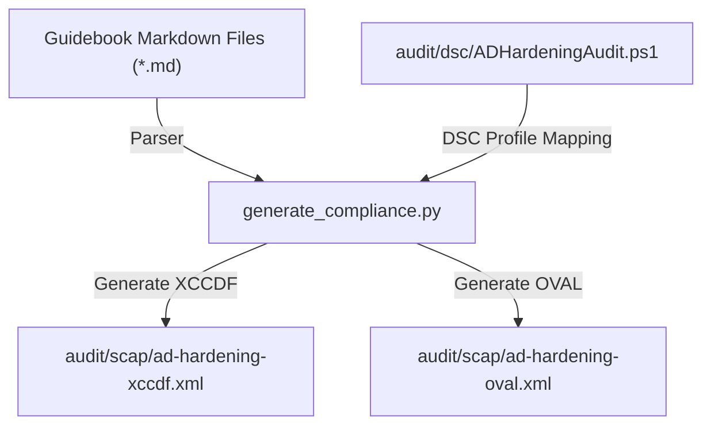

# SCAP Development Guide: XCCDF and OVAL Rules for Windows

This document provides technical instructions for security engineers and automated agents on how to implement, modify, validate, and check compliance rules within this repository. 

All SCAP manifests conform to **XCCDF 1.2** and **OVAL 5.11** (Windows Schema) and are programmatically generated and validated.

---

## The Automation Pipeline

To prevent inconsistencies, compliance manifests must **never** be manually edited. Instead, all changes are made in the source guidebook markdown files or the compilation scripts, and then compiled using the automation pipeline.

The generation workflow is as follows:



To run the pipeline and generate the manifests:
1. Open a PowerShell terminal.
2. Run the validation and generation chain:
   ```text
   python scripts/generate_compliance.py
   python scripts/generate_summary.py
   python scripts/compile_docs.py
   .\Verify-ADHardeningDocs.ps1
   ```

---

## Guidebook Markdown Rules Format

To generate automated tests, a requirement file must define its technical details under the `## Implementation Details` section using a specific parsing layout. If registry settings are defined, the generator extracts them into OVAL checks.

### Standard Registry List Layout

Registry settings must be documented using the following hierarchical bullet structure:

```markdown
## Implementation Details
* **Priority**: [High / Medium / Low]
* **GPO Path / Registry Location**:
  * **Registry Locations**:
    * `HKLM\SOFTWARE\Policies\Microsoft\Windows\System`
      * `EnableFontProviders` = `0` (REG_DWORD)
    * `HKLM\SOFTWARE\Policies\Microsoft\Windows NT\DNSClient`
      * `EnableMulticast` = `0` (REG_DWORD)
```

The registry parser matches:
- **Hive**: `HKLM` (HKEY_LOCAL_MACHINE) or `HKCU` (HKEY_CURRENT_USER).
- **Key Path**: The path following the hive. Dots/periods (e.g. `Client\1.0`) are fully supported.
- **Value Name**: The name inside backticks.
- **Value Data**: The value following the `=` symbol.
- **Value Type**: The registry data type inside parentheses (e.g. `(REG_DWORD)`, `(REG_SZ)`).

---

## OVAL XML Definitions Structure

The generated [ad-hardening-oval.xml](file:///c:/Users/Florian/OneDrive/Documents/Dev/ad-hardening/audit/scap/ad-hardening-oval.xml) is structured into four main collection blocks:
1. `<definitions>`: Rules containing one or more system test criteria.
2. `<tests>`: Evaluation logic joining a system object (what to collect) with a system state (the expected value).
3. `<objects>`: Definition of the system resource to inspect (e.g., registry key, service name, account property).
4. `<states>`: Definition of the expected values and validation operators.

### 1. Automated Registry Checks
Used to verify standard Group Policy Preferences, GPO registry extensions, and system parameters.

#### XML Object and State Templates
```xml
<windows:registry_test id="oval:org.adhardening:tst:2001001" version="1" comment="Check registry RunAsPPL" check="all">
  <windows:object object_ref="oval:org.adhardening:obj:2001001" />
  <windows:state state_ref="oval:org.adhardening:ste:2001001" />
</windows:registry_test>

<windows:registry_object id="oval:org.adhardening:obj:2001001" version="1">
  <windows:behaviors windows_view="64_bit" />
  <windows:hive>HKEY_LOCAL_MACHINE</windows:hive>
  <windows:key>SYSTEM\CurrentControlSet\Control\Lsa</windows:key>
  <windows:name>RunAsPPL</windows:name>
</windows:registry_object>

<windows:registry_state id="oval:org.adhardening:ste:2001001" version="1">
  <windows:type>reg_dword</windows:type>
  <windows:value datatype="int">1</windows:value>
</windows:registry_state>
```

#### Wildcard Key Paths (Dynamic Interface Resolution)
When querying adapter-specific settings (like disabling NetBIOS), use the `operation="pattern match"` attribute with standard regular expression wildcards (`.*`):
```xml
<windows:registry_object id="oval:org.adhardening:obj:2002002" version="1">
  <windows:behaviors windows_view="64_bit" />
  <windows:hive>HKEY_LOCAL_MACHINE</windows:hive>
  <windows:key operation="pattern match">SYSTEM\CurrentControlSet\Services\NetBT\Parameters\Interfaces\.*</windows:key>
  <windows:name>NetbiosOptions</windows:name>
</windows:registry_object>
```

---

### 2. User Rights Assignments Checks
Verifies local system user privilege allocations (e.g. denying interactive logon to Tier 0 groups).

#### XML Object and State Templates
```xml
<windows:userright_test id="oval:org.adhardening:tst:2201010" version="1" comment="Check User Right Assignment SeDenyInteractiveLogonRight" check="all">
  <windows:object object_ref="oval:org.adhardening:obj:2201010" />
  <windows:state state_ref="oval:org.adhardening:ste:2201010" />
</windows:userright_test>

<windows:userright_object id="oval:org.adhardening:obj:2201010" version="1">
  <windows:userright>SeDenyInteractiveLogonRight</windows:userright>
</windows:userright_object>

<windows:userright_state id="oval:org.adhardening:ste:2201010" version="1">
  <windows:trustee_sid operation="pattern match">^(S-1-5-21-.*-512|S-1-5-21-.*-519|S-1-5-21-.*-518)$</windows:trustee_sid>
</windows:userright_state>
```

---

### 3. Services Startup Configuration Checks
Verifies system service configurations. For cross-compatibility, these are validated by checking the registry startup type key of the target service.

* **Startup Type Mapping**:
  * `2` = Automatic
  * `3` = Manual
  * `4` = Disabled

#### XML Object and State Templates
```xml
<windows:registry_test id="oval:org.adhardening:tst:2008150" version="1" comment="Check Startup Configuration for Service Spooler" check="all">
  <windows:object object_ref="oval:org.adhardening:obj:2008150" />
  <windows:state state_ref="oval:org.adhardening:ste:2008150" />
</windows:registry_test>

<windows:registry_object id="oval:org.adhardening:obj:2008150" version="1">
  <windows:behaviors windows_view="64_bit" />
  <windows:hive>HKEY_LOCAL_MACHINE</windows:hive>
  <windows:key>SYSTEM\CurrentControlSet\Services\Spooler</windows:key>
  <windows:name>Start</windows:name>
</windows:registry_object>

<windows:registry_state id="oval:org.adhardening:ste:2008150" version="1">
  <windows:type>reg_dword</windows:type>
  <windows:value datatype="int">4</windows:value>
</windows:registry_state>
```

---

### 4. Local Account Policies (Password and Lockout)
Verifies SAM account settings and credential restriction criteria.

#### XML Object and State Templates (Password Policy)
```xml
<windows:passwordpolicy_test id="oval:org.adhardening:tst:2900000" version="1" comment="Check local Password Policy settings" check="all">
  <windows:object object_ref="oval:org.adhardening:obj:2900000" />
  <windows:state state_ref="oval:org.adhardening:ste:2900000" />
</windows:passwordpolicy_test>

<windows:passwordpolicy_object id="oval:org.adhardening:obj:2900000" version="1" />

<windows:passwordpolicy_state id="oval:org.adhardening:ste:2900000" version="1">
  <windows:min_passwd_len datatype="int">14</windows:min_passwd_len>
  <windows:password_complexity datatype="boolean">true</windows:password_complexity>
  <windows:password_hist_len datatype="int">24</windows:password_hist_len>
</windows:passwordpolicy_state>
```

#### XML Object and State Templates (Lockout Policy)
```xml
<windows:lockoutpolicy_test id="oval:org.adhardening:tst:2910000" version="1" comment="Check local Account Lockout Policy settings" check="all">
  <windows:object object_ref="oval:org.adhardening:obj:2910000" />
  <windows:state state_ref="oval:org.adhardening:ste:2910000" />
</windows:lockoutpolicy_test>

<windows:lockoutpolicy_object id="oval:org.adhardening:obj:2910000" version="1" />

<windows:lockoutpolicy_state id="oval:org.adhardening:ste:2910000" version="1">
  <windows:lockout_threshold datatype="int">10</windows:lockout_threshold>
  <windows:lockout_duration datatype="int">900</windows:lockout_duration>
  <windows:lockout_observation_window datatype="int">900</windows:lockout_observation_window>
</windows:lockoutpolicy_state>
```

---

## Validation and Diagnostics

Before finalizing changes to any compliance files, run verification steps to ensure no schema or link errors exist.

### 1. Schema Validation (OpenSCAP)
Validate that generated XML manifests strictly adhere to their respective SCAP specification schemas:

```powershell
oscap xccdf validate audit/scap/ad-hardening-xccdf.xml
oscap oval validate audit/scap/ad-hardening-oval.xml
```

### 2. Guidebook Verification Script
Run the unified repository check to inspect markdown syntax, local script blocks compile state, internal links, and OVAL/XCCDF structure integrity:

```powershell
.\Verify-ADHardeningDocs.ps1
```
